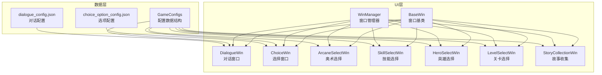
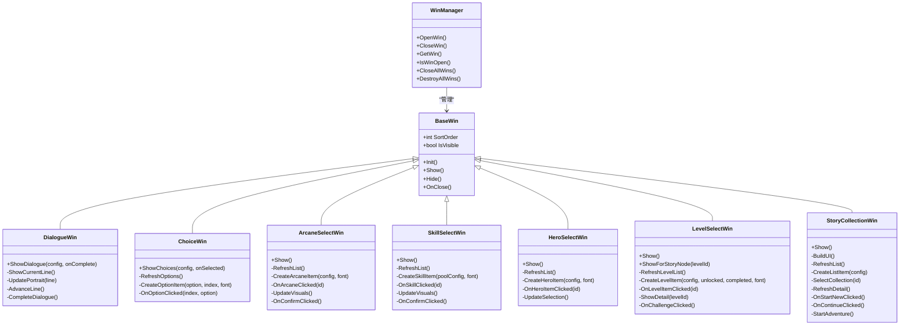
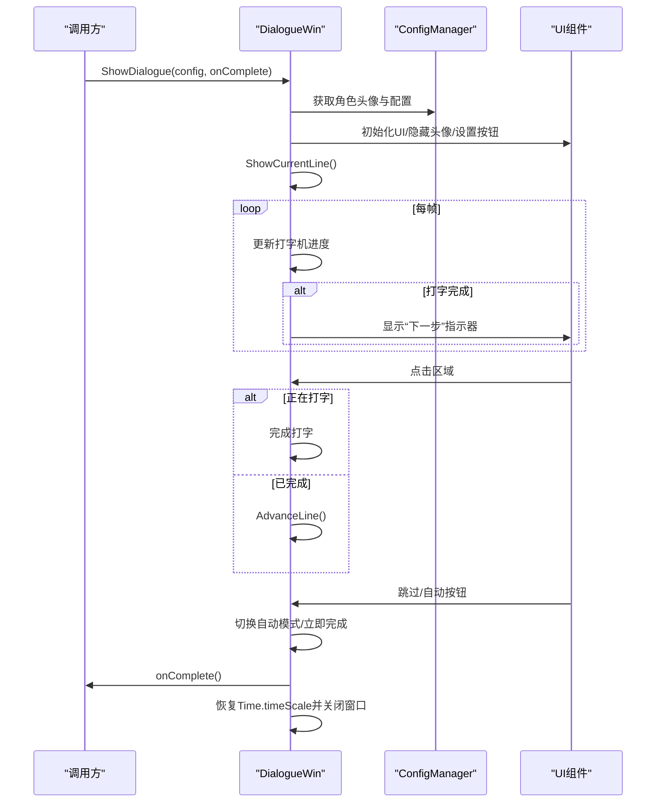
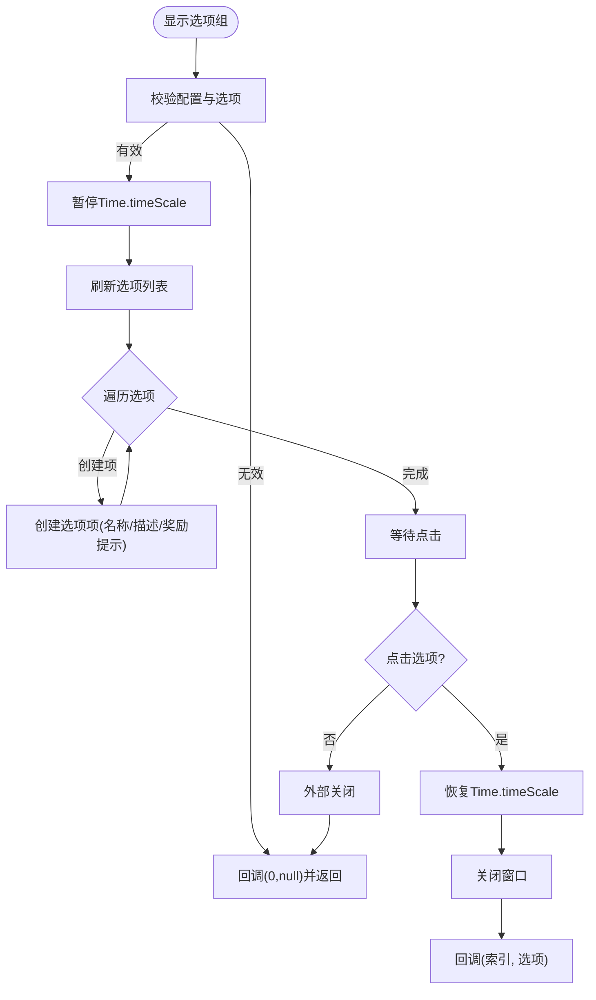
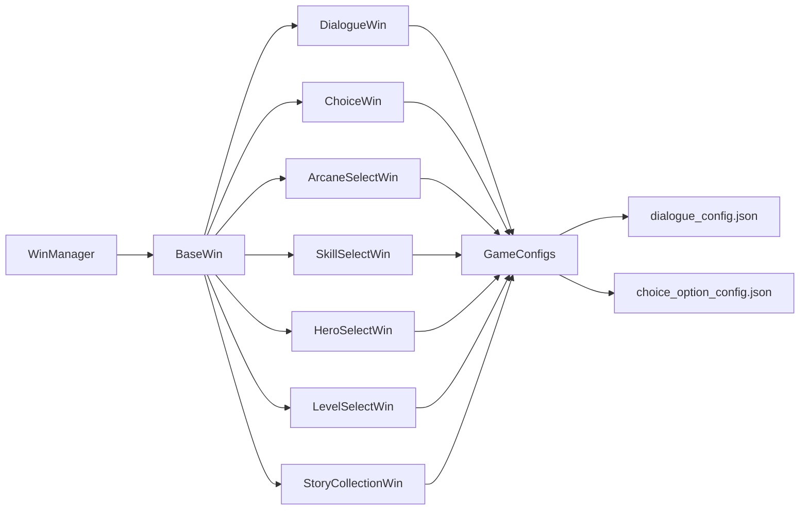

# 对话与选择界面

<cite>
**本文引用的文件**
- [Assets/Scripts/UI/DialogueWin.cs](file://Assets/Scripts/UI/DialogueWin.cs)
- [Assets/Scripts/UI/ChoiceWin.cs](file://Assets/Scripts/UI/ChoiceWin.cs)
- [Assets/Scripts/UI/ArcaneSelectWin.cs](file://Assets/Scripts/UI/ArcaneSelectWin.cs)
- [Assets/Scripts/UI/SkillSelectWin.cs](file://Assets/Scripts/UI/SkillSelectWin.cs)
- [Assets/Scripts/UI/HeroSelectWin.cs](file://Assets/Scripts/UI/HeroSelectWin.cs)
- [Assets/Scripts/UI/LevelSelectWin.cs](file://Assets/Scripts/UI/LevelSelectWin.cs)
- [Assets/Scripts/UI/StoryCollectionWin.cs](file://Assets/Scripts/UI/StoryCollectionWin.cs)
- [Assets/Scripts/UI/BaseWin.cs](file://Assets/Scripts/UI/BaseWin.cs)
- [Assets/Scripts/UI/WinManager.cs](file://Assets/Scripts/UI/WinManager.cs)
- [Assets/Scripts/Core/GameHelper.cs](file://Assets/Scripts/Core/GameHelper.cs)
- [Assets/Scripts/Data/GameConfigs.cs](file://Assets/Scripts/Data/GameConfigs.cs)
- [Assets/Resources/Configs/dialogue_config.json](file://Assets/Resources/Configs/dialogue_config.json)
- [Assets/Resources/Configs/choice_option_config.json](file://Assets/Resources/Configs/choice_option_config.json)
</cite>

## 目录
1. [简介](#简介)
2. [项目结构](#项目结构)
3. [核心组件](#核心组件)
4. [架构总览](#架构总览)
5. [详细组件分析](#详细组件分析)
6. [依赖关系分析](#依赖关系分析)
7. [性能考量](#性能考量)
8. [故障排查指南](#故障排查指南)
9. [结论](#结论)
10. [附录：扩展指南](#附录扩展指南)

## 简介
本文件面向GeometryTD的对话与选择界面系统，围绕以下目标展开：
- 深入解析DialogueWin对话窗口的设计与实现，涵盖文本显示、角色头像、推进机制与自动模式。
- 阐述ChoiceWin选择窗口的功能，说明分支选项的展示、选择逻辑与结果处理。
- 分析各类选择窗口：ArcaneSelectWin（奥术选择）、SkillSelectWin（技能选择）、HeroSelectWin（英雄选择）、LevelSelectWin（关卡选择）与StoryCollectionWin（故事收集界面）。
- 描述对话系统的交互流程，包括文本渲染、打字机效果与用户响应处理。
- 提供扩展指南，说明如何添加新的对话类型、修改文本格式与实现自定义动画效果。

## 项目结构
对话与选择界面位于UI层，采用统一的BaseWin基类与WinManager窗口管理器进行生命周期与层级排序管理；数据通过GameConfigs定义的配置类与Resources下的JSON配置文件提供。

图表来源
- [Assets/Scripts/UI/BaseWin.cs:1-32](file://Assets/Scripts/UI/BaseWin.cs#L1-L32)
- [Assets/Scripts/UI/WinManager.cs:1-195](file://Assets/Scripts/UI/WinManager.cs#L1-L195)
- [Assets/Scripts/UI/DialogueWin.cs:1-433](file://Assets/Scripts/UI/DialogueWin.cs#L1-L433)
- [Assets/Scripts/UI/ChoiceWin.cs:1-299](file://Assets/Scripts/UI/ChoiceWin.cs#L1-L299)
- [Assets/Scripts/UI/ArcaneSelectWin.cs:1-161](file://Assets/Scripts/UI/ArcaneSelectWin.cs#L1-L161)
- [Assets/Scripts/UI/SkillSelectWin.cs:1-165](file://Assets/Scripts/UI/SkillSelectWin.cs#L1-L165)
- [Assets/Scripts/UI/HeroSelectWin.cs:1-130](file://Assets/Scripts/UI/HeroSelectWin.cs#L1-L130)
- [Assets/Scripts/UI/LevelSelectWin.cs:1-248](file://Assets/Scripts/UI/LevelSelectWin.cs#L1-L248)
- [Assets/Scripts/UI/StoryCollectionWin.cs:1-610](file://Assets/Scripts/UI/StoryCollectionWin.cs#L1-L610)
- [Assets/Scripts/Data/GameConfigs.cs:675-775](file://Assets/Scripts/Data/GameConfigs.cs#L675-L775)
- [Assets/Resources/Configs/dialogue_config.json:1-146](file://Assets/Resources/Configs/dialogue_config.json#L1-L146)
- [Assets/Resources/Configs/choice_option_config.json:1-110](file://Assets/Resources/Configs/choice_option_config.json#L1-L110)

章节来源
- [Assets/Scripts/UI/BaseWin.cs:1-32](file://Assets/Scripts/UI/BaseWin.cs#L1-L32)
- [Assets/Scripts/UI/WinManager.cs:1-195](file://Assets/Scripts/UI/WinManager.cs#L1-L195)

## 核心组件
- BaseWin：所有窗口的抽象基类，提供Init/Show/Hide/OnClose等生命周期方法与排序字段。
- WinManager：单例窗口管理器，负责窗口实例化、缓存、层级排序与全屏遮罩设置。
- GameHelper：资源加载工具，提供字体、精灵与预制体加载，以及场景切换与窗口打开便捷方法。

章节来源
- [Assets/Scripts/UI/BaseWin.cs:1-32](file://Assets/Scripts/UI/BaseWin.cs#L1-L32)
- [Assets/Scripts/UI/WinManager.cs:1-195](file://Assets/Scripts/UI/WinManager.cs#L1-L195)
- [Assets/Scripts/Core/GameHelper.cs:1-84](file://Assets/Scripts/Core/GameHelper.cs#L1-L84)

## 架构总览
对话与选择界面遵循“配置驱动 + 数据模型 + UI窗口”的分层设计：
- 配置层：dialogue_config.json与choice_option_config.json提供对话与选项数据。
- 数据层：GameConfigs定义了对话行、选项组、角色、技能、关卡等数据结构。
- UI层：各窗口组件负责渲染与交互，使用WinManager统一管理生命周期与层级。

图表来源
- [Assets/Scripts/UI/BaseWin.cs:1-32](file://Assets/Scripts/UI/BaseWin.cs#L1-L32)
- [Assets/Scripts/UI/WinManager.cs:1-195](file://Assets/Scripts/UI/WinManager.cs#L1-L195)
- [Assets/Scripts/UI/DialogueWin.cs:1-433](file://Assets/Scripts/UI/DialogueWin.cs#L1-L433)
- [Assets/Scripts/UI/ChoiceWin.cs:1-299](file://Assets/Scripts/UI/ChoiceWin.cs#L1-L299)
- [Assets/Scripts/UI/ArcaneSelectWin.cs:1-161](file://Assets/Scripts/UI/ArcaneSelectWin.cs#L1-L161)
- [Assets/Scripts/UI/SkillSelectWin.cs:1-165](file://Assets/Scripts/UI/SkillSelectWin.cs#L1-L165)
- [Assets/Scripts/UI/HeroSelectWin.cs:1-130](file://Assets/Scripts/UI/HeroSelectWin.cs#L1-L130)
- [Assets/Scripts/UI/LevelSelectWin.cs:1-248](file://Assets/Scripts/UI/LevelSelectWin.cs#L1-L248)
- [Assets/Scripts/UI/StoryCollectionWin.cs:1-610](file://Assets/Scripts/UI/StoryCollectionWin.cs#L1-L610)

## 详细组件分析

### 对话窗口 DialogueWin
- 文本显示与打字机效果
  - 使用字符计数与定时器实现逐字输出，支持可调节的打字速度。
  - 文本更新在每帧循环中按时间步长推进，直至完整显示。
- 角色头像与侧边展示
  - 根据对话行中的角色ID与侧边标记，动态加载角色头像并高亮当前说话侧。
  - 未绑定UI时，支持运行时动态构建UI结构（根面板、点击区域、左右头像区、对话框、标题与文本、下一步指示器、跳过/自动按钮）。
- 推进机制与自动模式
  - 点击区域或文本末尾时显示“下一步”指示器；继续点击推进下一段。
  - 自动模式下按固定延迟自动推进，可随时切换。
- 时间缩放与关闭处理
  - 显示对话时暂停游戏时间，关闭或跳过时恢复时间缩放。
  - 外部关闭时回调完成委托，确保上层流程正确收尾。

图表来源
- [Assets/Scripts/UI/DialogueWin.cs:76-253](file://Assets/Scripts/UI/DialogueWin.cs#L76-L253)

章节来源
- [Assets/Scripts/UI/DialogueWin.cs:1-433](file://Assets/Scripts/UI/DialogueWin.cs#L1-L433)
- [Assets/Resources/Configs/dialogue_config.json:1-146](file://Assets/Resources/Configs/dialogue_config.json#L1-L146)
- [Assets/Scripts/Data/GameConfigs.cs:675-725](file://Assets/Scripts/Data/GameConfigs.cs#L675-L725)

### 选择窗口 ChoiceWin
- 选项列表构建
  - 动态生成选项项，包含名称、描述与奖励提示（效果名、金币、是否触发战斗）。
  - 使用垂直布局组与内容适配器保证滚动与自适应高度。
- 选择逻辑与回调
  - 点击选项后恢复时间缩放、关闭窗口并回调(1-based索引, 选项对象)。
  - 外部关闭时回调(0, null)，便于上层判断。
- UI结构
  - 支持运行时构建标题、滚动区域与选项容器，具备遮罩背景与点击穿透阻断。

图表来源
- [Assets/Scripts/UI/ChoiceWin.cs:52-201](file://Assets/Scripts/UI/ChoiceWin.cs#L52-L201)

章节来源
- [Assets/Scripts/UI/ChoiceWin.cs:1-299](file://Assets/Scripts/UI/ChoiceWin.cs#L1-L299)
- [Assets/Resources/Configs/choice_option_config.json:1-110](file://Assets/Resources/Configs/choice_option_config.json#L1-L110)
- [Assets/Scripts/Data/GameConfigs.cs:700-725](file://Assets/Scripts/Data/GameConfigs.cs#L700-L725)

### 奥术选择 ArcaneSelectWin
- 限制与状态
  - 最多选择固定数量（上限常量），记录已选ID集合与背景高亮。
- 列表构建
  - 从游戏配置读取所有可用奥术，动态创建项（名称、描述），支持点击切换选择状态。
- 确认与保存
  - 点击确认后对已选ID排序并写入游戏管理器的已装备列表，随后隐藏窗口。

章节来源
- [Assets/Scripts/UI/ArcaneSelectWin.cs:1-161](file://Assets/Scripts/UI/ArcaneSelectWin.cs#L1-L161)
- [Assets/Scripts/Data/GameConfigs.cs:427-452](file://Assets/Scripts/Data/GameConfigs.cs#L427-L452)

### 技能选择 SkillSelectWin
- 限制与状态
  - 必须选择固定数量（常量），按钮可交互性随数量变化。
- 列表构建
  - 从技能池配置读取技能池ID，创建项（名称、描述），点击切换选择。
- 确认与保存
  - 数量达标后确认，排序并写入游戏管理器的已装备技能列表，关闭窗口。

章节来源
- [Assets/Scripts/UI/SkillSelectWin.cs:1-165](file://Assets/Scripts/UI/SkillSelectWin.cs#L1-L165)
- [Assets/Scripts/Data/GameConfigs.cs:360-401](file://Assets/Scripts/Data/GameConfigs.cs#L360-L401)

### 英雄选择 HeroSelectWin
- 选择逻辑
  - 列出所有英雄，点击切换选中状态，即时同步到游戏管理器。
- 视觉反馈
  - 通过背景颜色区分当前选中项。

章节来源
- [Assets/Scripts/UI/HeroSelectWin.cs:1-130](file://Assets/Scripts/UI/HeroSelectWin.cs#L1-L130)
- [Assets/Scripts/Data/GameConfigs.cs:317-337](file://Assets/Scripts/Data/GameConfigs.cs#L317-L337)

### 关卡选择 LevelSelectWin
- 列表构建
  - 依据解锁与完成状态设置不同背景色；点击项显示详情面板。
- 详情面板
  - 展示精英怪物、Boss预览、通关条件与挑战按钮可用性。
- 挑战逻辑
  - 故事模式：直接执行当前节点。
  - 普通模式：检查解锁状态后选择并启动关卡。

章节来源
- [Assets/Scripts/UI/LevelSelectWin.cs:1-248](file://Assets/Scripts/UI/LevelSelectWin.cs#L1-L248)
- [Assets/Scripts/Data/GameConfigs.cs:492-539](file://Assets/Scripts/Data/GameConfigs.cs#L492-L539)

### 故事收集 StoryCollectionWin
- 双面板布局
  - 左侧列表：故事集图标、名称与完成度/存档状态；右侧详情：图标、名称、描述、进度、存档状态与操作按钮。
- 交互流程
  - 选择故事集 → 刷新详情 → 新冒险（可覆盖存档）/继续。
- 确认覆盖
  - 通过遮罩层弹窗确认覆盖存档。

章节来源
- [Assets/Scripts/UI/StoryCollectionWin.cs:1-610](file://Assets/Scripts/UI/StoryCollectionWin.cs#L1-L610)
- [Assets/Scripts/Data/GameConfigs.cs:613-673](file://Assets/Scripts/Data/GameConfigs.cs#L613-L673)

## 依赖关系分析
- 窗口管理
  - 各窗口均继承BaseWin并通过WinManager进行实例化、缓存与层级排序。
  - WinManager确保每个窗口拥有Canvas与遮罩Image以阻断点击穿透。
- 数据依赖
  - 对话窗口依赖RoleConfig与DialogueConfig；选择窗口依赖ChoiceGroupConfig与PassiveEffectConfig。
  - 各选择窗口依赖GameConfigs中的ArcaneConfig、SkillPoolConfig、HeroConfig、LevelConfig等。
- 资源加载
  - GameHelper统一加载字体、精灵与预制体，避免硬编码路径。

图表来源
- [Assets/Scripts/UI/WinManager.cs:61-102](file://Assets/Scripts/UI/WinManager.cs#L61-L102)
- [Assets/Scripts/UI/BaseWin.cs:1-32](file://Assets/Scripts/UI/BaseWin.cs#L1-L32)
- [Assets/Scripts/Data/GameConfigs.cs:675-775](file://Assets/Scripts/Data/GameConfigs.cs#L675-L775)
- [Assets/Resources/Configs/dialogue_config.json:1-146](file://Assets/Resources/Configs/dialogue_config.json#L1-L146)
- [Assets/Resources/Configs/choice_option_config.json:1-110](file://Assets/Resources/Configs/choice_option_config.json#L1-L110)

章节来源
- [Assets/Scripts/UI/WinManager.cs:1-195](file://Assets/Scripts/UI/WinManager.cs#L1-L195)
- [Assets/Scripts/UI/BaseWin.cs:1-32](file://Assets/Scripts/UI/BaseWin.cs#L1-L32)
- [Assets/Scripts/Data/GameConfigs.cs:675-775](file://Assets/Scripts/Data/GameConfigs.cs#L675-L775)

## 性能考量
- 打字机渲染
  - 每帧仅进行字符串截取与一次文本赋值，复杂度O(n)逐字推进，n为当前显示字符数。
- 选项列表
  - 使用LayoutElement与ContentSizeFitter，避免频繁重排；建议在数据量大时启用虚拟化或分页。
- 头像与字体
  - 通过GameHelper缓存字体，精灵按需加载；注意资源包大小与内存占用。
- 时间缩放
  - 对话与选择窗口暂停Time.timeScale，注意与其他需要实时更新的系统（如UI动画）的兼容性。

## 故障排查指南
- 窗口未显示或点击无响应
  - 检查WinManager是否正确创建Canvas与遮罩Image，确保RectTransform锚点与偏移设置为全屏。
  - 确认窗口组件挂载在预制体根节点且类型匹配。
- 对话不推进或头像不显示
  - 检查DialogueConfig与RoleConfig是否存在对应ID；确认portraitPath有效。
  - 若使用动态UI构建，确认字体加载成功。
- 选择窗口回调异常
  - 外部关闭时会回调(0, null)，请在上层逻辑中处理该情况。
- 奥术/技能/英雄选择未生效
  - 确认写入游戏管理器的接口调用成功，且后续流程正确读取已装备列表。

章节来源
- [Assets/Scripts/UI/WinManager.cs:157-186](file://Assets/Scripts/UI/WinManager.cs#L157-L186)
- [Assets/Scripts/UI/DialogueWin.cs:130-162](file://Assets/Scripts/UI/DialogueWin.cs#L130-L162)
- [Assets/Scripts/UI/ChoiceWin.cs:33-46](file://Assets/Scripts/UI/ChoiceWin.cs#L33-L46)
- [Assets/Scripts/UI/ArcaneSelectWin.cs:150-158](file://Assets/Scripts/UI/ArcaneSelectWin.cs#L150-L158)
- [Assets/Scripts/UI/SkillSelectWin.cs:152-161](file://Assets/Scripts/UI/SkillSelectWin.cs#L152-L161)
- [Assets/Scripts/UI/HeroSelectWin.cs:111-117](file://Assets/Scripts/UI/HeroSelectWin.cs#L111-L117)

## 结论
对话与选择界面系统以清晰的分层设计与统一的窗口管理机制实现了良好的可维护性与扩展性。对话窗口提供了沉浸式的文本体验，选择窗口则通过直观的选项与即时反馈增强了决策过程。各类选择窗口针对不同业务需求设置了明确的约束与视觉反馈，配合配置驱动的数据模型，使得新增内容与调整变得简单可控。

## 附录：扩展指南

### 添加新的对话类型
- 在dialogue_config.json中新增DialogueConfig条目，包含多段对话行（含说话者、角色ID、头像侧与文本）。
- 在GameConfigs中确保DialogueConfig与DialogueLine结构与JSON一致。
- 如需角色头像，准备角色配置并提供portraitPath；否则可留空。

章节来源
- [Assets/Resources/Configs/dialogue_config.json:1-146](file://Assets/Resources/Configs/dialogue_config.json#L1-L146)
- [Assets/Scripts/Data/GameConfigs.cs:675-725](file://Assets/Scripts/Data/GameConfigs.cs#L675-L725)

### 修改文本格式与样式
- 字体与字号：通过GameHelper.LoadFont获取字体，所有动态UI构建均使用该字体。
- 文本颜色与对齐：在各窗口的UI构建函数中设置Text组件的color与alignment。
- 建议：集中管理字体与主题色，避免散落的硬编码。

章节来源
- [Assets/Scripts/Core/GameHelper.cs:49-58](file://Assets/Scripts/Core/GameHelper.cs#L49-L58)
- [Assets/Scripts/UI/DialogueWin.cs:306-332](file://Assets/Scripts/UI/DialogueWin.cs#L306-L332)
- [Assets/Scripts/UI/ChoiceWin.cs:251-296](file://Assets/Scripts/UI/ChoiceWin.cs#L251-L296)

### 实现自定义动画效果
- 对话推进动画：可在AdvanceLine前后插入淡入/滑动等过渡效果，结合UI组件的CanvasGroup与Animator。
- 选项高亮：通过修改背景Image颜色或添加阴影/描边，增强点击反馈。
- 注意：保持与Time.timeScale暂停机制兼容，避免动画时间轴异常。

章节来源
- [Assets/Scripts/UI/DialogueWin.cs:164-193](file://Assets/Scripts/UI/DialogueWin.cs#L164-L193)
- [Assets/Scripts/UI/ChoiceWin.cs:136-150](file://Assets/Scripts/UI/ChoiceWin.cs#L136-L150)

### 新增选择窗口类型
- 继承BaseWin并实现Show/OnClose；在WinManager中注册窗口路径。
- 使用动态UI构建模板（参考各窗口的BuildUI方法），确保全屏遮罩与点击阻断。
- 设计数据结构与配置文件，与GameConfigs保持一致。

章节来源
- [Assets/Scripts/UI/BaseWin.cs:1-32](file://Assets/Scripts/UI/BaseWin.cs#L1-L32)
- [Assets/Scripts/UI/WinManager.cs:61-102](file://Assets/Scripts/UI/WinManager.cs#L61-L102)
- [Assets/Scripts/UI/StoryCollectionWin.cs:52-270](file://Assets/Scripts/UI/StoryCollectionWin.cs#L52-L270)