# 战斗界面系统

<cite>
**本文档引用的文件**
- [BattleUI.cs](file://Assets/Scripts/UI/Scenes/BattleUI.cs)
- [HealthBarUI.cs](file://Assets/Scripts/UI/HealthBarUI.cs)
- [FloatingTextUI.cs](file://Assets/Scripts/UI/FloatingTextUI.cs)
- [BattleManager.cs](file://Assets/Scripts/Battle/BattleManager.cs)
- [BossController.cs](file://Assets/Scripts/Battle/BossController.cs)
- [GameHelper.cs](file://Assets/Scripts/Core/GameHelper.cs)
- [WinManager.cs](file://Assets/Scripts/UI/WinManager.cs)
- [BaseWin.cs](file://Assets/Scripts/UI/BaseWin.cs)
- [GameManager.cs](file://Assets/Scripts/Core/GameManager.cs)
- [GameConsts.cs](file://Assets/Scripts/Data/GameConsts.cs)
</cite>

## 更新摘要
**变更内容**
- 新增BattleUI中的速度控制功能：新增了倍速切换按钮（0.5x、1x、1.5x），通过ToggleGroup实现
- 新增GameManager的倍速系统集成，支持暂停、拖拽慢放和场景切换时的倍速管理
- 新增GameSpeed常量定义，提供标准倍速值（stop、drag、normal、speed1、speed2、speed3）
- 新增RefreshSpeedToggleVisual方法，防止拖拽操作导致的状态丢失
- 更新战斗界面的状态管理，包含倍速控制的完整生命周期

## 目录
1. [简介](#简介)
2. [项目结构](#项目结构)
3. [核心组件](#核心组件)
4. [架构概览](#架构概览)
5. [详细组件分析](#详细组件分析)
6. [依赖关系分析](#依赖关系分析)
7. [性能考虑](#性能考虑)
8. [故障排除指南](#故障排除指南)
9. [结论](#结论)
10. [附录](#附录)

## 简介

GeometryTD的战斗界面系统是一个高度模块化的UI框架，专为实时策略战斗设计。该系统提供了完整的战斗状态可视化、即时反馈机制和用户交互控制。系统包含四个主要组件：BattleUI战斗界面控制器、HealthBarUI健康条组件、FloatingTextUI浮动文本系统和GameManager倍速控制系统。

**更新** 战斗界面系统现已集成全新的倍速控制功能，允许玩家在战斗过程中调整游戏播放速度，提供更加灵活的游戏体验。该功能通过ToggleGroup实现，与GameManager的倍速系统深度集成，支持暂停、拖拽慢放等多种速度控制模式。

战斗界面系统的核心设计理念是分离关注点和可扩展性。每个UI组件都有明确的职责边界，通过BattleManager和GameManager进行协调，确保战斗过程中的信息传递既高效又直观。

## 项目结构

战斗界面系统位于Unity项目的Scripts/UI目录下，采用按功能分层的组织方式：

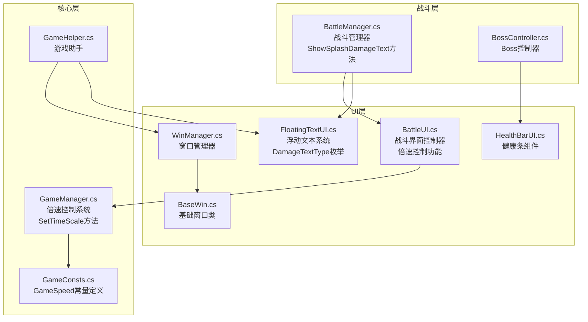

**图表来源**
- [BattleUI.cs:1-202](file://Assets/Scripts/UI/Scenes/BattleUI.cs#L1-L202)
- [HealthBarUI.cs:1-36](file://Assets/Scripts/UI/HealthBarUI.cs#L1-L36)
- [FloatingTextUI.cs:1-199](file://Assets/Scripts/UI/FloatingTextUI.cs#L1-L199)
- [BattleManager.cs:1-259](file://Assets/Scripts/Battle/BattleManager.cs#L1-L259)
- [GameManager.cs:1-325](file://Assets/Scripts/Core/GameManager.cs#L1-L325)
- [GameConsts.cs:263-272](file://Assets/Scripts/Data/GameConsts.cs#L263-L272)

**章节来源**
- [BattleUI.cs:1-202](file://Assets/Scripts/UI/Scenes/BattleUI.cs#L1-L202)
- [HealthBarUI.cs:1-36](file://Assets/Scripts/UI/HealthBarUI.cs#L1-L36)
- [FloatingTextUI.cs:1-199](file://Assets/Scripts/UI/FloatingTextUI.cs#L1-L199)

## 核心组件

### BattleUI战斗界面控制器

**更新** BattleUI是战斗界面的核心控制器，负责管理整个战斗过程中的UI状态。它实现了三种主要模式：普通击杀进度模式、Boss血量模式和倍速控制模式。

**关键特性：**
- 动态进度条管理
- 模式切换机制
- 结算面板控制
- 返回按钮交互
- **新增** 倍速控制功能

### HealthBarUI健康条组件

HealthBarUI是一个轻量级的健康条组件，专门用于显示角色的生命值状态。它提供了简洁的接口来更新血量显示。

**关键特性：**
- 数值显示格式化
- 文本可见性控制
- 动态数值更新

### FloatingTextUI浮动文本系统

**更新** FloatingTextUI是本次重大增强的核心组件，负责处理所有即时视觉反馈，包括伤害数字、治疗效果和爆炸溅射效果。该系统使用DamageTextType枚举支持两种不同的文本显示类型。

**关键特性：**
- **DamageTextType枚举支持**：Normal（普通伤害/治疗）和Splash（爆炸溅射）
- **协程驱动的动画系统**
- **左右交替偏移机制**：防止文本重叠
- **爆炸缩放效果**：快速放大-回弹-淡出动画
- **颜色区分系统**：绿色治疗、浅红色爆炸、浅黄色普通伤害
- **随机位置生成**：围绕目标身体的随机偏移
- **自定义字体支持**
- **世界空间定位**

### GameManager倍速控制系统

**新增** GameManager是倍速控制的核心系统，负责统一管理游戏的时间缩放。它提供了完整的倍速控制API，支持多种速度模式。

**关键特性：**
- **倍速设置**：SetTimeScale方法统一设置Time.timeScale
- **暂停功能**：PauseGame方法将倍速设为0
- **拖拽慢放**：StartDragSlowMotion和EndDragSlowMotion支持固定0.3倍速
- **场景切换管理**：ResetTimeScale根据场景自动恢复合适的倍速
- **状态持久化**：保存玩家选择的倍速设置

### GameConsts.GameSpeed常量定义

**新增** GameConsts类中的GameSpeed常量提供了标准的倍速值定义，确保系统的一致性和可维护性。

**关键常量：**
- `stop = 0f`：完全停止
- `drag = 0.3f`：拖拽慢放速度
- `normal = 1f`：正常速度
- `speed1 = 0.5f`：0.5倍速
- `speed2 = 1f`：1倍速
- `speed3 = 1.5f`：1.5倍速

**章节来源**
- [BattleUI.cs:17-21](file://Assets/Scripts/UI/Scenes/BattleUI.cs#L17-L21)
- [BattleUI.cs:42-53](file://Assets/Scripts/UI/Scenes/BattleUI.cs#L42-L53)
- [GameManager.cs:247-322](file://Assets/Scripts/Core/GameManager.cs#L247-L322)
- [GameConsts.cs:263-272](file://Assets/Scripts/Data/GameConsts.cs#L263-L272)

## 架构概览

**更新** 战斗界面系统采用分层架构设计，现已集成倍速控制功能，确保各组件间的松耦合和高内聚：

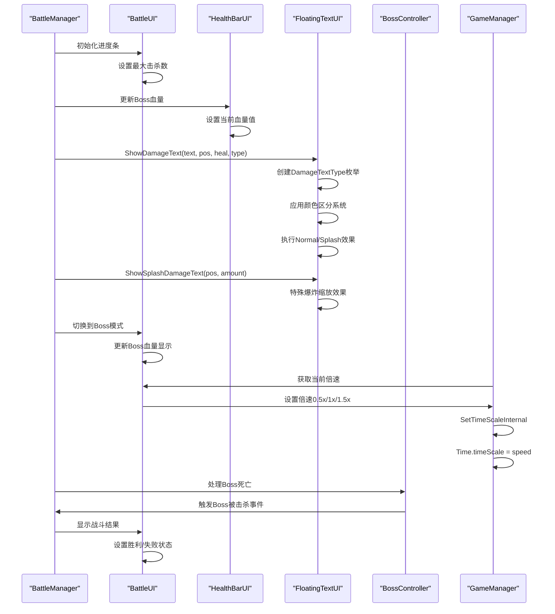

**图表来源**
- [BattleManager.cs:63-93](file://Assets/Scripts/Battle/BattleManager.cs#L63-L93)
- [BattleUI.cs:61-78](file://Assets/Scripts/UI/Scenes/BattleUI.cs#L61-L78)
- [GameManager.cs:251-263](file://Assets/Scripts/Core/GameManager.cs#L251-L263)

系统架构的关键优势在于其事件驱动的设计模式和新增的倍速控制功能，各个组件通过BattleManager和GameManager进行协调，避免了直接的耦合依赖。

## 详细组件分析

### BattleUI战斗界面控制器

**更新** BattleUI实现了完整的战斗界面状态管理，包括以下核心功能：

#### 进度条管理系统

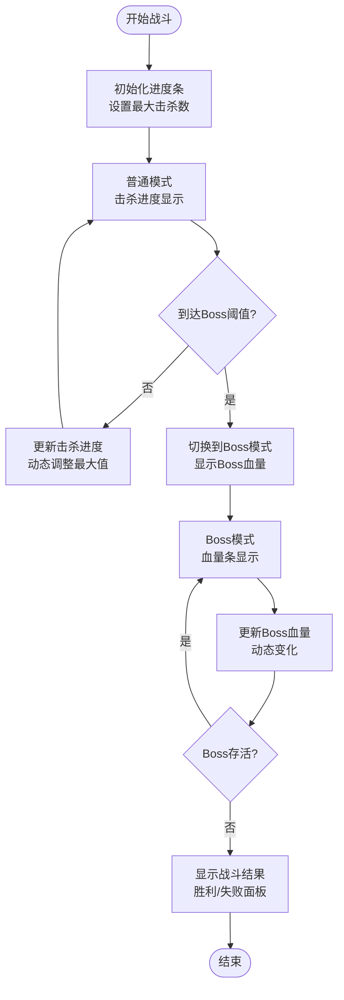

**图表来源**
- [BattleUI.cs:89-161](file://Assets/Scripts/UI/Scenes/BattleUI.cs#L89-L161)

#### 倍速控制功能

**新增** BattleUI现在集成了完整的倍速控制功能：

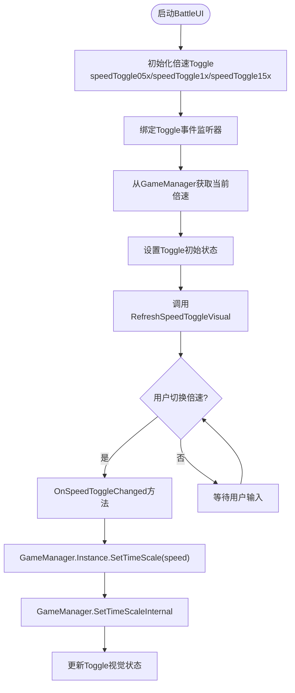

**图表来源**
- [BattleUI.cs:27-54](file://Assets/Scripts/UI/Scenes/BattleUI.cs#L27-L54)
- [BattleUI.cs:81-87](file://Assets/Scripts/UI/Scenes/BattleUI.cs#L81-L87)

#### 模式切换机制

BattleUI支持三种显示模式的无缝切换：

1. **普通模式**：显示怪物击杀进度，使用标准的Slider组件
2. **Boss模式**：显示Boss血量，自动切换到血量显示模式
3. **倍速模式**：通过ToggleGroup控制游戏播放速度

#### 结算面板控制

战斗结束后，BattleUI负责显示最终结果：
- 胜利时显示金色标题
- 失败时显示红色标题
- 支持返回主菜单或故事场景

**章节来源**
- [BattleUI.cs:17-21](file://Assets/Scripts/UI/Scenes/BattleUI.cs#L17-L21)
- [BattleUI.cs:27-54](file://Assets/Scripts/UI/Scenes/BattleUI.cs#L27-L54)
- [BattleUI.cs:81-87](file://Assets/Scripts/UI/Scenes/BattleUI.cs#L81-L87)

### HealthBarUI健康条组件

HealthBarUI是一个专门的健康条显示组件，具有以下特点：

#### 数据绑定机制

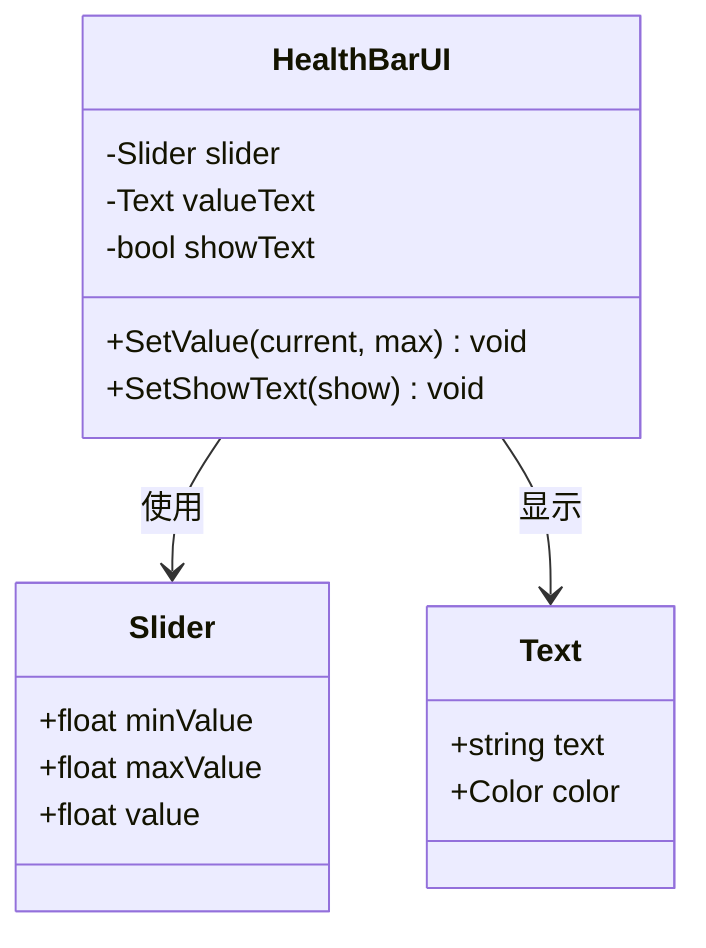

**图表来源**
- [HealthBarUI.cs:6-34](file://Assets/Scripts/UI/HealthBarUI.cs#L6-L34)

#### 数值格式化和显示

HealthBarUI提供了智能的数值格式化功能：
- 使用Mathf.CeilToInt进行向上取整
- 自动格式化为"当前值/最大值"格式
- 可选的文本显示控制

**章节来源**
- [HealthBarUI.cs:12-33](file://Assets/Scripts/UI/HealthBarUI.cs#L12-L33)

### FloatingTextUI浮动文本系统

**更新** FloatingTextUI实现了完整的即时视觉反馈系统，现已集成DamageTextType枚举系统：

#### DamageTextType枚举系统

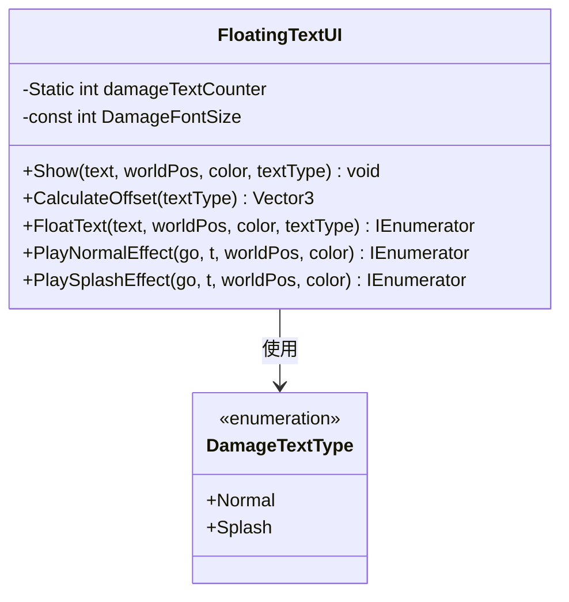

**图表来源**
- [FloatingTextUI.cs:10-14](file://Assets/Scripts/UI/FloatingTextUI.cs#L10-L14)
- [FloatingTextUI.cs:16-199](file://Assets/Scripts/UI/FloatingTextUI.cs#L16-L199)

#### 动画生命周期

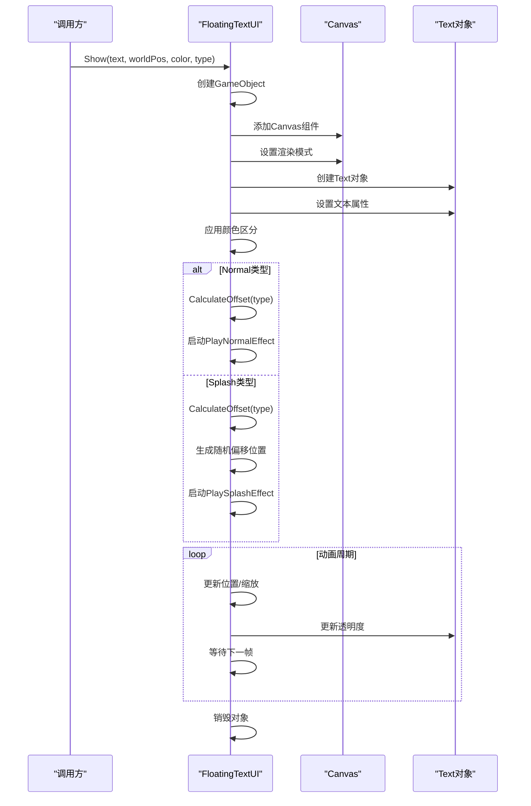

**图表来源**
- [FloatingTextUI.cs:46-90](file://Assets/Scripts/UI/FloatingTextUI.cs#L46-L90)
- [FloatingTextUI.cs:95-119](file://Assets/Scripts/UI/FloatingTextUI.cs#L95-L119)
- [FloatingTextUI.cs:124-196](file://Assets/Scripts/UI/FloatingTextUI.cs#L124-L196)

#### 动画参数配置

系统使用精心设计的动画参数：
- **普通效果**：0.8秒持续时间，1.2单位上升距离
- **爆炸效果**：0.2秒快速放大，0.15秒保持，0.15秒淡出
- **缩放动画**：从0.01倍快速放大到1.2倍再回弹到1.0倍
- **透明度衰减**：线性渐隐效果

#### 颜色区分系统

**更新** BattleManager现在根据DamageTextType和isHeal参数应用不同的颜色：

- **治疗效果**：绿色（0.2f, 0.9f, 0.3f）
- **爆炸溅射伤害**：浅红色（1f, 0.6f, 0.6f）
- **普通伤害**：浅黄色（1f, 0.95f, 0.5f）

#### 左右交替偏移机制

**更新** FloatingTextUI现在使用damageTextCounter实现左右交替偏移：
- 偶数偏移：向右偏移（side = 1）
- 奇数偏移：向左偏移（side = -1）
- 随机X轴偏移：0.2f到0.4f单位
- 固定Y轴偏移：0.3f到0.5f单位

#### 爆炸缩放效果

**更新** PlaySplashEffect方法实现了复杂的爆炸缩放动画：
- **阶段1**：0.2秒快速放大（0.01到1.2倍）
- **阶段2**：0.08秒回弹到正常大小
- **阶段3**：0.15秒保持不动
- **阶段4**：0.15秒快速淡出

#### 字体和样式支持

FloatingTextUI集成了GameHelper的字体加载机制：
- 支持自定义字体加载
- 默认回退到系统内置字体
- 统一的文本样式配置

**章节来源**
- [FloatingTextUI.cs:10-14](file://Assets/Scripts/UI/FloatingTextUI.cs#L10-L14)
- [FloatingTextUI.cs:18-41](file://Assets/Scripts/UI/FloatingTextUI.cs#L18-L41)
- [FloatingTextUI.cs:46-90](file://Assets/Scripts/UI/FloatingTextUI.cs#L46-L90)
- [FloatingTextUI.cs:124-196](file://Assets/Scripts/UI/FloatingTextUI.cs#L124-L196)
- [GameHelper.cs:49-58](file://Assets/Scripts/Core/GameHelper.cs#L49-L58)

### GameManager倍速控制系统

**新增** GameManager是倍速控制的核心系统，负责统一管理游戏的时间缩放：

#### 倍速设置机制

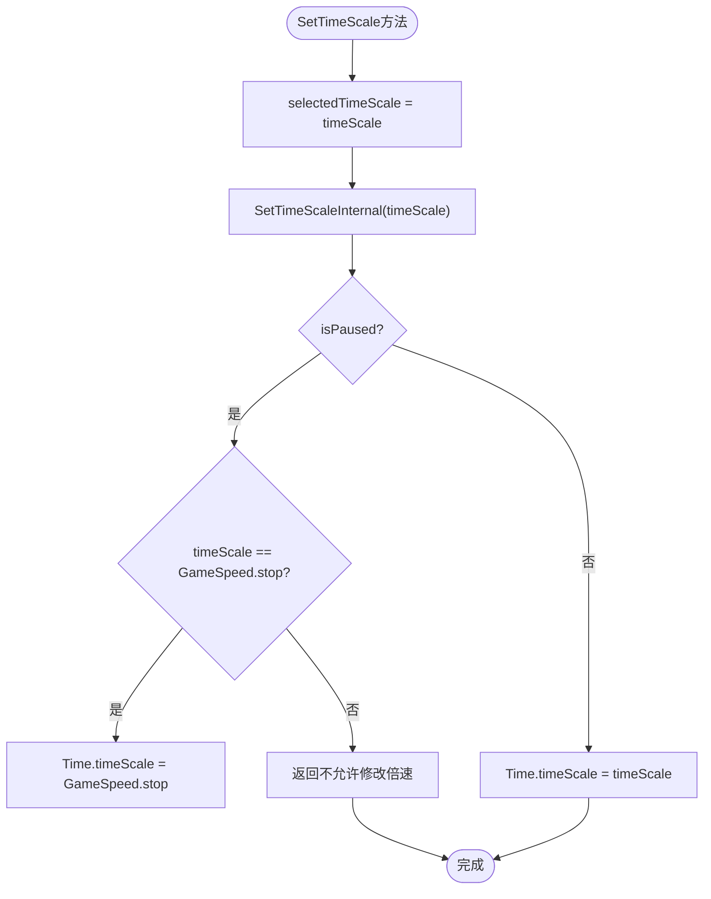

**图表来源**
- [GameManager.cs:268-272](file://Assets/Scripts/Core/GameManager.cs#L268-L272)
- [GameManager.cs:251-263](file://Assets/Scripts/Core/GameManager.cs#L251-L263)

#### 场景切换管理

GameManager还负责在场景切换时管理倍速状态：

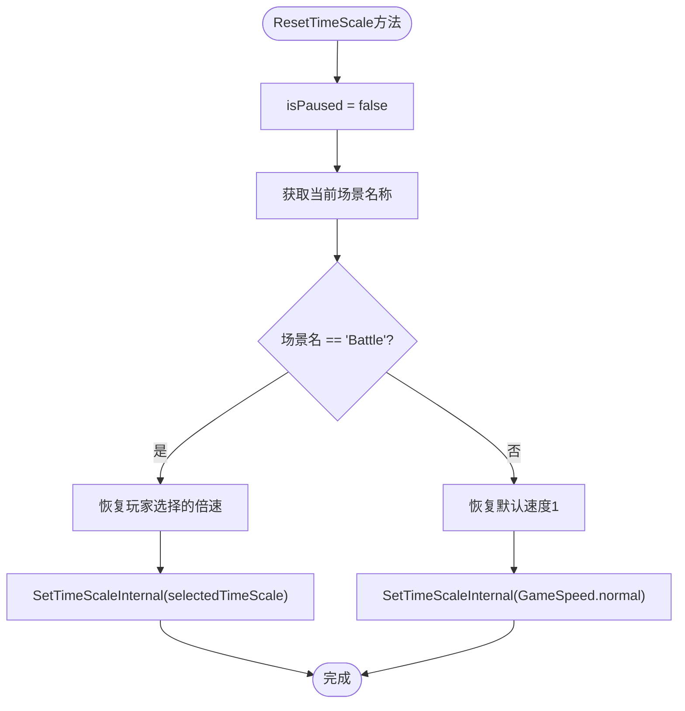

**图表来源**
- [GameManager.cs:303-318](file://Assets/Scripts/Core/GameManager.cs#L303-L318)

#### 拖拽慢放功能

GameManager支持特殊的拖拽慢放模式：
- `StartDragSlowMotion()`：将倍速固定为0.3f
- `EndDragSlowMotion()`：恢复到玩家选择的倍速
- 暂停状态下不允许修改倍速

**章节来源**
- [GameManager.cs:247-322](file://Assets/Scripts/Core/GameManager.cs#L247-L322)

### 战斗界面状态管理

**更新** 战斗界面的状态管理现已集成倍速控制功能：

#### 状态转换流程

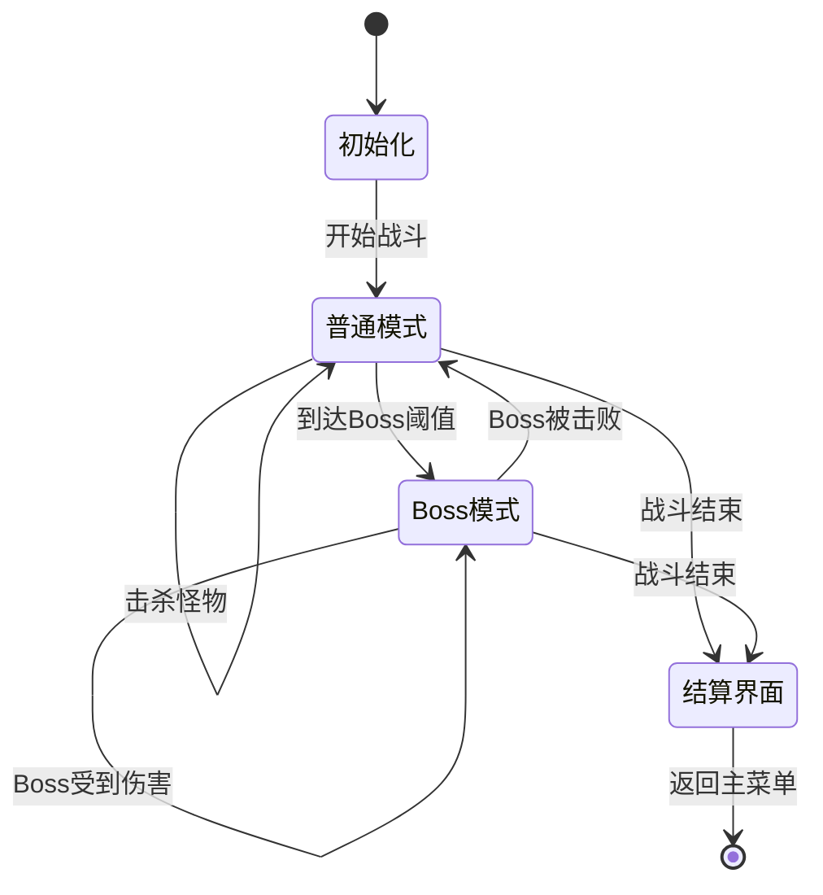

#### 用户交互响应

系统提供了完整的用户交互支持：
- 返回按钮的多场景适配
- 故事模式和普通模式的不同行为
- 实时的战斗状态反馈
- **新增** 倍速控制的实时响应

#### 倍速控制流程

**新增** BattleUI的倍速控制流程：

```csharp
// ToggleGroup事件绑定
speedToggle05x.onValueChanged.AddListener((isOn) => OnSpeedToggleChanged(isOn, GameSpeed.speed1));
speedToggle1x.onValueChanged.AddListener((isOn) => OnSpeedToggleChanged(isOn, GameSpeed.speed2));
speedToggle15x.onValueChanged.AddListener((isOn) => OnSpeedToggleChanged(isOn, GameSpeed.speed3));

// 倍速切换处理
private void OnSpeedToggleChanged(bool isOn, float speed)
{
    if (isOn)
    {
        GameManager.Instance.SetTimeScale(speed);
    }
}

// 防止拖拽操作导致状态丢失
private void RefreshSpeedToggleVisual()
{
    float selectedSpeed = GameManager.Instance.getSelectedTimeScale();
    
    // 使用isOn赋值确保触发完整的视觉更新
    bool should05x = Mathf.Approximately(selectedSpeed, GameSpeed.speed1);
    bool should1x = Mathf.Approximately(selectedSpeed, GameSpeed.speed2);
    bool should15x = Mathf.Approximately(selectedSpeed, GameSpeed.speed3);
    
    if (should05x)
    {
        speedToggle05x.isOn = true;
    } else if (should1x)
    {
        speedToggle1x.isOn = true;
    } else if (should15x)
    {
        speedToggle15x.isOn = true;
    }
}
```

**章节来源**
- [BattleUI.cs:42-53](file://Assets/Scripts/UI/Scenes/BattleUI.cs#L42-L53)
- [BattleUI.cs:81-87](file://Assets/Scripts/UI/Scenes/BattleUI.cs#L81-L87)
- [BattleUI.cs:59-78](file://Assets/Scripts/UI/Scenes/BattleUI.cs#L59-L78)

## 依赖关系分析

**更新** 战斗界面系统的依赖关系现已集成倍速控制功能：

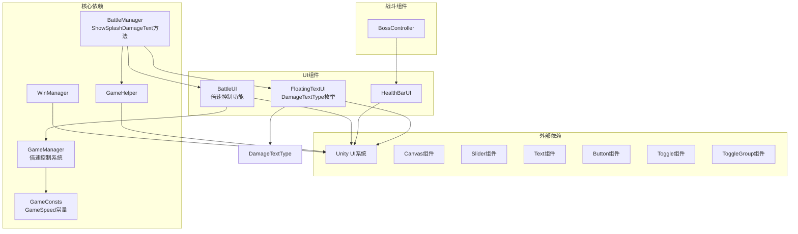

**图表来源**
- [BattleManager.cs:17-25](file://Assets/Scripts/Battle/BattleManager.cs#L17-L25)
- [BattleUI.cs:8-15](file://Assets/Scripts/UI/Scenes/BattleUI.cs#L8-L15)
- [HealthBarUI.cs:8-10](file://Assets/Scripts/UI/HealthBarUI.cs#L8-L10)
- [FloatingTextUI.cs:10-14](file://Assets/Scripts/UI/FloatingTextUI.cs#L10-L14)
- [GameManager.cs:247-322](file://Assets/Scripts/Core/GameManager.cs#L247-L322)
- [GameConsts.cs:263-272](file://Assets/Scripts/Data/GameConsts.cs#L263-L272)

### 组件耦合分析

系统采用了松耦合的设计原则：
- **BattleUI**与**BattleManager**通过接口通信
- **HealthBarUI**与**BossController**通过事件通知
- **FloatingTextUI**与**BattleManager**通过方法调用和DamageTextType枚举
- **BattleUI**与**GameManager**通过倍速控制接口
- 各组件间无直接依赖，通过GameHelper进行间接通信

**章节来源**
- [BattleManager.cs:17-25](file://Assets/Scripts/Battle/BattleManager.cs#L17-L25)
- [BossController.cs:27-275](file://Assets/Scripts/Battle/BossController.cs#L27-L275)
- [BattleUI.cs:42-53](file://Assets/Scripts/UI/Scenes/BattleUI.cs#L42-L53)

## 性能考虑

**更新** 战斗界面系统在设计时充分考虑了性能优化，现已包含倍速控制功能的性能考量：

### 内存管理

- **FloatingTextUI**使用协程而非持续运行的脚本，避免内存泄漏
- **WinManager**实现了窗口缓存机制，减少频繁的对象创建
- **GameHelper**提供了资源缓存，避免重复的资源加载
- **damageTextCounter**静态变量避免额外的实例存储
- **新增** **BattleUI**的Toggle事件监听器使用一次性绑定，避免重复注册

### 渲染优化

- **FloatingTextUI**使用WorldSpace渲染模式，减少Canvas数量
- **HealthBarUI**的文本显示可选关闭，降低渲染开销
- **BattleUI**的进度条使用Unity原生组件，性能最优
- **新增** **BattleUI**的倍速Toggle使用ToggleGroup，减少事件处理开销
- **DamageTextType枚举**使用常量值，避免运行时计算

### 动画性能

- **FloatingTextUI**的动画使用Time.deltaTime进行帧率无关计算
- **HealthBarUI**的数值更新使用lerp插值，提供平滑过渡
- **BattleUI**的状态切换避免不必要的UI重绘
- **新增** **BattleUI**的倍速切换使用isOn赋值，确保视觉更新的完整性
- **爆炸效果**使用分阶段动画，优化CPU使用

### 倍速控制优化

**新增** GameManager的倍速控制已优化：
- 预先定义倍速常量，避免重复的浮点数比较
- 使用Mathf.Approximately进行浮点数精度比较
- 暂停状态下阻止倍速修改，避免不必要的Time.timeScale更新
- 场景切换时智能恢复倍速，避免重复设置

### 颜色计算优化

**更新** BattleManager的颜色计算已优化：
- 预先定义颜色常量，避免重复的Color构造
- 使用三元运算符简化条件判断
- 减少字符串拼接操作

## 故障排除指南

### 常见问题及解决方案

#### UI组件未正确显示

**问题症状**：进度条不显示或显示异常
**可能原因**：
- Unity UI组件未正确引用
- Canvas层级设置错误
- 字体资源缺失

**解决步骤**：
1. 检查BattleUI中Slider和Text组件的引用
2. 验证Canvas的renderMode设置
3. 确认GameHelper.LoadFont()返回有效的字体

#### 浮动文本不显示

**问题症状**：伤害数字不出现或立即消失
**可能原因**：
- FloatingTextUI未正确初始化
- 协程执行异常
- Canvas渲染模式配置错误
- **更新** DamageTextType参数传递错误

**解决步骤**：
1. 确保FloatingTextUI在场景中存在且启用
2. 检查协程是否被中断
3. 验证Canvas的sortingOrder设置
4. **更新** 确认ShowDamageText方法的textType参数正确传递

#### Boss血量显示异常

**问题症状**：Boss血量条不更新或显示错误
**可能原因**：
- HealthBarUI未正确绑定
- BattleManager未调用更新方法
- BossController未触发事件

**解决步骤**：
1. 检查BossController中的HealthBarUI引用
2. 确认BattleManager正确调用UpdateBossHpUI
3. 验证BossController的UpdateBar方法

#### **更新** 倍速控制功能异常

**问题症状**：倍速按钮不响应或倍速设置无效
**可能原因**：
- **新增** ToggleGroup未正确设置
- **新增** GameManager引用错误
- **新增** OnSpeedToggleChanged方法未正确绑定
- **新增** RefreshSpeedToggleVisual方法调用异常

**解决步骤**：
1. **新增** 检查BattleUI中speedToggle05x/speedToggle1x/speedToggle15x的引用
2. **新增** 确认ToggleGroup组件正确设置
3. **新增** 验证GameManager.Instance引用有效
4. **新增** 检查OnSpeedToggleChanged方法的事件绑定
5. **新增** 确认RefreshSpeedToggleVisual方法在Start()中正确调用

#### **更新** 爆炸效果异常

**问题症状**：爆炸溅射伤害效果不正确
**可能原因**：
- **更新** damageTextCounter计数器异常
- **更新** 随机偏移计算错误
- **更新** 缩放动画参数不正确

**解决步骤**：
1. **更新** 检查damageTextCounter的递增逻辑
2. **更新** 验证CalculateOffset方法的随机数生成
3. **更新** 确认PlaySplashEffect的动画时序

**章节来源**
- [BattleUI.cs:17-21](file://Assets/Scripts/UI/Scenes/BattleUI.cs#L17-L21)
- [BattleUI.cs:42-53](file://Assets/Scripts/UI/Scenes/BattleUI.cs#L42-L53)
- [FloatingTextUI.cs:18-41](file://Assets/Scripts/UI/FloatingTextUI.cs#L18-L41)
- [HealthBarUI.cs:12-24](file://Assets/Scripts/UI/HealthBarUI.cs#L12-L24)

## 结论

GeometryTD的战斗界面系统展现了优秀的软件工程实践，通过模块化设计、事件驱动架构、性能优化和新增的倍速控制功能，构建了一个高效、可维护且功能丰富的UI框架。

**更新** 系统的主要优势包括：
- **清晰的职责分离**：每个组件都有明确的功能边界
- **灵活的扩展性**：易于添加新的UI元素和功能，如倍速控制和DamageTextType枚举
- **优秀的性能表现**：通过多种优化技术确保流畅体验，包括颜色计算优化和倍速控制优化
- **完善的错误处理**：提供了全面的故障排除指南
- **丰富的视觉反馈**：新增的爆炸溅射效果和倍速控制为玩家提供更加直观和灵活的战斗体验

未来可以考虑的改进方向：
- 添加更多的视觉效果选项，如不同类型的爆炸效果
- 实现UI主题系统，支持自定义颜色方案
- 增强响应式设计支持，适配不同分辨率
- 扩展无障碍访问功能，支持更多视觉辅助
- **新增** 添加倍速控制的键盘快捷键支持

## 附录

### 定制化指南

#### 修改界面样式

1. **进度条样式**：通过修改Slider组件的外观属性
2. **文本样式**：调整Font、FontSize和Color属性
3. **颜色方案**：统一修改色调以符合游戏主题
4. **倍速按钮样式**：通过Toggle组件的外观属性自定义

#### 添加新的视觉效果

**更新** **DamageTextType枚举系统**为添加新效果提供了便利：

1. **新效果类型**：在FloatingTextUI中添加新的DamageTextType枚举值
2. **动画参数**：根据需要调整动画时长和缓动函数
3. **颜色映射**：为不同效果类型定义独特的颜色方案
4. **调用方法**：在BattleManager中添加对应的方法

#### 优化用户体验

1. **响应速度**：调整动画时长以改善用户反馈
2. **可视性**：确保文本在不同背景下都清晰可读
3. **一致性**：保持所有UI元素的风格统一
4. **性能优化**：合理使用DamageTextType枚举，避免过度使用爆炸效果影响性能
5. **倍速控制**：优化ToggleGroup的视觉反馈，提供更好的用户体验

#### **更新** 倍速控制功能定制指南

**新增** 如何定制倍速控制功能：

1. **修改倍速选项**：在GameConsts.GameSpeed中添加新的倍速常量
2. **UI按钮配置**：在BattleUI中添加对应的Toggle按钮
3. **事件绑定**：在Start()方法中绑定新的Toggle事件监听器
4. **视觉更新**：在RefreshSpeedToggleVisual()中处理新的倍速状态
5. **场景切换**：在GameManager.ResetTimeScale()中处理新的倍速恢复逻辑

#### **更新** DamageTextType枚举使用指南

**新增** 如何正确使用DamageTextType枚举：

```csharp
// 使用默认Normal类型（普通伤害/治疗）
battleManager.ShowDamageText(worldPos, amount, isHeal);

// 显式指定Normal类型
battleManager.ShowDamageText(worldPos, amount, isHeal, DamageTextType.Normal);

// 使用Splash类型（爆炸溅射）
battleManager.ShowDamageText(worldPos, amount, false, DamageTextType.Splash);

// 使用专用方法
battleManager.ShowSplashDamageText(worldPos, amount);
```

**章节来源**
- [BattleUI.cs:17-21](file://Assets/Scripts/UI/Scenes/BattleUI.cs#L17-L21)
- [BattleUI.cs:42-53](file://Assets/Scripts/UI/Scenes/BattleUI.cs#L42-L53)
- [GameManager.cs:247-322](file://Assets/Scripts/Core/GameManager.cs#L247-L322)
- [GameConsts.cs:263-272](file://Assets/Scripts/Data/GameConsts.cs#L263-L272)
- [FloatingTextUI.cs:10-14](file://Assets/Scripts/UI/FloatingTextUI.cs#L10-L14)
- [BattleManager.cs:63-101](file://Assets/Scripts/Battle/BattleManager.cs#L63-L101)