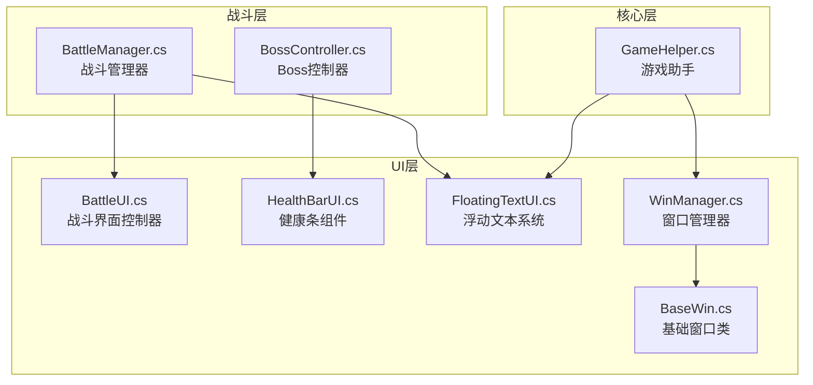
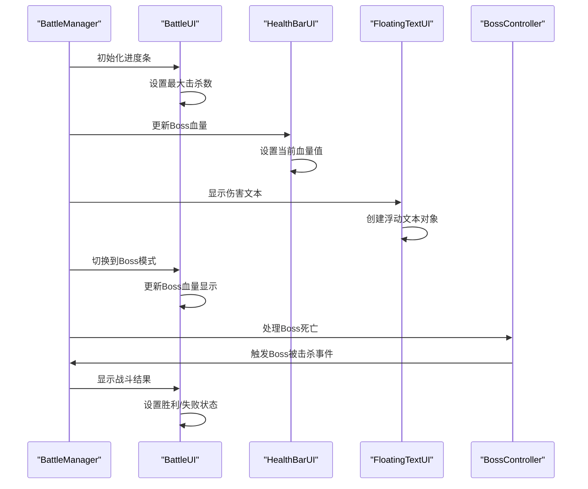
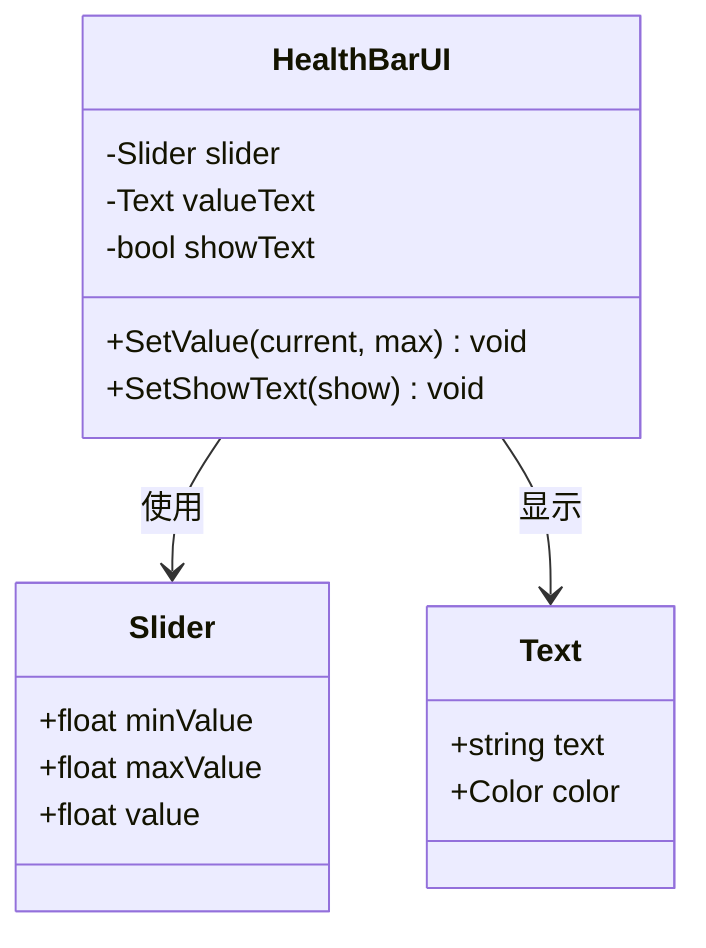
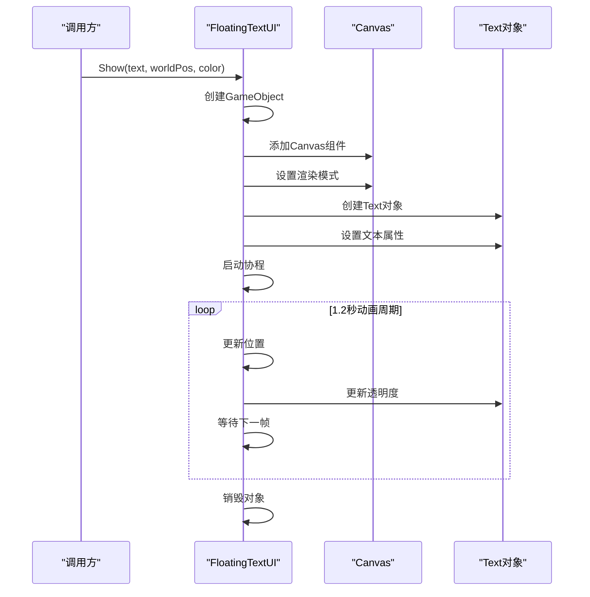
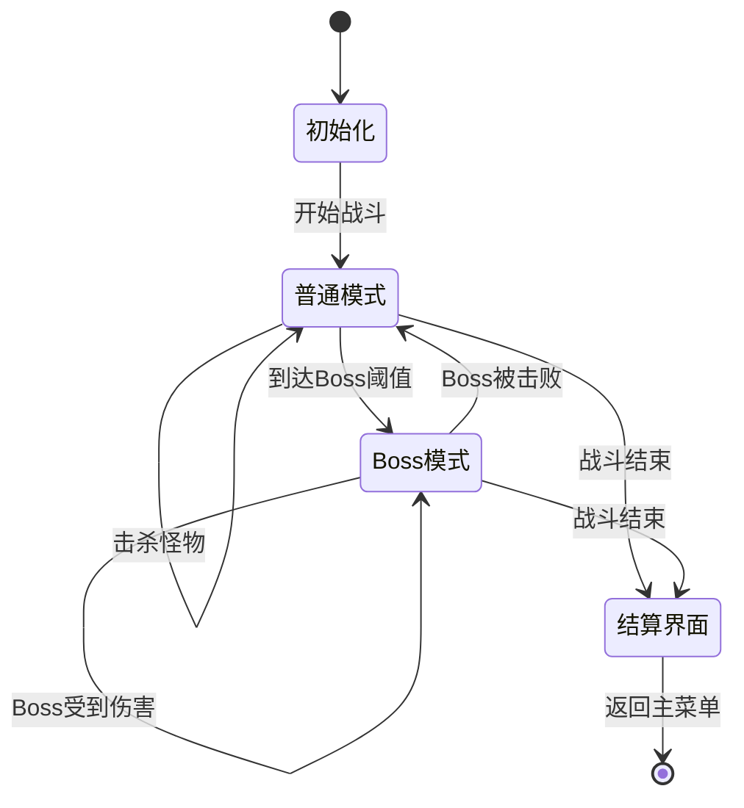
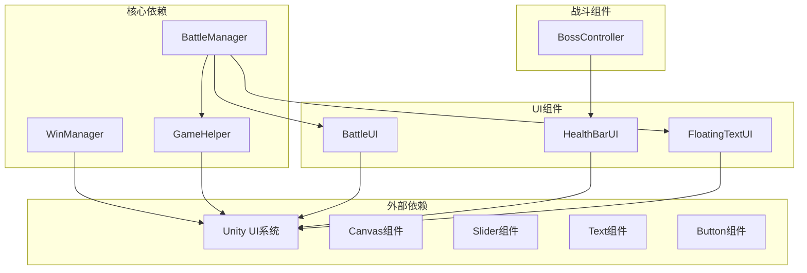

# 战斗界面系统

<cite>
**本文档引用的文件**
- [BattleUI.cs](file://Assets/Scripts/UI/BattleUI.cs)
- [HealthBarUI.cs](file://Assets/Scripts/UI/HealthBarUI.cs)
- [FloatingTextUI.cs](file://Assets/Scripts/UI/FloatingTextUI.cs)
- [BattleManager.cs](file://Assets/Scripts/Battle/BattleManager.cs)
- [BossController.cs](file://Assets/Scripts/Battle/BossController.cs)
- [GameHelper.cs](file://Assets/Scripts/Core/GameHelper.cs)
- [WinManager.cs](file://Assets/Scripts/UI/WinManager.cs)
- [BaseWin.cs](file://Assets/Scripts/UI/BaseWin.cs)
</cite>

## 目录
1. [简介](#简介)
2. [项目结构](#项目结构)
3. [核心组件](#核心组件)
4. [架构概览](#架构概览)
5. [详细组件分析](#详细组件分析)
6. [依赖关系分析](#依赖关系分析)
7. [性能考虑](#性能考虑)
8. [故障排除指南](#故障排除指南)
9. [结论](#结论)
10. [附录](#附录)

## 简介

GeometryTD的战斗界面系统是一个高度模块化的UI框架，专为实时策略战斗设计。该系统提供了完整的战斗状态可视化、即时反馈机制和用户交互控制。系统包含三个主要组件：BattleUI战斗界面控制器、HealthBarUI健康条组件和FloatingTextUI浮动文本系统。

战斗界面系统的核心设计理念是分离关注点和可扩展性。每个UI组件都有明确的职责边界，通过BattleManager进行协调，确保战斗过程中的信息传递既高效又直观。

## 项目结构

战斗界面系统位于Unity项目的Scripts/UI目录下，采用按功能分层的组织方式：

**图表来源**
- [BattleUI.cs:1-146](file://Assets/Scripts/UI/BattleUI.cs#L1-L146)
- [HealthBarUI.cs:1-36](file://Assets/Scripts/UI/HealthBarUI.cs#L1-L36)
- [FloatingTextUI.cs:1-60](file://Assets/Scripts/UI/FloatingTextUI.cs#L1-L60)
- [BattleManager.cs:1-200](file://Assets/Scripts/Battle/BattleManager.cs#L1-L200)

**章节来源**
- [BattleUI.cs:1-146](file://Assets/Scripts/UI/BattleUI.cs#L1-L146)
- [HealthBarUI.cs:1-36](file://Assets/Scripts/UI/HealthBarUI.cs#L1-L36)
- [FloatingTextUI.cs:1-60](file://Assets/Scripts/UI/FloatingTextUI.cs#L1-L60)

## 核心组件

### BattleUI战斗界面控制器

BattleUI是战斗界面的核心控制器，负责管理整个战斗过程中的UI状态。它实现了两种主要模式：普通击杀进度模式和Boss血量模式。

**关键特性：**
- 动态进度条管理
- 模式切换机制
- 结算面板控制
- 返回按钮交互

### HealthBarUI健康条组件

HealthBarUI是一个轻量级的健康条组件，专门用于显示角色的生命值状态。它提供了简洁的接口来更新血量显示。

**关键特性：**
- 数值显示格式化
- 文本可见性控制
- 动态数值更新

### FloatingTextUI浮动文本系统

FloatingTextUI负责处理所有即时视觉反馈，包括伤害数字、治疗效果等。该系统使用协程实现平滑的动画效果。

**关键特性：**
- 协程驱动的动画系统
- 自定义字体支持
- 颜色渐变效果
- 世界空间定位

**章节来源**
- [BattleUI.cs:33-105](file://Assets/Scripts/UI/BattleUI.cs#L33-L105)
- [HealthBarUI.cs:12-33](file://Assets/Scripts/UI/HealthBarUI.cs#L12-L33)
- [FloatingTextUI.cs:9-57](file://Assets/Scripts/UI/FloatingTextUI.cs#L9-L57)

## 架构概览

战斗界面系统采用分层架构设计，确保各组件间的松耦合和高内聚：

**图表来源**
- [BattleManager.cs:52-63](file://Assets/Scripts/Battle/BattleManager.cs#L52-L63)
- [BattleUI.cs:63-119](file://Assets/Scripts/UI/BattleUI.cs#L63-L119)
- [HealthBarUI.cs:12-24](file://Assets/Scripts/UI/HealthBarUI.cs#L12-L24)
- [FloatingTextUI.cs:9-57](file://Assets/Scripts/UI/FloatingTextUI.cs#L9-L57)

系统架构的关键优势在于其事件驱动的设计模式，各个组件通过BattleManager进行协调，避免了直接的耦合依赖。

## 详细组件分析

### BattleUI战斗界面控制器

BattleUI实现了完整的战斗界面状态管理，包括以下核心功能：

#### 进度条管理系统

**图表来源**
- [BattleUI.cs:33-105](file://Assets/Scripts/UI/BattleUI.cs#L33-L105)

#### 模式切换机制

BattleUI支持两种显示模式的无缝切换：

1. **普通模式**：显示怪物击杀进度，使用标准的Slider组件
2. **Boss模式**：显示Boss血量，自动切换到血量显示模式

#### 结算面板控制

战斗结束后，BattleUI负责显示最终结果：
- 胜利时显示金色标题
- 失败时显示红色标题
- 支持返回主菜单或故事场景

**章节来源**
- [BattleUI.cs:20-31](file://Assets/Scripts/UI/BattleUI.cs#L20-L31)
- [BattleUI.cs:107-143](file://Assets/Scripts/UI/BattleUI.cs#L107-L143)

### HealthBarUI健康条组件

HealthBarUI是一个专门的健康条显示组件，具有以下特点：

#### 数据绑定机制

**图表来源**
- [HealthBarUI.cs:6-34](file://Assets/Scripts/UI/HealthBarUI.cs#L6-L34)

#### 数值格式化和显示

HealthBarUI提供了智能的数值格式化功能：
- 使用Mathf.CeilToInt进行向上取整
- 自动格式化为"当前值/最大值"格式
- 可选的文本显示控制

**章节来源**
- [HealthBarUI.cs:12-33](file://Assets/Scripts/UI/HealthBarUI.cs#L12-L33)

### FloatingTextUI浮动文本系统

FloatingTextUI实现了完整的即时视觉反馈系统：

#### 动画生命周期

**图表来源**
- [FloatingTextUI.cs:9-57](file://Assets/Scripts/UI/FloatingTextUI.cs#L9-L57)

#### 动画参数配置

系统使用精心设计的动画参数：
- **持续时间**：1.2秒
- **上升距离**：1.5单位
- **缩放动画**：从0.01倍到正常大小
- **透明度衰减**：线性渐隐效果

#### 字体和样式支持

FloatingTextUI集成了GameHelper的字体加载机制：
- 支持自定义字体加载
- 默认回退到系统内置字体
- 统一的文本样式配置

**章节来源**
- [FloatingTextUI.cs:14-57](file://Assets/Scripts/UI/FloatingTextUI.cs#L14-L57)
- [GameHelper.cs:49-58](file://Assets/Scripts/Core/GameHelper.cs#L49-L58)

### 战斗界面状态管理

战斗界面的状态管理是整个系统的核心，涉及多个组件的协调工作：

#### 状态转换流程

#### 用户交互响应

系统提供了完整的用户交互支持：
- 返回按钮的多场景适配
- 故事模式和普通模式的不同行为
- 实时的战斗状态反馈

**章节来源**
- [BattleUI.cs:121-143](file://Assets/Scripts/UI/BattleUI.cs#L121-L143)
- [BattleManager.cs:52-63](file://Assets/Scripts/Battle/BattleManager.cs#L52-L63)

## 依赖关系分析

战斗界面系统的依赖关系体现了清晰的分层架构：

**图表来源**
- [BattleManager.cs:17-25](file://Assets/Scripts/Battle/BattleManager.cs#L17-L25)
- [BattleUI.cs:8-15](file://Assets/Scripts/UI/BattleUI.cs#L8-L15)
- [HealthBarUI.cs:8-10](file://Assets/Scripts/UI/HealthBarUI.cs#L8-L10)
- [FloatingTextUI.cs:16-35](file://Assets/Scripts/UI/FloatingTextUI.cs#L16-L35)

### 组件耦合分析

系统采用了松耦合的设计原则：
- **BattleUI**与**BattleManager**通过接口通信
- **HealthBarUI**与**BossController**通过事件通知
- **FloatingTextUI**与**BattleManager**通过方法调用
- 各组件间无直接依赖，通过GameHelper进行间接通信

**章节来源**
- [BattleManager.cs:17-25](file://Assets/Scripts/Battle/BattleManager.cs#L17-L25)
- [BossController.cs:27-275](file://Assets/Scripts/Battle/BossController.cs#L27-L275)

## 性能考虑

战斗界面系统在设计时充分考虑了性能优化：

### 内存管理

- **FloatingTextUI**使用协程而非持续运行的脚本，避免内存泄漏
- **WinManager**实现了窗口缓存机制，减少频繁的对象创建
- **GameHelper**提供了资源缓存，避免重复的资源加载

### 渲染优化

- **FloatingTextUI**使用WorldSpace渲染模式，减少Canvas数量
- **HealthBarUI**的文本显示可选关闭，降低渲染开销
- **BattleUI**的进度条使用Unity原生组件，性能最优

### 动画性能

- **FloatingTextUI**的动画使用Time.deltaTime进行帧率无关计算
- **HealthBarUI**的数值更新使用lerp插值，提供平滑过渡
- **BattleUI**的状态切换避免不必要的UI重绘

## 故障排除指南

### 常见问题及解决方案

#### UI组件未正确显示

**问题症状**：进度条不显示或显示异常
**可能原因**：
- Unity UI组件未正确引用
- Canvas层级设置错误
- 字体资源缺失

**解决步骤**：
1. 检查BattleUI中Slider和Text组件的引用
2. 验证Canvas的renderMode设置
3. 确认GameHelper.LoadFont()返回有效的字体

#### 浮动文本不显示

**问题症状**：伤害数字不出现或立即消失
**可能原因**：
- FloatingTextUI未正确初始化
- 协程执行异常
- Canvas渲染模式配置错误

**解决步骤**：
1. 确保FloatingTextUI在场景中存在且启用
2. 检查协程是否被中断
3. 验证Canvas的sortingOrder设置

#### Boss血量显示异常

**问题症状**：Boss血量条不更新或显示错误
**可能原因**：
- HealthBarUI未正确绑定
- BattleManager未调用更新方法
- BossController未触发事件

**解决步骤**：
1. 检查BossController中的HealthBarUI引用
2. 确认BattleManager正确调用UpdateBossHpUI
3. 验证BossController的UpdateBar方法

**章节来源**
- [BattleUI.cs:20-31](file://Assets/Scripts/UI/BattleUI.cs#L20-L31)
- [FloatingTextUI.cs:14-57](file://Assets/Scripts/UI/FloatingTextUI.cs#L14-L57)
- [HealthBarUI.cs:12-24](file://Assets/Scripts/UI/HealthBarUI.cs#L12-L24)

## 结论

GeometryTD的战斗界面系统展现了优秀的软件工程实践，通过模块化设计、事件驱动架构和性能优化，构建了一个高效、可维护的UI框架。

系统的主要优势包括：
- **清晰的职责分离**：每个组件都有明确的功能边界
- **灵活的扩展性**：易于添加新的UI元素和功能
- **优秀的性能表现**：通过多种优化技术确保流畅体验
- **完善的错误处理**：提供了全面的故障排除指南

未来可以考虑的改进方向：
- 添加更多的视觉效果选项
- 实现UI主题系统
- 增强响应式设计支持
- 扩展无障碍访问功能

## 附录

### 定制化指南

#### 修改界面样式

1. **进度条样式**：通过修改Slider组件的外观属性
2. **文本样式**：调整Font、FontSize和Color属性
3. **颜色方案**：统一修改色调以符合游戏主题

#### 添加新的视觉效果

1. **新效果类型**：在FloatingTextUI中添加新的显示模式
2. **动画参数**：根据需要调整动画时长和缓动函数
3. **颜色映射**：为不同效果类型定义独特的颜色方案

#### 优化用户体验

1. **响应速度**：调整动画时长以改善用户反馈
2. **可视性**：确保文本在不同背景下都清晰可读
3. **一致性**：保持所有UI元素的风格统一