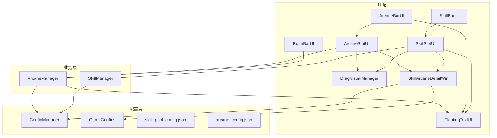
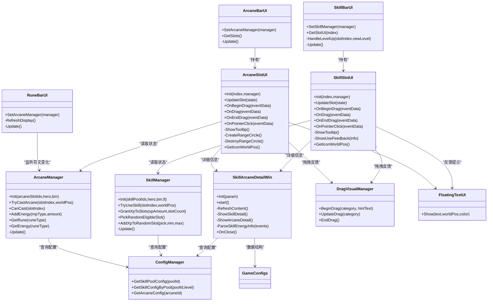
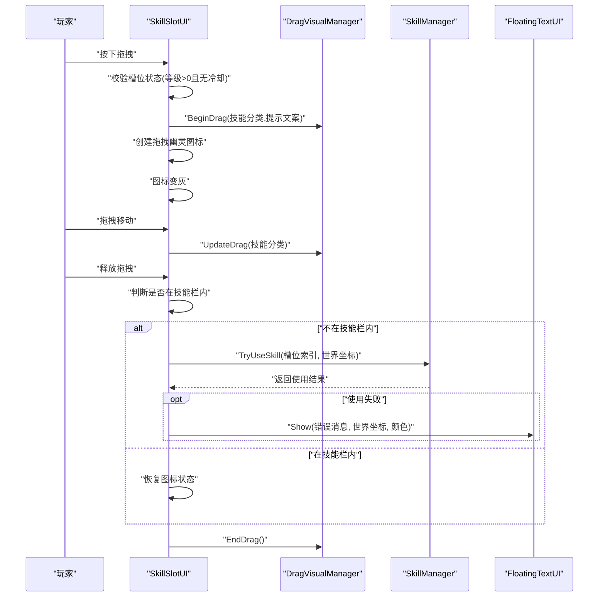
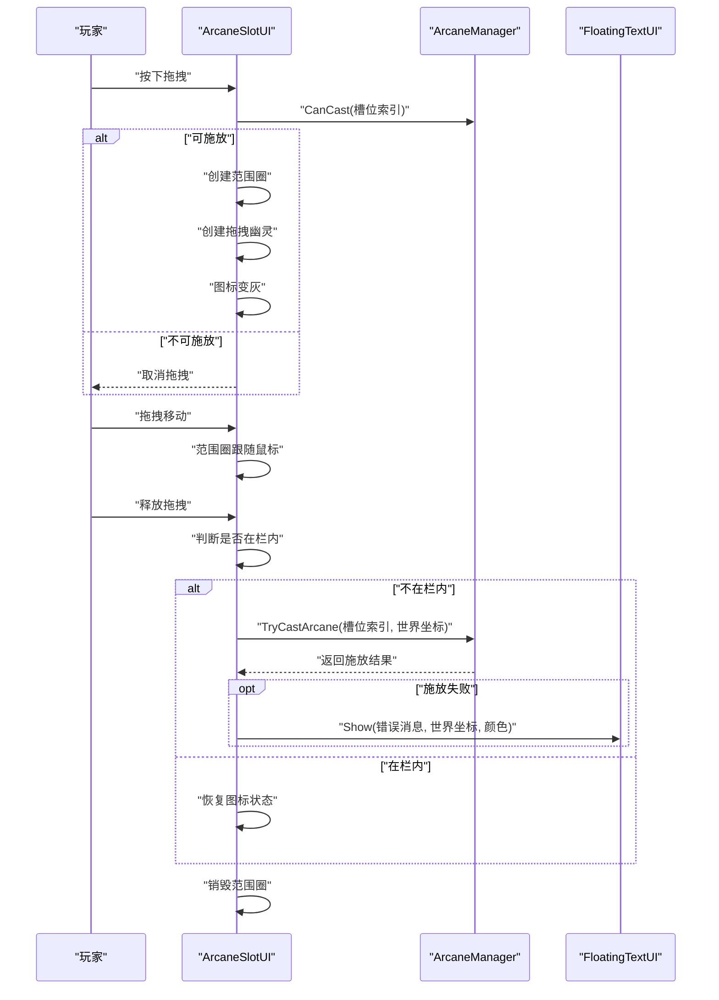
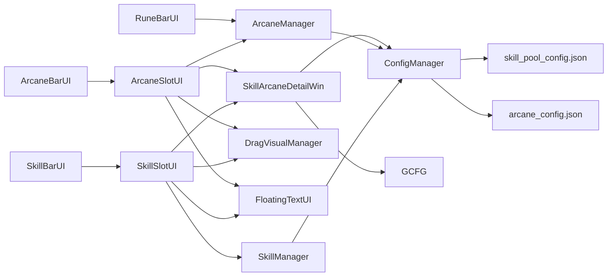

# 技能与奥术界面

<cite>
**本文档引用的文件**
- [SkillBarUI.cs](file://Assets/Scripts/UI/Components/SkillBarUI.cs)
- [SkillSlotUI.cs](file://Assets/Scripts/UI/Components/SkillSlotUI.cs)
- [ArcaneBarUI.cs](file://Assets/Scripts/UI/Components/ArcaneBarUI.cs)
- [ArcaneSlotUI.cs](file://Assets/Scripts/UI/Components/ArcaneSlotUI.cs)
- [RuneBarUI.cs](file://Assets/Scripts/UI/Components/RuneBarUI.cs)
- [SkillArcaneDetailWin.cs](file://Assets/Scripts/UI/Windows/SkillArcaneDetailWin.cs)
- [BaseWin.cs](file://Assets/Scripts/UI/Windows/BaseWin.cs)
- [SkillManager.cs](file://Assets/Scripts/Battle/SkillManager.cs)
- [ArcaneManager.cs](file://Assets/Scripts/Battle/ArcaneManager.cs)
- [DragVisualManager.cs](file://Assets/Scripts/UI/Components/DragVisualManager.cs)
- [FloatingTextUI.cs](file://Assets/Scripts/UI/Components/FloatingTextUI.cs)
- [ConfigManager.cs](file://Assets/Scripts/Core/ConfigManager.cs)
- [GameConfigs.cs](file://Assets/Scripts/Data/GameConfigs.cs)
- [skill_pool_config.json](file://Assets/Resources/Configs/skill_pool_config.json)
- [arcane_config.json](file://Assets/Resources/Configs/arcane_config.json)
- [SkillArcaneDetailWin.prefab](file://Assets/Resources/UI/Windows/SkillArcaneDetailWin.prefab)
</cite>

## 更新摘要
**变更内容**
- 技能与奥术槽位UI组件已从旧的tooltip系统迁移至新的SkillArcaneDetailWin详细窗口系统
- 新的详细窗口系统提供了更丰富的内容展示和更好的用户体验
- 统一了技能和奥术信息展示的一致性
- 移除了原有的tooltip实现，采用现代化的窗口系统

## 目录
1. [简介](#简介)
2. [项目结构](#项目结构)
3. [核心组件](#核心组件)
4. [架构总览](#架构总览)
5. [详细组件分析](#详细组件分析)
6. [依赖关系分析](#依赖关系分析)
7. [性能考量](#性能考量)
8. [故障排查指南](#故障排查指南)
9. [结论](#结论)
10. [附录](#附录)

## 简介
本文件面向GeometryTD的"技能与奥术界面"系统，围绕技能栏(SkillBarUI)、技能槽位(SkillSlotUI)、奥术栏(ArcaneBarUI)、符文栏(RuneBarUI)以及对应的管理器(SkillManager、ArcaneManager)进行技术文档化。内容涵盖：
- 技能槽位管理：图标、等级、经验条、冷却遮罩与文本、按钮可交互性
- 奥术/符文槽位状态：冷却遮罩、冷却文本、消耗提示、范围预览
- 拖拽交互：拖拽预览、提示文案、范围圈、命中反馈
- 快捷键与视觉反馈：浮动文字、等级提升提示、不可用反馈
- 界面定制：图标替换、布局调整、颜色与字体优化建议

**更新** 技能与奥术槽位UI组件已从旧的tooltip系统迁移至新的SkillArcaneDetailWin详细窗口系统，提升了用户体验和界面一致性。

## 项目结构
UI层由多个UI组件构成，分别负责不同界面元素的渲染与交互；业务层由SkillManager与ArcaneManager提供状态与行为；ConfigManager提供配置查询；DragVisualManager与FloatingTextUI提供拖拽可视化与浮动提示；新增的SkillArcaneDetailWin作为统一的详细信息展示窗口。

**图表来源**
- [SkillBarUI.cs:1-68](file://Assets/Scripts/UI/Components/SkillBarUI.cs#L1-L68)
- [SkillSlotUI.cs:1-333](file://Assets/Scripts/UI/Components/SkillSlotUI.cs#L1-L333)
- [ArcaneBarUI.cs:1-30](file://Assets/Scripts/UI/Components/ArcaneBarUI.cs#L1-L30)
- [ArcaneSlotUI.cs:1-327](file://Assets/Scripts/UI/Components/ArcaneSlotUI.cs#L1-L327)
- [RuneBarUI.cs:1-63](file://Assets/Scripts/UI/Components/RuneBarUI.cs#L1-L63)
- [SkillArcaneDetailWin.cs:1-306](file://Assets/Scripts/UI/Windows/SkillArcaneDetailWin.cs#L1-L306)
- [SkillManager.cs:1-242](file://Assets/Scripts/Battle/SkillManager.cs#L1-L242)
- [ArcaneManager.cs:1-298](file://Assets/Scripts/Battle/ArcaneManager.cs#L1-L298)
- [DragVisualManager.cs:1-337](file://Assets/Scripts/UI/Components/DragVisualManager.cs#L1-L337)
- [FloatingTextUI.cs:1-199](file://Assets/Scripts/UI/Components/FloatingTextUI.cs#L1-L199)
- [ConfigManager.cs:1-619](file://Assets/Scripts/Core/ConfigManager.cs#L1-L619)
- [GameConfigs.cs:1-775](file://Assets/Scripts/Data/GameConfigs.cs#L1-L775)

**章节来源**
- [SkillBarUI.cs:1-68](file://Assets/Scripts/UI/Components/SkillBarUI.cs#L1-L68)
- [ArcaneBarUI.cs:1-30](file://Assets/Scripts/UI/Components/ArcaneBarUI.cs#L1-L30)
- [RuneBarUI.cs:1-63](file://Assets/Scripts/UI/Components/RuneBarUI.cs#L1-L63)

## 核心组件
- 技能栏(SkillBarUI)：持有多个技能槽位UI，绑定SkillManager，周期刷新槽位状态，响应槽位升级事件显示浮动提示。
- 技能槽位(SkillSlotUI)：单个技能槽位，负责图标、等级文本、经验条、冷却遮罩与文本、按钮交互；支持拖拽、详细窗口展示、不可用反馈。
- 奥术栏(ArcaneBarUI)：持有多个奥术槽位UI，绑定ArcaneManager，周期刷新槽位状态。
- 奥术槽位(ArcaneSlotUI)：单个奥术槽位，负责图标、名称、消耗文本、冷却遮罩与文本；支持拖拽、范围圈预览、详细窗口展示。
- 符文栏(RuneBarUI)：显示四种符文的数量与能量值，绑定ArcaneManager，监听符文变化事件刷新显示。
- 详细窗口(SkillArcaneDetailWin)：统一的技能/奥术详细信息展示窗口，支持技能详情和奥术详情的丰富内容展示。
- 管理器：
  - SkillManager：维护技能槽状态、经验与等级、冷却计时、使用验证与结果返回。
  - ArcaneManager：维护符文与能量、冷却计时、主动奥术放置与周期触发、消耗计算与修饰。
- 工具与配置：
  - DragVisualManager：拖拽过程中的视觉反馈（半透明背景、提示、瞄准线、范围圈等）。
  - FloatingTextUI：浮动文字提示（成功/失败/等级提升等）。
  - ConfigManager：统一加载与查询技能/奥术配置。
  - GameConfigs：枚举与数据结构定义（技能分类、结果枚举等）。

**更新** 新增了SkillArcaneDetailWin作为统一的详细信息展示窗口，替代了原有的tooltip系统，提供了更丰富的技能和奥术信息展示能力。

**章节来源**
- [SkillSlotUI.cs:1-333](file://Assets/Scripts/UI/Components/SkillSlotUI.cs#L1-L333)
- [ArcaneSlotUI.cs:1-327](file://Assets/Scripts/UI/Components/ArcaneSlotUI.cs#L1-L327)
- [RuneBarUI.cs:1-63](file://Assets/Scripts/UI/Components/RuneBarUI.cs#L1-L63)
- [SkillArcaneDetailWin.cs:1-306](file://Assets/Scripts/UI/Windows/SkillArcaneDetailWin.cs#L1-L306)
- [SkillManager.cs:1-242](file://Assets/Scripts/Battle/SkillManager.cs#L1-L242)
- [ArcaneManager.cs:1-298](file://Assets/Scripts/Battle/ArcaneManager.cs#L1-L298)
- [DragVisualManager.cs:1-337](file://Assets/Scripts/UI/Components/DragVisualManager.cs#L1-L337)
- [FloatingTextUI.cs:1-199](file://Assets/Scripts/UI/Components/FloatingTextUI.cs#L1-L199)
- [ConfigManager.cs:1-619](file://Assets/Scripts/Core/ConfigManager.cs#L1-L619)
- [GameConfigs.cs:1-775](file://Assets/Scripts/Data/GameConfigs.cs#L1-L775)

## 架构总览
技能与奥术界面采用"UI组件 + 管理器 + 配置 + 详细窗口"的分层设计。UI组件通过管理器获取状态并驱动渲染；管理器负责业务逻辑与状态更新；配置层提供静态数据与查询接口；工具组件提供通用的视觉与交互支持；新增的SkillArcaneDetailWin作为统一的信息展示窗口。

**图表来源**
- [SkillBarUI.cs:1-68](file://Assets/Scripts/UI/Components/SkillBarUI.cs#L1-L68)
- [SkillSlotUI.cs:1-333](file://Assets/Scripts/UI/Components/SkillSlotUI.cs#L1-L333)
- [ArcaneBarUI.cs:1-30](file://Assets/Scripts/UI/Components/ArcaneBarUI.cs#L1-L30)
- [ArcaneSlotUI.cs:1-327](file://Assets/Scripts/UI/Components/ArcaneSlotUI.cs#L1-L327)
- [RuneBarUI.cs:1-63](file://Assets/Scripts/UI/Components/RuneBarUI.cs#L1-L63)
- [SkillArcaneDetailWin.cs:1-306](file://Assets/Scripts/UI/Windows/SkillArcaneDetailWin.cs#L1-L306)
- [SkillManager.cs:1-242](file://Assets/Scripts/Battle/SkillManager.cs#L1-L242)
- [ArcaneManager.cs:1-298](file://Assets/Scripts/Battle/ArcaneManager.cs#L1-L298)
- [DragVisualManager.cs:1-337](file://Assets/Scripts/UI/Components/DragVisualManager.cs#L1-L337)
- [FloatingTextUI.cs:1-199](file://Assets/Scripts/UI/Components/FloatingTextUI.cs#L1-L199)
- [ConfigManager.cs:1-619](file://Assets/Scripts/Core/ConfigManager.cs#L1-L619)

## 详细组件分析

### 技能栏 SkillBarUI
- 职责
  - 绑定SkillManager，初始化每个槽位UI并传入索引与管理器
  - 周期调用各槽位UI的UpdateSlot以刷新状态
  - 监听槽位升级事件，播放浮动文字提示
- 关键点
  - 通过SkillManager的SlotCount限制遍历范围
  - 使用FloatingTextUI在槽位图标世界坐标上显示升级信息
- 交互
  - 与SkillSlotUI配合完成拖拽、点击、冷却遮罩等

**章节来源**
- [SkillBarUI.cs:1-68](file://Assets/Scripts/UI/Components/SkillBarUI.cs#L1-L68)

### 技能槽位 SkillSlotUI
- 图标与名称
  - 从SkillPoolConfig加载图标与名称，用于初始显示
- 等级与经验
  - 显示等级文本；经验条最大值固定为10，当前等级达到10时经验条满
- 冷却与可用性
  - 冷却遮罩填充比例=剩余冷却/最大冷却；冷却文本显示剩余秒数
  - 当等级<=0或处于冷却时，槽位压暗、按钮禁用
- 拖拽与释放
  - 拖拽开始：根据技能配置分类，调用DragVisualManager显示对应视觉反馈；创建拖拽幽灵图标；图标变灰
  - 拖拽中：跟随鼠标更新幽灵位置；更新视觉反馈
  - 拖拽结束：若不在技能栏内，将世界坐标传递给SkillManager尝试使用技能；否则仅恢复图标
- 详细窗口展示
  - **更新** 点击显示统一的SkillArcaneDetailWin详细窗口，而非原有的tooltip
  - 详细窗口显示技能池名称、描述、升级效果、各级描述、能量恢复信息、冷却时间等
- 不可用反馈
  - 当使用失败时，根据结果类型显示浮动文字提示（等级不足、冷却中）

**图表来源**
- [SkillSlotUI.cs:131-200](file://Assets/Scripts/UI/Components/SkillSlotUI.cs#L131-L200)
- [SkillManager.cs:87-137](file://Assets/Scripts/Battle/SkillManager.cs#L87-L137)
- [DragVisualManager.cs:29-115](file://Assets/Scripts/UI/Components/DragVisualManager.cs#L29-L115)
- [FloatingTextUI.cs:9-12](file://Assets/Scripts/UI/Components/FloatingTextUI.cs#L9-L12)

**章节来源**
- [SkillSlotUI.cs:1-333](file://Assets/Scripts/UI/Components/SkillSlotUI.cs#L1-L333)
- [SkillManager.cs:1-242](file://Assets/Scripts/Battle/SkillManager.cs#L1-L242)

### 奥术栏 ArcaneBarUI
- 职责
  - 绑定ArcaneManager，周期刷新每个槽位UI的状态
- 注意
  - 与SkillBarUI类似，但不直接处理槽位升级事件

**章节来源**
- [ArcaneBarUI.cs:1-30](file://Assets/Scripts/UI/Components/ArcaneBarUI.cs#L1-L30)

### 奥术槽位 ArcaneSlotUI
- 图标与名称
  - 从ArcaneConfig加载图标与名称，首次为空时再加载
- 冷却与可用性
  - 冷却遮罩与文本同技能槽位
  - 消耗文本颜色根据当前符文数量与需求符文比较动态变化
- 拖拽与范围预览
  - 拖拽开始：根据配置半径创建范围圈；创建拖拽幽灵；图标变灰
  - 拖拽中：范围圈随鼠标移动
  - 拖拽结束：若不在栏内，将世界坐标传递给ArcaneManager尝试施放；否则恢复图标
- 详细窗口展示
  - **更新** 点击显示统一的SkillArcaneDetailWin详细窗口，而非原有的tooltip
  - 详细窗口显示奥术名称、描述、能量消耗信息、冷却时间等
- 提示框
  - **更新** 移除了原有的tooltip实现，改用SkillArcaneDetailWin详细窗口

**图表来源**
- [ArcaneSlotUI.cs:100-154](file://Assets/Scripts/UI/Components/ArcaneSlotUI.cs#L100-L154)
- [ArcaneManager.cs:135-165](file://Assets/Scripts/Battle/ArcaneManager.cs#L135-L165)
- [FloatingTextUI.cs:9-12](file://Assets/Scripts/UI/Components/FloatingTextUI.cs#L9-L12)

**章节来源**
- [ArcaneSlotUI.cs:1-327](file://Assets/Scripts/UI/Components/ArcaneSlotUI.cs#L1-L327)
- [ArcaneManager.cs:1-298](file://Assets/Scripts/Battle/ArcaneManager.cs#L1-L298)

### 符文栏 RuneBarUI
- 职责
  - 绑定ArcaneManager，监听符文变化事件
  - 周期刷新四种符文的数量、能量值与能量滑条
- 数据来源
  - 通过ArcaneManager.GetRune与GetEnergy获取当前符文与能量
  - 能量值显示格式为"当前/10"
- 颜色方案
  - 四种符文颜色按顺序定义，便于区分

**章节来源**
- [RuneBarUI.cs:1-63](file://Assets/Scripts/UI/Components/RuneBarUI.cs#L1-L63)
- [ArcaneManager.cs:64-76](file://Assets/Scripts/Battle/ArcaneManager.cs#L64-L76)

### 详细窗口 SkillArcaneDetailWin
- **新增** 统一的技能/奥术详细信息展示窗口
- 职责
  - 接收SkillArcaneDetailWinParam参数，显示技能或奥术的详细信息
  - 支持技能详情和奥术详情两种模式
  - 自动绑定UI组件，支持预制体和代码动态构建
- 技能详情显示
  - 技能池图标、名称、描述（支持富文本）
  - 升级效果说明和各级描述
  - 能量恢复信息解析和显示
  - 冷却时间显示
- 奥术详情显示
  - 奥术图标、名称、描述（支持富文本）
  - 能量消耗类型和数量显示
  - 冷却时间显示
- 关闭机制
  - 点击背景区域可关闭
  - 支持任意区域点击关闭

**章节来源**
- [SkillArcaneDetailWin.cs:1-306](file://Assets/Scripts/UI/Windows/SkillArcaneDetailWin.cs#L1-L306)
- [BaseWin.cs:1-175](file://Assets/Scripts/UI/Windows/BaseWin.cs#L1-L175)

### 管理器与配置

#### SkillManager
- 状态与生命周期
  - 维护SkillSlotState数组，包含技能池ID、名称、等级、经验、冷却剩余与最大冷却
  - Update中逐槽减少冷却剩余
- 使用流程
  - TryUseSkill进行有效性检查（死亡、槽位越界、等级、冷却、配置存在性），成功则调用英雄使用技能并重置槽位状态
- 经验与升级
  - GrantXpToSlots支持对随机槽位或全部槽位授予经验，经验累积到10进阶一级，触发OnSlotLevelUp事件

**章节来源**
- [SkillManager.cs:1-242](file://Assets/Scripts/Battle/SkillManager.cs#L1-L242)

#### ArcaneManager
- 状态与生命周期
  - 维护ArcaneSlotState数组与四种符文/能量数组，ActiveArcane列表记录正在生效的奥术
  - Update中更新槽位冷却与主动奥术的周期触发
- 施放流程
  - TryCastArcane先检查CanCast（冷却与符文消耗），成功则扣除符文、设置冷却、创建ActiveArcane并触发OnArcanePlaced
- 能量与消耗
  - AddEnergy支持按类型或全部类型增加能量，满10转换为1个符文
  - CanCast考虑英雄Buff对符文消耗的修饰

**章节来源**
- [ArcaneManager.cs:1-298](file://Assets/Scripts/Battle/ArcaneManager.cs#L1-L298)

#### ConfigManager 与 GameConfigs
- ConfigManager
  - 加载并缓存技能池、技能、奥术、事件等配置，提供快速查询接口
- GameConfigs
  - 定义技能分类枚举、使用结果枚举、数据结构等

**章节来源**
- [ConfigManager.cs:1-619](file://Assets/Scripts/Core/ConfigManager.cs#L1-L619)
- [GameConfigs.cs:454-476](file://Assets/Scripts/Data/GameConfigs.cs#L454-L476)

## 依赖关系分析

**图表来源**
- [ConfigManager.cs:77-122](file://Assets/Scripts/Core/ConfigManager.cs#L77-L122)
- [SkillManager.cs:1-242](file://Assets/Scripts/Battle/SkillManager.cs#L1-L242)
- [ArcaneManager.cs:1-298](file://Assets/Scripts/Battle/ArcaneManager.cs#L1-L298)
- [SkillSlotUI.cs:1-333](file://Assets/Scripts/UI/Components/SkillSlotUI.cs#L1-L333)
- [ArcaneSlotUI.cs:1-327](file://Assets/Scripts/UI/Components/ArcaneSlotUI.cs#L1-L327)
- [SkillBarUI.cs:1-68](file://Assets/Scripts/UI/Components/SkillBarUI.cs#L1-L68)
- [ArcaneBarUI.cs:1-30](file://Assets/Scripts/UI/Components/ArcaneBarUI.cs#L1-L30)
- [RuneBarUI.cs:1-63](file://Assets/Scripts/UI/Components/RuneBarUI.cs#L1-L63)
- [DragVisualManager.cs:1-337](file://Assets/Scripts/UI/Components/DragVisualManager.cs#L1-L337)
- [FloatingTextUI.cs:1-199](file://Assets/Scripts/UI/Components/FloatingTextUI.cs#L1-L199)
- [SkillArcaneDetailWin.cs:1-306](file://Assets/Scripts/UI/Windows/SkillArcaneDetailWin.cs#L1-L306)

**章节来源**
- [SkillSlotUI.cs:1-333](file://Assets/Scripts/UI/Components/SkillSlotUI.cs#L1-L333)
- [ArcaneSlotUI.cs:1-327](file://Assets/Scripts/UI/Components/ArcaneSlotUI.cs#L1-L327)
- [RuneBarUI.cs:1-63](file://Assets/Scripts/UI/Components/RuneBarUI.cs#L1-L63)
- [SkillManager.cs:1-242](file://Assets/Scripts/Battle/SkillManager.cs#L1-L242)
- [ArcaneManager.cs:1-298](file://Assets/Scripts/Battle/ArcaneManager.cs#L1-L298)
- [ConfigManager.cs:1-619](file://Assets/Scripts/Core/ConfigManager.cs#L1-L619)

## 性能考量
- 刷新频率
  - 技能与奥术槽位在Update中被频繁刷新，建议确保槽位数量合理，避免过多UI对象导致帧率下降
- 拖拽视觉
  - DragVisualManager在拖拽期间降低Time.timeScale，注意与游戏其他时间控制逻辑协调
- 资源加载
  - 图标与字体通过ConfigManager与GameHelper加载，建议集中缓存，避免重复IO
- 动画与特效
  - 范围圈与特效在拖拽与施放时创建销毁，注意内存与GC压力，必要时采用对象池
- **更新** 详细窗口性能
  - SkillArcaneDetailWin作为新的详细信息展示窗口，需要考虑窗口打开/关闭的性能影响
  - 建议优化窗口内容的渲染和布局计算

## 故障排查指南
- 拖拽无效
  - 检查槽位状态：等级<=0或处于冷却时会阻止拖拽
  - 确认DragVisualManager是否正确初始化与销毁
- 施放失败
  - 检查符文数量与消耗修饰（Buff影响）
  - 确认ArcaneManager的TryCastArcane返回值与冷却状态
- **更新** 详细窗口不显示
  - 确认SkillArcaneDetailWin参数正确传递（id、isSkill、currentLevel）
  - 检查GameHelper.OpenWin调用是否成功
  - 确认SkillArcaneDetailWin.prefab资源是否存在
- **更新** tooltip相关问题
  - 确认原有tooltip系统已被SkillArcaneDetailWin替代
  - 检查SkillSlotUI和ArcaneSlotUI中的tooltip相关代码是否已移除
- 浮动文字不出现
  - 确认FloatingTextUI的Canvas与排序设置
  - 检查坐标转换与世界空间渲染模式

**章节来源**
- [SkillSlotUI.cs:131-200](file://Assets/Scripts/UI/Components/SkillSlotUI.cs#L131-L200)
- [ArcaneSlotUI.cs:100-154](file://Assets/Scripts/UI/Components/ArcaneSlotUI.cs#L100-L154)
- [ArcaneManager.cs:135-165](file://Assets/Scripts/Battle/ArcaneManager.cs#L135-L165)
- [FloatingTextUI.cs:1-199](file://Assets/Scripts/UI/Components/FloatingTextUI.cs#L1-L199)

## 结论
技能与奥术界面通过清晰的UI组件与管理器分离，实现了良好的可扩展性与可维护性。技能槽位与奥术槽位均具备完整的状态展示与交互反馈，拖拽系统提供了直观的施法预览。符文栏与能量系统为奥术施放提供了明确的成本提示。**更新** 最新的变更将原有的tooltip系统迁移至SkillArcaneDetailWin详细窗口系统，提供了更丰富、更一致的信息展示体验。建议在后续迭代中进一步优化拖拽性能、统一视觉风格，并完善快捷键支持与无障碍交互。

## 附录

### 界面定制指南
- 修改技能图标
  - 在skill_pool_config.json中为对应技能池项设置icon字段，指向Resources中的图片路径
  - 确保资源可被GameHelper.LoadSprite加载
- 调整布局设计
  - 在Unity编辑器中调整SkillSlotUI与ArcaneSlotUI的RectTransform尺寸与锚点
  - 调整Canvas层级与SortingOrder，确保UI在场景中正确显示
- **更新** 详细窗口定制
  - 修改SkillArcaneDetailWin.prefab中的UI组件布局和样式
  - 调整文字大小、颜色、间距等视觉属性
  - 可以添加或移除特定的信息展示区域
- 优化用户操作体验
  - 增加快捷键支持：在SkillSlotUI与ArcaneSlotUI中添加按键监听，直接触发使用或施放
  - 统一颜色与字体：在GameConfigs中定义颜色常量，在UI组件中集中引用
  - 增强反馈：为成功/失败/升级等状态提供音效与震动反馈

**章节来源**
- [skill_pool_config.json:1-59](file://Assets/Resources/Configs/skill_pool_config.json#L1-L59)
- [arcane_config.json:1-6](file://Assets/Resources/Configs/arcane_config.json#L1-L6)
- [GameConfigs.cs:1-775](file://Assets/Scripts/Data/GameConfigs.cs#L1-L775)
- [SkillArcaneDetailWin.cs:1-306](file://Assets/Scripts/UI/Windows/SkillArcaneDetailWin.cs#L1-L306)
- [SkillArcaneDetailWin.prefab](file://Assets/Resources/UI/Windows/SkillArcaneDetailWin.prefab)