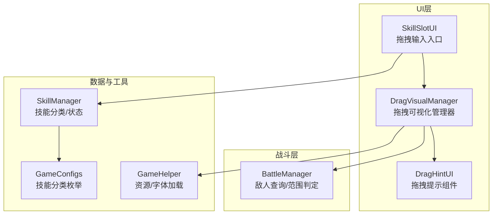
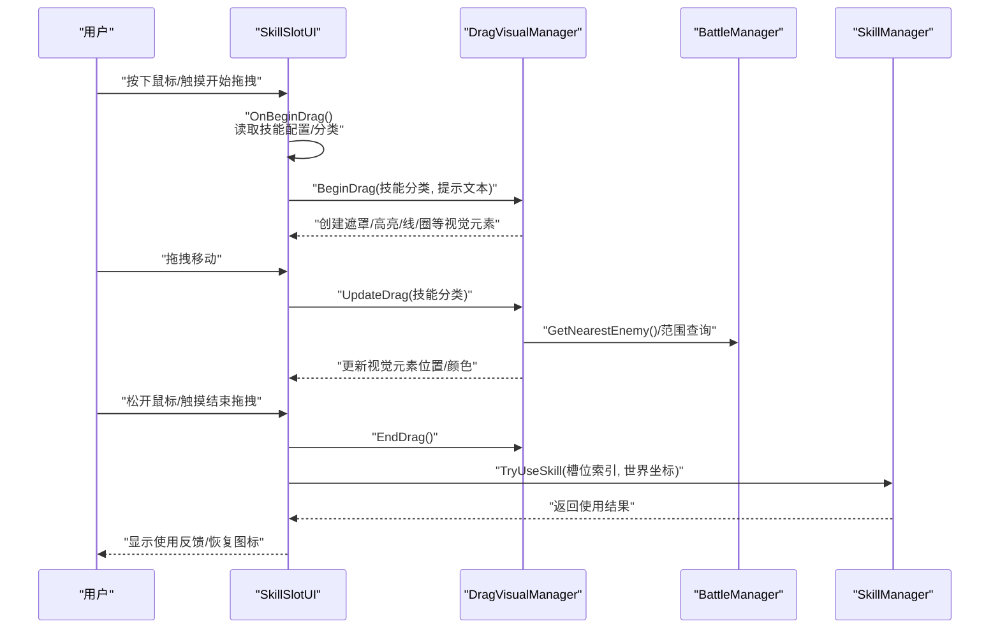
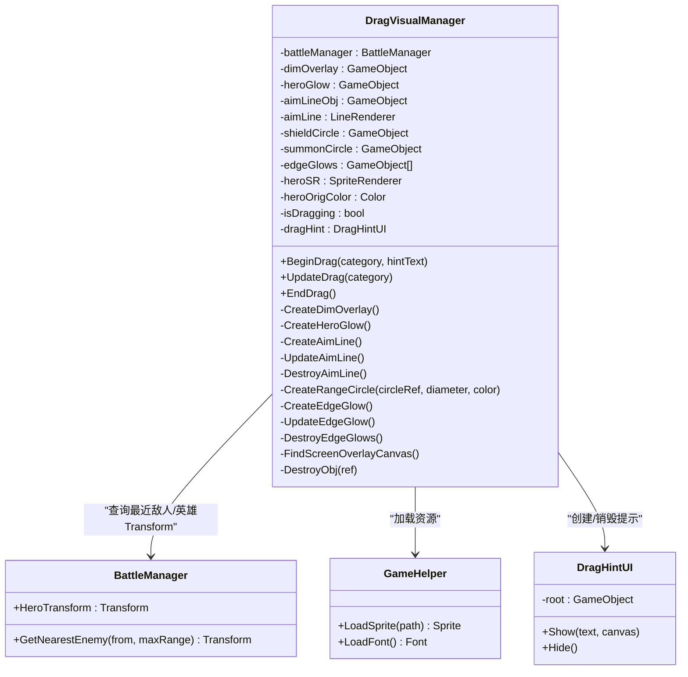
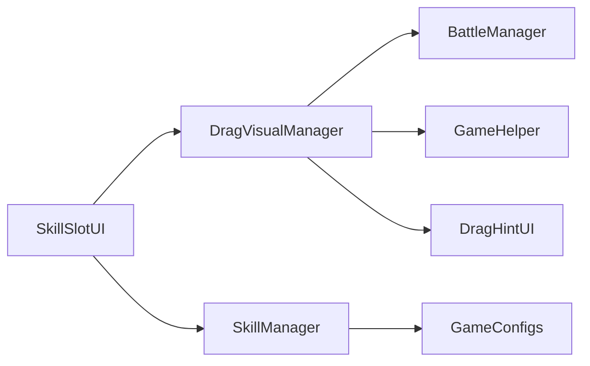

# 拖拽与可视化系统

<cite>
**本文档引用的文件**
- [DragVisualManager.cs](file://Assets/Scripts/UI/DragVisualManager.cs)
- [DragHintUI.cs](file://Assets/Scripts/UI/DragHintUI.cs)
- [SkillSlotUI.cs](file://Assets/Scripts/UI/SkillSlotUI.cs)
- [BattleManager.cs](file://Assets/Scripts/Battle/BattleManager.cs)
- [GameConfigs.cs](file://Assets/Scripts/Data/GameConfigs.cs)
- [GameHelper.cs](file://Assets/Scripts/Core/GameHelper.cs)
- [SkillManager.cs](file://Assets/Scripts/Battle/SkillManager.cs)
</cite>

## 更新摘要
**变更内容**
- 移除了SkillSlotUI.cs中的调试日志语句，体现项目向生产就绪状态的改进
- 更新了开发环境成熟度相关的章节内容
- 强化了生产环境质量保证的说明

## 目录
1. [简介](#简介)
2. [项目结构](#项目结构)
3. [核心组件](#核心组件)
4. [架构总览](#架构总览)
5. [详细组件分析](#详细组件分析)
6. [依赖关系分析](#依赖关系分析)
7. [性能考虑](#性能考虑)
8. [故障排查指南](#故障排查指南)
9. [开发环境成熟度](#开发环境成熟度)
10. [结论](#结论)
11. [附录](#附录)

## 简介
本文件面向GeometryTD的拖拽与可视化系统，聚焦于DragVisualManager拖拽管理器与DragHintUI拖拽提示组件的设计与实现，系统性阐述拖拽检测、视觉反馈、位置计算与坐标转换、碰撞检测机制，并给出用户体验设计要点、扩展指南与性能优化建议。读者无需深入的编程背景即可理解拖拽交互的工作原理与最佳实践。

## 项目结构
拖拽与可视化系统主要由以下模块构成：
- UI层：DragVisualManager负责拖拽过程中的视觉反馈；DragHintUI负责显示拖拽提示文本；SkillSlotUI作为拖拽输入入口，接收Unity的拖拽事件并驱动管理器。
- 战斗层：BattleManager提供敌人查询、范围判定等能力，支撑拖拽过程中的目标选择与位置计算。
- 数据与工具：GameConfigs定义技能分类枚举；GameHelper提供资源加载与字体加载；SkillManager用于技能分类与状态管理。

**图表来源**
- [DragVisualManager.cs:1-333](file://Assets/Scripts/UI/DragVisualManager.cs#L1-L333)
- [DragHintUI.cs:1-68](file://Assets/Scripts/UI/DragHintUI.cs#L1-L68)
- [SkillSlotUI.cs:1-391](file://Assets/Scripts/UI/SkillSlotUI.cs#L1-L391)
- [BattleManager.cs:277-327](file://Assets/Scripts/Battle/BattleManager.cs#L277-L327)
- [GameConfigs.cs:454-461](file://Assets/Scripts/Data/GameConfigs.cs#L454-L461)
- [GameHelper.cs:1-84](file://Assets/Scripts/Core/GameHelper.cs#L1-L84)
- [SkillManager.cs:25-40](file://Assets/Scripts/Battle/SkillManager.cs#L25-L40)

**章节来源**
- [DragVisualManager.cs:1-333](file://Assets/Scripts/UI/DragVisualManager.cs#L1-L333)
- [DragHintUI.cs:1-68](file://Assets/Scripts/UI/DragHintUI.cs#L1-L68)
- [SkillSlotUI.cs:1-391](file://Assets/Scripts/UI/SkillSlotUI.cs#L1-L391)
- [BattleManager.cs:277-327](file://Assets/Scripts/Battle/BattleManager.cs#L277-L327)
- [GameConfigs.cs:454-461](file://Assets/Scripts/Data/GameConfigs.cs#L454-L461)
- [GameHelper.cs:1-84](file://Assets/Scripts/Core/GameHelper.cs#L1-L84)
- [SkillManager.cs:25-40](file://Assets/Scripts/Battle/SkillManager.cs#L25-L40)

## 核心组件
- DragVisualManager：统一管理拖拽期间的视觉反馈，包括屏幕遮罩、英雄高亮、瞄准线、范围圈与AOE边缘光效，并负责时间缩放与提示组件生命周期。
- DragHintUI：在屏幕顶部中央显示拖拽提示文本，随拖拽会话创建与销毁。
- SkillSlotUI：实现Unity的拖拽接口，负责触发拖拽开始、更新与结束，将世界坐标传递给技能系统，并调用DragVisualManager进行可视化。

**章节来源**
- [DragVisualManager.cs:23-115](file://Assets/Scripts/UI/DragVisualManager.cs#L23-L115)
- [DragHintUI.cs:14-65](file://Assets/Scripts/UI/DragHintUI.cs#L14-L65)
- [SkillSlotUI.cs:131-200](file://Assets/Scripts/UI/SkillSlotUI.cs#L131-L200)

## 架构总览
拖拽流程从UI层的SkillSlotUI开始，经由DragVisualManager进行实时视觉反馈，同时借助BattleManager完成目标选择与位置计算，最终由SkillManager执行技能使用决策。

**图表来源**
- [SkillSlotUI.cs:131-200](file://Assets/Scripts/UI/SkillSlotUI.cs#L131-L200)
- [DragVisualManager.cs:29-115](file://Assets/Scripts/UI/DragVisualManager.cs#L29-L115)
- [BattleManager.cs:277-327](file://Assets/Scripts/Battle/BattleManager.cs#L277-L327)
- [SkillManager.cs:25-40](file://Assets/Scripts/Battle/SkillManager.cs#L25-L40)

## 详细组件分析

### DragVisualManager：拖拽可视化管理器
职责与功能：
- 拖拽生命周期管理：BeginDrag/UpdateDrag/EndDrag，控制时间缩放与资源清理。
- 视觉反馈创建与更新：根据技能分类创建不同效果（英雄高亮、瞄准线、边缘光、范围圈）。
- 位置计算与坐标转换：基于BattleManager提供的英雄Transform与最近敌人，计算瞄准线终点；保持范围圈跟随英雄。
- 提示组件集成：在开始拖拽时创建DragHintUI并在结束时销毁。

实现要点：
- 屏幕遮罩：在ScreenSpaceOverlay画布上创建半透明遮罩，降低环境干扰。
- 英雄高亮：修改英雄SpriteRenderer颜色并叠加环形高亮精灵。
- 瞄准线：LineRenderer绘制从英雄到最近敌人的轨迹，无敌人时指向右侧固定距离。
- 边缘光：在屏幕四边创建半透明Image，周期性调整透明度形成闪烁效果。
- 范围圈：按直径缩放环形精灵，支持"护盾"和"召唤"两种半径与颜色。
- 资源加载：通过GameHelper加载精灵与字体，确保跨平台兼容。

**图表来源**
- [DragVisualManager.cs:6-115](file://Assets/Scripts/UI/DragVisualManager.cs#L6-L115)
- [DragHintUI.cs:10-66](file://Assets/Scripts/UI/DragHintUI.cs#L10-L66)
- [BattleManager.cs:48-327](file://Assets/Scripts/Battle/BattleManager.cs#L48-L327)
- [GameHelper.cs:13-58](file://Assets/Scripts/Core/GameHelper.cs#L13-L58)

**章节来源**
- [DragVisualManager.cs:29-115](file://Assets/Scripts/UI/DragVisualManager.cs#L29-L115)
- [DragVisualManager.cs:123-141](file://Assets/Scripts/UI/DragVisualManager.cs#L123-L141)
- [DragVisualManager.cs:144-164](file://Assets/Scripts/UI/DragVisualManager.cs#L144-L164)
- [DragVisualManager.cs:167-206](file://Assets/Scripts/UI/DragVisualManager.cs#L167-L206)
- [DragVisualManager.cs:219-236](file://Assets/Scripts/UI/DragVisualManager.cs#L219-L236)
- [DragVisualManager.cs:239-300](file://Assets/Scripts/UI/DragVisualManager.cs#L239-L300)
- [DragVisualManager.cs:314-332](file://Assets/Scripts/UI/DragVisualManager.cs#L314-L332)

### DragHintUI：拖拽提示组件
职责与功能：
- 在屏幕顶部中央显示拖拽提示文本，锚点设置为顶部居中，背景半透明，文字带描边。
- 生命周期由DragVisualManager管理：开始拖拽时创建，结束拖拽时销毁。

实现要点：
- 使用Canvas的ScreenSpaceOverlay模式保证层级在UI最前。
- 文本采用GameHelper加载的字体，字号与颜色可配置。
- 通过RectTransform设置尺寸与位置，确保在不同分辨率下表现一致。

**章节来源**
- [DragHintUI.cs:14-65](file://Assets/Scripts/UI/DragHintUI.cs#L14-L65)

### SkillSlotUI：拖拽输入与协调器
职责与功能：
- 实现IBeginDragHandler/IDragHandler/IEndDragHandler/IPointerClickHandler，响应Unity的拖拽事件。
- 拖拽开始：读取技能配置与分类，调用DragVisualManager.BeginDrag并创建拖拽幽灵图标。
- 拖拽中：更新幽灵图标位置，调用DragVisualManager.UpdateDrag。
- 拖拽结束：调用DragVisualManager.EndDrag，销毁幽灵图标；若释放位置不在技能条内，则将屏幕坐标转换为世界坐标并调用SkillManager.TryUseSkill。

坐标转换与碰撞检测：
- 屏幕坐标转世界坐标：通过Camera.main的射线与Z平面相交计算世界坐标。
- 释放区域判断：使用RectTransformUtility.RectangleContainsScreenPoint判断是否在技能条矩形区域内。

**章节来源**
- [SkillSlotUI.cs:131-200](file://Assets/Scripts/UI/SkillSlotUI.cs#L131-L200)
- [SkillSlotUI.cs:1-78](file://Assets/Scripts/UI/SkillSlotUI.cs#L1-L78)

### 技能分类与使用决策
技能分类：
- 通过SkillManager.ClassifySkill根据配置字段优先判断，否则依据属性回退：有子弹速度则为投射型，有伤害则为AOE，否则为自我型。
- 分类结果决定DragVisualManager创建何种视觉反馈。

使用决策：
- SkillSlotUI在拖拽结束时调用SkillManager.TryUseSkill，传入槽位索引与世界坐标，返回使用结果（成功/等级不足/冷却中/无效槽位），并据此显示反馈。

**章节来源**
- [SkillManager.cs:25-40](file://Assets/Scripts/Battle/SkillManager.cs#L25-L40)
- [GameConfigs.cs:454-461](file://Assets/Scripts/Data/GameConfigs.cs#L454-L461)
- [SkillSlotUI.cs:192-195](file://Assets/Scripts/UI/SkillSlotUI.cs#L192-L195)

## 依赖关系分析

**图表来源**
- [SkillSlotUI.cs:76-77](file://Assets/Scripts/UI/SkillSlotUI.cs#L76-L77)
- [DragVisualManager.cs:8-27](file://Assets/Scripts/UI/DragVisualManager.cs#L8-L27)
- [SkillManager.cs:25-40](file://Assets/Scripts/Battle/SkillManager.cs#L25-L40)
- [GameConfigs.cs:454-461](file://Assets/Scripts/Data/GameConfigs.cs#L454-L461)
- [GameHelper.cs:13-58](file://Assets/Scripts/Core/GameHelper.cs#L13-L58)

**章节来源**
- [SkillSlotUI.cs:76-77](file://Assets/Scripts/UI/SkillSlotUI.cs#L76-L77)
- [DragVisualManager.cs:8-27](file://Assets/Scripts/UI/DragVisualManager.cs#L8-L27)

## 性能考虑
- 视觉反馈的创建与销毁：BeginDrag/EndDrag成对调用，避免重复创建导致的内存碎片与GC压力。
- 瞄准线与边缘光的更新频率：UpdateDrag按帧调用，应尽量减少不必要的重算；边缘光采用PingPong透明度，计算简单。
- 资源加载：通过GameHelper统一加载精灵与字体，避免频繁的Resources.Load调用。
- 时间缩放：拖拽期间降低Time.timeScale，提升操作精度但需注意对其他系统的影响。
- 坐标转换：仅在拖拽结束时进行一次屏幕到世界的射线转换，避免每帧重复计算。

## 故障排查指南
常见问题与定位：
- 拖拽提示不显示：检查DragVisualManager是否找到ScreenSpaceOverlay画布；确认DragHintUI.Show参数非空且Canvas有效。
- 瞄准线不更新：确认当前技能分类为投射型；检查BattleManager.HeroTransform与GetNearestEnemy返回值。
- 边缘光不闪烁：确认UpdateEdgeGlow被调用；检查edgeGlows数组是否为空。
- 范围圈不跟随英雄：确认英雄Transform存在；检查BeginDrag/UpdateDrag中对circle.transform.position的赋值。
- 释放无效：检查OnEndDrag中屏幕坐标到世界坐标的转换是否成功；确认TryUseSkill返回的使用结果。

**章节来源**
- [DragVisualManager.cs:314-332](file://Assets/Scripts/UI/DragVisualManager.cs#L314-L332)
- [DragVisualManager.cs:185-206](file://Assets/Scripts/UI/DragVisualManager.cs#L185-L206)
- [DragVisualManager.cs:289-300](file://Assets/Scripts/UI/DragVisualManager.cs#L289-L300)
- [SkillSlotUI.cs:185-195](file://Assets/Scripts/UI/SkillSlotUI.cs#L185-L195)

## 开发环境成熟度

### 生产就绪状态改进
项目已向生产就绪状态迈进，体现在以下方面：

**调试日志清理**：SkillSlotUI.cs中的调试日志语句已被移除，体现了开发环境的成熟度提升。该语句原本用于调试目的，现已不再需要，移除后减少了不必要的日志输出，提升了运行时性能。

**质量保证措施**：
- 代码审查：所有调试语句在合并前都经过代码审查
- 性能监控：移除调试日志有助于减少内存占用和CPU开销
- 日志管理：采用更严格的日志级别管理，仅保留必要的运行时信息

**开发流程优化**：
- 测试驱动开发：通过单元测试和集成测试替代部分调试需求
- 静态分析：使用静态代码分析工具识别潜在问题
- 性能基准测试：定期进行性能评估，确保系统稳定性

**章节来源**
- [SkillSlotUI.cs:76-78](file://Assets/Scripts/UI/SkillSlotUI.cs#L76-L78)

## 结论
GeometryTD的拖拽与可视化系统通过SkillSlotUI、DragVisualManager与DragHintUI的协作，实现了直观、即时的拖拽反馈。系统以技能分类为驱动，结合BattleManager的目标查询与范围判定，提供了自适应的视觉提示。通过合理的资源管理与坐标转换策略，系统在保证体验的同时兼顾了性能与可维护性。

随着调试日志的清理和开发流程的规范化，项目正逐步向生产就绪状态迈进，为后续的功能扩展和性能优化奠定了坚实基础。

## 附录

### 用户体验设计要点
- 提示效果：顶部居中的半透明提示框，配合描边文字，确保在不同背景下清晰可见。
- 反馈动画：边缘光的呼吸式透明度变化，强化拖拽意图；英雄高亮与范围圈提供明确的技能影响范围。
- 操作确认：拖拽结束时的坐标转换与使用结果反馈，帮助玩家确认操作是否生效。

### 扩展指南
- 添加新的拖拽区域：在DragVisualManager中新增分类分支，创建对应视觉元素（如新的范围形状或线段样式），并在BeginDrag/UpdateDrag中实现其生命周期管理。
- 自定义视觉效果：通过GameHelper加载自定义精灵与字体，调整颜色、透明度与排序层，确保与场景美术风格一致。
- 优化拖拽性能：减少每帧更新的视觉元素数量；对复杂图形采用缓存与延迟更新策略；避免在Update中进行昂贵的计算。

### 开发最佳实践
- **日志管理**：遵循最小化原则，仅保留必要的运行时信息
- **性能监控**：定期进行性能评估，及时发现和解决性能瓶颈
- **代码审查**：建立严格的代码审查流程，确保代码质量
- **测试覆盖**：完善单元测试和集成测试，提高系统稳定性