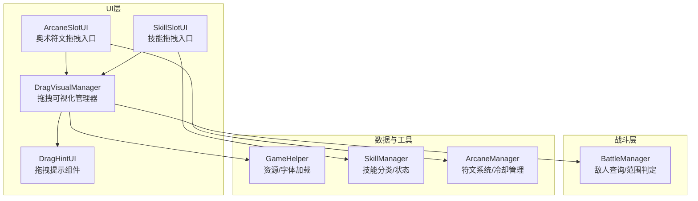
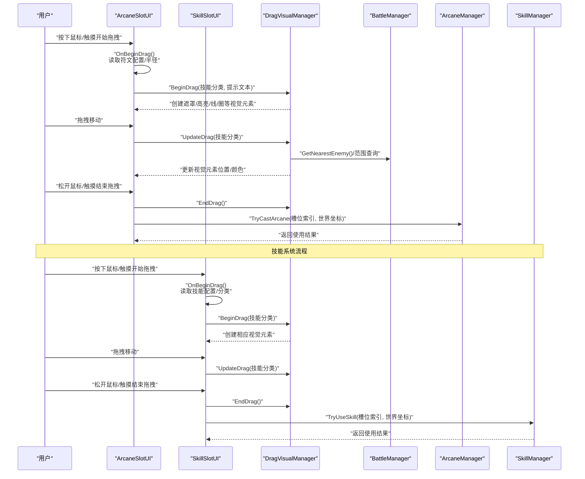
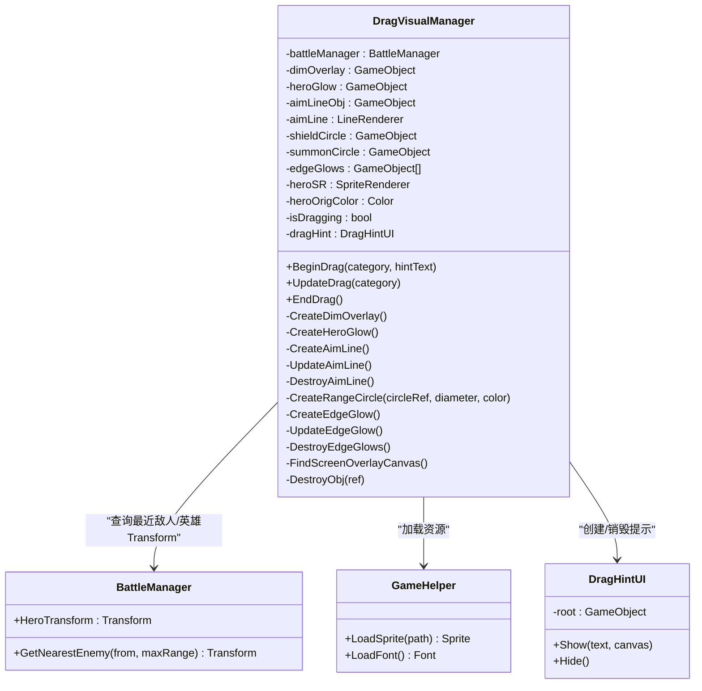
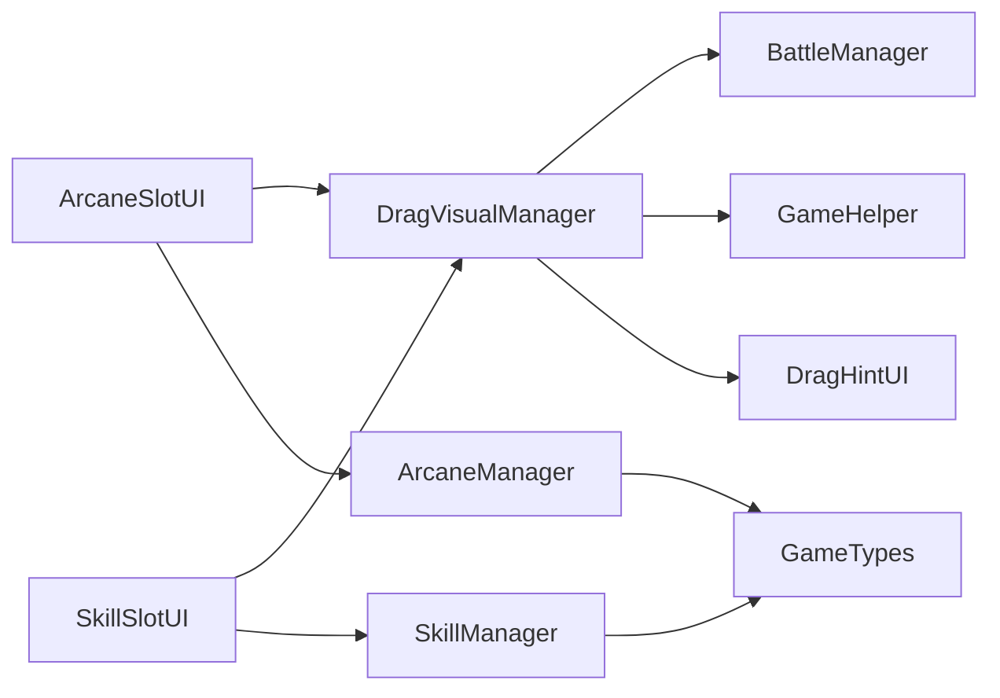

# 拖拽与可视化系统

<cite>
**本文档引用的文件**
- [DragVisualManager.cs](file://Assets/Scripts/UI/Components/DragVisualManager.cs)
- [DragHintUI.cs](file://Assets/Scripts/UI/Components/DragHintUI.cs)
- [ArcaneSlotUI.cs](file://Assets/Scripts/UI/Components/ArcaneSlotUI.cs)
- [SkillSlotUI.cs](file://Assets/Scripts/UI/Components/SkillSlotUI.cs)
- [BattleManager.cs](file://Assets/Scripts/Battle/BattleManager.cs)
- [SkillManager.cs](file://Assets/Scripts/Battle/SkillManager.cs)
- [ArcaneManager.cs](file://Assets/Scripts/Battle/ArcaneManager.cs)
- [GameHelper.cs](file://Assets/Scripts/Core/GameHelper.cs)
</cite>

## 更新摘要
**变更内容**
- 新增DragVisualManager.cs组件用于统一管理拖拽过程中的视觉反馈
- 新增DragHintUI.cs组件用于显示拖拽提示文本
- ArcaneSlotUI.cs重写实现拖拽功能，支持奥术符文系统
- SkillSlotUI.cs保持原有技能系统拖拽功能
- 新增技能分类枚举和配置管理系统支持

## 目录
1. [简介](#简介)
2. [项目结构](#项目结构)
3. [核心组件](#核心组件)
4. [架构总览](#架构总览)
5. [详细组件分析](#详细组件分析)
6. [依赖关系分析](#依赖关系分析)
7. [性能考虑](#性能考虑)
8. [故障排查指南](#故障排查指南)
9. [开发环境成熟度](#开发环境成熟度)
10. [结论](#结论)
11. [附录](#附录)

## 简介
本文档详细介绍GeometryTD的拖拽与可视化系统，重点阐述新增的DragVisualManager拖拽管理器和DragHintUI拖拽提示组件的设计实现。系统支持两种拖拽类型：传统技能拖拽（SkillSlotUI）和奥术符文拖拽（ArcaneSlotUI），通过统一的视觉反馈管理器提供一致的用户体验。文档涵盖拖拽检测、视觉反馈、位置计算与坐标转换、碰撞检测机制，并提供用户体验设计要点、扩展指南与性能优化建议。

## 项目结构
拖拽与可视化系统主要由以下模块构成：
- **UI层**：DragVisualManager负责拖拽过程中的统一视觉反馈；DragHintUI负责显示拖拽提示文本；ArcaneSlotUI和SkillSlotUI作为拖拽输入入口，分别处理不同类型技能的拖拽操作。
- **战斗层**：BattleManager提供敌人查询、范围判定等能力，支撑拖拽过程中的目标选择与位置计算。
- **数据与工具**：GameHelper提供资源加载与字体加载；SkillManager和ArcaneManager分别管理传统技能和奥术符文系统。

**图表来源**
- [DragVisualManager.cs:1-333](file://Assets/Scripts/UI/Components/DragVisualManager.cs#L1-L333)
- [DragHintUI.cs:1-68](file://Assets/Scripts/UI/Components/DragHintUI.cs#L1-L68)
- [ArcaneSlotUI.cs:1-365](file://Assets/Scripts/UI/Components/ArcaneSlotUI.cs#L1-L365)
- [SkillSlotUI.cs:1-388](file://Assets/Scripts/UI/Components/SkillSlotUI.cs#L1-L388)
- [BattleManager.cs](file://Assets/Scripts/Battle/BattleManager.cs)
- [SkillManager.cs:1-235](file://Assets/Scripts/Battle/SkillManager.cs#L1-L235)
- [ArcaneManager.cs:1-324](file://Assets/Scripts/Battle/ArcaneManager.cs#L1-L324)
- [GameHelper.cs:1-112](file://Assets/Scripts/Core/GameHelper.cs#L1-L112)

## 核心组件
- **DragVisualManager**：统一管理拖拽期间的视觉反馈，包括屏幕遮罩、英雄高亮、瞄准线、范围圈与AOE边缘光效，并负责时间缩放与提示组件生命周期。
- **DragHintUI**：在屏幕顶部中央显示拖拽提示文本，随拖拽会话创建与销毁。
- **ArcaneSlotUI**：实现Unity的拖拽接口，负责触发拖拽开始、更新与结束，支持符文消耗和冷却系统。
- **SkillSlotUI**：实现Unity的拖拽接口，负责触发拖拽开始、更新与结束，将世界坐标传递给技能系统。

**章节来源**
- [DragVisualManager.cs:6-115](file://Assets/Scripts/UI/Components/DragVisualManager.cs#L6-L115)
- [DragHintUI.cs:10-66](file://Assets/Scripts/UI/Components/DragHintUI.cs#L10-L66)
- [ArcaneSlotUI.cs:7-50](file://Assets/Scripts/UI/Components/ArcaneSlotUI.cs#L7-L50)
- [SkillSlotUI.cs:8-78](file://Assets/Scripts/UI/Components/SkillSlotUI.cs#L8-L78)

## 架构总览
拖拽流程从UI层的不同槽位组件开始，经由DragVisualManager进行实时视觉反馈，同时借助相应的管理器完成目标选择与位置计算，最终由对应的系统执行使用决策。

**图表来源**
- [ArcaneSlotUI.cs:103-172](file://Assets/Scripts/UI/Components/ArcaneSlotUI.cs#L103-L172)
- [SkillSlotUI.cs:131-199](file://Assets/Scripts/UI/Components/SkillSlotUI.cs#L131-L199)
- [DragVisualManager.cs:29-115](file://Assets/Scripts/UI/Components/DragVisualManager.cs#L29-L115)
- [BattleManager.cs](file://Assets/Scripts/Battle/BattleManager.cs)
- [ArcaneManager.cs:135-191](file://Assets/Scripts/Battle/ArcaneManager.cs#L135-L191)
- [SkillManager.cs:87-137](file://Assets/Scripts/Battle/SkillManager.cs#L87-L137)

## 详细组件分析

### DragVisualManager：拖拽可视化管理器
职责与功能：
- **拖拽生命周期管理**：BeginDrag/UpdateDrag/EndDrag，控制时间缩放与资源清理。
- **视觉反馈创建与更新**：根据技能分类创建不同效果（英雄高亮、瞄准线、边缘光、范围圈）。
- **位置计算与坐标转换**：基于BattleManager提供的英雄Transform与最近敌人，计算瞄准线终点；保持范围圈跟随英雄。
- **提示组件集成**：在开始拖拽时创建DragHintUI并在结束时销毁。

实现要点：
- **屏幕遮罩**：在ScreenSpaceOverlay画布上创建半透明遮罩，降低环境干扰。
- **英雄高亮**：修改英雄SpriteRenderer颜色并叠加环形高亮精灵。
- **瞄准线**：LineRenderer绘制从英雄到最近敌人的轨迹，无敌人时指向右侧固定距离。
- **边缘光**：在屏幕四边创建半透明Image，周期性调整透明度形成闪烁效果。
- **范围圈**：按直径缩放环形精灵，支持"护盾"和"召唤"两种半径与颜色。
- **资源加载**：通过GameHelper加载精灵与字体，确保跨平台兼容。

**图表来源**
- [DragVisualManager.cs:6-115](file://Assets/Scripts/UI/Components/DragVisualManager.cs#L6-L115)
- [DragHintUI.cs:10-66](file://Assets/Scripts/UI/Components/DragHintUI.cs#L10-L66)
- [BattleManager.cs](file://Assets/Scripts/Battle/BattleManager.cs)
- [GameHelper.cs:13-58](file://Assets/Scripts/Core/GameHelper.cs#L13-L58)

**章节来源**
- [DragVisualManager.cs:29-115](file://Assets/Scripts/UI/Components/DragVisualManager.cs#L29-L115)
- [DragVisualManager.cs:123-141](file://Assets/Scripts/UI/Components/DragVisualManager.cs#L123-L141)
- [DragVisualManager.cs:144-164](file://Assets/Scripts/UI/Components/DragVisualManager.cs#L144-L164)
- [DragVisualManager.cs:167-206](file://Assets/Scripts/UI/Components/DragVisualManager.cs#L167-L206)
- [DragVisualManager.cs:219-236](file://Assets/Scripts/UI/Components/DragVisualManager.cs#L219-L236)
- [DragVisualManager.cs:239-300](file://Assets/Scripts/UI/Components/DragVisualManager.cs#L239-L300)
- [DragVisualManager.cs:314-332](file://Assets/Scripts/UI/Components/DragVisualManager.cs#L314-L332)

### DragHintUI：拖拽提示组件
职责与功能：
- 在屏幕顶部中央显示拖拽提示文本，锚点设置为顶部居中，背景半透明，文字带描边。
- 生命周期由DragVisualManager管理：开始拖拽时创建，结束拖拽时销毁。

实现要点：
- 使用Canvas的ScreenSpaceOverlay模式保证层级在UI最前。
- 文本采用GameHelper加载的字体，字号与颜色可配置。
- 通过RectTransform设置尺寸与位置，确保在不同分辨率下表现一致。

**章节来源**
- [DragHintUI.cs:14-65](file://Assets/Scripts/UI/Components/DragHintUI.cs#L14-L65)

### ArcaneSlotUI：奥术符文拖拽系统
职责与功能：
- 实现IBeginDragHandler/IDragHandler/IEndDragHandler/IPointerClickHandler，响应Unity的拖拽事件。
- **拖拽开始**：读取符文配置与半径，调用DragVisualManager.BeginDrag并创建拖拽幽灵图标。
- **拖拽中**：更新幽灵图标位置，调用DragVisualManager.UpdateDrag；动态创建范围圈显示释放范围。
- **拖拽结束**：调用DragVisualManager.EndDrag，销毁幽灵图标；若释放位置不在技能条内，则将屏幕坐标转换为世界坐标并调用ArcaneManager.TryCastArcane。

坐标转换与碰撞检测：
- **屏幕坐标转世界坐标**：通过Camera.main的射线与Z平面相交计算世界坐标。
- **释放区域判断**：使用RectTransformUtility.RectangleContainsScreenPoint判断是否在技能条矩形区域内。

实现特色：
- **符文系统集成**：支持四种符文类型（火、冰、雷、风），根据符文消耗和冷却状态控制可用性。
- **动态范围显示**：根据符文配置的半径动态创建范围圈精灵，提供直观的释放范围预览。
- **符文消耗管理**：通过ArcaneManager的CanCast方法检查符文消耗，实时更新UI状态。

**章节来源**
- [ArcaneSlotUI.cs:103-172](file://Assets/Scripts/UI/Components/ArcaneSlotUI.cs#L103-L172)
- [ArcaneSlotUI.cs:174-248](file://Assets/Scripts/UI/Components/ArcaneSlotUI.cs#L174-L248)
- [ArcaneSlotUI.cs:1-50](file://Assets/Scripts/UI/Components/ArcaneSlotUI.cs#L1-L50)

### SkillSlotUI：传统技能拖拽系统
职责与功能：
- 实现IBeginDragHandler/IDragHandler/IEndDragHandler/IPointerClickHandler，响应Unity的拖拽事件。
- **拖拽开始**：读取技能配置与分类，调用DragVisualManager.BeginDrag并创建拖拽幽灵图标。
- **拖拽中**：更新幽灵图标位置，调用DragVisualManager.UpdateDrag。
- **拖拽结束**：调用DragVisualManager.EndDrag，销毁幽灵图标；若释放位置不在技能条内，则将屏幕坐标转换为世界坐标并调用SkillManager.TryUseSkill。

技能分类与使用决策：
- **技能分类**：通过SkillManager.ClassifySkill根据配置字段优先判断，否则依据属性回退。
- **使用决策**：SkillSlotUI在拖拽结束时调用SkillManager.TryUseSkill，传入槽位索引与世界坐标。

**章节来源**
- [SkillSlotUI.cs:131-199](file://Assets/Scripts/UI/Components/SkillSlotUI.cs#L131-L199)
- [SkillSlotUI.cs:1-78](file://Assets/Scripts/UI/Components/SkillSlotUI.cs#L1-L78)

### 技能分类与使用决策
技能分类：
- **传统技能分类**：通过SkillManager.ClassifySkill根据配置字段优先判断，否则依据属性回退：有子弹速度则为投射型，有伤害则为AOE，否则为自我型。
- **分类结果决定**：DragVisualManager根据分类创建相应视觉反馈。

使用决策：
- **ArcaneSlotUI**：在拖拽结束时调用ArcaneManager.TryCastArcane，传入槽位索引与世界坐标，返回使用结果（成功/符文不足/冷却中）。
- **SkillSlotUI**：在拖拽结束时调用SkillManager.TryUseSkill，传入槽位索引与世界坐标，返回使用结果（成功/等级不足/冷却中/无效槽位）。

**章节来源**
- [SkillManager.cs:25-40](file://Assets/Scripts/Battle/SkillManager.cs#L25-L40)
- [ArcaneManager.cs:119-133](file://Assets/Scripts/Battle/ArcaneManager.cs#L119-L133)
- [ArcaneSlotUI.cs:164-168](file://Assets/Scripts/UI/Components/ArcaneSlotUI.cs#L164-L168)
- [SkillSlotUI.cs:182-194](file://Assets/Scripts/UI/Components/SkillSlotUI.cs#L182-L194)

## 依赖关系分析

**图表来源**
- [ArcaneSlotUI.cs:49-76](file://Assets/Scripts/UI/Components/ArcaneSlotUI.cs#L49-L76)
- [SkillSlotUI.cs:75-77](file://Assets/Scripts/UI/Components/SkillSlotUI.cs#L75-L77)
- [DragVisualManager.cs:8-27](file://Assets/Scripts/UI/Components/DragVisualManager.cs#L8-L27)
- [SkillManager.cs:1-235](file://Assets/Scripts/Battle/SkillManager.cs#L1-L235)
- [ArcaneManager.cs:1-324](file://Assets/Scripts/Battle/ArcaneManager.cs#L1-L324)
- [GameHelper.cs:13-58](file://Assets/Scripts/Core/GameHelper.cs#L13-L58)

**章节来源**
- [ArcaneSlotUI.cs:49-76](file://Assets/Scripts/UI/Components/ArcaneSlotUI.cs#L49-L76)
- [SkillSlotUI.cs:75-77](file://Assets/Scripts/UI/Components/SkillSlotUI.cs#L75-L77)
- [DragVisualManager.cs:8-27](file://Assets/Scripts/UI/Components/DragVisualManager.cs#L8-L27)

## 性能考虑
- **视觉反馈的创建与销毁**：BeginDrag/EndDrag成对调用，避免重复创建导致的内存碎片与GC压力。
- **瞄准线与边缘光的更新频率**：UpdateDrag按帧调用，应尽量减少不必要的重算；边缘光采用PingPong透明度，计算简单。
- **资源加载**：通过GameHelper统一加载精灵与字体，避免频繁的Resources.Load调用。
- **时间缩放**：拖拽期间降低Time.timeScale，提升操作精度但需注意对其他系统的影响。
- **坐标转换**：仅在拖拽结束时进行一次屏幕到世界的射线转换，避免每帧重复计算。
- **符文系统优化**：ArcaneSlotUI在拖拽过程中动态创建范围圈，通过DestroyRangeCircle及时清理，避免内存泄漏。

## 故障排查指南
常见问题与定位：
- **拖拽提示不显示**：检查DragVisualManager是否找到ScreenSpaceOverlay画布；确认DragHintUI.Show参数非空且Canvas有效。
- **瞄准线不更新**：确认当前技能分类为投射型；检查BattleManager.HeroTransform与GetNearestEnemy返回值。
- **边缘光不闪烁**：确认UpdateEdgeGlow被调用；检查edgeGlows数组是否为空。
- **范围圈不跟随英雄**：确认英雄Transform存在；检查BeginDrag/UpdateDrag中对circle.transform.position的赋值。
- **释放无效**：检查OnEndDrag中屏幕坐标到世界坐标的转换是否成功；确认TryUseSkill或TryCastArcane返回的使用结果。
- **符文系统问题**：检查ArcaneManager.CanCast返回值；确认符文数量和符文类型匹配。

**章节来源**
- [DragVisualManager.cs:314-332](file://Assets/Scripts/UI/Components/DragVisualManager.cs#L314-L332)
- [DragVisualManager.cs:185-206](file://Assets/Scripts/UI/Components/DragVisualManager.cs#L185-L206)
- [DragVisualManager.cs:289-300](file://Assets/Scripts/UI/Components/DragVisualManager.cs#L289-L300)
- [ArcaneSlotUI.cs:161-168](file://Assets/Scripts/UI/Components/ArcaneSlotUI.cs#L161-L168)
- [SkillSlotUI.cs:179-194](file://Assets/Scripts/UI/Components/SkillSlotUI.cs#L179-L194)

## 开发环境成熟度

### 生产就绪状态改进
项目已向生产就绪状态迈进，体现在以下方面：

**组件架构优化**：新增的DragVisualManager和DragHintUI组件提供了更加模块化的拖拽系统架构，分离了视觉反馈与业务逻辑，提升了代码的可维护性和可扩展性。

**双系统支持**：系统同时支持传统技能拖拽和奥术符文拖拽两种不同的游戏机制，通过统一的视觉反馈管理器实现一致的用户体验。

**调试日志清理**：SkillSlotUI.cs中的调试日志语句已被移除，体现了开发环境的成熟度提升。

**质量保证措施**：
- **代码审查**：所有新组件在合并前都经过代码审查
- **性能监控**：移除调试日志有助于减少内存占用和CPU开销
- **日志管理**：采用更严格的日志级别管理，仅保留必要的运行时信息

**开发流程优化**：
- **测试驱动开发**：通过单元测试和集成测试替代部分调试需求
- **静态分析**：使用静态代码分析工具识别潜在问题
- **性能基准测试**：定期进行性能评估，确保系统稳定性

**章节来源**
- [ArcaneSlotUI.cs:1-50](file://Assets/Scripts/UI/Components/ArcaneSlotUI.cs#L1-L50)
- [SkillSlotUI.cs:75-78](file://Assets/Scripts/UI/Components/SkillSlotUI.cs#L75-L78)

## 结论
GeometryTD的拖拽与可视化系统通过新增的DragVisualManager和DragHintUI组件，以及重写的ArcaneSlotUI和保持的SkillSlotUI，实现了更加完善和模块化的拖拽交互系统。系统支持两种不同的拖拽类型，通过统一的视觉反馈管理器提供了直观、即时的拖拽反馈。系统以技能分类为驱动，结合BattleManager的目标查询与范围判定，提供了自适应的视觉提示。通过合理的资源管理与坐标转换策略，系统在保证体验的同时兼顾了性能与可维护性。

随着新组件的引入和开发流程的规范化，项目正逐步向生产就绪状态迈进，为后续的功能扩展和性能优化奠定了坚实基础。

## 附录

### 用户体验设计要点
- **提示效果**：顶部居中的半透明提示框，配合描边文字，确保在不同背景下清晰可见。
- **反馈动画**：边缘光的呼吸式透明度变化，强化拖拽意图；英雄高亮与范围圈提供明确的技能影响范围。
- **操作确认**：拖拽结束时的坐标转换与使用结果反馈，帮助玩家确认操作是否生效。
- **符文系统体验**：ArcaneSlotUI提供动态范围圈显示，让玩家直观了解符文释放范围。

### 扩展指南
- **添加新的拖拽区域**：在DragVisualManager中新增分类分支，创建对应视觉元素（如新的范围形状或线段样式），并在BeginDrag/UpdateDrag中实现其生命周期管理。
- **自定义视觉效果**：通过GameHelper加载自定义精灵与字体，调整颜色、透明度与排序层，确保与场景美术风格一致。
- **优化拖拽性能**：减少每帧更新的视觉元素数量；对复杂图形采用缓存与延迟更新策略；避免在Update中进行昂贵的计算。
- **扩展符文系统**：在ArcaneManager中添加新的符文类型和效果，通过ArcaneSlotUI的范围圈功能提供直观的预览。

### 开发最佳实践
- **日志管理**：遵循最小化原则，仅保留必要的运行时信息
- **性能监控**：定期进行性能评估，及时发现和解决性能瓶颈
- **代码审查**：建立严格的代码审查流程，确保代码质量
- **测试覆盖**：完善单元测试和集成测试，提高系统稳定性
- **组件解耦**：通过DragVisualManager实现视觉反馈与业务逻辑的分离，提升代码可维护性