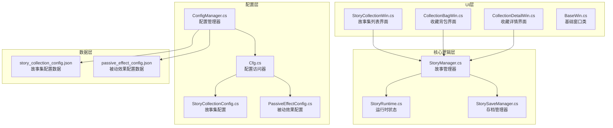
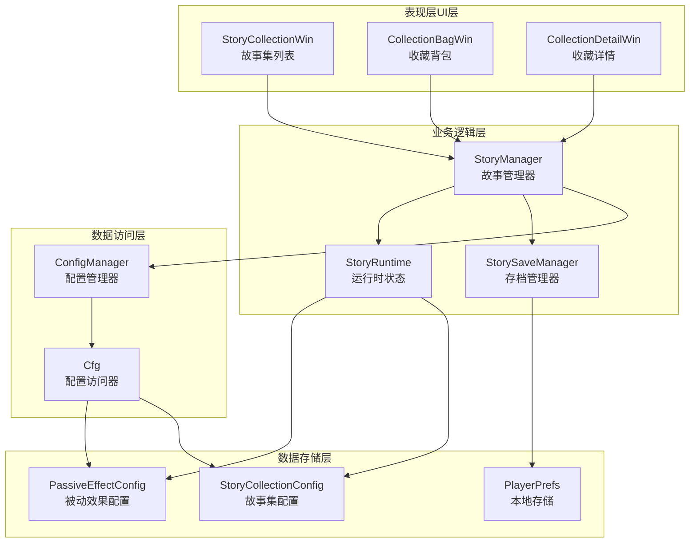
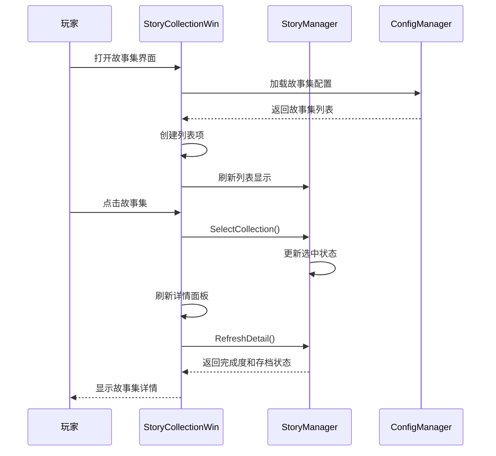
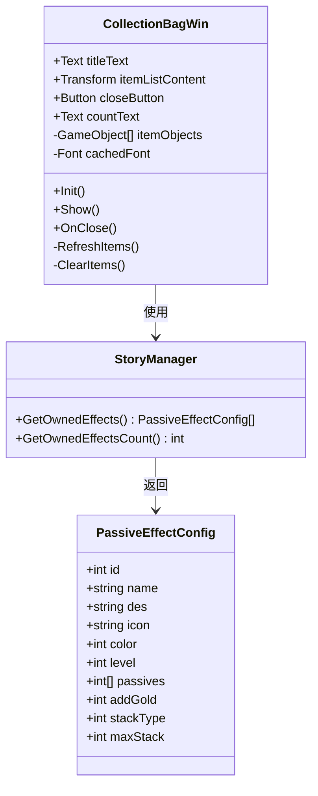
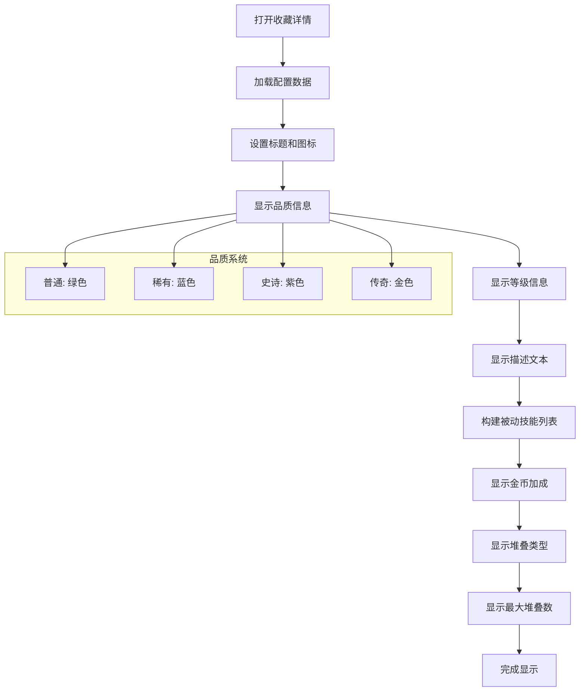
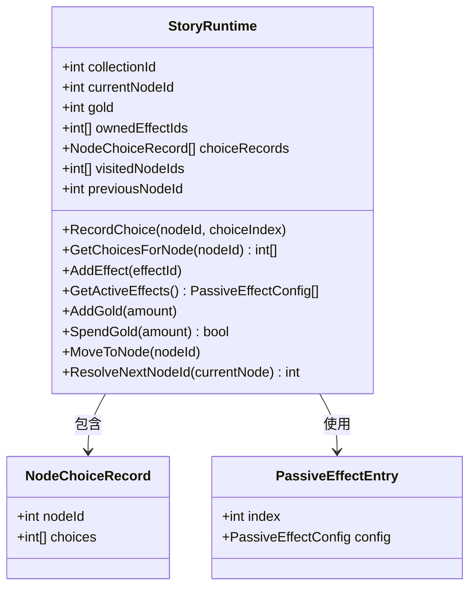
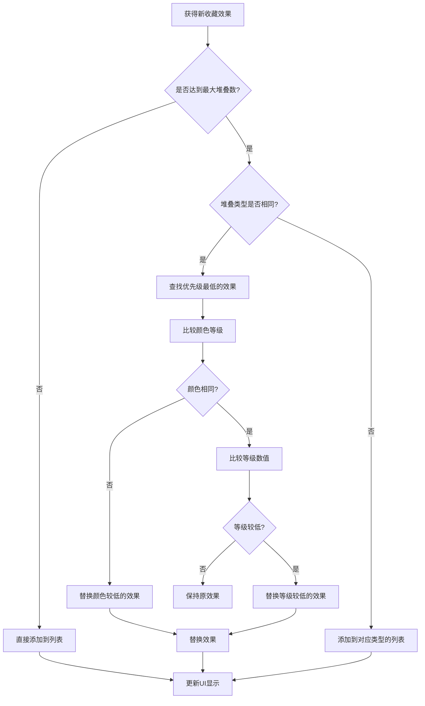
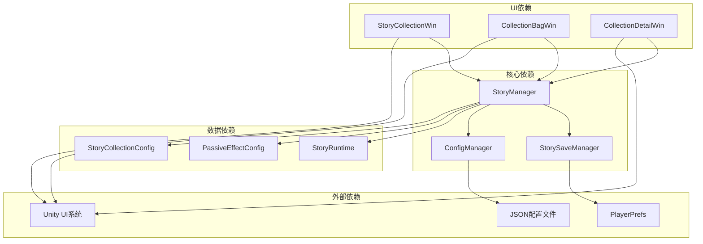

# 收藏系统

<cite>
**本文档引用的文件**
- [StoryCollectionWin.cs](file://Assets/Scripts/UI/StoryCollectionWin.cs)
- [CollectionBagWin.cs](file://Assets/Scripts/UI/CollectionBagWin.cs)
- [CollectionDetailWin.cs](file://Assets/Scripts/UI/CollectionDetailWin.cs)
- [StoryCollectionConfig.cs](file://Assets/Scripts/Data/Configs/StoryCollectionConfig.cs)
- [PassiveEffectConfig.cs](file://Assets/Scripts/Data/Configs/PassiveEffectConfig.cs)
- [StoryManager.cs](file://Assets/Scripts/Core/StoryManager.cs)
- [StoryRuntime.cs](file://Assets/Scripts/Data/StoryRuntime.cs)
- [StorySaveManager.cs](file://Assets/Scripts/Core/StorySaveManager.cs)
- [ConfigManager.cs](file://Assets/Scripts/Core/ConfigManager.cs)
- [Cfg.cs](file://Assets/Scripts/Core/Cfg.cs)
- [BaseWin.cs](file://Assets/Scripts/UI/BaseWin.cs)
- [story_collection_config.json](file://Assets/Resources/Configs/story_collection_config.json)
- [passive_effect_config.json](file://Assets/Resources/Configs/passive_effect_config.json)
</cite>

## 目录
1. [简介](#简介)
2. [项目结构](#项目结构)
3. [核心组件](#核心组件)
4. [架构概览](#架构概览)
5. [详细组件分析](#详细组件分析)
6. [依赖关系分析](#依赖关系分析)
7. [性能考虑](#性能考虑)
8. [故障排除指南](#故障排除指南)
9. [结论](#结论)

## 简介

收藏系统是GeometryTD游戏中的核心功能模块，负责管理玩家在故事集冒险中获得的各种被动效果（藏品）。该系统实现了完整的收藏收集、展示、管理和持久化机制，包括故事集浏览、收藏详情查看、效果叠加管理等功能。

系统基于Unity的UI框架构建，采用配置驱动的设计模式，通过JSON配置文件定义各种收藏效果和故事集信息。收藏系统与游戏的核心机制紧密集成，为玩家提供丰富的策略深度和收集乐趣。

## 项目结构

收藏系统主要分布在以下目录结构中：

**图表来源**
- [StoryCollectionWin.cs:1-391](file://Assets/Scripts/UI/StoryCollectionWin.cs#L1-L391)
- [CollectionBagWin.cs:1-51](file://Assets/Scripts/UI/CollectionBagWin.cs#L1-L51)
- [CollectionDetailWin.cs:1-421](file://Assets/Scripts/UI/CollectionDetailWin.cs#L1-L421)
- [StoryManager.cs:1-574](file://Assets/Scripts/Core/StoryManager.cs#L1-L574)
- [StoryRuntime.cs:1-379](file://Assets/Scripts/Data/StoryRuntime.cs#L1-L379)
- [StorySaveManager.cs:1-179](file://Assets/Scripts/Core/StorySaveManager.cs#L1-L179)
- [ConfigManager.cs:1-259](file://Assets/Scripts/Core/ConfigManager.cs#L1-L259)
- [Cfg.cs:1-34](file://Assets/Scripts/Core/Cfg.cs#L1-L34)

**章节来源**
- [StoryCollectionWin.cs:1-391](file://Assets/Scripts/UI/StoryCollectionWin.cs#L1-L391)
- [CollectionBagWin.cs:1-51](file://Assets/Scripts/UI/CollectionBagWin.cs#L1-L51)
- [CollectionDetailWin.cs:1-421](file://Assets/Scripts/UI/CollectionDetailWin.cs#L1-L421)
- [StoryManager.cs:1-574](file://Assets/Scripts/Core/StoryManager.cs#L1-L574)

## 核心组件

### 收藏效果管理系统

收藏效果系统是整个收藏系统的核心，负责管理玩家获得的各种被动效果。每个收藏效果都有独特的属性和效果机制。

**收藏效果属性结构：**
- 基础属性：ID、名称、描述、图标
- 品质系统：颜色等级（普通、稀有、史诗、传奇）
- 等级系统：效果等级影响强度
- 主动效果：关联的被动技能ID数组
- 金币加成：额外金币获取百分比
- 叠加系统：堆叠类型和最大堆叠数

### 故事集管理器

故事集管理器是收藏系统的中枢控制器，负责协调各个组件的工作。

**核心职责：**
- 管理故事集的完整生命周期
- 处理玩家选择和效果发放
- 维护运行时状态和存档
- 提供UI界面的数据接口

### 存档系统

存档系统确保玩家的游戏进度能够持久化保存。

**存档类型：**
- 运行时存档：当前冒险过程中的临时存档
- 永久进度：已完成的结局和成就信息
- 配置缓存：游戏配置的内存缓存

**章节来源**
- [PassiveEffectConfig.cs:1-31](file://Assets/Scripts/Data/Configs/PassiveEffectConfig.cs#L1-L31)
- [StoryManager.cs:1-574](file://Assets/Scripts/Core/StoryManager.cs#L1-L574)
- [StoryRuntime.cs:1-379](file://Assets/Scripts/Data/StoryRuntime.cs#L1-L379)
- [StorySaveManager.cs:1-179](file://Assets/Scripts/Core/StorySaveManager.cs#L1-L179)

## 架构概览

收藏系统采用分层架构设计，各层职责明确，耦合度低，便于维护和扩展。

**图表来源**
- [StoryCollectionWin.cs:1-391](file://Assets/Scripts/UI/StoryCollectionWin.cs#L1-L391)
- [CollectionBagWin.cs:1-51](file://Assets/Scripts/UI/CollectionBagWin.cs#L1-L51)
- [CollectionDetailWin.cs:1-421](file://Assets/Scripts/UI/CollectionDetailWin.cs#L1-L421)
- [StoryManager.cs:1-574](file://Assets/Scripts/Core/StoryManager.cs#L1-L574)
- [StorySaveManager.cs:1-179](file://Assets/Scripts/Core/StorySaveManager.cs#L1-L179)
- [ConfigManager.cs:1-259](file://Assets/Scripts/Core/ConfigManager.cs#L1-L259)
- [Cfg.cs:1-34](file://Assets/Scripts/Core/Cfg.cs#L1-L34)

## 详细组件分析

### 故事集列表界面（StoryCollectionWin）

故事集列表界面是玩家进入收藏系统的主要入口，提供了故事集的浏览和选择功能。

**图表来源**
- [StoryCollectionWin.cs:30-306](file://Assets/Scripts/UI/StoryCollectionWin.cs#L30-L306)
- [StoryManager.cs:555-565](file://Assets/Scripts/Core/StoryManager.cs#L555-L565)
- [ConfigManager.cs:149-153](file://Assets/Scripts/Core/ConfigManager.cs#L149-L153)

**界面特性：**
- 动态创建故事集列表项
- 实时显示完成度百分比
- 标识当前是否有存档状态
- 响应式布局适配不同屏幕尺寸

**交互流程：**
1. 初始化阶段：加载字体资源，构建UI结构
2. 显示阶段：刷新列表内容，设置默认选中项
3. 交互阶段：处理用户点击，更新选中状态
4. 刷新阶段：同步更新详情面板显示

**章节来源**
- [StoryCollectionWin.cs:30-391](file://Assets/Scripts/UI/StoryCollectionWin.cs#L30-L391)

### 收藏背包界面（CollectionBagWin）

收藏背包界面展示了玩家当前拥有的所有收藏效果，提供了收藏的集中管理和查看功能。

**图表来源**
- [CollectionBagWin.cs:1-51](file://Assets/Scripts/UI/CollectionBagWin.cs#L1-L51)
- [StoryManager.cs:443-472](file://Assets/Scripts/Core/StoryManager.cs#L443-L472)
- [PassiveEffectConfig.cs:1-31](file://Assets/Scripts/Data/Configs/PassiveEffectConfig.cs#L1-L31)

**功能特性：**
- 实时显示收藏总数
- 动态生成收藏列表项
- 支持收藏效果的详细查看
- 自动清理和资源管理

**章节来源**
- [CollectionBagWin.cs:1-51](file://Assets/Scripts/UI/CollectionBagWin.cs#L1-L51)
- [StoryManager.cs:443-472](file://Assets/Scripts/Core/StoryManager.cs#L443-L472)

### 收藏详情界面（CollectionDetailWin）

收藏详情界面提供了收藏效果的详细信息展示，包括品质、等级、被动技能、统计信息等。

**图表来源**
- [CollectionDetailWin.cs:50-129](file://Assets/Scripts/UI/CollectionDetailWin.cs#L50-L129)
- [CollectionDetailWin.cs:153-199](file://Assets/Scripts/UI/CollectionDetailWin.cs#L153-L199)

**详情展示内容：**
- 基础信息：名称、图标、品质、等级
- 描述信息：效果描述文本
- 被动技能：关联的被动技能列表
- 统计信息：金币加成、堆叠类型、最大堆叠数

**章节来源**
- [CollectionDetailWin.cs:1-421](file://Assets/Scripts/UI/CollectionDetailWin.cs#L1-L421)

### 故事集运行时状态（StoryRuntime）

故事集运行时状态是收藏系统的核心数据结构，负责管理当前冒险过程中的所有状态信息。

**图表来源**
- [StoryRuntime.cs:11-295](file://Assets/Scripts/Data/StoryRuntime.cs#L11-L295)
- [StoryRuntime.cs:300-308](file://Assets/Scripts/Data/StoryRuntime.cs#L300-L308)

**核心功能：**
- 收藏效果管理：添加、移除、叠加效果
- 选择记录：跟踪玩家的选择历史
- 状态持久化：支持存档和恢复
- 路径解析：根据选择确定后续节点

**章节来源**
- [StoryRuntime.cs:1-379](file://Assets/Scripts/Data/StoryRuntime.cs#L1-L379)

### 收藏效果叠加机制

收藏系统的叠加机制是其核心特色，允许玩家通过合理搭配获得更强的效果。

**图表来源**
- [StoryRuntime.cs:61-112](file://Assets/Scripts/Data/StoryRuntime.cs#L61-L112)
- [StoryRuntime.cs:117-174](file://Assets/Scripts/Data/StoryRuntime.cs#L117-L174)

**叠加规则：**
1. **堆叠类型分组**：相同堆叠类型的效果归为一组
2. **优先级计算**：颜色等级 × 100 + 等级数值
3. **上限控制**：每个类型最多保留maxStack个效果
4. **替换机制**：优先替换优先级最低的效果

**章节来源**
- [StoryRuntime.cs:61-174](file://Assets/Scripts/Data/StoryRuntime.cs#L61-L174)

## 依赖关系分析

收藏系统各组件之间的依赖关系清晰明确，形成了稳定的层次结构。

**图表来源**
- [StoryManager.cs:1-574](file://Assets/Scripts/Core/StoryManager.cs#L1-L574)
- [StorySaveManager.cs:1-179](file://Assets/Scripts/Core/StorySaveManager.cs#L1-L179)
- [ConfigManager.cs:1-259](file://Assets/Scripts/Core/ConfigManager.cs#L1-L259)
- [StoryCollectionWin.cs:1-391](file://Assets/Scripts/UI/StoryCollectionWin.cs#L1-L391)

**依赖特点：**
- **单向依赖**：UI层依赖业务逻辑层，业务逻辑层依赖数据层
- **松耦合**：通过接口和事件机制降低组件间耦合
- **可测试性**：清晰的依赖关系便于单元测试和模拟

**章节来源**
- [StoryManager.cs:1-574](file://Assets/Scripts/Core/StoryManager.cs#L1-L574)
- [StorySaveManager.cs:1-179](file://Assets/Scripts/Core/StorySaveManager.cs#L1-L179)
- [ConfigManager.cs:1-259](file://Assets/Scripts/Core/ConfigManager.cs#L1-L259)

## 性能考虑

收藏系统在设计时充分考虑了性能优化，采用了多种策略来确保流畅的用户体验。

### 内存管理优化

1. **对象池模式**：UI元素采用动态创建和销毁，避免长期占用内存
2. **缓存机制**：配置数据和字体资源进行内存缓存
3. **延迟加载**：收藏效果图标按需加载，减少启动时间

### 数据结构优化

1. **字典查找**：使用Dictionary进行快速配置查找
2. **列表优化**：针对频繁操作的列表进行容量预分配
3. **序列化优化**：采用轻量级的JSON序列化格式

### UI渲染优化

1. **Canvas优化**：合理使用CanvasGroup控制可见性
2. **批处理**：相同材质的UI元素进行批处理渲染
3. **懒加载**：滚动列表采用虚拟化技术

## 故障排除指南

### 常见问题及解决方案

**问题1：收藏效果不显示**
- 检查PassiveEffectConfig配置是否正确加载
- 验证收藏ID是否在配置文件中存在
- 确认图标资源路径是否正确

**问题2：存档数据丢失**
- 检查PlayerPrefs是否正常工作
- 验证存档键名格式是否正确
- 确认游戏权限设置

**问题3：UI显示异常**
- 检查字体资源是否正确加载
- 验证Canvas和RectTransform设置
- 确认UI层级和排序设置

**问题4：性能问题**
- 分析UI元素数量和复杂度
- 检查是否存在内存泄漏
- 优化资源配置和加载策略

**章节来源**
- [StorySaveManager.cs:33-75](file://Assets/Scripts/Core/StorySaveManager.cs#L33-L75)
- [ConfigManager.cs:167-182](file://Assets/Scripts/Core/ConfigManager.cs#L167-L182)

### 调试工具和技巧

1. **日志记录**：使用Debug.Log输出关键信息
2. **断点调试**：在关键方法处设置断点
3. **性能分析**：使用Unity Profiler分析性能瓶颈
4. **内存监控**：定期检查内存使用情况

## 结论

收藏系统作为GeometryTD游戏的重要组成部分，展现了优秀的软件架构设计和实现质量。系统采用分层架构，职责分离明确，具有良好的可维护性和扩展性。

**系统优势：**
- **模块化设计**：各组件职责明确，耦合度低
- **配置驱动**：通过JSON配置实现灵活的内容管理
- **性能优化**：多层面的性能优化确保流畅体验
- **用户友好**：直观的UI设计和完善的交互反馈

**未来改进方向：**
- 增加更多收藏效果类型和组合策略
- 优化大规模收藏数据的处理性能
- 扩展跨平台存档支持
- 增强收藏效果的可视化展示

收藏系统不仅为玩家提供了丰富的游戏体验，也为开发者提供了一个优秀的代码示例，展示了如何在Unity中构建高质量的UI系统和数据管理模块。