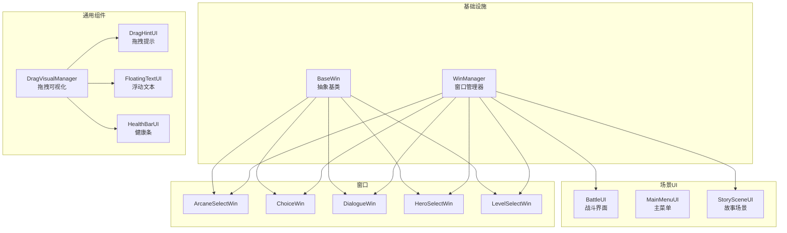
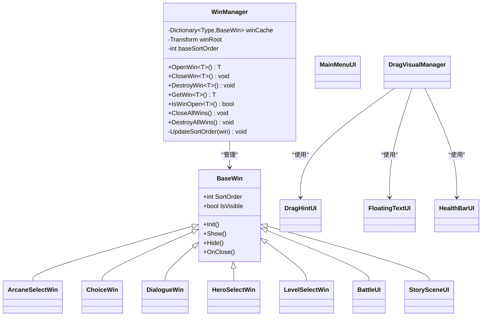
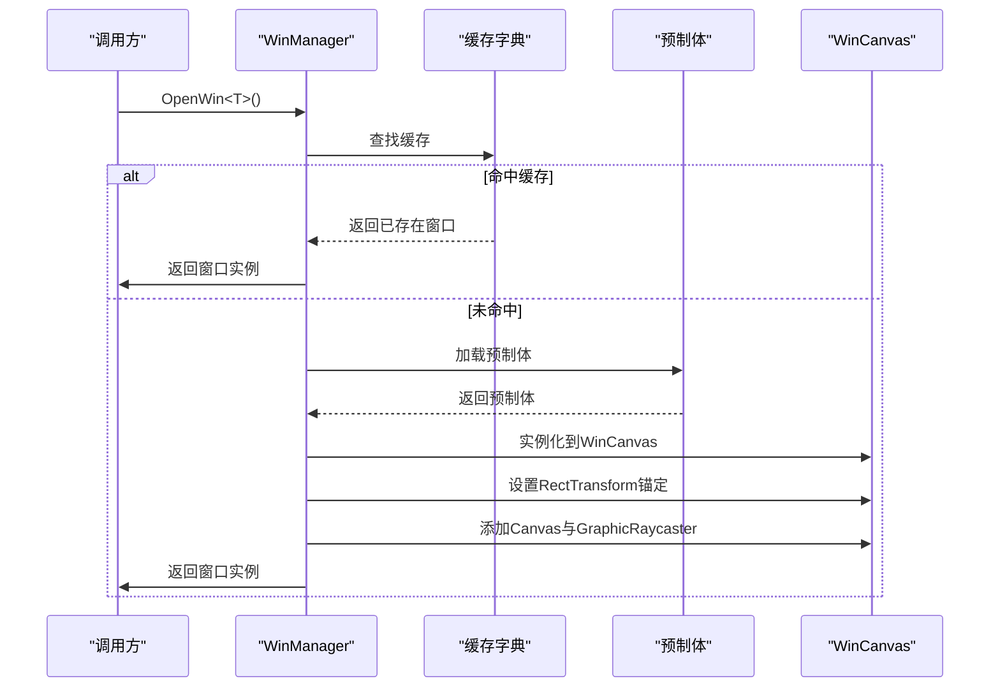
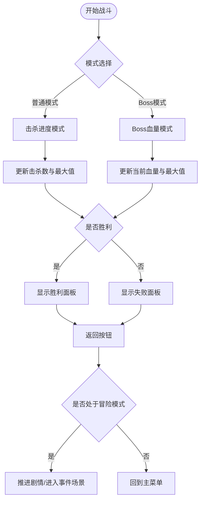
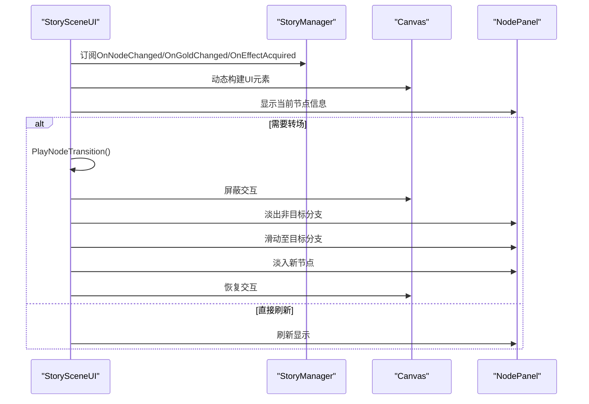
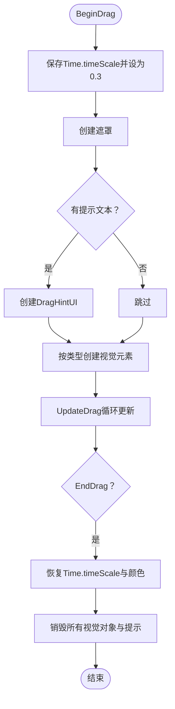
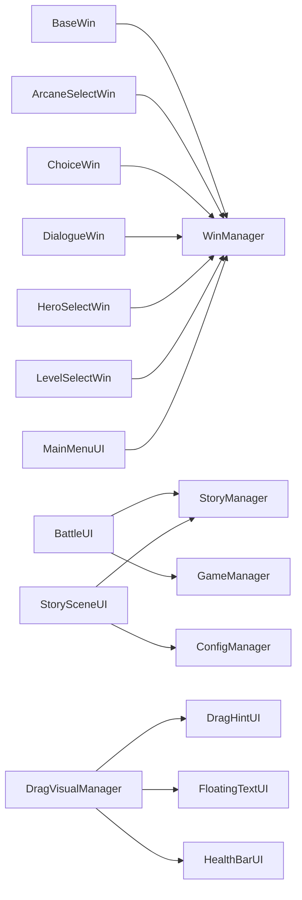

# 用户界面系统

<cite>
**本文档引用的文件**
- [BaseWin.cs](file://Assets/Scripts/UI/BaseWin.cs)
- [WinManager.cs](file://Assets/Scripts/UI/WinManager.cs)
- [BattleUI.cs](file://Assets/Scripts/UI/BattleUI.cs)
- [MainMenuUI.cs](file://Assets/Scripts/UI/MainMenuUI.cs)
- [StorySceneUI.cs](file://Assets/Scripts/UI/StorySceneUI.cs)
- [DragHintUI.cs](file://Assets/Scripts/UI/DragHintUI.cs)
- [FloatingTextUI.cs](file://Assets/Scripts/UI/FloatingTextUI.cs)
- [HealthBarUI.cs](file://Assets/Scripts/UI/HealthBarUI.cs)
- [DragVisualManager.cs](file://Assets/Scripts/UI/DragVisualManager.cs)
- [ArcaneSelectWin.cs](file://Assets/Scripts/UI/ArcaneSelectWin.cs)
- [ChoiceWin.cs](file://Assets/Scripts/UI/ChoiceWin.cs)
- [DialogueWin.cs](file://Assets/Scripts/UI/DialogueWin.cs)
- [HeroSelectWin.cs](file://Assets/Scripts/UI/HeroSelectWin.cs)
- [LevelSelectWin.cs](file://Assets/Scripts/UI/LevelSelectWin.cs)
</cite>

## 目录
1. [简介](#简介)
2. [项目结构](#项目结构)
3. [核心组件](#核心组件)
4. [架构总览](#架构总览)
5. [详细组件分析](#详细组件分析)
6. [依赖关系分析](#依赖关系分析)
7. [性能考量](#性能考量)
8. [故障排查指南](#故障排查指南)
9. [结论](#结论)
10. [附录](#附录)

## 简介
本文件面向GeometryTD的用户界面系统，系统性梳理UI架构设计理念、窗口管理机制、场景UI实现以及通用UI组件。重点覆盖以下方面：
- BaseWin基类的设计模式与生命周期
- WinManager窗口管理器的职责与窗口打开/关闭/层级管理
- 场景UI：BattleUI战斗界面、MainMenuUI主菜单界面、StorySceneUI故事场景界面的功能特性与交互逻辑
- 通用UI组件：拖拽提示系统、浮动文本显示、健康条UI等
- UI与游戏逻辑的交互方式：事件传递、状态同步与数据绑定
- UI系统的扩展性设计与最佳实践

## 项目结构
UI相关代码集中于Assets/Scripts/UI目录，采用"按功能分层+按场景分模块"的组织方式：
- 基础设施层：BaseWin、WinManager
- 场景UI层：BattleUI、MainMenuUI、StorySceneUI
- 通用组件层：DragHintUI、FloatingTextUI、HealthBarUI、DragVisualManager
- 窗口层：ArcaneSelectWin、ChoiceWin、DialogueWin、HeroSelectWin、LevelSelectWin

图表来源
- [BaseWin.cs:1-32](file://Assets/Scripts/UI/BaseWin.cs#L1-L32)
- [WinManager.cs:1-195](file://Assets/Scripts/UI/WinManager.cs#L1-L195)
- [BattleUI.cs:1-146](file://Assets/Scripts/UI/BattleUI.cs#L1-L146)
- [MainMenuUI.cs:1-32](file://Assets/Scripts/UI/MainMenuUI.cs#L1-L32)
- [StorySceneUI.cs:1-607](file://Assets/Scripts/UI/StorySceneUI.cs#L1-L607)
- [DragHintUI.cs:1-68](file://Assets/Scripts/UI/DragHintUI.cs#L1-L68)
- [FloatingTextUI.cs:1-60](file://Assets/Scripts/UI/FloatingTextUI.cs#L1-L60)
- [HealthBarUI.cs:1-36](file://Assets/Scripts/UI/HealthBarUI.cs#L1-L36)
- [DragVisualManager.cs:1-335](file://Assets/Scripts/UI/DragVisualManager.cs#L1-L335)
- [ArcaneSelectWin.cs:1-161](file://Assets/Scripts/UI/ArcaneSelectWin.cs#L1-L161)
- [ChoiceWin.cs:1-299](file://Assets/Scripts/UI/ChoiceWin.cs#L1-L299)
- [DialogueWin.cs:1-433](file://Assets/Scripts/UI/DialogueWin.cs#L1-L433)
- [HeroSelectWin.cs:1-130](file://Assets/Scripts/UI/HeroSelectWin.cs#L1-L130)
- [LevelSelectWin.cs:1-156](file://Assets/Scripts/UI/LevelSelectWin.cs#L1-L156)

章节来源
- [BaseWin.cs:1-32](file://Assets/Scripts/UI/BaseWin.cs#L1-L32)
- [WinManager.cs:1-195](file://Assets/Scripts/UI/WinManager.cs#L1-L195)

## 核心组件
- BaseWin：所有UI窗口的抽象基类，统一生命周期（Init/Show/Hide/OnClose），并暴露SortOrder与IsVisible供层级管理使用。
- WinManager：单例窗口管理器，负责窗口缓存、实例化、层级排序、点击穿透阻断与Canvas根节点管理。

关键点
- 生命周期：Init用于初始化事件绑定；Show激活窗口；Hide隐藏；OnClose默认委托Hide，可被子类重写。
- 层级控制：通过Canvas的sortingOrder与RectTransform锚定实现全屏遮罩与点击拦截。
- 缓存策略：按类型缓存窗口实例，避免重复创建；支持GetWin、IsWinOpen、CloseAllWins、DestroyAllWins等查询与清理。

章节来源
- [BaseWin.cs:12-30](file://Assets/Scripts/UI/BaseWin.cs#L12-L30)
- [WinManager.cs:61-102](file://Assets/Scripts/UI/WinManager.cs#L61-L102)
- [WinManager.cs:157-186](file://Assets/Scripts/UI/WinManager.cs#L157-L186)

## 架构总览
UI系统采用"窗口即组件"的设计：每个窗口继承BaseWin并在WinManager中以单例模式统一管理。通用组件（如DragHintUI、FloatingTextUI）通过GameHelper加载资源与Canvas进行渲染，不直接参与窗口缓存，但与窗口协同工作。

图表来源
- [BaseWin.cs:5-30](file://Assets/Scripts/UI/BaseWin.cs#L5-L30)
- [WinManager.cs:7-195](file://Assets/Scripts/UI/WinManager.cs#L7-L195)
- [BattleUI.cs:6-146](file://Assets/Scripts/UI/BattleUI.cs#L6-L146)
- [MainMenuUI.cs:5-32](file://Assets/Scripts/UI/MainMenuUI.cs#L5-L32)
- [StorySceneUI.cs:8-607](file://Assets/Scripts/UI/StorySceneUI.cs#L8-L607)
- [ArcaneSelectWin.cs:7-161](file://Assets/Scripts/UI/ArcaneSelectWin.cs#L7-L161)
- [ChoiceWin.cs:8-299](file://Assets/Scripts/UI/ChoiceWin.cs#L8-L299)
- [DialogueWin.cs:7-433](file://Assets/Scripts/UI/DialogueWin.cs#L7-L433)
- [HeroSelectWin.cs:7-130](file://Assets/Scripts/UI/HeroSelectWin.cs#L7-L130)
- [LevelSelectWin.cs:7-156](file://Assets/Scripts/UI/LevelSelectWin.cs#L7-L156)
- [DragHintUI.cs:10-68](file://Assets/Scripts/UI/DragHintUI.cs#L10-L68)
- [FloatingTextUI.cs:7-60](file://Assets/Scripts/UI/FloatingTextUI.cs#L7-L60)
- [HealthBarUI.cs:6-36](file://Assets/Scripts/UI/HealthBarUI.cs#L6-L36)
- [DragVisualManager.cs:6-335](file://Assets/Scripts/UI/DragVisualManager.cs#L6-L335)

## 详细组件分析

### BaseWin与WinManager：窗口管理与生命周期
- BaseWin提供统一的生命周期钩子，子类仅需在Init中绑定事件，在Show中刷新UI状态。
- WinManager负责：
  - 窗口缓存与实例化：按类型查找缓存，未命中则从资源路径加载预制体并实例化到WinCanvas下。
  - 层级排序：为每个窗口设置独立Canvas并基于SortOrder计算sortingOrder，确保正确遮挡。
  - 点击穿透阻断：强制窗口RectTransform锚定为全屏，并添加透明可拾取Image作为遮罩。
  - 全局关闭：CloseAllWins与DestroyAllWins支持批量清理。

图表来源
- [WinManager.cs:61-102](file://Assets/Scripts/UI/WinManager.cs#L61-L102)
- [WinManager.cs:157-186](file://Assets/Scripts/UI/WinManager.cs#L157-L186)

章节来源
- [BaseWin.cs:12-30](file://Assets/Scripts/UI/BaseWin.cs#L12-L30)
- [WinManager.cs:61-102](file://Assets/Scripts/UI/WinManager.cs#L61-L102)
- [WinManager.cs:157-186](file://Assets/Scripts/UI/WinManager.cs#L157-L186)

### BattleUI：战斗界面与结果面板
- 进度条模式：支持普通击杀进度与Boss血量两种模式切换，动态更新Slider与文本。
- 结算面板：根据胜负状态设置标题颜色与文本，并提供返回按钮处理不同模式下的导航。
- 与StoryManager/GameManager交互：返回按钮在冒险模式下推进剧情或进入事件场景，在普通模式下回到主菜单。

图表来源
- [BattleUI.cs:33-144](file://Assets/Scripts/UI/BattleUI.cs#L33-L144)

章节来源
- [BattleUI.cs:33-144](file://Assets/Scripts/UI/BattleUI.cs#L33-L144)

### MainMenuUI：主菜单入口与窗口打开
- 提供英雄、技能、奥术、故事收藏四个入口，均通过GameHelper.OpenWin<T>()打开对应窗口。
- 与WinManager协作，实现窗口的延迟加载与缓存复用。

章节来源
- [MainMenuUI.cs:11-29](file://Assets/Scripts/UI/MainMenuUI.cs#L11-L29)

### StorySceneUI：故事场景界面与转场动画
- 数据驱动：订阅StoryManager的节点变更、金币变化、效果获得事件，实时刷新UI。
- 动态构建：在Start阶段动态创建Header、Center区域（节点面板）、Bottom区域（效果计数）。
- 转场动画：PlayNodeTransition实现淡出-滑动-淡入的完整流程，期间屏蔽交互并播放分支线高亮动画。
- 分支绘制：根据节点分支数量动态生成分支线，按色相渐变着色。

图表来源
- [StorySceneUI.cs:39-76](file://Assets/Scripts/UI/StorySceneUI.cs#L39-L76)
- [StorySceneUI.cs:253-383](file://Assets/Scripts/UI/StorySceneUI.cs#L253-L383)

章节来源
- [StorySceneUI.cs:39-76](file://Assets/Scripts/UI/StorySceneUI.cs#L39-L76)
- [StorySceneUI.cs:253-383](file://Assets/Scripts/UI/StorySceneUI.cs#L253-L383)

### 通用UI组件

#### DragHintUI：拖拽提示
- 在屏幕Overlay Canvas上创建提示框，锚定在顶部居中，包含背景与描边文本。
- 生命周期由DragVisualManager创建与销毁，随拖拽会话结束而释放。

章节来源
- [DragHintUI.cs:14-65](file://Assets/Scripts/UI/DragHintUI.cs#L14-L65)

#### FloatingTextUI：浮动文本
- 以WorldSpace Canvas在世界坐标上创建文本，执行上浮与渐隐动画后销毁。
- 支持传入文本内容与颜色，适合伤害数字、经验加成等反馈。

章节来源
- [FloatingTextUI.cs:9-57](file://Assets/Scripts/UI/FloatingTextUI.cs#L9-L57)

#### HealthBarUI：健康条
- 绑定Slider与Text，动态设置当前值与最大值，并可选择是否显示数值文本。
- 适配多种角色血量显示需求。

章节来源
- [HealthBarUI.cs:12-33](file://Assets/Scripts/UI/HealthBarUI.cs#L12-L33)

#### DragVisualManager：拖拽可视化系统
- 时间缩放：拖拽开始降低Time.timeScale，结束恢复。
- 视觉反馈：根据技能类型（Self/Projectile/AOE/Shield/Summon）显示不同的高亮与范围提示。
- 资源管理：统一创建与销毁遮罩、光晕、瞄准线、范围圆与边缘高光，避免泄漏。

图表来源
- [DragVisualManager.cs:29-115](file://Assets/Scripts/UI/DragVisualManager.cs#L29-L115)
- [DragVisualManager.cs:123-332](file://Assets/Scripts/UI/DragVisualManager.cs#L123-L332)

章节来源
- [DragVisualManager.cs:29-115](file://Assets/Scripts/UI/DragVisualManager.cs#L29-L115)
- [DragVisualManager.cs:123-332](file://Assets/Scripts/UI/DragVisualManager.cs#L123-L332)

### 窗口层：选择与对话

#### ArcaneSelectWin：奥术选择窗口
- 列表构建：遍历配置中的奥术槽位ID，动态创建列表项，支持多选（上限4个）。
- 交互逻辑：点击切换选中状态，确认后将排序后的ID数组写回GameManager。

章节来源
- [ArcaneSelectWin.cs:19-159](file://Assets/Scripts/UI/ArcaneSelectWin.cs#L19-L159)

#### ChoiceWin：选择窗口
- 暂停时间：显示选项时冻结Time.timeScale，退出时恢复。
- 动态构建：标题、选项列表、奖励提示，支持描述与奖励提示区域。
- 回调机制：无论正常选择还是外部关闭，都会回调并传入索引与选项。

章节来源
- [ChoiceWin.cs:20-201](file://Assets/Scripts/UI/ChoiceWin.cs#L20-L201)

#### DialogueWin：对话窗口
- 打字机效果：逐字符显示，支持自动模式与跳过。
- 口型与侧边：根据角色配置与侧边设置左右侧口型高亮。
- 交互：点击空白区域推进或完成打字，支持自动/停止切换。

章节来源
- [DialogueWin.cs:37-253](file://Assets/Scripts/UI/DialogueWin.cs#L37-L253)

#### HeroSelectWin：英雄选择窗口
- 列表构建：遍历英雄配置，动态创建列表项。
- 交互逻辑：点击切换选中并写回GameManager。

章节来源
- [HeroSelectWin.cs:16-127](file://Assets/Scripts/UI/HeroSelectWin.cs#L16-L127)

#### LevelSelectWin：关卡选择窗口
**更新** 关卡选择窗口经过重大重构，移除了复杂的ScrollView、Grid布局和DetailPanel等高级功能，现专注于基础的关卡详情展示和挑战交互。

- 核心功能：
  - 详情展示：显示关卡名称、描述、精英怪物预览、Boss预览和通关条件
  - 挑战交互：根据解锁状态启用/禁用挑战按钮
  - 故事模式支持：直接从StoryNode进入并挑战

- UI组件结构：
  - detailNameText：关卡名称显示
  - detailDescText：关卡描述显示  
  - detailEliteText：精英怪物预览
  - detailBossText：Boss预览
  - detailConditionText：通关条件与状态
  - challengeButton：挑战按钮
  - closePanelButton：关闭按钮

- 交互逻辑：
  - ShowForStoryNode：故事模式专用显示方法
  - OnChallengeClicked：处理挑战按钮点击
  - OnClose：重置故事模式状态

- 数据绑定：
  - 通过Cfg.Level获取关卡配置
  - 通过Cfg.Monster获取怪物配置
  - 通过GameManager检查解锁状态

章节来源
- [LevelSelectWin.cs:7-156](file://Assets/Scripts/UI/LevelSelectWin.cs#L7-L156)
- [StorySceneUI.cs:235-238](file://Assets/Scripts/UI/StorySceneUI.cs#L235-L238)

## 依赖关系分析
- 组件耦合
  - BaseWin与WinManager：强耦合（继承与管理）
  - 通用组件与窗口：弱耦合（通过GameHelper与Canvas协作）
  - 场景UI与业务：通过StoryManager/GameManager/ConfigManager进行数据与状态同步
- 外部依赖
  - Canvas、RectTransform、Image、Text、Button、Slider、GraphicRaycaster等Unity UI组件
  - GameHelper：资源加载（字体、精灵、预制体）
  - ConfigManager：配置读取
  - StoryManager/GameManager：业务状态与事件

图表来源
- [BaseWin.cs:5-30](file://Assets/Scripts/UI/BaseWin.cs#L5-L30)
- [WinManager.cs:7-195](file://Assets/Scripts/UI/WinManager.cs#L7-L195)
- [BattleUI.cs:6-146](file://Assets/Scripts/UI/BattleUI.cs#L6-L146)
- [StorySceneUI.cs:8-607](file://Assets/Scripts/UI/StorySceneUI.cs#L8-L607)
- [DragVisualManager.cs:6-335](file://Assets/Scripts/UI/DragVisualManager.cs#L6-L335)

章节来源
- [BaseWin.cs:5-30](file://Assets/Scripts/UI/BaseWin.cs#L5-L30)
- [WinManager.cs:7-195](file://Assets/Scripts/UI/WinManager.cs#L7-L195)
- [BattleUI.cs:6-146](file://Assets/Scripts/UI/BattleUI.cs#L6-L146)
- [StorySceneUI.cs:8-607](file://Assets/Scripts/UI/StorySceneUI.cs#L8-L607)
- [DragVisualManager.cs:6-335](file://Assets/Scripts/UI/DragVisualManager.cs#L6-L335)

## 性能考量
- 窗口缓存：WinManager对窗口实例进行缓存，避免频繁Instantiate/Destroy带来的GC压力。
- Canvas与排序：通过Canvas.sortingOrder与全屏RectTransform减少不必要的渲染与射线检测开销。
- 动画与时间：DragVisualManager在拖拽期间降低Time.timeScale，配合协程动画，保证流畅体验。
- 字体与精灵：通过GameHelper统一加载字体与精灵，避免重复加载造成的内存抖动。
- 列表构建：ChoiceWin、ArcaneSelectWin、HeroSelectWin等列表项在刷新时先销毁旧项，再重建，避免累积。

## 故障排查指南
- 窗口无法打开
  - 检查预制体路径是否正确，WinManager.OpenWin<T>()内部会记录找不到预制体的日志。
  - 确认窗口组件存在于预制体上，否则会记录缺少组件日志。
- 点击穿透问题
  - 确保窗口Canvas.overrideSorting为true且存在透明可拾取Image作为遮罩。
  - 确认RectTransform锚定为全屏（anchorMin=zero, anchorMax=one）。
- 层级错乱
  - 检查BaseWin.SortOrder与WinManager.baseSortOrder的组合是否合理。
- 拖拽提示不显示
  - 确认Overlay Canvas存在，DragHintUI需要在ScreenSpaceOverlay Canvas下创建。
- 对话/选择窗口退出未恢复时间
  - 确认OnClose中调用了RestoreTimeScale，或外部关闭时回调了完成动作。
- 关卡详情不显示
  - 检查LevelSelectWin的UI组件是否正确连接到预制体
  - 确认关卡配置是否存在且正确加载

章节来源
- [WinManager.cs:77-95](file://Assets/Scripts/UI/WinManager.cs#L77-L95)
- [WinManager.cs:157-186](file://Assets/Scripts/UI/WinManager.cs#L157-L186)
- [DragVisualManager.cs:314-323](file://Assets/Scripts/UI/DragVisualManager.cs#L314-L323)
- [DialogueWin.cs:255-262](file://Assets/Scripts/UI/DialogueWin.cs#L255-L262)
- [ChoiceWin.cs:213-220](file://Assets/Scripts/UI/ChoiceWin.cs#L213-L220)
- [LevelSelectWin.cs:48-135](file://Assets/Scripts/UI/LevelSelectWin.cs#L48-L135)

## 结论
GeometryTD的UI系统以BaseWin与WinManager为核心，实现了窗口的统一生命周期与层级管理；场景UI通过事件订阅与动态构建实现数据驱动与响应式更新；通用组件与窗口解耦协作，既保证了扩展性又降低了复杂度。该架构便于新增窗口、调整布局与实现自定义交互效果，同时在性能与可维护性之间取得良好平衡。

**更新** LevelSelectWin的重大重构体现了系统向更简洁、专注的方向发展，移除了复杂的布局系统，专注于核心的关卡详情展示和挑战交互，提高了代码的可维护性和性能表现。

## 附录

### UI与游戏逻辑交互方式
- 事件传递：StorySceneUI订阅StoryManager事件；BattleUI根据胜负状态决定导航；ChoiceWin/DialogueWin在完成或取消时回调。
- 状态同步：各窗口通过ConfigManager/GameManager/StoryManager读取配置与运行时状态，保持UI与逻辑一致。
- 数据绑定：通过字段绑定与动态构建Text/Image/Button等UI元素，实现数据到UI的映射。

章节来源
- [StorySceneUI.cs:50-75](file://Assets/Scripts/UI/StorySceneUI.cs#L50-L75)
- [BattleUI.cs:121-143](file://Assets/Scripts/UI/BattleUI.cs#L121-L143)
- [ChoiceWin.cs:52-68](file://Assets/Scripts/UI/ChoiceWin.cs#L52-L68)
- [DialogueWin.cs:76-101](file://Assets/Scripts/UI/DialogueWin.cs#L76-L101)

### 扩展性设计与最佳实践
- 新增窗口
  - 继承BaseWin，实现Init/Show/OnClose；在WinManager中通过类型名自动解析预制体路径。
  - 如需动态构建UI，参考ChoiceWin/StorySceneUI的BuildUI模式。
- 修改现有界面布局
  - 使用RectTransform锚定与偏移控制位置与尺寸；通过Canvas.sortingOrder控制层级。
  - 保持全屏遮罩与点击拦截的一致性。
- 自定义交互效果
  - 使用DragVisualManager的模式作为参考，按技能类型扩展视觉反馈。
  - 浮动文本与提示框通过GameHelper加载资源，注意资源路径一致性。
- 性能优化
  - 复用窗口实例，避免频繁创建销毁。
  - 控制协程与动画数量，避免帧率抖动。
  - 合理使用Canvas与GraphicRaycaster，减少射线检测开销。
- 关卡选择窗口优化
  - 利用重构后的简洁结构，专注于核心功能的性能优化
  - 减少不必要的UI组件创建和销毁操作
  - 优化文本更新逻辑，避免重复的字符串拼接操作