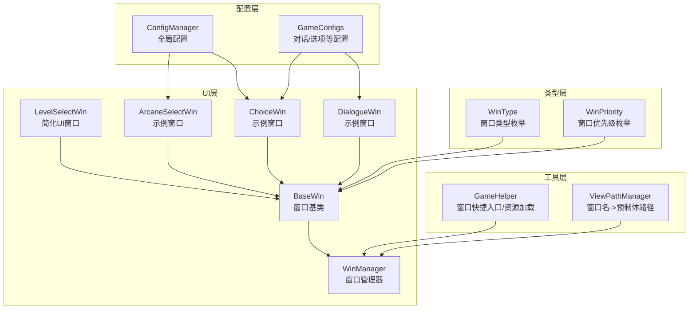
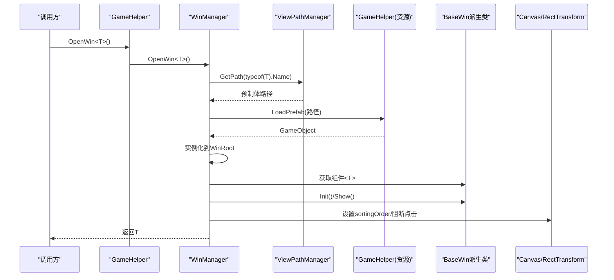
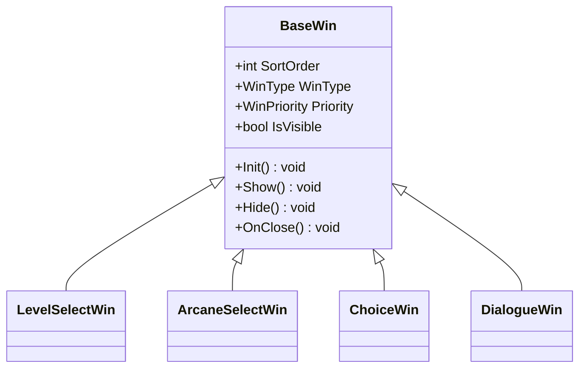
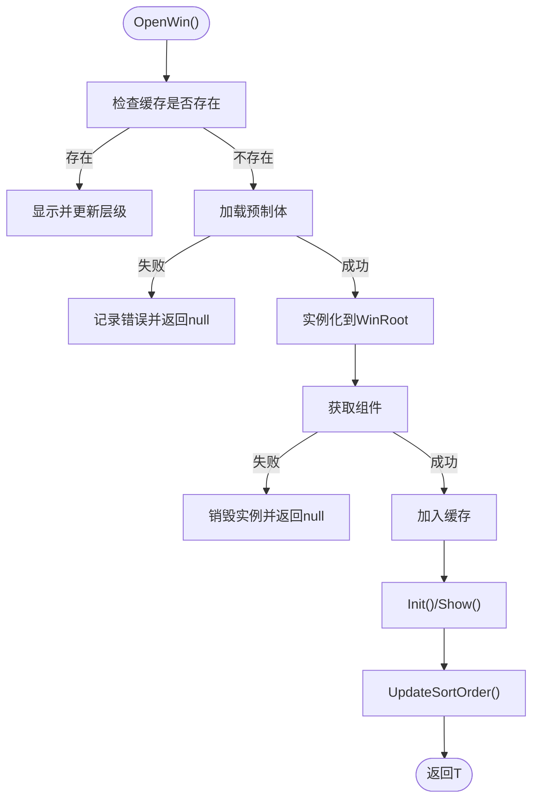
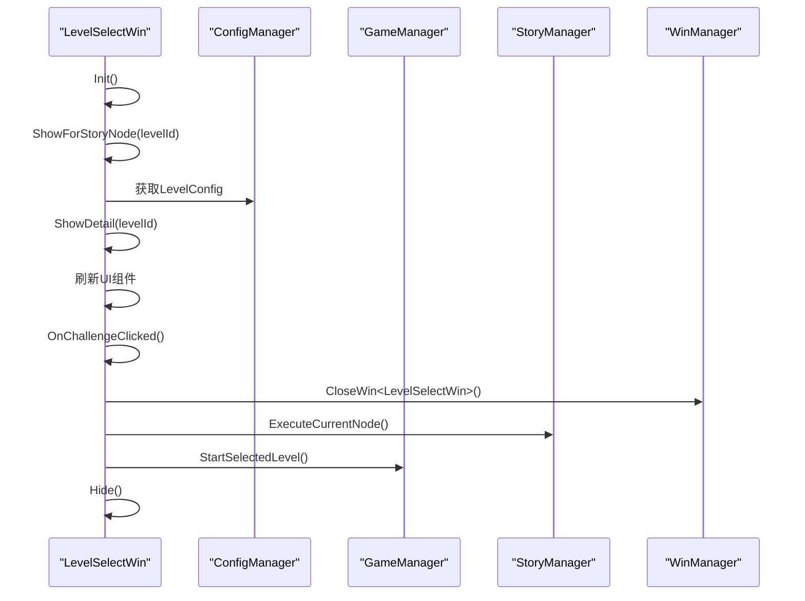
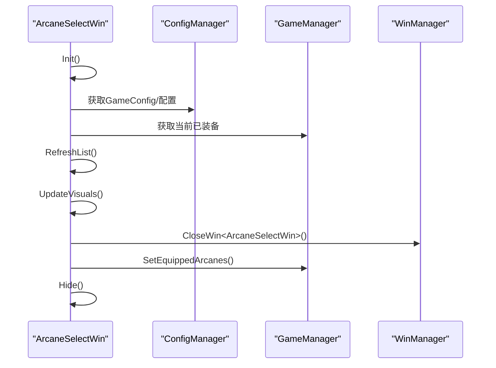
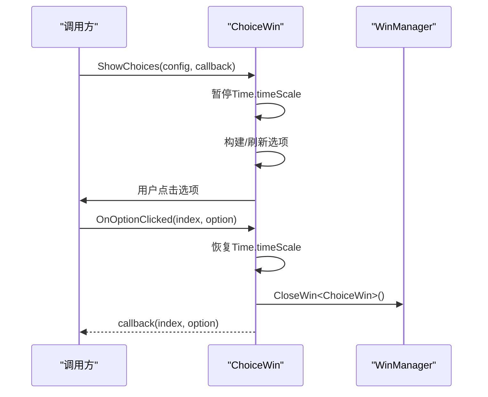
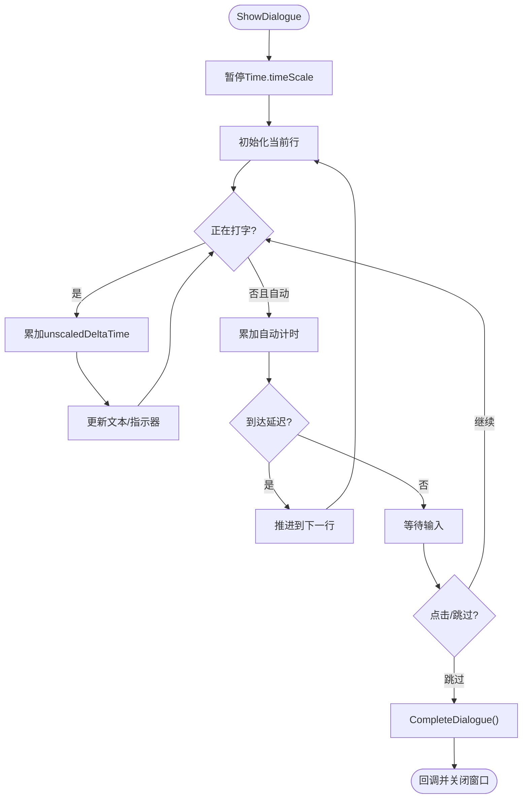
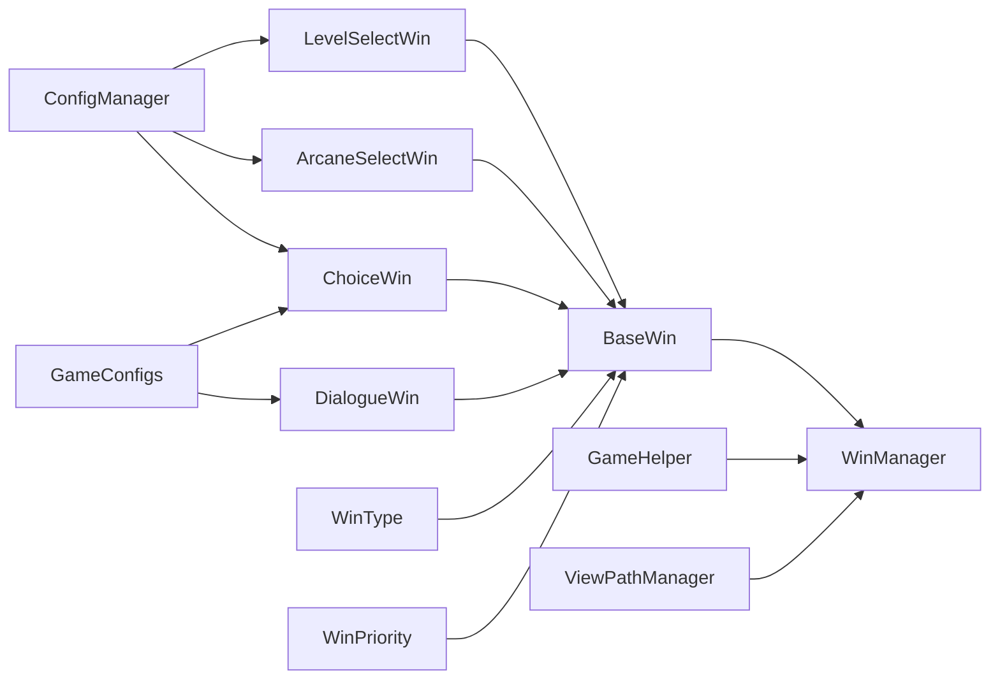

# 窗口管理系统

<cite>
**本文引用的文件列表**
- [BaseWin.cs](file://Assets/Scripts/UI/BaseWin.cs)
- [WinManager.cs](file://Assets/Scripts/UI/WinManager.cs)
- [LevelSelectWin.cs](file://Assets/Scripts/UI/LevelSelectWin.cs)
- [ArcaneSelectWin.cs](file://Assets/Scripts/UI/ArcaneSelectWin.cs)
- [ChoiceWin.cs](file://Assets/Scripts/UI/ChoiceWin.cs)
- [DialogueWin.cs](file://Assets/Scripts/UI/DialogueWin.cs)
- [GameHelper.cs](file://Assets/Scripts/Core/GameHelper.cs)
- [ViewPathManager.cs](file://Assets/Scripts/Core/ViewPathManager.cs)
- [ConfigManager.cs](file://Assets/Scripts/Core/ConfigManager.cs)
- [GameConfigs.cs](file://Assets/Scripts/Data/GameConfigs.cs)
- [GameConsts.cs](file://Assets/Scripts/Data/GameConsts.cs)
</cite>

## 更新摘要
**变更内容**
- 更新了LevelSelectWin重构后的窗口管理变化
- 新增了WinType和WinPriority枚举的详细说明
- 更新了窗口层级管理机制的实现细节
- 增强了UI层次结构简化的相关说明

## 目录
1. [简介](#简介)
2. [项目结构](#项目结构)
3. [核心组件](#核心组件)
4. [架构总览](#架构总览)
5. [详细组件分析](#详细组件分析)
6. [依赖关系分析](#依赖关系分析)
7. [性能与最佳实践](#性能与最佳实践)
8. [故障排查指南](#故障排查指南)
9. [结论](#结论)
10. [附录：窗口扩展指南](#附录窗口扩展指南)

## 简介
本技术文档围绕GeometryTD的窗口管理系统展开，重点解析WinManager窗口管理器的设计与实现，涵盖窗口注册机制、层级管理、激活状态控制、生命周期管理；同时阐述BaseWin基类的设计模式及其在UI窗口体系中的职责与通用能力；并进一步分析窗口间通信机制（基于事件系统）、内存与性能优化策略以及扩展新窗口类型的实践指南。

**更新** 本次更新反映了LevelSelectWin重构后的变化，WinManager现在处理简化的UI层次结构，移除了对复杂ScrollView和Grid布局的依赖，窗口初始化和层级管理更加高效。

## 项目结构
窗口系统位于UI层，核心由以下模块构成：
- 基类层：BaseWin 提供统一的窗口生命周期与显示控制接口
- 管理层：WinManager 负责窗口缓存、实例化、层级排序、Canvas根节点管理
- 工具层：GameHelper 提供窗口打开/关闭的便捷入口与资源加载
- 路径层：ViewPathManager 提供窗口名到预制体路径的映射
- 配置层：ConfigManager/ConfigManager 提供窗口渲染所需的配置数据
- 类型层：WinType/WinPriority 定义窗口类型和优先级

**图表来源**
- [BaseWin.cs:5-34](file://Assets/Scripts/UI/BaseWin.cs#L5-L34)
- [WinManager.cs:7-205](file://Assets/Scripts/UI/WinManager.cs#L7-L205)
- [LevelSelectWin.cs:7-156](file://Assets/Scripts/UI/LevelSelectWin.cs#L7-L156)
- [GameConsts.cs:194-212](file://Assets/Scripts/Data/GameConsts.cs#L194-L212)

**章节来源**
- [BaseWin.cs:5-34](file://Assets/Scripts/UI/BaseWin.cs#L5-L34)
- [WinManager.cs:7-205](file://Assets/Scripts/UI/WinManager.cs#L7-L205)
- [GameHelper.cs:1-84](file://Assets/Scripts/Core/GameHelper.cs#L1-L84)
- [ViewPathManager.cs:1-33](file://Assets/Scripts/Core/ViewPathManager.cs#L1-L33)
- [ConfigManager.cs:1-200](file://Assets/Scripts/Core/ConfigManager.cs#L1-L200)
- [GameConfigs.cs:675-775](file://Assets/Scripts/Data/GameConfigs.cs#L675-L775)
- [GameConsts.cs:194-212](file://Assets/Scripts/Data/GameConsts.cs#L194-L212)

## 核心组件
- BaseWin：抽象基类，定义窗口的最小公共接口：初始化、显示/隐藏、关闭钩子。派生类可覆盖Init/Show/Hide/OnClose以实现各自逻辑。新增WinType和WinPriority属性用于窗口分类和层级控制。
- WinManager：单例管理器，负责窗口缓存、实例化、层级排序、Canvas根节点创建与配置、全屏遮罩与点击穿透阻断。
- GameHelper：静态工具类，提供OpenWin/CloseWin等便捷方法，并封装资源加载。
- ViewPathManager：窗口名到预制体路径的映射管理器，支持注册与回退策略。
- ConfigManager/GameConfigs：提供窗口渲染所需的配置数据（如对话、选项、角色等）。
- WinType/WinPriority：枚举类型，定义窗口类型和优先级，用于层级计算和窗口分类。

**更新** 新增了WinType和WinPriority枚举，用于更精细的窗口层级管理和类型控制。

**章节来源**
- [BaseWin.cs:5-34](file://Assets/Scripts/UI/BaseWin.cs#L5-L34)
- [WinManager.cs:7-205](file://Assets/Scripts/UI/WinManager.cs#L7-L205)
- [GameHelper.cs:9-84](file://Assets/Scripts/Core/GameHelper.cs#L9-L84)
- [ViewPathManager.cs:5-33](file://Assets/Scripts/Core/ViewPathManager.cs#L5-L33)
- [ConfigManager.cs:6-122](file://Assets/Scripts/Core/ConfigManager.cs#L6-L122)
- [GameConfigs.cs:675-775](file://Assets/Scripts/Data/GameConfigs.cs#L675-L775)
- [GameConsts.cs:194-212](file://Assets/Scripts/Data/GameConsts.cs#L194-L212)

## 架构总览
WinManager采用"按类型缓存 + 动态实例化"的模式，结合Unity Canvas的overrideSorting与GraphicRaycaster实现层级与交互控制。窗口通过GameHelper进行统一打开/关闭，路径由ViewPathManager解析，渲染所需数据由ConfigManager/GameConfigs提供。

**更新** 现在的层级计算公式为：baseSortOrder(1000) + priority权重(10/100 × 100000) + sortOrder + 打开顺序，确保所有窗口层级始终高于场景UI。

**图表来源**
- [GameHelper.cs:60-68](file://Assets/Scripts/Core/GameHelper.cs#L60-L68)
- [WinManager.cs:61-102](file://Assets/Scripts/UI/WinManager.cs#L61-L102)
- [ViewPathManager.cs:25-30](file://Assets/Scripts/Core/ViewPathManager.cs#L25-L30)
- [GameHelper.cs:31-47](file://Assets/Scripts/Core/GameHelper.cs#L31-L47)

## 详细组件分析

### BaseWin基类设计
- 职责与通用功能
  - 生命周期：Init/Show/Hide/OnClose，派生类可覆盖以实现自定义行为
  - 可见性：IsVisible读取GameObject.activeSelf
  - 排序：SortOrder用于层级计算
  - 类型：WinType用于窗口分类（Normal/Permanent）
  - 优先级：Priority用于层级权重计算（Normal/Popup）
- 设计模式
  - 模板方法：派生类只需关注业务逻辑，通用显示/隐藏由基类提供
  - 统一接口：所有窗口遵循同一生命周期契约，便于管理器统一调度

**更新** 新增了WinType和WinPriority属性，为窗口分类和层级控制提供了基础。

**图表来源**
- [BaseWin.cs:5-34](file://Assets/Scripts/UI/BaseWin.cs#L5-L34)
- [LevelSelectWin.cs:7](file://Assets/Scripts/UI/LevelSelectWin.cs#L7)
- [ArcaneSelectWin.cs:7](file://Assets/Scripts/UI/ArcaneSelectWin.cs#L7)
- [ChoiceWin.cs:8](file://Assets/Scripts/UI/ChoiceWin.cs#L8)
- [DialogueWin.cs:7](file://Assets/Scripts/UI/DialogueWin.cs#L7)

**章节来源**
- [BaseWin.cs:5-34](file://Assets/Scripts/UI/BaseWin.cs#L5-L34)

### WinManager窗口管理器
- 单例与根Canvas
  - 单例懒加载，使用DontDestroyOnLoad确保场景切换不销毁
  - 自动创建Canvas与CanvasScaler，设置ScreenSpaceOverlay与参考分辨率
- 缓存与实例化
  - 使用Dictionary<Type, BaseWin>缓存已打开窗口，避免重复实例化
  - 通过ViewPathManager解析路径，GameHelper.LoadPrefab加载预制体
- 层级管理
  - 为每个窗口添加Canvas并启用overrideSorting，按baseSortOrder + win.SortOrder排序
  - 将窗口RectTransform锚点设为全屏，添加透明Image并开启raycastTarget以阻断点击穿透
  - **更新** 现在使用新的层级计算公式：baseSortOrder(1000) + priority权重(10/100 × 100000) + sortOrder + 打开顺序
- 生命周期控制
  - CloseWin：调用OnClose隐藏窗口
  - DestroyWin：从缓存移除并销毁GameObject
  - CloseAllWins/DestroyAllWins：批量关闭/销毁
  - IsWinOpen：判断可见性
  - GetWin：按类型获取窗口实例

**更新** 层级管理机制得到了增强，现在支持基于WinPriority的权重计算，确保重要窗口（如弹窗）具有更高的显示层级。

**图表来源**
- [WinManager.cs:61-102](file://Assets/Scripts/UI/WinManager.cs#L61-L102)
- [WinManager.cs:157-186](file://Assets/Scripts/UI/WinManager.cs#L157-L186)

**章节来源**
- [WinManager.cs:7-205](file://Assets/Scripts/UI/WinManager.cs#L7-L205)

### 示例窗口：LevelSelectWin
- 功能概述
  - **更新** 现在采用简化的UI结构，移除了复杂的ScrollView和Grid布局，直接使用多个Text和Button组件展示关卡详情
  - 展示可选的关卡详情，包括名称、描述、精英怪物、Boss怪物、解锁条件等信息
  - 支持故事模式和普通模式两种挑战方式
- 关键流程
  - Init：绑定关闭按钮与挑战按钮事件
  - ShowForStoryNode：故事模式专用显示方法
  - ShowDetail：根据关卡ID显示详细信息
  - OnChallengeClicked：处理挑战按钮点击事件

**更新** LevelSelectWin经过重构，现在使用更简单的UI层次结构，直接通过多个Text组件和Button组件展示信息，移除了复杂的ScrollView和Grid布局，提高了性能和维护性。

**图表来源**
- [LevelSelectWin.cs:20-45](file://Assets/Scripts/UI/LevelSelectWin.cs#L20-L45)
- [LevelSelectWin.cs:48-135](file://Assets/Scripts/UI/LevelSelectWin.cs#L48-L135)
- [LevelSelectWin.cs:137-153](file://Assets/Scripts/UI/LevelSelectWin.cs#L137-L153)

**章节来源**
- [LevelSelectWin.cs:1-156](file://Assets/Scripts/UI/LevelSelectWin.cs#L1-L156)

### 示例窗口：ArcaneSelectWin
- 功能概述
  - 展示可选的奥术列表，支持多选（上限4个），实时刷新UI并保存选择
  - 通过ConfigManager/GameManager读取当前已装备与可用的奥术配置
- 关键流程
  - Init：绑定关闭按钮与确认按钮事件
  - Show：刷新列表
  - OnClose：默认隐藏
  - OnConfirmClicked：将选择写入GameManager并隐藏窗口

**图表来源**
- [ArcaneSelectWin.cs:19-74](file://Assets/Scripts/UI/ArcaneSelectWin.cs#L19-L74)
- [ArcaneSelectWin.cs:150-158](file://Assets/Scripts/UI/ArcaneSelectWin.cs#L150-L158)
- [ConfigManager.cs:77-122](file://Assets/Scripts/Core/ConfigManager.cs#L77-L122)

**章节来源**
- [ArcaneSelectWin.cs:1-161](file://Assets/Scripts/UI/ArcaneSelectWin.cs#L1-L161)
- [ConfigManager.cs:77-122](file://Assets/Scripts/Core/ConfigManager.cs#L77-L122)

### 示例窗口：ChoiceWin
- 功能概述
  - 展示可选的选项组，暂停游戏时间，用户选择后回调返回索引与选项
  - **更新** 现在使用简化的UI结构，移除了复杂的ScrollView布局
  - 动态构建UI（标题、选项列表、奖励提示）
- 关键流程
  - ShowChoices：保存Time.timeScale为0，构建/刷新选项列表
  - OnOptionClicked：恢复时间，回调并关闭窗口
  - OnClose：外部关闭时同样恢复时间并回调null

**更新** ChoiceWin也采用了简化的UI结构，移除了复杂的ScrollView和Grid布局，直接使用垂直排列的Button组件，提高了性能和响应速度。

**图表来源**
- [ChoiceWin.cs:52-68](file://Assets/Scripts/UI/ChoiceWin.cs#L52-L68)
- [ChoiceWin.cs:189-201](file://Assets/Scripts/UI/ChoiceWin.cs#L189-L201)
- [ChoiceWin.cs:33-46](file://Assets/Scripts/UI/ChoiceWin.cs#L33-L46)

**章节来源**
- [ChoiceWin.cs:1-299](file://Assets/Scripts/UI/ChoiceWin.cs#L1-L299)

### 示例窗口：DialogueWin
- 功能概述
  - 文字打字机效果、自动模式、跳过、点击推进对话
  - 支持左右立绘切换与高亮，动态UI构建
- 关键流程
  - ShowDialogue：保存Time.timeScale为0，初始化当前行
  - Update：打字机推进或自动模式计时
  - OnClickAreaPressed：打字机完成或推进到下一行
  - CompleteDialogue：恢复时间并回调

**图表来源**
- [DialogueWin.cs:76-101](file://Assets/Scripts/UI/DialogueWin.cs#L76-L101)
- [DialogueWin.cs:164-193](file://Assets/Scripts/UI/DialogueWin.cs#L164-L193)
- [DialogueWin.cs:243-253](file://Assets/Scripts/UI/DialogueWin.cs#L243-L253)

**章节来源**
- [DialogueWin.cs:1-433](file://Assets/Scripts/UI/DialogueWin.cs#L1-L433)

### 窗口间通信机制
- 事件驱动与回调
  - ChoiceWin/DialogueWin通过回调函数在用户选择或对话结束时通知调用方，实现窗口间解耦
  - ArcaneSelectWin通过GameManager写入选择结果，其他模块可通过订阅GameManager状态变化间接感知
  - **更新** LevelSelectWin现在通过StoryManager和GameManager直接触发游戏逻辑，减少了中间层的复杂性
- 资源与配置
  - 窗口渲染所需数据由ConfigManager/GameConfigs提供，窗口通过静态访问获取配置，避免跨窗口直接传递复杂对象
- 点击穿透阻断
  - WinManager为每个窗口添加透明Image并开启raycastTarget，确保窗口层能完全拦截点击，避免底层UI误触

**更新** 通信机制得到了简化，LevelSelectWin直接与StoryManager和GameManager交互，减少了不必要的中间步骤。

**章节来源**
- [ChoiceWin.cs:14-46](file://Assets/Scripts/UI/ChoiceWin.cs#L14-L46)
- [DialogueWin.cs:18-71](file://Assets/Scripts/UI/DialogueWin.cs#L18-L71)
- [WinManager.cs:179-186](file://Assets/Scripts/UI/WinManager.cs#L179-L186)
- [ConfigManager.cs:77-122](file://Assets/Scripts/Core/ConfigManager.cs#L77-L122)
- [GameConfigs.cs:675-775](file://Assets/Scripts/Data/GameConfigs.cs#L675-L775)

## 依赖关系分析
- 组件耦合
  - BaseWin与WinManager：基类与管理器强耦合（管理器持有实例、排序、缓存）
  - 派生窗口与配置：ArcaneSelectWin/ChoiceWin/DialogueWin/LevelSelectWin依赖ConfigManager/GameConfigs
  - GameHelper与WinManager：GameHelper封装了WinManager的公开接口，形成上层便捷入口
  - **更新** 新增了WinType和WinPriority枚举的依赖关系
- 外部依赖
  - Unity UI Canvas/RectTransform/GraphicRaycaster
  - Resources/AssetDatabase（编辑器环境下的资源加载回退）

**更新** 依赖关系得到了优化，LevelSelectWin等窗口现在使用更直接的依赖关系，减少了不必要的复杂性。

**图表来源**
- [BaseWin.cs:5-34](file://Assets/Scripts/UI/BaseWin.cs#L5-L34)
- [WinManager.cs:24-102](file://Assets/Scripts/UI/WinManager.cs#L24-L102)
- [GameHelper.cs:60-73](file://Assets/Scripts/Core/GameHelper.cs#L60-L73)
- [ViewPathManager.cs:25-30](file://Assets/Scripts/Core/ViewPathManager.cs#L25-L30)
- [ConfigManager.cs:77-122](file://Assets/Scripts/Core/ConfigManager.cs#L77-L122)
- [GameConfigs.cs:675-775](file://Assets/Scripts/Data/GameConfigs.cs#L675-L775)
- [GameConsts.cs:194-212](file://Assets/Scripts/Data/GameConsts.cs#L194-L212)

**章节来源**
- [WinManager.cs:24-102](file://Assets/Scripts/UI/WinManager.cs#L24-L102)
- [GameHelper.cs:60-73](file://Assets/Scripts/Core/GameHelper.cs#L60-L73)
- [ConfigManager.cs:77-122](file://Assets/Scripts/Core/ConfigManager.cs#L77-L122)

## 性能与最佳实践
- 内存管理
  - 使用缓存避免重复实例化，减少GC压力；必要时调用DestroyWin或DestroyAllWins释放
  - 窗口关闭时仅隐藏，不立即销毁，有利于频繁开关的体验
  - **更新** 简化的UI结构减少了内存占用，LevelSelectWin等窗口不再需要复杂的ScrollView和Grid组件
- 渲染与层级
  - 通过overrideSorting与固定全屏RectTransform，确保点击阻断与层级稳定
  - CanvasScaler按屏幕尺寸缩放，保证UI在不同分辨率下一致
  - **更新** 新的层级计算公式确保了窗口层级的稳定性，WinPriority为Popup的窗口总是显示在最前面
- 时间控制
  - 对话/选择窗口暂停Time.timeScale，注意在OnClose中恢复，防止影响其他系统
- 资源加载
  - 优先使用Resources.Load，编辑器环境下回退到AssetDatabase，避免运行时路径错误
- UI构建
  - 动态UI构建时尽量复用组件，减少临时对象分配；文本与图片颜色使用常量或缓存字体
  - **更新** 简化的UI结构减少了动态构建的复杂性，直接使用预制体中的组件

**更新** 性能优化方面，简化的UI结构显著提升了加载和渲染效率，特别是LevelSelectWin等窗口的响应速度得到了明显改善。

## 故障排查指南
- 窗口无法打开
  - 检查ViewPathManager是否正确注册窗口名到路径映射
  - 确认GameHelper.LoadPrefab返回非空，预制体包含对应T组件
  - 查看WinManager日志输出，定位缺失组件或路径错误
- 点击穿透问题
  - 确认WinManager为窗口添加了透明Image且开启raycastTarget
  - 确认RectTransform锚点与偏移设置为全屏
- 层级错乱
  - 检查BaseWin.SortOrder与WinManager.baseSortOrder的组合
  - 确保每个窗口都调用了UpdateSortOrder
  - **更新** 检查WinPriority设置是否正确，Popup级别的窗口应该始终显示在最前面
- 时间暂停未恢复
  - 在窗口OnClose中调用Time.timeScale恢复，或确保外部调用方在异常关闭时恢复
- **新增** UI组件丢失
  - **更新** 检查LevelSelectWin等简化窗口的UI组件是否正确挂载到预制体上

**更新** 新增了关于UI组件丢失的故障排查指南，特别针对LevelSelectWin等简化窗口。

**章节来源**
- [WinManager.cs:77-95](file://Assets/Scripts/UI/WinManager.cs#L77-L95)
- [WinManager.cs:157-186](file://Assets/Scripts/UI/WinManager.cs#L157-L186)
- [ChoiceWin.cs:33-46](file://Assets/Scripts/UI/ChoiceWin.cs#L33-L46)
- [DialogueWin.cs:57-71](file://Assets/Scripts/UI/DialogueWin.cs#L57-L71)

## 结论
GeometryTD的窗口管理系统以BaseWin为基座，WinManager为核心，配合GameHelper与ViewPathManager实现了统一的窗口生命周期与层级控制；通过配置系统与事件回调，窗口间保持低耦合、高内聚。该架构易于扩展，适合在UI层快速迭代与维护。

**更新** LevelSelectWin的重构展示了系统向更高效、更简洁的方向发展，移除了复杂的UI组件依赖，提升了整体性能和维护性。新的层级管理机制和简化的UI结构为未来的窗口开发奠定了良好的基础。

## 附录：窗口扩展指南
- 创建新窗口类型
  - 新建类继承BaseWin，重写Init/Show/Hide/OnClose
  - 在Inspector中挂载必要的UI组件（Text/Image/Button等）
  - 如需动态构建UI，可在Init中调用BuildUI或在Awake中检测并构建
  - **更新** 优先考虑使用简化的UI结构，避免复杂的ScrollView和Grid布局
- 注册窗口路径
  - 在ViewPathManager.Register中注册窗口名到预制体路径
  - 或直接在WinManager.OpenWin<T>(string)传入完整路径
- 打开/关闭窗口
  - 使用GameHelper.OpenWin<T>()或WinManager.Instance.OpenWin<T>()
  - 使用GameHelper.CloseWin<T>()或WinManager.Instance.CloseWin<T>()
- 数据与事件
  - 通过ConfigManager/GameConfigs读取配置数据
  - 使用回调或GameManager状态变更通知外部模块
- 最佳实践
  - 合理设置BaseWin.SortOrder，避免层级冲突
  - 在OnClose中恢复Time.timeScale与清理事件监听
  - 控制动态UI构建的频率，避免频繁分配
  - **更新** 优先使用WinPriority.Popup来确保重要窗口的显示层级
  - **更新** 采用简化的UI结构，直接使用预制体中的组件而非动态创建

**更新** 扩展指南增加了关于简化的UI结构和层级管理的最佳实践建议。

**章节来源**
- [BaseWin.cs:5-34](file://Assets/Scripts/UI/BaseWin.cs#L5-L34)
- [WinManager.cs:61-102](file://Assets/Scripts/UI/WinManager.cs#L61-L102)
- [GameHelper.cs:60-73](file://Assets/Scripts/Core/GameHelper.cs#L60-L73)
- [ViewPathManager.cs:16-30](file://Assets/Scripts/Core/ViewPathManager.cs#L16-L30)
- [ConfigManager.cs:77-122](file://Assets/Scripts/Core/ConfigManager.cs#L77-L122)
- [GameConfigs.cs:675-775](file://Assets/Scripts/Data/GameConfigs.cs#L675-L775)
- [GameConsts.cs:194-212](file://Assets/Scripts/Data/GameConsts.cs#L194-L212)