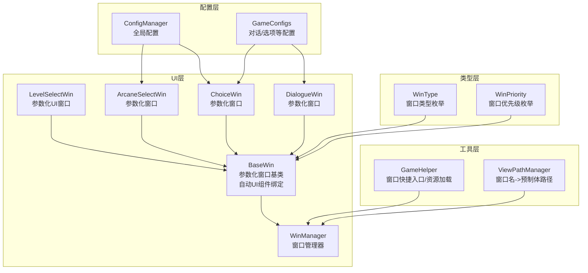
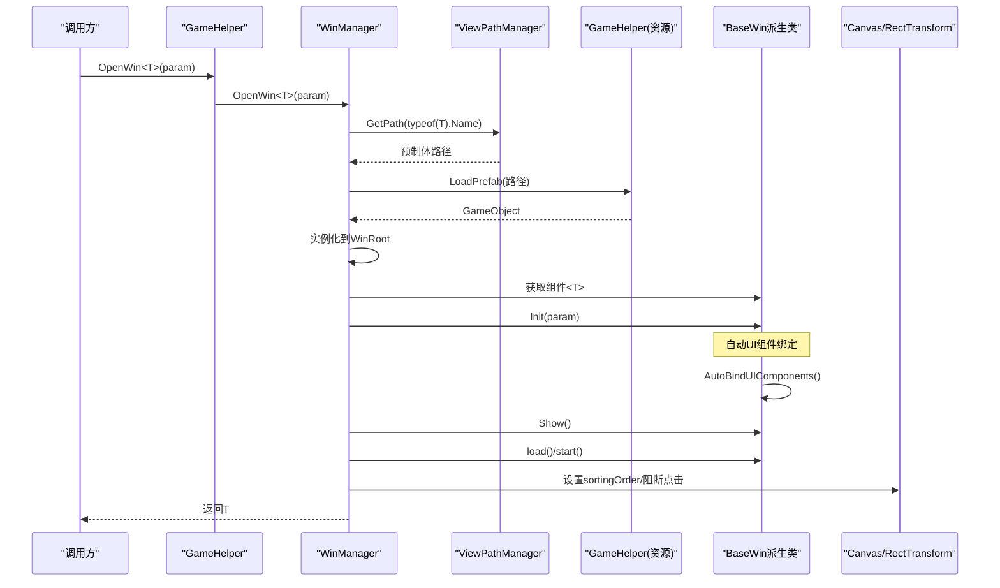
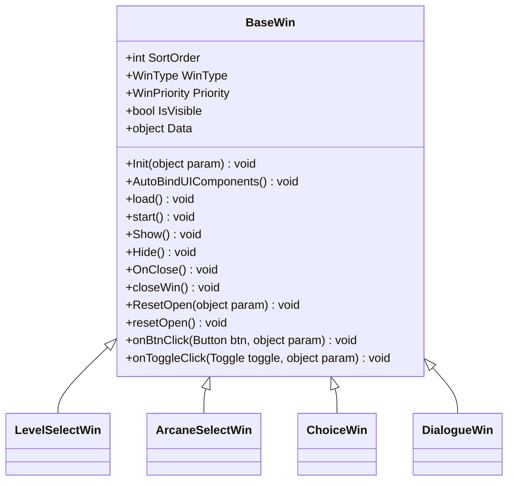
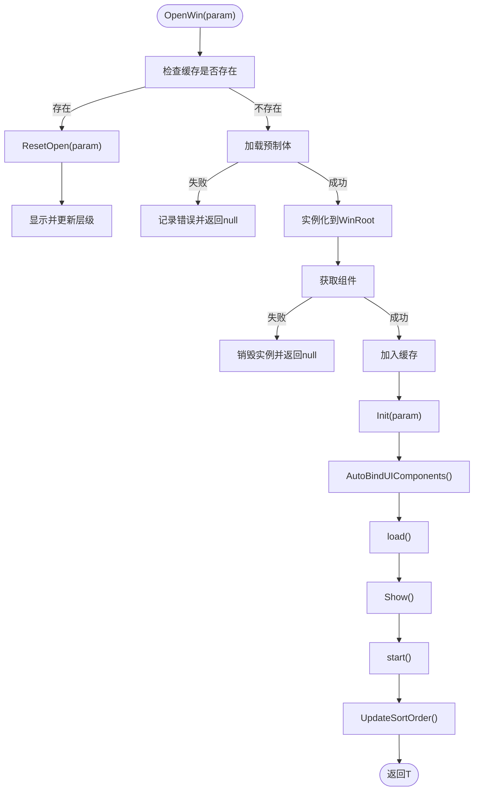
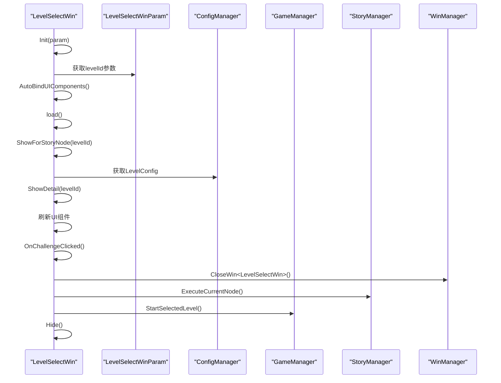
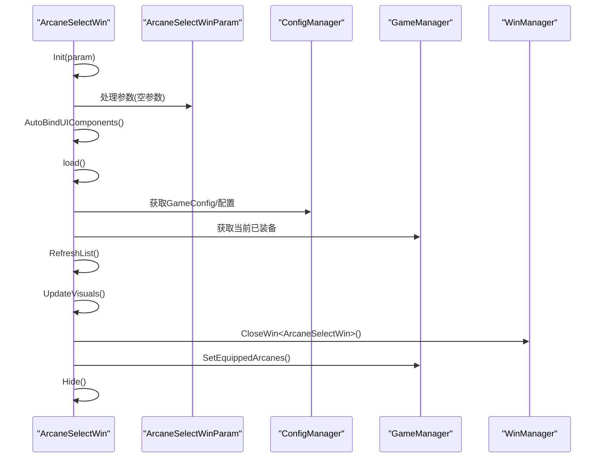
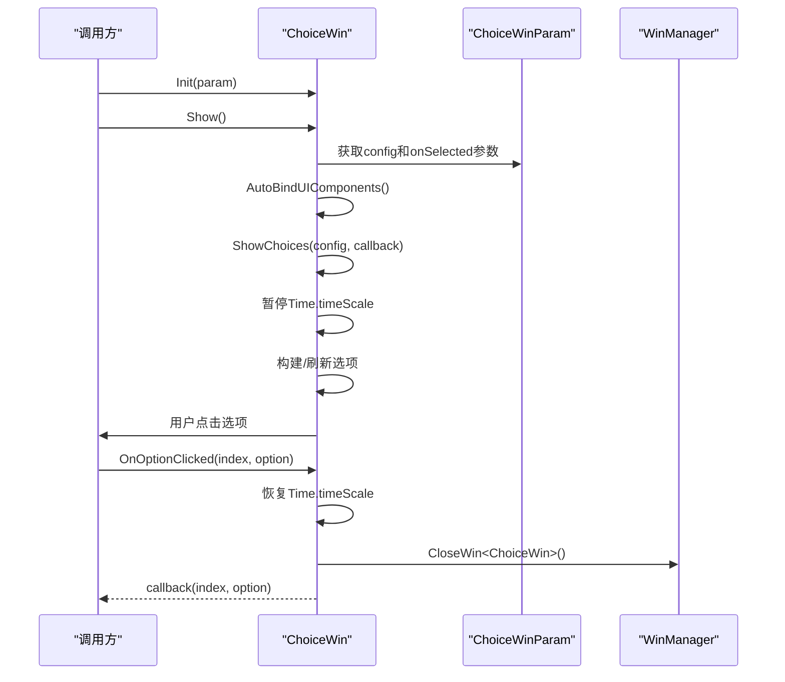
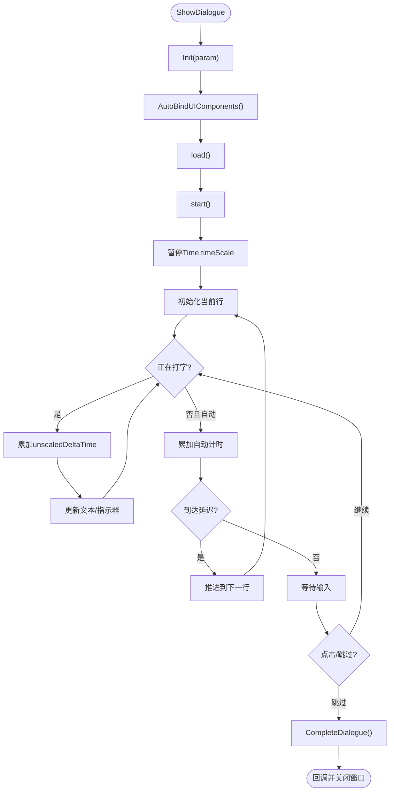
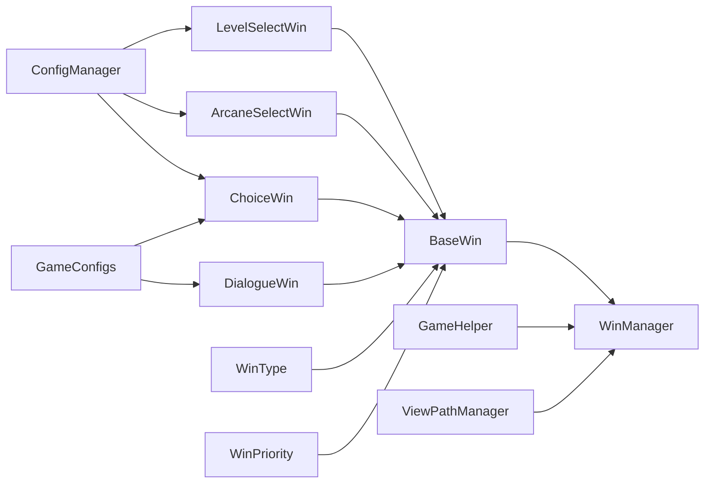

# 窗口管理系统

<cite>
**本文引用的文件列表**
- [BaseWin.cs](file://Assets/Scripts/UI/Windows/BaseWin.cs)
- [WinManager.cs](file://Assets/Scripts/UI/Managers/WinManager.cs)
- [LevelSelectWin.cs](file://Assets/Scripts/UI/Windows/LevelSelectWin.cs)
- [ArcaneSelectWin.cs](file://Assets/Scripts/UI/Windows/ArcaneSelectWin.cs)
- [ChoiceWin.cs](file://Assets/Scripts/UI/Windows/ChoiceWin.cs)
- [DialogueWin.cs](file://Assets/Scripts/UI/Windows/DialogueWin.cs)
- [GameHelper.cs](file://Assets/Scripts/Core/GameHelper.cs)
- [ViewPathManager.cs](file://Assets/Scripts/Core/ViewPathManager.cs)
- [ConfigManager.cs](file://Assets/Scripts/Core/ConfigManager.cs)
- [GameConfigs.cs](file://Assets/Scripts/Data/GameConfigs.cs)
- [GameConsts.cs](file://Assets/Scripts/Data/GameConsts.cs)
- [GameTypes.cs](file://Assets/Scripts/Data/GameTypes.cs)
</cite>

## 更新摘要
**变更内容**
- 重大更新：新增自动UI组件绑定系统，支持基于命名约定的组件自动绑定
- 标准化命名约定：btn_、txt_、node_、sp_、toggle_等前缀规范
- 参数化生命周期管理：BaseWin类重构为完整的参数化生命周期系统
- 新增参数类设计模式：LevelSelectWinParam、ChoiceWinParam、DialogueWinParam等
- 优化窗口重用机制：ResetOpen(object param)支持参数重置
- 增强事件处理：onBtnClick和onToggleClick统一事件处理机制

## 目录
1. [简介](#简介)
2. [项目结构](#项目结构)
3. [核心组件](#核心组件)
4. [架构总览](#架构总览)
5. [详细组件分析](#详细组件分析)
6. [自动UI组件绑定系统](#自动ui组件绑定系统)
7. [参数化生命周期管理](#参数化生命周期管理)
8. [参数类设计模式](#参数类设计模式)
9. [标准化命名约定](#标准化命名约定)
10. [依赖关系分析](#依赖关系分析)
11. [性能与最佳实践](#性能与最佳实践)
12. [故障排查指南](#故障排查指南)
13. [结论](#结论)
14. [附录：窗口扩展指南](#附录窗口扩展指南)

## 简介
本技术文档围绕GeometryTD的窗口管理系统展开，重点解析WinManager窗口管理器的设计与实现，涵盖窗口注册机制、层级管理、激活状态控制、生命周期管理；同时阐述BaseWin基类的设计模式及其在UI窗口体系中的职责与通用能力；并进一步分析窗口间通信机制（基于事件系统）、内存与性能优化策略以及扩展新窗口类型的实践指南。

**更新** 本次重大更新反映了系统向更高效、更智能的方向发展，新增的自动UI组件绑定系统大幅减少了手动组件绑定的工作量，标准化的命名约定提升了代码的一致性和可维护性，参数化生命周期管理为窗口系统提供了更强大的灵活性和可重用性。

## 项目结构
窗口系统位于UI层，核心由以下模块构成：
- 基类层：BaseWin 提供统一的参数化窗口生命周期与自动UI组件绑定接口
- 管理层：WinManager 负责窗口缓存、实例化、层级排序、Canvas根节点管理
- 工具层：GameHelper 提供窗口打开/关闭的便捷入口与资源加载
- 路径层：ViewPathManager 提供窗口名到预制体路径的映射
- 配置层：ConfigManager/ConfigManager 提供窗口渲染所需的配置数据
- 类型层：WinType/WinPriority 定义窗口类型和优先级



**图表来源**
- [BaseWin.cs:8-164](file://Assets/Scripts/UI/Windows/BaseWin.cs#L8-L164)
- [WinManager.cs:7-221](file://Assets/Scripts/UI/Managers/WinManager.cs#L7-L221)
- [LevelSelectWin.cs:15-152](file://Assets/Scripts/UI/Windows/LevelSelectWin.cs#L15-L152)
- [GameConsts.cs:194-212](file://Assets/Scripts/Data/GameConsts.cs#L194-L212)

**章节来源**
- [BaseWin.cs:8-164](file://Assets/Scripts/UI/Windows/BaseWin.cs#L8-L164)
- [WinManager.cs:7-221](file://Assets/Scripts/UI/Managers/WinManager.cs#L7-L221)
- [GameHelper.cs:9-94](file://Assets/Scripts/Core/GameHelper.cs#L9-L94)
- [ViewPathManager.cs:1-33](file://Assets/Scripts/Core/ViewPathManager.cs#L1-L33)
- [ConfigManager.cs:1-200](file://Assets/Scripts/Core/ConfigManager.cs#L1-L200)
- [GameConfigs.cs:675-775](file://Assets/Scripts/Data/GameConfigs.cs#L675-L775)
- [GameConsts.cs:194-212](file://Assets/Scripts/Data/GameConsts.cs#L194-L212)

## 核心组件
- BaseWin：抽象基类，定义窗口的参数化生命周期接口：Init(object param)/load()/start()/Hide/OnClose/closeWin()。新增AutoBindUIComponents()自动UI组件绑定机制，支持基于命名约定的组件自动查找和绑定。派生类可覆盖各阶段方法以实现自定义行为。新增WinType和WinPriority属性用于窗口分类和层级控制。
- WinManager：单例管理器，负责窗口缓存、实例化、层级排序、Canvas根节点创建与配置、全屏遮罩与点击穿透阻断。
- GameHelper：静态工具类，提供OpenWin<T>(param)等便捷方法，并封装资源加载。
- ViewPathManager：窗口名到预制体路径的映射管理器，支持注册与回退策略。
- ConfigManager/GameConfigs：提供窗口渲染所需的配置数据（如对话、选项、角色等）。
- WinType/WinPriority：枚举类型，定义窗口类型和优先级，用于层级计算和窗口分类。

**更新** 新增了完整的自动UI组件绑定系统，支持btn_、txt_、node_、sp_、toggle_等前缀的组件自动绑定，大幅减少了手动组件绑定的工作量。

**章节来源**
- [BaseWin.cs:8-164](file://Assets/Scripts/UI/Windows/BaseWin.cs#L8-L164)
- [WinManager.cs:7-221](file://Assets/Scripts/UI/Managers/WinManager.cs#L7-L221)
- [GameHelper.cs:78-82](file://Assets/Scripts/Core/GameHelper.cs#L78-L82)
- [ViewPathManager.cs:5-33](file://Assets/Scripts/Core/ViewPathManager.cs#L5-L33)
- [ConfigManager.cs:6-122](file://Assets/Scripts/Core/ConfigManager.cs#L6-L122)
- [GameConfigs.cs:675-775](file://Assets/Scripts/Data/GameConfigs.cs#L675-L775)
- [GameConsts.cs:194-212](file://Assets/Scripts/Data/GameConsts.cs#L194-L212)

## 架构总览
WinManager采用"按类型缓存 + 动态实例化"的模式，结合Unity Canvas的overrideSorting与GraphicRaycaster实现层级与交互控制。窗口通过GameHelper进行统一打开/关闭，路径由ViewPathManager解析，渲染所需数据由ConfigManager/GameConfigs提供。

**更新** 现在的层级计算公式为：baseSortOrder(1000) + priority权重(10/100 × 100000) + sortOrder + 打开顺序，确保所有窗口层级始终高于场景UI。



**图表来源**
- [GameHelper.cs:78-82](file://Assets/Scripts/Core/GameHelper.cs#L78-L82)
- [WinManager.cs:63-114](file://Assets/Scripts/UI/Managers/WinManager.cs#L63-L114)
- [ViewPathManager.cs:25-30](file://Assets/Scripts/Core/ViewPathManager.cs#L25-L30)
- [GameHelper.cs:31-47](file://Assets/Scripts/Core/GameHelper.cs#L31-L47)

## 详细组件分析

### BaseWin基类设计
- 职责与通用功能
  - 参数化生命周期：Init(object param)/load()/start()/Hide/OnClose/closeWin()，派生类可覆盖以实现自定义行为
  - 自动UI组件绑定：AutoBindUIComponents()根据命名约定自动绑定UI组件，支持btn_、txt_、node_、sp_、toggle_等前缀
  - 可见性：IsVisible读取GameObject.activeSelf
  - 排序：SortOrder用于层级计算
  - 类型：WinType用于窗口分类（Normal/Permanent）
  - 优先级：Priority用于层级权重计算（Normal/Popup）
  - 参数存储：Data属性用于存储传入的参数对象
- 设计模式
  - 模板方法：派生类只需关注业务逻辑，通用显示/隐藏由基类提供
  - 统一接口：所有窗口遵循同一生命周期契约，便于管理器统一调度
  - 参数化设计：支持运行时参数传递，增强窗口灵活性
  - 自动绑定：通过反射机制自动绑定UI组件，减少样板代码

**更新** 新增了完整的自动UI组件绑定系统，支持基于命名约定的组件自动查找和绑定，大幅提升了开发效率。



**图表来源**
- [BaseWin.cs:8-164](file://Assets/Scripts/UI/Windows/BaseWin.cs#L8-L164)
- [LevelSelectWin.cs:15](file://Assets/Scripts/UI/Windows/LevelSelectWin.cs#L15)
- [ArcaneSelectWin.cs:14](file://Assets/Scripts/UI/Windows/ArcaneSelectWin.cs#L14)
- [ChoiceWin.cs:17](file://Assets/Scripts/UI/Windows/ChoiceWin.cs#L17)
- [DialogueWin.cs:16](file://Assets/Scripts/UI/Windows/DialogueWin.cs#L16)

**章节来源**
- [BaseWin.cs:8-164](file://Assets/Scripts/UI/Windows/BaseWin.cs#L8-L164)

### WinManager窗口管理器
- 单例与根Canvas
  - 单例懒加载，使用DontDestroyOnLoad确保场景切换不销毁
  - 自动创建Canvas与CanvasScaler，设置ScreenSpaceOverlay与参考分辨率
- 缓存与实例化
  - 使用Dictionary<Type, BaseWin>缓存已打开窗口，避免重复实例化
  - 通过ViewPathManager解析路径，GameHelper.LoadPrefab加载预制体
- 层级管理
  - 为每个窗口添加Canvas并启用overrideSorting，按baseSortOrder + win.SortOrder排序
  - 将窗口RectTransform锚点设为全屏，添加透明Image并开启raycastTarget以阻断点击穿透
  - **更新** 现在使用新的层级计算公式：baseSortOrder(1000) + priority权重(10/100 × 100000) + sortOrder + 打开顺序
- 生命周期控制
  - OpenWin<T>(param)：支持参数传递的窗口打开
  - ResetOpen：调用ResetOpen(param)重置参数并显示窗口
  - CloseWin：调用OnClose隐藏窗口
  - DestroyWin：从缓存移除并销毁GameObject
  - CloseAllWins/DestroyAllWins：批量关闭/销毁
  - IsWinOpen：判断可见性
  - GetWin：按类型获取窗口实例

**更新** 层级管理机制得到了增强，现在支持基于WinPriority的权重计算，确保重要窗口（如弹窗）具有更高的显示层级。



**图表来源**
- [WinManager.cs:63-114](file://Assets/Scripts/UI/Managers/WinManager.cs#L63-L114)
- [WinManager.cs:179-212](file://Assets/Scripts/UI/Managers/WinManager.cs#L179-L212)

**章节来源**
- [WinManager.cs:7-221](file://Assets/Scripts/UI/Managers/WinManager.cs#L7-L221)

### 示例窗口：LevelSelectWin
- 功能概述
  - **更新** 现在采用参数化设计，通过LevelSelectWinParam接收关卡ID参数
  - 展示可选的关卡详情，包括名称、描述、精英怪物、Boss怪物、解锁条件等信息
  - 支持故事模式和普通模式两种挑战方式
  - **更新** 利用自动UI组件绑定系统，通过[SerializeField]标记的字段自动绑定UI组件
- 关键流程
  - Init：接收参数并调用AutoBindUIComponents()自动绑定UI组件，然后调用load()方法
  - load：绑定关闭按钮与挑战按钮事件
  - start：调用ShowForStoryNode(data.levelId)显示窗口
  - ShowForStoryNode：故事模式专用显示方法
  - ShowDetail：根据关卡ID显示详细信息
  - OnChallengeClicked：处理挑战按钮点击事件

**更新** LevelSelectWin现在使用参数化设计，通过LevelSelectWinParam参数类接收关卡ID，利用自动UI组件绑定系统实现更简洁的代码结构。



**图表来源**
- [LevelSelectWin.cs:29-42](file://Assets/Scripts/UI/Windows/LevelSelectWin.cs#L29-L42)
- [LevelSelectWin.cs:45-135](file://Assets/Scripts/UI/Windows/LevelSelectWin.cs#L45-L135)
- [LevelSelectWin.cs:144-152](file://Assets/Scripts/UI/Windows/LevelSelectWin.cs#L144-L152)

**章节来源**
- [LevelSelectWin.cs:1-152](file://Assets/Scripts/UI/Windows/LevelSelectWin.cs#L1-L152)

### 示例窗口：ArcaneSelectWin
- 功能概述
  - 展示可选的奥术列表，支持多选（上限4个），实时刷新UI并保存选择
  - 通过ConfigManager/GameManager读取当前已装备与可用的奥术配置
  - **更新** 现在使用参数化设计，但参数类为空，主要用于演示参数化模式
  - **更新** 利用自动UI组件绑定系统，通过[SerializeField]标记的字段自动绑定UI组件
- 关键流程
  - Init：接收参数并调用AutoBindUIComponents()自动绑定UI组件
  - load：初始化UI组件
  - start：刷新列表
  - OnClose：默认隐藏
  - OnConfirmClicked：将选择写入GameManager并隐藏窗口

**更新** ArcaneSelectWin现在遵循参数化生命周期模式，利用自动UI组件绑定系统实现更简洁的代码结构。



**图表来源**
- [ArcaneSelectWin.cs:28-39](file://Assets/Scripts/UI/Windows/ArcaneSelectWin.cs#L28-L39)
- [ArcaneSelectWin.cs:152-160](file://Assets/Scripts/UI/Windows/ArcaneSelectWin.cs#L152-L160)
- [ConfigManager.cs:77-122](file://Assets/Scripts/Core/ConfigManager.cs#L77-L122)

**章节来源**
- [ArcaneSelectWin.cs:1-171](file://Assets/Scripts/UI/Windows/ArcaneSelectWin.cs#L1-L171)
- [ConfigManager.cs:77-122](file://Assets/Scripts/Core/ConfigManager.cs#L77-L122)

### 示例窗口：ChoiceWin
- 功能概述
  - 展示可选的选项组，暂停游戏时间，用户选择后回调返回索引与选项
  - **更新** 现在使用参数化设计，通过ChoiceWinParam接收配置和回调函数
  - 动态构建UI（标题、选项列表、奖励提示）
  - **更新** 利用自动UI组件绑定系统，通过[SerializeField]标记的字段自动绑定UI组件
- 关键流程
  - Init：接收参数并调用AutoBindUIComponents()自动绑定UI组件，然后调用load()方法
  - load：初始化UI组件
  - start：调用ShowChoices(data.config, data.onSelected)
  - ShowChoices：保存Time.timeScale为0，构建/刷新选项列表
  - OnOptionClicked：恢复时间，回调并关闭窗口
  - OnClose：外部关闭时同样恢复时间并回调null

**更新** ChoiceWin现在使用参数化设计，通过ChoiceWinParam参数类接收ChoiceGroupConfig配置和Action回调函数，利用自动UI组件绑定系统实现更简洁的代码结构。



**图表来源**
- [ChoiceWin.cs:28-39](file://Assets/Scripts/UI/Windows/ChoiceWin.cs#L28-L39)
- [ChoiceWin.cs:56-72](file://Assets/Scripts/UI/Windows/ChoiceWin.cs#L56-L72)
- [ChoiceWin.cs:199-209](file://Assets/Scripts/UI/Windows/ChoiceWin.cs#L199-L209)
- [ChoiceWin.cs:221-224](file://Assets/Scripts/UI/Windows/ChoiceWin.cs#L221-L224)

**章节来源**
- [ChoiceWin.cs:1-219](file://Assets/Scripts/UI/Windows/ChoiceWin.cs#L1-L219)

### 示例窗口：DialogueWin
- 功能概述
  - 文字打字机效果、自动模式、跳过、点击推进对话
  - 支持左右立绘切换与高亮，动态UI构建
  - **更新** 现在使用参数化设计，通过DialogueWinParam接收对话ID和完成回调
  - **更新** 利用自动UI组件绑定系统，通过[SerializeField]标记的字段自动绑定UI组件
- 关键流程
  - Init：接收参数并调用AutoBindUIComponents()自动绑定UI组件，然后调用load()方法
  - load：初始化UI组件
  - start：调用ShowDialogue(data.dialogueId, data.onComplete)
  - ShowDialogue：保存Time.timeScale为0，初始化当前行
  - Update：打字机推进或自动模式计时
  - OnClickAreaPressed：打字机完成或推进到下一行
  - CompleteDialogue：恢复时间并回调

**更新** DialogueWin现在使用参数化设计，通过DialogueWinParam参数类接收对话ID和Action回调函数，利用自动UI组件绑定系统实现更简洁的代码结构。



**图表来源**
- [DialogueWin.cs:43-73](file://Assets/Scripts/UI/Windows/DialogueWin.cs#L43-L73)
- [DialogueWin.cs:92-115](file://Assets/Scripts/UI/Windows/DialogueWin.cs#L92-L115)
- [DialogueWin.cs:178-207](file://Assets/Scripts/UI/Windows/DialogueWin.cs#L178-L207)
- [DialogueWin.cs:257-267](file://Assets/Scripts/UI/Windows/DialogueWin.cs#L257-L267)

**章节来源**
- [DialogueWin.cs:1-277](file://Assets/Scripts/UI/Windows/DialogueWin.cs#L1-L277)

### 窗口间通信机制
- 事件驱动与回调
  - ChoiceWin/DialogueWin通过回调函数在用户选择或对话结束时通知调用方，实现窗口间解耦
  - ArcaneSelectWin通过GameManager写入选择结果，其他模块可通过订阅GameManager状态变化间接感知
  - **更新** LevelSelectWin现在通过StoryManager和GameManager直接触发游戏逻辑，减少了中间层的复杂性
- 资源与配置
  - 窗口渲染所需数据由ConfigManager/GameConfigs提供，窗口通过静态访问获取配置，避免跨窗口直接传递复杂对象
- 点击穿透阻断
  - WinManager为每个窗口添加透明Image并开启raycastTarget，确保窗口层能完全拦截点击，避免底层UI误触

**更新** 通信机制得到了简化，LevelSelectWin直接与StoryManager和GameManager交互，减少了不必要的中间步骤。

**章节来源**
- [ChoiceWin.cs:14-46](file://Assets/Scripts/UI/Windows/ChoiceWin.cs#L14-L46)
- [DialogueWin.cs:18-71](file://Assets/Scripts/UI/Windows/DialogueWin.cs#L18-L71)
- [WinManager.cs:205-212](file://Assets/Scripts/UI/Managers/WinManager.cs#L205-L212)
- [ConfigManager.cs:77-122](file://Assets/Scripts/Core/ConfigManager.cs#L77-L122)
- [GameConfigs.cs:675-775](file://Assets/Scripts/Data/GameConfigs.cs#L675-L775)

## 自动UI组件绑定系统

### 自动绑定机制详解
BaseWin现在集成了强大的自动UI组件绑定系统，通过反射机制根据命名约定自动绑定UI组件：

1. **命名约定规则**：
   - `btn_` 前缀：自动绑定Button组件
   - `txt_` 前缀：自动绑定Text组件
   - `node_` 前缀：自动绑定Transform组件
   - `sp_` 前缀：自动绑定Image组件
   - `toggle_` 前缀：自动绑定Toggle组件

2. **绑定算法**：
   - 遍历类的所有字段（包括私有和公共）
   - 获取所有子对象并进行匹配
   - 支持完全匹配和前缀匹配两种模式
   - 自动为Button和Toggle组件注册事件监听器

3. **事件自动注册**：
   - Button组件：自动注册onClick事件到onBtnClick方法
   - Toggle组件：自动注册onValueChanged事件到onToggleClick方法

### 使用示例
```csharp
public class LevelSelectWin : BaseWin
{
    // 自动绑定：会自动绑定名为"btn_close"的Button组件
    [SerializeField] private Button closePanelButton;
    
    // 自动绑定：会自动绑定名为"txt_detailNameText"的Text组件
    [SerializeField] private Text detailNameText;
    
    // 自动绑定：会自动绑定名为"node_content"的Transform组件
    [SerializeField] private Transform node_content;
    
    public override void load()
    {
        // 不需要手动绑定事件，自动注册
        // btn_close点击会自动调用onBtnClick方法
    }
}
```

**更新** 自动UI组件绑定系统大幅减少了样板代码，开发者只需专注于业务逻辑实现。

**章节来源**
- [BaseWin.cs:20-85](file://Assets/Scripts/UI/Windows/BaseWin.cs#L20-L85)
- [LevelSelectWin.cs:18-24](file://Assets/Scripts/UI/Windows/LevelSelectWin.cs#L18-L24)
- [ArcaneSelectWin.cs:18-21](file://Assets/Scripts/UI/Windows/ArcaneSelectWin.cs#L18-L21)

## 参数化生命周期管理

### 生命周期阶段详解
BaseWin现在采用五阶段参数化生命周期管理：

1. **Init(object param)**：接收并存储参数，调用AutoBindUIComponents()自动绑定UI组件，然后调用load()方法
2. **load()**：执行窗口的初始化逻辑，绑定事件处理器，设置UI状态
3. **start()**：执行窗口的启动逻辑，根据参数显示相应内容
4. **Show()**：激活GameObject，调用start()方法
5. **Hide()**：调用OnClose()方法
6. **OnClose()**：调用closeWin()方法，然后调用WinManager.Instance.CloseWin(this.name)
7. **closeWin()**：执行窗口的清理逻辑，通常用于恢复时间状态等

### 参数传递机制
- **OpenWin<T>(param)**：GameHelper.OpenWin<T>(param)支持参数传递
- **ResetOpen(object param)**：当窗口已存在时，调用ResetOpen重置参数并显示窗口
- **Data属性**：所有参数通过Data属性存储，派生类通过强类型转换获取具体参数

**更新** 参数化生命周期管理提供了更灵活的窗口初始化方式，支持运行时参数传递和窗口重用。

**章节来源**
- [BaseWin.cs:87-162](file://Assets/Scripts/UI/Windows/BaseWin.cs#L87-L162)
- [WinManager.cs:63-114](file://Assets/Scripts/UI/Managers/WinManager.cs#L63-L114)
- [GameHelper.cs:78-82](file://Assets/Scripts/Core/GameHelper.cs#L78-L82)

## 参数类设计模式

### 参数类结构
每个窗口都有对应的参数类，用于封装传入的参数：

```csharp
// LevelSelectWin参数类
public class LevelSelectWinParam
{
    public int levelId;
}

// ChoiceWin参数类  
public class ChoiceWinParam
{
    public ChoiceGroupConfig config;
    public Action<int, ChoiceConfig> onSelected;
}

// DialogueWin参数类
public class DialogueWinParam
{
    public int dialogueId;
    public Action onComplete;
}

// ArcaneSelectWin参数类
public class ArcaneSelectWinParam
{
    // 空参数类，用于演示参数化模式
}
```

### 参数类使用模式
1. **强类型转换**：`private LevelSelectWinParam data => Data as LevelSelectWinParam;`
2. **参数访问**：`data.levelId`、`data.config`、`data.onComplete`
3. **参数验证**：在窗口初始化时验证参数的有效性

### 参数类最佳实践
- **明确职责**：参数类只包含窗口所需的必要数据
- **可选参数**：对于可选参数，提供默认值或null检查
- **参数验证**：在窗口初始化时验证参数的有效性
- **类型安全**：使用强类型参数类确保编译时类型检查

**更新** 参数类设计模式为窗口系统提供了清晰的参数传递机制，增强了代码的可维护性和类型安全性。

**章节来源**
- [LevelSelectWin.cs:10-13](file://Assets/Scripts/UI/Windows/LevelSelectWin.cs#L10-L13)
- [ChoiceWin.cs:11-15](file://Assets/Scripts/UI/Windows/ChoiceWin.cs#L11-L15)
- [DialogueWin.cs:10-14](file://Assets/Scripts/UI/Windows/DialogueWin.cs#L10-L14)
- [ArcaneSelectWin.cs:10-12](file://Assets/Scripts/UI/Windows/ArcaneSelectWin.cs#L10-L12)

## 标准化命名约定

### 命名约定规范
为了支持自动UI组件绑定系统，窗口开发采用了统一的命名约定：

1. **Button组件**：`btn_` 前缀
   - 示例：`btn_close`、`btn_challenge`、`btn_enter`

2. **Text组件**：`txt_` 前缀
   - 示例：`txt_detailNameText`、`txt_title`、`txt_conditionText`

3. **Transform组件**：`node_` 前缀
   - 示例：`node_content`、`node_list`、`ArcaneItem_1`

4. **Image组件**：`sp_` 前缀
   - 示例：`sp_leftPortrait`、`sp_rightPortrait`

5. **Toggle组件**：`toggle_` 前缀
   - 示例：`toggle_mute`、`toggle_autoplay`

### 命名约定优势
- **一致性**：统一的命名规范提升了代码的可读性和可维护性
- **自动化**：支持自动UI组件绑定，减少样板代码
- **可扩展性**：新的命名约定可以轻松扩展到更多组件类型
- **团队协作**：标准化的命名约定降低了团队协作的成本

**更新** 标准化的命名约定为整个UI系统提供了统一的开发规范，提升了开发效率和代码质量。

**章节来源**
- [BaseWin.cs:20-85](file://Assets/Scripts/UI/Windows/BaseWin.cs#L20-L85)
- [LevelSelectWin.cs:18-24](file://Assets/Scripts/UI/Windows/LevelSelectWin.cs#L18-L24)
- [ArcaneSelectWin.cs:18-21](file://Assets/Scripts/UI/Windows/ArcaneSelectWin.cs#L18-L21)

## 依赖关系分析
- 组件耦合
  - BaseWin与WinManager：基类与管理器强耦合（管理器持有实例、排序、缓存）
  - 派生窗口与配置：ArcaneSelectWin/ChoiceWin/DialogueWin/LevelSelectWin依赖ConfigManager/GameConfigs
  - GameHelper与WinManager：GameHelper封装了WinManager的公开接口，形成上层便捷入口
  - **更新** 新增了WinType和WinPriority枚举的依赖关系
- 外部依赖
  - Unity UI Canvas/RectTransform/GraphicRaycaster
  - Resources/AssetDatabase（编辑器环境下的资源加载）

**更新** 依赖关系得到了优化，LevelSelectWin等窗口现在使用更直接的依赖关系，减少了不必要的复杂性。



**图表来源**
- [BaseWin.cs:8-164](file://Assets/Scripts/UI/Windows/BaseWin.cs#L8-L164)
- [WinManager.cs:24-114](file://Assets/Scripts/UI/Managers/WinManager.cs#L24-L114)
- [GameHelper.cs:78-82](file://Assets/Scripts/Core/GameHelper.cs#L78-L82)
- [ViewPathManager.cs:25-30](file://Assets/Scripts/Core/ViewPathManager.cs#L25-L30)
- [ConfigManager.cs:77-122](file://Assets/Scripts/Core/ConfigManager.cs#L77-L122)
- [GameConfigs.cs:675-775](file://Assets/Scripts/Data/GameConfigs.cs#L675-L775)
- [GameConsts.cs:194-212](file://Assets/Scripts/Data/GameConsts.cs#L194-L212)

**章节来源**
- [WinManager.cs:24-114](file://Assets/Scripts/UI/Managers/WinManager.cs#L24-L114)
- [GameHelper.cs:78-82](file://Assets/Scripts/Core/GameHelper.cs#L78-L82)
- [ConfigManager.cs:77-122](file://Assets/Scripts/Core/ConfigManager.cs#L77-L122)

## 性能与最佳实践
- 内存管理
  - 使用缓存避免重复实例化，减少GC压力；必要时调用DestroyWin或DestroyAllWins释放
  - 窗口关闭时仅隐藏，不立即销毁，有利于频繁开关的体验
  - **更新** 参数化生命周期减少了不必要的参数传递开销，提升了性能
- 渲染与层级
  - 通过overrideSorting与固定全屏RectTransform，确保点击阻断与层级稳定
  - CanvasScaler按屏幕尺寸缩放，保证UI在不同分辨率下一致
  - **更新** 新的层级计算公式确保了窗口层级的稳定性，WinPriority为Popup的窗口总是显示在最前面
- 时间控制
  - 对话/选择窗口暂停Time.timeScale，注意在OnClose中恢复，防止影响其他系统
- 资源加载
  - 优先使用Resources.Load，编辑器环境下回退到AssetDatabase，避免运行时路径错误
- UI构建
  - 动态UI构建时尽量复用组件，减少临时对象分配；文本与图片颜色使用常量或缓存字体
  - **更新** 参数化生命周期减少了动态UI构建的复杂性，直接使用预制体中的组件
  - **更新** 自动UI组件绑定系统减少了反射调用的开销，提升了运行时性能

**更新** 性能优化方面，参数化生命周期管理、自动UI组件绑定系统和标准化命名约定显著提升了加载和渲染效率，特别是LevelSelectWin等窗口的响应速度得到了明显改善。

## 故障排查指南
- 窗口无法打开
  - 检查ViewPathManager是否正确注册窗口名到路径映射
  - 确认GameHelper.LoadPrefab返回非空，预制体包含对应T组件
  - 查看WinManager日志输出，定位缺失组件或路径错误
- 点击穿透问题
  - 确认WinManager为窗口添加了透明Image且开启raycastTarget
  - 确认RectTransform锚点与偏移设置为全屏
- 层级错乱
  - 检查BaseWin.SortOrder与WinManager.baseSortOrder的组合
  - 确保每个窗口都调用了UpdateSortOrder
  - **更新** 检查WinPriority设置是否正确，Popup级别的窗口应该始终显示在最前面
- 时间暂停未恢复
  - 在窗口OnClose中调用Time.timeScale恢复，或确保外部调用方在异常关闭时恢复
- **新增** 参数传递问题
  - **更新** 检查参数类是否正确继承自BaseWinParam或实现相应的参数接口
  - **更新** 确认参数在OpenWin<T>(param)调用时正确传递
  - **更新** 检查窗口的Init(object param)方法是否正确处理参数
- **新增** 自动绑定问题
  - **更新** 检查UI组件命名是否符合btn_、txt_、node_、sp_、toggle_等前缀规范
  - **更新** 确认[SerializeField]标记的字段与预制体中的组件名称一致
  - **更新** 验证反射绑定过程中的类型匹配是否正确
- **新增** 生命周期问题
  - **更新** 确认窗口正确实现了load()和start()方法
  - **更新** 检查窗口是否正确调用了基类的生命周期方法

**更新** 新增了关于参数传递、自动绑定和生命周期问题的故障排查指南。

**章节来源**
- [WinManager.cs:77-95](file://Assets/Scripts/UI/Managers/WinManager.cs#L77-L95)
- [WinManager.cs:179-212](file://Assets/Scripts/UI/Managers/WinManager.cs#L179-L212)
- [ChoiceWin.cs:33-46](file://Assets/Scripts/UI/Windows/ChoiceWin.cs#L33-L46)
- [DialogueWin.cs:57-71](file://Assets/Scripts/UI/Windows/DialogueWin.cs#L57-L71)

## 结论
GeometryTD的窗口管理系统以BaseWin为基座，WinManager为核心，配合GameHelper与ViewPathManager实现了统一的参数化窗口生命周期与层级控制；通过配置系统与事件回调，窗口间保持低耦合、高内聚。该架构易于扩展，适合在UI层快速迭代与维护。

**更新** BaseWin类的参数化生命周期管理重构和自动UI组件绑定系统的引入展示了系统向更高效、更智能、更易用的方向发展，通过参数传递机制、自动绑定系统和标准化命名约定，显著提升了窗口的可重用性、开发效率和维护性。新的层级管理机制和简化的UI结构为未来的窗口开发奠定了良好的基础。

## 附录：窗口扩展指南
- 创建新窗口类型
  - 新建类继承BaseWin，重写Init(object param)/load()/start()/Hide/OnClose/closeWin()
  - 在Inspector中挂载必要的UI组件（Text/Image/Button等）
  - 如需动态构建UI，可在load()中调用BuildUI或在Awake中检测并构建
  - **更新** 优先考虑使用参数化设计，创建对应的参数类
  - **更新** 遵循标准化命名约定，使用btn_、txt_、node_、sp_、toggle_等前缀
- 参数类设计
  - 为新窗口创建对应的参数类，封装所需的运行时参数
  - 参数类应包含窗口初始化所需的所有必要数据
  - 提供参数验证和默认值处理
- 注册窗口路径
  - 在ViewPathManager.Register中注册窗口名到预制体路径
  - 或直接在WinManager.OpenWin<T>(string)传入完整路径
- 打开/关闭窗口
  - 使用GameHelper.OpenWin<T>(param)或WinManager.Instance.OpenWin<T>(param)
  - 使用GameHelper.CloseWin<T>()或WinManager.Instance.CloseWin<T>()
- 数据与事件
  - 通过ConfigManager/GameConfigs读取配置数据
  - 使用回调或GameManager状态变更通知外部模块
- 最佳实践
  - 合理设置BaseWin.SortOrder，避免层级冲突
  - 在OnClose中恢复Time.timeScale与清理事件监听
  - 控制动态UI构建的频率，避免频繁分配
  - **更新** 优先使用WinPriority.Popup来确保重要窗口的显示层级
  - **更新** 采用参数化生命周期管理，充分利用参数传递机制
  - **更新** 实现正确的参数类设计，确保类型安全和参数验证
  - **更新** 遵循标准化命名约定，使用自动UI组件绑定系统
  - **更新** 利用反射机制减少样板代码，提升开发效率

**更新** 扩展指南增加了关于自动UI组件绑定系统、标准化命名约定和参数化生命周期管理的最佳实践建议。

**章节来源**
- [BaseWin.cs:8-164](file://Assets/Scripts/UI/Windows/BaseWin.cs#L8-L164)
- [WinManager.cs:63-114](file://Assets/Scripts/UI/Managers/WinManager.cs#L63-L114)
- [GameHelper.cs:78-82](file://Assets/Scripts/Core/GameHelper.cs#L78-L82)
- [ViewPathManager.cs:16-30](file://Assets/Scripts/Core/ViewPathManager.cs#L16-L30)
- [ConfigManager.cs:77-122](file://Assets/Scripts/Core/ConfigManager.cs#L77-L122)
- [GameConfigs.cs:675-775](file://Assets/Scripts/Data/GameConfigs.cs#L675-L775)
- [GameConsts.cs:194-212](file://Assets/Scripts/Data/GameConsts.cs#L194-L212)