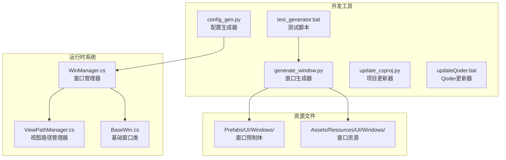
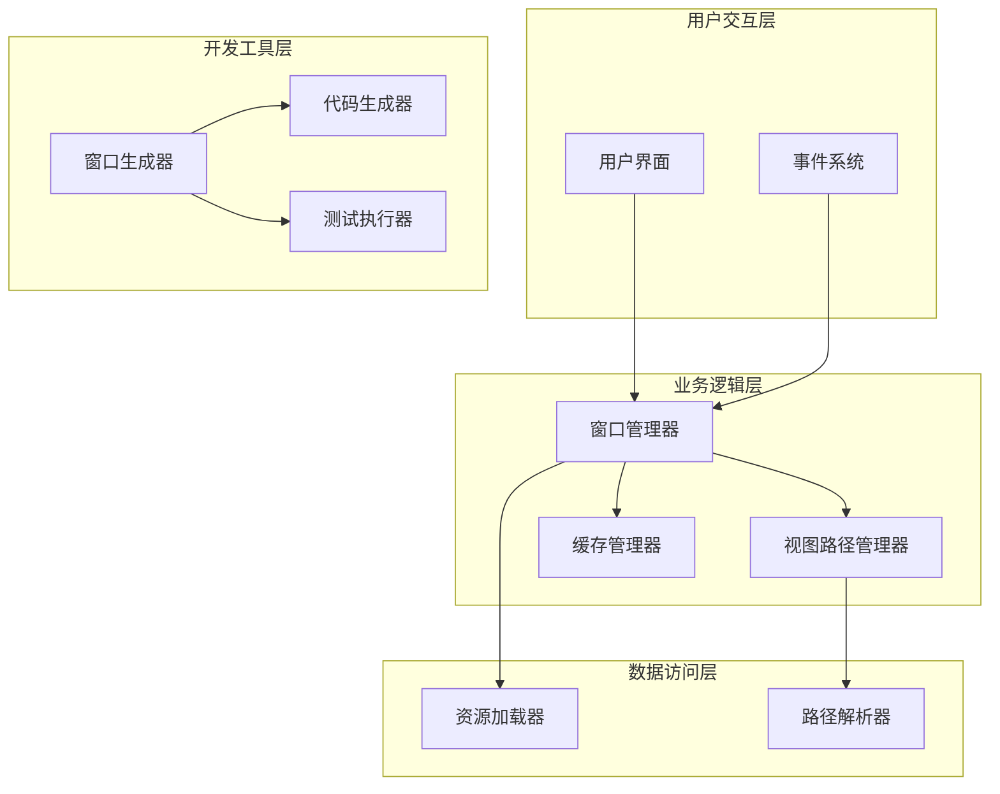
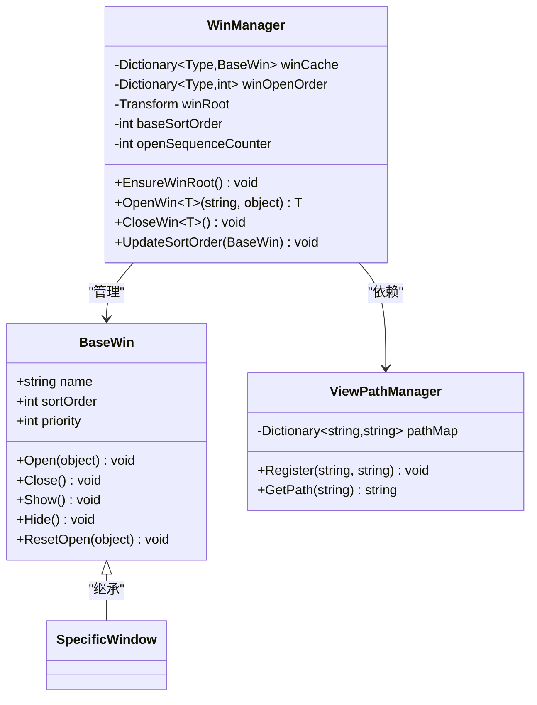
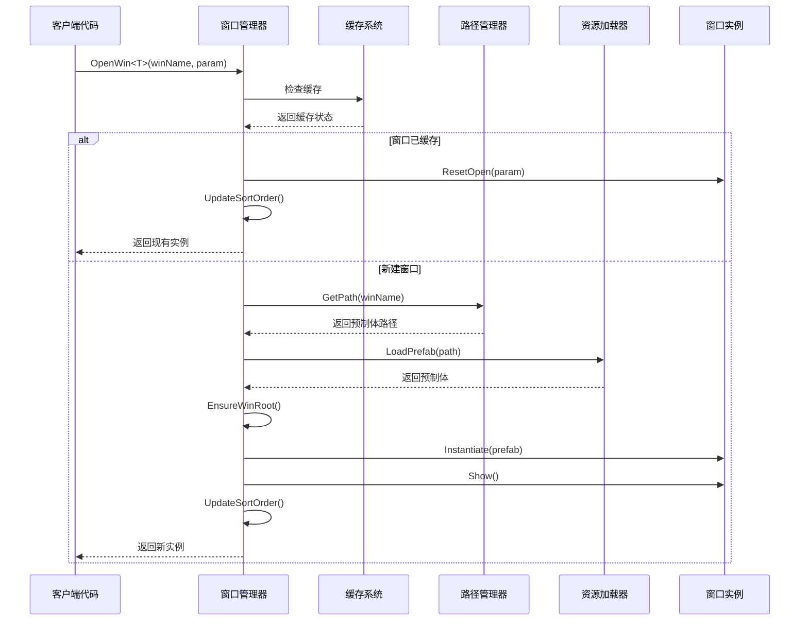
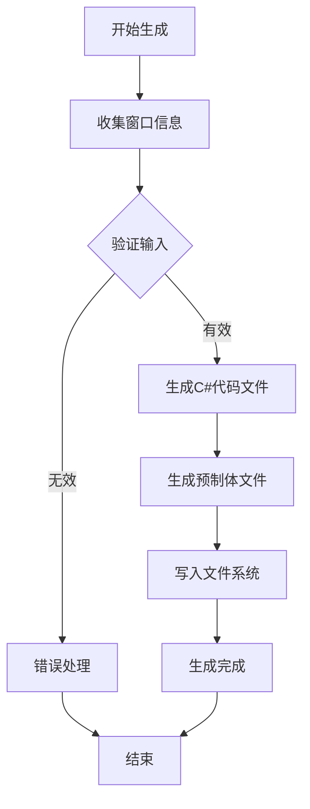
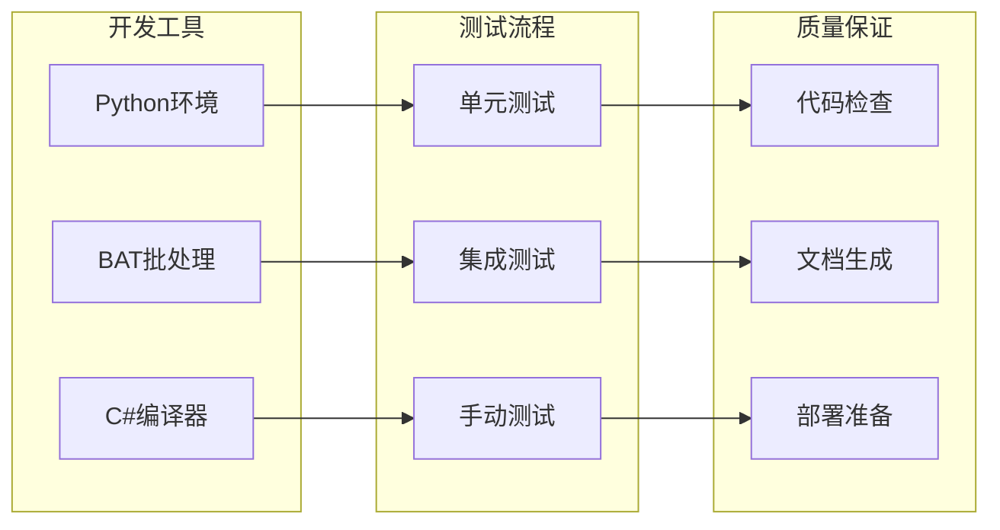
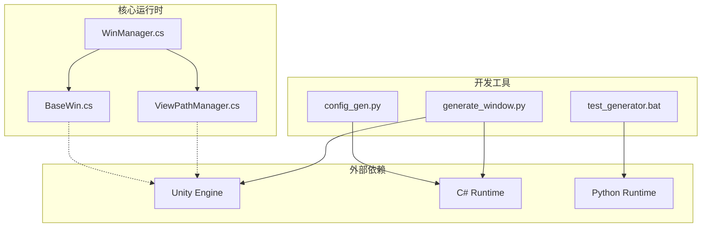

# 窗口生成器系统

<cite>
**本文档引用的文件**
- [WinManager.cs](file://Assets/Scripts/UI/Managers/WinManager.cs)
- [ViewPathManager.cs](file://Assets/Scripts/Core/ViewPathManager.cs)
- [BaseWin.cs](file://Assets/Scripts/UI/Windows/BaseWin.cs)
- [generate_window.py](file://.trae/skills/window-generator/generate_window.py)
- [test_generator.bat](file://.trae/skills/window-generator/test_generator.bat)
- [config_gen.py](file://Tools/config_gen.py)
- [update_csproj.py](file://Tools/update_csproj.py)
- [updateQoder.bat](file://Tools/updateQoder.bat)
</cite>

## 目录
1. [简介](#简介)
2. [项目结构](#项目结构)
3. [核心组件](#核心组件)
4. [架构概览](#架构概览)
5. [详细组件分析](#详细组件分析)
6. [依赖关系分析](#依赖关系分析)
7. [性能考虑](#性能考虑)
8. [故障排除指南](#故障排除指南)
9. [结论](#结论)

## 简介

窗口生成器系统是Unity项目中的一个自动化工具集，旨在简化用户界面窗口的创建和管理过程。该系统包含两个主要部分：

1. **运行时窗口管理系统**：负责在游戏运行时动态加载、管理和显示各种UI窗口
2. **开发期窗口生成器**：提供脚本化工具，自动生成窗口代码和预制体文件

该系统支持窗口的缓存管理、层级排序、参数传递等功能，同时提供了灵活的配置机制来管理窗口资源路径。

## 项目结构

项目采用典型的Unity项目组织结构，窗口生成器系统主要分布在以下位置：

**图表来源**
- [WinManager.cs:42-106](file://Assets/Scripts/UI/Managers/WinManager.cs#L42-L106)
- [ViewPathManager.cs:1-32](file://Assets/Scripts/Core/ViewPathManager.cs#L1-L32)
- [generate_window.py:156-310](file://.trae/skills/window-generator/generate_window.py#L156-L310)

**章节来源**
- [WinManager.cs:42-106](file://Assets/Scripts/UI/Managers/WinManager.cs#L42-L106)
- [ViewPathManager.cs:1-32](file://Assets/Scripts/Core/ViewPathManager.cs#L1-L32)

## 核心组件

### 窗口管理器 (WinManager)

窗口管理器是整个系统的核心控制器，负责窗口的生命周期管理：

- **窗口缓存机制**：维护已创建窗口的实例缓存，避免重复创建
- **动态加载系统**：根据窗口类型动态加载对应的预制体
- **层级管理**：自动管理窗口的显示层级和排序
- **参数传递**：支持窗口间的参数传递和数据共享

### 视图路径管理器 (ViewPathManager)

提供统一的窗口资源路径管理服务：

- **路径映射表**：维护窗口名称到预制体路径的映射关系
- **动态注册**：支持运行时注册新的窗口路径映射
- **默认回退**：当未找到特定映射时，自动使用默认路径格式

### 基础窗口类 (BaseWin)

定义所有窗口的通用行为和接口：

- **生命周期方法**：Open、Close、Show、Hide等标准方法
- **事件处理**：统一的按钮点击、切换等事件处理机制
- **参数接口**：标准化的参数接收和处理接口

**章节来源**
- [WinManager.cs:63-106](file://Assets/Scripts/UI/Managers/WinManager.cs#L63-L106)
- [ViewPathManager.cs:16-31](file://Assets/Scripts/Core/ViewPathManager.cs#L16-L31)
- [BaseWin.cs](file://Assets/Scripts/UI/Windows/BaseWin.cs)

## 架构概览

窗口生成器系统采用分层架构设计，实现了运行时管理和开发期工具的有效分离：

**图表来源**
- [WinManager.cs:42-106](file://Assets/Scripts/UI/Managers/WinManager.cs#L42-L106)
- [generate_window.py:282-310](file://.trae/skills/window-generator/generate_window.py#L282-L310)

## 详细组件分析

### 窗口管理器实现分析

窗口管理器采用了工厂模式和单例模式的结合：

**图表来源**
- [WinManager.cs:63-106](file://Assets/Scripts/UI/Managers/WinManager.cs#L63-L106)
- [BaseWin.cs](file://Assets/Scripts/UI/Windows/BaseWin.cs)
- [ViewPathManager.cs:16-31](file://Assets/Scripts/Core/ViewPathManager.cs#L16-L31)

#### 窗口打开流程序列图

**图表来源**
- [WinManager.cs:63-106](file://Assets/Scripts/UI/Managers/WinManager.cs#L63-L106)

**章节来源**
- [WinManager.cs:42-106](file://Assets/Scripts/UI/Managers/WinManager.cs#L42-L106)

### 开发期窗口生成器分析

窗口生成器是一个Python脚本，提供了完整的窗口代码生成能力：

**图表来源**
- [generate_window.py:282-310](file://.trae/skills/window-generator/generate_window.py#L282-L310)

#### 生成器功能特性

1. **模板引擎**：使用字符串模板生成标准的C#窗口类
2. **预制体生成**：自动生成Unity预制体文件结构
3. **路径管理**：自动处理文件路径和命名规范
4. **错误处理**：完善的异常处理和调试输出

**章节来源**
- [generate_window.py:156-310](file://.trae/skills/window-generator/generate_window.py#L156-L310)

### 测试和工具链

系统还包含完整的测试和开发工具链：

**图表来源**
- [test_generator.bat](file://.trae/skills/window-generator/test_generator.bat)
- [updateQoder.bat](file://Tools/updateQoder.bat)

**章节来源**
- [test_generator.bat](file://.trae/skills/window-generator/test_generator.bat)
- [update_csproj.py](file://Tools/update_csproj.py)

## 依赖关系分析

系统各组件之间的依赖关系清晰明确：

**图表来源**
- [WinManager.cs:63-106](file://Assets/Scripts/UI/Managers/WinManager.cs#L63-L106)
- [generate_window.py:282-310](file://.trae/skills/window-generator/generate_window.py#L282-L310)

### 关键依赖点

1. **运行时依赖**：所有运行时组件都依赖Unity引擎的UI系统
2. **开发时依赖**：生成器脚本依赖Python运行时环境
3. **配置依赖**：路径管理器依赖全局配置系统

**章节来源**
- [ViewPathManager.cs:16-31](file://Assets/Scripts/Core/ViewPathManager.cs#L16-L31)

## 性能考虑

窗口生成器系统在设计时充分考虑了性能优化：

### 缓存策略
- **对象池模式**：窗口实例缓存避免重复创建开销
- **延迟加载**：按需加载窗口资源，减少内存占用
- **批量管理**：统一管理窗口生命周期，避免内存泄漏

### 渲染优化
- **层级管理**：智能的Z轴排序避免不必要的渲染调用
- **可见性控制**：隐藏窗口时停止更新循环
- **资源复用**：共享相同类型的窗口资源

### 开发效率优化
- **自动化生成**：减少重复性代码编写工作
- **模板化开发**：统一的代码结构提高可维护性
- **快速迭代**：支持热重载和快速测试

## 故障排除指南

### 常见问题及解决方案

#### 窗口无法显示
1. **检查预制体路径**：确认ViewPathManager中是否存在正确的路径映射
2. **验证Canvas设置**：确保WinRoot的Canvas组件正确配置
3. **检查组件绑定**：确认预制体上绑定了正确的窗口脚本

#### 窗口层级错误
1. **检查sortOrder设置**：确认窗口的排序层级配置正确
2. **验证UpdateSortOrder调用**：确保层级更新逻辑正常执行
3. **检查Canvas排序**：确认父级Canvas的sortingOrder设置

#### 生成器运行失败
1. **检查Python环境**：确认Python解释器正确安装
2. **验证文件权限**：确保有权限写入目标目录
3. **检查路径配置**：确认生成器脚本中的路径设置正确

**章节来源**
- [WinManager.cs:89-106](file://Assets/Scripts/UI/Managers/WinManager.cs#L89-L106)
- [generate_window.py:182-191](file://.trae/skills/window-generator/generate_window.py#L182-L191)

## 结论

窗口生成器系统是一个设计精良的自动化工具集，成功地解决了Unity项目中UI窗口管理的复杂性问题。系统的主要优势包括：

1. **高度模块化**：清晰的分层架构便于维护和扩展
2. **自动化程度高**：从代码生成到资源管理的全流程自动化
3. **性能优化完善**：缓存、延迟加载等策略确保运行时性能
4. **开发体验优秀**：提供完整的开发工具链和测试支持

该系统为Unity项目的UI开发提供了标准化的解决方案，显著提高了开发效率和代码质量。通过合理的架构设计和完善的工具支持，系统能够适应不同规模和复杂度的项目需求。