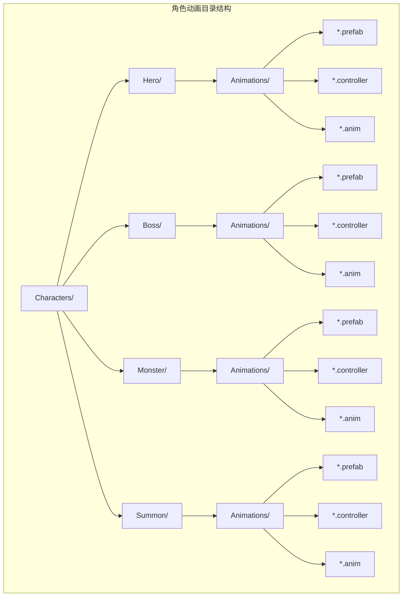
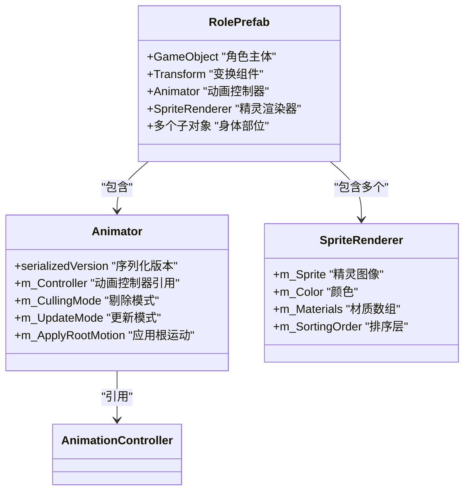
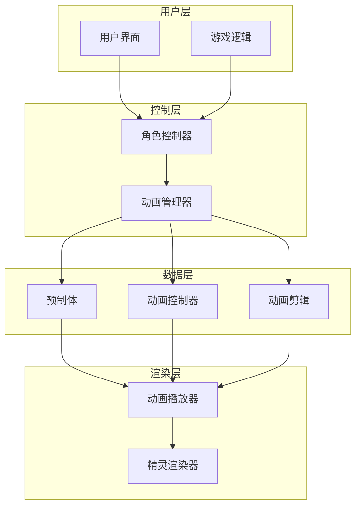
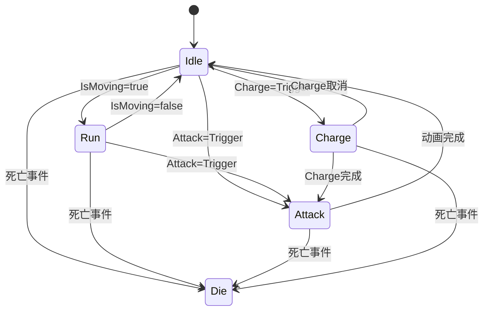
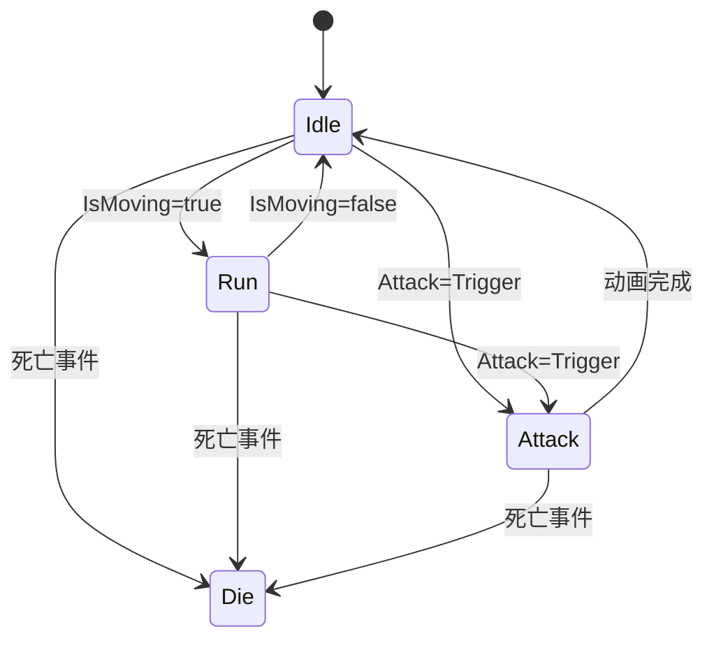
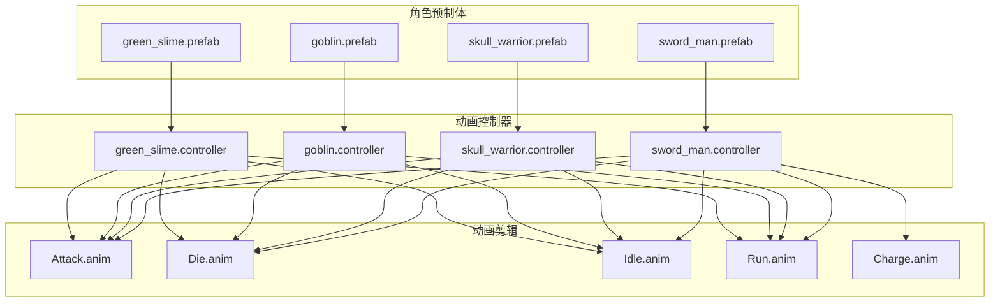

# 动画资源配置

<cite>
**本文档引用的文件**
- [Assets/Characters/Hero/sword_man.prefab](file://Assets/Characters/Hero/sword_man.prefab)
- [Assets/Characters/Boss/skull_warrior.prefab](file://Assets/Characters/Boss/skull_warrior.prefab)
- [Assets/Characters/Monster/goblin.prefab](file://Assets/Characters/Monster/goblin.prefab)
- [Assets/Characters/Summon/green_slime.prefab](file://Assets/Characters/Summon/green_slime.prefab)
- [Assets/Characters/Hero/Animations/sword_man.controller](file://Assets/Characters/Hero/Animations/sword_man.controller)
- [Assets/Characters/Boss/Animations/skull_warrior.controller](file://Assets/Characters/Boss/Animations/skull_warrior.controller)
- [Assets/Characters/Monster/Animations/goblin.controller](file://Assets/Characters/Monster/Animations/goblin.controller)
- [Assets/Characters/Summon/Animations/green_slime.controller](file://Assets/Characters/Summon/Animations/green_slime.controller)
</cite>

## 目录
1. [简介](#简介)
2. [项目结构](#项目结构)
3. [核心组件](#核心组件)
4. [架构概览](#架构概览)
5. [详细组件分析](#详细组件分析)
6. [依赖关系分析](#依赖关系分析)
7. [性能考虑](#性能考虑)
8. [故障排除指南](#故障排除指南)
9. [结论](#结论)
10. [附录](#附录)

## 简介

GeometryTD的动画资源配置系统采用Unity的Animator系统，为游戏中的四类角色（Hero英雄、BossBoss、Monster怪物、Summon召唤物）提供了完整的动画控制解决方案。该系统通过预制体（Prefab）和动画控制器（AnimatorController）的组合，实现了角色动画的统一管理和灵活控制。

本技术文档将深入分析动画资源的组织结构、配置方式、状态机设计以及扩展指南，为开发者提供全面的技术参考。

## 项目结构

动画资源配置遵循Unity的标准项目结构，按角色类型进行模块化组织：

**图表来源**
- [Assets/Characters/Hero/sword_man.prefab:1-626](file://Assets/Characters/Hero/sword_man.prefab#L1-L626)
- [Assets/Characters/Boss/skull_warrior.prefab:1-626](file://Assets/Characters/Boss/skull_warrior.prefab#L1-L626)
- [Assets/Characters/Monster/goblin.prefab:1-626](file://Assets/Characters/Monster/goblin.prefab#L1-L626)
- [Assets/Characters/Summon/green_slime.prefab:1-626](file://Assets/Characters/Summon/green_slime.prefab#L1-L626)

**章节来源**
- [Assets/Characters/Hero/sword_man.prefab:1-626](file://Assets/Characters/Hero/sword_man.prefab#L1-L626)
- [Assets/Characters/Boss/skull_warrior.prefab:1-626](file://Assets/Characters/Boss/skull_warrior.prefab#L1-L626)
- [Assets/Characters/Monster/goblin.prefab:1-626](file://Assets/Characters/Monster/goblin.prefab#L1-L626)
- [Assets/Characters/Summon/green_slime.prefab:1-626](file://Assets/Characters/Summon/green_slime.prefab#L1-L626)

## 核心组件

### 预制体组件配置

每个角色预制体都包含以下核心组件：

**图表来源**
- [Assets/Characters/Hero/sword_man.prefab:216-239](file://Assets/Characters/Hero/sword_man.prefab#L216-L239)
- [Assets/Characters/Boss/skull_warrior.prefab:216-239](file://Assets/Characters/Boss/skull_warrior.prefab#L216-L239)
- [Assets/Characters/Monster/goblin.prefab:216-239](file://Assets/Characters/Monster/goblin.prefab#L216-L239)
- [Assets/Characters/Summon/green_slime.prefab:216-239](file://Assets/Characters/Summon/green_slime.prefab#L216-L239)

### 动画控制器参数

所有角色控制器都定义了标准的动画参数：

| 参数名称 | 类型 | 默认值 | 用途 |
|---------|------|--------|------|
| IsMoving | Bool | false | 控制移动状态切换 |
| Attack | Trigger | 无值 | 触发攻击动画 |
| Charge | Trigger | 无值 | 触发蓄力动画 |

**章节来源**
- [Assets/Characters/Hero/Animations/sword_man.controller:63-81](file://Assets/Characters/Hero/Animations/sword_man.controller#L63-L81)
- [Assets/Characters/Boss/Animations/skull_warrior.controller:11-23](file://Assets/Characters/Boss/Animations/skull_warrior.controller#L11-L23)
- [Assets/Characters/Monster/Animations/goblin.controller:11-23](file://Assets/Characters/Monster/Animations/goblin.controller#L11-L23)
- [Assets/Characters/Summon/Animations/green_slime.controller:11-23](file://Assets/Characters/Summon/Animations/green_slime.controller#L11-L23)

## 架构概览

动画系统采用分层架构设计，确保了良好的可维护性和扩展性：

**图表来源**
- [Assets/Characters/Hero/sword_man.prefab:216-239](file://Assets/Characters/Hero/sword_man.prefab#L216-L239)
- [Assets/Characters/Hero/Animations/sword_man.controller:5-95](file://Assets/Characters/Hero/Animations/sword_man.controller#L5-L95)

## 详细组件分析

### Hero英雄角色动画系统

Hero角色具有独特的动画配置，包含额外的Charge蓄力动画状态：

**图表来源**
- [Assets/Characters/Hero/Animations/sword_man.controller:196-376](file://Assets/Characters/Hero/Animations/sword_man.controller#L196-L376)

Hero角色的特殊之处在于其Charge状态，这为玩家提供了额外的战术选择：

- **Charge状态**：实现蓄力攻击前的准备动画
- **Attack状态**：执行主要攻击动作
- **IsMoving参数**：通过布尔值控制移动状态的进入和退出

**章节来源**
- [Assets/Characters/Hero/Animations/sword_man.controller:196-376](file://Assets/Characters/Hero/Animations/sword_man.controller#L196-L376)
- [Assets/Characters/Hero/sword_man.prefab:216-239](file://Assets/Characters/Hero/sword_man.prefab#L216-L239)

### BossBoss角色动画系统

Boss角色采用简化的动画状态机，专注于基础战斗动画：

**图表来源**
- [Assets/Characters/Boss/Animations/skull_warrior.controller:138-285](file://Assets/Characters/Boss/Animations/skull_warrior.controller#L138-L285)

Boss角色的设计理念是简化复杂度，确保大体型角色的动画流畅性。

**章节来源**
- [Assets/Characters/Boss/Animations/skull_warrior.controller:138-285](file://Assets/Characters/Boss/Animations/skull_warrior.controller#L138-L285)
- [Assets/Characters/Boss/skull_warrior.prefab:216-239](file://Assets/Characters/Boss/skull_warrior.prefab#L216-L239)

### Monster怪物角色动画系统

Monster角色继承了Boss的动画配置，保持了一致的动画行为：

**图表来源**
- [Assets/Characters/Monster/Animations/goblin.controller:138-285](file://Assets/Characters/Monster/Animations/goblin.controller#L138-L285)

Monster角色的动画系统与Boss完全兼容，便于统一管理。

**章节来源**
- [Assets/Characters/Monster/Animations/goblin.controller:138-285](file://Assets/Characters/Monster/Animations/goblin.controller#L138-L285)
- [Assets/Characters/Monster/goblin.prefab:216-239](file://Assets/Characters/Monster/goblin.prefab#L216-L239)

### Summon召唤物角色动画系统

Summon角色同样采用简化的动画配置，专注于基本的战斗动画：

**图表来源**
- [Assets/Characters/Summon/Animations/green_slime.controller:138-285](file://Assets/Characters/Summon/Animations/green_slime.controller#L138-L285)

Summon角色的轻量化设计符合其作为临时单位的定位。

**章节来源**
- [Assets/Characters/Summon/Animations/green_slime.controller:138-285](file://Assets/Characters/Summon/Animations/green_slime.controller#L138-L285)
- [Assets/Characters/Summon/green_slime.prefab:216-239](file://Assets/Characters/Summon/green_slime.prefab#L216-L239)

## 依赖关系分析

动画系统的依赖关系体现了清晰的层次结构：

**图表来源**
- [Assets/Characters/Hero/sword_man.prefab:226](file://Assets/Characters/Hero/sword_man.prefab#L226)
- [Assets/Characters/Boss/skull_warrior.prefab:226](file://Assets/Characters/Boss/skull_warrior.prefab#L226)
- [Assets/Characters/Monster/goblin.prefab:226](file://Assets/Characters/Monster/goblin.prefab#L226)
- [Assets/Characters/Summon/green_slime.prefab:226](file://Assets/Characters/Summon/green_slime.prefab#L226)

**章节来源**
- [Assets/Characters/Hero/Animations/sword_man.controller:196-376](file://Assets/Characters/Hero/Animations/sword_man.controller#L196-L376)
- [Assets/Characters/Boss/Animations/skull_warrior.controller:138-285](file://Assets/Characters/Boss/Animations/skull_warrior.controller#L138-L285)
- [Assets/Characters/Monster/Animations/goblin.controller:138-285](file://Assets/Characters/Monster/Animations/goblin.controller#L138-L285)
- [Assets/Characters/Summon/Animations/green_slime.controller:138-285](file://Assets/Characters/Summon/Animations/green_slime.controller#L138-L285)

## 性能考虑

动画系统的性能优化策略：

### 1. 动画采样优化
- 启用`AllowConstantClipSamplingOptimization`以减少动画采样开销
- 使用合适的更新频率避免过度计算

### 2. 内存管理
- 共享动画剪辑资源，避免重复加载
- 合理使用动画控制器缓存

### 3. 渲染优化
- 优化精灵渲染器的排序层设置
- 减少不必要的材质切换

### 4. 状态机优化
- 避免复杂的嵌套状态机
- 合理设置过渡时间

## 故障排除指南

### 常见问题及解决方案

#### 1. 动画不播放
**症状**：角色动画状态机无法正常播放
**排查步骤**：
1. 检查Animator组件是否正确挂载
2. 验证动画控制器引用是否有效
3. 确认动画剪辑文件是否损坏

#### 2. 状态切换异常
**症状**：动画状态无法正确切换
**排查步骤**：
1. 检查触发器参数设置
2. 验证状态机过渡条件
3. 确认参数值传递逻辑

#### 3. 移动状态冲突
**症状**：IsMoving参数导致状态机混乱
**排查步骤**：
1. 检查Enter和Exit条件设置
2. 验证参数同步机制
3. 确认状态机优先级

**章节来源**
- [Assets/Characters/Hero/Animations/sword_man.controller:1101-115](file://Assets/Characters/Hero/Animations/sword_man.controller#L1101-L115)
- [Assets/Characters/Hero/Animations/sword_man.controller:1101-147](file://Assets/Characters/Hero/Animations/sword_man.controller#L1101-L147)

## 结论

GeometryTD的动画资源配置系统展现了优秀的架构设计和实现策略。通过标准化的角色分类、统一的动画控制器参数和灵活的状态机设计，系统实现了：

1. **一致性**：四类角色共享相似的动画接口和控制逻辑
2. **可扩展性**：Hero角色的额外状态为未来功能扩展预留空间
3. **性能优化**：合理的资源管理和状态机设计确保了运行时效率
4. **易于维护**：清晰的文件组织和标准化的配置流程降低了维护成本

该系统为游戏开发提供了坚实的基础，支持后续的功能扩展和内容更新。

## 附录

### 动画资源扩展指南

#### 添加新角色动画的步骤

1. **创建角色预制体**
   - 在对应角色目录下创建新角色的prefab文件
   - 配置Animator组件并绑定相应的动画控制器

2. **创建动画控制器**
   - 复制现有角色的controller文件
   - 修改控制器名称和参数设置

3. **导入动画剪辑**
   - 将新的动画文件导入到对应的Animations目录
   - 确保动画剪辑的格式和设置符合要求

4. **配置状态机**
   - 设置状态间的过渡条件
   - 配置触发器和参数映射

5. **测试验证**
   - 在场景中实例化新角色进行测试
   - 验证所有动画状态的正确性

#### 动画命名规范

| 资源类型 | 命名规则 | 示例 |
|---------|----------|------|
| 角色预制体 | `{角色名}.prefab` | `sword_man.prefab` |
| 动画控制器 | `{角色名}.controller` | `sword_man.controller` |
| 动画剪辑 | `{动作名}.anim` | `Attack.anim` |
| 角色目录 | `{角色类型}` | `Hero/`, `Boss/`, `Monster/`, `Summon/` |

#### 最佳实践建议

1. **资源组织**：保持目录结构的一致性和完整性
2. **版本控制**：为重要的动画资源建立版本管理
3. **性能监控**：定期检查动画系统的性能表现
4. **文档维护**：及时更新相关技术文档和配置说明