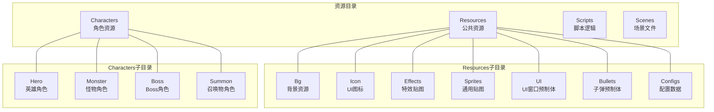
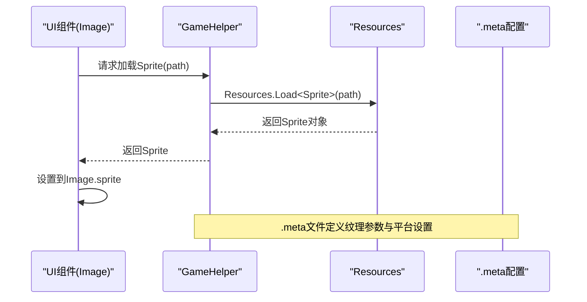
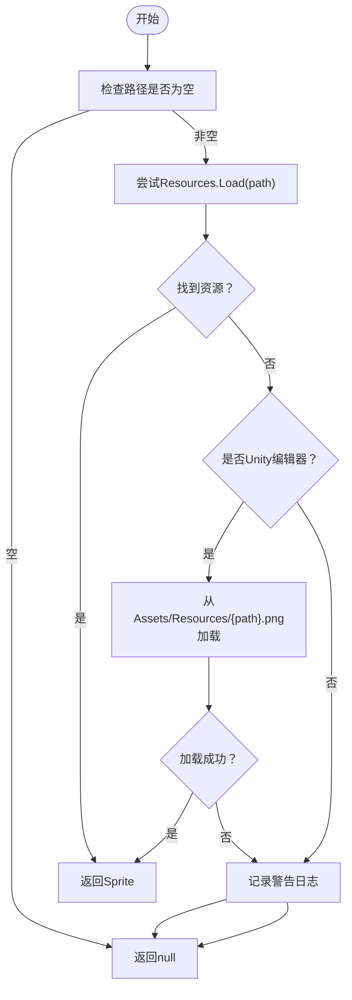
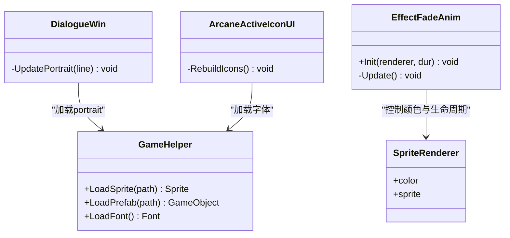
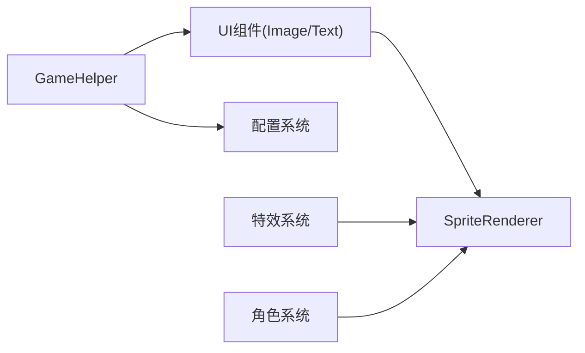

# 图像资源管理

<cite>
**本文档引用的文件**
- [GameHelper.cs](file://Assets/Scripts/Core/GameHelper.cs)
- [background-1-small.png.meta](file://Assets/Resources/Bg/small/background-1-small.png.meta)
- [background-2-small.png.meta](file://Assets/Resources/Bg/small/background-2-small.png.meta)
- [home-background-small.png.meta](file://Assets/Resources/Bg/small/home-background-small.png.meta)
- [background-1-large.png.meta](file://Assets/Resources/Bg/large/background-1-large.png.meta)
- [background-2-extra-large.png.meta](file://Assets/Resources/Bg/extra large/background-2-extra-large.png.meta)
- [alien-128.png.meta](file://Assets/Resources/Icon/alien-128.png.meta)
- [effect_circle_tex.png.meta](file://Assets/Resources/Effects/effect_circle_tex.png.meta)
- [DialogueWin.cs](file://Assets/Scripts/UI/DialogueWin.cs)
- [ArcaneActiveIconUI.cs](file://Assets/Scripts/UI/ArcaneActiveIconUI.cs)
- [EffectFadeAnim.cs](file://Assets/Scripts/Battle/EffectFadeAnim.cs)
- [sword_man.prefab](file://Assets/Characters/Hero/sword_man.prefab)
- [goblin.prefab](file://Assets/Characters/Monster/goblin.prefab)
- [green_slime.prefab](file://Assets/Characters/Summon/green_slime.prefab)
- [skull_warrior.prefab](file://Assets/Characters/Boss/skull_warrior.prefab)
</cite>

## 目录
1. [简介](#简介)
2. [项目结构](#项目结构)
3. [核心组件](#核心组件)
4. [架构总览](#架构总览)
5. [详细组件分析](#详细组件分析)
6. [依赖关系分析](#依赖关系分析)
7. [性能考虑](#性能考虑)
8. [故障排除指南](#故障排除指南)
9. [结论](#结论)
10. [附录](#附录)

## 简介
本文件系统性梳理GeometryTD项目的图像资源管理体系，覆盖以下方面：
- 资源分类与组织：Sprites基础图像、Characters角色图像、Resources/Icon图标资源、Resources/Bg背景资源
- 加载机制：Resources.Load()方法的使用与资源路径配置
- 应用场景：角色精灵图、UI图标、背景图片、特效贴图的使用方式
- 性能优化：纹理压缩、内存管理、渲染优化策略
- 尺寸规范：small、medium、large、extra large等分辨率背景资源配置
- 扩展指南：新增图像资源与分辨率规格配置的最佳实践
- 命名规范与资源组织最佳实践

## 项目结构
项目采用“按功能域分层 + 按资源类型分类”的组织方式：
- Characters：角色资源（动画、精灵、预制体）
- Resources：公共资源（Bg背景、Icon图标、Effects特效、Sprites通用贴图、UI窗口预制体）
- Scripts：核心逻辑、UI、战斗系统等
- Scenes：场景文件

图表来源
- [GameHelper.cs](file://Assets/Scripts/Core/GameHelper.cs)
- [background-1-small.png.meta](file://Assets/Resources/Bg/small/background-1-small.png.meta)
- [alien-128.png.meta](file://Assets/Resources/Icon/alien-128.png.meta)
- [effect_circle_tex.png.meta](file://Assets/Resources/Effects/effect_circle_tex.png.meta)

章节来源
- [GameHelper.cs:13-47](file://Assets/Scripts/Core/GameHelper.cs#L13-L47)
- [background-1-small.png.meta:1-189](file://Assets/Resources/Bg/small/background-1-small.png.meta#L1-L189)
- [alien-128.png.meta:1-189](file://Assets/Resources/Icon/alien-128.png.meta#L1-L189)
- [effect_circle_tex.png.meta:1-164](file://Assets/Resources/Effects/effect_circle_tex.png.meta#L1-L164)

## 核心组件
- 资源加载工具：GameHelper.LoadSprite()统一通过Resources.Load加载Sprite资源，并在编辑器环境下提供回退加载路径
- UI系统：通过Image组件显示图标、头像等；通过Text组件显示计时器等文本
- 战斗系统：通过SpriteRenderer显示特效贴图，配合淡出动画实现临时视觉效果
- 角色系统：通过SpriteRenderer显示角色精灵，配合动画控制器播放动作

章节来源
- [GameHelper.cs:13-47](file://Assets/Scripts/Core/GameHelper.cs#L13-L47)
- [ArcaneActiveIconUI.cs:46-86](file://Assets/Scripts/UI/ArcaneActiveIconUI.cs#L46-L86)
- [EffectFadeAnim.cs:18-52](file://Assets/Scripts/Battle/EffectFadeAnim.cs#L18-L52)

## 架构总览
图像资源管理的整体流程如下：
- 资源准备：将图像放入Resources目录下的对应子目录（Bg、Icon、Effects、Sprites、UI）
- 路径约定：Resources.Load(path)中的path为资源相对路径（不包含扩展名），例如"Bg/small/background-1-small"
- 加载调用：在需要的地方调用GameHelper.LoadSprite或Resources.Load
- 使用展示：UI组件（Image、Text）或SpriteRenderer用于最终呈现

图表来源
- [GameHelper.cs:13-29](file://Assets/Scripts/Core/GameHelper.cs#L13-L29)
- [background-1-small.png.meta:75-145](file://Assets/Resources/Bg/small/background-1-small.png.meta#L75-L145)

章节来源
- [GameHelper.cs:13-29](file://Assets/Scripts/Core/GameHelper.cs#L13-L29)

## 详细组件分析

### 资源分类与组织
- Sprites基础图像：位于Assets/Sprites与Assets/Resources/Sprites，用于通用贴图
- Characters角色图像：位于Assets/Characters下各角色组的Sprites目录，包含Head、Body、Leg、Weapon等部位贴图
- Resources/Icon图标资源：位于Assets/Resources/Icon，按名称后缀标注分辨率（如-64、-128、-256、-512）
- Resources/Bg背景资源：位于Assets/Resources/Bg，按分辨率分目录（small、medium、large、extra large）

章节来源
- [background-1-small.png.meta:1-189](file://Assets/Resources/Bg/small/background-1-small.png.meta#L1-L189)
- [background-2-small.png.meta:152-188](file://Assets/Resources/Bg/small/background-2-small.png.meta#L152-L188)
- [home-background-small.png.meta:152-188](file://Assets/Resources/Bg/small/home-background-small.png.meta#L152-L188)
- [background-1-large.png.meta:152-188](file://Assets/Resources/Bg/large/background-1-large.png.meta#L152-L188)
- [background-2-extra-large.png.meta:106-158](file://Assets/Resources/Bg/extra large/background-2-extra-large.png.meta#L106-L158)
- [alien-128.png.meta:1-189](file://Assets/Resources/Icon/alien-128.png.meta#L1-L189)

### 资源加载机制
- 统一入口：GameHelper.LoadSprite(path)优先通过Resources.Load<Sprite>(path)加载
- 编辑器回退：若Resources.Load失败且处于Unity编辑器环境，则尝试从Assets/Resources/{path}.png加载
- 错误处理：未找到资源时输出警告日志并返回null

图表来源
- [GameHelper.cs:13-29](file://Assets/Scripts/Core/GameHelper.cs#L13-L29)

章节来源
- [GameHelper.cs:13-29](file://Assets/Scripts/Core/GameHelper.cs#L13-L29)

### 不同类型图像资源的应用场景
- 角色精灵图：通过SpriteRenderer显示，常见于角色预制体（如sword_man、goblin、green_slime、skull_warrior）
- UI图标：通过Image组件显示，如对话框头像portrait、Arcane激活图标等
- 背景图片：通过Image组件或UI九宫格适配，支持small/medium/large/extra large多分辨率
- 特效贴图：通过SpriteRenderer显示，配合EffectFadeAnim实现淡出动画

图表来源
- [GameHelper.cs:13-58](file://Assets/Scripts/Core/GameHelper.cs#L13-L58)
- [DialogueWin.cs:130-166](file://Assets/Scripts/UI/DialogueWin.cs#L130-L166)
- [ArcaneActiveIconUI.cs:46-86](file://Assets/Scripts/UI/ArcaneActiveIconUI.cs#L46-L86)
- [EffectFadeAnim.cs:18-52](file://Assets/Scripts/Battle/EffectFadeAnim.cs#L18-L52)

章节来源
- [DialogueWin.cs:130-166](file://Assets/Scripts/UI/DialogueWin.cs#L130-L166)
- [ArcaneActiveIconUI.cs:46-86](file://Assets/Scripts/UI/ArcaneActiveIconUI.cs#L46-L86)
- [EffectFadeAnim.cs:18-52](file://Assets/Scripts/Battle/EffectFadeAnim.cs#L18-L52)
- [sword_man.prefab:527-537](file://Assets/Characters/Hero/sword_man.prefab#L527-L537)
- [goblin.prefab:527-537](file://Assets/Characters/Monster/goblin.prefab#L527-L537)
- [green_slime.prefab:527-537](file://Assets/Characters/Summon/green_slime.prefab#L527-L537)
- [skull_warrior.prefab:527-537](file://Assets/Characters/Boss/skull_warrior.prefab#L527-L537)

### 背景资源尺寸规范
- small：分辨率480×270，适合低分辨率设备或小屏UI背景
- medium：分辨率960×540，适合中等分辨率设备
- large：分辨率1920×1080，适合高分辨率设备
- extra large：分辨率3840×2160，适合超高清设备或大屏背景

章节来源
- [background-1-small.png.meta:152-157](file://Assets/Resources/Bg/small/background-1-small.png.meta#L152-L157)
- [background-2-small.png.meta:152-157](file://Assets/Resources/Bg/small/background-2-small.png.meta#L152-L157)
- [home-background-small.png.meta:152-157](file://Assets/Resources/Bg/small/home-background-small.png.meta#L152-L157)
- [background-1-large.png.meta:152-157](file://Assets/Resources/Bg/large/background-1-large.png.meta#L152-L157)
- [background-2-extra-large.png.meta:152-157](file://Assets/Resources/Bg/extra large/background-2-extra-large.png.meta#L152-L157)

### 图标资源命名规范
- 文件名包含主题标识（如alien、astronaut、chest等）
- 后缀标注分辨率（-64、-128、-256、-512），便于按屏幕密度选择合适尺寸
- meta文件中定义了spriteSheet、pivot、border等渲染参数

章节来源
- [alien-128.png.meta:1-189](file://Assets/Resources/Icon/alien-128.png.meta#L1-L189)

### 特效贴图与渲染
- 特效贴图位于Assets/Resources/Effects，如effect_circle_tex.png
- 通过SpriteRenderer显示，配合EffectFadeAnim实现持续一段时间后淡出并销毁
- 支持透明度渐变与颜色混合，增强视觉反馈

章节来源
- [effect_circle_tex.png.meta:1-164](file://Assets/Resources/Effects/effect_circle_tex.png.meta#L1-L164)
- [EffectFadeAnim.cs:18-52](file://Assets/Scripts/Battle/EffectFadeAnim.cs#L18-L52)

## 依赖关系分析
- GameHelper作为资源加载入口，被UI与配置系统广泛依赖
- UI组件（Image、Text）依赖GameHelper提供的Sprite与Font
- 战斗特效依赖SpriteRenderer与EffectFadeAnim
- 角色预制体依赖SpriteRenderer与动画控制器

图表来源
- [GameHelper.cs:13-58](file://Assets/Scripts/Core/GameHelper.cs#L13-L58)
- [ArcaneActiveIconUI.cs:46-86](file://Assets/Scripts/UI/ArcaneActiveIconUI.cs#L46-L86)
- [EffectFadeAnim.cs:18-52](file://Assets/Scripts/Battle/EffectFadeAnim.cs#L18-L52)

章节来源
- [GameHelper.cs:13-58](file://Assets/Scripts/Core/GameHelper.cs#L13-L58)

## 性能考虑
- 纹理压缩与质量
  - meta文件中定义了textureCompression、compressionQuality等参数，建议在保证画质的前提下适度降低压缩质量以减少内存占用
  - 针对不同平台（WebGL、Server、WeixinMiniGame）分别设置最大纹理尺寸与压缩策略
- 内存管理
  - 使用Resources.Load一次性加载，避免频繁重复加载；对于动态生成的UI图标，可复用Image组件
  - 对于临时特效，使用淡出动画后自动销毁，避免长期驻留内存
- 渲染优化
  - 将相似尺寸的图标按分辨率分组，减少Draw Call
  - 背景资源按分辨率选择，避免在高分辨率设备上强制缩放导致的像素化或过度拉伸
  - 使用SpriteAtlas（如项目中存在）进一步合并纹理，减少纹理切换

章节来源
- [background-1-small.png.meta:75-145](file://Assets/Resources/Bg/small/background-1-small.png.meta#L75-L145)
- [background-2-extra-large.png.meta:106-158](file://Assets/Resources/Bg/extra large/background-2-extra-large.png.meta#L106-L158)
- [effect_circle_tex.png.meta:72-142](file://Assets/Resources/Effects/effect_circle_tex.png.meta#L72-L142)

## 故障排除指南
- 资源加载失败
  - 检查Resources.Load(path)中的path是否正确（不含扩展名），确保资源位于Resources目录下
  - 在Unity编辑器中确认Assets/Resources/{path}.png存在
  - 查看控制台警告日志，定位具体缺失资源
- 图片显示异常
  - 检查.meta文件中的spriteMode、pixelsPerUnit、filterMode等参数
  - 确认Image组件的sprite与Canvas适配模式匹配
- 性能问题
  - 检查是否有大量独立SpriteRenderer同时渲染
  - 评估纹理尺寸与压缩质量，必要时降低分辨率或调整压缩参数
  - 使用Profiler分析Draw Call与内存峰值

章节来源
- [GameHelper.cs:13-47](file://Assets/Scripts/Core/GameHelper.cs#L13-L47)

## 结论
GeometryTD的图像资源管理遵循清晰的分类与路径约定，通过GameHelper统一加载入口，结合UI与战斗系统的合理使用，实现了高效稳定的资源呈现。建议在后续迭代中：
- 引入SpriteAtlas进一步优化渲染性能
- 完善资源打包与版本管理，确保跨平台一致性
- 建立资源审查流程，确保命名规范与meta配置符合项目标准

## 附录

### 新增图像资源扩展指南
- 路径与命名
  - 将新资源放入Assets/Resources/相应目录（Bg/Icon/Effects/Sprites/UI）
  - 遵循Icon命名规范：{主题}-{分辨率}.png（如coin-128.png）
  - 背景资源按分辨率目录存放：Bg/small、Bg/medium、Bg/large、Bg/extra large
- 资源导入与配置
  - 导入后检查.meta文件，确保spriteMode、pixelsPerUnit、filterMode等参数合理
  - 对于背景图，确认alignment/pivot/border设置符合UI需求
- 加载与使用
  - 在代码中通过GameHelper.LoadSprite("Bg/small/background-1-small")加载
  - UI中通过Image组件设置sprite，战斗中通过SpriteRenderer显示

章节来源
- [GameHelper.cs:13-29](file://Assets/Scripts/Core/GameHelper.cs#L13-L29)
- [background-1-small.png.meta:52-74](file://Assets/Resources/Bg/small/background-1-small.png.meta#L52-L74)
- [alien-128.png.meta:52-74](file://Assets/Resources/Icon/alien-128.png.meta#L52-L74)