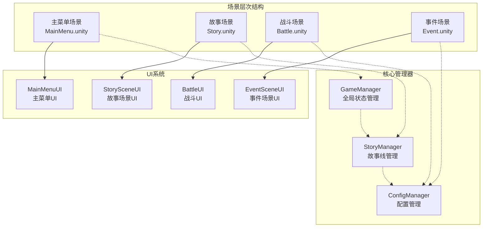
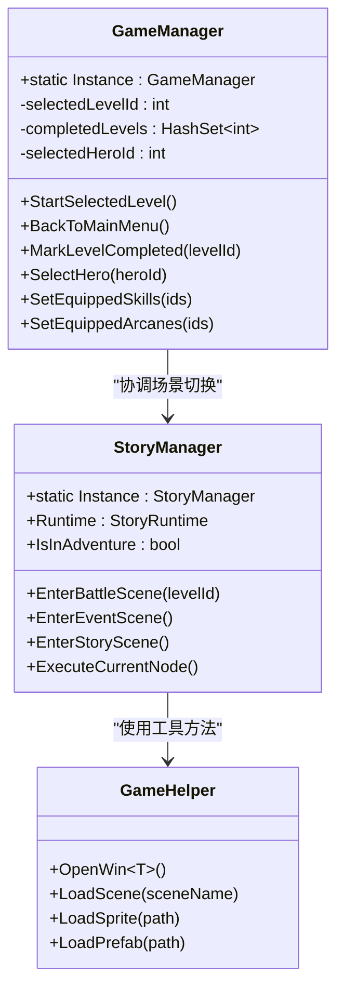
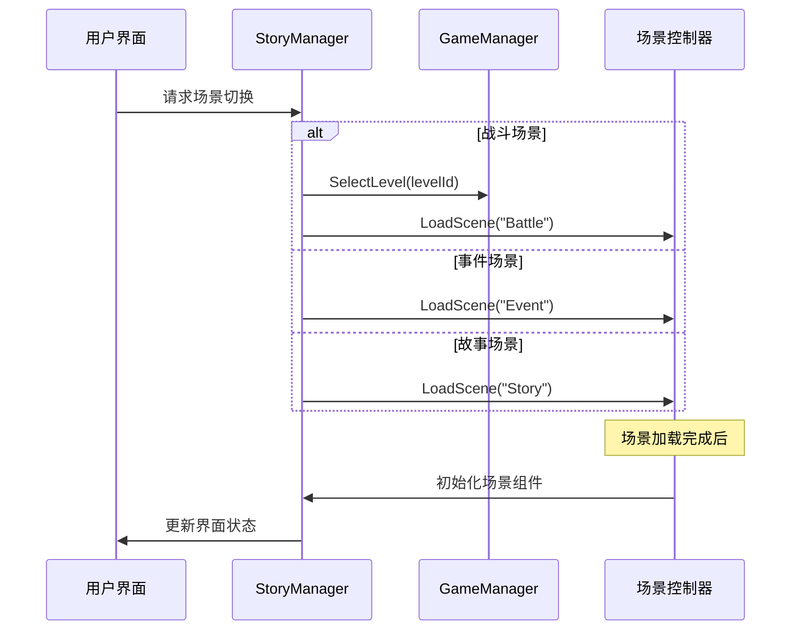
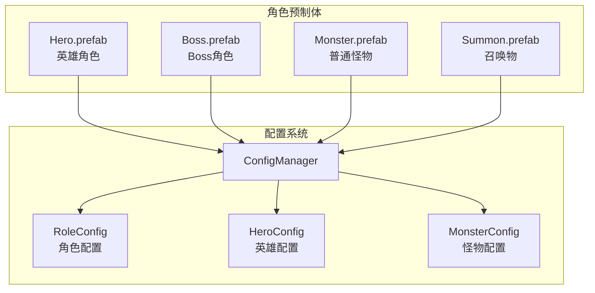
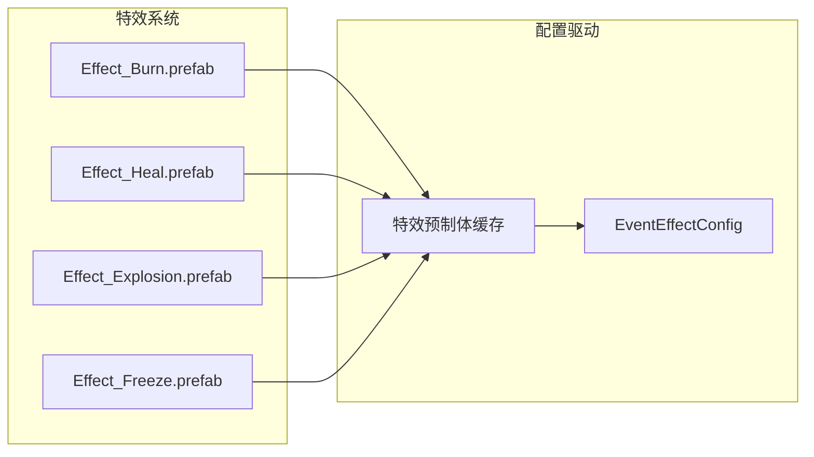
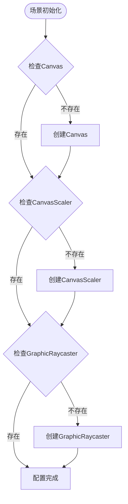
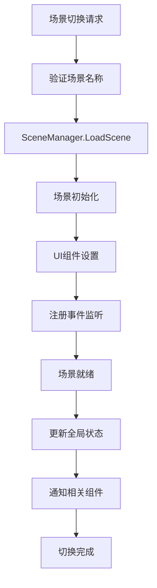
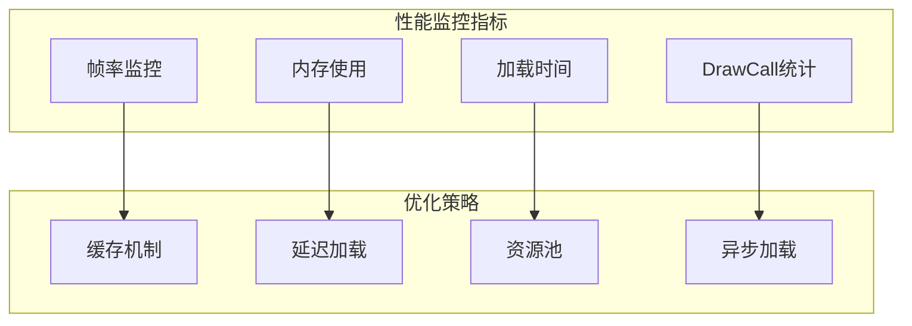

# 场景资源配置

<cite>
**本文档引用的文件**
- [GameManager.cs](file://Assets/Scripts/Core/GameManager.cs)
- [StoryManager.cs](file://Assets/Scripts/Core/StoryManager.cs)
- [Battle.unity](file://Assets/Scenes/Battle.unity)
- [MainMenu.unity](file://Assets/Scenes/MainMenu.unity)
- [Story.unity](file://Assets/Scenes/Story.unity)
- [Event.unity](file://Assets/Scenes/Event.unity)
- [MainMenuUI.cs](file://Assets/Scripts/UI/MainMenuUI.cs)
- [StorySceneUI.cs](file://Assets/Scripts/UI/StorySceneUI.cs)
- [EventSceneUI.cs](file://Assets/Scripts/UI/EventSceneUI.cs)
- [BattleUI.cs](file://Assets/Scripts/UI/BattleUI.cs)
- [Hero.prefab](file://Assets/Prefabs/actors/Hero.prefab)
- [ArcaneSelectWin.prefab](file://Assets/Resources/UI/ArcaneSelectWin.prefab)
- [DialogueWin.prefab](file://Assets/Resources/UI/DialogueWin.prefab)
- [ConfigManager.cs](file://Assets/Scripts/Core/ConfigManager.cs)
- [GameHelper.cs](file://Assets/Scripts/Core/GameHelper.cs)
</cite>

## 目录
1. [项目概述](#项目概述)
2. [场景架构概览](#场景架构概览)
3. [核心场景分析](#核心场景分析)
4. [场景管理机制](#场景管理机制)
5. [预制体引用关系](#预制体引用关系)
6. [场景资源配置](#场景资源配置)
7. [加载与切换机制](#加载与切换机制)
8. [场景优化策略](#场景优化策略)
9. [最佳实践指南](#最佳实践指南)
10. [扩展开发指南](#扩展开发指南)
11. [故障排除](#故障排除)
12. [总结](#总结)

## 项目概述

GeometryTD是一个基于Unity开发的塔防类游戏，采用多场景架构设计。项目通过精心设计的场景管理系统，实现了战斗场景、主菜单场景、故事场景和事件场景之间的无缝切换。

该系统的核心特点包括：
- **场景分离**：每个场景承担特定的功能职责
- **数据持久化**：通过GameManager实现跨场景数据共享
- **配置驱动**：大量使用配置文件驱动场景行为
- **UI模块化**：独立的UI窗口系统支持动态加载

## 场景架构概览



**图表来源**
- [MainMenu.unity](file://Assets/Scenes/MainMenu.unity)
- [Story.unity](file://Assets/Scenes/Story.unity)
- [Battle.unity](file://Assets/Scenes/Battle.unity)
- [Event.unity](file://Assets/Scenes/Event.unity)

## 核心场景分析

### 主菜单场景 (MainMenu)

主菜单场景作为游戏的入口界面，负责：
- **用户交互**：提供英雄选择、技能配置、奥术选择等功能入口
- **场景导航**：连接到其他所有场景
- **UI管理**：承载各种功能按钮和界面元素

**场景特性**：
- 使用正交相机确保UI显示一致性
- 包含完整的Canvas层级结构
- 集成了EventSystem处理用户输入

### 故事场景 (Story)

故事场景是游戏的核心叙事界面：
- **节点导航**：展示故事节点和分支选择
- **动态UI**：根据故事进展动态生成界面元素
- **过渡动画**：支持节点切换的流畅动画效果

**核心功能**：
- 实现故事节点的可视化展示
- 支持分支选择和剧情推进
- 提供丰富的视觉反馈和动画效果

### 战斗场景 (Battle)

战斗场景专注于游戏核心玩法：
- **战斗系统**：集成完整的塔防战斗机制
- **UI组件**：包含血量条、护盾条等战斗UI
- **角色管理**：管理英雄、怪物和子弹的实例化

**技术特点**：
- 采用世界坐标系的UI系统
- 支持实时战斗状态更新
- 集成伤害计算和效果系统

### 事件场景 (Event)

事件场景处理各种非战斗事件：
- **对话系统**：支持复杂的对话和选择分支
- **商店系统**：实现物品购买和交易功能
- **结局管理**：处理不同类型的结局场景

**场景类型**：
- 事件节点：提供对话和选择
- 商店节点：进行物品交易
- 结局节点：展示故事结局

**图表来源**
- [MainMenu.unity](file://Assets/Scenes/MainMenu.unity)
- [Story.unity](file://Assets/Scenes/Story.unity)
- [Battle.unity](file://Assets/Scenes/Battle.unity)
- [Event.unity](file://Assets/Scenes/Event.unity)

## 场景管理机制

### 全局场景控制器



**图表来源**
- [GameManager.cs](file://Assets/Scripts/Core/GameManager.cs)
- [StoryManager.cs](file://Assets/Scripts/Core/StoryManager.cs)
- [GameHelper.cs](file://Assets/Scripts/Core/GameHelper.cs)

### 场景切换流程



**图表来源**
- [StoryManager.cs](file://Assets/Scripts/Core/StoryManager.cs)
- [GameManager.cs](file://Assets/Scripts/Core/GameManager.cs)

## 预制体引用关系

### 角色预制体配置



**图表来源**
- [Hero.prefab](file://Assets/Prefabs/actors/Hero.prefab)
- [ConfigManager.cs](file://Assets/Scripts/Core/ConfigManager.cs)

### UI预制体系统

UI系统采用动态加载机制：

**核心UI组件**：
- **ArcaneSelectWin.prefab**：奥术选择界面
- **DialogueWin.prefab**：对话界面
- **ChoiceWin.prefab**：选择界面
- **StoryCollectionWin.prefab**：故事收藏界面

**加载机制**：
- 通过GameHelper.OpenWin<T>()动态加载
- 支持预制体路径自定义
- 实现UI组件的模块化管理

### 特效预制体管理



**图表来源**
- [ConfigManager.cs](file://Assets/Scripts/Core/ConfigManager.cs)

## 场景资源配置

### 场景构建配置

每个场景都包含以下标准配置：

**渲染设置**：
- OcclusionCulling：关闭遮挡剔除优化
- LightmapSettings：禁用烘焙光照
- Post-processing：禁用后期处理

**摄像机配置**：
- Orthographic：正交投影模式
- Clear Flags：天空盒背景
- Layer Mask：全层渲染

**场景根对象**：
- Main Camera：主摄像机
- EventSystem：UI事件系统
- 场景特定组件

### UI Canvas配置



**图表来源**
- [StorySceneUI.cs](file://Assets/Scripts/UI/StorySceneUI.cs)
- [EventSceneUI.cs](file://Assets/Scripts/UI/EventSceneUI.cs)

## 加载与切换机制

### 场景加载流程



**图表来源**
- [GameHelper.cs](file://Assets/Scripts/Core/GameHelper.cs)
- [StoryManager.cs](file://Assets/Scripts/Core/StoryManager.cs)

### 数据传递机制

场景间的数据传递通过以下方式实现：

**GameManager数据**：
- 关卡选择状态
- 英雄选择信息
- 装备配置数据
- 完成状态记录

**StoryManager数据**：
- 故事运行时状态
- 当前节点信息
- 金币和藏品状态
- 暂存存档数据

**数据持久化**：
- 使用PlayerPrefs存储
- 支持跨版本兼容
- 实现自动保存机制

## 场景优化策略

### 资源加载优化

**预制体预加载**：
- 在ConfigManager中预加载常用预制体
- 实现缓存机制减少重复加载
- 支持异步加载避免卡顿

**场景打包策略**：
- 按场景分离资源包
- 实现按需加载机制
- 支持热更新和增量更新

**内存管理**：
- 及时释放不再使用的资源
- 实现对象池减少GC压力
- 监控内存使用情况

### 性能监控



## 最佳实践指南

### 场景分离原则

**单一职责原则**：
- 每个场景只负责特定功能
- 避免场景间过度耦合
- 实现清晰的边界划分

**资源管理原则**：
- 合理分配场景资源
- 实现资源复用机制
- 避免内存泄漏

### 跨场景数据管理

**数据一致性**：
- 使用统一的数据存储方案
- 实现数据同步机制
- 处理数据冲突和异常

**状态管理**：
- 统一的状态管理模式
- 实现状态转换验证
- 支持状态回滚机制

### UI组件设计

**模块化设计**：
- UI组件独立封装
- 支持动态加载和卸载
- 实现组件间解耦

**响应式设计**：
- 支持多分辨率适配
- 实现动态布局调整
- 优化触摸交互体验

## 扩展开发指南

### 添加新场景

**步骤1：创建场景文件**
1. 在Assets/Scenes目录下创建新场景
2. 设置场景基础配置
3. 添加必要的根对象

**步骤2：实现场景逻辑**
1. 创建对应的UI控制器
2. 实现场景特有的业务逻辑
3. 集成到全局场景管理系统

**步骤3：配置场景切换**
1. 在GameManager中添加切换方法
2. 实现场景间的数据传递
3. 测试场景切换流程

### 场景命名规范

**命名约定**：
- 使用PascalCase命名风格
- 语义明确的场景名称
- 避免使用特殊字符

**目录组织**：
```
Assets/
├── Scenes/                    # 场景文件
│   ├── Battle.unity          # 战斗场景
│   ├── MainMenu.unity        # 主菜单场景
│   ├── Story.unity           # 故事场景
│   └── Event.unity           # 事件场景
├── Scripts/
│   ├── Scenes/               # 场景特定脚本
│   └── UI/                   # 场景UI组件
└── Resources/
    └── UI/                   # 场景UI预制体
```

### 配置管理最佳实践

**配置文件组织**：
- 按功能模块分类配置
- 实现配置文件版本控制
- 支持配置热更新

**配置验证机制**：
- 实现配置加载验证
- 支持默认值处理
- 处理配置缺失和错误

## 故障排除

### 常见问题诊断

**场景加载失败**：
- 检查场景文件完整性
- 验证场景名称拼写
- 确认场景在Build Settings中

**UI显示异常**：
- 检查Canvas配置
- 验证UI组件引用
- 确认渲染顺序设置

**数据丢失问题**：
- 检查PlayerPrefs存储
- 验证数据序列化
- 确认保存时机

### 性能问题排查

**内存泄漏检测**：
- 监控对象生命周期
- 检查事件订阅清理
- 验证资源释放

**加载性能优化**：
- 分析加载时间瓶颈
- 优化资源加载顺序
- 实现渐进式加载

## 总结

GeometryTD的场景资源配置展现了现代Unity项目的最佳实践：

**架构优势**：
- 清晰的场景分离和职责划分
- 强大的配置驱动系统
- 完善的UI模块化设计
- 高效的资源管理机制

**技术特色**：
- 跨场景数据持久化
- 动态UI组件系统
- 配置驱动的场景行为
- 优化的资源加载策略

**扩展性考虑**：
- 模块化的场景架构
- 灵活的配置系统
- 标准化的开发流程
- 完善的测试和调试机制

这套场景资源配置为类似的游戏项目提供了优秀的参考模板，涵盖了从基础架构到高级优化的各个方面，为项目的长期维护和发展奠定了坚实基础。