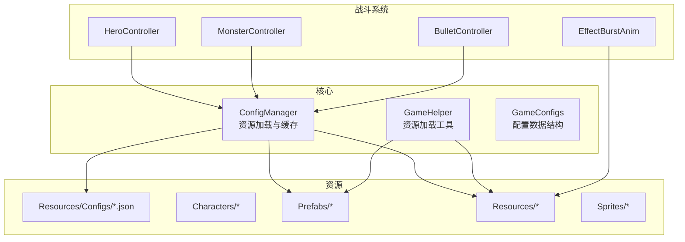
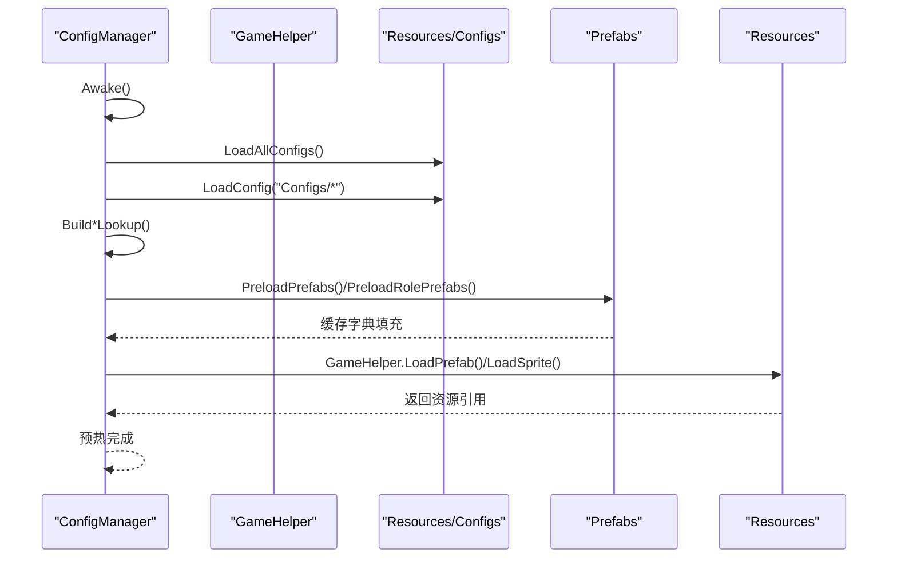
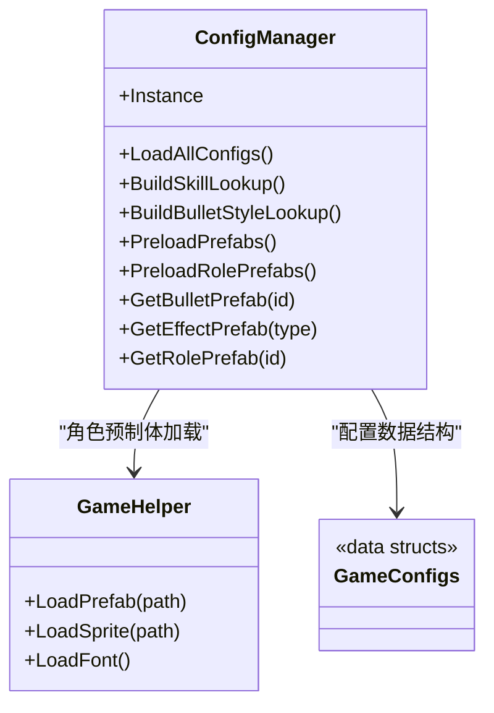
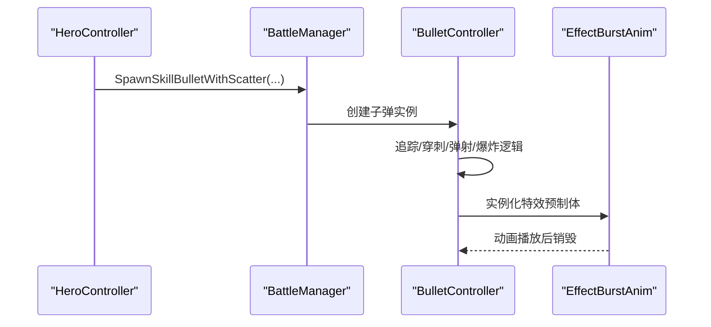
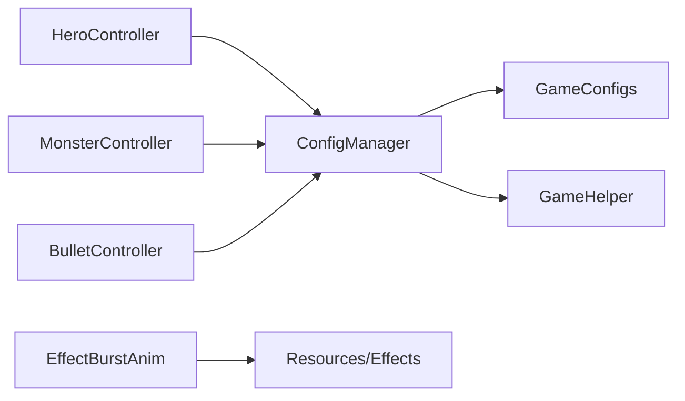

# 资源管理系统

<cite>
**本文引用的文件**
- [ConfigManager.cs](file://Assets/Scripts/Core/ConfigManager.cs)
- [GameHelper.cs](file://Assets/Scripts/Core/GameHelper.cs)
- [GameConfigs.cs](file://Assets/Scripts/Data/GameConfigs.cs)
- [hero_config.json](file://Assets/Resources/Configs/hero_config.json)
- [monster_config.json](file://Assets/Resources/Configs/monster_config.json)
- [HeroController.cs](file://Assets/Scripts/Battle/HeroController.cs)
- [MonsterController.cs](file://Assets/Scripts/Battle/MonsterController.cs)
- [BulletController.cs](file://Assets/Scripts/Battle/BulletController.cs)
- [EffectBurstAnim.cs](file://Assets/Scripts/Battle/EffectBurstAnim.cs)
</cite>

## 目录
1. [简介](#简介)
2. [项目结构](#项目结构)
3. [核心组件](#核心组件)
4. [架构总览](#架构总览)
5. [详细组件分析](#详细组件分析)
6. [依赖关系分析](#依赖关系分析)
7. [性能考量](#性能考量)
8. [故障排查指南](#故障排查指南)
9. [结论](#结论)
10. [附录](#附录)

## 简介
本文件面向GeometryTD的资源管理系统，围绕ConfigManager展开，系统性阐述资源加载机制（预制体缓存、纹理与音频资源管理）、资源组织结构（角色、预制体、资源包、图像）、生命周期管理（加载时机、引用管理、卸载清理）、动画资源管理（AnimatorController、AnimationClip、状态机切换）、特效资源（粒子系统、视觉效果与音效协同）、性能优化策略（打包、内存与加载速度），并提供资源扩展指南与命名规范。

## 项目结构
项目采用“按功能域分层 + 资源分类存放”的组织方式：
- Scripts/Core：核心服务与工具（ConfigManager、GameHelper）
- Scripts/Data：配置数据结构定义（GameConfigs）
- Scripts/Battle：战斗系统（角色、子弹、特效）
- Resources/Configs：游戏配置JSON（角色、怪物、技能、关卡等）
- Characters：角色模型、动画控制器与精灵图
- Prefabs：场景与战斗中使用的预制体
- Resources：背景、子弹、特效、图标、UI等资源
- Sprites：通用UI与形状资源

图表来源
- [ConfigManager.cs:77-122](file://Assets/Scripts/Core/ConfigManager.cs#L77-L122)
- [GameHelper.cs:31-47](file://Assets/Scripts/Core/GameHelper.cs#L31-L47)
- [GameConfigs.cs:87-100](file://Assets/Scripts/Data/GameConfigs.cs#L87-L100)
- [HeroController.cs:115](file://Assets/Scripts/Battle/HeroController.cs#L115)
- [MonsterController.cs:97](file://Assets/Scripts/Battle/MonsterController.cs#L97)
- [BulletController.cs:53-73](file://Assets/Scripts/Battle/BulletController.cs#L53-L73)
- [EffectBurstAnim.cs:19-27](file://Assets/Scripts/Battle/EffectBurstAnim.cs#L19-L27)

章节来源
- [ConfigManager.cs:77-122](file://Assets/Scripts/Core/ConfigManager.cs#L77-L122)
- [GameHelper.cs:31-47](file://Assets/Scripts/Core/GameHelper.cs#L31-L47)
- [GameConfigs.cs:87-100](file://Assets/Scripts/Data/GameConfigs.cs#L87-L100)

## 核心组件
- ConfigManager：单例全局资源与配置管理器，负责加载JSON配置、构建查询索引、预加载预制体缓存，并提供快速查询接口。
- GameHelper：统一的资源加载入口，优先从Resources目录加载，Editor环境下支持从资产路径回退加载。
- GameConfigs：集中定义所有配置数据结构（角色、怪物、技能、属性、事件、关卡等）。

章节来源
- [ConfigManager.cs:6-122](file://Assets/Scripts/Core/ConfigManager.cs#L6-L122)
- [GameHelper.cs:9-84](file://Assets/Scripts/Core/GameHelper.cs#L9-L84)
- [GameConfigs.cs:87-100](file://Assets/Scripts/Data/GameConfigs.cs#L87-L100)

## 架构总览
ConfigManager在Awake阶段初始化，加载所有配置JSON，构建多类查找字典，并执行预加载流程，将常用资源（子弹、特效、角色）放入缓存字典，以降低运行时开销。战斗系统通过ConfigManager查询配置与预制体，GameHelper提供跨环境的资源加载能力。

图表来源
- [ConfigManager.cs:65-122](file://Assets/Scripts/Core/ConfigManager.cs#L65-L122)
- [ConfigManager.cs:169-198](file://Assets/Scripts/Core/ConfigManager.cs#L169-L198)
- [ConfigManager.cs:357-370](file://Assets/Scripts/Core/ConfigManager.cs#L357-L370)
- [GameHelper.cs:31-47](file://Assets/Scripts/Core/GameHelper.cs#L31-L47)

## 详细组件分析

### ConfigManager：资源加载与缓存
- 单例与生命周期：Awake中确保单例、DontDestroyOnLoad、自动加载配置。
- 配置加载：统一通过Resources.Load<TextAsset>读取JSON，JsonUtility反序列化为列表或对象。
- 查询索引：为技能、技能池、子弹样式、角色、事件效果、关卡、条件、故事节点等建立字典，O(1)查询。
- 预加载缓存：
  - 子弹预制体缓存：遍历子弹样式配置，按prefabPath从Resources加载并缓存。
  - 特效预制体缓存：遍历事件效果配置，按prefabPath从Resources加载并缓存。
  - 角色预制体缓存：遍历角色配置，调用GameHelper.LoadPrefab加载并缓存。
- 运行时查询：GetBulletPrefab、GetEffectPrefab、GetRolePrefab等提供快速访问。

图表来源
- [ConfigManager.cs:65-122](file://Assets/Scripts/Core/ConfigManager.cs#L65-L122)
- [ConfigManager.cs:169-198](file://Assets/Scripts/Core/ConfigManager.cs#L169-L198)
- [ConfigManager.cs:357-370](file://Assets/Scripts/Core/ConfigManager.cs#L357-L370)
- [GameHelper.cs:31-47](file://Assets/Scripts/Core/GameHelper.cs#L31-L47)
- [GameConfigs.cs:87-100](file://Assets/Scripts/Data/GameConfigs.cs#L87-L100)

章节来源
- [ConfigManager.cs:65-122](file://Assets/Scripts/Core/ConfigManager.cs#L65-L122)
- [ConfigManager.cs:169-198](file://Assets/Scripts/Core/ConfigManager.cs#L169-L198)
- [ConfigManager.cs:357-370](file://Assets/Scripts/Core/ConfigManager.cs#L357-L370)

### GameHelper：跨环境资源加载
- Prefab加载：优先Resources.Load，Editor下回退到AssetDatabase.LoadAssetAtPath。
- Sprite加载：优先Resources.Load，Editor下回退到AssetDatabase.LoadAssetAtPath。
- 字体加载：优先AnFont，否则内置字体备选。

章节来源
- [GameHelper.cs:31-47](file://Assets/Scripts/Core/GameHelper.cs#L31-L47)
- [GameHelper.cs:49-58](file://Assets/Scripts/Core/GameHelper.cs#L49-L58)

### 配置数据结构：GameConfigs
- 角色配置：RoleConfig包含id、名称、prefabPath、portraitPath。
- 属性系统：AttrEntry、AttributeIds常量定义基础与特殊属性ID。
- 技能与怪物：SkillConfig、MonsterConfig、ArcaneConfig等。
- 事件与效果：EventConfig、EventEffectConfig、BuffConfig、PassiveConfig等。
- 关卡与条件：LevelConfig、ConditionConfig及Story系列配置。

章节来源
- [GameConfigs.cs:87-100](file://Assets/Scripts/Data/GameConfigs.cs#L87-L100)
- [GameConfigs.cs:318-351](file://Assets/Scripts/Data/GameConfigs.cs#L318-L351)
- [GameConfigs.cs:478-490](file://Assets/Scripts/Data/GameConfigs.cs#L478-L490)

### 资源组织结构与用途
- Characters：角色模型与动画资源，包含角色目录、动画控制器与精灵图，用于角色外观与动画。
- Prefabs：actors（英雄/怪物/BOSS/随从）、background、bullet（各类子弹）等预制体，供战斗与场景使用。
- Resources：Bg（背景）、Bullets（子弹样式）、Effects（特效）、Icon（图标）、Sprites（通用图形）、UI（窗口）等。
- Sprites：通用UI与形状资源，如血条、形状等。

章节来源
- [HeroController.cs:115](file://Assets/Scripts/Battle/HeroController.cs#L115)
- [MonsterController.cs:97](file://Assets/Scripts/Battle/MonsterController.cs#L97)
- [BulletController.cs:53-73](file://Assets/Scripts/Battle/BulletController.cs#L53-L73)

### 动画资源管理：AnimatorController与状态机
- 动画资源位于Characters/*/Animations目录，包含Attack、Idle、Run、Die等AnimationClip与对应AnimatorController。
- 运行时通过Animator组件控制动画触发（如Attack、Charge），配合状态机实现不同动作间的平滑过渡。
- 动画状态机由AnimatorController定义，具体切换逻辑由脚本根据状态（冻结、移动、攻击）触发相应Trigger/Bool。

章节来源
- [HeroController.cs:132-133](file://Assets/Scripts/Battle/HeroController.cs#L132-L133)
- [MonsterController.cs:83-84](file://Assets/Scripts/Battle/MonsterController.cs#L83-L84)

### 特效资源：粒子系统与视觉效果
- 特效预制体位于Resources/Effects，包含Burn、Freeze、Explosion、Heal等。
- 运行时通过事件系统（EventExecutor）触发，结合BulletController命中逻辑附加到目标或施法者。
- EffectBurstAnim提供缩放+淡出的瞬时视觉反馈，提升打击感。

图表来源
- [HeroController.cs:470-472](file://Assets/Scripts/Battle/HeroController.cs#L470-L472)
- [BulletController.cs:173-216](file://Assets/Scripts/Battle/BulletController.cs#L173-L216)
- [EffectBurstAnim.cs:19-61](file://Assets/Scripts/Battle/EffectBurstAnim.cs#L19-L61)

### 资源生命周期管理
- 加载时机：ConfigManager在Awake阶段一次性加载并缓存；GameHelper按需加载。
- 引用管理：ConfigManager维护字典缓存，避免重复加载；战斗系统通过ConfigManager查询。
- 卸载清理：当前实现未见显式卸载逻辑；建议在场景切换或资源回收时，统一清理缓存字典与销毁临时实例，防止内存泄漏。

章节来源
- [ConfigManager.cs:65-122](file://Assets/Scripts/Core/ConfigManager.cs#L65-L122)
- [HeroController.cs:470-472](file://Assets/Scripts/Battle/HeroController.cs#L470-L472)

### 音频资源播放控制
- 仓库中未发现音频资源与播放控制代码；若后续引入，建议统一通过AudioSource组件与AudioClip资源管理，结合ConfigManager进行配置化控制（音量、循环、事件触发等）。

## 依赖关系分析
- ConfigManager依赖GameConfigs的数据结构与GameHelper的加载能力。
- 战斗系统（HeroController、MonsterController、BulletController）依赖ConfigManager提供的配置与预制体缓存。
- 特效系统（EffectBurstAnim）依赖Resources/Effects中的预制体与SpriteRenderer。

图表来源
- [ConfigManager.cs:6-122](file://Assets/Scripts/Core/ConfigManager.cs#L6-L122)
- [GameConfigs.cs:87-100](file://Assets/Scripts/Data/GameConfigs.cs#L87-L100)
- [HeroController.cs:115](file://Assets/Scripts/Battle/HeroController.cs#L115)
- [MonsterController.cs:97](file://Assets/Scripts/Battle/MonsterController.cs#L97)
- [BulletController.cs:53-73](file://Assets/Scripts/Battle/BulletController.cs#L53-L73)
- [EffectBurstAnim.cs:19-27](file://Assets/Scripts/Battle/EffectBurstAnim.cs#L19-L27)

## 性能考量
- 资源打包：将常用资源置于Resources目录，减少运行时磁盘IO；对大图集与静态资源进行合并，降低DrawCall。
- 内存占用：预加载高频资源至字典缓存，避免重复加载；及时清理不再使用的临时实例与缓存。
- 加载速度：在场景切换前预热ConfigManager缓存；对非关键资源采用异步加载或延迟加载策略。

## 故障排查指南
- 配置加载失败：检查Resources/Configs下的JSON文件路径与命名是否与ConfigManager一致，确认JsonUtility解析成功。
- 预制体加载失败：确认prefabPath正确且资源存在于Resources/Prefabs或Assets路径；在Editor下验证回退加载逻辑。
- 动画异常：检查AnimatorController与AnimationClip绑定，确保Trigger/Bool参数与脚本触发一致。
- 特效不显示：确认特效预制体存在且路径正确，检查SpriteRenderer与动画脚本是否正常销毁。

章节来源
- [ConfigManager.cs:200-215](file://Assets/Scripts/Core/ConfigManager.cs#L200-L215)
- [ConfigManager.cs:177](file://Assets/Scripts/Core/ConfigManager.cs#L177)
- [HeroController.cs:280](file://Assets/Scripts/Battle/HeroController.cs#L280)
- [EffectBurstAnim.cs:59-61](file://Assets/Scripts/Battle/EffectBurstAnim.cs#L59-L61)

## 结论
ConfigManager作为资源与配置的核心枢纽，通过统一加载、索引与缓存机制，显著降低了运行时资源访问成本。结合GameHelper的跨环境加载能力与GameConfigs的结构化配置，系统实现了清晰的资源组织与高效的生命周期管理。建议在后续迭代中补充资源卸载与异步加载策略，进一步优化内存与启动性能。

## 附录

### 资源扩展指南
- 新增角色模型与动画：在Characters目录下创建角色目录，放置prefab、AnimatorController与AnimationClip，更新RoleConfig与相关配置。
- 新增子弹与特效：在Resources/Effects与Resources/Bullets中新增预制体，更新EventEffectConfig与BulletStyleConfig，确保ConfigManager缓存生效。
- 新增UI素材：将图片放入Sprites或Resources/Sprites，使用GameHelper.LoadSprite加载；窗口预制体放入Resources/UI。

章节来源
- [GameConfigs.cs:87-100](file://Assets/Scripts/Data/GameConfigs.cs#L87-L100)
- [GameConfigs.cs:478-490](file://Assets/Scripts/Data/GameConfigs.cs#L478-L490)
- [GameHelper.cs:13-29](file://Assets/Scripts/Core/GameHelper.cs#L13-L29)

### 命名规范与最佳实践
- JSON配置文件：Configs/*.json，保持与ConfigManager加载路径一致。
- 预制体路径：prefabPath遵循Resources相对路径，避免硬编码绝对路径。
- 动画资源：按角色命名，如skull_warrior.controller与Attack/Idle等动画文件。
- 图片资源：统一放入Sprites或Resources/Sprites，命名语义化，便于检索。
- 预制体分类：Prefabs按功能域分目录（actors/background/bullet/UI），避免根目录过深。

章节来源
- [hero_config.json:1-44](file://Assets/Resources/Configs/hero_config.json#L1-L44)
- [monster_config.json:1-167](file://Assets/Resources/Configs/monster_config.json#L1-L167)
- [GameHelper.cs:31-47](file://Assets/Scripts/Core/GameHelper.cs#L31-L47)