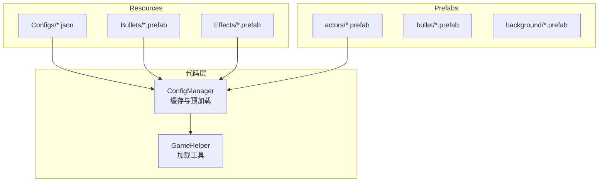
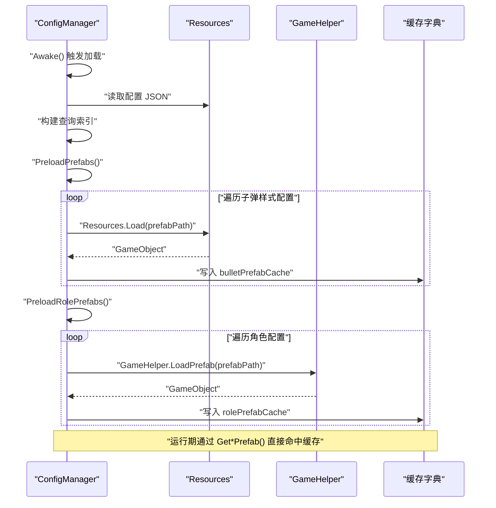
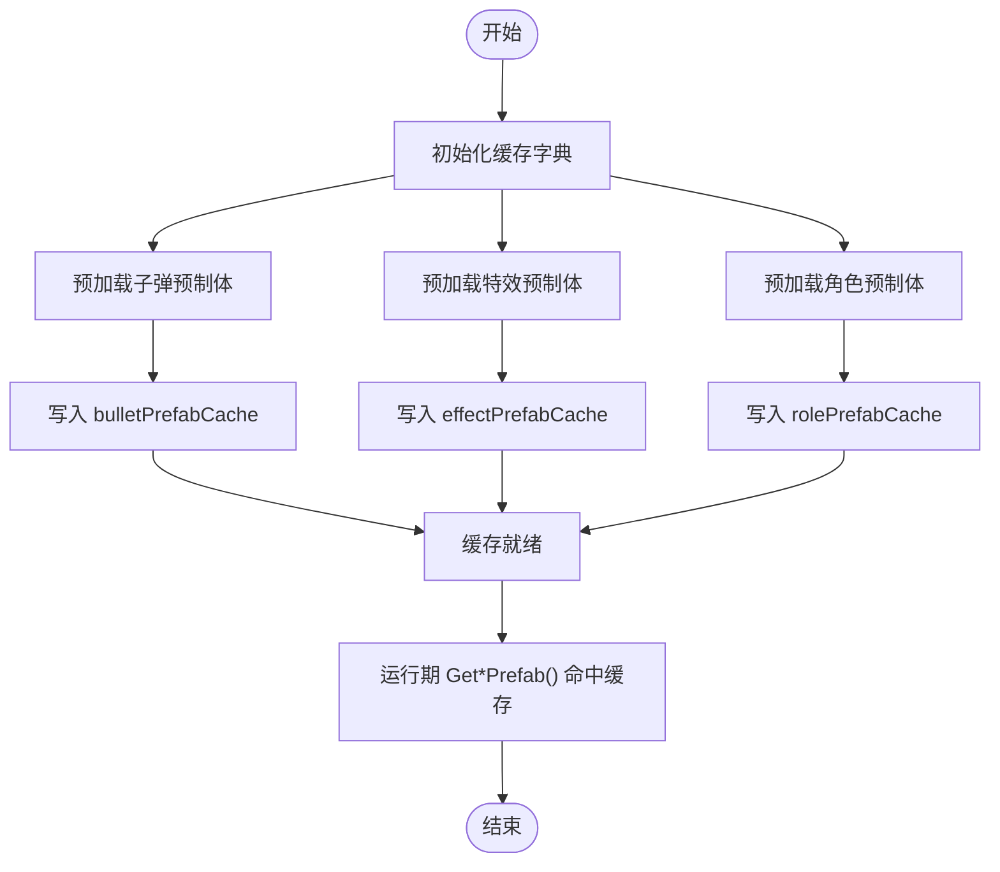
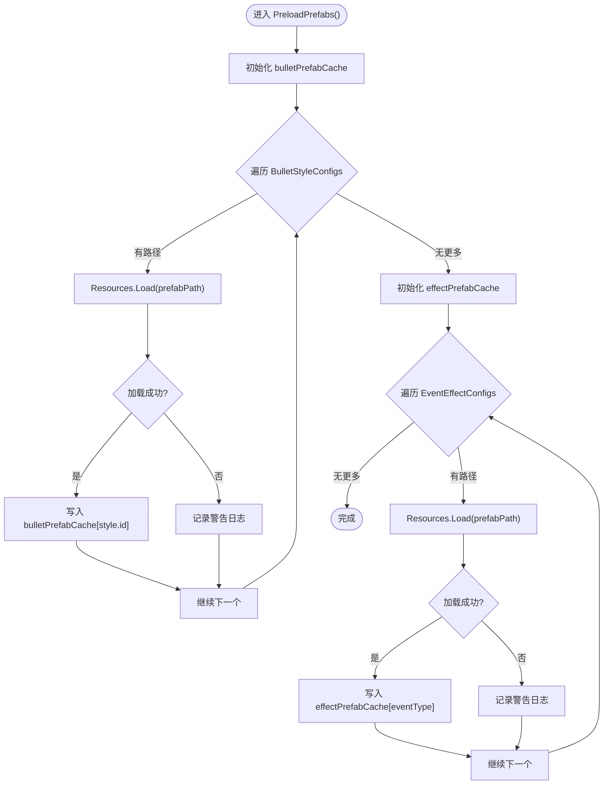
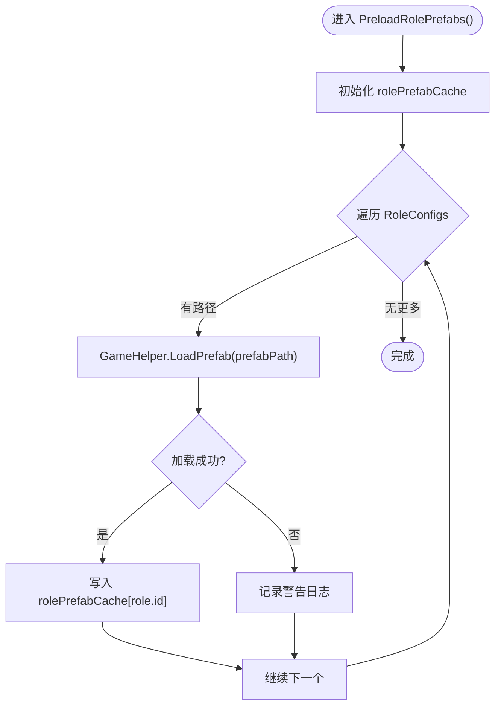
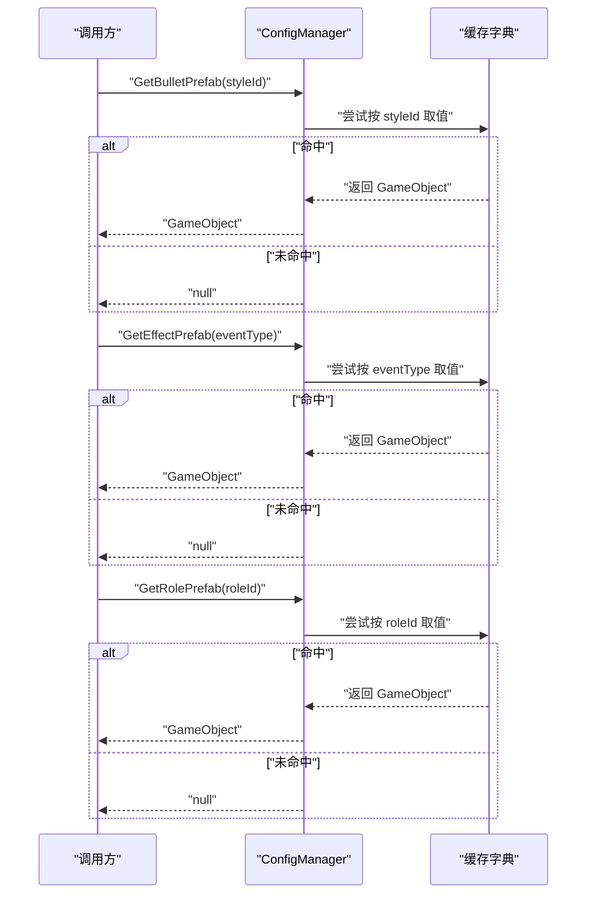
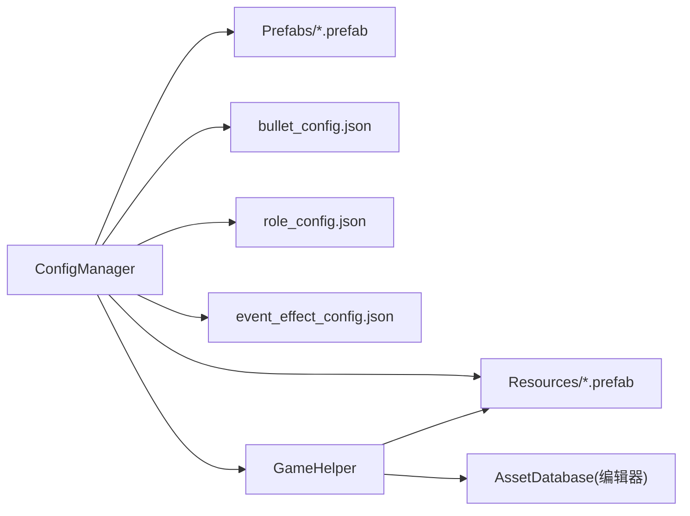

# 预制体管理系统

<cite>
**本文引用的文件**
- [ConfigManager.cs](file://Assets/Scripts/Core/ConfigManager.cs)
- [GameHelper.cs](file://Assets/Scripts/Core/GameHelper.cs)
- [bullet_config.json](file://Assets/Resources/Configs/bullet_config.json)
- [role_config.json](file://Assets/Resources/Configs/role_config.json)
- [event_effect_config.json](file://Assets/Resources/Configs/event_effect_config.json)
</cite>

## 目录
1. [简介](#简介)
2. [项目结构](#项目结构)
3. [核心组件](#核心组件)
4. [架构总览](#架构总览)
5. [详细组件分析](#详细组件分析)
6. [依赖关系分析](#依赖关系分析)
7. [性能考量](#性能考量)
8. [故障排查指南](#故障排查指南)
9. [结论](#结论)
10. [附录](#附录)

## 简介
本文件系统性梳理 GeometryTD 中的预制体（Prefab）管理系统，重点围绕 ConfigManager 的预制体缓存与预加载机制展开，涵盖以下主题：
- 缓存策略与生命周期：bulletPrefabCache、effectPrefabCache、rolePrefabCache 的设计与管理
- 预加载流程：PreloadPrefabs() 与 PreloadRolePrefabs() 的工作原理与差异
- 不同类型预制体的管理：子弹、特效、角色的加载路径与使用场景
- 查找机制：GetBulletPrefab()、GetEffectPrefab()、GetRolePrefab() 的实现细节
- 性能优化：内存占用控制与加载速度优化策略
- 扩展指南：新增预制体资源与配置路径的最佳实践与命名规范

## 项目结构
预制体资源主要分布在 Resources 与 Prefabs 两大目录：
- Resources/Bullets：子弹预制体集合，通过 JSON 配置中的 prefabPath 指向
- Resources/Effects：特效预制体集合，同样由 JSON 配置驱动
- Prefabs/actors：角色与场景对象的通用预制体模板，供角色配置统一引用

图示来源
- [ConfigManager.cs:169-198](file://Assets/Scripts/Core/ConfigManager.cs#L169-L198)
- [ConfigManager.cs:357-370](file://Assets/Scripts/Core/ConfigManager.cs#L357-L370)
- [GameHelper.cs:31-47](file://Assets/Scripts/Core/GameHelper.cs#L31-L47)

章节来源
- [ConfigManager.cs:169-198](file://Assets/Scripts/Core/ConfigManager.cs#L169-L198)
- [ConfigManager.cs:357-370](file://Assets/Scripts/Core/ConfigManager.cs#L357-L370)
- [GameHelper.cs:31-47](file://Assets/Scripts/Core/GameHelper.cs#L31-L47)

## 核心组件
- ConfigManager：单例管理器，负责加载所有配置、构建查询索引，并执行预制体预加载与缓存
- GameHelper：提供跨平台的资源加载工具，优先从 Resources 加载，编辑器下回退到 AssetDatabase

关键职责与接口
- 预加载与缓存：PreloadPrefabs()、PreloadRolePrefabs() 构建三类缓存字典
- 查找接口：GetBulletPrefab()、GetEffectPrefab()、GetRolePrefab() 提供 O(1) 快速访问
- 配置驱动：bullet_config.json、role_config.json、event_effect_config.json 决定 prefabPath

章节来源
- [ConfigManager.cs:61-63](file://Assets/Scripts/Core/ConfigManager.cs#L61-L63)
- [ConfigManager.cs:155-167](file://Assets/Scripts/Core/ConfigManager.cs#L155-L167)
- [ConfigManager.cs:350-355](file://Assets/Scripts/Core/ConfigManager.cs#L350-L355)
- [ConfigManager.cs:169-198](file://Assets/Scripts/Core/ConfigManager.cs#L169-L198)
- [ConfigManager.cs:357-370](file://Assets/Scripts/Core/ConfigManager.cs#L357-L370)

## 架构总览
ConfigManager 在启动时完成配置加载与缓存预热，随后在运行期通过查找接口快速返回已缓存的预制体实例。

图示来源
- [ConfigManager.cs:77-122](file://Assets/Scripts/Core/ConfigManager.cs#L77-L122)
- [ConfigManager.cs:169-198](file://Assets/Scripts/Core/ConfigManager.cs#L169-L198)
- [ConfigManager.cs:357-370](file://Assets/Scripts/Core/ConfigManager.cs#L357-L370)
- [GameHelper.cs:31-47](file://Assets/Scripts/Core/GameHelper.cs#L31-L47)

## 详细组件分析

### 缓存与生命周期
- 三类缓存字典
  - bulletPrefabCache：以子弹样式 id 为键，缓存对应子弹预制体
  - effectPrefabCache：以事件类型为键，缓存对应特效预制体
  - rolePrefabCache：以角色 id 为键，缓存对应角色预制体
- 生命周期
  - 初始化：在 LoadAllConfigs() 结束后调用 PreloadPrefabs() 与 PreloadRolePrefabs() 完成预热
  - 运行期：通过 Get*Prefab() 直接从缓存字典读取，避免重复 IO
  - 销毁：ConfigManager 作为 DONT_DESTROY_ON_LOAD 的单例存在，缓存随进程生命周期保持

图示来源
- [ConfigManager.cs:169-198](file://Assets/Scripts/Core/ConfigManager.cs#L169-L198)
- [ConfigManager.cs:357-370](file://Assets/Scripts/Core/ConfigManager.cs#L357-L370)

章节来源
- [ConfigManager.cs:61-63](file://Assets/Scripts/Core/ConfigManager.cs#L61-L63)
- [ConfigManager.cs:169-198](file://Assets/Scripts/Core/ConfigManager.cs#L169-L198)
- [ConfigManager.cs:357-370](file://Assets/Scripts/Core/ConfigManager.cs#L357-L370)

### 预加载流程详解

#### PreloadPrefabs()：子弹与特效的预加载
- 子弹预加载
  - 遍历 BulletStyleConfigs
  - 读取每条配置的 prefabPath
  - 使用 Resources.Load<GameObject>(path) 加载
  - 成功则以 style.id 为键写入 bulletPrefabCache；失败记录警告日志
- 特效预加载
  - 遍历 EventEffectConfigs
  - 读取每条配置的 prefabPath
  - 使用 Resources.Load<GameObject>(path) 加载
  - 成功则以 effect.eventType 为键写入 effectPrefabCache；失败记录警告日志

图示来源
- [ConfigManager.cs:169-198](file://Assets/Scripts/Core/ConfigManager.cs#L169-L198)

章节来源
- [ConfigManager.cs:169-198](file://Assets/Scripts/Core/ConfigManager.cs#L169-L198)

#### PreloadRolePrefabs()：角色预制体的预加载
- 遍历 RoleConfigs
- 读取每条配置的 prefabPath
- 使用 GameHelper.LoadPrefab(path) 加载（支持 Resources 与编辑器回退）
- 成功则以 role.id 为键写入 rolePrefabCache；失败记录警告日志

图示来源
- [ConfigManager.cs:357-370](file://Assets/Scripts/Core/ConfigManager.cs#L357-L370)
- [GameHelper.cs:31-47](file://Assets/Scripts/Core/GameHelper.cs#L31-L47)

章节来源
- [ConfigManager.cs:357-370](file://Assets/Scripts/Core/ConfigManager.cs#L357-L370)
- [GameHelper.cs:31-47](file://Assets/Scripts/Core/GameHelper.cs#L31-L47)

### 查找机制详解

#### GetBulletPrefab(styleId)
- 以 styleId 为键直接查询 bulletPrefabCache
- 命中返回缓存的 GameObject；未命中返回 null

#### GetEffectPrefab(eventType)
- 以 eventType 为键直接查询 effectPrefabCache
- 命中返回缓存的 GameObject；未命中返回 null

#### GetRolePrefab(roleId)
- 以 roleId 为键直接查询 rolePrefabCache
- 命中返回缓存的 GameObject；未命中返回 null

图示来源
- [ConfigManager.cs:155-167](file://Assets/Scripts/Core/ConfigManager.cs#L155-L167)
- [ConfigManager.cs:350-355](file://Assets/Scripts/Core/ConfigManager.cs#L350-L355)

章节来源
- [ConfigManager.cs:155-167](file://Assets/Scripts/Core/ConfigManager.cs#L155-L167)
- [ConfigManager.cs:350-355](file://Assets/Scripts/Core/ConfigManager.cs#L350-L355)

### 不同类型预制体的管理方式

#### 子弹预制体
- 配置来源：bullet_config.json
- 加载路径：Resources/Bullets/*.prefab
- 使用场景：根据子弹样式 id 动态选择对应子弹预制体

章节来源
- [bullet_config.json:1-9](file://Assets/Resources/Configs/bullet_config.json#L1-L9)
- [ConfigManager.cs:169-198](file://Assets/Scripts/Core/ConfigManager.cs#L169-L198)

#### 特效预制体
- 配置来源：event_effect_config.json
- 加载路径：Resources/Effects/*.prefab
- 使用场景：根据事件类型映射到对应特效预制体

章节来源
- [event_effect_config.json:1-19](file://Assets/Resources/Configs/event_effect_config.json#L1-L19)
- [ConfigManager.cs:169-198](file://Assets/Scripts/Core/ConfigManager.cs#L169-L198)

#### 角色预制体
- 配置来源：role_config.json
- 加载路径：Prefabs/actors/*.prefab（通过 GameHelper.LoadPrefab 统一加载）
- 使用场景：根据角色 id 选择通用角色模板（如 Hero、Monster、Boss、Summon）

章节来源
- [role_config.json:1-14](file://Assets/Resources/Configs/role_config.json#L1-L14)
- [ConfigManager.cs:357-370](file://Assets/Scripts/Core/ConfigManager.cs#L357-L370)
- [GameHelper.cs:31-47](file://Assets/Scripts/Core/GameHelper.cs#L31-L47)

## 依赖关系分析
- ConfigManager 依赖 Resources 与 Prefabs 下的预制体资源
- GameHelper 为角色预制体加载提供跨平台兼容能力
- 三类配置文件驱动不同类型的预制体加载

图示来源
- [ConfigManager.cs:169-198](file://Assets/Scripts/Core/ConfigManager.cs#L169-L198)
- [ConfigManager.cs:357-370](file://Assets/Scripts/Core/ConfigManager.cs#L357-L370)
- [GameHelper.cs:31-47](file://Assets/Scripts/Core/GameHelper.cs#L31-L47)

章节来源
- [ConfigManager.cs:169-198](file://Assets/Scripts/Core/ConfigManager.cs#L169-L198)
- [ConfigManager.cs:357-370](file://Assets/Scripts/Core/ConfigManager.cs#L357-L370)
- [GameHelper.cs:31-47](file://Assets/Scripts/Core/GameHelper.cs#L31-L47)

## 性能考量
- 时间复杂度
  - 预加载阶段：O(N) 遍历配置并进行资源加载
  - 运行期查找：O(1) 字典查找
- 内存占用
  - 缓存字典存储完整 GameObject 引用，占用与预制体数量及复杂度相关
  - 建议：仅缓存必要且高频使用的预制体，避免缓存过多稀有或一次性使用的资源
- 加载速度优化
  - 预加载：在场景切换前完成，避免首次使用时的卡顿
  - 资源路径规范化：确保 prefabPath 准确指向 Resources 或 Prefabs，减少回退与错误重试
  - 日志监控：关注加载失败警告，及时修复缺失资源

[本节为通用性能建议，不直接分析具体文件]

## 故障排查指南
常见问题与处理
- 预制体加载失败
  - 现象：控制台出现“无法加载...Prefab”警告
  - 排查：确认 prefabPath 是否正确；检查资源是否存在于 Resources 或 Prefabs
  - 处理：修正配置文件中的 prefabPath；或将资源移动至允许的加载路径
- 查找不到预制体
  - 现象：Get*Prefab() 返回 null
  - 排查：确认预加载是否已完成；确认键值（styleId/eventType/roleId）与配置一致
  - 处理：检查配置文件与缓存初始化顺序；确保键值唯一且正确

章节来源
- [ConfigManager.cs:176-181](file://Assets/Scripts/Core/ConfigManager.cs#L176-L181)
- [ConfigManager.cs:190-195](file://Assets/Scripts/Core/ConfigManager.cs#L190-L195)
- [ConfigManager.cs:363-368](file://Assets/Scripts/Core/ConfigManager.cs#L363-L368)

## 结论
ConfigManager 通过三类缓存字典实现了对子弹、特效与角色预制体的高效管理：以配置驱动的预加载保证了运行期的低延迟访问，同时通过 GameHelper 提升了资源加载的可靠性。遵循本文的扩展与命名规范，可进一步提升系统的可维护性与性能。

[本节为总结性内容，不直接分析具体文件]

## 附录

### 扩展指南：新增预制体资源与配置路径
- 新增子弹预制体
  - 在 Resources/Bullets 下放置新预制体
  - 在 bullet_config.json 中新增一条配置，填写唯一 id 与正确的 prefabPath
  - 重启游戏或触发重新加载，确保预加载流程覆盖新配置
- 新增特效预制体
  - 在 Resources/Effects 下放置新预制体
  - 在 event_effect_config.json 中新增一条配置，填写唯一 eventType 与正确的 prefabPath
  - 重启游戏或触发重新加载
- 新增角色预制体
  - 将角色模板放入 Prefabs/actors 下
  - 在 role_config.json 中为对应角色配置 prefabPath
  - 重启游戏或触发重新加载

章节来源
- [bullet_config.json:1-9](file://Assets/Resources/Configs/bullet_config.json#L1-L9)
- [event_effect_config.json:1-19](file://Assets/Resources/Configs/event_effect_config.json#L1-L19)
- [role_config.json:1-14](file://Assets/Resources/Configs/role_config.json#L1-L14)
- [ConfigManager.cs:169-198](file://Assets/Scripts/Core/ConfigManager.cs#L169-L198)
- [ConfigManager.cs:357-370](file://Assets/Scripts/Core/ConfigManager.cs#L357-L370)

### 命名规范与组织最佳实践
- 路径与文件名
  - 子弹：Resources/Bullets/Bullet_Style{id}.prefab
  - 特效：Resources/Effects/Effect_{Name}.prefab
  - 角色：Prefabs/actors/{Type}.prefab（如 Hero、Monster、Boss、Summon）
- 配置键值
  - 子弹样式 id：全局唯一，建议按类型分段（如 1xx、10x、20x）
  - 事件类型 eventType：与事件系统约定一致
  - 角色 id：与角色配置一致，便于映射
- 资源组织
  - 将同类型资源归档至同一目录，便于维护与查找
  - 避免在运行期频繁创建/销毁大量实例，尽量复用缓存的预制体

[本节为通用规范建议，不直接分析具体文件]