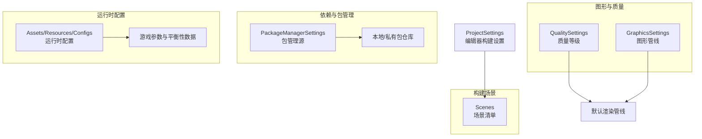
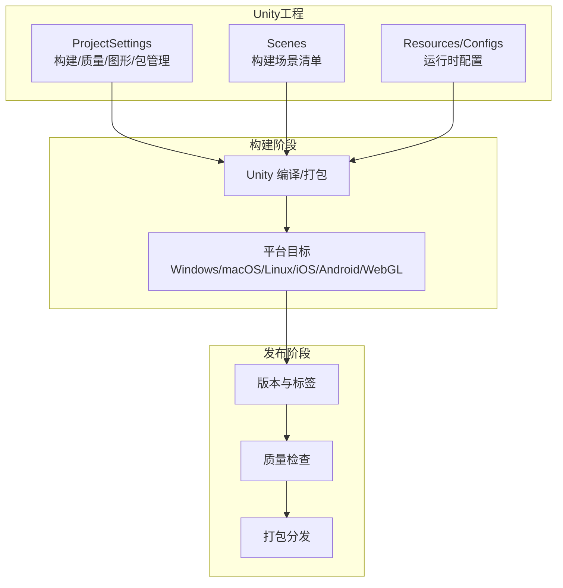
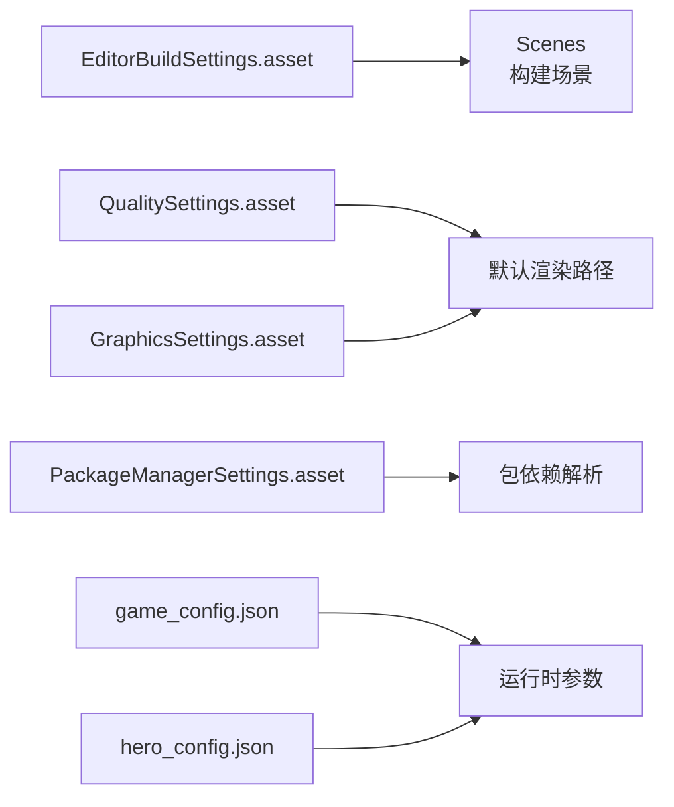

# 部署指南

<cite>
**本文引用的文件**
- [EditorBuildSettings.asset](file://ProjectSettings/EditorBuildSettings.asset)
- [ProjectSettings.asset](file://ProjectSettings/ProjectSettings.asset)
- [QualitySettings.asset](file://ProjectSettings/QualitySettings.asset)
- [GraphicsSettings.asset](file://ProjectSettings/GraphicsSettings.asset)
- [PackageManagerSettings.asset](file://ProjectSettings/PackageManagerSettings.asset)
- [game_config.json](file://Assets/Resources/Configs/game_config.json)
- [hero_config.json](file://Assets/Resources/Configs/hero_config.json)
- [settings.local.json](file://.codebuddy/settings.local.json)
</cite>

## 目录
1. [简介](#简介)
2. [项目结构](#项目结构)
3. [核心组件](#核心组件)
4. [架构总览](#架构总览)
5. [详细组件分析](#详细组件分析)
6. [依赖关系分析](#依赖关系分析)
7. [性能考虑](#性能考虑)
8. [故障排查指南](#故障排查指南)
9. [结论](#结论)
10. [附录](#附录)

## 简介
本指南面向GeometryTD项目，提供从Unity工程配置到多平台构建与发布的完整部署方案。内容涵盖：
- 构建配置与平台特性开关
- 多平台（Windows/macOS/Linux/iPhone/iPadOS/Android/WebGL）构建流程与注意事项
- 标准化发布流程（版本管理、自动化、质量检查、打包）
- 部署环境要求（系统、依赖、运行时）
- 版本控制与发布管理最佳实践（分支、标签、变更日志、回滚）
- 性能优化建议（资源压缩、代码混淆、内存优化、启动速度）
- 部署脚本与CI/CD集成思路

## 项目结构
GeometryTD为Unity 2D项目，场景与资源组织清晰，核心构建场景位于ProjectSettings中的EditorBuildSettings中定义。质量与图形设置在QualitySettings与GraphicsSettings中集中管理；包管理通过PackageManagerSettings指向内部私有源。

图表来源
- [EditorBuildSettings.asset:1-32](file://ProjectSettings/EditorBuildSettings.asset#L1-L32)
- [QualitySettings.asset:1-241](file://ProjectSettings/QualitySettings.asset#L1-L241)
- [GraphicsSettings.asset:1-65](file://ProjectSettings/GraphicsSettings.asset#L1-L65)
- [PackageManagerSettings.asset:1-37](file://ProjectSettings/PackageManagerSettings.asset#L1-L37)
- [game_config.json:1-9](file://Assets/Resources/Configs/game_config.json#L1-L9)
- [hero_config.json:1-44](file://Assets/Resources/Configs/hero_config.json#L1-L44)

章节来源
- [EditorBuildSettings.asset:1-32](file://ProjectSettings/EditorBuildSettings.asset#L1-L32)
- [ProjectSettings.asset:1-847](file://ProjectSettings/ProjectSettings.asset#L1-L847)
- [QualitySettings.asset:1-241](file://ProjectSettings/QualitySettings.asset#L1-L241)
- [GraphicsSettings.asset:1-65](file://ProjectSettings/GraphicsSettings.asset#L1-L65)
- [PackageManagerSettings.asset:1-37](file://ProjectSettings/PackageManagerSettings.asset#L1-L37)
- [game_config.json:1-9](file://Assets/Resources/Configs/game_config.json#L1-L9)
- [hero_config.json:1-44](file://Assets/Resources/Configs/hero_config.json#L1-L44)

## 核心组件
- 构建场景清单：EditorBuildSettings定义了主菜单、战斗、剧情、事件四个场景，用于构建阶段按序打包。
- 图形与质量：QualitySettings提供多档质量等级及平台默认值；GraphicsSettings定义默认渲染路径与常用着色器。
- 包管理：PackageManagerSettings指向内部私有源，确保依赖一致性与可复现性。
- 运行时配置：game_config.json与hero_config.json等JSON配置文件承载游戏参数与角色数据，发布前需纳入构建产物并进行版本化管理。

章节来源
- [EditorBuildSettings.asset:7-20](file://ProjectSettings/EditorBuildSettings.asset#L7-L20)
- [QualitySettings.asset:225-241](file://ProjectSettings/QualitySettings.asset#L225-L241)
- [GraphicsSettings.asset:45-46](file://ProjectSettings/GraphicsSettings.asset#L45-L46)
- [PackageManagerSettings.asset:21-28](file://ProjectSettings/PackageManagerSettings.asset#L21-L28)
- [game_config.json:1-9](file://Assets/Resources/Configs/game_config.json#L1-L9)
- [hero_config.json:1-44](file://Assets/Resources/Configs/hero_config.json#L1-L44)

## 架构总览
下图展示从Unity工程到多平台产物的关键路径与配置点：

图表来源
- [ProjectSettings.asset:1-847](file://ProjectSettings/ProjectSettings.asset#L1-L847)
- [EditorBuildSettings.asset:1-32](file://ProjectSettings/EditorBuildSettings.asset#L1-L32)
- [PackageManagerSettings.asset:1-37](file://ProjectSettings/PackageManagerSettings.asset#L1-L37)
- [game_config.json:1-9](file://Assets/Resources/Configs/game_config.json#L1-L9)

## 详细组件分析

### 构建场景与打包清单
- 当前构建场景包含主菜单、战斗、剧情、事件四幕，建议在发布前统一校验场景加载顺序与资源依赖，避免遗漏。
- 建议在CI中以“场景清单”为唯一输入，确保构建一致性。

章节来源
- [EditorBuildSettings.asset:7-20](file://ProjectSettings/EditorBuildSettings.asset#L7-L20)

### 质量与图形设置
- 质量等级：项目提供从“Very Low”到“Ultra”的多档质量，且对不同平台设置了默认质量档位（如Standalone/WebGL等），可在CI中按目标平台选择对应质量。
- 默认渲染路径：默认使用内置渲染管线（Built-in RP），未启用自定义渲染管线；若后续引入URP/HDRP，请同步更新GraphicsSettings与QualitySettings。

章节来源
- [QualitySettings.asset:8-241](file://ProjectSettings/QualitySettings.asset#L8-L241)
- [GraphicsSettings.asset:45-46](file://ProjectSettings/GraphicsSettings.asset#L45-L46)

### 包管理与依赖
- 包管理器指向内部私有源，确保团队内依赖一致；建议在CI中锁定包版本并缓存依赖目录，提升构建稳定性与速度。

章节来源
- [PackageManagerSettings.asset:21-28](file://ProjectSettings/PackageManagerSettings.asset#L21-L28)

### 运行时配置与版本化
- JSON配置文件作为运行时参数载体，发布前应纳入构建产物，并在版本控制中标注变更；建议在CI中对关键配置做格式校验与回归测试。

章节来源
- [game_config.json:1-9](file://Assets/Resources/Configs/game_config.json#L1-L9)
- [hero_config.json:1-44](file://Assets/Resources/Configs/hero_config.json#L1-L44)

### 多平台构建流程与注意事项

#### Windows（Standalone）
- 平台特性：默认窗口尺寸与分辨率已在ProjectSettings中设定；可按需调整全屏/窗口模式与帧率。
- 构建要点：确保质量等级与纹理压缩格式适配目标设备；启用或禁用调试符号视发布需求而定。

章节来源
- [ProjectSettings.asset:48-51](file://ProjectSettings/ProjectSettings.asset#L48-L51)
- [QualitySettings.asset:235](file://ProjectSettings/QualitySettings.asset#L235)

#### macOS（Standalone）
- 平台特性：macOS最低版本在ProjectSettings中设定；注意沙盒与权限声明（如相机/麦克风）。
- 构建要点：若使用原生插件，需在签名与权限上做好准备。

章节来源
- [ProjectSettings.asset:410](file://ProjectSettings/ProjectSettings.asset#L410)

#### Linux（Standalone）
- 平台特性：LinuxStandalone支持已开启；注意驱动差异与分辨率策略。
- 构建要点：验证无外部依赖缺失，必要时提供静态链接或打包运行时库。

章节来源
- [ProjectSettings.asset:343](file://ProjectSettings/ProjectSettings.asset#L343)

#### iOS（iPhone/iPadOS）
- 平台特性：iOS目标系统版本、最小SDK版本、Bundle ID等在ProjectSettings中配置；质量与图形API由系统决定。
- 构建要点：确保签名、证书、Provisioning Profile正确；避免使用不受支持的API。

章节来源
- [ProjectSettings.asset:206-229](file://ProjectSettings/ProjectSettings.asset#L206-L229)

#### Android
- 平台特性：最小SDK版本、目标SDK版本、架构选择、混淆与打包大小校验等均有配置项。
- 构建要点：建议启用APK按CPU架构拆分与混淆；对应用包体大小进行阈值监控。

章节来源
- [ProjectSettings.asset:206-327](file://ProjectSettings/ProjectSettings.asset#L206-L327)

#### WebGL
- 平台特性：WebGL内存、线程、压缩格式、链接目标等均有专门配置；默认WebGL模板为Default。
- 构建要点：关注内存上限与加载时间；可启用压缩与延迟加载策略。

章节来源
- [ProjectSettings.asset:635-657](file://ProjectSettings/ProjectSettings.asset#L635-L657)

### 发布流程标准化步骤
- 版本管理：采用语义化版本号，发布前打Tag并生成变更日志摘要。
- 构建自动化：在CI中读取EditorBuildSettings与QualitySettings，按平台执行构建任务。
- 质量检查：对关键配置文件进行格式与字段校验；对构建产物进行体积与兼容性检查。
- 发布打包：将各平台产物归档并上传至制品库，附带校验信息（哈希/签名）。

章节来源
- [EditorBuildSettings.asset:1-32](file://ProjectSettings/EditorBuildSettings.asset#L1-L32)
- [QualitySettings.asset:1-241](file://ProjectSettings/QualitySettings.asset#L1-L241)
- [ProjectSettings.asset:177-205](file://ProjectSettings/ProjectSettings.asset#L177-L205)

### 部署环境要求
- Unity版本：根据模板包与API兼容性确定；建议在CI与本地保持一致。
- 操作系统：Windows/macOS/Linux用于Standalone；iOS/Android工具链用于移动端；WebGL用于浏览器。
- 依赖库：通过PackageManagerSettings统一拉取；建议缓存依赖目录以加速CI。
- 运行时配置：JSON配置随构建产物一起发布，确保版本一致。

章节来源
- [PackageManagerSettings.asset:21-28](file://ProjectSettings/PackageManagerSettings.asset#L21-L28)
- [ProjectSettings.asset:1-847](file://ProjectSettings/ProjectSettings.asset#L1-L847)

### 版本控制与发布管理最佳实践
- 分支策略：主干稳定发布，功能在特性分支开发；热修复走hotfix分支。
- 标签管理：每次发布打Tag，命名规范为vX.Y.Z。
- 变更日志：记录重大改动与破坏性变更；与发布说明关联。
- 回滚机制：保留最近N个版本的制品；回滚时优先使用二进制替换与配置回滚。

章节来源
- [ProjectSettings.asset:177](file://ProjectSettings/ProjectSettings.asset#L177)

### 性能优化部署建议
- 资源压缩：按平台选择合适纹理压缩格式与质量档位；对WebGL启用压缩。
- 代码混淆：Android建议开启混淆；iOS谨慎使用，避免影响调试与审核。
- 内存优化：WebGL限制初始内存与最大内存；合理使用对象池与异步加载。
- 启动速度：合并场景、剔除未使用资源、延迟初始化非关键模块。

章节来源
- [QualitySettings.asset:225-241](file://ProjectSettings/QualitySettings.asset#L225-L241)
- [ProjectSettings.asset:635-657](file://ProjectSettings/ProjectSettings.asset#L635-L657)

### 部署脚本与CI/CD集成方案
- 构建脚本：以EditorBuildSettings为输入，按平台调用Unity命令行进行打包；输出目录按平台与版本命名。
- CI流水线：拉取代码 → 恢复依赖 → 校验配置 → 构建 → 质量检查 → 打包 → 上传制品库。
- 自动化测试：在构建后执行轻量回归测试，覆盖关键玩法场景。
- 安全与签名：对Android/iOS产物进行签名与完整性校验；WebGL产物进行跨域与安全策略检查。

章节来源
- [EditorBuildSettings.asset:1-32](file://ProjectSettings/EditorBuildSettings.asset#L1-L32)
- [PackageManagerSettings.asset:1-37](file://ProjectSettings/PackageManagerSettings.asset#L1-L37)

## 依赖关系分析
下图展示关键配置之间的耦合关系与影响范围：

图表来源
- [EditorBuildSettings.asset:1-32](file://ProjectSettings/EditorBuildSettings.asset#L1-L32)
- [QualitySettings.asset:1-241](file://ProjectSettings/QualitySettings.asset#L1-L241)
- [GraphicsSettings.asset:1-65](file://ProjectSettings/GraphicsSettings.asset#L1-L65)
- [PackageManagerSettings.asset:1-37](file://ProjectSettings/PackageManagerSettings.asset#L1-L37)
- [game_config.json:1-9](file://Assets/Resources/Configs/game_config.json#L1-L9)
- [hero_config.json:1-44](file://Assets/Resources/Configs/hero_config.json#L1-L44)

章节来源
- [EditorBuildSettings.asset:1-32](file://ProjectSettings/EditorBuildSettings.asset#L1-L32)
- [QualitySettings.asset:1-241](file://ProjectSettings/QualitySettings.asset#L1-L241)
- [GraphicsSettings.asset:1-65](file://ProjectSettings/GraphicsSettings.asset#L1-L65)
- [PackageManagerSettings.asset:1-37](file://ProjectSettings/PackageManagerSettings.asset#L1-L37)
- [game_config.json:1-9](file://Assets/Resources/Configs/game_config.json#L1-L9)
- [hero_config.json:1-44](file://Assets/Resources/Configs/hero_config.json#L1-L44)

## 性能考虑
- 渲染路径：当前使用内置渲染管线，适合2D塔防类项目；若扩展3D元素，建议评估URP迁移成本与收益。
- 质量等级：在低端设备上选择较低质量档位，减少阴影与抗锯齿开销；WebGL默认质量较低，注意与Standalone差异。
- 资源策略：纹理压缩与质量按平台选择；WebGL启用压缩；Android/iOS按设备能力选择质量档。
- 内存与加载：WebGL初始/最大内存限制严格，需优化资源加载与GC压力；Standalone可适当放宽。

章节来源
- [GraphicsSettings.asset:45-46](file://ProjectSettings/GraphicsSettings.asset#L45-L46)
- [QualitySettings.asset:225-241](file://ProjectSettings/QualitySettings.asset#L225-L241)
- [ProjectSettings.asset:635-657](file://ProjectSettings/ProjectSettings.asset#L635-L657)

## 故障排查指南
- 构建失败：检查EditorBuildSettings中场景路径与GUID是否匹配；确认包依赖已恢复。
- 质量异常：核对目标平台的质量档位与默认设置；必要时在CI中显式指定质量。
- 移动端问题：iOS需检查签名与Provisioning；Android需检查混淆与包体大小阈值。
- WebGL问题：关注内存上限、加载时间与浏览器兼容性；启用或关闭线程与压缩策略以定位瓶颈。

章节来源
- [EditorBuildSettings.asset:7-20](file://ProjectSettings/EditorBuildSettings.asset#L7-L20)
- [QualitySettings.asset:225-241](file://ProjectSettings/QualitySettings.asset#L225-L241)
- [ProjectSettings.asset:206-327](file://ProjectSettings/ProjectSettings.asset#L206-L327)
- [ProjectSettings.asset:635-657](file://ProjectSettings/ProjectSettings.asset#L635-L657)

## 结论
本指南基于现有Unity工程配置，给出了GeometryTD项目的多平台部署实施路径。建议在CI中固化构建流程，强化配置校验与质量门禁，并结合平台特性进行针对性优化。通过版本化管理与标准化发布流程，可显著提升交付效率与稳定性。

## 附录
- 工具与插件：.codebuddy目录包含聊天与Agent SDK插件配置，可用于辅助开发与协作，但不直接影响构建与发布流程。

章节来源
- [settings.local.json:1-6](file://.codebuddy/settings.local.json#L1-L6)