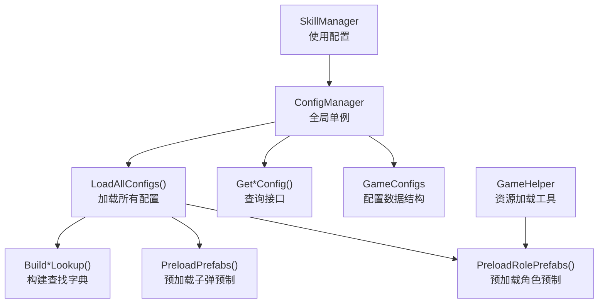
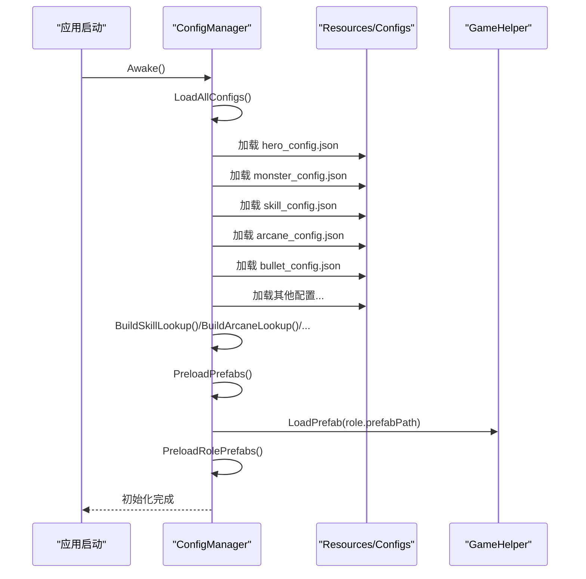
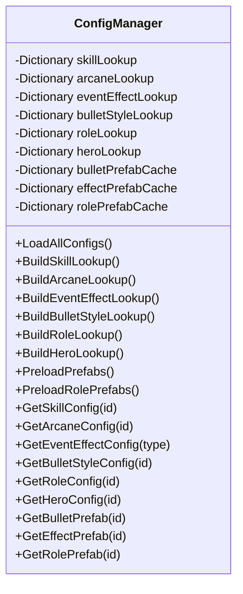
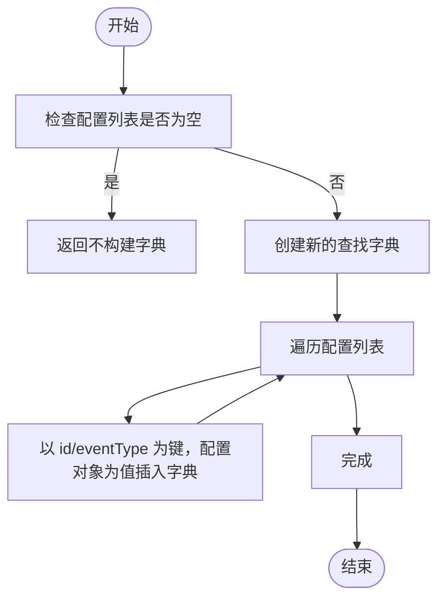
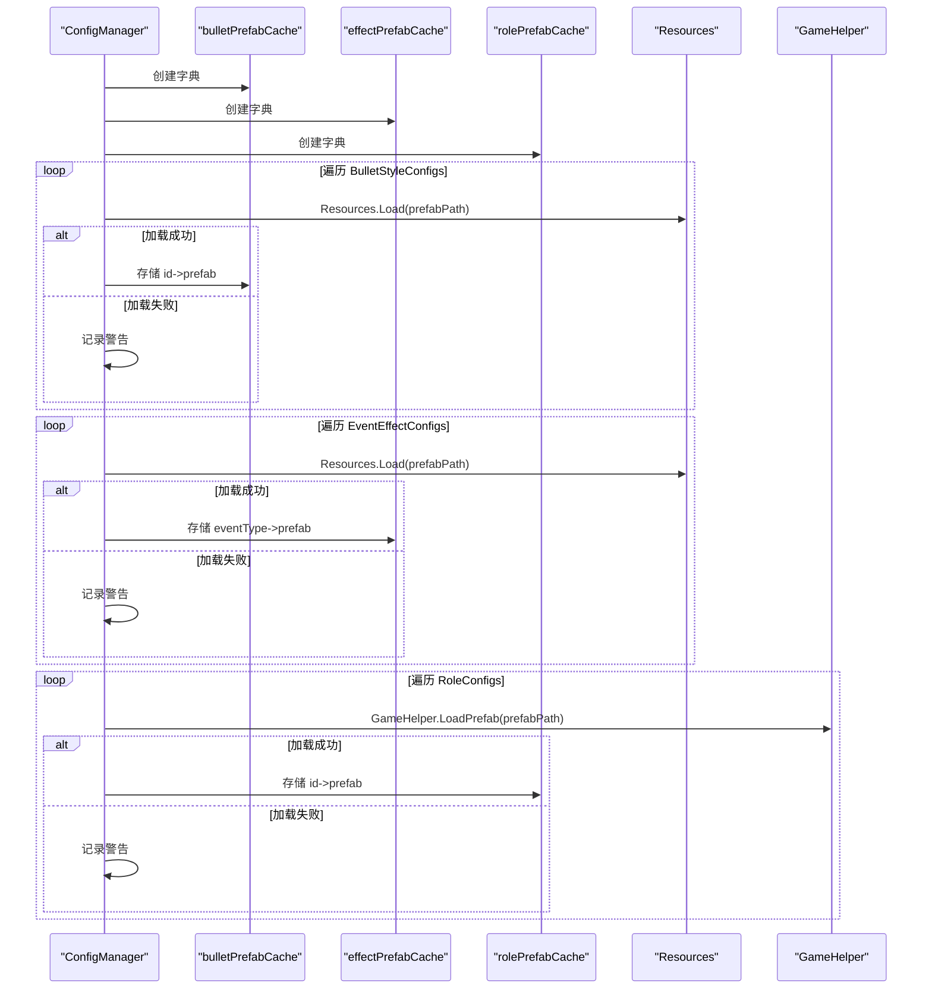
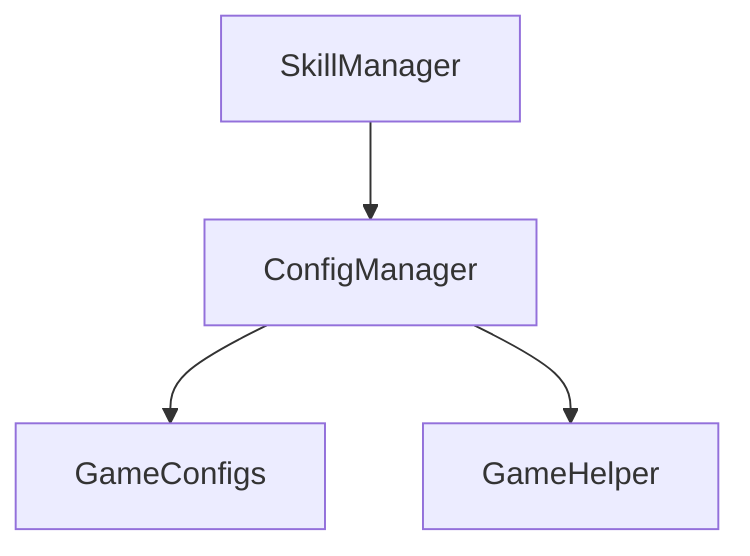

# 数据缓存策略

<cite>
**本文档引用的文件**
- [ConfigManager.cs](file://Assets/Scripts/Core/ConfigManager.cs)
- [GameHelper.cs](file://Assets/Scripts/Core/GameHelper.cs)
- [GameConfigs.cs](file://Assets/Scripts/Data/GameConfigs.cs)
- [skill_config.json](file://Assets/Resources/Configs/skill_config.json)
- [arcane_config.json](file://Assets/Resources/Configs/arcane_config.json)
- [SkillManager.cs](file://Assets/Scripts/Battle/SkillManager.cs)
</cite>

## 目录
1. [简介](#简介)
2. [项目结构](#项目结构)
3. [核心组件](#核心组件)
4. [架构总览](#架构总览)
5. [详细组件分析](#详细组件分析)
6. [依赖关系分析](#依赖关系分析)
7. [性能考量](#性能考量)
8. [故障排查指南](#故障排查指南)
9. [结论](#结论)
10. [附录](#附录)

## 简介
本文件针对 GeometryTD 的数据缓存策略进行系统化技术文档整理，重点围绕 ConfigManager 的查找字典设计与实现、Build*Lookup() 系列方法的构建逻辑、预加载机制（PreloadPrefabs、PreloadRolePrefabs）、缓存一致性与失效更新策略、内存优化方案以及性能监控与调试方法展开。同时结合具体配置文件与使用场景，给出可操作的优化建议与性能对比参考。

## 项目结构
ConfigManager 作为全局单例，负责加载各类 JSON 配置、构建查找字典、预加载预制体，并提供统一查询接口。GameHelper 提供跨资源路径的资源加载能力；GameConfigs 定义了所有配置数据结构；战斗模块通过 ConfigManager 获取配置信息。

图表来源
- [ConfigManager.cs:65-122](file://Assets/Scripts/Core/ConfigManager.cs#L65-L122)
- [GameHelper.cs:31-47](file://Assets/Scripts/Core/GameHelper.cs#L31-L47)
- [GameConfigs.cs:318-425](file://Assets/Scripts/Data/GameConfigs.cs#L318-L425)
- [SkillManager.cs:48-70](file://Assets/Scripts/Battle/SkillManager.cs#L48-L70)

章节来源
- [ConfigManager.cs:65-122](file://Assets/Scripts/Core/ConfigManager.cs#L65-L122)
- [GameHelper.cs:31-47](file://Assets/Scripts/Core/GameHelper.cs#L31-L47)
- [GameConfigs.cs:318-425](file://Assets/Scripts/Data/GameConfigs.cs#L318-L425)
- [SkillManager.cs:48-70](file://Assets/Scripts/Battle/SkillManager.cs#L48-L70)

## 核心组件
- ConfigManager：负责配置加载、字典构建、预制体预加载与查询接口。
- GameHelper：提供 Resources 优先、Editor 回退的资源加载能力。
- GameConfigs：定义所有配置数据结构（如 HeroConfig、MonsterConfig、SkillConfig、ArcaneConfig、BulletStyleConfig 等）。
- 使用方：战斗系统（如 SkillManager）通过 ConfigManager 获取配置。

章节来源
- [ConfigManager.cs:6-64](file://Assets/Scripts/Core/ConfigManager.cs#L6-L64)
- [GameHelper.cs:9-47](file://Assets/Scripts/Core/GameHelper.cs#L9-L47)
- [GameConfigs.cs:318-425](file://Assets/Scripts/Data/GameConfigs.cs#L318-L425)
- [SkillManager.cs:48-70](file://Assets/Scripts/Battle/SkillManager.cs#L48-L70)

## 架构总览
ConfigManager 在启动阶段完成以下流程：
1) 从 Resources 加载各配置 JSON；
2) 将列表数据转换为高效查找字典；
3) 预加载子弹与特效预制体到缓存；
4) 提供 O(1) 查找接口与缓存命中快速返回。

图表来源
- [ConfigManager.cs:77-122](file://Assets/Scripts/Core/ConfigManager.cs#L77-L122)
- [ConfigManager.cs:169-198](file://Assets/Scripts/Core/ConfigManager.cs#L169-L198)
- [ConfigManager.cs:357-370](file://Assets/Scripts/Core/ConfigManager.cs#L357-L370)
- [GameHelper.cs:31-47](file://Assets/Scripts/Core/GameHelper.cs#L31-L47)

## 详细组件分析

### 查找字典设计与实现（skillLookup、monsterLookup、arcaneLookup 等）
- 字段组织：ConfigManager 维护多组私有字典，键为配置项的唯一标识（如 id、eventType），值为对应配置对象。
- 构建过程：LoadAllConfigs() 后调用一系列 Build*Lookup() 方法，遍历原始列表，将每个元素按键插入字典。
- 访问模式：Get*Config() 方法通过 TryGetValue 实现 O(1) 快速查询；若未命中则返回空或记录错误日志。

图表来源
- [ConfigManager.cs:37-64](file://Assets/Scripts/Core/ConfigManager.cs#L37-L64)
- [ConfigManager.cs:124-139](file://Assets/Scripts/Core/ConfigManager.cs#L124-L139)
- [ConfigManager.cs:258-272](file://Assets/Scripts/Core/ConfigManager.cs#L258-L272)
- [ConfigManager.cs:285-291](file://Assets/Scripts/Core/ConfigManager.cs#L285-L291)
- [ConfigManager.cs:148-160](file://Assets/Scripts/Core/ConfigManager.cs#L148-L160)
- [ConfigManager.cs:350-355](file://Assets/Scripts/Core/ConfigManager.cs#L350-L355)

章节来源
- [ConfigManager.cs:37-64](file://Assets/Scripts/Core/ConfigManager.cs#L37-L64)
- [ConfigManager.cs:124-139](file://Assets/Scripts/Core/ConfigManager.cs#L124-L139)
- [ConfigManager.cs:258-272](file://Assets/Scripts/Core/ConfigManager.cs#L258-L272)
- [ConfigManager.cs:285-291](file://Assets/Scripts/Core/ConfigManager.cs#L285-L291)
- [ConfigManager.cs:148-160](file://Assets/Scripts/Core/ConfigManager.cs#L148-L160)
- [ConfigManager.cs:350-355](file://Assets/Scripts/Core/ConfigManager.cs#L350-L355)

### Build*Lookup() 系列方法工作原理
- 输入：原始配置列表（如 SkillConfigs、ArcaneConfigs 等）。
- 处理：创建新字典实例，遍历列表，以 id 或 eventType 作为键，配置对象作为值存入字典。
- 输出：各 Lookup 字典，用于后续 O(1) 查询。

图表来源
- [ConfigManager.cs:124-130](file://Assets/Scripts/Core/ConfigManager.cs#L124-L130)
- [ConfigManager.cs:258-264](file://Assets/Scripts/Core/ConfigManager.cs#L258-L264)
- [ConfigManager.cs:285-291](file://Assets/Scripts/Core/ConfigManager.cs#L285-L291)

章节来源
- [ConfigManager.cs:124-130](file://Assets/Scripts/Core/ConfigManager.cs#L124-L130)
- [ConfigManager.cs:258-264](file://Assets/Scripts/Core/ConfigManager.cs#L258-L264)
- [ConfigManager.cs:285-291](file://Assets/Scripts/Core/ConfigManager.cs#L285-L291)

### 预加载机制：PreloadPrefabs() 与 PreloadRolePrefabs()
- 目标：在运行前将常用预制体加载到内存缓存，避免首次使用时的 IO 与 Instantiate 开销。
- 实现：
  - PreloadPrefabs：遍历 BulletStyleConfigs，根据 prefabPath 从 Resources 加载子弹预制，存入 bulletPrefabCache；同时遍历 EventEffectConfigs，加载特效预制到 effectPrefabCache。
  - PreloadRolePrefabs：遍历 RoleConfigs，使用 GameHelper.LoadPrefab 加载角色预制到 rolePrefabCache。
- 命中策略：GetBulletPrefab/GetEffectPrefab/GetRolePrefab 通过字典快速返回已缓存的 GameObject。

图表来源
- [ConfigManager.cs:169-198](file://Assets/Scripts/Core/ConfigManager.cs#L169-L198)
- [ConfigManager.cs:357-370](file://Assets/Scripts/Core/ConfigManager.cs#L357-L370)
- [GameHelper.cs:31-47](file://Assets/Scripts/Core/GameHelper.cs#L31-L47)

章节来源
- [ConfigManager.cs:169-198](file://Assets/Scripts/Core/ConfigManager.cs#L169-L198)
- [ConfigManager.cs:357-370](file://Assets/Scripts/Core/ConfigManager.cs#L357-L370)
- [GameHelper.cs:31-47](file://Assets/Scripts/Core/GameHelper.cs#L31-L47)

### 缓存失效与更新策略
- 当前实现：ConfigManager 在 Awake 中一次性加载并构建字典与缓存，生命周期内不主动刷新。
- 建议策略：
  - 配置热更新：提供 ReloadAllConfigs() 接口，重新加载 JSON、重建字典、清空并重新预加载缓存；调用方需确保切换场景或重置状态。
  - 增量更新：仅对变更的键执行 Remove/Insert，避免全量重建。
  - 一致性保障：在切换场景或进入战斗前，统一调用一次查询接口触发缓存预热，确保后续访问稳定。

章节来源
- [ConfigManager.cs:65-75](file://Assets/Scripts/Core/ConfigManager.cs#L65-L75)
- [ConfigManager.cs:77-122](file://Assets/Scripts/Core/ConfigManager.cs#L77-L122)

### 内存使用优化方案
- 字典容量规划：根据配置条目数量预留初始容量，减少扩容开销（可在构建字典时传入 capacity）。
- 缓存粒度控制：仅缓存高频使用的预制体（如子弹、特效、角色），避免缓存过多稀有资源导致内存压力。
- 引用释放：场景切换时可选择性清空缓存字典，配合 Resources.UnloadUnusedAssets 进行垃圾回收。
- 字符串路径校验：prefabPath 为空或无效时跳过加载，减少无效缓存占用。

章节来源
- [ConfigManager.cs:169-198](file://Assets/Scripts/Core/ConfigManager.cs#L169-L198)
- [ConfigManager.cs:357-370](file://Assets/Scripts/Core/ConfigManager.cs#L357-L370)

### 性能监控与调试
- 日志告警：加载失败或查询不到配置时输出警告/错误日志，便于定位问题。
- 预加载验证：在进入战斗或 UI 打开时，先尝试 GetBulletPrefab/GetEffectPrefab/GetRolePrefab，观察是否有延迟。
- 性能对比建议：
  - 无缓存：首次查询触发 Resources.Load，存在 IO 与 Instantiate 开销。
  - 有缓存：首次查询后缓存命中，后续 O(1) 访问，显著降低帧时间波动。
- 建议指标：统计 Get*Config 与 Get*Prefab 的平均耗时、缓存命中率、内存峰值。

章节来源
- [ConfigManager.cs:169-198](file://Assets/Scripts/Core/ConfigManager.cs#L169-L198)
- [ConfigManager.cs:357-370](file://Assets/Scripts/Core/ConfigManager.cs#L357-L370)

## 依赖关系分析
- ConfigManager 依赖 GameConfigs 的数据结构定义。
- 预加载依赖 GameHelper 的资源加载能力。
- 使用方（如 SkillManager）通过 ConfigManager 的查询接口获取配置。

图表来源
- [ConfigManager.cs:6-64](file://Assets/Scripts/Core/ConfigManager.cs#L6-L64)
- [GameConfigs.cs:318-425](file://Assets/Scripts/Data/GameConfigs.cs#L318-L425)
- [GameHelper.cs:31-47](file://Assets/Scripts/Core/GameHelper.cs#L31-L47)
- [SkillManager.cs:48-70](file://Assets/Scripts/Battle/SkillManager.cs#L48-L70)

章节来源
- [ConfigManager.cs:6-64](file://Assets/Scripts/Core/ConfigManager.cs#L6-L64)
- [GameConfigs.cs:318-425](file://Assets/Scripts/Data/GameConfigs.cs#L318-L425)
- [GameHelper.cs:31-47](file://Assets/Scripts/Core/GameHelper.cs#L31-L47)
- [SkillManager.cs:48-70](file://Assets/Scripts/Battle/SkillManager.cs#L48-L70)

## 性能考量
- 时间复杂度：
  - 构建字典：O(n)，n 为配置条目数。
  - 查询字典：O(1) 平均。
  - 预加载：O(m)（m 为预制体数量）。
- 空间复杂度：O(n)（字典）+ O(m)（预制体缓存）。
- 优化建议：
  - 预加载阶段批量加载，避免分散 IO。
  - 对大体积资源采用异步加载或延迟加载策略。
  - 场景切换时清理缓存并触发 GC。

## 故障排查指南
- 配置文件缺失：LoadConfig 返回默认值并记录错误日志，检查 Resources/Configs 下是否存在对应 JSON。
- 解析失败：JsonUtility.FromJson 失败时记录错误，检查 JSON 格式与字段命名。
- 预制体加载失败：Resources.Load 或 GameHelper.LoadPrefab 返回空，检查 prefabPath 是否正确。
- 查询不到配置：TryGetValue 未命中，确认键值（id/eventType）是否与配置一致。

章节来源
- [ConfigManager.cs:200-215](file://Assets/Scripts/Core/ConfigManager.cs#L200-L215)
- [ConfigManager.cs:169-198](file://Assets/Scripts/Core/ConfigManager.cs#L169-L198)
- [ConfigManager.cs:357-370](file://Assets/Scripts/Core/ConfigManager.cs#L357-L370)

## 结论
ConfigManager 通过“列表转字典 + 预加载缓存”的组合策略，在保证查询效率的同时降低了运行时 IO 压力。建议在热更新与内存管理方面进一步完善，以提升长期可维护性与稳定性。

## 附录
- 配置示例参考：
  - 技能配置样例：[skill_config.json:1-200](file://Assets/Resources/Configs/skill_config.json#L1-L200)
  - 奥术配置样例：[arcane_config.json:1-6](file://Assets/Resources/Configs/arcane_config.json#L1-L6)
- 使用示例参考：
  - 技能槽初始化使用配置池 ID：[SkillManager.cs:48-70](file://Assets/Scripts/Battle/SkillManager.cs#L48-L70)