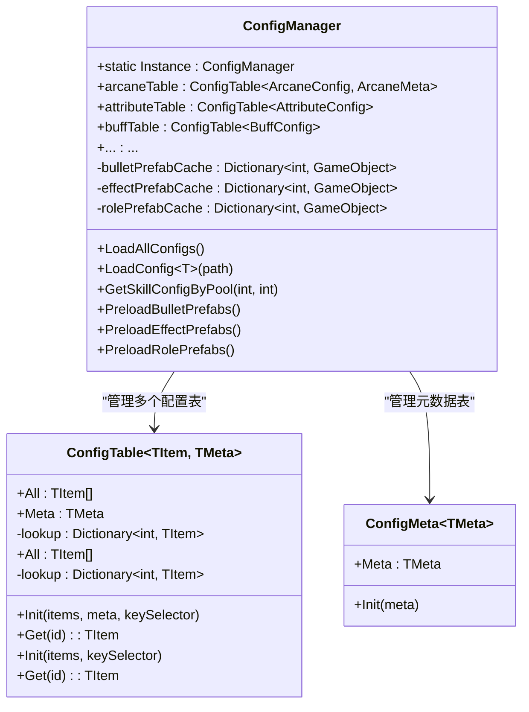
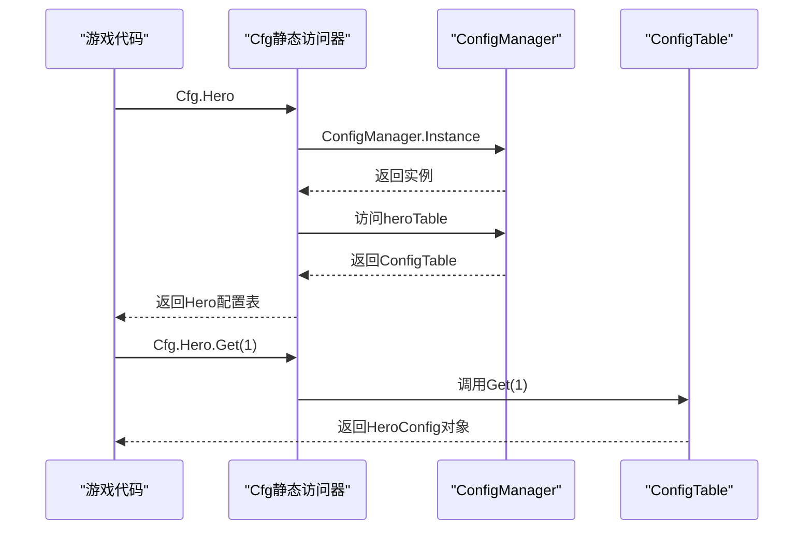
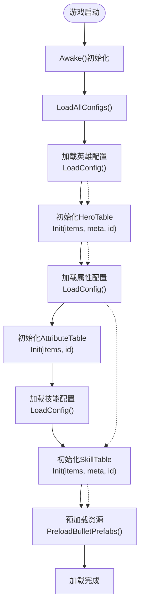
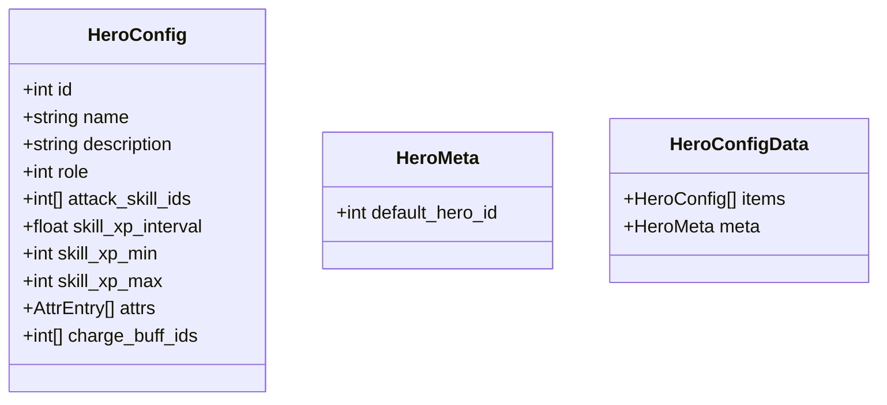
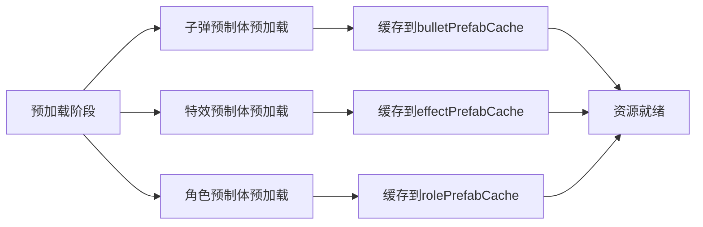
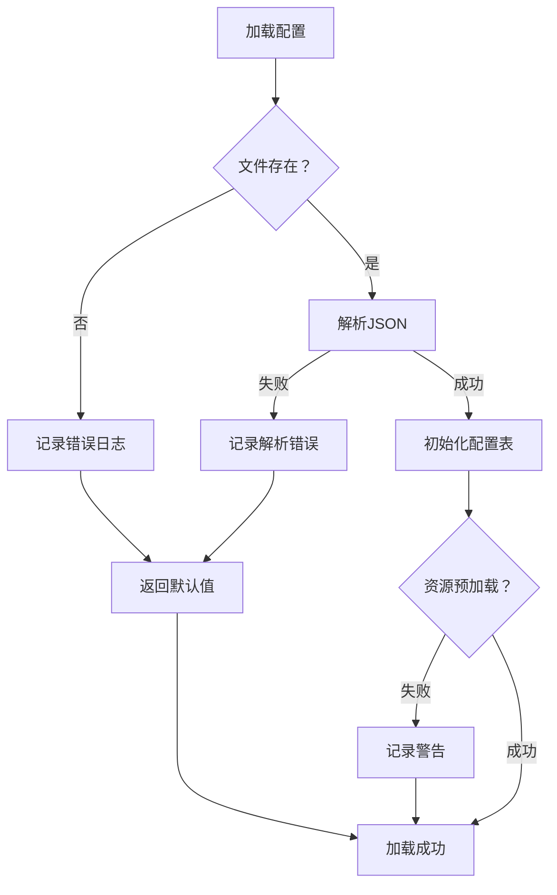

# 配置加载机制

<cite>
**本文档引用的文件**
- [ConfigManager.cs](file://Assets/Scripts/Core/ConfigManager.cs)
- [ConfigTable.cs](file://Assets/Scripts/Core/ConfigTable.cs)
- [Cfg.cs](file://Assets/Scripts/Core/Cfg.cs)
- [HeroConfig.cs](file://Assets/Scripts/Data/Configs/HeroConfig.cs)
- [AttributeConfig.cs](file://Assets/Scripts/Data/Configs/AttributeConfig.cs)
- [hero_config.json](file://Assets/Resources/Configs/hero_config.json)
</cite>

## 目录
1. [简介](#简介)
2. [自动化生成框架概述](#自动化生成框架概述)
3. [核心组件架构](#核心组件架构)
4. [ConfigTable通用配置表抽象](#configtable通用配置表抽象)
5. [Cfg静态访问器设计](#cfg静态访问器设计)
6. [配置加载流程详解](#配置加载流程详解)
7. [数据模型与JSON结构](#数据模型与json结构)
8. [资源加载与预加载机制](#资源加载与预加载机制)
9. [异常处理与错误恢复](#异常处理与错误恢复)
10. [扩展新配置类型的流程](#扩展新配置类型的流程)
11. [性能优化与最佳实践](#性能优化与最佳实践)
12. [故障排查指南](#故障排查指南)
13. [总结](#总结)

## 简介

GeometryTD项目已从传统的手动配置加载机制升级为高度自动化的生成框架。新的配置加载机制通过Python脚本自动生成C#代码和JSON配置文件，实现了配置系统的完全自动化和强类型化管理。本文档详细阐述了ConfigManager、ConfigTable和Cfg三个核心组件的工作原理，以及整个配置加载体系的架构设计和使用方法。

## 自动化生成框架概述

新的配置加载机制采用"生成器驱动"的方式，通过config_gen.py脚本自动生成所有配置相关的代码和数据文件：

```mermaid
graph TB
subgraph "生成器阶段"
GEN["config_gen.py<br/>配置生成器"]
DATA["Excel/原始数据<br/>配置数据源"]
END
subgraph "自动生成代码"
CFGCS["Cfg.cs<br/>静态访问器"]
CMCS["ConfigManager.cs<br/>配置管理器"]
CTCS["ConfigTable.cs<br/>配置表抽象"]
END
subgraph "自动生成数据"
JSON["*.json<br/>配置数据文件"]
END
subgraph "运行时使用"
RUNTIME["游戏运行时"]
ACCESS["Cfg静态访问器"]
END
GEN --> CFGCS
GEN --> CMCS
GEN --> CTCS
DATA --> GEN
GEN --> JSON
CFGCS --> ACCESS
ACCESS --> RUNTIME
```

**图表来源**
- [config_gen.py:292-526](file://Tools/config_gen.py#L292-L526)

**章节来源**
- [config_gen.py:292-526](file://Tools/config_gen.py#L292-L526)

## 核心组件架构

### ConfigManager单例管理器

ConfigManager作为配置系统的中央控制器，负责所有配置的加载、初始化和资源预加载：



**图表来源**
- [ConfigManager.cs:11-306](file://Assets/Scripts/Core/ConfigManager.cs#L11-L306)
- [ConfigTable.cs:11-73](file://Assets/Scripts/Core/ConfigTable.cs#L11-L73)

**章节来源**
- [ConfigManager.cs:11-306](file://Assets/Scripts/Core/ConfigManager.cs#L11-L306)
- [ConfigTable.cs:11-73](file://Assets/Scripts/Core/ConfigTable.cs#L11-L73)

## ConfigTable通用配置表抽象

ConfigTable提供了统一的配置表管理抽象，支持两种模式：

### 双参数泛型配置表（带元数据）

用于需要同时管理配置列表和元数据的场景，如英雄配置、怪物配置等：

```csharp
public class ConfigTable<TItem, TMeta> {
    public List<TItem> All { get; private set; }
    public TMeta Meta { get; private set; }
    private Dictionary<int, TItem> lookup;
    
    public void Init(List<TItem> items, TMeta meta, Func<TItem, int> keySelector)
    public TItem Get(int id)
}
```

### 单参数泛型配置表（纯列表）

用于只需要配置列表的场景，如Buff、技能等：

```csharp
public class ConfigTable<TItem> {
    public List<TItem> All { get; private set; }
    private Dictionary<int, TItem> lookup;
    
    public void Init(List<TItem> items, Func<TItem, int> keySelector)
    public TItem Get(int id)
}
```

### 元数据配置表

专门用于管理全局配置信息，如游戏全局设置：

```csharp
public class ConfigMeta<TMeta> {
    public TMeta Meta { get; private set; }
    public void Init(TMeta meta)
}
```

**章节来源**
- [ConfigTable.cs:11-73](file://Assets/Scripts/Core/ConfigTable.cs#L11-L73)

## Cfg静态访问器设计

Cfg类提供了统一的静态访问入口，通过属性访问器将ConfigManager的配置表暴露给游戏其他部分：



**图表来源**
- [Cfg.cs:7-35](file://Assets/Scripts/Core/Cfg.cs#L7-L35)

**章节来源**
- [Cfg.cs:7-35](file://Assets/Scripts/Core/Cfg.cs#L7-L35)

## 配置加载流程详解

### 自动化加载流程

新的ConfigManager采用完全自动化的加载流程，每个配置的加载都遵循相同的模式：



**图表来源**
- [ConfigManager.cs:56-177](file://Assets/Scripts/Core/ConfigManager.cs#L56-L177)

### 加载顺序与依赖关系

配置加载严格按照依赖关系进行，确保数据完整性：

1. **全局配置**：global_config.json（元数据）
2. **基础配置**：attribute_config.json、role_config.json
3. **角色配置**：hero_config.json、monster_config.json
4. **技能配置**：skill_config.json、skill_pool_config.json
5. **战斗配置**：bullet_style_config.json、buff_config.json
6. **事件配置**：event_config.json、bullet_event_config.json
7. **剧情配置**：story_collection_config.json、story_node_config.json

**章节来源**
- [ConfigManager.cs:56-177](file://Assets/Scripts/Core/ConfigManager.cs#L56-L177)

## 数据模型与JSON结构

### 自动生成的数据模型

每个配置类型都包含三个自动生成的类：

1. **配置类**：包含实际的游戏数据
2. **元数据类**：包含配置的元信息
3. **数据容器类**：包含items和meta字段的包装类

以Hero配置为例：



**图表来源**
- [HeroConfig.cs:10-38](file://Assets/Scripts/Data/Configs/HeroConfig.cs#L10-L38)

### JSON配置文件结构

每个JSON文件都遵循统一的结构模式：

```json
{
  "items": [
    {
      "id": 1,
      "name": "英雄名称",
      "description": "英雄描述",
      "role": 1,
      "attack_skill_ids": [1001],
      "skill_xp_interval": 0.5,
      "skill_xp_min": 1,
      "skill_xp_max": 10,
      "attrs": [
        {"id": 1, "value": 5000},
        {"id": 2, "value": 10}
      ],
      "charge_buff_ids": [3021]
    }
  ],
  "meta": {
    "default_hero_id": 1
  }
}
```

**章节来源**
- [HeroConfig.cs:10-38](file://Assets/Scripts/Data/Configs/HeroConfig.cs#L10-L38)
- [hero_config.json:1-97](file://Assets/Resources/Configs/hero_config.json#L1-L97)

## 资源加载与预加载机制

### 预加载策略

ConfigManager在配置加载完成后，会自动预加载所有相关的游戏资源：



**图表来源**
- [ConfigManager.cs:255-298](file://Assets/Scripts/Core/ConfigManager.cs#L255-L298)

### 预加载实现细节

1. **子弹预制体预加载**：遍历所有子弹样式配置，根据prefabPath加载对应的GameObject
2. **特效预制体预加载**：遍历所有事件特效配置，根据prefabPath加载对应的GameObject  
3. **角色预制体预加载**：遍历所有角色配置，使用GameHelper.LoadPrefab加载预制体

**章节来源**
- [ConfigManager.cs:255-298](file://Assets/Scripts/Core/ConfigManager.cs#L255-L298)

## 异常处理与错误恢复

### 错误处理策略

ConfigManager采用了多层次的错误处理机制：



**图表来源**
- [ConfigManager.cs:179-194](file://Assets/Scripts/Core/ConfigManager.cs#L179-L194)

### 错误恢复机制

1. **文件加载失败**：记录错误日志并返回默认值，不影响其他配置的加载
2. **JSON解析失败**：记录错误日志并返回默认值
3. **资源预加载失败**：记录警告日志，继续执行其他预加载任务

**章节来源**
- [ConfigManager.cs:179-194](file://Assets/Scripts/Core/ConfigManager.cs#L179-L194)

## 扩展新配置类型的流程

### 使用config_gen.py扩展新配置

要添加新的配置类型，需要：

1. **准备数据源**：在Excel中定义新的配置数据结构
2. **运行生成器**：执行config_gen.py生成代码和JSON文件
3. **集成到ConfigManager**：在LoadAllConfigs()中添加新配置的加载逻辑
4. **测试验证**：验证新配置的加载和使用

### 手动添加自定义方法

ConfigManager保留了USER CODE区域，可以在其中添加自定义功能：

```csharp
// USER CODE START - CustomMethods
public GameObject GetBulletPrefab(int styleId)
{
    if (bulletPrefabCache != null && bulletPrefabCache.TryGetValue(styleId, out var prefab))
        return prefab;
    return null;
}
// USER CODE END - CustomMethods
```

**章节来源**
- [ConfigManager.cs:39-46](file://Assets/Scripts/Core/ConfigManager.cs#L39-L46)
- [ConfigManager.cs:196-303](file://Assets/Scripts/Core/ConfigManager.cs#L196-L303)

## 性能优化与最佳实践

### 查询性能优化

ConfigTable通过哈希表实现O(1)的查询性能：

```csharp
private Dictionary<int, TItem> lookup;

public TItem Get(int id)
{
    if (lookup != null && lookup.TryGetValue(id, out var item))
        return item;
    return default(TItem);
}
```

### 内存使用优化

1. **延迟初始化**：配置表只在需要时才初始化
2. **资源缓存**：预加载的资源存储在字典中，避免重复加载
3. **数据压缩**：JSON文件采用紧凑格式存储

### 加载性能优化

1. **批量加载**：所有配置在启动时一次性加载
2. **异步加载**：可考虑将资源加载改为异步方式
3. **缓存策略**：合理利用Unity的Resources缓存机制

## 故障排查指南

### 常见问题及解决方案

#### 配置加载失败

**症状**：配置表为空或包含默认值
**排查步骤**：
1. 检查JSON文件格式是否正确
2. 验证字段名称与数据模型是否匹配
3. 确认Resources目录中存在对应的JSON文件

#### 查询结果为null

**症状**：Cfg.Hero.Get(1)返回null
**排查步骤**：
1. 检查配置文件中是否存在id为1的条目
2. 验证配置表是否正确初始化
3. 确认查询的键值是否正确

#### 资源加载失败

**症状**：子弹或角色预制体无法加载
**排查步骤**：
1. 检查prefabPath路径是否正确
2. 验证预制体是否正确导入到Unity中
3. 确认Resources目录结构是否正确

**章节来源**
- [ConfigManager.cs:179-194](file://Assets/Scripts/Core/ConfigManager.cs#L179-L194)

## 总结

GeometryTD的新配置加载机制通过自动化生成框架实现了配置系统的完全模块化和强类型化管理。ConfigManager、ConfigTable和Cfg三个核心组件协同工作，提供了高效、可靠、易扩展的配置管理方案。

主要优势包括：
- **自动化程度高**：通过Python脚本自动生成所有配置相关代码
- **类型安全**：编译时检查配置数据的类型正确性
- **性能优异**：哈希表查询实现O(1)性能
- **易于扩展**：支持动态添加新的配置类型
- **错误处理完善**：多层错误处理确保系统稳定性

这套机制为GeometryTD项目提供了一个强大而灵活的配置管理基础设施，支持游戏开发过程中的各种配置需求。