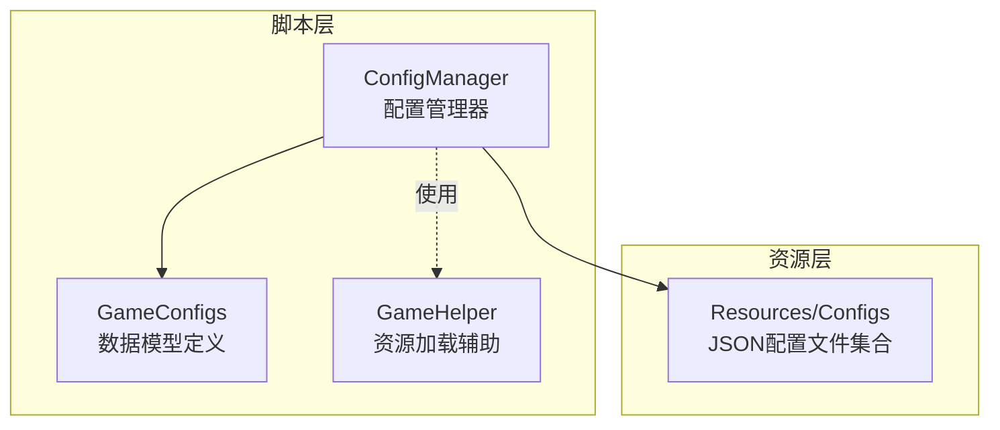
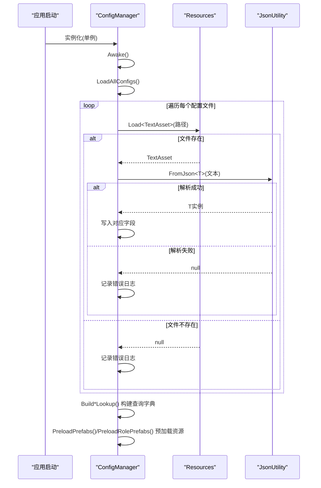
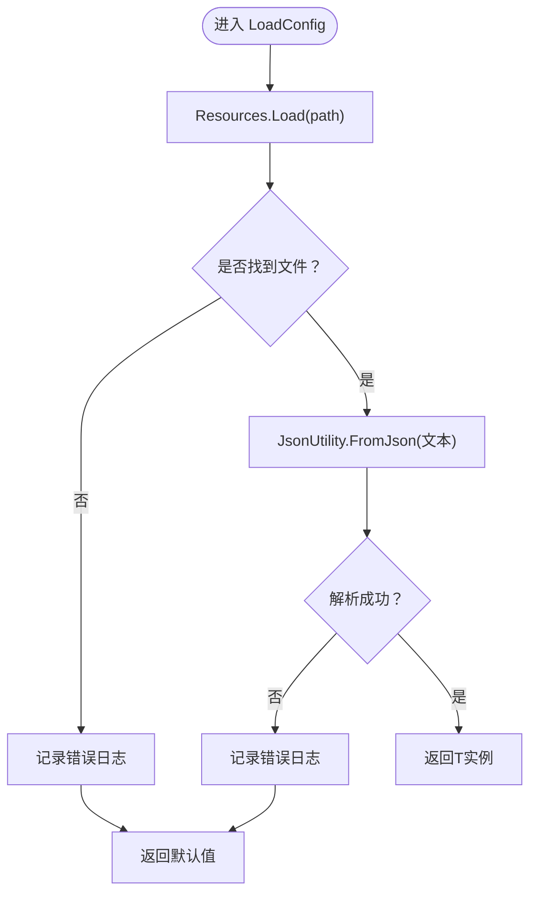
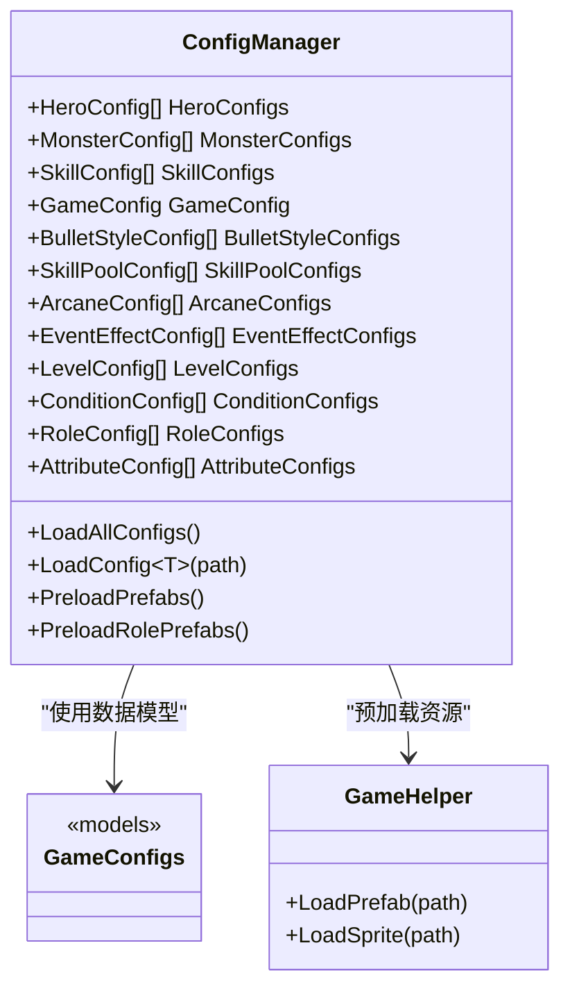

# 配置加载机制

<cite>
**本文档引用的文件**
- [ConfigManager.cs](file://Assets/Scripts/Core/ConfigManager.cs)
- [GameConfigs.cs](file://Assets/Scripts/Data/GameConfigs.cs)
- [GameHelper.cs](file://Assets/Scripts/Core/GameHelper.cs)
- [game_config.json](file://Assets/Resources/Configs/game_config.json)
- [hero_config.json](file://Assets/Resources/Configs/hero_config.json)
- [monster_config.json](file://Assets/Resources/Configs/monster_config.json)
- [skill_config.json](file://Assets/Resources/Configs/skill_config.json)
- [bullet_config.json](file://Assets/Resources/Configs/bullet_config.json)
- [event_config.json](file://Assets/Resources/Configs/event_config.json)
- [bullet_event_config.json](file://Assets/Resources/Configs/bullet_event_config.json)
- [level_config.json](file://Assets/Resources/Configs/level_config.json)
- [condition_config.json](file://Assets/Resources/Configs/condition_config.json)
- [role_config.json](file://Assets/Resources/Configs/role_config.json)
</cite>

## 目录
1. [简介](#简介)
2. [项目结构](#项目结构)
3. [核心组件](#核心组件)
4. [架构总览](#架构总览)
5. [详细组件分析](#详细组件分析)
6. [依赖关系分析](#依赖关系分析)
7. [性能考量](#性能考量)
8. [故障排查指南](#故障排查指南)
9. [结论](#结论)
10. [附录](#附录)

## 简介
本文件面向GeometryTD项目的配置加载机制，重点围绕ConfigManager的配置加载流程展开，详细解释以下内容：
- LoadAllConfigs()如何遍历并加载所有配置文件
- LoadConfig<T>()泛型方法的实现与JSON解析流程
- Resources.Load<TextAsset>()的使用方式与路径约定
- 配置加载顺序与依赖关系（为何某些配置必须先于其他配置加载）
- 异常处理策略（文件不存在、JSON解析失败等）
- 配置文件命名规范与路径组织最佳实践
- 如何正确加载自定义配置文件的示例路径

## 项目结构
配置相关的核心文件位于Assets/Scripts/Core与Assets/Resources/Configs目录中：
- ConfigManager：全局配置管理器，负责加载、缓存与查询各类配置
- GameConfigs：定义所有配置的数据模型（类、列表包装类、枚举与常量）
- GameHelper：提供资源加载辅助方法（含Editor回退逻辑）
- Resources/Configs：存放所有JSON配置文件

图表来源
- [ConfigManager.cs:77-122](file://Assets/Scripts/Core/ConfigManager.cs#L77-L122)
- [GameConfigs.cs:1-775](file://Assets/Scripts/Data/GameConfigs.cs#L1-L775)
- [GameHelper.cs:31-47](file://Assets/Scripts/Core/GameHelper.cs#L31-L47)

章节来源
- [ConfigManager.cs:77-122](file://Assets/Scripts/Core/ConfigManager.cs#L77-L122)
- [GameConfigs.cs:1-775](file://Assets/Scripts/Data/GameConfigs.cs#L1-L775)

## 核心组件
- ConfigManager
  - 单例生命周期：Awake中初始化并调用LoadAllConfigs()
  - 成员字段：保存各类配置列表与查询字典
  - 方法：
    - LoadAllConfigs()：按固定顺序加载所有配置
    - LoadConfig<T>()：泛型加载与JSON解析
    - Build*Lookup()：构建各配置的ID到对象的字典索引
    - PreloadPrefabs()/PreloadRolePrefabs()：预加载子弹与角色预制体
- GameConfigs
  - 定义所有配置的数据结构（如HeroConfig、MonsterConfig、SkillConfig等）
  - 定义配置列表包装类（如HeroConfigList、MonsterConfigList等）
  - 定义事件类型、子弹事件类型、Buff特殊事件等常量与枚举
- GameHelper
  - 提供Resources.Load<GameObject>/Resources.Load<Sprite>的辅助
  - 在Unity编辑器下提供基于资产路径的回退加载

章节来源
- [ConfigManager.cs:6-122](file://Assets/Scripts/Core/ConfigManager.cs#L6-L122)
- [GameConfigs.cs:87-775](file://Assets/Scripts/Data/GameConfigs.cs#L87-L775)
- [GameHelper.cs:13-47](file://Assets/Scripts/Core/GameHelper.cs#L13-L47)

## 架构总览
ConfigManager在启动阶段集中加载所有配置，随后构建查询索引并预加载必要的资源。整体流程如下：

图表来源
- [ConfigManager.cs:65-122](file://Assets/Scripts/Core/ConfigManager.cs#L65-L122)
- [ConfigManager.cs:200-215](file://Assets/Scripts/Core/ConfigManager.cs#L200-L215)

## 详细组件分析

### ConfigManager.LoadAllConfigs() 工作原理
- 调用顺序严格遵循依赖关系：
  - 先加载基础配置：game_config.json
  - 再加载角色、怪物、技能、子弹样式等基础数据
  - 再加载事件、子弹事件、Buff、被动等扩展系统配置
  - 最后加载故事收集、节点、对话、选项组、被动效果、商店等剧情系统配置
- 每个配置加载后，立即构建对应的ID查询字典（如BuildSkillLookup、BuildHeroLookup等），以便后续快速查询
- 预加载阶段：

```mermaid
flowchart TD
Start(["开始"]) --> LoadBase["加载基础配置<br/>game_config.json"]
LoadBase --> LoadRoles["加载角色配置<br/>role_config.json"]
LoadRoles --> LoadAttrs["加载属性元数据<br/>attribute_config.json"]
LoadAttrs --> LoadMonsters["加载怪物配置<br/>monster_config.json"]
LoadMonsters --> LoadSkills["加载技能配置<br/>skill_config.json"]
LoadSkills --> LoadSkillPools["加载技能池配置<br/>skill_pool_config.json"]
LoadSkillPools --> LoadArcanes["加载奥术配置<br/>arcane_config.json"]
LoadArcanes --> LoadBulletStyles["加载子弹样式<br/>bullet_config.json"]
LoadBulletStyles --> LoadEventEffects["加载事件特效<br/>event_effect_config.json"]
LoadEventEffects --> LoadLevels["加载关卡配置<br/>level_config.json"]
LoadLevels --> LoadConditions["加载条件配置<br/>condition_config.json"]
LoadConditions --> LoadStoryCollections["加载故事集配置<br/>story_collection_config.json"]
LoadStoryCollections --> LoadStoryNodes["加载故事节点配置<br/>story_node_config.json"]
LoadStoryNodes --> LoadDialogues["加载对话配置<br/>dialogue_config.json"]
LoadDialogues --> LoadChoiceGroups["加载选项组配置<br/>choice_option_config.json"]
LoadChoiceGroups --> LoadPassiveEffects["加载被动效果配置<br/>passive_effect_config.json"]
LoadPassiveEffects --> LoadEventShops["加载事件商店配置<br/>event_shop_config.json"]
LoadEventShops --> LoadEvents["加载事件配置<br/>event_config.json"]
LoadEvents --> LoadBulletEvents["加载子弹事件配置<br/>bullet_event_config.json"]
LoadBulletEvents --> LoadBuffs["加载Buff配置<br/>buff_config.json"]
LoadBuffs --> LoadPassives["加载被动配置<br/>passive_config.json"]
LoadPassives --> BuildLookups["构建查询字典"]
BuildLookups --> PreloadBullets["预加载子弹预制体"]
PreloadBullets --> PreloadRoles["预加载角色/特效预制体"]
PreloadRoles --> End(["完成"])
```

  - 子弹样式：根据bullet_config.json中的prefabPath，通过Resources.Load<GameObject>缓存
  - 角色与特效：通过GameHelper.LoadPrefab与Resources.Load<GameObject>缓存

图表来源
- [ConfigManager.cs:77-122](file://Assets/Scripts/Core/ConfigManager.cs#L77-L122)
- [ConfigManager.cs:169-198](file://Assets/Scripts/Core/ConfigManager.cs#L169-L198)
- [ConfigManager.cs:357-370](file://Assets/Scripts/Core/ConfigManager.cs#L357-L370)

章节来源
- [ConfigManager.cs:77-122](file://Assets/Scripts/Core/ConfigManager.cs#L77-L122)

### LoadConfig<T>() 泛型方法实现机制
- 输入参数：配置文件在Resources下的相对路径（不含扩展名）
- 执行步骤：
  1) Resources.Load<TextAsset>(path)读取文本资源
  2) 若返回null，记录错误日志并返回默认值
  3) 使用JsonUtility.FromJson<T>(textAsset.text)进行反序列化
  4) 若返回null，记录错误日志并返回默认值
  5) 返回解析后的T实例
- 适用场景：所有以“Configs/文件名”为路径的JSON配置文件

图表来源
- [ConfigManager.cs:200-215](file://Assets/Scripts/Core/ConfigManager.cs#L200-L215)

章节来源
- [ConfigManager.cs:200-215](file://Assets/Scripts/Core/ConfigManager.cs#L200-L215)

### Resources.Load<TextAsset>() 的使用方式与路径约定
- 路径约定：
  - 所有配置文件位于Assets/Resources/Configs目录
  - LoadConfig<T>()传入的path为"Configs/文件名"（不含.json扩展名）
  - 示例：LoadConfig<GameConfig>("Configs/game_config")
- 预制体加载：
  - 子弹预制体：通过Resources.Load<GameObject>(prefabPath)加载
  - 角色与特效：通过GameHelper.LoadPrefab(prefabPath)加载（内部同样优先Resources，再回退到AssetDatabase）

章节来源
- [ConfigManager.cs:200-215](file://Assets/Scripts/Core/ConfigManager.cs#L200-L215)
- [ConfigManager.cs:169-198](file://Assets/Scripts/Core/ConfigManager.cs#L169-L198)
- [ConfigManager.cs:357-370](file://Assets/Scripts/Core/ConfigManager.cs#L357-L370)
- [GameHelper.cs:31-47](file://Assets/Scripts/Core/GameHelper.cs#L31-L47)

### 配置加载顺序与依赖关系
- 必须先加载的基础配置：
  - game_config.json：包含默认英雄ID、技能槽位、奥术槽位等全局设置
  - role_config.json：角色与怪物的预制体路径依赖
  - attribute_config.json：属性元数据用于属性系统
- 依赖构建：
  - 技能配置依赖子弹样式ID（bulletStyleId）
  - 怪物配置依赖角色ID（role）
  - 关卡配置依赖怪物ID、精英与Boss条目
  - 事件系统配置（Event/Buff/Passive）相互独立，但可被技能/子弹事件引用
- 顺序保证：
  - LoadAllConfigs()中明确的调用顺序确保上述依赖满足
  - 构建查询字典（Build*Lookup）在所有配置加载完成后执行

章节来源
- [ConfigManager.cs:77-122](file://Assets/Scripts/Core/ConfigManager.cs#L77-L122)
- [ConfigManager.cs:124-119](file://Assets/Scripts/Core/ConfigManager.cs#L124-L119)

### 异常处理机制
- 文件不存在：
  - Resources.Load<TextAsset>(path)返回null
  - 记录错误日志并返回默认值，避免中断流程
- JSON解析失败：
  - JsonUtility.FromJson<T>(text)返回null
  - 记录错误日志并返回默认值
- 预制体加载失败：
  - 子弹/角色/特效通过Resources.Load或GameHelper.LoadPrefab加载
  - 失败时记录警告日志，但不影响其他配置加载
- 查询缺失：
  - 各Build*Lookup()方法仅在配置列表非空时构建字典
  - 查询接口在找不到时记录错误或警告日志并返回null/默认值

章节来源
- [ConfigManager.cs:200-215](file://Assets/Scripts/Core/ConfigManager.cs#L200-L215)
- [ConfigManager.cs:169-198](file://Assets/Scripts/Core/ConfigManager.cs#L169-L198)
- [ConfigManager.cs:357-370](file://Assets/Scripts/Core/ConfigManager.cs#L357-L370)

### 配置文件命名规范与路径组织最佳实践
- 命名规范：
  - 使用小写英文与下划线，如hero_config.json、skill_config.json
  - 列表包装类的字段名与文件名保持一致，如heroes、skills、levels
- 路径组织：
  - 所有配置文件统一放置在Assets/Resources/Configs目录
  - LoadConfig<T>()的path参数为"Configs/文件名"（不含.json）
- 数据模型：
  - 每个配置文件对应一个类与一个列表包装类（如HeroConfig/ HeroConfigList）
  - 列表包装类字段名为复数形式（如roles、monsters、skills）
- 依赖声明：
  - 在配置中使用ID引用其他配置项（如bulletStyleId、role、events等）
  - 通过Build*Lookup()建立ID到对象的字典，便于O(1)查询

章节来源
- [GameConfigs.cs:87-775](file://Assets/Scripts/Data/GameConfigs.cs#L87-L775)
- [ConfigManager.cs:77-122](file://Assets/Scripts/Core/ConfigManager.cs#L77-L122)

### 如何正确加载自定义配置文件
- 步骤一：准备配置数据
  - 在Assets/Resources/Configs目录新增JSON文件，例如Configs/my_custom_config.json
  - 定义对应的类与列表包装类（如MyCustomConfig、MyCustomConfigList）
- 步骤二：在ConfigManager中添加加载逻辑
  - 在LoadAllConfigs()中添加一行：MyCustomConfigs = LoadConfig<MyCustomConfigList>("Configs/my_custom_config").xxx
  - 在Awake()中调用LoadAllConfigs()（已存在）
- 步骤三：构建查询索引
  - 新增BuildMyCustomLookup()方法，将列表转换为ID->对象字典
  - 在LoadAllConfigs()末尾调用该方法
- 步骤四：在业务代码中使用
  - 通过GetMyCustomConfig(id)获取配置对象
  - 若需要预加载资源，可在Preload*()阶段加入相应逻辑

示例参考路径（不展示具体代码内容）：
- [game_config.json](file://Assets/Resources/Configs/game_config.json)
- [hero_config.json](file://Assets/Resources/Configs/hero_config.json)
- [monster_config.json](file://Assets/Resources/Configs/monster_config.json)
- [skill_config.json](file://Assets/Resources/Configs/skill_config.json)
- [bullet_config.json](file://Assets/Resources/Configs/bullet_config.json)
- [event_config.json](file://Assets/Resources/Configs/event_config.json)
- [bullet_event_config.json](file://Assets/Resources/Configs/bullet_event_config.json)
- [level_config.json](file://Assets/Resources/Configs/level_config.json)
- [condition_config.json](file://Assets/Resources/Configs/condition_config.json)
- [role_config.json](file://Assets/Resources/Configs/role_config.json)

章节来源
- [ConfigManager.cs:77-122](file://Assets/Scripts/Core/ConfigManager.cs#L77-L122)
- [GameConfigs.cs:87-775](file://Assets/Scripts/Data/GameConfigs.cs#L87-L775)

## 依赖关系分析
- ConfigManager依赖GameConfigs中的数据模型定义
- ConfigManager通过Resources加载配置文件
- 预加载阶段依赖GameHelper与Resources
- 查询阶段依赖各Build*Lookup()构建的字典

图表来源
- [ConfigManager.cs:6-122](file://Assets/Scripts/Core/ConfigManager.cs#L6-L122)
- [GameConfigs.cs:87-775](file://Assets/Scripts/Data/GameConfigs.cs#L87-L775)
- [GameHelper.cs:31-47](file://Assets/Scripts/Core/GameHelper.cs#L31-L47)

章节来源
- [ConfigManager.cs:6-122](file://Assets/Scripts/Core/ConfigManager.cs#L6-L122)
- [GameConfigs.cs:87-775](file://Assets/Scripts/Data/GameConfigs.cs#L87-L775)
- [GameHelper.cs:31-47](file://Assets/Scripts/Core/GameHelper.cs#L31-L47)

## 性能考量
- JSON解析成本：每次启动时进行，建议保持配置文件体积适中
- 字典查询：Build*Lookup()将查询复杂度从O(n)降至O(1)，显著提升运行时性能
- 预加载资源：在Awake阶段完成，避免游戏运行时首次访问的延迟
- 资源路径：Resources.Load为同步阻塞操作，建议避免在主线程热路径频繁调用

## 故障排查指南
- 症状：某配置为空或为null
  - 排查：确认Resources/Configs中是否存在对应JSON文件
  - 排查：确认LoadConfig<T>()的path参数与文件名一致且不含扩展名
  - 排查：检查JSON语法与字段名是否与数据模型匹配
- 症状：日志出现“无法加载配置文件”或“配置文件解析失败”
  - 排查：检查文件是否存在于Resources/Configs目录
  - 排查：检查JSON格式是否正确（逗号、括号、引号）
- 症状：预制体加载失败
  - 排查：确认prefabPath是否正确（与Resources中的实际路径一致）
  - 排查：在Unity编辑器中验证资源导入设置

章节来源
- [ConfigManager.cs:200-215](file://Assets/Scripts/Core/ConfigManager.cs#L200-L215)
- [ConfigManager.cs:169-198](file://Assets/Scripts/Core/ConfigManager.cs#L169-L198)
- [ConfigManager.cs:357-370](file://Assets/Scripts/Core/ConfigManager.cs#L357-L370)

## 结论
ConfigManager通过严格的加载顺序与完善的异常处理，确保了配置系统的稳定性与可维护性。通过列表包装类与查询字典的设计，系统在启动时完成全量加载，在运行时提供高效的查询能力。遵循命名规范与路径约定，可以方便地扩展新的配置类型。

## 附录
- 常用配置文件示例路径（不展示具体代码内容）：
  - [game_config.json](file://Assets/Resources/Configs/game_config.json)
  - [hero_config.json](file://Assets/Resources/Configs/hero_config.json)
  - [monster_config.json](file://Assets/Resources/Configs/monster_config.json)
  - [skill_config.json](file://Assets/Resources/Configs/skill_config.json)
  - [bullet_config.json](file://Assets/Resources/Configs/bullet_config.json)
  - [event_config.json](file://Assets/Resources/Configs/event_config.json)
  - [bullet_event_config.json](file://Assets/Resources/Configs/bullet_event_config.json)
  - [level_config.json](file://Assets/Resources/Configs/level_config.json)
  - [condition_config.json](file://Assets/Resources/Configs/condition_config.json)
  - [role_config.json](file://Assets/Resources/Configs/role_config.json)