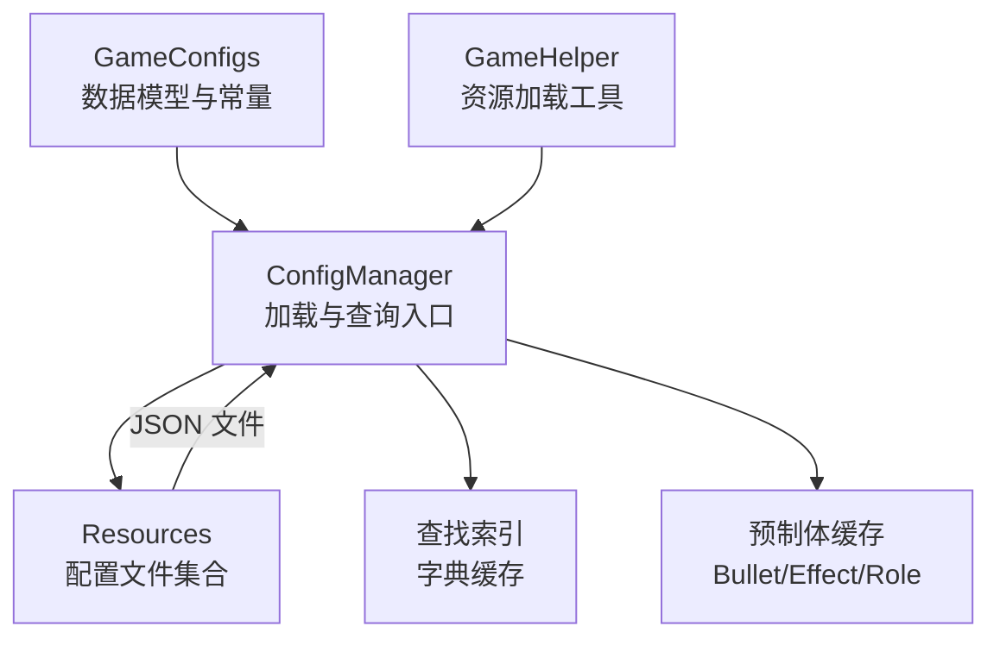
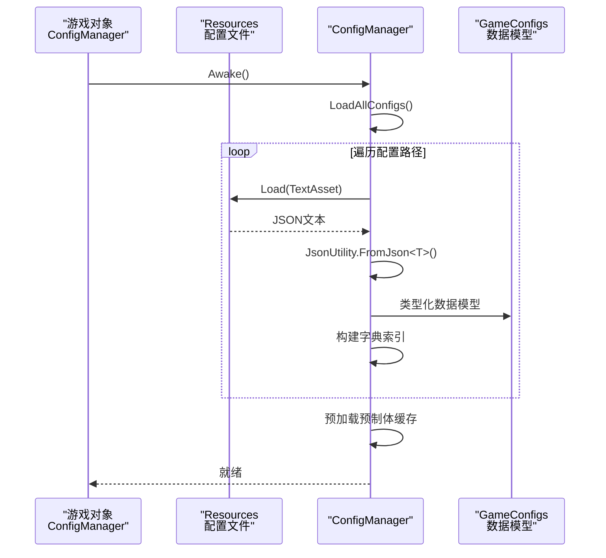
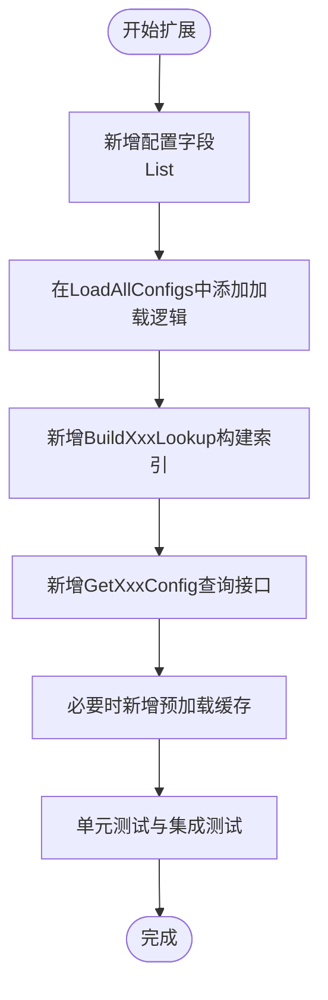
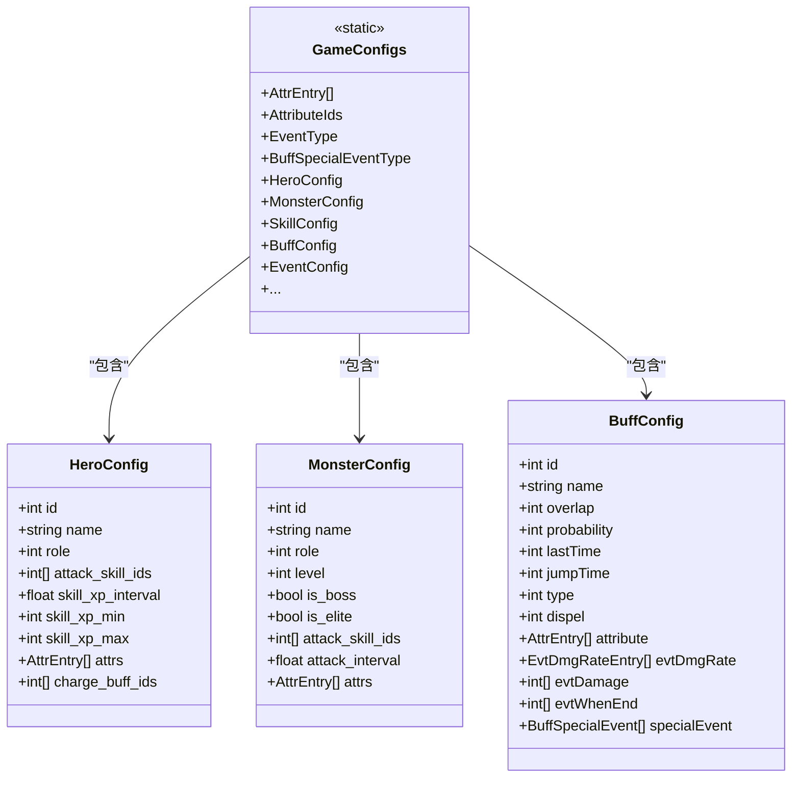
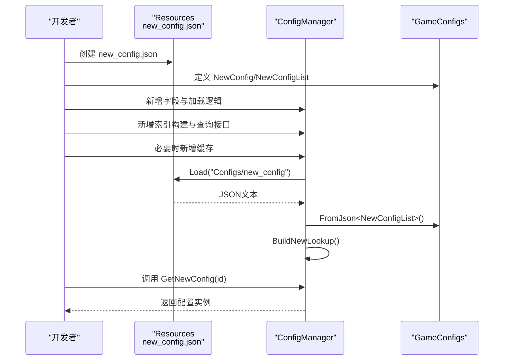
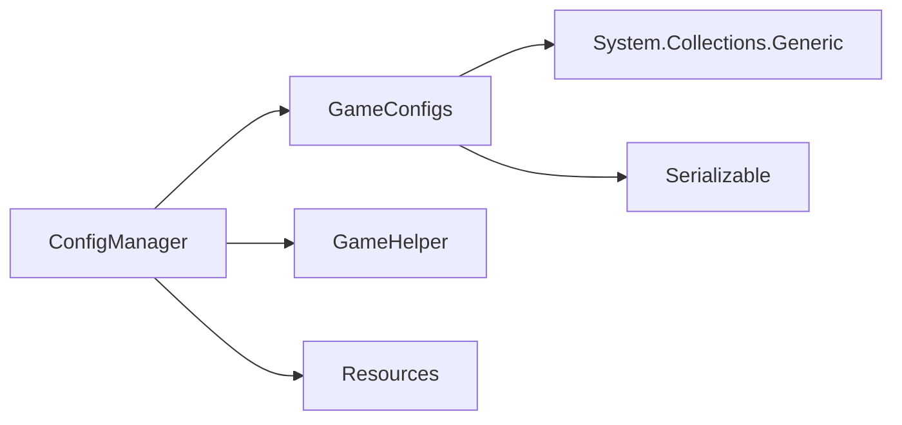

# 配置扩展设计

<cite>
**本文档引用的文件**
- [ConfigManager.cs](file://Assets/Scripts/Core/ConfigManager.cs)
- [GameConfigs.cs](file://Assets/Scripts/Data/GameConfigs.cs)
- [GameHelper.cs](file://Assets/Scripts/Core/GameHelper.cs)
- [game_config.json](file://Assets/Resources/Configs/game_config.json)
- [hero_config.json](file://Assets/Resources/Configs/hero_config.json)
- [skill_config.json](file://Assets/Resources/Configs/skill_config.json)
- [monster_config.json](file://Assets/Resources/Configs/monster_config.json)
- [buff_config.json](file://Assets/Resources/Configs/buff_config.json)
</cite>

## 目录
1. [简介](#简介)
2. [项目结构](#项目结构)
3. [核心组件](#核心组件)
4. [架构总览](#架构总览)
5. [详细组件分析](#详细组件分析)
6. [依赖关系分析](#依赖关系分析)
7. [性能考虑](#性能考虑)
8. [故障排除指南](#故障排除指南)
9. [结论](#结论)
10. [附录](#附录)

## 简介
本文件面向GeometryTD的配置扩展设计，围绕ConfigManager的扩展性与GameConfigs的数据模型设计展开，系统阐述如何安全地添加新的配置类型与查询接口，如何通过继承与组合实现模块化管理，以及如何在不破坏现有功能的前提下保持向后兼容。同时，文档提供配置验证机制、扩展流程、最佳实践与测试策略，帮助开发者高效、稳健地完成配置系统的演进。

## 项目结构
配置系统主要由以下部分组成：
- 核心加载与查询：ConfigManager负责加载所有配置资源、构建查找索引、预加载预制体缓存，并提供统一查询接口。
- 数据模型：GameConfigs集中定义各类配置的数据结构（如英雄、怪物、技能、Buff、事件等），并提供常量与工具类。
- 辅助工具：GameHelper提供资源加载与场景切换等通用能力。
- 配置文件：Assets/Resources/Configs 下的JSON文件作为配置源，供ConfigManager按路径加载。

图表来源
- [ConfigManager.cs:77-122](file://Assets/Scripts/Core/ConfigManager.cs#L77-L122)
- [GameConfigs.cs:104-120](file://Assets/Scripts/Data/GameConfigs.cs#L104-L120)
- [GameHelper.cs:31-47](file://Assets/Scripts/Core/GameHelper.cs#L31-L47)

章节来源
- [ConfigManager.cs:77-122](file://Assets/Scripts/Core/ConfigManager.cs#L77-L122)
- [GameConfigs.cs:104-120](file://Assets/Scripts/Data/GameConfigs.cs#L104-L120)
- [GameHelper.cs:31-47](file://Assets/Scripts/Core/GameHelper.cs#L31-L47)

## 核心组件
- ConfigManager
  - 单例管理器，负责加载所有配置、构建查找索引、预加载预制体缓存，并提供统一查询接口。
  - 支持多类配置的列表与字典索引，涵盖角色、属性、事件、Buff、Passive、故事集、商店、关卡等。
  - 提供资源加载与错误处理，确保在缺失或解析失败时给出明确日志。
- GameConfigs
  - 定义所有配置的数据模型（类、列表包装类、枚举、常量与工具类），并提供属性系统、事件类型、Buff类型等常量。
  - 采用Serializable标记，便于JsonUtility序列化/反序列化。
- GameHelper
  - 提供Sprite、GameObject（预制体）、字体等资源加载工具，支持编辑器环境下的回退加载。

章节来源
- [ConfigManager.cs:6-619](file://Assets/Scripts/Core/ConfigManager.cs#L6-L619)
- [GameConfigs.cs:104-775](file://Assets/Scripts/Data/GameConfigs.cs#L104-L775)
- [GameHelper.cs:9-84](file://Assets/Scripts/Core/GameHelper.cs#L9-L84)

## 架构总览
ConfigManager在Awake阶段调用LoadAllConfigs，逐项加载配置文件并构建对应字典索引；随后进行预制体缓存预加载，最后提供统一查询接口。GameConfigs作为数据契约，定义了配置的结构与语义。

图表来源
- [ConfigManager.cs:65-122](file://Assets/Scripts/Core/ConfigManager.cs#L65-L122)
- [ConfigManager.cs:200-215](file://Assets/Scripts/Core/ConfigManager.cs#L200-L215)

章节来源
- [ConfigManager.cs:65-122](file://Assets/Scripts/Core/ConfigManager.cs#L65-L122)
- [ConfigManager.cs:200-215](file://Assets/Scripts/Core/ConfigManager.cs#L200-L215)

## 详细组件分析

### ConfigManager 扩展性设计
- 扩展点
  - 新增配置类型：在ConfigManager中新增字段以承载配置列表，并在LoadAllConfigs中添加加载逻辑。
  - 新增查询接口：为新配置类型提供GetXxxConfig与GetXxxById等查询方法。
  - 新增索引：在LoadAllConfigs之后调用BuildXxxLookup构建字典索引。
  - 预加载缓存：如需预制体缓存，可在PreloadPrefabs或PreloadRolePrefabs之后追加。
- 向后兼容
  - 通过可空检查与默认返回值避免因缺失配置导致崩溃。
  - 保留既有查询接口，新增接口不破坏现有调用。
- 错误处理
  - 配置文件缺失或解析失败时记录错误日志，避免中断启动流程。

图表来源
- [ConfigManager.cs:77-122](file://Assets/Scripts/Core/ConfigManager.cs#L77-L122)
- [ConfigManager.cs:124-130](file://Assets/Scripts/Core/ConfigManager.cs#L124-L130)
- [ConfigManager.cs:217-227](file://Assets/Scripts/Core/ConfigManager.cs#L217-L227)

章节来源
- [ConfigManager.cs:77-122](file://Assets/Scripts/Core/ConfigManager.cs#L77-L122)
- [ConfigManager.cs:124-130](file://Assets/Scripts/Core/ConfigManager.cs#L124-L130)
- [ConfigManager.cs:217-227](file://Assets/Scripts/Core/ConfigManager.cs#L217-L227)

### GameConfigs 设计模式与模块化
- 组合模式
  - 多数配置以“配置类 + 列表包装类”的形式出现，便于统一管理与序列化。
- 常量与工具类
  - 通过静态类（如AttributeIds、EventType、BuffSpecialEventType等）集中管理配置常量，提升可读性与一致性。
- 数据契约
  - 使用Serializable标记，配合JsonUtility实现零样板代码的配置加载。

图表来源
- [GameConfigs.cs:104-120](file://Assets/Scripts/Data/GameConfigs.cs#L104-L120)
- [GameConfigs.cs:318-337](file://Assets/Scripts/Data/GameConfigs.cs#L318-L337)
- [GameConfigs.cs:340-357](file://Assets/Scripts/Data/GameConfigs.cs#L340-L357)
- [GameConfigs.cs:218-243](file://Assets/Scripts/Data/GameConfigs.cs#L218-L243)

章节来源
- [GameConfigs.cs:104-120](file://Assets/Scripts/Data/GameConfigs.cs#L104-L120)
- [GameConfigs.cs:318-337](file://Assets/Scripts/Data/GameConfigs.cs#L318-L337)
- [GameConfigs.cs:340-357](file://Assets/Scripts/Data/GameConfigs.cs#L340-L357)
- [GameConfigs.cs:218-243](file://Assets/Scripts/Data/GameConfigs.cs#L218-L243)

### 新配置类型的添加流程
- 步骤一：创建配置文件
  - 在Assets/Resources/Configs下新增JSON文件，遵循现有命名规范。
  - 示例参考：game_config.json、hero_config.json、skill_config.json、monster_config.json、buff_config.json。
- 步骤二：定义数据模型
  - 在GameConfigs中新增配置类与列表包装类，使用Serializable标记。
  - 示例参考：HeroConfig/HeroConfigList、MonsterConfig/MonsterConfigList、BuffConfig/BuffConfigList等。
- 步骤三：实现查询接口
  - 在ConfigManager中：
    - 新增字段：public List<NewConfig> NewConfigs { get; private set; }
    - 在LoadAllConfigs中添加加载逻辑：NewConfigs = LoadConfig<NewConfigList>("Configs/new_config")。
    - 新增索引构建：private void BuildNewLookup()，并在LoadAllConfigs后调用。
    - 新增查询接口：public NewConfig GetNewConfig(int id)。
- 步骤四：缓存构建
  - 如涉及预制体或特效，可在PreloadPrefabs或PreloadRolePrefabs中追加缓存逻辑。
- 步骤五：验证与回归
  - 编写单元测试与集成测试，覆盖新增配置的加载、索引与查询路径。

图表来源
- [ConfigManager.cs:77-122](file://Assets/Scripts/Core/ConfigManager.cs#L77-L122)
- [ConfigManager.cs:200-215](file://Assets/Scripts/Core/ConfigManager.cs#L200-L215)
- [GameConfigs.cs:318-337](file://Assets/Scripts/Data/GameConfigs.cs#L318-L337)

章节来源
- [ConfigManager.cs:77-122](file://Assets/Scripts/Core/ConfigManager.cs#L77-L122)
- [ConfigManager.cs:200-215](file://Assets/Scripts/Core/ConfigManager.cs#L200-L215)
- [GameConfigs.cs:318-337](file://Assets/Scripts/Data/GameConfigs.cs#L318-L337)

### 向后兼容性设计
- 可选字段与默认值
  - 查询接口在未命中时返回null或默认值，避免影响调用方逻辑。
- 渐进式引入
  - 新增配置类型不影响既有配置加载与查询，保持LoadAllConfigs的完整执行。
- 日志与容错
  - 配置缺失或解析失败时输出错误日志，便于定位问题而不中断启动。

章节来源
- [ConfigManager.cs:200-215](file://Assets/Scripts/Core/ConfigManager.cs#L200-L215)
- [ConfigManager.cs:246-256](file://Assets/Scripts/Core/ConfigManager.cs#L246-L256)
- [ConfigManager.cs:324-330](file://Assets/Scripts/Core/ConfigManager.cs#L324-L330)

### 配置验证机制
- 数据完整性检查
  - 配置文件加载失败时记录错误日志，提示具体路径。
  - 字段缺失或类型不匹配时，FromJson可能返回null，应结合业务逻辑进行判空处理。
- 逻辑一致性验证
  - 通过静态常量与工具类约束配置取值范围（如事件类型、Buff类型、属性ID等）。
  - 在查询接口中补充边界检查（如ID不存在时的日志与默认行为）。

章节来源
- [ConfigManager.cs:200-215](file://Assets/Scripts/Core/ConfigManager.cs#L200-L215)
- [GameConfigs.cs:17-83](file://Assets/Scripts/Data/GameConfigs.cs#L17-L83)
- [GameConfigs.cs:125-136](file://Assets/Scripts/Data/GameConfigs.cs#L125-L136)

### 测试策略与质量保证
- 单元测试
  - 验证ConfigManager的加载流程与索引构建是否正确。
  - 验证新增配置的查询接口返回预期结果。
- 集成测试
  - 验证从Resources加载到Json解析再到索引构建的完整链路。
  - 验证错误场景（文件缺失、解析失败）的日志输出与默认行为。
- 回归测试
  - 确保新增配置不破坏既有配置的加载与查询。
- 资源测试
  - 验证预制体缓存加载（如Bullet/Effect/Role）是否成功，缺失时是否记录警告。

章节来源
- [ConfigManager.cs:169-198](file://Assets/Scripts/Core/ConfigManager.cs#L169-L198)
- [ConfigManager.cs:357-370](file://Assets/Scripts/Core/ConfigManager.cs#L357-L370)

## 依赖关系分析
- ConfigManager依赖
  - GameConfigs：用于类型化反序列化。
  - GameHelper：用于角色预制体加载。
  - Resources：用于配置文件加载。
- GameConfigs依赖
  - System.Collections.Generic：用于列表与字典。
  - Serializable：用于JsonUtility序列化。
- 依赖耦合
  - ConfigManager与GameConfigs之间为弱耦合（通过类型名与Json契约），便于扩展。
  - 预制体缓存依赖Resources路径约定，需保持一致的命名与放置规则。

图表来源
- [ConfigManager.cs:6-619](file://Assets/Scripts/Core/ConfigManager.cs#L6-L619)
- [GameConfigs.cs:1-10](file://Assets/Scripts/Data/GameConfigs.cs#L1-L10)
- [GameHelper.cs:9-84](file://Assets/Scripts/Core/GameHelper.cs#L9-L84)

章节来源
- [ConfigManager.cs:6-619](file://Assets/Scripts/Core/ConfigManager.cs#L6-L619)
- [GameConfigs.cs:1-10](file://Assets/Scripts/Data/GameConfigs.cs#L1-L10)
- [GameHelper.cs:9-84](file://Assets/Scripts/Core/GameHelper.cs#L9-L84)

## 性能考虑
- 字典索引
  - 通过字典索引实现O(1)查询，避免线性遍历。
- 预加载缓存
  - 预加载常用预制体，减少运行时Resources.Load开销。
- 序列化成本
  - 配置文件体积与复杂度会影响首次加载时间，建议拆分大配置或延迟加载非关键配置。
- 日志与调试
  - 错误日志仅在异常分支输出，避免影响正常运行时性能。

章节来源
- [ConfigManager.cs:124-130](file://Assets/Scripts/Core/ConfigManager.cs#L124-L130)
- [ConfigManager.cs:169-198](file://Assets/Scripts/Core/ConfigManager.cs#L169-L198)

## 故障排除指南
- 配置文件无法加载
  - 检查Resources路径与文件名是否与ConfigManager中的加载路径一致。
  - 确认JSON语法正确且字段名称与数据模型一致。
- 解析失败
  - 查看错误日志，确认字段类型与取值范围是否符合预期。
- 查询为空
  - 确认索引是否已构建，ID是否存在，是否被过滤逻辑排除。
- 预制体加载失败
  - 检查prefabPath是否正确，资源是否存在于Resources中或编辑器环境下可回退加载。

章节来源
- [ConfigManager.cs:200-215](file://Assets/Scripts/Core/ConfigManager.cs#L200-L215)
- [ConfigManager.cs:169-198](file://Assets/Scripts/Core/ConfigManager.cs#L169-L198)
- [GameHelper.cs:31-47](file://Assets/Scripts/Core/GameHelper.cs#L31-L47)

## 结论
ConfigManager通过“列表 + 字典索引 + 预加载缓存”的架构实现了配置系统的高性能与可扩展性；GameConfigs以组合与常量设计提供了清晰的数据契约与一致的配置语义。遵循本文提供的扩展流程与最佳实践，可以在不破坏现有功能的前提下安全地引入新配置类型，并通过完善的测试策略保障质量与稳定性。

## 附录
- 配置文件示例参考
  - [game_config.json:1-9](file://Assets/Resources/Configs/game_config.json#L1-L9)
  - [hero_config.json:1-44](file://Assets/Resources/Configs/hero_config.json#L1-L44)
  - [skill_config.json:1-1509](file://Assets/Resources/Configs/skill_config.json#L1-L1509)
  - [monster_config.json:1-167](file://Assets/Resources/Configs/monster_config.json#L1-L167)
  - [buff_config.json:1-23](file://Assets/Resources/Configs/buff_config.json#L1-L23)