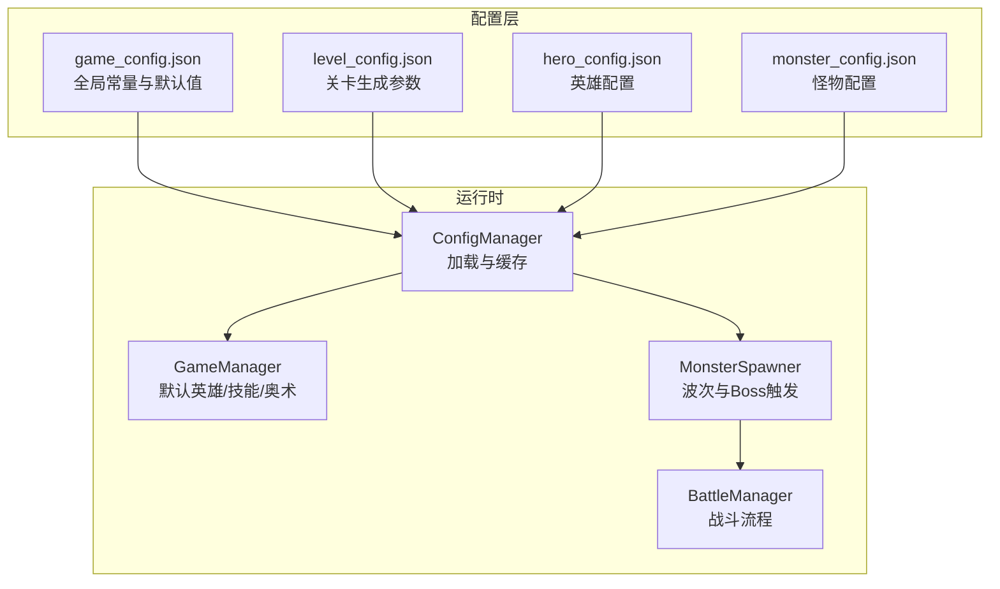
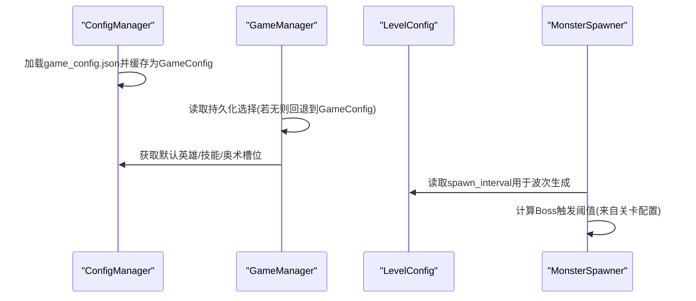
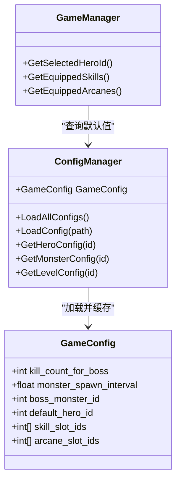
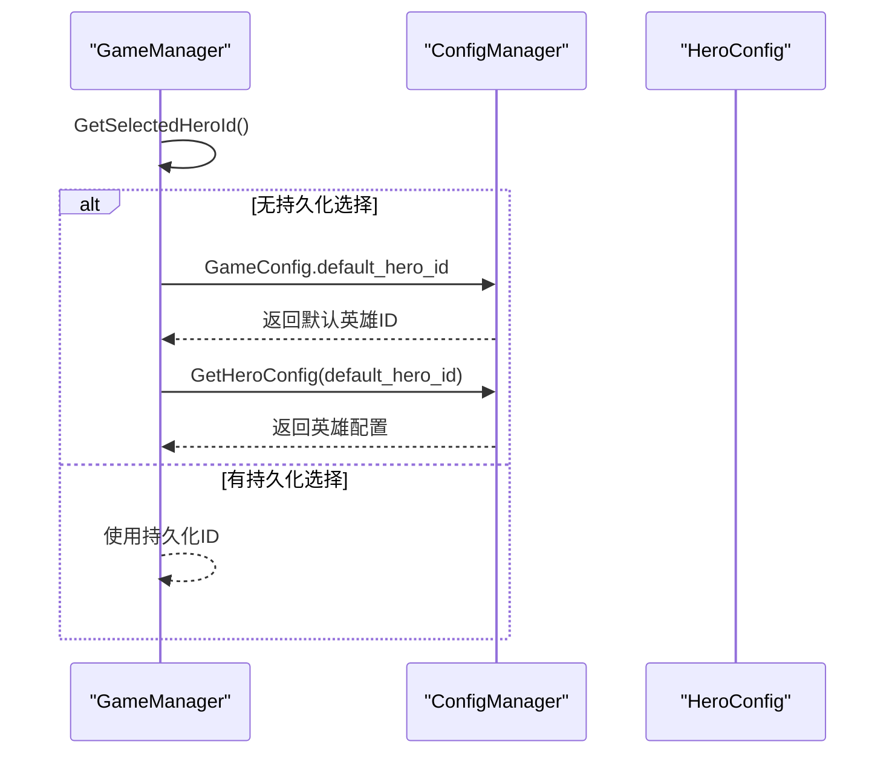
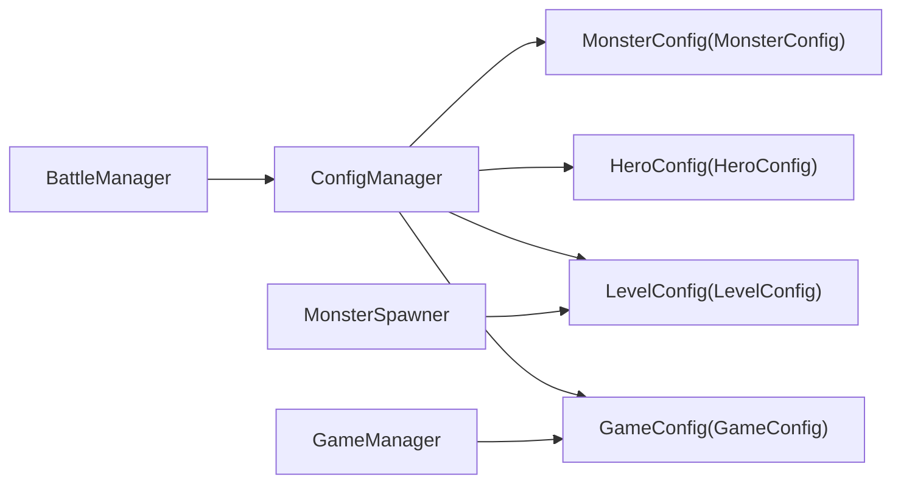

# 全局配置文件

<cite>
**本文引用的文件列表**
- [game_config.json](file://Assets/Resources/Configs/game_config.json)
- [ConfigManager.cs](file://Assets/Scripts/Core/ConfigManager.cs)
- [GameConfigs.cs](file://Assets/Scripts/Data/GameConfigs.cs)
- [GameManager.cs](file://Assets/Scripts/Core/GameManager.cs)
- [MonsterSpawner.cs](file://Assets/Scripts/Battle/MonsterSpawner.cs)
- [BattleManager.cs](file://Assets/Scripts/Battle/BattleManager.cs)
- [level_config.json](file://Assets/Resources/Configs/level_config.json)
- [hero_config.json](file://Assets/Resources/Configs/hero_config.json)
- [monster_config.json](file://Assets/Resources/Configs/monster_config.json)
</cite>

## 目录
1. [简介](#简介)
2. [项目结构与定位](#项目结构与定位)
3. [核心组件概览](#核心组件概览)
4. [架构总览](#架构总览)
5. [详细组件分析](#详细组件分析)
6. [依赖关系分析](#依赖关系分析)
7. [性能考量](#性能考量)
8. [故障排查指南](#故障排查指南)
9. [结论](#结论)
10. [附录：完整配置示例与最佳实践](#附录完整配置示例与最佳实践)

## 简介
本文件面向GeometryTD项目的全局配置文件game_config.json，系统性梳理其数据结构、关键配置项含义、默认值来源、在运行时的使用方式以及对游戏行为的影响。同时提供配置修改指南、合法取值范围建议、常见问题排查方法，并通过图示展示配置在系统中的流转路径与影响范围。

## 项目结构与定位
- 全局配置位于Resources/Configs目录下，以JSON格式存储，便于版本管理与热更新。
- 游戏启动时由ConfigManager统一加载并缓存，供各模块按需查询。
- GameManager负责读取默认英雄、技能槽位与奥术槽位等全局偏好设置。
- 战斗系统中的怪物生成与Boss触发逻辑会参考关卡配置中的生成间隔与击杀阈值，而这些阈值与全局配置中的击杀阈值共同决定战斗节奏。

图表来源
- [game_config.json:1-9](file://Assets/Resources/Configs/game_config.json#L1-L9)
- [ConfigManager.cs:77-122](file://Assets/Scripts/Core/ConfigManager.cs#L77-L122)
- [GameManager.cs:109-155](file://Assets/Scripts/Core/GameManager.cs#L109-L155)
- [MonsterSpawner.cs:25-43](file://Assets/Scripts/Battle/MonsterSpawner.cs#L25-L43)
- [BattleManager.cs:468-487](file://Assets/Scripts/Battle/BattleManager.cs#L468-L487)

章节来源
- [game_config.json:1-9](file://Assets/Resources/Configs/game_config.json#L1-L9)
- [ConfigManager.cs:77-122](file://Assets/Scripts/Core/ConfigManager.cs#L77-L122)

## 核心组件概览
- 全局配置类GameConfig：承载game_config.json的结构化定义，包含击杀阈值、怪物生成间隔、Boss怪物ID、默认英雄ID、技能槽位ID数组、奥术槽位ID数组。
- ConfigManager：集中加载所有配置文件，构建查找索引，提供统一查询接口。
- GameManager：读取GameConfig中的默认英雄与槽位配置，作为玩家初始选择的后备值。
- MonsterSpawner：依据关卡配置的spawn_interval进行波次生成；Boss触发与击杀计数来自关卡配置中的bossList阈值，而非game_config.json。

章节来源
- [GameConfigs.cs:404-412](file://Assets/Scripts/Data/GameConfigs.cs#L404-L412)
- [ConfigManager.cs:77-122](file://Assets/Scripts/Core/ConfigManager.cs#L77-L122)
- [GameManager.cs:109-155](file://Assets/Scripts/Core/GameManager.cs#L109-L155)
- [MonsterSpawner.cs:31-31](file://Assets/Scripts/Battle/MonsterSpawner.cs#L31-L31)

## 架构总览
全局配置在系统中的调用链路如下：
- ConfigManager在Awake阶段加载game_config.json并缓存为GameConfig实例。
- GameManager在需要默认英雄或默认技能/奥术槽位时，优先使用持久化数据；若无持久化数据，则回退到GameConfig中的默认值。
- 战斗系统中的怪物生成间隔来源于关卡配置level_config.json中的spawn_interval；Boss触发阈值来源于关卡配置中的bossList[num]字段。

图表来源
- [ConfigManager.cs:77-122](file://Assets/Scripts/Core/ConfigManager.cs#L77-L122)
- [GameManager.cs:109-155](file://Assets/Scripts/Core/GameManager.cs#L109-L155)
- [level_config.json:10-10](file://Assets/Resources/Configs/level_config.json#L10-L10)
- [MonsterSpawner.cs:31-31](file://Assets/Scripts/Battle/MonsterSpawner.cs#L31-L31)

## 详细组件分析

### 全局配置数据结构与字段详解
- kill_count_for_boss
  - 类型：整数
  - 含义：当前关卡中，达到该击杀数后可触发Boss战。注意：该字段在当前代码中未被直接使用，Boss触发逻辑由关卡配置中的bossList[num]决定。
  - 默认值：100
  - 影响范围：未在MonsterSpawner中直接读取，不直接影响当前战斗节奏。
  - 修改建议：如需保留此字段，可在MonsterSpawner中增加对GameConfig.kill_count_for_boss的读取与校验，否则可移除以避免歧义。

- monster_spawn_interval
  - 类型：浮点数（秒）
  - 含义：怪物波次生成的时间间隔。当前代码中，MonsterSpawner使用的是关卡配置中的spawn_interval，而非GameConfig中的monster_spawn_interval。
  - 默认值：1.5
  - 影响范围：当前未生效；若要启用GameConfig中的该字段，请在MonsterSpawner初始化时从GameConfig读取并覆盖关卡配置。
  - 修改建议：若希望全局统一调整生成节奏，建议在MonsterSpawner.Init中优先使用GameConfig.monster_spawn_interval，再根据关卡配置做微调。

- boss_monster_id
  - 类型：整数
  - 含义：Boss怪物ID。当前代码中，Boss生成使用的是关卡配置中的bossList[id]，而非GameConfig.boss_monster_id。
  - 默认值：100
  - 影响范围：未在Boss生成逻辑中直接使用。
  - 修改建议：若希望全局指定Boss模板，可在BattleManager.SpawnLevelBoss中改为从GameConfig读取默认Boss ID，再允许关卡配置覆盖。

- default_hero_id
  - 类型：整数
  - 含义：默认英雄ID。GameManager在GetSelectedHeroId()中，若无持久化选择则回退到该值。
  - 默认值：1
  - 影响范围：英雄选择界面与战斗开始前的默认英雄。
  - 修改建议：确保该ID在hero_config.json中存在且有效。

- skill_slot_ids
  - 类型：整数数组
  - 含义：默认技能槽位ID数组（长度通常为8）。GameManager在GetEquippedSkills()中，若无持久化选择则回退到该数组。
  - 默认值：[1001, 1002, 1003, 1004, 1005, 1006, 1007, 1008]
  - 影响范围：技能编队界面的默认布局。
  - 修改建议：确保数组长度为8，且每个ID在skill_config.json中存在。

- arcane_slot_ids
  - 类型：整数数组
  - 含义：默认奥术槽位ID数组（长度通常为4）。GameManager在GetEquippedArcanes()中，若无持久化选择则回退到该数组。
  - 默认值：[4001, 4002, 4003, 4004]
  - 影响范围：奥术编队界面的默认布局。
  - 修改建议：确保数组长度为4，且每个ID在arcane_config.json中存在。

章节来源
- [GameConfigs.cs:404-412](file://Assets/Scripts/Data/GameConfigs.cs#L404-L412)
- [game_config.json:1-9](file://Assets/Resources/Configs/game_config.json#L1-L9)
- [GameManager.cs:109-155](file://Assets/Scripts/Core/GameManager.cs#L109-L155)
- [MonsterSpawner.cs:31-31](file://Assets/Scripts/Battle/MonsterSpawner.cs#L31-L31)

### 配置加载与缓存机制
- ConfigManager在Awake阶段调用LoadAllConfigs，逐个加载各配置文件并构建查找字典。
- GameConfig被加载为单例对象，供GameManager等模块查询。
- 其他配置（如英雄、怪物、技能、关卡等）同样被加载并缓存，形成统一的配置中心。

图表来源
- [ConfigManager.cs:77-122](file://Assets/Scripts/Core/ConfigManager.cs#L77-L122)
- [GameConfigs.cs:404-412](file://Assets/Scripts/Data/GameConfigs.cs#L404-L412)
- [GameManager.cs:109-155](file://Assets/Scripts/Core/GameManager.cs#L109-L155)

章节来源
- [ConfigManager.cs:77-122](file://Assets/Scripts/Core/ConfigManager.cs#L77-L122)
- [GameConfigs.cs:404-412](file://Assets/Scripts/Data/GameConfigs.cs#L404-L412)
- [GameManager.cs:109-155](file://Assets/Scripts/Core/GameManager.cs#L109-L155)

### 关键流程与影响分析

#### 英雄选择与默认值回退
- 若玩家未选择英雄或无持久化记录，GameManager将使用GameConfig.default_hero_id作为默认值。
- 该值必须在hero_config.json中存在对应英雄配置。

图表来源
- [GameManager.cs:109-115](file://Assets/Scripts/Core/GameManager.cs#L109-L115)
- [ConfigManager.cs:382-388](file://Assets/Scripts/Core/ConfigManager.cs#L382-L388)
- [hero_config.json:1-44](file://Assets/Resources/Configs/hero_config.json#L1-L44)

章节来源
- [GameManager.cs:109-115](file://Assets/Scripts/Core/GameManager.cs#L109-L115)
- [ConfigManager.cs:382-388](file://Assets/Scripts/Core/ConfigManager.cs#L382-L388)
- [hero_config.json:1-44](file://Assets/Resources/Configs/hero_config.json#L1-L44)

#### 技能与奥术槽位默认值
- 技能槽位：GameManager.GetEquippedSkills()在无持久化时返回GameConfig.skill_slot_ids。
- 奥术槽位：GameManager.GetEquippedArcanes()在无持久化时返回GameConfig.arcane_slot_ids。
- 数组长度与ID有效性需与对应配置文件保持一致。

章节来源
- [GameManager.cs:125-132](file://Assets/Scripts/Core/GameManager.cs#L125-L132)
- [GameManager.cs:148-155](file://Assets/Scripts/Core/GameManager.cs#L148-L155)

#### 怪物生成与Boss触发
- 生成间隔：MonsterSpawner使用关卡配置level_config.json中的spawn_interval进行波次生成。
- Boss触发：MonsterSpawner依据关卡配置bossList[num]判断是否达到触发阈值。
- 当前未使用GameConfig中的monster_spawn_interval与kill_count_for_boss，因此全局配置对战斗节奏的直接影响有限。

章节来源
- [MonsterSpawner.cs:31-31](file://Assets/Scripts/Battle/MonsterSpawner.cs#L31-L31)
- [MonsterSpawner.cs:123-128](file://Assets/Scripts/Battle/MonsterSpawner.cs#L123-L128)
- [level_config.json:10-24](file://Assets/Resources/Configs/level_config.json#L10-L24)

## 依赖关系分析
- ConfigManager是配置系统的中枢，依赖Resources/Configs下的各类JSON配置文件。
- GameManager依赖GameConfig进行默认值回退。
- MonsterSpawner依赖LevelConfig进行波次与Boss触发逻辑，当前未直接依赖GameConfig。
- BattleManager依赖ConfigManager提供的怪物与角色预制体缓存，间接受GameConfig中默认英雄与槽位的影响。

图表来源
- [ConfigManager.cs:77-122](file://Assets/Scripts/Core/ConfigManager.cs#L77-L122)
- [GameManager.cs:109-155](file://Assets/Scripts/Core/GameManager.cs#L109-L155)
- [MonsterSpawner.cs:31-31](file://Assets/Scripts/Battle/MonsterSpawner.cs#L31-L31)
- [BattleManager.cs:468-487](file://Assets/Scripts/Battle/BattleManager.cs#L468-L487)

章节来源
- [ConfigManager.cs:77-122](file://Assets/Scripts/Core/ConfigManager.cs#L77-L122)
- [GameManager.cs:109-155](file://Assets/Scripts/Core/GameManager.cs#L109-L155)
- [MonsterSpawner.cs:31-31](file://Assets/Scripts/Battle/MonsterSpawner.cs#L31-L31)
- [BattleManager.cs:468-487](file://Assets/Scripts/Battle/BattleManager.cs#L468-L487)

## 性能考量
- 配置加载仅在启动阶段执行一次，开销极低。
- ConfigManager通过字典索引加速查询，避免线性扫描。
- Prefab预加载（子弹与特效）在ConfigManager中完成，减少运行时资源加载延迟。
- 建议：保持配置文件简洁，避免过大的数组或嵌套结构，以降低JSON解析与内存占用。

## 故障排查指南
- 无法加载game_config.json
  - 现象：控制台出现“无法加载配置文件”或“配置文件解析失败”的错误。
  - 排查：确认Assets/Resources/Configs/game_config.json路径正确、JSON语法合法、字段名拼写无误。
  - 参考：ConfigManager.LoadConfig的错误日志分支。

- 默认英雄ID无效
  - 现象：进入战斗或英雄选择界面显示异常。
  - 排查：检查GameConfig.default_hero_id是否存在于hero_config.json；确认ID唯一且未被删除。

- 技能/奥术槽位ID不存在
  - 现象：技能或奥术编队界面显示为空或报错。
  - 排查：核对GameConfig.skill_slot_ids与GameConfig.arcane_slot_ids中的ID是否在各自配置文件中存在。

- 怪物生成节奏不符合预期
  - 现象：怪物生成过快/过慢或Boss未按预期出现。
  - 排查：当前逻辑使用关卡配置的spawn_interval与bossList[num]，请检查level_config.json中的对应字段；如需全局统一节奏，请在MonsterSpawner中读取GameConfig.monster_spawn_interval并覆盖关卡配置。

章节来源
- [ConfigManager.cs:200-215](file://Assets/Scripts/Core/ConfigManager.cs#L200-L215)
- [GameManager.cs:109-155](file://Assets/Scripts/Core/GameManager.cs#L109-L155)
- [level_config.json:10-24](file://Assets/Resources/Configs/level_config.json#L10-L24)

## 结论
game_config.json作为全局常量与默认值的来源，在当前实现中主要服务于英雄选择与技能/奥术编队的默认值回退。对于战斗节奏（生成间隔）与Boss触发（击杀阈值），当前代码更依赖关卡配置。若希望将全局配置对战斗节奏产生直接影响，可在MonsterSpawner中引入GameConfig.monster_spawn_interval与kill_count_for_boss，并在必要时提供关卡覆盖策略。

## 附录：完整配置示例与最佳实践

### 完整配置示例（game_config.json）
- 字段说明与默认值
  - kill_count_for_boss：100（当前未被MonsterSpawner直接使用）
  - monster_spawn_interval：1.5（当前未被MonsterSpawner直接使用）
  - boss_monster_id：100（当前未被BattleManager直接使用）
  - default_hero_id：1（应与hero_config.json中的英雄ID一致）
  - skill_slot_ids：[1001, 1002, 1003, 1004, 1005, 1006, 1007, 1008]（长度应为8）
  - arcane_slot_ids：[4001, 4002, 4003, 4004]（长度应为4）

- 示例路径
  - [game_config.json:1-9](file://Assets/Resources/Configs/game_config.json#L1-L9)

### 配置修改指南与注意事项
- 修改默认英雄
  - 将default_hero_id设为hero_config.json中存在的英雄ID。
  - 确保该英雄的attack_skill_ids、attrs等字段完整。

- 修改技能/奥术槽位
  - skill_slot_ids与arcane_slot_ids的长度分别应为8与4。
  - 每个ID必须在对应配置文件中存在，且语义正确（技能/奥术）。

- 调整生成节奏（可选）
  - 如需全局统一生成间隔，可在MonsterSpawner.Init中读取GameConfig.monster_spawn_interval并覆盖关卡配置。
  - 注意：当前MonsterSpawner使用的是关卡配置的spawn_interval，直接修改game_config.json不会生效。

- Boss触发逻辑（可选）
  - 如需使用GameConfig.kill_count_for_boss作为Boss触发阈值，可在MonsterSpawner.CheckBossSpawn中增加对该字段的读取与比较。

### 合法取值范围建议
- kill_count_for_boss：正整数，建议与关卡难度匹配。
- monster_spawn_interval：正浮点数（秒），建议在0.5~3.0之间，视战斗节奏调整。
- boss_monster_id：正整数，应与monster_config.json中的Boss ID一致。
- default_hero_id：正整数，应与hero_config.json中的英雄ID一致。
- skill_slot_ids：长度8的正整数数组，元素互不相同，均在skill_config.json中存在。
- arcane_slot_ids：长度4的正整数数组，元素互不相同，均在arcane_config.json中存在。

### 常见问题排查清单
- JSON语法错误：检查逗号、括号、引号是否匹配。
- ID缺失：确认所有ID在对应配置文件中存在。
- 数组长度不符：技能槽位应为8，奥术槽位应为4。
- 未生效的全局配置：确认MonsterSpawner是否已切换到使用GameConfig的对应字段。