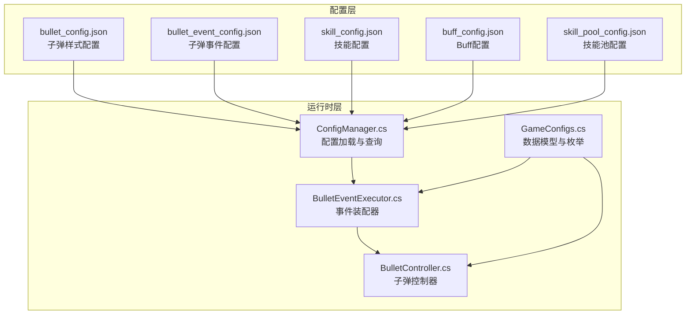
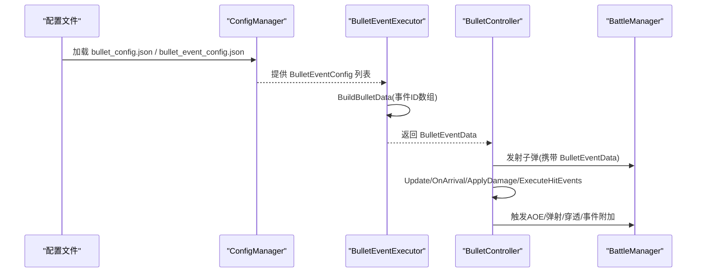
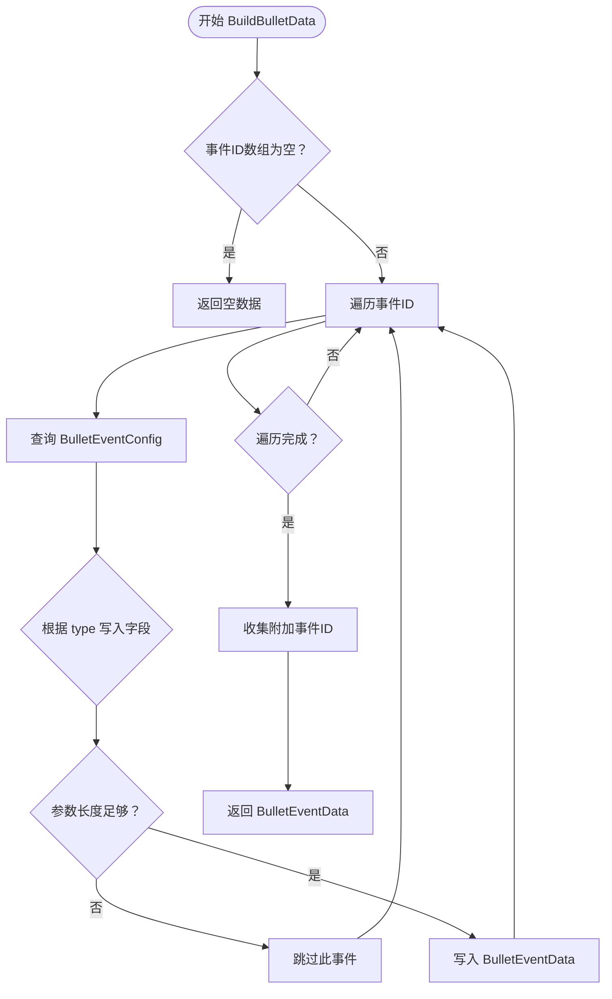
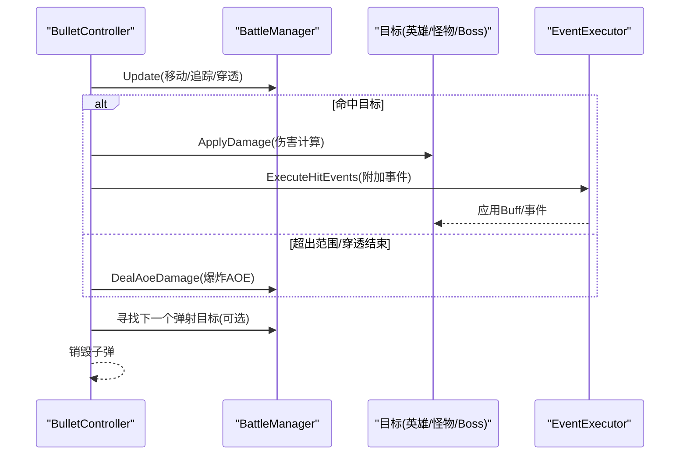
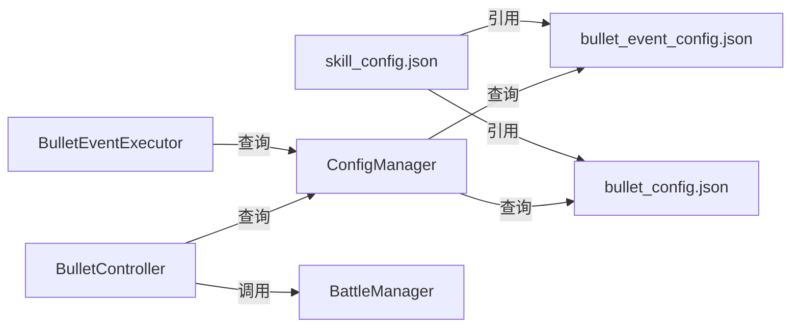

# 子弹配置文件

<cite>
**本文档引用的文件**
- [bullet_config.json](file://Assets/Resources/Configs/bullet_config.json)
- [bullet_event_config.json](file://Assets/Resources/Configs/bullet_event_config.json)
- [BulletController.cs](file://Assets/Scripts/Battle/BulletController.cs)
- [BulletEventExecutor.cs](file://Assets/Scripts/Battle/BulletEventExecutor.cs)
- [ConfigManager.cs](file://Assets/Scripts/Core/ConfigManager.cs)
- [GameConfigs.cs](file://Assets/Scripts/Data/GameConfigs.cs)
- [skill_config.json](file://Assets/Resources/Configs/skill_config.json)
- [buff_config.json](file://Assets/Resources/Configs/buff_config.json)
- [skill_pool_config.json](file://Assets/Resources/Configs/skill_pool_config.json)
</cite>

## 更新摘要
**变更内容**
- 更新弹射事件配置参数说明，从四参数简化为两参数
- 移除了 bounceRadius 和 bounceMinDist 字段的说明
- 更新了技能池配置中的新技能描述
- 更新了弹射事件参数处理逻辑

## 目录
1. [简介](#简介)
2. [项目结构](#项目结构)
3. [核心组件](#核心组件)
4. [架构总览](#架构总览)
5. [详细组件分析](#详细组件分析)
6. [依赖关系分析](#依赖关系分析)
7. [性能考虑](#性能考虑)
8. [故障排查指南](#故障排查指南)
9. [结论](#结论)
10. [附录](#附录)

## 简介
本文件面向GeometryTD的子弹配置体系，系统性梳理子弹配置(bullet_config)与子弹事件配置(bullet_event_config)的数据结构、字段定义与运行机制。重点覆盖：
- 子弹基础属性：飞行速度、伤害值、攻击范围、穿透能力、轨迹形状等
- 子弹效果配置：爆炸范围、减速、燃烧等特殊效果
- 子弹事件系统：触发条件、效果组合与优先级
- 设计指南：视觉效果与游戏性的平衡
- 性能优化建议与调试技巧

## 项目结构
子弹配置相关的核心文件分布如下：
- 配置文件：Assets/Resources/Configs/bullet_config.json、Assets/Resources/Configs/bullet_event_config.json
- 运行时代码：BulletController.cs、BulletEventExecutor.cs、ConfigManager.cs、GameConfigs.cs
- 技能配置：Assets/Resources/Configs/skill_config.json（用于绑定子弹样式与事件）
- Buff配置：Assets/Resources/Configs/buff_config.json（用于事件附加效果）

**图表来源**
- [bullet_config.json:1-9](file://Assets/Resources/Configs/bullet_config.json#L1-L9)
- [bullet_event_config.json:1-363](file://Assets/Resources/Configs/bullet_event_config.json#L1-L363)
- [ConfigManager.cs:77-122](file://Assets/Scripts/Core/ConfigManager.cs#L77-L122)
- [BulletEventExecutor.cs:8-95](file://Assets/Scripts/Battle/BulletEventExecutor.cs#L8-L95)
- [BulletController.cs:33-73](file://Assets/Scripts/Battle/BulletController.cs#L33-L73)
- [GameConfigs.cs:157-170](file://Assets/Scripts/Data/GameConfigs.cs#L157-L170)

**章节来源**
- [bullet_config.json:1-9](file://Assets/Resources/Configs/bullet_config.json#L1-L9)
- [bullet_event_config.json:1-363](file://Assets/Resources/Configs/bullet_event_config.json#L1-L363)
- [ConfigManager.cs:77-122](file://Assets/Scripts/Core/ConfigManager.cs#L77-L122)

## 核心组件
- 子弹样式配置(bullet_config)：定义子弹外观资源与样式ID映射，供技能配置引用。
- 子弹事件配置(bullet_event_config)：定义子弹行为事件，如穿透、爆炸、追踪、散射、弹射、齐射、连射等。
- 运行时装配器(BulletEventExecutor)：将事件ID数组转换为运行时数据BulletEventData。
- 子弹控制器(BulletController)：执行子弹生命周期、碰撞判定、伤害结算与事件触发。
- 配置管理(ConfigManager)：集中加载与缓存所有配置，提供查询接口。
- 数据模型(GameConfigs)：定义事件类型常量、运行时数据结构等。

**章节来源**
- [GameConfigs.cs:157-170](file://Assets/Scripts/Data/GameConfigs.cs#L157-L170)
- [GameConfigs.cs:275-314](file://Assets/Scripts/Data/GameConfigs.cs#L275-L314)
- [BulletEventExecutor.cs:8-95](file://Assets/Scripts/Battle/BulletEventExecutor.cs#L8-L95)
- [BulletController.cs:33-73](file://Assets/Scripts/Battle/BulletController.cs#L33-L73)
- [ConfigManager.cs:77-122](file://Assets/Scripts/Core/ConfigManager.cs#L77-L122)

## 架构总览
子弹配置从配置文件到运行时的流转过程如下：

**图表来源**
- [ConfigManager.cs:77-122](file://Assets/Scripts/Core/ConfigManager.cs#L77-L122)
- [BulletEventExecutor.cs:8-95](file://Assets/Scripts/Battle/BulletEventExecutor.cs#L8-L95)
- [BulletController.cs:94-216](file://Assets/Scripts/Battle/BulletController.cs#L94-L216)

## 详细组件分析

### 子弹样式配置(bullet_config)
- 文件位置：Assets/Resources/Configs/bullet_config.json
- 结构要点：
  - bulletStyles 数组，每个元素包含 id 与 prefabPath
  - id 作为样式标识，用于技能配置中的 bulletStyleId 字段
  - prefabPath 指向Resources下的子弹预制体路径
- 使用方式：
  - 技能配置(skill_config.json)通过 bulletStyleId 引用该样式
  - ConfigManager 预加载并缓存子弹预制体，供运行时实例化

**章节来源**
- [bullet_config.json:1-9](file://Assets/Resources/Configs/bullet_config.json#L1-L9)
- [ConfigManager.cs:140-160](file://Assets/Scripts/Core/ConfigManager.cs#L140-L160)
- [ConfigManager.cs:169-198](file://Assets/Scripts/Core/ConfigManager.cs#L169-L198)

### 子弹事件配置(bullet_event_config)
- 文件位置：Assets/Resources/Configs/bullet_event_config.json
- 结构要点：
  - bulletEvents 数组，每个元素包含 id、type、name、des、args
  - type 定义事件类别，args 为参数数组
  - 事件类型由 BulletEventType 常量定义，涵盖穿透、爆炸、追踪、散射、弹射、连射、齐射以及附加事件等
- 参数约定：
  - 穿透：args[0]=穿透数量
  - 爆炸：args[0]=爆炸伤害倍率(万分比)、args[1]=爆炸半径
  - 追踪：无参数
  - 散射：args[0]=额外子弹数、args[1]=分散角度
  - **弹射**：**已更新** args[0]=弹射次数、args[1]=伤害修正(万分比)
  - 连射：args[0]=连续释放次数
  - 齐射：args[0]=攻击目标数量
  - 附加事件：args[0]=事件ID（对目标或施法者附加）

**更新** 弹射事件配置已从四参数简化为两参数，移除了 bounceRadius 和 bounceMinDist 字段。现在弹射事件只保留弹射次数和伤害修正两个参数。

**章节来源**
- [bullet_event_config.json:1-363](file://Assets/Resources/Configs/bullet_event_config.json#L1-L363)
- [GameConfigs.cs:157-170](file://Assets/Scripts/Data/GameConfigs.cs#L157-L170)
- [GameConfigs.cs:184-192](file://Assets/Scripts/Data/GameConfigs.cs#L184-L192)

### 子弹事件装配器(BulletEventExecutor)
- 功能：将技能或子弹事件ID数组转换为运行时数据BulletEventData
- 关键逻辑：
  - 遍历事件ID，查询对应 BulletEventConfig
  - 根据 type 将参数写入 BulletEventData 的相应字段
  - 支持附加事件：attachToTargetEventIds、attachToCasterEventIds
- 注意事项：
  - 未知类型会记录警告日志
  - args 数组长度不足时按配置约定忽略无效参数

**图表来源**
- [BulletEventExecutor.cs:8-95](file://Assets/Scripts/Battle/BulletEventExecutor.cs#L8-L95)

**章节来源**
- [BulletEventExecutor.cs:8-95](file://Assets/Scripts/Battle/BulletEventExecutor.cs#L8-L95)

### 子弹控制器(BulletController)
- 生命周期与运动：
  - 初始化：设置目标、速度、伤害、是否敌方子弹、最大攻击范围等
  - Update：更新生命周期、检查攻击距离、追踪目标、处理穿透模式、到达目标后的处理
  - 到达处理：应用伤害、执行命中事件、可能触发爆炸AOE、弹射、穿透
- 伤害与伤害上下文：
  - 支持 DamageCalculator 的完整伤害公式（含命中/暴击/元素加减/Boss加成），可通过 SetDamageContext 启用
  - 默认使用预计算 damage
- 事件执行：
  - 对命中目标附加事件（通过 EventExecutor）
  - 对施法者附加事件（如自身回血、能量回复等）

**图表来源**
- [BulletController.cs:94-216](file://Assets/Scripts/Battle/BulletController.cs#L94-L216)
- [BulletController.cs:218-302](file://Assets/Scripts/Battle/BulletController.cs#L218-L302)
- [BulletController.cs:304-342](file://Assets/Scripts/Battle/BulletController.cs#L304-L342)

**章节来源**
- [BulletController.cs:33-73](file://Assets/Scripts/Battle/BulletController.cs#L33-L73)
- [BulletController.cs:94-216](file://Assets/Scripts/Battle/BulletController.cs#L94-L216)
- [BulletController.cs:218-302](file://Assets/Scripts/Battle/BulletController.cs#L218-L302)
- [BulletController.cs:304-342](file://Assets/Scripts/Battle/BulletController.cs#L304-L342)

### 配置管理(ConfigManager)
- 职责：
  - 加载 bullet_config.json 与 bullet_event_config.json
  - 构建查询索引，提供 GetBulletEventConfig、GetBulletStyleConfig 等查询方法
  - 预加载子弹与特效预制体，缓存以提升运行时性能
- 关键实现：
  - LoadAllConfigs 中加载并构建索引
  - GetBulletEventConfig 与 GetBulletStyleConfig 提供查询
  - PreloadPrefabs 缓存预制体

**章节来源**
- [ConfigManager.cs:77-122](file://Assets/Scripts/Core/ConfigManager.cs#L77-L122)
- [ConfigManager.cs:140-160](file://Assets/Scripts/Core/ConfigManager.cs#L140-L160)
- [ConfigManager.cs:169-198](file://Assets/Scripts/Core/ConfigManager.cs#L169-L198)
- [ConfigManager.cs:564-580](file://Assets/Scripts/Core/ConfigManager.cs#L564-L580)

### 数据模型与枚举(GameConfigs)
- BulletEventType：定义事件类型常量，如穿透、爆炸、追踪、散射、弹射、连射、齐射、附加事件等
- BulletEventConfig：事件配置数据结构
- BulletEventData：运行时数据结构，包含穿透次数、爆炸伤害倍率与半径、是否追踪、散射数量与角度、弹射次数与伤害修正、附加事件ID列表等

**章节来源**
- [GameConfigs.cs:157-170](file://Assets/Scripts/Data/GameConfigs.cs#L157-L170)
- [GameConfigs.cs:184-192](file://Assets/Scripts/Data/GameConfigs.cs#L184-L192)
- [GameConfigs.cs:275-314](file://Assets/Scripts/Data/GameConfigs.cs#L275-L314)

### 技能池配置(skill_pool_config)
- 文件位置：Assets/Resources/Configs/skill_pool_config.json
- 结构要点：
  - items 数组，每个元素包含 id、name、des、upDes、levelDes、icon、dragHint
  - levelDes 数组定义不同等级的技能描述变化
  - 新增技能描述：技能名称、基础描述、升级描述、等级描述、图标路径、拖拽提示
- 更新内容：
  - 技能池配置中的新技能描述已更新，反映了最新的技能效果和等级提升

**章节来源**
- [skill_pool_config.json:1-212](file://Assets/Resources/Configs/skill_pool_config.json#L1-L212)

## 依赖关系分析
- 配置文件依赖关系：
  - skill_config.json 通过 bulletEvents 字段引用 bullet_event_config.json 中的事件ID
  - skill_config.json 通过 bulletStyleId 引用 bullet_config.json 中的样式ID
- 运行时依赖关系：
  - ConfigManager 加载并缓存配置
  - BulletEventExecutor 依赖 ConfigManager 查询事件配置
  - BulletController 依赖 ConfigManager 获取样式与事件配置，并调用 BattleManager 执行AOE与寻敌

**图表来源**
- [skill_config.json:1-800](file://Assets/Resources/Configs/skill_config.json#L1-L800)
- [bullet_event_config.json:1-363](file://Assets/Resources/Configs/bullet_event_config.json#L1-L363)
- [bullet_config.json:1-9](file://Assets/Resources/Configs/bullet_config.json#L1-L9)
- [ConfigManager.cs:77-122](file://Assets/Scripts/Core/ConfigManager.cs#L77-L122)
- [BulletEventExecutor.cs:8-95](file://Assets/Scripts/Battle/BulletEventExecutor.cs#L8-L95)
- [BulletController.cs:33-73](file://Assets/Scripts/Battle/BulletController.cs#L33-L73)

**章节来源**
- [skill_config.json:1-800](file://Assets/Resources/Configs/skill_config.json#L1-L800)
- [ConfigManager.cs:77-122](file://Assets/Scripts/Core/ConfigManager.cs#L77-L122)

## 性能考虑
- 预加载与缓存
  - ConfigManager 预加载子弹与特效预制体，避免运行时频繁查找
  - 建议：确保 bullet_config.json 与 bullet_event_config.json 的ID唯一且稳定，避免重复加载
- 事件装配成本
  - BulletEventExecutor 在每次发射前装配 BulletEventData，建议控制事件数量与参数复杂度
  - 建议：将常用事件ID进行复用，减少动态拼装
- 子弹生命周期
  - BulletController 中对生命周期与攻击范围的检查较为简单，建议在技能配置中合理设置 attack_range 与 bulletSpeed，避免过多无效对象
- AOE与弹射
  - 爆炸与弹射会触发多次寻敌与伤害计算，建议限制爆炸半径与弹射次数，防止性能抖动

## 故障排查指南
- 事件ID缺失
  - 现象：装配器输出"未知子弹事件类型"警告
  - 排查：确认 bullet_event_config.json 中是否存在对应 id；确认 skill_config.json 的 bulletEvents 是否正确引用
- 子弹不爆炸/不穿透/不弹射
  - 现象：命中目标后无AOE或未进入穿透/弹射流程
  - 排查：检查 BulletEventData 字段是否正确装配（爆炸半径、穿透次数、弹射次数等）；确认事件参数长度满足要求
- 弹射参数错误
  - 现象：弹射事件参数解析异常或弹射行为不符合预期
  - 排查：确认弹射事件配置参数格式为两参数（弹射次数、伤害修正），检查 bounceCount 和 bounceDmgMod 字段是否正确设置
- 目标未附加效果
  - 现象：命中目标后未附加Buff或事件
  - 排查：确认 attachToTargetEventIds 是否被正确收集；确认 EventExecutor 能够执行对应事件ID
- 子弹样式不显示
  - 现象：子弹不出现或显示异常
  - 排查：确认 bullet_config.json 的 prefabPath 正确；确认 ConfigManager 预加载成功

**章节来源**
- [BulletEventExecutor.cs:86-88](file://Assets/Scripts/Battle/BulletEventExecutor.cs#L86-L88)
- [BulletController.cs:180-205](file://Assets/Scripts/Battle/BulletController.cs#L180-L205)
- [ConfigManager.cs:169-198](file://Assets/Scripts/Core/ConfigManager.cs#L169-L198)

## 结论
子弹配置体系通过清晰的配置文件与运行时装配器，实现了对子弹外观、行为与效果的灵活控制。设计上将事件类型与参数抽象为统一的数据结构，配合运行时控制器完成复杂的子弹轨迹与效果链路。**最新更新**表明弹射事件配置已简化为更简洁的两参数形式，移除了范围半径和最小距离参数，这使得配置更加直观且易于维护。建议在设计阶段平衡视觉表现与性能开销，合理使用爆炸、弹射、穿透等高成本效果，并通过预加载与事件复用降低运行时成本。

## 附录

### 子弹基础属性与效果字段定义
- 基础属性
  - 飞行速度：由技能配置中的 bulletSpeed 决定
  - 攻击范围：由技能配置中的 attack_range 决定
  - 伤害值：由技能配置中的 dmg 决定；支持 DamageCalculator 完整公式
- 穿透能力
  - pierceCount：穿透目标数量
  - pierceDirection：直线飞行方向
- 轨迹形状
  - 追踪 homing：启用后自动寻找最近目标
  - 方向飞行：SetDirectionalFlight 指定方向，进入穿透模式
- 爆炸范围
  - explosionDmgRate：爆炸伤害倍率（万分比）
  - explosionRadius：爆炸半径
- 特殊效果
  - 减速：通过Buff配置实现（移动速度降低）
  - 燃烧：通过Buff配置实现（持续火焰伤害）
  - 冰冻：通过Buff配置实现（无法移动）
  - 反击：通过Buff配置实现（受击时发射反击弹）

**章节来源**
- [GameConfigs.cs:275-314](file://Assets/Scripts/Data/GameConfigs.cs#L275-L314)
- [BulletController.cs:86-92](file://Assets/Scripts/Battle/BulletController.cs#L86-L92)
- [BulletController.cs:134-152](file://Assets/Scripts/Battle/BulletController.cs#L134-L152)
- [BulletController.cs:180-185](file://Assets/Scripts/Battle/BulletController.cs#L180-L185)
- [buff_config.json:1-23](file://Assets/Resources/Configs/buff_config.json#L1-L23)

### 子弹事件系统配置机制
- 触发条件
  - 命中目标时触发（ApplyDamage 后）
  - 超出攻击范围时触发（穿透模式）
  - 弹射成功时触发（寻找下一个目标）
- 效果组合
  - 可同时具备爆炸、穿透、弹射、散射、齐射、连射等多种效果
  - 附加事件可对目标或施法者生效
- 优先级设置
  - 弹射优先于穿透
  - 爆炸在命中目标后立即触发
  - 附加事件在伤害结算后执行

**更新** 弹射事件参数已简化为两参数配置，提高了配置效率和易用性。

**章节来源**
- [BulletController.cs:173-216](file://Assets/Scripts/Battle/BulletController.cs#L173-L216)
- [BulletController.cs:304-342](file://Assets/Scripts/Battle/BulletController.cs#L304-L342)
- [BulletEventExecutor.cs:23-89](file://Assets/Scripts/Battle/BulletEventExecutor.cs#L23-L89)

### 设计指南：视觉效果与游戏性平衡
- 视觉与性能
  - 控制爆炸半径与弹射次数，避免过度AOE导致帧率下降
  - 合理使用特效预制体，避免重复加载与内存占用
- 游戏性
  - 穿透与爆炸应服务于策略深度，而非纯粹的清屏
  - 追踪与散射应提供多样化的战术选择
- 可维护性
  - 事件ID命名规范，便于定位与复用
  - 参数单位统一（如伤害倍率使用万分比）
  - **弹射事件配置简化**：新的两参数配置减少了配置复杂度，提高了开发效率

### 调试技巧
- 日志定位
  - 事件类型未知：检查 BulletEventExecutor 的日志输出
  - 预加载失败：检查 ConfigManager 的预加载日志
- 快速验证
  - 通过 skill_config.json 的 bulletEvents 逐步添加事件，观察效果差异
  - 使用较小的爆炸半径与弹射次数进行压力测试
- 参数调试
  - **弹射事件参数**：重点检查弹射次数和伤害修正参数的合理性
  - **参数范围**：确保弹射次数不超过合理上限，伤害修正在1000-10000范围内