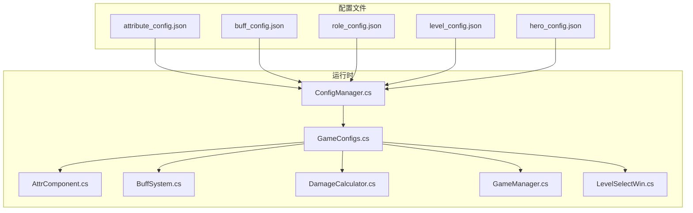
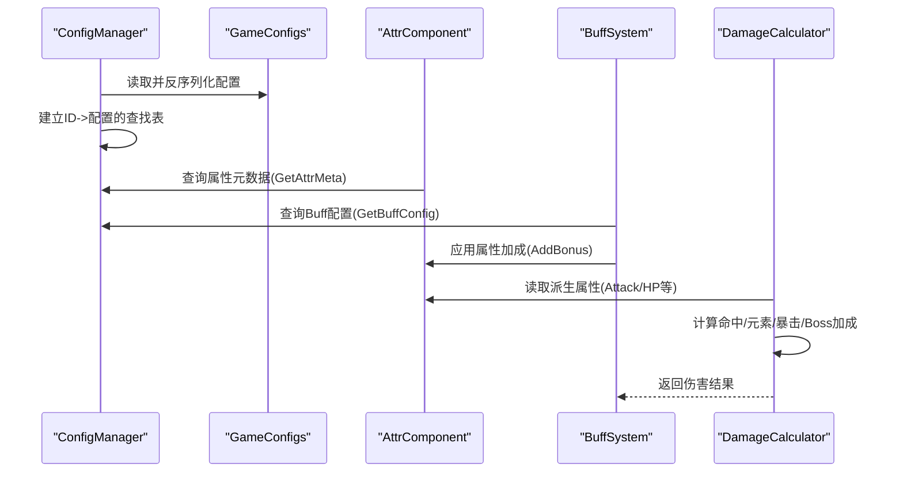
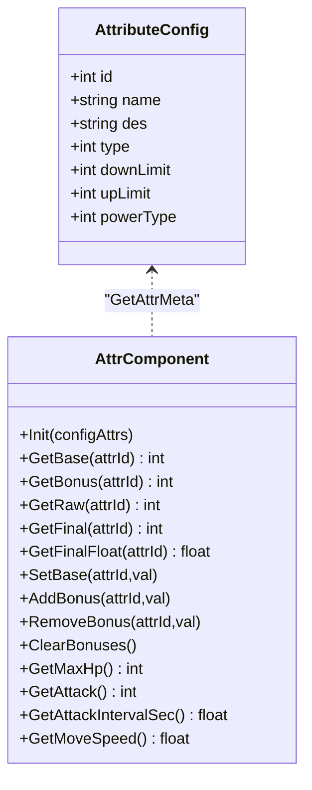
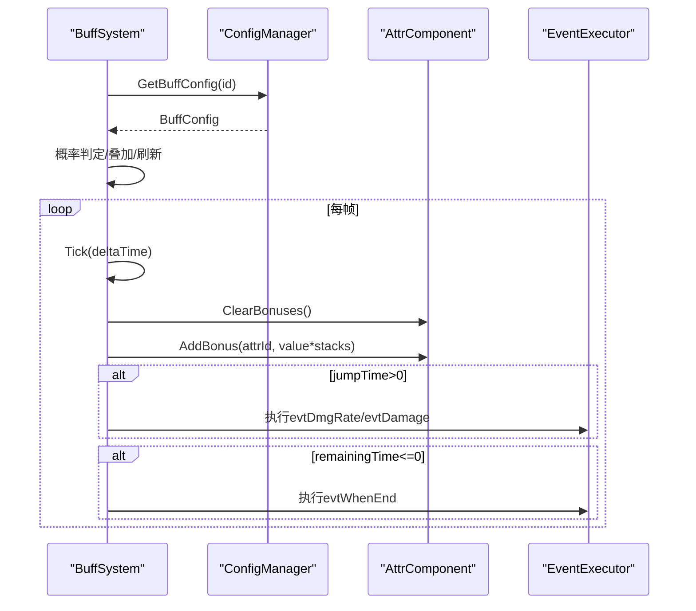
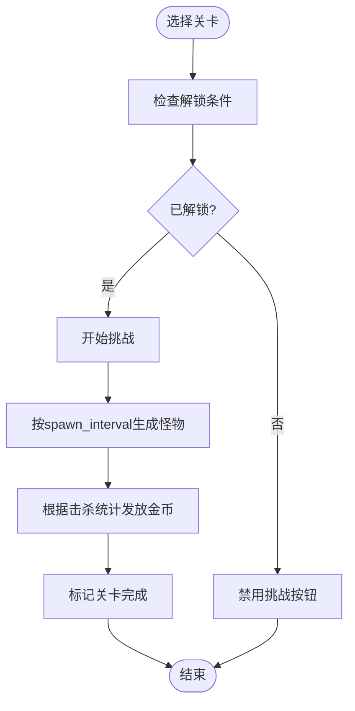
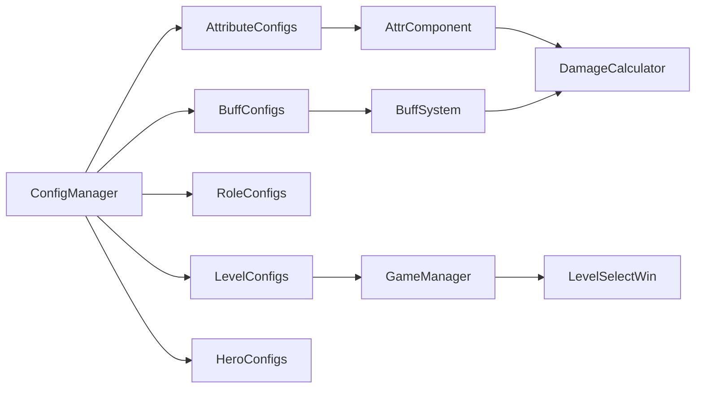

# 属性配置文件

<cite>
**本文档引用的文件**
- [attribute_config.json](file://Assets/Resources/Configs/attribute_config.json)
- [buff_config.json](file://Assets/Resources/Configs/buff_config.json)
- [role_config.json](file://Assets/Resources/Configs/role_config.json)
- [level_config.json](file://Assets/Resources/Configs/level_config.json)
- [hero_config.json](file://Assets/Resources/Configs/hero_config.json)
- [ConfigManager.cs](file://Assets/Scripts/Core/ConfigManager.cs)
- [GameConfigs.cs](file://Assets/Scripts/Data/GameConfigs.cs)
- [AttrComponent.cs](file://Assets/Scripts/Battle/AttrComponent.cs)
- [BuffSystem.cs](file://Assets/Scripts/Battle/BuffSystem.cs)
- [DamageCalculator.cs](file://Assets/Scripts/Battle/DamageCalculator.cs)
- [GameManager.cs](file://Assets/Scripts/Core/GameManager.cs)
- [LevelSelectWin.cs](file://Assets/Scripts/UI/LevelSelectWin.cs)
</cite>

## 目录
1. [简介](#简介)
2. [项目结构](#项目结构)
3. [核心组件](#核心组件)
4. [架构总览](#架构总览)
5. [详细组件分析](#详细组件分析)
6. [依赖关系分析](#依赖关系分析)
7. [性能考量](#性能考量)
8. [故障排查指南](#故障排查指南)
9. [结论](#结论)
10. [附录](#附录)

## 简介
本文件面向GeometryTD的属性配置体系，系统性梳理以下配置与运行时组件：
- 属性配置(attribute_config)：定义基础属性与特殊属性的元数据、取值范围与显示规则
- 增益配置(buff_config)：定义增益/减益效果的叠加、持续时间、跳伤、特殊事件与驱散规则
- 角色配置(role_config)：定义角色类型与预制体路径
- 等级配置(level_config)：定义关卡难度、生成节奏、奖励与解锁条件
- 英雄配置(hero_config)：定义英雄初始属性、技能经验机制与可选充能Buff

通过本文件，读者可以理解角色属性系统、增益效果机制、职业与等级经验设计，并掌握属性平衡性设计与调试评估方法。

## 项目结构
配置文件位于Resources/Configs目录，运行时由ConfigManager统一加载并缓存；属性与增益在战斗模块中由AttrComponent与BuffSystem消费；等级系统由GameManager与UI层共同协作。

图表来源
- [ConfigManager.cs:77-122](file://Assets/Scripts/Core/ConfigManager.cs#L77-L122)
- [GameConfigs.cs:10-120](file://Assets/Scripts/Data/GameConfigs.cs#L10-L120)

章节来源
- [ConfigManager.cs:77-122](file://Assets/Scripts/Core/ConfigManager.cs#L77-L122)
- [GameConfigs.cs:10-120](file://Assets/Scripts/Data/GameConfigs.cs#L10-L120)

## 核心组件
- ConfigManager：集中加载与索引所有配置，提供按ID查询接口
- GameConfigs：定义配置数据模型与常量（属性ID、事件类型、Buff特殊事件类型等）
- AttrComponent：角色属性容器与派生属性计算（上限、最终值、百分比换算）
- BuffSystem：增益/减益生命周期管理、叠加、跳伤、特殊事件执行
- DamageCalculator：基于属性的伤害计算流程（命中、元素加成/减免、暴击、Boss/精英加成）

章节来源
- [ConfigManager.cs:390-424](file://Assets/Scripts/Core/ConfigManager.cs#L390-L424)
- [GameConfigs.cs:10-83](file://Assets/Scripts/Data/GameConfigs.cs#L10-L83)
- [AttrComponent.cs:38-114](file://Assets/Scripts/Battle/AttrComponent.cs#L38-L114)
- [BuffSystem.cs:34-225](file://Assets/Scripts/Battle/BuffSystem.cs#L34-L225)
- [DamageCalculator.cs:24-103](file://Assets/Scripts/Battle/DamageCalculator.cs#L24-L103)

## 架构总览
配置到运行时的关键交互链路如下：
- ConfigManager.LoadAllConfigs加载各配置列表并建立字典索引
- AttrComponent使用AttributeConfigs元数据限制与换算属性值
- BuffSystem根据BuffConfig应用属性加成、执行跳伤与特殊事件
- DamageCalculator读取AttrComponent派生属性进行伤害结算

图表来源
- [ConfigManager.cs:77-122](file://Assets/Scripts/Core/ConfigManager.cs#L77-L122)
- [AttrComponent.cs:38-114](file://Assets/Scripts/Battle/AttrComponent.cs#L38-L114)
- [BuffSystem.cs:227-248](file://Assets/Scripts/Battle/BuffSystem.cs#L227-L248)
- [DamageCalculator.cs:24-103](file://Assets/Scripts/Battle/DamageCalculator.cs#L24-L103)

## 详细组件分析

### 属性配置(attribute_config)
- 数据结构
  - 属性条目：包含id、name、des、type、downLimit、upLimit、powerType
  - type：1=基础属性，2=特殊属性
  - powerType：0=直接值，1=万分比（如百分比）
  - downLimit/upLimit：属性上下限，AttrComponent在GetFinal阶段强制裁剪
- 字段定义与用途
  - 基础属性：生命值、攻击力
  - 元素伤害加成/减免：火/冰/风/电/全元素
  - 百分比加成：生命值百分比、攻击力百分比
  - 战斗相关：对Boss/精英伤害、护盾值、暴击率/伤害/抵抗、命中率、闪避率、攻击间隔、移动速度、攻击数量
  - 能量与熟练：火/冰/风/电能量、熟练、匠心、忘我（经验加成）、技能/奥术冷却、攻击数量
- 运行时处理
  - AttrComponent.GetFinal根据元数据上下限裁剪
  - AttrComponent.GetFinalFloat将万分比转换为浮点
  - 派生属性：最大生命值=基础生命*(10000+生命百分比)/10000；攻击=基础攻击*(10000+攻击力百分比)/10000；移动速度=万分比换算；攻击间隔毫秒转秒

图表来源
- [GameConfigs.cs:104-120](file://Assets/Scripts/Data/GameConfigs.cs#L104-L120)
- [AttrComponent.cs:11-127](file://Assets/Scripts/Battle/AttrComponent.cs#L11-L127)

章节来源
- [attribute_config.json:1-39](file://Assets/Resources/Configs/attribute_config.json#L1-L39)
- [GameConfigs.cs:104-120](file://Assets/Scripts/Data/GameConfigs.cs#L104-L120)
- [AttrComponent.cs:38-114](file://Assets/Scripts/Battle/AttrComponent.cs#L38-L114)

### 增益配置(buff_config)
- 数据结构
  - BuffConfig：包含id、name、icon、desc、overlap、probability、lastTime、jumpTime、persistJson、position、type、dispel、attribute、evtDmgRate、evtDamage、evtWhenEnd、specialEvent
  - type：1=增益，2=减益
  - attribute：持续属性变化（如移动速度-30%）
  - evtDmgRate：按万分比对施法者属性进行跳伤
  - specialEvent：特殊事件（如技能伤害变化、冰冻、反击）
- 运行时机制
  - BuffSystem.AddBuff按概率与叠加上限处理
  - BuffSystem.Tick驱动跳伤、事件触发与到期清理
  - ReapplyAttrBonuses在每帧重置并应用当前Buff带来的属性加成
  - 特殊事件：反击、冰冻、技能伤害/消耗变化等

图表来源
- [BuffSystem.cs:34-225](file://Assets/Scripts/Battle/BuffSystem.cs#L34-L225)
- [ConfigManager.cs:592-598](file://Assets/Scripts/Core/ConfigManager.cs#L592-L598)
- [GameConfigs.cs:218-243](file://Assets/Scripts/Data/GameConfigs.cs#L218-L243)

章节来源
- [buff_config.json:1-23](file://Assets/Resources/Configs/buff_config.json#L1-L23)
- [BuffSystem.cs:34-225](file://Assets/Scripts/Battle/BuffSystem.cs#L34-L225)
- [GameConfigs.cs:200-243](file://Assets/Scripts/Data/GameConfigs.cs#L200-L243)

### 角色配置(role_config)
- 数据结构
  - RoleConfig：id、name、prefabPath、portraitPath
- 作用
  - 提供角色类型与预制体路径，供ConfigManager预加载与查询
  - 支持Hero/Monster/Boss/Summon等不同类型角色

章节来源
- [role_config.json:1-14](file://Assets/Resources/Configs/role_config.json#L1-L14)
- [ConfigManager.cs:357-370](file://Assets/Scripts/Core/ConfigManager.cs#L357-L370)

### 等级配置(level_config)
- 数据结构
  - LevelConfig：id、name、des、bg、conditions、hard、spawn_interval、coinNormalKill、coinEliteKill、coinBossKill、coinSelfDestructRate、monsterList、superMList、bossList
- 设计要点
  - 关卡解锁：conditions引用前置关卡ID
  - 难度hard：影响怪物强度
  - 生成节奏：spawn_interval控制刷新频率
  - 奖励：击杀不同单位获得金币
  - 怪物编队：normal/elite/boss三类列表
- 运行时集成
  - GameManager根据conditions判断关卡是否解锁
  - UI层LevelSelectWin展示关卡详情与解锁状态

图表来源
- [GameManager.cs:76-99](file://Assets/Scripts/Core/GameManager.cs#L76-L99)
- [LevelSelectWin.cs:137-227](file://Assets/Scripts/UI/LevelSelectWin.cs#L137-L227)

章节来源
- [level_config.json:1-80](file://Assets/Resources/Configs/level_config.json#L1-L80)
- [GameManager.cs:76-99](file://Assets/Scripts/Core/GameManager.cs#L76-L99)
- [LevelSelectWin.cs:137-227](file://Assets/Scripts/UI/LevelSelectWin.cs#L137-L227)

### 英雄配置(hero_config)
- 数据结构
  - HeroConfig：id、name、description、role、attack_skill_ids、skill_xp_interval、skill_xp_min、skill_xp_max、attrs、charge_buff_ids
- 设计要点
  - 初始属性：通过attrs注入基础属性
  - 技能经验：按skill_xp_interval周期产生，范围为skill_xp_min~skill_xp_max
  - 充能Buff：蓄力期间获得的Buff（如忘我经验加成）
- 与属性系统的关系
  - 英雄初始属性来源于attribute_config的id/value映射
  - 技能经验影响角色成长曲线与Buff叠加

章节来源
- [hero_config.json:1-44](file://Assets/Resources/Configs/hero_config.json#L1-L44)
- [ConfigManager.cs:382-388](file://Assets/Scripts/Core/ConfigManager.cs#L382-L388)

## 依赖关系分析
- ConfigManager集中加载与索引attribute/buff/role/level/hero等配置，提供O(1)查询
- AttrComponent依赖AttributeConfigs元数据进行上下限与百分比换算
- BuffSystem依赖BuffConfigs与EventExecutor执行事件链
- DamageCalculator依赖AttrComponent派生属性进行伤害结算
- GameManager与UI层依赖LevelConfigs与ConditionConfigs进行关卡解锁与展示

图表来源
- [ConfigManager.cs:77-122](file://Assets/Scripts/Core/ConfigManager.cs#L77-L122)
- [GameConfigs.cs:10-120](file://Assets/Scripts/Data/GameConfigs.cs#L10-L120)

章节来源
- [ConfigManager.cs:77-122](file://Assets/Scripts/Core/ConfigManager.cs#L77-L122)
- [GameConfigs.cs:10-120](file://Assets/Scripts/Data/GameConfigs.cs#L10-L120)

## 性能考量
- 配置加载：ConfigManager一次性加载并缓存，避免重复IO
- 查询优化：Dictionary索引提供O(1)查找
- 属性计算：AttrComponent在每帧仅做简单加法与裁剪，开销极低
- Buff系统：每帧遍历当前Buff列表，建议控制单单位Buff数量以减少Tick开销
- 伤害计算：DamageCalculator为纯数学运算，瓶颈不在属性系统本身

## 故障排查指南
- 配置加载失败
  - 现象：日志报错“无法加载配置文件”或“配置文件解析失败”
  - 排查：确认JSON格式正确、字段名一致、资源路径存在
  - 参考：[ConfigManager.cs:200-215](file://Assets/Scripts/Core/ConfigManager.cs#L200-L215)
- 属性值异常
  - 现象：属性超出上下限或百分比未生效
  - 排查：检查attribute_config的downLimit/upLimit与powerType；确认AttrComponent.GetFinal与GetFinalFloat调用路径
  - 参考：[AttrComponent.cs:38-62](file://Assets/Scripts/Battle/AttrComponent.cs#L38-L62)
- Buff未生效或叠加异常
  - 现象：Buff概率不生效、叠加上限错误、跳伤未触发
  - 排查：核对buff_config的probability、overlap、jumpTime；检查BuffSystem.AddBuff与Tick逻辑
  - 参考：[BuffSystem.cs:34-225](file://Assets/Scripts/Battle/BuffSystem.cs#L34-L225)
- 伤害计算偏差
  - 现象：命中率、元素加成、暴击、Boss/精英加成不符合预期
  - 排查：核对DamageCalculator输入参数（命中率、闪避率、元素加成/减免、暴击/抗性、Boss/精英加成）
  - 参考：[DamageCalculator.cs:24-103](file://Assets/Scripts/Battle/DamageCalculator.cs#L24-L103)
- 关卡解锁问题
  - 现象：关卡不可挑战或条件显示异常
  - 排查：核对level_config的conditions与GameManager.IsLevelUnlocked逻辑
  - 参考：[GameManager.cs:76-99](file://Assets/Scripts/Core/GameManager.cs#L76-L99)，[LevelSelectWin.cs:137-227](file://Assets/Scripts/UI/LevelSelectWin.cs#L137-L227)

## 结论
本属性配置体系通过清晰的元数据定义与运行时组件分工，实现了：
- 明确的属性边界与百分比换算机制
- 可叠加、可驱散、可跳伤的增益/减益系统
- 与关卡难度、生成节奏、奖励机制联动的等级经验设计
- 可扩展的事件与特殊效果框架

建议在后续迭代中：
- 增设属性平衡性评估工具（如伤害曲线图、元素相克平衡矩阵）
- 完善调试面板：可视化当前属性、Buff堆叠与伤害构成
- 为关键数值设定默认上下限与提示文案，提升配置可维护性

## 附录

### 属性平衡性设计指南
- 数值递增规律
  - 基础属性：建议采用线性或平滑曲线增长，避免前期过弱或后期溢出
  - 百分比属性：建议以“固定上限+阈值递减”的方式，防止无限滚雪球
- 稀有度分级
  - 将属性加成按“普通/稀有/史诗/传说”分级，分别对应不同权重与上限
- 元素相克
  - 明确元素伤害加成与减免的上限，避免单一元素主导
- 平衡性评估
  - 通过DamageCalculator输出的伤害分布，绘制不同角色在不同关卡下的期望伤害曲线
  - 对比Buff叠加后的伤害放大倍率，确保不会出现“一回合秒杀”

### 调试方法与工具建议
- 配置校验
  - 在ConfigManager中添加字段完整性检查与默认值填充
- 运行时监控
  - 在AttrComponent与BuffSystem中增加日志输出，记录属性变更与Buff堆叠
- 可视化
  - 在UI中增加属性面板，实时显示基础值、加成、最终值与百分比换算
  - 在战斗界面增加伤害来源面板，标注命中、元素、暴击、Boss/精英加成的贡献