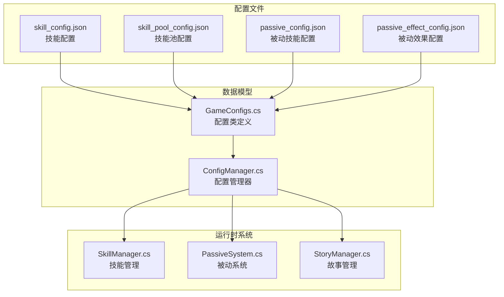
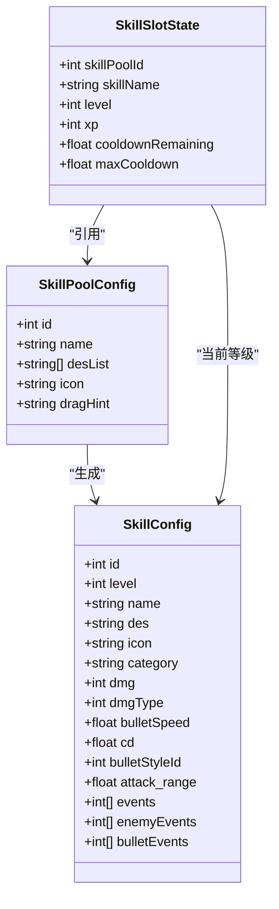
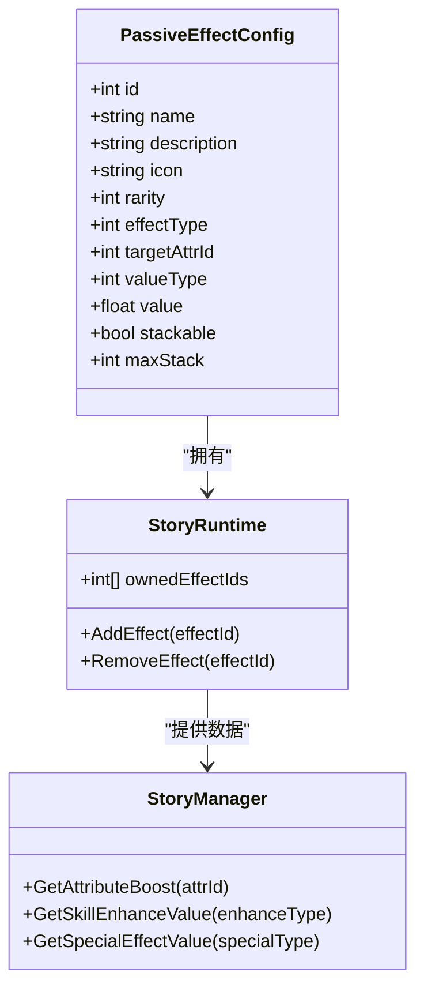
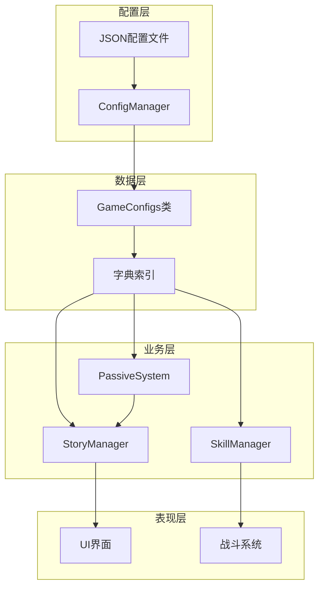
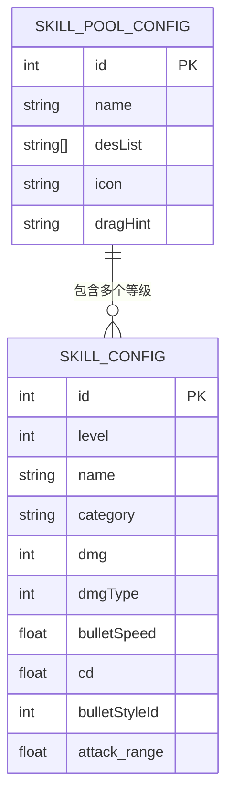
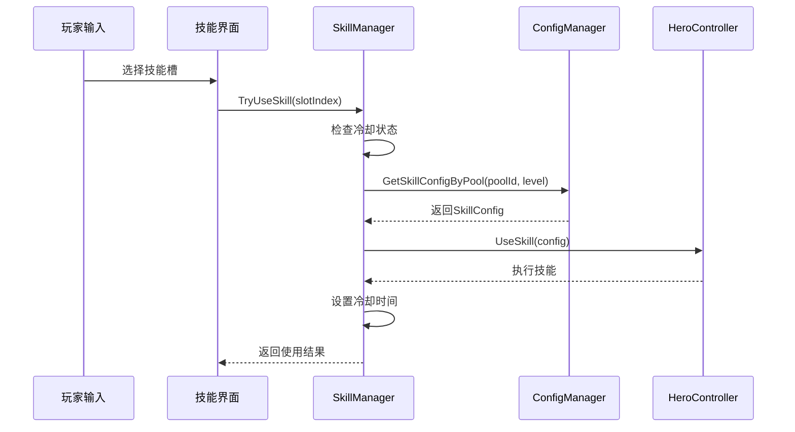
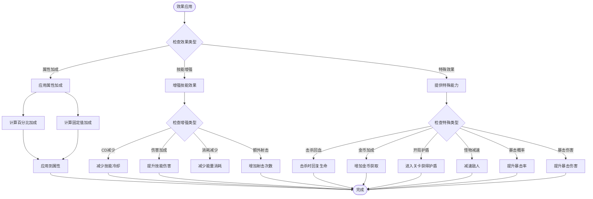
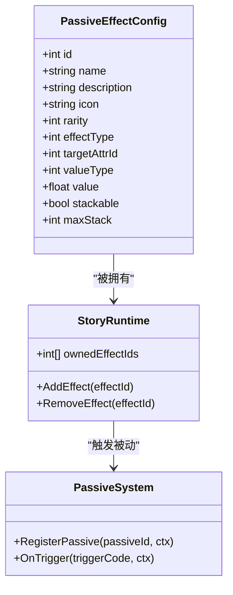
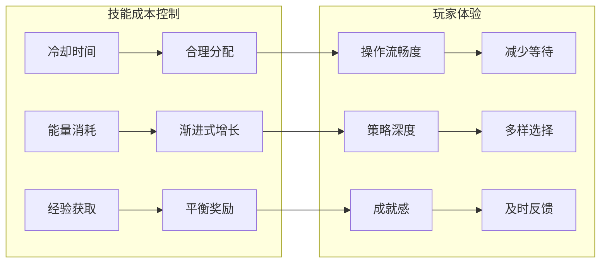
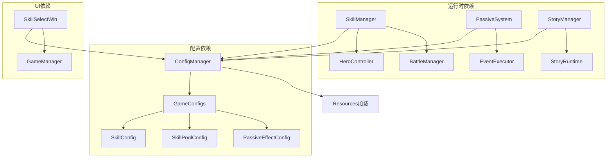

# 技能配置文件

<cite>
**本文档引用的文件**
- [skill_config.json](file://Assets/Resources/Configs/skill_config.json)
- [skill_pool_config.json](file://Assets/Resources/Configs/skill_pool_config.json)
- [passive_config.json](file://Assets/Resources/Configs/passive_config.json)
- [passive_effect_config.json](file://Assets/Resources/Configs/passive_effect_config.json)
- [GameConfigs.cs](file://Assets/Scripts/Data/GameConfigs.cs)
- [ConfigManager.cs](file://Assets/Scripts/Core/ConfigManager.cs)
- [SkillManager.cs](file://Assets/Scripts/Battle/SkillManager.cs)
- [StoryManager.cs](file://Assets/Scripts/Core/StoryManager.cs)
- [SkillSelectWin.cs](file://Assets/Scripts/UI/SkillSelectWin.cs)
- [PassiveSystem.cs](file://Assets/Scripts/Battle/PassiveSystem.cs)
</cite>

## 目录
1. [简介](#简介)
2. [项目结构](#项目结构)
3. [核心组件](#核心组件)
4. [架构概览](#架构概览)
5. [详细组件分析](#详细组件分析)
6. [依赖关系分析](#依赖关系分析)
7. [性能考虑](#性能考虑)
8. [故障排除指南](#故障排除指南)
9. [结论](#结论)
10. [附录](#附录)

## 简介

GeometryTD的技能系统是游戏的核心机制之一，通过配置驱动的方式实现了灵活的技能管理。本文档深入分析了技能配置文件的完整结构，包括技能配置(skill_config)、技能池配置(skill_pool_config)、被动技能配置(passive_config)和被动效果配置(passive_effect_config)。

技能系统采用"技能池 + 技能等级"的设计模式，每个技能池可以包含多个等级版本，通过经验值系统进行升级。同时，系统还集成了被动效果系统，通过藏品效果增强玩家能力。

## 项目结构

技能配置相关的核心文件分布如下：



**图表来源**
- [skill_config.json:1-800](file://Assets/Resources/Configs/skill_config.json#L1-L800)
- [GameConfigs.cs:371-427](file://Assets/Scripts/Data/GameConfigs.cs#L371-L427)
- [ConfigManager.cs:1-122](file://Assets/Scripts/Core/ConfigManager.cs#L1-L122)

**章节来源**
- [skill_config.json:1-800](file://Assets/Resources/Configs/skill_config.json#L1-L800)
- [skill_pool_config.json:1-59](file://Assets/Resources/Configs/skill_pool_config.json#L1-L59)
- [passive_config.json:1-1](file://Assets/Resources/Configs/passive_config.json#L1-L1)
- [passive_effect_config.json:1-131](file://Assets/Resources/Configs/passive_effect_config.json#L1-L131)

## 核心组件

### 技能配置系统

技能配置系统采用两级结构设计：

1. **技能池配置**：定义可选择的技能类别和基础信息
2. **技能等级配置**：基于技能池生成的具体技能实例



**图表来源**
- [GameConfigs.cs:371-427](file://Assets/Scripts/Data/GameConfigs.cs#L371-L427)
- [SkillManager.cs:5-13](file://Assets/Scripts/Battle/SkillManager.cs#L5-L13)

### 被动效果系统

被动效果系统提供了强大的角色增强机制：



**图表来源**
- [GameConfigs.cs:729-742](file://Assets/Scripts/Data/GameConfigs.cs#L729-L742)
- [StoryManager.cs:377-451](file://Assets/Scripts/Core/StoryManager.cs#L377-L451)

**章节来源**
- [GameConfigs.cs:371-427](file://Assets/Scripts/Data/GameConfigs.cs#L371-L427)
- [GameConfigs.cs:729-742](file://Assets/Scripts/Data/GameConfigs.cs#L729-L742)
- [SkillManager.cs:1-170](file://Assets/Scripts/Battle/SkillManager.cs#L1-L170)

## 架构概览

技能系统整体架构采用配置驱动的设计模式：



**图表来源**
- [ConfigManager.cs:77-122](file://Assets/Scripts/Core/ConfigManager.cs#L77-L122)
- [GameConfigs.cs:371-427](file://Assets/Scripts/Data/GameConfigs.cs#L371-L427)

## 详细组件分析

### 技能配置文件详解

#### 基础属性配置

技能配置文件包含了以下关键属性：

| 属性名 | 类型 | 必需 | 描述 |
|--------|------|------|------|
| id | int | 是 | 技能唯一标识符 |
| level | int | 是 | 技能等级 (0表示初始状态) |
| name | string | 是 | 技能显示名称 |
| category | string | 否 | 技能分类 (Self/Projectile/Aoe/Shield/Summon) |
| dmg | int | 否 | 基础伤害值 |
| dmgType | int | 否 | 伤害类型 (0=物理, 1=火焰, 2=冰霜等) |
| bulletSpeed | float | 否 | 子弹飞行速度 |
| cd | float | 否 | 冷却时间(秒) |
| bulletStyleId | int | 否 | 子弹样式ID |
| attack_range | float | 否 | 攻击范围 |
| events | int[] | 否 | 自身事件ID数组 |
| enemyEvents | int[] | 否 | 敌方事件ID数组 |
| bulletEvents | int[] | 否 | 子弹事件ID数组 |

#### 技能池配置结构

技能池配置定义了可选择的技能类别：



**图表来源**
- [GameConfigs.cs:371-427](file://Assets/Scripts/Data/GameConfigs.cs#L371-L427)

#### 技能使用流程



**图表来源**
- [SkillManager.cs:87-137](file://Assets/Scripts/Battle/SkillManager.cs#L87-L137)
- [ConfigManager.cs:224-227](file://Assets/Scripts/Core/ConfigManager.cs#L224-L227)

**章节来源**
- [skill_config.json:1-800](file://Assets/Resources/Configs/skill_config.json#L1-L800)
- [skill_pool_config.json:1-59](file://Assets/Resources/Configs/skill_pool_config.json#L1-L59)
- [GameConfigs.cs:371-427](file://Assets/Scripts/Data/GameConfigs.cs#L371-L427)
- [SkillManager.cs:87-137](file://Assets/Scripts/Battle/SkillManager.cs#L87-L137)

### 被动技能配置分析

#### 被动效果类型系统

被动效果系统支持三种主要类型：

1. **属性加成 (AttributeBoost)**: 直接提升角色属性
2. **技能增强 (SkillEnhance)**: 增强技能效果
3. **特殊效果 (Special)**: 提供特殊能力



**图表来源**
- [GameConfigs.cs:578-611](file://Assets/Scripts/Data/GameConfigs.cs#L578-L611)
- [StoryManager.cs:377-451](file://Assets/Scripts/Core/StoryManager.cs#L377-L451)

#### 藏品效果管理



**图表来源**
- [GameConfigs.cs:729-742](file://Assets/Scripts/Data/GameConfigs.cs#L729-L742)
- [StoryManager.cs:66-105](file://Assets/Scripts/Core/StoryManager.cs#L66-L105)

**章节来源**
- [passive_config.json:1-1](file://Assets/Resources/Configs/passive_config.json#L1-L1)
- [passive_effect_config.json:1-131](file://Assets/Resources/Configs/passive_effect_config.json#L1-L131)
- [GameConfigs.cs:578-611](file://Assets/Scripts/Data/GameConfigs.cs#L578-L611)
- [StoryManager.cs:66-105](file://Assets/Scripts/Core/StoryManager.cs#L66-L105)

### 技能平衡性设计指南

#### 伤害输出平衡

| 技能类型 | 基础伤害 | 升级机制 | 平衡要点 |
|----------|----------|----------|----------|
| 远程技能 | 10000 | 每级+1000 | 控制成长曲线，避免过早碾压 |
| 自身技能 | 0 | 生命值相关 | 与伤害技能保持等价交换 |
| 范围技能 | 中等 | 等比增长 | 注意叠伤上限和覆盖率 |

#### 资源消耗优化



#### 实用性评估框架

1. **频率评估**: 技能使用频率和时机
2. **效率评估**: 单次使用的性价比
3. **组合评估**: 与其他技能的协同效果
4. **适应性评估**: 对不同敌人和场景的适用性

**章节来源**
- [skill_config.json:1-800](file://Assets/Resources/Configs/skill_config.json#L1-L800)
- [GameConfigs.cs:587-604](file://Assets/Scripts/Data/GameConfigs.cs#L587-L604)

## 依赖关系分析

技能系统各组件之间的依赖关系如下：



**图表来源**
- [ConfigManager.cs:1-122](file://Assets/Scripts/Core/ConfigManager.cs#L1-L122)
- [SkillManager.cs:15-23](file://Assets/Scripts/Battle/SkillManager.cs#L15-L23)
- [SkillSelectWin.cs:49-73](file://Assets/Scripts/UI/SkillSelectWin.cs#L49-L73)

**章节来源**
- [ConfigManager.cs:1-122](file://Assets/Scripts/Core/ConfigManager.cs#L1-L122)
- [SkillManager.cs:15-23](file://Assets/Scripts/Battle/SkillManager.cs#L15-L23)
- [SkillSelectWin.cs:49-73](file://Assets/Scripts/UI/SkillSelectWin.cs#L49-L73)

## 性能考虑

### 配置加载优化

1. **延迟加载**: 配置文件在首次访问时才加载
2. **字典缓存**: 使用字典索引提高查询效率
3. **预制体缓存**: 子弹和特效预制体缓存避免重复加载

### 运行时性能

1. **技能冷却管理**: 使用增量更新而非逐帧检查
2. **被动系统优化**: 只处理活跃的被动效果
3. **UI更新节流**: 技能槽UI更新频率限制

### 内存管理

1. **对象池**: 子弹和特效使用对象池复用
2. **垃圾回收**: 避免频繁的临时对象创建
3. **引用管理**: 合理的生命周期管理

## 故障排除指南

### 常见配置错误

#### 技能配置错误

**问题**: 技能无法使用
**原因**: 
- 冷却时间设置为0
- 技能等级为0但尝试使用
- 技能池ID不存在

**解决方案**:
1. 检查技能配置中的cd字段
2. 确保技能等级大于0
3. 验证技能池ID在skill_pool_config中存在

#### 被动效果错误

**问题**: 被动效果不生效
**原因**:
- 藏品ID配置错误
- 效果类型参数不匹配
- 数值类型设置错误

**解决方案**:
1. 验证PassiveEffectConfig的effectType和targetAttrId
2. 检查数值类型(valueType)与value的对应关系
3. 确认藏品在StoryRuntime中正确拥有

### 调试方法

#### 日志监控

```csharp
// 技能使用日志
Debug.Log($"[SkillManager] 使用技能: {skillName}, 等级: {level}, 冷却: {cooldown}");

// 配置加载日志  
Debug.Log($"[ConfigManager] 加载配置: {configPath}, 成功: {success}");

// 被动效果日志
Debug.Log($"[PassiveSystem] 触发被动: {effectName}, 效果: {effectType}");
```

#### 性能分析

1. **帧率监控**: 使用Unity Profiler监控技能使用时的性能
2. **内存使用**: 监控配置加载和技能实例化的内存占用
3. **GC压力**: 观察技能系统对垃圾回收的影响

**章节来源**
- [ConfigManager.cs:574-580](file://Assets/Scripts/Core/ConfigManager.cs#L574-L580)
- [SkillManager.cs:87-137](file://Assets/Scripts/Battle/SkillManager.cs#L87-L137)

## 结论

GeometryTD的技能配置系统通过精心设计的配置文件和运行时系统，实现了高度灵活和可扩展的技能管理机制。系统的关键优势包括：

1. **配置驱动**: 通过JSON配置实现快速迭代和平衡调整
2. **模块化设计**: 技能池、技能等级、被动效果相互独立
3. **性能优化**: 字典索引、预制体缓存等优化措施
4. **用户体验**: 清晰的UI反馈和流畅的操作体验

建议在后续开发中重点关注：
- 技能平衡性的持续测试和调整
- 配置文件的版本管理和向后兼容
- 性能监控和优化
- 用户反馈收集和功能扩展

## 附录

### 配置文件格式参考

#### 技能配置示例
```json
{
  "id": 1001,
  "level": 1,
  "name": "剑气",
  "category": "Projectile",
  "dmg": 10000,
  "dmgType": 0,
  "bulletSpeed": 10.0,
  "cd": 0,
  "bulletStyleId": 1,
  "attack_range": 10.0,
  "events": [],
  "enemyEvents": [],
  "bulletEvents": []
}
```

#### 技能池配置示例
```json
{
  "id": 1001,
  "name": "烈焰圣弹",
  "desList": ["发射炽热的火焰弹", "[升级效果]额外发射一枚"],
  "icon": "Icon/commet-128",
  "dragHint": "松开发射弹幕"
}
```

#### 被动效果配置示例
```json
{
  "id": 1,
  "name": "虚空之心",
  "description": "生命值提升20%",
  "icon": "Icon/void_heart",
  "rarity": 2,
  "effectType": 1,
  "targetAttrId": 1,
  "valueType": 1,
  "value": 20,
  "stackable": true,
  "maxStack": 3
}
```