# 故事配置文件

<cite>
**本文档引用的文件**
- [story_node_config.json](file://Assets/Resources/Configs/story_node_config.json)
- [story_collection_config.json](file://Assets/Resources/Configs/story_collection_config.json)
- [dialogue_config.json](file://Assets/Resources/Configs/dialogue_config.json)
- [choice_option_config.json](file://Assets/Resources/Configs/choice_option_config.json)
- [event_config.json](file://Assets/Resources/Configs/event_config.json)
- [event_effect_config.json](file://Assets/Resources/Configs/event_effect_config.json)
- [event_shop_config.json](file://Assets/Resources/Configs/event_shop_config.json)
- [StoryManager.cs](file://Assets/Scripts/Core/StoryManager.cs)
- [StoryRuntime.cs](file://Assets/Scripts/Data/StoryRuntime.cs)
- [ConfigManager.cs](file://Assets/Scripts/Core/ConfigManager.cs)
- [GameConfigs.cs](file://Assets/Scripts/Data/GameConfigs.cs)
- [EventSceneUI.cs](file://Assets/Scripts/UI/EventSceneUI.cs)
</cite>

## 目录
1. [简介](#简介)
2. [项目结构](#项目结构)
3. [核心组件](#核心组件)
4. [架构概览](#架构概览)
5. [详细组件分析](#详细组件分析)
6. [依赖分析](#依赖分析)
7. [性能考虑](#性能考虑)
8. [故障排除指南](#故障排除指南)
9. [结论](#结论)
10. [附录](#附录)

## 简介

GeometryTD 的故事配置系统是一个完整的叙事驱动引擎，通过精心设计的配置文件和运行时管理系统，为玩家提供丰富的分支剧情体验。该系统支持多种故事节点类型、复杂的分支逻辑、动态的事件触发机制以及深度的角色成长系统。

故事配置系统的核心价值在于其高度模块化的设计，允许创作者通过简单的 JSON 配置文件构建复杂的叙事结构，而无需编写代码。系统支持三种主要的故事节点类型：战斗节点、事件节点和商店节点，并通过精巧的条件匹配机制实现多线程的分支剧情。

## 项目结构

故事配置系统采用分层架构设计，将配置数据与运行时逻辑分离，确保了系统的可维护性和扩展性。

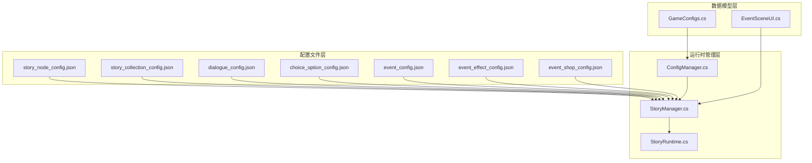

**图表来源**
- [StoryManager.cs:1-589](file://Assets/Scripts/Core/StoryManager.cs#L1-L589)
- [ConfigManager.cs:1-619](file://Assets/Scripts/Core/ConfigManager.cs#L1-L619)
- [GameConfigs.cs:557-775](file://Assets/Scripts/Data/GameConfigs.cs#L557-L775)

**章节来源**
- [StoryManager.cs:1-589](file://Assets/Scripts/Core/StoryManager.cs#L1-L589)
- [ConfigManager.cs:1-619](file://Assets/Scripts/Core/ConfigManager.cs#L1-L619)

## 核心组件

### 故事节点配置 (StoryNodeConfig)

故事节点是整个叙事系统的基础单元，每个节点代表故事中的一个关键时刻或场景。节点配置包含了丰富的元数据和行为定义。

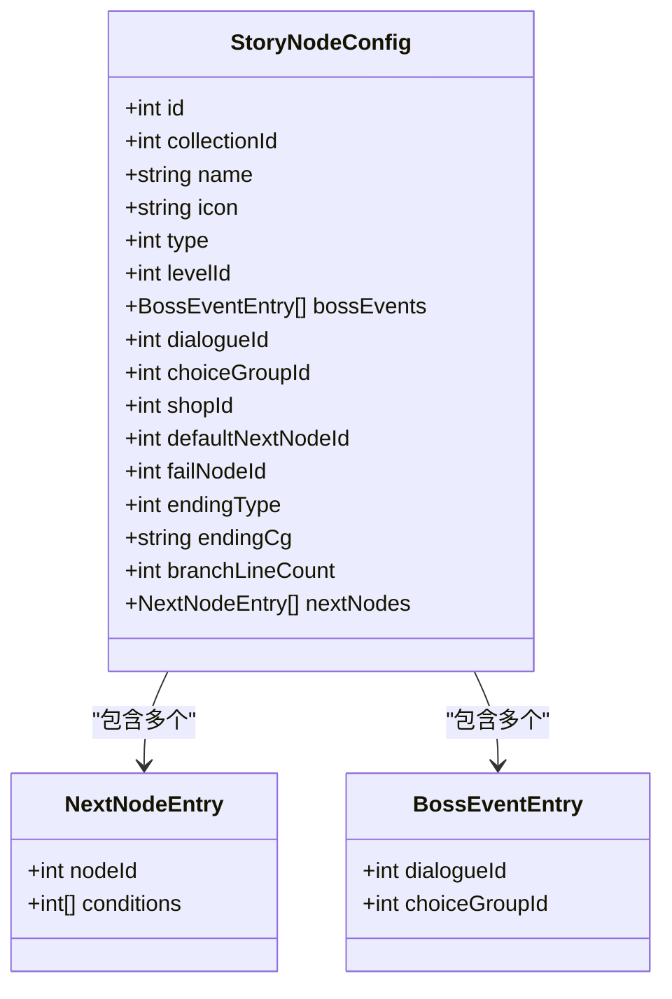

**图表来源**
- [GameConfigs.cs:641-667](file://Assets/Scripts/Data/GameConfigs.cs#L641-L667)
- [GameConfigs.cs:642-646](file://Assets/Scripts/Data/GameConfigs.cs#L642-L646)
- [GameConfigs.cs:635-639](file://Assets/Scripts/Data/GameConfigs.cs#L635-L639)

### 故事集合配置 (StoryCollectionConfig)

故事集合定义了完整的叙事弧线，包含起始节点、结束节点集合以及基本元数据。

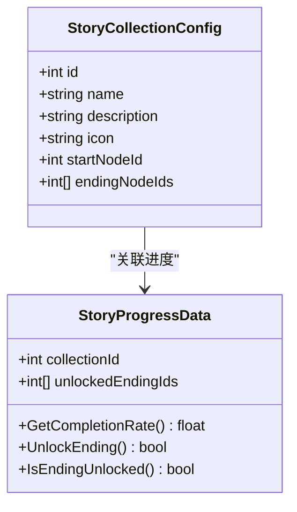

**图表来源**
- [GameConfigs.cs:616-624](file://Assets/Scripts/Data/GameConfigs.cs#L616-L624)
- [StoryRuntime.cs:224-263](file://Assets/Scripts/Data/StoryRuntime.cs#L224-L263)

### 对话配置 (DialogueConfig)

对话系统支持多角色、多场景的复杂对话流程，每个对话包含多个对话行。

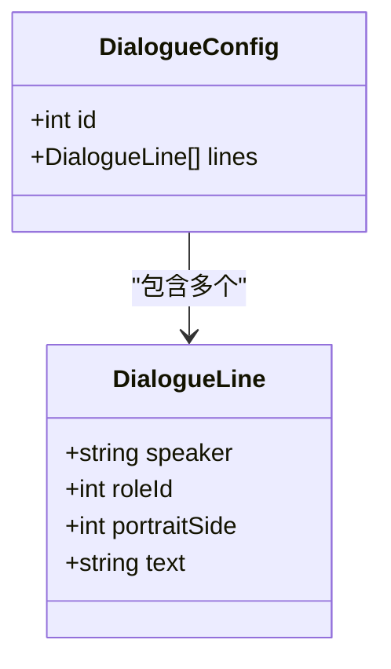

**图表来源**
- [GameConfigs.cs:687-691](file://Assets/Scripts/Data/GameConfigs.cs#L687-L691)
- [GameConfigs.cs:678-684](file://Assets/Scripts/Data/GameConfigs.cs#L678-L684)

### 选择选项配置 (ChoiceGroupConfig)

选择系统提供了丰富的分支决策机制，每个选择组包含多个选项，每个选项都有独特的效果和后果。

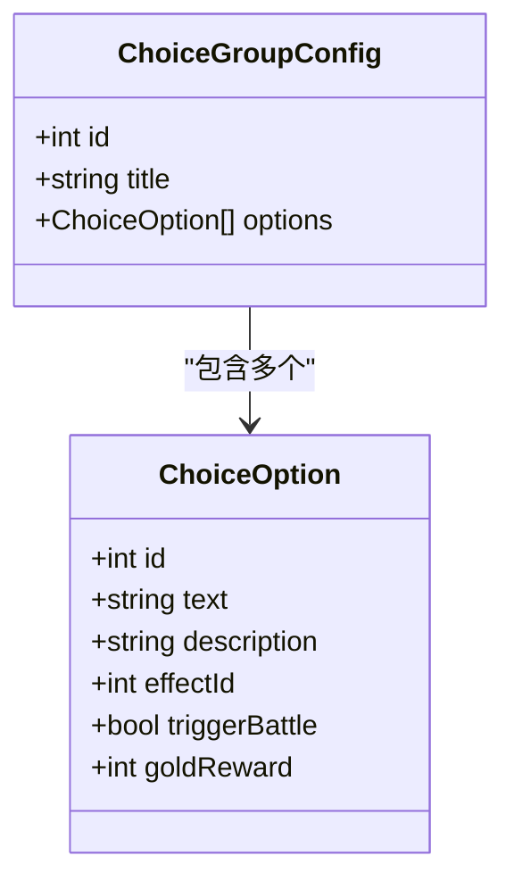

**图表来源**
- [GameConfigs.cs:713-718](file://Assets/Scripts/Data/GameConfigs.cs#L713-L718)
- [GameConfigs.cs:702-710](file://Assets/Scripts/Data/GameConfigs.cs#L702-L710)

### 事件系统配置

事件系统是故事配置的核心执行引擎，支持多种类型的事件效果和触发机制。

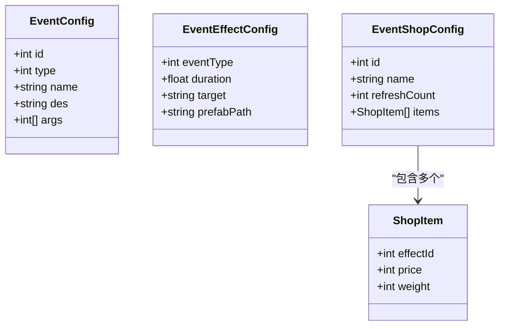

**图表来源**
- [event_config.json:1-116](file://Assets/Resources/Configs/event_config.json#L1-L116)
- [event_effect_config.json:1-19](file://Assets/Resources/Configs/event_effect_config.json#L1-L19)
- [event_shop_config.json:1-30](file://Assets/Resources/Configs/event_shop_config.json#L1-L30)

**章节来源**
- [GameConfigs.cs:557-775](file://Assets/Scripts/Data/GameConfigs.cs#L557-L775)
- [event_config.json:1-116](file://Assets/Resources/Configs/event_config.json#L1-L116)
- [event_effect_config.json:1-19](file://Assets/Resources/Configs/event_effect_config.json#L1-L19)
- [event_shop_config.json:1-30](file://Assets/Resources/Configs/event_shop_config.json#L1-L30)

## 架构概览

故事配置系统采用经典的三层架构模式，实现了配置数据与业务逻辑的清晰分离。

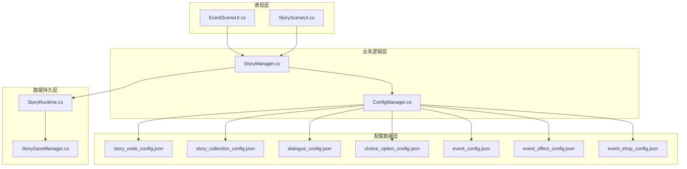

**图表来源**
- [StoryManager.cs:1-589](file://Assets/Scripts/Core/StoryManager.cs#L1-L589)
- [ConfigManager.cs:1-619](file://Assets/Scripts/Core/ConfigManager.cs#L1-L619)
- [EventSceneUI.cs:51-100](file://Assets/Scripts/UI/EventSceneUI.cs#L51-L100)

系统的核心执行流程遵循以下模式：

1. **配置加载阶段**：ConfigManager 负责加载所有 JSON 配置文件并建立查询索引
2. **运行时管理阶段**：StoryManager 管理故事的完整生命周期，包括开始、继续、推进和结束
3. **状态持久化阶段**：StoryRuntime 和 StorySaveManager 负责状态的保存和恢复
4. **用户交互阶段**：EventSceneUI 和 StorySceneUI 提供用户界面反馈

**章节来源**
- [StoryManager.cs:96-155](file://Assets/Scripts/Core/StoryManager.cs#L96-L155)
- [ConfigManager.cs:77-122](file://Assets/Scripts/Core/ConfigManager.cs#L77-L122)

## 详细组件分析

### 故事节点类型与连接关系

系统支持四种主要的故事节点类型，每种类型都有特定的行为和视觉表现：

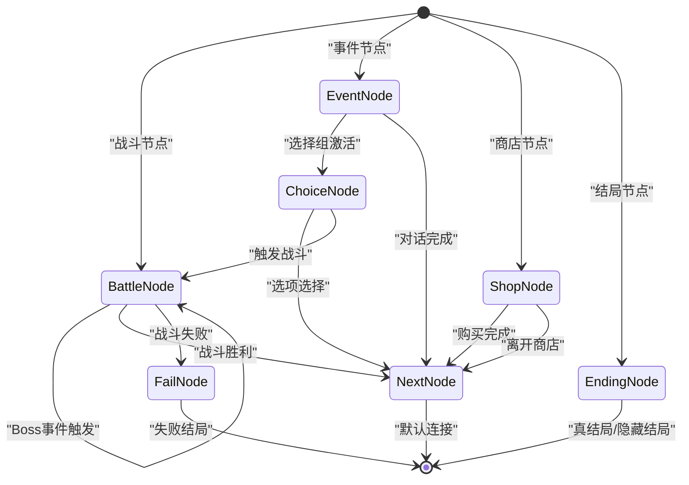

**图表来源**
- [GameConfigs.cs:560-576](file://Assets/Scripts/Data/GameConfigs.cs#L560-L576)
- [StoryManager.cs:539-560](file://Assets/Scripts/Core/StoryManager.cs#L539-L560)

#### 节点连接机制

节点之间的连接通过条件匹配实现，这是系统最复杂的部分之一：

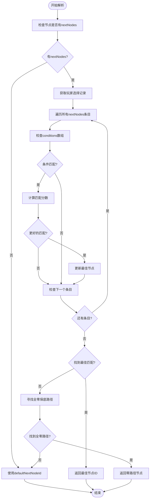

**图表来源**
- [StoryRuntime.cs:120-193](file://Assets/Scripts/Data/StoryRuntime.cs#L120-L193)

**章节来源**
- [StoryRuntime.cs:120-193](file://Assets/Scripts/Data/StoryRuntime.cs#L120-L193)
- [StoryManager.cs:171-186](file://Assets/Scripts/Core/StoryManager.cs#L171-L186)

### 分支剧情设计原理

分支剧情系统通过"条件匹配"机制实现复杂的叙事分支，每个节点可以有多个出口，每个出口都有特定的条件要求。

#### 条件系统详解

条件数组中的每个元素代表对相应选项组的要求：
- `0`：通配符，表示任意选择都满足
- `n`：具体数值，表示必须选择第 n 个选项
- 数组长度决定了节点包含的选项组数量

#### 分支线计数机制

`branchLineCount` 字段用于控制节点的分支数量，影响 UI 显示和玩家选择体验。

**章节来源**
- [story_node_config.json:1-305](file://Assets/Resources/Configs/story_node_config.json#L1-L305)

### 事件系统配置机制

事件系统是故事配置的核心执行引擎，负责处理各种游戏内事件和效果。

#### 事件类型分类

系统支持九种主要的事件类型，每种类型都有特定的效果和应用场景：

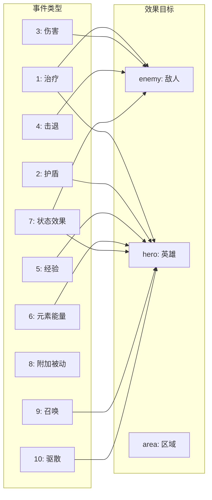

**图表来源**
- [event_config.json:1-116](file://Assets/Resources/Configs/event_config.json#L1-L116)

#### 事件效果映射

事件效果配置定义了事件类型与视觉特效的映射关系：

| 事件类型 | 目标类型 | 默认特效 |
|---------|---------|---------|
| 1-10 | enemy/hero/area | 对应的特效预制体 |
| 11-20 | hero/area | 特殊效果 |
| 其他 | hero/area | 状态效果 |

**章节来源**
- [event_config.json:1-116](file://Assets/Resources/Configs/event_config.json#L1-L116)
- [event_effect_config.json:1-19](file://Assets/Resources/Configs/event_effect_config.json#L1-L19)

### 商店系统配置

商店系统为玩家提供物品购买和藏品获取的机制，支持权重随机生成和价格系统。

#### 商店配置结构

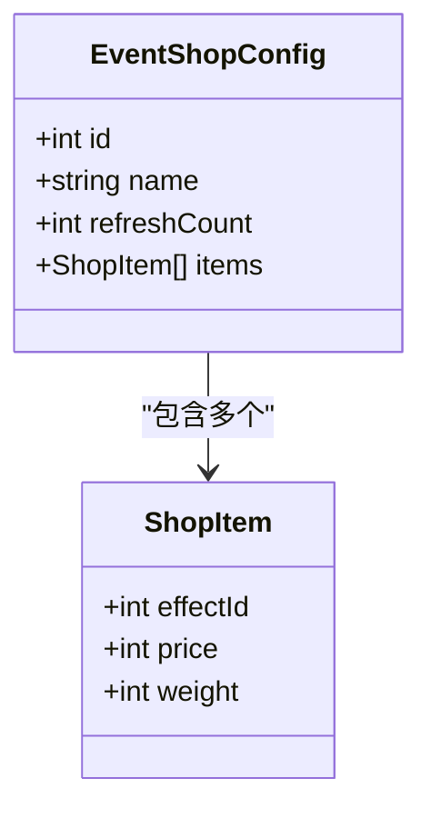

**图表来源**
- [event_shop_config.json:1-30](file://Assets/Resources/Configs/event_shop_config.json#L1-L30)

商店系统的关键特性：
- **刷新机制**：`refreshCount` 控制商店刷新频率
- **权重系统**：`weight` 决定物品出现概率
- **价格系统**：`price` 定义购买成本

**章节来源**
- [event_shop_config.json:1-30](file://Assets/Resources/Configs/event_shop_config.json#L1-L30)

## 依赖分析

故事配置系统建立了清晰的依赖关系，确保各组件间的松耦合和高内聚。

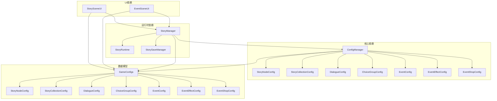

**图表来源**
- [ConfigManager.cs:47-54](file://Assets/Scripts/Core/ConfigManager.cs#L47-L54)
- [StoryManager.cs:28-52](file://Assets/Scripts/Core/StoryManager.cs#L28-L52)

### 循环依赖检测

经过分析，系统不存在循环依赖：
- 配置文件是纯数据，无运行时逻辑
- ConfigManager 依赖 GameConfigs 的数据模型
- StoryManager 依赖 ConfigManager 的查询接口
- UI 组件只依赖 StoryManager 的公共接口

这种设计确保了系统的稳定性和可测试性。

**章节来源**
- [ConfigManager.cs:1-619](file://Assets/Scripts/Core/ConfigManager.cs#L1-L619)
- [StoryManager.cs:1-589](file://Assets/Scripts/Core/StoryManager.cs#L1-L589)

## 性能考虑

故事配置系统在设计时充分考虑了性能优化，特别是在大规模配置数据处理方面。

### 内存优化策略

1. **延迟加载**：ConfigManager 使用字典索引缓存配置数据，避免重复解析
2. **按需加载**：UI 组件只在需要时访问相关配置
3. **序列化优化**：运行时状态使用 `[Serializable]` 标记，便于快速序列化

### 查询性能优化

```mermaid
flowchart TD
A[配置加载] --> B[建立字典索引]
B --> C[O(1) 查询]
C --> D[减少遍历开销]
E[运行时查询] --> F[直接索引访问]
F --> G[避免线性搜索]
```

**图表来源**
- [ConfigManager.cs:47-54](file://Assets/Scripts/Core/ConfigManager.cs#L47-L54)

### 存储优化

- **增量保存**：只保存运行时状态，不保存整个配置
- **压缩存储**：使用 JSON 序列化，占用空间小
- **持久化策略**：支持中途存档和永久进度分离

## 故障排除指南

### 常见配置错误

#### 节点连接错误
- **问题**：`nextNodes` 条件数组长度与选项组数量不匹配
- **解决方案**：确保每个节点的 `branchLineCount` 与 `nextNodes` 数组长度一致

#### 故事集合配置错误
- **问题**：`startNodeId` 或 `endingNodeIds` 引用不存在的节点
- **解决方案**：验证所有节点 ID 的有效性

#### 事件配置错误
- **问题**：`effectId` 与实际配置不匹配
- **解决方案**：检查事件配置与效果配置的一致性

### 运行时错误诊断

#### 节点解析失败
当 `ResolveNextNodeId` 返回 0 时，通常表示：
1. 配置文件损坏
2. 选项组 ID 错误
3. 条件数组格式不正确

#### Boss 事件处理异常
当 `GetCurrentBossEvent` 返回 null 时：
1. 检查节点的 `bossEvents` 配置
2. 确认 Boss 事件索引重置逻辑
3. 验证事件触发条件

**章节来源**
- [StoryRuntime.cs:120-193](file://Assets/Scripts/Data/StoryRuntime.cs#L120-L193)
- [StoryManager.cs:306-326](file://Assets/Scripts/Core/StoryManager.cs#L306-L326)

## 结论

GeometryTD 的故事配置系统展现了优秀的架构设计和工程实践。通过将配置数据与运行时逻辑分离，系统实现了高度的模块化和可扩展性。四个核心组件（故事节点、故事集合、对话系统、选择系统）协同工作，为玩家提供了丰富的分支剧情体验。

系统的创新之处在于：
1. **条件驱动的分支机制**：通过智能的条件匹配实现复杂的叙事分支
2. **事件驱动的交互**：灵活的事件系统支持多样化的游戏玩法
3. **模块化的配置结构**：清晰的数据模型便于维护和扩展
4. **完善的运行时管理**：从加载到持久化的完整生命周期管理

这些特性使得该系统不仅适用于当前的游戏项目，也为未来的扩展和定制提供了坚实的基础。

## 附录

### 配置文件格式参考

#### 故事节点配置字段说明
- `id`: 节点唯一标识符
- `collectionId`: 所属故事集合
- `type`: 节点类型（1-战斗，2-事件，3-商店，4-结局）
- `nextNodes`: 下一节点连接定义
- `bossEvents`: Boss 死亡事件序列
- `endingType`: 结局类型（1-普通，2-真结局，3-隐藏，4-失败）

#### 事件配置字段说明
- `id`: 事件唯一标识符
- `type`: 事件类型（1-治疗，2-护盾，3-伤害等）
- `args`: 参数数组，包含具体的数值和效果参数

### 最佳实践建议

1. **配置组织**：按照故事主题组织配置文件，便于维护
2. **命名规范**：使用有意义的 ID 和名称，便于调试
3. **版本控制**：为重要的配置变更添加注释说明
4. **测试验证**：定期验证配置的完整性和一致性
5. **性能监控**：关注配置加载和运行时性能指标