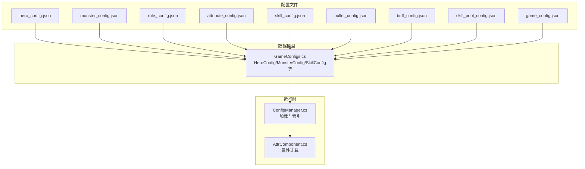
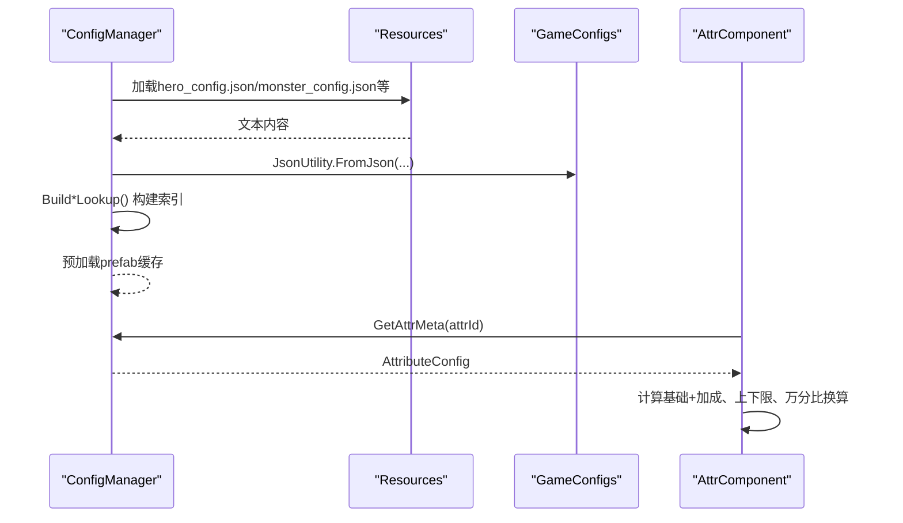
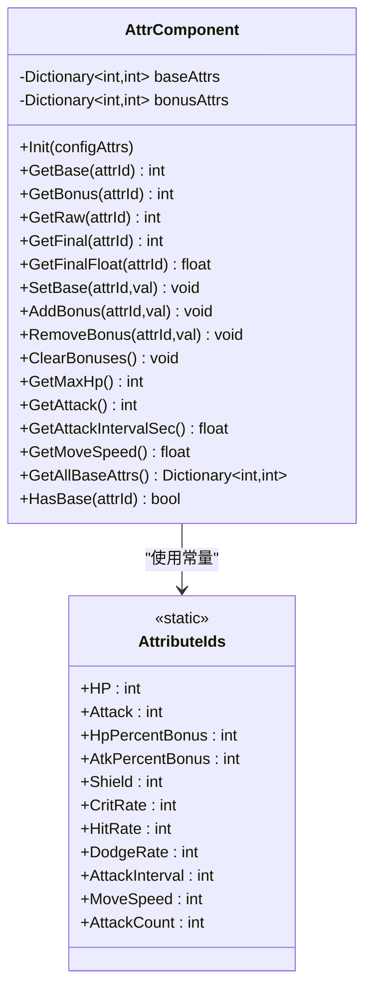
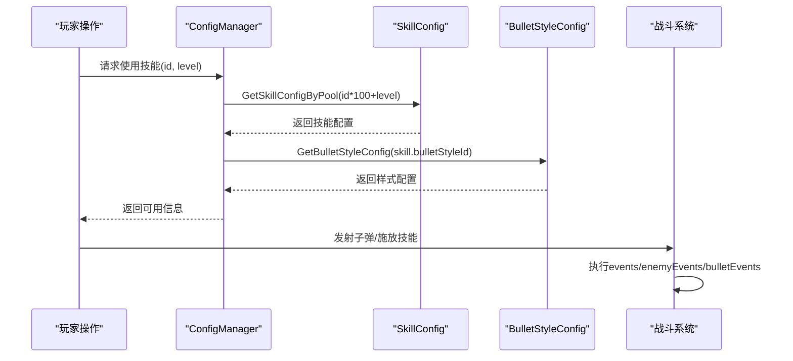
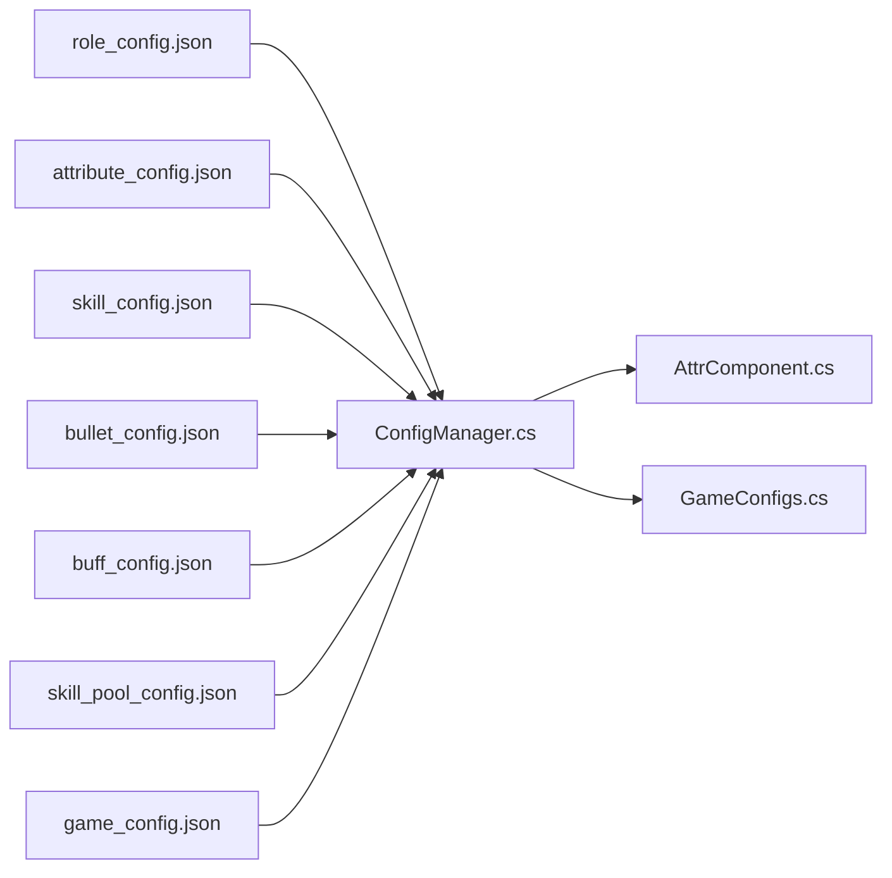

# 角色配置文件

<cite>
**本文引用的文件**
- [hero_config.json](file://Assets/Resources/Configs/hero_config.json)
- [monster_config.json](file://Assets/Resources/Configs/monster_config.json)
- [role_config.json](file://Assets/Resources/Configs/role_config.json)
- [attribute_config.json](file://Assets/Resources/Configs/attribute_config.json)
- [skill_config.json](file://Assets/Resources/Configs/skill_config.json)
- [bullet_config.json](file://Assets/Resources/Configs/bullet_config.json)
- [buff_config.json](file://Assets/Resources/Configs/buff_config.json)
- [skill_pool_config.json](file://Assets/Resources/Configs/skill_pool_config.json)
- [game_config.json](file://Assets/Resources/Configs/game_config.json)
- [AttrComponent.cs](file://Assets/Scripts/Battle/AttrComponent.cs)
- [ConfigManager.cs](file://Assets/Scripts/Core/ConfigManager.cs)
- [GameConfigs.cs](file://Assets/Scripts/Data/GameConfigs.cs)
</cite>

## 目录
1. [简介](#简介)
2. [项目结构](#项目结构)
3. [核心组件](#核心组件)
4. [架构总览](#架构总览)
5. [详细组件分析](#详细组件分析)
6. [依赖关系分析](#依赖关系分析)
7. [性能考量](#性能考量)
8. [故障排查指南](#故障排查指南)
9. [结论](#结论)
10. [附录](#附录)

## 简介
本文件面向GeometryTD的角色配置体系，围绕英雄、怪物、Boss与召唤物四类角色，系统化梳理其配置数据结构、字段定义与运行时行为，覆盖基础属性、技能配置、AI行为模式、掉落与事件联动等高级主题。文档同时提供最佳实践、数值平衡建议、性能优化策略以及调试方法，帮助策划与开发者高效构建与维护角色配置。

## 项目结构
角色配置主要分布在Resources/Configs目录下的JSON文件中，配合Scripts/Data与Scripts/Core中的数据模型与配置管理器实现加载与查询。核心关系如下：
- 配置文件：hero_config.json、monster_config.json、role_config.json、attribute_config.json、skill_config.json、bullet_config.json、buff_config.json、skill_pool_config.json、game_config.json
- 数据模型：GameConfigs.cs中的各类Config与Entry类
- 运行时：ConfigManager.cs负责加载与索引；AttrComponent.cs负责属性计算与派生属性

图表来源
- [hero_config.json](file://Assets/Resources/Configs/hero_config.json)
- [monster_config.json](file://Assets/Resources/Configs/monster_config.json)
- [role_config.json](file://Assets/Resources/Configs/role_config.json)
- [attribute_config.json](file://Assets/Resources/Configs/attribute_config.json)
- [skill_config.json](file://Assets/Resources/Configs/skill_config.json)
- [bullet_config.json](file://Assets/Resources/Configs/bullet_config.json)
- [buff_config.json](file://Assets/Resources/Configs/buff_config.json)
- [skill_pool_config.json](file://Assets/Resources/Configs/skill_pool_config.json)
- [game_config.json](file://Assets/Resources/Configs/game_config.json)
- [GameConfigs.cs](file://Assets/Scripts/Data/GameConfigs.cs)
- [ConfigManager.cs](file://Assets/Scripts/Core/ConfigManager.cs)
- [AttrComponent.cs](file://Assets/Scripts/Battle/AttrComponent.cs)

章节来源
- [hero_config.json](file://Assets/Resources/Configs/hero_config.json)
- [monster_config.json](file://Assets/Resources/Configs/monster_config.json)
- [role_config.json](file://Assets/Resources/Configs/role_config.json)
- [attribute_config.json](file://Assets/Resources/Configs/attribute_config.json)
- [skill_config.json](file://Assets/Resources/Configs/skill_config.json)
- [bullet_config.json](file://Assets/Resources/Configs/bullet_config.json)
- [buff_config.json](file://Assets/Resources/Configs/buff_config.json)
- [skill_pool_config.json](file://Assets/Resources/Configs/skill_pool_config.json)
- [game_config.json](file://Assets/Resources/Configs/game_config.json)
- [GameConfigs.cs](file://Assets/Scripts/Data/GameConfigs.cs)
- [ConfigManager.cs](file://Assets/Scripts/Core/ConfigManager.cs)
- [AttrComponent.cs](file://Assets/Scripts/Battle/AttrComponent.cs)

## 核心组件
- 英雄配置（hero_config.json）
  - 字段要点：id、name、description、role、attack_skill_ids、skill_xp_interval、skill_xp_min、skill_xp_max、charge_buff_ids、attrs
  - 说明：描述英雄外观、定位、可释放的普攻技能、蓄力获得的技能经验值区间、蓄力状态的属性加成等；attrs提供基础属性与特殊属性的初始值
- 怪物配置（monster_config.json）
  - 字段要点：id、name、role、level、is_boss、is_elite、attack_skill_ids、attrs
  - 说明：描述怪物等级、是否为Boss或精英、可释放的普攻技能、基础属性与特殊属性
- 角色类型配置（role_config.json）
  - 字段要点：id、name、prefabPath、portraitPath
  - 说明：将角色id映射到预制体路径与头像路径，供运行时实例化与UI展示
- 属性元数据（attribute_config.json）
  - 字段要点：id、name、des、type、downLimit、upLimit、powerType
  - 说明：定义属性类型（基础/特殊）、上下限、万分比换算规则，支撑AttrComponent的最终值与派生属性计算
- 技能配置（skill_config.json）
  - 字段要点：id、level、name、category、dmg、dmgType、bulletSpeed、cd、bulletStyleId、attack_range、events/enemyEvents/bulletEvents
  - 说明：定义技能伤害、范围、冷却、子弹样式与事件链，支持自身事件、敌方事件与子弹事件
- 子弹样式（bullet_config.json）
  - 字段要点：id、prefabPath
  - 说明：将技能的bulletStyleId映射到子弹预制体资源
- Buff配置（buff_config.json）
  - 字段要点：id、name、icon、desc、overlap、probability、lastTime、jumpTime、persistJson、position、type、dispel、attribute、evtDmgRate、evtDamage、evtWhenEnd、specialEvent
  - 说明：定义Buff的叠加上限、概率、持续时间、属性变更、伤害快照、结束事件与特殊事件
- 技能池配置（skill_pool_config.json）
  - 字段要点：id、name、desList、icon、dragHint
  - 说明：描述技能池中技能的描述列表与拖拽提示，用于UI展示与玩家教学
- 游戏全局配置（game_config.json）
  - 字段要点：kill_count_for_boss、monster_spawn_interval、boss_monster_id、default_hero_id、skill_slot_ids、arcane_slot_ids
  - 说明：定义Boss刷新条件、怪物生成间隔、默认英雄、技能与奥术槽位等全局参数

章节来源
- [hero_config.json](file://Assets/Resources/Configs/hero_config.json)
- [monster_config.json](file://Assets/Resources/Configs/monster_config.json)
- [role_config.json](file://Assets/Resources/Configs/role_config.json)
- [attribute_config.json](file://Assets/Resources/Configs/attribute_config.json)
- [skill_config.json](file://Assets/Resources/Configs/skill_config.json)
- [bullet_config.json](file://Assets/Resources/Configs/bullet_config.json)
- [buff_config.json](file://Assets/Resources/Configs/buff_config.json)
- [skill_pool_config.json](file://Assets/Resources/Configs/skill_pool_config.json)
- [game_config.json](file://Assets/Resources/Configs/game_config.json)

## 架构总览
配置加载与运行时流程如下：
- ConfigManager在Awake阶段加载所有配置文件，构建查找字典
- AttrComponent根据AttributeIds与AttributeConfig进行属性累加、上下限约束与万分比换算
- 技能与子弹通过ConfigManager索引，结合事件系统执行效果链
- 角色实例化由role_config映射的prefabPath完成

图表来源
- [ConfigManager.cs](file://Assets/Scripts/Core/ConfigManager.cs)
- [GameConfigs.cs](file://Assets/Scripts/Data/GameConfigs.cs)
- [AttrComponent.cs](file://Assets/Scripts/Battle/AttrComponent.cs)

章节来源
- [ConfigManager.cs](file://Assets/Scripts/Core/ConfigManager.cs)
- [GameConfigs.cs](file://Assets/Scripts/Data/GameConfigs.cs)
- [AttrComponent.cs](file://Assets/Scripts/Battle/AttrComponent.cs)

## 详细组件分析

### 英雄配置（hero_config.json）
- 数据结构
  - 英雄列表：heroes[]
  - 每个英雄条目包含：id、name、description、role、attack_skill_ids[]、skill_xp_interval、skill_xp_min、skill_xp_max、charge_buff_ids[]、attrs[]
- 字段详解
  - id/name/description：唯一标识、显示名称与描述
  - role：角色类型，与role_config.json关联
  - attack_skill_ids：该英雄可释放的普攻技能ID数组
  - skill_xp_interval：蓄力经验发放间隔（秒）
  - skill_xp_min/skill_xp_max：每次发放的最小/最大经验值
  - charge_buff_ids：蓄力状态附加的Buff ID数组
  - attrs：属性条目数组，每个条目含id与value
- 典型字段映射
  - 生命值：attribute_config.json中id=1
  - 攻击力：attribute_config.json中id=2
  - 护盾值：attribute_config.json中id=114
  - 攻击间隔：attribute_config.json中id=121（毫秒）
  - 移动速度：attribute_config.json中id=131（万分比）
  - 攻击数量：attribute_config.json中id=132
- 设计要点
  - 通过skill_xp_interval与skill_xp_*控制蓄力体验与技能成长节奏
  - charge_buff_ids可叠加属性加成，形成“蓄力强、释放弱”的平衡
  - attrs应覆盖基础生存与输出需求，避免极端偏科

章节来源
- [hero_config.json](file://Assets/Resources/Configs/hero_config.json)
- [attribute_config.json](file://Assets/Resources/Configs/attribute_config.json)
- [role_config.json](file://Assets/Resources/Configs/role_config.json)

### 怪物配置（monster_config.json）
- 数据结构
  - 怪物列表：monsters[]
  - 每个怪物条目包含：id、name、role、level、is_boss、is_elite、attack_skill_ids[]、attrs[]
- 字段详解
  - is_boss/is_elite：区分Boss与精英单位，影响难度与奖励
  - level：怪物等级，用于生成与经验计算
  - attack_skill_ids：普攻技能ID数组
  - attrs：属性条目数组
- 典型字段映射
  - 生命值：attribute_config.json中id=1
  - 攻击力：attribute_config.json中id=2
  - 攻击间隔：attribute_config.json中id=121（毫秒）
  - 移动速度：attribute_config.json中id=131（万分比）
- 设计要点
  - Boss与精英应具备更高的生存与输出能力，同时保留可挑战性
  - 普攻技能可选，便于AI行为与机制设计

章节来源
- [monster_config.json](file://Assets/Resources/Configs/monster_config.json)
- [attribute_config.json](file://Assets/Resources/Configs/attribute_config.json)

### 角色类型配置（role_config.json）
- 数据结构
  - 角色列表：roles[]
  - 每个角色条目包含：id、name、prefabPath、portraitPath
- 作用
  - 将角色id映射到预制体与头像资源路径，供运行时加载与UI展示
- 设计要点
  - prefabPath需与实际资源一致，避免运行时警告
  - 不同角色类型（Hero/Monster/Boss/Summon）对应不同预制体目录

章节来源
- [role_config.json](file://Assets/Resources/Configs/role_config.json)

### 属性系统（attribute_config.json + AttrComponent.cs + GameConfigs.cs）
- 属性元数据
  - type=1：基础属性（如HP、Attack）
  - type=2：特殊属性（如元素加成、减伤、百分比加成、命中/闪避等）
  - powerType=1：以万分比形式存储（如命中率、百分比加成），AttrComponent会转换为浮点
  - downLimit/upLimit：属性下限/上限约束
- 运行时计算
  - AttrComponent.Init：从配置初始化基础属性
  - AttrComponent.GetFinal：应用上下限约束
  - AttrComponent.GetFinalFloat：对万分比属性进行换算
  - AttrComponent.GetMaxHp/GetAttack/GetAttackIntervalSec/GetMoveSpeed：派生属性计算
- 关键常量（AttributeIds）
  - 基础属性：HP=1、Attack=2
  - 特殊属性：如HpPercentBonus=110、AtkPercentBonus=111、Shield=114、CritRate=115、HitRate=119、DodgeRate=120、AttackInterval=121、MoveSpeed=131、AttackCount=132
- 设计要点
  - 百分比属性统一采用万分比存储，确保精度与一致性
  - 派生属性优先计算基础值，再乘以百分比加成

图表来源
- [AttrComponent.cs](file://Assets/Scripts/Battle/AttrComponent.cs)
- [GameConfigs.cs](file://Assets/Scripts/Data/GameConfigs.cs)

章节来源
- [attribute_config.json](file://Assets/Resources/Configs/attribute_config.json)
- [AttrComponent.cs](file://Assets/Scripts/Battle/AttrComponent.cs)
- [GameConfigs.cs](file://Assets/Scripts/Data/GameConfigs.cs)

### 技能系统（skill_config.json + bullet_config.json + skill_pool_config.json + ConfigManager.cs）
- 技能配置
  - category：Self/Projectile/Aoe/Shield/Summon
  - dmg/dmgType：伤害数值与元素类型（0=无属性, 1=火, 2=冰, 3=电, 4=风）
  - bulletSpeed/cd/attack_range：子弹速度、冷却、攻击范围
  - bulletStyleId：子弹样式ID，映射bullet_config.json中的prefabPath
  - events/enemyEvents/bulletEvents：事件链数组，用于触发效果
- 子弹样式
  - bulletStyles[]：将id映射到子弹预制体路径
- 技能池
  - skill_pool_config：描述技能池中技能的描述列表与拖拽提示
- 运行时索引
  - ConfigManager提供GetSkillConfig、GetSkillPoolConfig、GetBulletStyleConfig等查询接口

图表来源
- [skill_config.json](file://Assets/Resources/Configs/skill_config.json)
- [bullet_config.json](file://Assets/Resources/Configs/bullet_config.json)
- [skill_pool_config.json](file://Assets/Resources/Configs/skill_pool_config.json)
- [ConfigManager.cs](file://Assets/Scripts/Core/ConfigManager.cs)

章节来源
- [skill_config.json](file://Assets/Resources/Configs/skill_config.json)
- [bullet_config.json](file://Assets/Resources/Configs/bullet_config.json)
- [skill_pool_config.json](file://Assets/Resources/Configs/skill_pool_config.json)
- [ConfigManager.cs](file://Assets/Scripts/Core/ConfigManager.cs)

### Buff系统（buff_config.json + GameConfigs.cs）
- Buff配置
  - overlap/probability/lastTime/jumpTime：叠加上限、概率、持续时间、跳伤间隔
  - attribute/evtDmgRate/evtDamage/evtWhenEnd/specialEvent：属性变更、伤害快照、每跳事件、结束事件与特殊事件
- 运行时应用
  - ConfigManager.GetBuffConfig用于查询Buff元数据
  - Buff可对属性进行持续变更，或在特定时刻触发事件

章节来源
- [buff_config.json](file://Assets/Resources/Configs/buff_config.json)
- [GameConfigs.cs](file://Assets/Scripts/Data/GameConfigs.cs)

### 全局游戏配置（game_config.json）
- 字段要点：kill_count_for_boss、monster_spawn_interval、boss_monster_id、default_hero_id、skill_slot_ids、arcane_slot_ids
- 作用：控制Boss刷新条件、怪物生成间隔、默认英雄与技能/奥术槽位

章节来源
- [game_config.json](file://Assets/Resources/Configs/game_config.json)

## 依赖关系分析
- 配置文件间依赖
  - hero_config.json/monster_config.json依赖role_config.json进行角色实例化
  - skill_config.json依赖bullet_config.json进行子弹资源映射
  - buff_config.json与事件系统（event/bulletEvent）共同构成效果链
- 运行时依赖
  - ConfigManager集中加载与索引所有配置，提供查询接口
  - AttrComponent基于AttributeIds与AttributeConfig进行属性计算
- 潜在耦合点
  - 属性ID与含义需保持一致，避免运行时换算错误
  - 技能与子弹样式的ID映射必须正确，否则运行时加载失败

图表来源
- [role_config.json](file://Assets/Resources/Configs/role_config.json)
- [attribute_config.json](file://Assets/Resources/Configs/attribute_config.json)
- [skill_config.json](file://Assets/Resources/Configs/skill_config.json)
- [bullet_config.json](file://Assets/Resources/Configs/bullet_config.json)
- [buff_config.json](file://Assets/Resources/Configs/buff_config.json)
- [skill_pool_config.json](file://Assets/Resources/Configs/skill_pool_config.json)
- [game_config.json](file://Assets/Resources/Configs/game_config.json)
- [ConfigManager.cs](file://Assets/Scripts/Core/ConfigManager.cs)
- [AttrComponent.cs](file://Assets/Scripts/Battle/AttrComponent.cs)
- [GameConfigs.cs](file://Assets/Scripts/Data/GameConfigs.cs)

章节来源
- [role_config.json](file://Assets/Resources/Configs/role_config.json)
- [attribute_config.json](file://Assets/Resources/Configs/attribute_config.json)
- [skill_config.json](file://Assets/Resources/Configs/skill_config.json)
- [bullet_config.json](file://Assets/Resources/Configs/bullet_config.json)
- [buff_config.json](file://Assets/Resources/Configs/buff_config.json)
- [skill_pool_config.json](file://Assets/Resources/Configs/skill_pool_config.json)
- [game_config.json](file://Assets/Resources/Configs/game_config.json)
- [ConfigManager.cs](file://Assets/Scripts/Core/ConfigManager.cs)
- [AttrComponent.cs](file://Assets/Scripts/Battle/AttrComponent.cs)
- [GameConfigs.cs](file://Assets/Scripts/Data/GameConfigs.cs)

## 性能考量
- 配置加载
  - ConfigManager在Awake阶段一次性加载并构建索引，避免运行时重复IO与解析
  - 预加载子弹与特效预制体，减少首次使用时的延迟
- 属性计算
  - AttrComponent使用字典存储基础与加成属性，查询复杂度O(1)
  - 百分比属性统一以万分比存储，避免频繁浮点运算
- 冷却与事件
  - 技能冷却与事件链尽量在逻辑层缓存常用配置，减少重复查询

[本节为通用性能建议，无需特定文件引用]

## 故障排查指南
- 配置加载失败
  - 现象：日志出现“无法加载配置文件”或“配置文件解析失败”
  - 排查：检查Resources路径与文件名是否匹配；确认JSON格式正确
- 预制体加载失败
  - 现象：日志出现“无法加载...Prefab”警告
  - 排查：核对role_config.json与bullet_config.json中的prefabPath是否存在且拼写正确
- 属性异常
  - 现象：属性上下限未生效或百分比换算错误
  - 排查：确认attribute_config.json中powerType与downLimit/upLimit设置；检查AttrComponent的GetFinal与GetFinalFloat调用
- 技能/子弹无效
  - 现象：技能无法释放或子弹不显示
  - 排查：核对skill_config.json中的bulletStyleId与bullet_config.json映射；确认ConfigManager索引是否正确

章节来源
- [ConfigManager.cs](file://Assets/Scripts/Core/ConfigManager.cs)
- [AttrComponent.cs](file://Assets/Scripts/Battle/AttrComponent.cs)

## 结论
角色配置体系通过清晰的JSON结构与严谨的数据模型，实现了从基础属性到技能事件的完整闭环。合理利用属性元数据、技能池与Buff系统，可快速构建多样化角色并维持数值平衡。建议在策划层面建立配置规范与校验流程，在开发层面强化索引与缓存策略，以确保配置的可维护性与运行时性能。

[本节为总结性内容，无需特定文件引用]

## 附录

### 配置字段速查表
- 英雄配置（hero_config.json）
  - id、name、description、role、attack_skill_ids[]、skill_xp_interval、skill_xp_min、skill_xp_max、charge_buff_ids[]、attrs[]
- 怪物配置（monster_config.json）
  - id、name、role、level、is_boss、is_elite、attack_skill_ids[]、attrs[]
- 角色类型（role_config.json）
  - id、name、prefabPath、portraitPath
- 属性元数据（attribute_config.json）
  - id、name、des、type、downLimit、upLimit、powerType
- 技能配置（skill_config.json）
  - id、level、name、category、dmg、dmgType、bulletSpeed、cd、bulletStyleId、attack_range、events[]、enemyEvents[]、bulletEvents[]
- 子弹样式（bullet_config.json）
  - id、prefabPath
- Buff配置（buff_config.json）
  - id、name、icon、desc、overlap、probability、lastTime、jumpTime、persistJson、position、type、dispel、attribute[]、evtDmgRate[]、evtDamage[]、evtWhenEnd[]、specialEvent[]
- 技能池（skill_pool_config.json）
  - id、name、desList[]、icon、dragHint
- 全局配置（game_config.json）
  - kill_count_for_boss、monster_spawn_interval、boss_monster_id、default_hero_id、skill_slot_ids[]、arcane_slot_ids[]

### 数值平衡与性能优化建议
- 平衡性
  - 英雄：通过skill_xp_*与charge_buff_ids调节蓄力收益；attrs覆盖生存与输出，避免单一维度过强
  - 怪物：Boss与精英在HP、攻击力、攻击间隔上适度拉开；普攻技能可选，便于AI与机制设计
  - Buff：控制持续时间与叠加上限，避免过强的持续增益/减益
- 性能
  - 使用万分比存储百分比属性，减少浮点运算
  - 预加载常用资源，避免首次使用抖动
  - 合理拆分配置文件，按需加载与缓存

[本节为通用建议，无需特定文件引用]