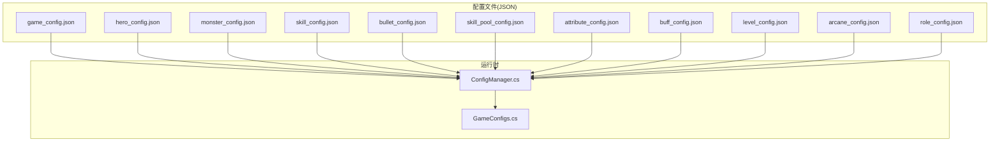
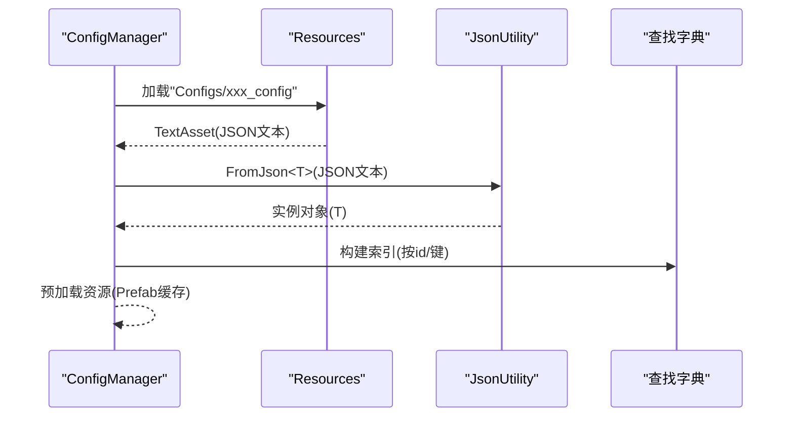
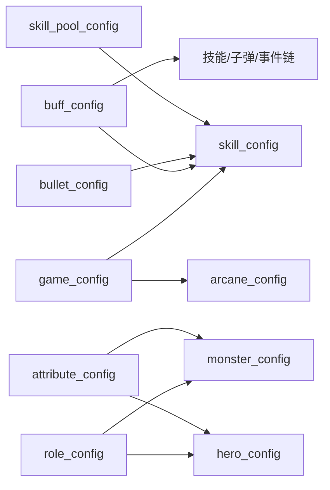

# 配置文件类型

<cite>
**本文引用的文件**
- [game_config.json](file://Assets/Resources/Configs/game_config.json)
- [hero_config.json](file://Assets/Resources/Configs/hero_config.json)
- [monster_config.json](file://Assets/Resources/Configs/monster_config.json)
- [skill_config.json](file://Assets/Resources/Configs/skill_config.json)
- [bullet_config.json](file://Assets/Resources/Configs/bullet_config.json)
- [skill_pool_config.json](file://Assets/Resources/Configs/skill_pool_config.json)
- [attribute_config.json](file://Assets/Resources/Configs/attribute_config.json)
- [buff_config.json](file://Assets/Resources/Configs/buff_config.json)
- [level_config.json](file://Assets/Resources/Configs/level_config.json)
- [arcane_config.json](file://Assets/Resources/Configs/arcane_config.json)
- [role_config.json](file://Assets/Resources/Configs/role_config.json)
- [ConfigManager.cs](file://Assets/Scripts/Core/ConfigManager.cs)
- [GameConfigs.cs](file://Assets/Scripts/Data/GameConfigs.cs)
</cite>

## 目录
1. [简介](#简介)
2. [项目结构](#项目结构)
3. [核心组件](#核心组件)
4. [架构总览](#架构总览)
5. [详细组件分析](#详细组件分析)
6. [依赖关系分析](#依赖关系分析)
7. [性能考量](#性能考量)
8. [故障排查指南](#故障排查指南)
9. [结论](#结论)
10. [附录](#附录)

## 简介
本文件系统化梳理 GeometryTD 的各类配置文件类型与用途，覆盖全局游戏参数、英雄、怪物、技能、子弹样式、技能池、属性元数据、Buff、关卡、奥术、角色预制体等。文档从数据结构、字段语义、取值范围、引用关系、版本与兼容、编写规范与最佳实践、示例与常见错误等方面进行说明，帮助策划与开发者高效维护配置。

## 项目结构
配置文件集中存放于 Resources/Configs 目录，按功能域划分为若干 JSON 文件；运行时通过 ConfigManager 统一加载并建立查找索引，GameConfigs 定义了对应的 C# 数据模型与常量。

图表来源
- [ConfigManager.cs:77-122](file://Assets/Scripts/Core/ConfigManager.cs#L77-L122)
- [GameConfigs.cs:104-120](file://Assets/Scripts/Data/GameConfigs.cs#L104-L120)

章节来源
- [ConfigManager.cs:77-122](file://Assets/Scripts/Core/ConfigManager.cs#L77-L122)
- [GameConfigs.cs:104-120](file://Assets/Scripts/Data/GameConfigs.cs#L104-L120)

## 核心组件
- 全局配置 game_config：定义游戏全局参数，如Boss击杀阈值、怪物生成间隔、默认英雄、技能槽位与奥术槽位等。
- 英雄配置 hero_config：定义英雄基础属性、角色定位、攻击技能、蓄力增益、经验获取区间等。
- 怪物配置 monster_config：定义怪物基础属性、是否Boss/精英、等级、攻击技能等。
- 技能配置 skill_config：定义技能的伤害、类型、冷却、子弹样式、事件链等，支持按池ID+等级派生多级形态。
- 子弹样式 bullet_config：定义子弹样式ID到资源路径的映射。
- 技能池 skill_pool_config：定义可选技能的名称、描述列表、图标、拖拽提示等。
- 属性元数据 attribute_config：定义属性ID、名称、描述、类型、上下限、权重等元信息。
- Buff配置 buff_config：定义状态效果的叠加上限、概率、持续时间、属性变更、事件等。
- 关卡配置 level_config：定义关卡背景、难度、怪物/精英/Boss生成计划、掉落等。
- 奥术配置 arcane_config：定义奥术的伤害、类型、范围、周期、冷却、符文消耗与事件链。
- 角色配置 role_config：定义角色ID到预制体与头像的映射。

章节来源
- [game_config.json:1-9](file://Assets/Resources/Configs/game_config.json#L1-L9)
- [hero_config.json:1-44](file://Assets/Resources/Configs/hero_config.json#L1-L44)
- [monster_config.json:1-167](file://Assets/Resources/Configs/monster_config.json#L1-L167)
- [skill_config.json:1-800](file://Assets/Resources/Configs/skill_config.json#L1-L800)
- [bullet_config.json:1-9](file://Assets/Resources/Configs/bullet_config.json#L1-L9)
- [skill_pool_config.json:1-59](file://Assets/Resources/Configs/skill_pool_config.json#L1-L59)
- [attribute_config.json:1-39](file://Assets/Resources/Configs/attribute_config.json#L1-L39)
- [buff_config.json:1-23](file://Assets/Resources/Configs/buff_config.json#L1-L23)
- [level_config.json:1-80](file://Assets/Resources/Configs/level_config.json#L1-L80)
- [arcane_config.json:1-6](file://Assets/Resources/Configs/arcane_config.json#L1-L6)
- [role_config.json:1-14](file://Assets/Resources/Configs/role_config.json#L1-L14)

## 架构总览
ConfigManager 在启动时统一加载各配置JSON，解析为对应的数据模型，并构建字典索引以供运行时快速查询。GameConfigs 提供字段语义与常量定义，确保配置与逻辑一致。

图表来源
- [ConfigManager.cs:200-215](file://Assets/Scripts/Core/ConfigManager.cs#L200-L215)
- [ConfigManager.cs:124-130](file://Assets/Scripts/Core/ConfigManager.cs#L124-L130)
- [ConfigManager.cs:169-198](file://Assets/Scripts/Core/ConfigManager.cs#L169-L198)

章节来源
- [ConfigManager.cs:200-215](file://Assets/Scripts/Core/ConfigManager.cs#L200-L215)
- [ConfigManager.cs:124-130](file://Assets/Scripts/Core/ConfigManager.cs#L124-L130)
- [ConfigManager.cs:169-198](file://Assets/Scripts/Core/ConfigManager.cs#L169-L198)

## 详细组件分析

### 全局配置 game_config
- 字段
  - kill_count_for_boss: 整数，达到该击杀数后触发Boss生成。
  - monster_spawn_interval: 浮点数，怪物生成间隔（秒）。
  - boss_monster_id: 整数，Boss怪物ID。
  - default_hero_id: 整数，初始默认英雄ID。
  - skill_slot_ids: 数组，技能栏位的池ID序列。
  - arcane_slot_ids: 数组，奥术栏位的ID序列。
- 用途：作为游戏启动与关卡初始化的全局参数来源。
- 注意：skill_slot_ids 与 skill_pool_config 的 id 对应；arcane_slot_ids 与 arcane_config 的 id 对应。

章节来源
- [game_config.json:1-9](file://Assets/Resources/Configs/game_config.json#L1-L9)
- [ConfigManager.cs:224-227](file://Assets/Scripts/Core/ConfigManager.cs#L224-L227)

### 英雄配置 hero_config
- 字段
  - id: 整数，英雄唯一标识。
  - name/description: 字符串，名称与描述。
  - role: 整数，角色定位ID，需与 role_config 对应。
  - attack_skill_ids: 数组，初始可使用的技能池ID。
  - skill_xp_interval: 浮点数，蓄力经验刷新间隔。
  - skill_xp_min/max: 整数，每次蓄力获得经验的区间。
  - charge_buff_ids: 数组，蓄力期间生效的Buff ID集合。
  - attrs: 数组，AttrEntry，包含属性ID与数值。
- 用途：定义英雄的基础能力、成长与蓄力机制。
- 依赖：引用 attribute_config 的属性ID；引用 role_config 的角色预制体；引用 buff_config 的蓄力Buff。

章节来源
- [hero_config.json:1-44](file://Assets/Resources/Configs/hero_config.json#L1-L44)
- [GameConfigs.cs:318-337](file://Assets/Scripts/Data/GameConfigs.cs#L318-L337)
- [GameConfigs.cs:10-15](file://Assets/Scripts/Data/GameConfigs.cs#L10-L15)
- [ConfigManager.cs:382-388](file://Assets/Scripts/Core/ConfigManager.cs#L382-L388)

### 怪物配置 monster_config
- 字段
  - id/name/role/level: 基本信息。
  - is_boss/is_elite: 布尔，是否Boss或精英。
  - attack_skill_ids: 数组，可用技能池ID。
  - attrs: 数组，AttrEntry，包含属性ID与数值。
- 用途：定义怪物的基础属性与行为特征。
- 依赖：引用 attribute_config 的属性ID；引用 role_config 的角色预制体；引用 buff_config 的状态效果。

章节来源
- [monster_config.json:1-167](file://Assets/Resources/Configs/monster_config.json#L1-L167)
- [GameConfigs.cs:340-357](file://Assets/Scripts/Data/GameConfigs.cs#L340-L357)

### 技能配置 skill_config
- 字段
  - id/level/name/des/icon/category: 基本信息与分类。
  - dmg/dmgType/bulletSpeed/cd/attack_range: 技能参数。
  - bulletStyleId: 整数，引用 bullet_config 的样式ID。
  - events/enemyEvents/bulletEvents: 数组，事件ID列表。
- 用途：定义技能的伤害、范围、冷却、子弹样式与事件链。
- 依赖：bulletStyleId → bullet_config；events/enemyEvents/bulletEvents → event_config/bullet_event_config/buff_config 等。

章节来源
- [skill_config.json:1-800](file://Assets/Resources/Configs/skill_config.json#L1-L800)
- [GameConfigs.cs:378-401](file://Assets/Scripts/Data/GameConfigs.cs#L378-L401)
- [GameConfigs.cs:154-170](file://Assets/Scripts/Data/GameConfigs.cs#L154-L170)

### 子弹样式 bullet_config
- 字段
  - id: 整数，样式ID。
  - prefabPath: 字符串，资源路径。
- 用途：将样式ID映射到具体子弹预制体资源，供运行时加载。

章节来源
- [bullet_config.json:1-9](file://Assets/Resources/Configs/bullet_config.json#L1-L9)
- [ConfigManager.cs:148-160](file://Assets/Scripts/Core/ConfigManager.cs#L148-L160)

### 技能池 skill_pool_config
- 字段
  - id: 整数，池ID（与技能id前缀规则相关）。
  - name/desList/icon/dragHint: 描述与交互提示。
- 用途：定义可选技能的展示与说明。
- 依赖：技能ID派生规则：GetSkillConfigByPool(poolId, level) = poolId*100 + level。

章节来源
- [skill_pool_config.json:1-59](file://Assets/Resources/Configs/skill_pool_config.json#L1-L59)
- [ConfigManager.cs:224-227](file://Assets/Scripts/Core/ConfigManager.cs#L224-L227)

### 属性元数据 attribute_config
- 字段
  - id/name/des/type/downLimit/upLimit/powerType: 属性元信息。
- 用途：定义属性ID的语义、取值范围与权重类型（直接值/万分比）。
- 依赖：被 hero_config/monster_config 的 attrs 引用。

章节来源
- [attribute_config.json:1-39](file://Assets/Resources/Configs/attribute_config.json#L1-L39)
- [GameConfigs.cs:104-120](file://Assets/Scripts/Data/GameConfigs.cs#L104-L120)

### Buff配置 buff_config
- 字段
  - id/name/icon/desc/overlap/probability/lastTime/jumpTime/type/dispel/attribute/evtDmgRate/evtDamage/evtWhenEnd/specialEvent: 状态效果的完整定义。
- 用途：定义增益/减益效果的持续、叠加、属性变更与特殊事件。
- 依赖：被技能/子弹/事件链引用，用于运行时效果叠加与计算。

章节来源
- [buff_config.json:1-23](file://Assets/Resources/Configs/buff_config.json#L1-L23)
- [GameConfigs.cs:218-243](file://Assets/Scripts/Data/GameConfigs.cs#L218-L243)

### 关卡配置 level_config
- 字段
  - id/name/des/bg/conditions/hard/spawn_interval/coinNormalKill/coinEliteKill/coinBossKill/coinSelfDestructRate/monsterList/superMList/bossList: 关卡生成与奖励配置。
- 用途：定义关卡难度、背景、怪物生成计划与掉落。

章节来源
- [level_config.json:1-80](file://Assets/Resources/Configs/level_config.json#L1-L80)
- [GameConfigs.cs:517-539](file://Assets/Scripts/Data/GameConfigs.cs#L517-L539)

### 奥术配置 arcane_config
- 字段
  - id/name/desList/icon/dmg/dmgType/radius/tickInterval/cd/runeCost/runeType/events/enemyEvents/bulletEvents: 奥术的伤害、范围、周期、冷却、符文消耗与事件链。
- 用途：定义奥术的AOE伤害与效果。

章节来源
- [arcane_config.json:1-6](file://Assets/Resources/Configs/arcane_config.json#L1-L6)
- [GameConfigs.cs:430-452](file://Assets/Scripts/Data/GameConfigs.cs#L430-L452)

### 角色配置 role_config
- 字段
  - id/name/prefabPath/portraitPath: 角色ID与资源路径。
- 用途：将角色ID映射到角色预制体与头像资源。

章节来源
- [role_config.json:1-14](file://Assets/Resources/Configs/role_config.json#L1-L14)
- [ConfigManager.cs:350-370](file://Assets/Scripts/Core/ConfigManager.cs#L350-L370)

## 依赖关系分析
- 技能池与技能
  - 技能池ID poolId 与技能ID存在派生关系：技能ID = poolId*100 + level。
  - 技能配置引用技能池描述（名称、图标、描述列表、拖拽提示）。
- 子弹样式
  - 技能配置中的 bulletStyleId 引用 bullet_config 的 id。
- 属性系统
  - 英雄/怪物的 attrs 使用 attribute_config 的属性ID与语义。
- Buff与事件
  - 技能/子弹/事件链可附加 Buff，Buff 的 attribute/evtDmgRate/evtDamage/evtWhenEnd/specialEvent 影响运行时表现。
- 全局参数
  - game_config 的 skill_slot_ids/arcane_slot_ids 与相应配置的ID集合一一对应。

图表来源
- [ConfigManager.cs:224-227](file://Assets/Scripts/Core/ConfigManager.cs#L224-L227)
- [GameConfigs.cs:378-401](file://Assets/Scripts/Data/GameConfigs.cs#L378-L401)
- [GameConfigs.cs:430-452](file://Assets/Scripts/Data/GameConfigs.cs#L430-L452)

章节来源
- [ConfigManager.cs:224-227](file://Assets/Scripts/Core/ConfigManager.cs#L224-L227)
- [GameConfigs.cs:378-401](file://Assets/Scripts/Data/GameConfigs.cs#L378-L401)
- [GameConfigs.cs:430-452](file://Assets/Scripts/Data/GameConfigs.cs#L430-L452)

## 性能考量
- 预加载与缓存
  - ConfigManager 在加载后预缓存子弹与特效资源，避免运行时重复加载。
- 查找索引
  - 通过字典索引 O(1) 快速查询技能、技能池、子弹样式、角色、属性元数据等。
- JSON解析
  - 使用 Unity 的 JsonUtility 解析，建议保持字段简洁、避免冗余层级，减少解析开销。

章节来源
- [ConfigManager.cs:169-198](file://Assets/Scripts/Core/ConfigManager.cs#L169-L198)
- [ConfigManager.cs:124-130](file://Assets/Scripts/Core/ConfigManager.cs#L124-L130)

## 故障排查指南
- 配置加载失败
  - 现象：日志报错“无法加载配置文件”或“配置文件解析失败”。
  - 排查：确认 Resources/Configs 下文件名与路径正确，JSON语法合法。
- 缺少资源
  - 现象：无法加载子弹/特效/角色预制体，出现警告。
  - 排查：检查 bullet_config/role_config 中的 prefabPath 是否存在且拼写正确。
- ID不匹配
  - 现象：技能无法使用、Buff无效、角色显示异常。
  - 排查：核对 skill_pool_config 与 skill_config 的池ID、level 与派生规则；核对 attribute_config 的属性ID；核对 role_config 的角色ID。
- 默认值缺失
  - 现象：某些属性未生效或出现异常。
  - 排查：在 hero_config/monster_config 的 attrs 中为关键属性提供默认值；在 attribute_config 中为属性设置合理的 upLimit/downLimit。

章节来源
- [ConfigManager.cs:200-215](file://Assets/Scripts/Core/ConfigManager.cs#L200-L215)
- [ConfigManager.cs:169-198](file://Assets/Scripts/Core/ConfigManager.cs#L169-L198)
- [ConfigManager.cs:382-388](file://Assets/Scripts/Core/ConfigManager.cs#L382-L388)

## 结论
本文件系统化梳理了 GeometryTD 的配置体系，明确了各类配置的数据结构、字段语义、引用关系与运行时加载机制。遵循本文的编写规范与最佳实践，可有效提升配置维护效率与稳定性。

## 附录

### 字段命名约定与取值范围
- 命名
  - 使用英文小写加下划线，如 skill_slot_ids、monster_spawn_interval。
  - 字段名语义明确，避免缩写不清。
- 取值范围
  - 整数类字段建议在 attribute_config 中设置 upLimit/downLimit；浮点数字段注意合理精度。
  - 技能冷却、攻击间隔等时间类字段建议以秒或毫秒为统一单位。
- 默认值
  - 重要字段建议在配置中显式给出默认值，避免运行时空引用。

### 版本管理与兼容
- 版本号
  - 建议在 JSON 中加入 version 字段，便于后续迁移。
- 兼容策略
  - 新增字段时保留默认值，避免破坏旧版配置。
  - 删除字段时先标记弃用，再在后续版本移除。

### 示例与常见错误
- 示例
  - 技能池与技能派生：技能ID = 池ID*100 + 等级。
  - 属性引用：在 attrs 中使用 attribute_config 的属性ID。
- 常见错误
  - JSON语法错误（逗号、括号不匹配）。
  - 资源路径不存在或拼写错误。
  - ID冲突或缺失，导致运行时查询失败。
  - 事件链引用的ID未在对应配置中定义。