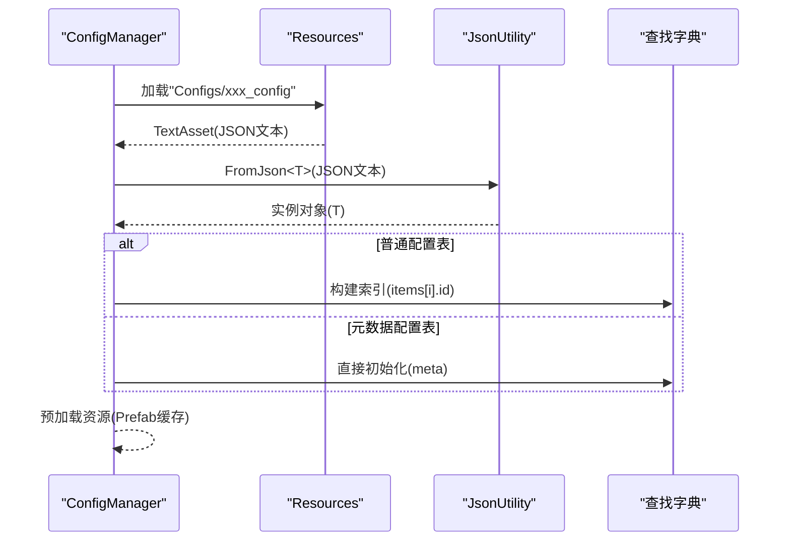
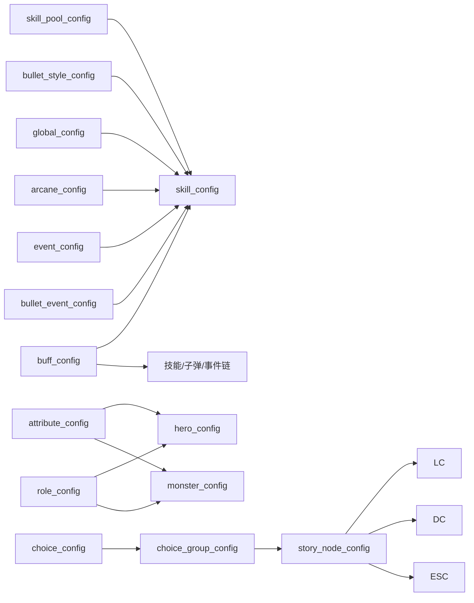

# 配置文件类型

<cite>
**本文引用的文件**
- [ConfigManager.cs](file://Assets/Scripts/Core/ConfigManager.cs)
- [BulletStyleConfig.cs](file://Assets/Scripts/Data/Configs/BulletStyleConfig.cs)
- [ChoiceGroupConfig.cs](file://Assets/Scripts/Data/Configs/ChoiceGroupConfig.cs)
- [ChoiceConfig.cs](file://Assets/Scripts/Data/Configs/ChoiceConfig.cs)
- [GlobalConfig.cs](file://Assets/Scripts/Data/Configs/GlobalConfig.cs)
- [SkillConfig.cs](file://Assets/Scripts/Data/Configs/SkillConfig.cs)
- [StoryNodeConfig.cs](file://Assets/Scripts/Data/Configs/StoryNodeConfig.cs)
- [bullet_style_config.json](file://Assets/Resources/Configs/bullet_style_config.json)
- [choice_config.json](file://Assets/Resources/Configs/choice_config.json)
- [choice_group_config.json](file://Assets/Resources/Configs/choice_group_config.json)
- [global_config.json](file://Assets/Resources/Configs/global_config.json)
- [hero_config.json](file://Assets/Resources/Configs/hero_config.json)
- [monster_config.json](file://Assets/Resources/Configs/monster_config.json)
- [skill_config.json](file://Assets/Resources/Configs/skill_config.json)
- [skill_pool_config.json](file://Assets/Resources/Configs/skill_pool_config.json)
- [attribute_config.json](file://Assets/Resources/Configs/attribute_config.json)
- [buff_config.json](file://Assets/Resources/Configs/buff_config.json)
- [level_config.json](file://Assets/Resources/Configs/level_config.json)
- [arcane_config.json](file://Assets/Resources/Configs/arcane_config.json)
- [role_config.json](file://Assets/Resources/Configs/role_config.json)
- [event_config.json](file://Assets/Resources/Configs/event_config.json)
- [bullet_event_config.json](file://Assets/Resources/Configs/bullet_event_config.json)
- [passive_config.json](file://Assets/Resources/Configs/passive_config.json)
- [passive_effect_config.json](file://Assets/Resources/Configs/passive_effect_config.json)
- [event_effect_config.json](file://Assets/Resources/Configs/event_effect_config.json)
- [condition_config.json](file://Assets/Resources/Configs/condition_config.json)
- [dialogue_config.json](file://Assets/Resources/Configs/dialogue_config.json)
- [story_node_config.json](file://Assets/Resources/Configs/story_node_config.json)
- [story_collection_config.json](file://Assets/Resources/Configs/story_collection_config.json)
- [event_shop_config.json](file://Assets/Resources/Configs/event_shop_config.json)
</cite>

## 更新摘要
**所做更改**
- 更新了Choice配置系统的数据结构，反映ChoiceConfig的description字段替换为des和ChoiceGroupConfig的嵌套OptionsItem类移除
- 修正了Choice配置的字段命名约定，从description改为des
- 更新了ChoiceGroup配置的结构，从嵌套OptionsItem数组改为直接引用choice ID的简单整数数组
- 完善了Choice配置系统的依赖关系分析，反映新的choices数组结构

## 目录
1. [简介](#简介)
2. [项目结构](#项目结构)
3. [核心组件](#核心组件)
4. [架构总览](#架构总览)
5. [详细组件分析](#详细组件分析)
6. [依赖关系分析](#依赖关系分析)
7. [性能考量](#性能考量)
8. [故障排查指南](#故障排查指南)
9. [结论](#结论)
10. [附录](#附录)

## 简介
本文件系统化梳理 GeometryTD 的各类配置文件类型与用途，覆盖全局游戏参数、英雄、怪物、技能、子弹样式、技能池、属性元数据、Buff、关卡、奥术、角色预制体、事件系统、被动系统、故事集系统等。文档从数据结构、字段语义、取值范围、引用关系、版本与兼容、编写规范与最佳实践、示例与常见错误等方面进行说明，帮助策划与开发者高效维护配置。

**更新** 配置系统已升级至新架构，新增了Choice配置系统，包含choice_config.json和choice_group_config.json等新文件类型，支持动态决策机制和分支剧情。ConfigManager已更新配置加载逻辑，体现了更清晰的配置分离和更好的扩展性。最新的变更包括ChoiceConfig的description字段替换为des，以及ChoiceGroupConfig的嵌套OptionsItem类完全移除，简化为直接引用choice ID的choices数组。

## 项目结构
配置文件集中存放于 Resources/Configs 目录，按功能域划分为若干 JSON 文件；运行时通过 ConfigManager 统一加载并建立查找索引。新架构采用 ConfigTable 模式，支持普通配置表和带元数据的配置表。

```mermaid
graph TB
subgraph "基础配置"
GC["global_config.json"]
HC["hero_config.json"]
MC["monster_config.json"]
SK["skill_config.json"]
BSC["bullet_style_config.json"]
SPC["skill_pool_config.json"]
AC["attribute_config.json"]
BFC["buff_config.json"]
LC["level_config.json"]
ARC["arcane_config.json"]
RC["role_config.json"]
END["end"]
end
subgraph "事件系统"
EC["event_config.json"]
BEC["bullet_event_config.json"]
EEC["event_effect_config.json"]
PC["passive_config.json"]
PEC["passive_effect_config.json"]
END2["end2"]
end
subgraph "故事集系统"
CC["condition_config.json"]
DC["dialogue_config.json"]
CG["choice_group_config.json"]
CH["choice_config.json"]
SNC["story_node_config.json"]
SCC["story_collection_config.json"]
ESC["event_shop_config.json"]
END3["end3"]
end
subgraph "运行时"
CM["ConfigManager.cs"]
BST["BulletStyleConfig.cs"]
CGC["ChoiceGroupConfig.cs"]
CHC["ChoiceConfig.cs"]
GLC["GlobalConfig.cs"]
SKC["SkillConfig.cs"]
SNCC["StoryNodeConfig.cs"]
end
GC --> CM
HC --> CM
MC --> CM
SK --> CM
BSC --> CM
SPC --> CM
AC --> CM
BFC --> CM
LC --> CM
ARC --> CM
RC --> CM
EC --> CM
BEC --> CM
EEC --> CM
PC --> CM
PEC --> CM
CC --> CM
DC --> CM
CG --> CM
CH --> CM
SNC --> CM
SCC --> CM
ESC --> CM
CM --> BST
CM --> CGC
CM --> CHC
CM --> GLC
CM --> SKC
CM --> SNCC
```

**图表来源**
- [ConfigManager.cs:56-167](file://Assets/Scripts/Core/ConfigManager.cs#L56-L167)
- [BulletStyleConfig.cs:10-21](file://Assets/Scripts/Data/Configs/BulletStyleConfig.cs#L10-L21)
- [ChoiceGroupConfig.cs:10-24](file://Assets/Scripts/Data/Configs/ChoiceGroupConfig.cs#L10-L24)
- [ChoiceConfig.cs:10-27](file://Assets/Scripts/Data/Configs/ChoiceConfig.cs#L10-L27)
- [GlobalConfig.cs:10-21](file://Assets/Scripts/Data/Configs/GlobalConfig.cs#L10-L21)

**章节来源**
- [ConfigManager.cs:56-167](file://Assets/Scripts/Core/ConfigManager.cs#L56-L167)
- [BulletStyleConfig.cs:10-21](file://Assets/Scripts/Data/Configs/BulletStyleConfig.cs#L10-L21)
- [ChoiceGroupConfig.cs:10-24](file://Assets/Scripts/Data/Configs/ChoiceGroupConfig.cs#L10-L24)
- [ChoiceConfig.cs:10-27](file://Assets/Scripts/Data/Configs/ChoiceConfig.cs#L10-L27)
- [GlobalConfig.cs:10-21](file://Assets/Scripts/Data/Configs/GlobalConfig.cs#L10-L21)

## 核心组件
- **基础配置组件**
  - 全局配置 global_config：定义游戏全局参数，如Boss击杀阈值、怪物生成间隔等，采用元数据模式
  - 英雄配置 hero_config：定义英雄基础属性、角色定位、攻击技能、蓄力增益、经验获取区间等
  - 怪物配置 monster_config：定义怪物基础属性、是否Boss/精英、等级、攻击技能等
  - 技能配置 skill_config：定义技能的伤害、类型、冷却、子弹样式、事件链等，支持按池ID+等级派生多级形态
  - 子弹样式 bullet_style_config：定义子弹样式ID到资源路径的映射，替代旧的bullet_config
  - 技能池 skill_pool_config：定义可选技能的名称、描述列表、图标、拖拽提示等
  - 属性元数据 attribute_config：定义属性ID、名称、描述、类型、上下限、权重等元信息
  - Buff配置 buff_config：定义状态效果的叠加上限、概率、持续时间、属性变更、事件等
  - 关卡配置 level_config：定义关卡背景、难度、怪物/精英/Boss生成计划、掉落等
  - 奥术配置 arcane_config：定义奥术的伤害、类型、范围、周期、冷却、符文消耗与事件链
  - 角色配置 role_config：定义角色ID到预制体与头像的映射

- **事件系统组件**
  - 事件配置 event_config：定义各种事件类型（伤害、治疗、护盾、经验、能量、Buff、被动、召唤、驱散等）
  - 子弹事件配置 bullet_event_config：定义子弹特殊效果（穿透、爆炸、追踪、散射、弹射、连射、齐射等）
  - 事件效果配置 event_effect_config：定义事件触发时的特效配置

- **被动系统组件**
  - 被动配置 passive_config：定义被动效果的触发时机、条件、事件等
  - 被动效果配置 passive_effect_config：定义藏品效果的属性加成、技能增强、特殊效果等

- **故事集系统组件**
  - 条件配置 condition_config：定义关卡解锁条件
  - 对话配置 dialogue_config：定义NPC对话内容
  - 选择组配置 choice_group_config：定义可选项及其效果，替代旧的选择选项配置
  - 选择配置 choice_config：定义具体的决策选项，支持动态效果和奖励
  - 故事节点配置 story_node_config：定义故事流程节点
  - 故事集配置 story_collection_config：定义故事集基本信息
  - 事件商店配置 event_shop_config：定义事件场景商店配置

**章节来源**
- [global_config.json:1-6](file://Assets/Resources/Configs/global_config.json#L1-L6)
- [bullet_style_config.json:1-28](file://Assets/Resources/Configs/bullet_style_config.json#L1-L28)
- [choice_config.json:1-220](file://Assets/Resources/Configs/choice_config.json#L1-L220)
- [choice_group_config.json:1-109](file://Assets/Resources/Configs/choice_group_config.json#L1-L109)
- [hero_config.json:1-44](file://Assets/Resources/Configs/hero_config.json#L1-L44)
- [monster_config.json:1-167](file://Assets/Resources/Configs/monster_config.json#L1-L167)
- [skill_config.json:1-800](file://Assets/Resources/Configs/skill_config.json#L1-L800)

## 架构总览
ConfigManager 在启动时统一加载各配置JSON，解析为对应的数据模型，并构建字典索引以供运行时快速查询。新架构区分了普通配置表(ConfigTable<T>)和元数据配置表(ConfigMeta<T>)两种模式，支持不同的数据结构需求。

**图表来源**
- [ConfigManager.cs:179-194](file://Assets/Scripts/Core/ConfigManager.cs#L179-L194)
- [ConfigManager.cs:56-167](file://Assets/Scripts/Core/ConfigManager.cs#L56-L167)

**章节来源**
- [ConfigManager.cs:179-194](file://Assets/Scripts/Core/ConfigManager.cs#L179-L194)
- [ConfigManager.cs:56-167](file://Assets/Scripts/Core/ConfigManager.cs#L56-L167)

## 详细组件分析

### 基础配置组件

#### 全局配置 global_config
- **数据结构**
  - 采用元数据模式(ConfigMeta)，包含全局参数的meta对象
  - 字段：kill_count_for_boss（整数）、monster_spawn_interval（浮点数）
- **用途**：作为游戏启动与关卡初始化的全局参数来源
- **注意**：与旧的game_config.json相比，采用了更清晰的元数据分离设计

**章节来源**
- [global_config.json:1-6](file://Assets/Resources/Configs/global_config.json#L1-L6)
- [GlobalConfig.cs:10-21](file://Assets/Scripts/Data/Configs/GlobalConfig.cs#L10-L21)

#### 英雄配置 hero_config
- **字段**
  - id: 整数，英雄唯一标识
  - name/description: 字符串，名称与描述
  - role: 整数，角色定位ID，需与 role_config 对应
  - attack_skill_ids: 数组，初始可使用的技能池ID
  - skill_xp_interval: 浮点数，蓄力经验刷新间隔
  - skill_xp_min/max: 整数，每次蓄力获得经验的区间
  - charge_buff_ids: 数组，蓄力期间生效的Buff ID集合
  - attrs: 数组，AttrEntry，包含属性ID与数值
- **用途**：定义英雄的基础能力、成长与蓄力机制
- **依赖**：引用 attribute_config 的属性ID；引用 role_config 的角色预制体；引用 buff_config 的蓄力Buff

**章节来源**
- [hero_config.json:1-44](file://Assets/Resources/Configs/hero_config.json#L1-L44)

#### 怪物配置 monster_config
- **字段**
  - id/name/role/level: 基本信息
  - is_boss/is_elite: 布尔，是否Boss或精英
  - attack_skill_ids: 数组，可用技能池ID
  - attrs: 数组，AttrEntry，包含属性ID与数值
- **用途**：定义怪物的基础属性与行为特征
- **依赖**：引用 attribute_config 的属性ID；引用 role_config 的角色预制体；引用 buff_config 的状态效果

**章节来源**
- [monster_config.json:1-167](file://Assets/Resources/Configs/monster_config.json#L1-L167)

#### 技能配置 skill_config
- **字段**
  - id/level/name/des/icon/category: 基本信息与分类
  - dmg/dmgType/bulletSpeed/cd/attack_range: 技能参数
  - bulletStyleId: 整数，引用 bullet_style_config 的样式ID
  - events/enemyEvents/bulletEvents: 数组，事件ID列表
- **用途**：定义技能的伤害、范围、冷却、子弹样式与事件链
- **依赖**：bulletStyleId → bullet_style_config；events/enemyEvents/bulletEvents → event_config/bullet_event_config/buff_config 等

**章节来源**
- [skill_config.json:1-800](file://Assets/Resources/Configs/skill_config.json#L1-L800)
- [SkillConfig.cs:10-41](file://Assets/Scripts/Data/Configs/SkillConfig.cs#L10-L41)

#### 子弹样式 bullet_style_config
- **字段**
  - items: 数组，包含多个BulletStyleConfig项
  - BulletStyleConfig.id: 整数，样式ID
  - BulletStyleConfig.prefabPath: 字符串，资源路径
- **用途**：将样式ID映射到具体子弹预制体资源，供运行时加载
- **更新**：替代了旧的bullet_config.json，采用items数组结构

**章节来源**
- [bullet_style_config.json:1-28](file://Assets/Resources/Configs/bullet_style_config.json#L1-L28)
- [BulletStyleConfig.cs:10-21](file://Assets/Scripts/Data/Configs/BulletStyleConfig.cs#L10-L21)

#### 技能池 skill_pool_config
- **字段**
  - id: 整数，池ID（与技能id前缀规则相关）
  - name/desList/icon/dragHint: 描述与交互提示
- **用途**：定义可选技能的展示与说明
- **依赖**：技能ID派生规则：GetSkillConfigByPool(poolId, level) = poolId*100 + level

**章节来源**
- [skill_pool_config.json:1-59](file://Assets/Resources/Configs/skill_pool_config.json#L1-L59)

#### 属性元数据 attribute_config
- **字段**
  - id/name/des/type/downLimit/upLimit/powerType: 属性元信息
- **用途**：定义属性ID的语义、取值范围与权重类型（直接值/万分比）
- **依赖**：被 hero_config/monster_config 的 attrs 引用

**章节来源**
- [attribute_config.json:1-39](file://Assets/Resources/Configs/attribute_config.json#L1-L39)

#### Buff配置 buff_config
- **字段**
  - id/name/icon/desc/overlap/probability/lastTime/jumpTime/type/dispel/attribute/evtDmgRate/evtDamage/evtWhenEnd/specialEvent: 状态效果的完整定义
- **用途**：定义增益/减益效果的持续、叠加、属性变更与特殊事件
- **依赖**：被技能/子弹/事件链引用，用于运行时效果叠加与计算

**章节来源**
- [buff_config.json:1-23](file://Assets/Resources/Configs/buff_config.json#L1-L23)

#### 关卡配置 level_config
- **字段**
  - id/name/des/bg/conditions/hard/spawn_interval/coinNormalKill/coinEliteKill/coinBossKill/coinSelfDestructRate/monsterList/superMList/bossList: 关卡生成与奖励配置
- **用途**：定义关卡难度、背景、怪物生成计划与掉落

**章节来源**
- [level_config.json:1-80](file://Assets/Resources/Configs/level_config.json#L1-L80)

#### 奥术配置 arcane_config
- **字段**
  - id/name/desList/icon/dmg/dmgType/radius/tickInterval/cd/runeCost/runeType/events/enemyEvents/bulletEvents: 奥术的伤害、范围、周期、冷却、符文消耗与事件链
- **用途**：定义奥术的AOE伤害与效果

**章节来源**
- [arcane_config.json:1-6](file://Assets/Resources/Configs/arcane_config.json#L1-L6)

#### 角色配置 role_config
- **字段**
  - id/name/prefabPath/portraitPath: 角色ID与资源路径
- **用途**：将角色ID映射到角色预制体与头像资源

**章节来源**
- [role_config.json:1-14](file://Assets/Resources/Configs/role_config.json#L1-L14)

### 事件系统组件

#### 事件配置 event_config
- **字段**
  - id/type/name/des/args: 事件定义
  - type: 事件类型（1=伤害/治疗, 2=护盾/破盾, 4=击退, 5=获得经验, 6=获得能量, 7=获得buff, 8=获得passive, 9=召唤, 10=驱散）
  - args: 参数数组，根据事件类型不同而不同
- **用途**：定义游戏中各种事件的效果与参数

**章节来源**
- [event_config.json:1-116](file://Assets/Resources/Configs/event_config.json#L1-L116)

#### 子弹事件配置 bullet_event_config
- **字段**
  - id/type/name/des/args: 子弹事件定义
  - type: 事件类型（101=穿透,102=爆炸,103=追踪, 201=散射,202=弹射,203=连射,204=齐射, 301=附加目标,302=附加施法者）
  - args: 参数数组，根据事件类型不同而不同
- **用途**：定义子弹的特殊效果与行为

**章节来源**
- [bullet_event_config.json:1-37](file://Assets/Resources/Configs/bullet_event_config.json#L1-L37)

#### 事件效果配置 event_effect_config
- **字段**
  - eventType: 事件类型
  - duration: 持续时间
  - target: 目标类型
  - prefabPath: 特效预制体路径
- **用途**：定义事件触发时的视觉效果配置

**章节来源**
- [event_effect_config.json](file://Assets/Resources/Configs/event_effect_config.json)

### 被动系统组件

#### 被动配置 passive_config
- **字段**
  - id/name/icon/des/eventTarget/eventRemove/eventCond/events: 被动效果定义
  - eventTarget/eventRemove: 触发与移除时机
  - eventCond: 触发条件
  - events: 触发时附加的事件ID
- **用途**：定义被动效果的触发机制与效果

**章节来源**
- [passive_config.json:1-1](file://Assets/Resources/Configs/passive_config.json#L1-L1)

#### 被动效果配置 passive_effect_config
- **字段**
  - id/name/description/icon/rarity/effectType/targetAttrId/valueType/value/stackable/maxStack: 藏品效果定义
  - effectType: 效果类型（1=属性加成, 2=技能增强, 3=特殊效果）
  - valueType: 数值类型（1=百分比, 2=固定值）
- **用途**：定义藏品效果的属性加成、技能增强、特殊效果等

**章节来源**
- [passive_effect_config.json:1-131](file://Assets/Resources/Configs/passive_effect_config.json#L1-L131)

### 故事集系统组件

#### 条件配置 condition_config
- **字段**
  - id/desc/type/p1/p2: 条件定义
  - type: 条件类型
  - p1/p2: 参数
- **用途**：定义关卡解锁与其他条件判断

**章节来源**
- [condition_config.json](file://Assets/Resources/Configs/condition_config.json)

#### 对话配置 dialogue_config
- **字段**
  - id/lines: 对话定义
  - lines: 对话行数组，包含说话者、角色ID、头像位置、文本
- **用途**：定义NPC对话内容与显示

**章节来源**
- [dialogue_config.json](file://Assets/Resources/Configs/dialogue_config.json)

#### 选择组配置 choice_group_config
- **字段**
  - items: 数组，包含多个ChoiceGroupConfig项
  - ChoiceGroupConfig.id: 整数，选择组ID
  - ChoiceGroupConfig.title: 字符串，标题
  - ChoiceGroupConfig.choices: 整数数组，直接引用choice ID的简单数组
- **用途**：定义可选项及其效果，替代旧的选择选项配置
- **更新**：采用items数组结构，每个选择组包含多个选项。**最新变更**：嵌套的OptionsItem类已被移除，简化为直接引用choice ID的choices数组，每个元素为对应的choice ID

**章节来源**
- [choice_group_config.json:1-109](file://Assets/Resources/Configs/choice_group_config.json#L1-L109)
- [ChoiceGroupConfig.cs:10-24](file://Assets/Scripts/Data/Configs/ChoiceGroupConfig.cs#L10-L24)

#### 选择配置 choice_config
- **字段**
  - items: 数组，包含多个ChoiceConfig项
  - ChoiceConfig.id: 整数，选择ID（采用特定编号规则：101-102, 201-202, 301-302, 401-402, 501-502, 601-602, 701-702, 801-802, 901-902, 1001-1002, 1101-1102, 1201-1202, 1301-1302）
  - ChoiceConfig.text: 字符串，选项文本
  - ChoiceConfig.des: 字符串，描述（**更新**：从description改为des）
  - ChoiceConfig.effectId: 整数，效果ID
  - ChoiceConfig.triggerBattle: 布尔，是否触发战斗
  - ChoiceConfig.goldReward: 整数，金币奖励
- **用途**：定义具体的决策选项，支持动态效果和奖励
- **更新**：新增的Choice配置系统，支持23个不同的choice条目。**最新变更**：description字段已替换为des，保持字段命名的一致性

**章节来源**
- [choice_config.json:1-220](file://Assets/Resources/Configs/choice_config.json#L1-L220)
- [ChoiceConfig.cs:10-27](file://Assets/Scripts/Data/Configs/ChoiceConfig.cs#L10-L27)

#### 故事节点配置 story_node_config
- **字段**
  - id/collectionId/name/icon/type/levelId/bossEvents/dialogueId/shopId/defaultNextNodeId/failNodeId/endingType/endingCg/branchLineCount/nextNodes: 节点定义
  - type: 节点类型（1=战斗, 2=事件, 3=商店, 4=结局）
  - nextNodes: NextNodesItem数组，下一节点列表
  - BossEventsItem.dialogueId: 整数，对话ID
  - BossEventsItem.choiceGroupId: 整数，选择组ID
  - NextNodesItem.nodeId: 整数，节点ID
  - NextNodesItem.conditions: 条件数组
- **用途**：定义故事流程的节点与连接关系

**章节来源**
- [story_node_config.json:1-458](file://Assets/Resources/Configs/story_node_config.json#L1-L458)
- [StoryNodeConfig.cs:10-50](file://Assets/Scripts/Data/Configs/StoryNodeConfig.cs#L10-L50)

#### 故事集配置 story_collection_config
- **字段**
  - id/name/description/icon/startNodeId/endingNodeIds: 故事集定义
  - endingNodeIds: 结局节点ID数组
- **用途**：定义故事集的基本信息与结构

**章节来源**
- [story_collection_config.json](file://Assets/Resources/Configs/story_collection_config.json)

#### 事件商店配置 event_shop_config
- **字段**
  - id/name/refreshCount/items: 商店定义
  - items: 商品数组，包含效果ID、价格、权重
- **用途**：定义事件场景商店的商品配置

**章节来源**
- [event_shop_config.json](file://Assets/Resources/Configs/event_shop_config.json)

## 依赖关系分析

### 基础配置依赖关系
- **技能池与技能**
  - 技能池ID poolId 与技能ID存在派生关系：技能ID = poolId*100 + level
  - 技能配置引用技能池描述（名称、图标、描述列表、拖拽提示）
- **子弹样式**
  - 技能配置中的 bulletStyleId 引用 bullet_style_config 的 id
  - ConfigManager 通过 bulletStyleTable 和 bulletPrefabCache 进行样式到预制体的映射
- **属性系统**
  - 英雄/怪物的 attrs 使用 attribute_config 的属性ID与语义
- **Buff与事件**
  - 技能/子弹/事件链可附加 Buff，Buff 的 attribute/evtDmgRate/evtDamage/evtWhenEnd/specialEvent 影响运行时表现
- **全局参数**
  - global_config 的 kill_count_for_boss 与 monster_spawn_interval 作为全局参数使用

### 事件系统依赖关系
- **事件配置**
  - 技能配置的 events/enemyEvents/bulletEvents 引用 event_config/bullet_event_config/buff_config
  - 事件配置定义了各种事件效果与参数
- **子弹事件配置**
  - 子弹配置的 bulletEvents 引用 bullet_event_config
  - 定义了子弹的特殊效果（穿透、爆炸、追踪、散射、弹射、连射、齐射等）

### 被动系统依赖关系
- **被动效果配置**
  - passive_effect_config 定义了藏品效果的属性加成、技能增强、特殊效果
  - effectType 决定了效果的应用方式（属性加成、技能增强、特殊效果）
- **被动配置**
  - passive_config 定义了被动效果的触发时机、条件、事件等

### 故事集系统依赖关系
- **故事节点**
  - story_node_config 引用 level_config、dialogue_config、choice_group_config、event_shop_config
  - 定义了故事流程的节点类型与连接关系
- **条件系统**
  - condition_config 定义了关卡解锁条件
- **角色系统**
  - dialogue_config 中的 roleId 引用 role_config
- **Choice系统**
  - choice_group_config 与 choice_config 共同构成决策系统
  - story_node_config 通过 choiceGroupId 引用 choice_group_config
  - **最新变更**：choice_group_config 的 choices 数组直接引用 choice_config 的 id，无需通过嵌套的OptionsItem类

**图表来源**
- [ConfigManager.cs:196-200](file://Assets/Scripts/Core/ConfigManager.cs#L196-L200)
- [SkillConfig.cs:23](file://Assets/Scripts/Data/Configs/SkillConfig.cs#L23)
- [ChoiceGroupConfig.cs:26](file://Assets/Scripts/Data/Configs/ChoiceGroupConfig.cs#L26)
- [ChoiceConfig.cs:16](file://Assets/Scripts/Data/Configs/ChoiceConfig.cs#L16)
- [StoryNodeConfig.cs:33](file://Assets/Scripts/Data/Configs/StoryNodeConfig.cs#L33)

**章节来源**
- [ConfigManager.cs:196-200](file://Assets/Scripts/Core/ConfigManager.cs#L196-L200)
- [SkillConfig.cs:23](file://Assets/Scripts/Data/Configs/SkillConfig.cs#L23)
- [ChoiceGroupConfig.cs:26](file://Assets/Scripts/Data/Configs/ChoiceGroupConfig.cs#L26)
- [ChoiceConfig.cs:16](file://Assets/Scripts/Data/Configs/ChoiceConfig.cs#L16)
- [StoryNodeConfig.cs:33](file://Assets/Scripts/Data/Configs/StoryNodeConfig.cs#L33)

## 性能考量
- **预加载与缓存**
  - ConfigManager 在加载后预缓存子弹与特效资源，避免运行时重复加载
  - 新增了 bulletStyleTable、choiceGroupTable 和 choiceTable 的索引机制
- **查找索引**
  - 通过字典索引 O(1) 快速查询技能、技能池、子弹样式、角色、属性元数据、选择组、选择等
  - 元数据配置表采用直接初始化模式，提高访问效率
- **JSON解析**
  - 使用 Unity 的 JsonUtility 解析，建议保持字段简洁、避免冗余层级，减少解析开销
  - 新架构支持 items 数组结构，便于批量处理
- **内存优化**
  - 大量配置数据采用列表存储，按需查询，避免不必要的内存占用
  - ConfigTable 模式提供更好的内存管理
- **Choice系统优化**
  - **最新变更**：ChoiceGroupConfig的choices数组直接存储choice ID，避免了嵌套OptionsItem类的额外内存开销
  - ChoiceConfig的des字段替代description，保持了字段命名的一致性和简洁性

**章节来源**
- [ConfigManager.cs:255-298](file://Assets/Scripts/Core/ConfigManager.cs#L255-L298)
- [ConfigManager.cs:56-167](file://Assets/Scripts/Core/ConfigManager.cs#L56-L167)

## 故障排查指南

### 配置加载失败
- **现象**：日志报错"无法加载配置文件"或"配置文件解析失败"
- **排查**：确认 Resources/Configs 下文件名与路径正确，JSON语法合法
- **更新**：检查新文件类型如 bullet_style_config.json、choice_group_config.json、choice_config.json、global_config.json 的格式

### 缺少资源
- **现象**：无法加载子弹/特效/角色预制体，出现警告
- **排查**：检查 bullet_style_config.json 中的 prefabPath 是否存在且拼写正确
- **更新**：验证子弹样式的 prefabPath 与实际资源路径一致

### ID不匹配
- **现象**：技能无法使用、Buff无效、角色显示异常
- **排查**：核对 skill_pool_config 与 skill_config 的池ID、level 与派生规则；核对 attribute_config 的属性ID；核对 role_config 的角色ID
- **更新**：检查 bullet_style_config.json 中的样式ID与技能配置的 bulletStyleId 匹配
- **更新**：检查 choice_config.json 中的选项ID与 choice_group_config.json 的 effectId 匹配

### 默认值缺失
- **现象**：某些属性未生效或出现异常
- **排查**：在 hero_config/monster_config 的 attrs 中为关键属性提供默认值；在 attribute_config 中为属性设置合理的 upLimit/downLimit
- **更新**：检查 global_config.json 中的全局参数是否有合理默认值

### 事件系统问题
- **现象**：事件效果不生效、子弹特殊效果异常
- **排查**：检查 event_config/bullet_event_config 的ID引用是否正确；确认事件参数格式符合要求

### 故事集系统问题
- **现象**：故事流程异常、对话显示错误
- **排查**：检查 story_node_config 的节点连接关系；确认 dialogue_config/choice_group_config 的ID引用正确
- **更新**：验证 choice_group_config.json 中的选项ID与 story_node_config 的 choiceGroupId 匹配
- **更新**：检查 choice_config.json 的 effectId 与实际效果配置的一致性

### Choice系统问题
- **现象**：选择选项不显示、效果不生效
- **排查**：检查 choice_config.json 的格式是否正确；确认 effectId 是否在对应的效果配置中定义
- **更新**：验证 choice_group_config.json 的 choices 数组结构；检查选项ID的编号规则是否符合要求
- **更新**：**最新变更**：确认ChoiceConfig的des字段而非description；确认ChoiceGroupConfig的choices数组直接引用choice ID

### 新架构相关问题
- **现象**：配置文件无法加载或访问异常
- **排查**：确认使用正确的 ConfigTable 类型；检查 ConfigManager 中对应的加载方法
- **更新**：验证新文件类型采用的 ConfigTable 或 ConfigMeta 模式

### Choice配置字段问题
- **现象**：ChoiceConfig无法正确加载description字段
- **排查**：**最新变更**：确认JSON中使用des字段而非description；检查choice_config.json中的字段命名
- **更新**：**最新变更**：确认ChoiceConfig.cs中的des字段定义正确

### Choice组引用问题
- **现象**：ChoiceGroupConfig无法正确引用choice ID
- **排查**：**最新变更**：确认JSON中choice_group_config.json的choices数组包含正确的choice ID；检查ChoiceGroupConfig.cs中的choices数组定义
- **更新**：**最新变更**：确认ChoiceGroupConfig的choices字段为整数数组而非嵌套的OptionsItem类

**章节来源**
- [ConfigManager.cs:179-194](file://Assets/Scripts/Core/ConfigManager.cs#L179-L194)
- [ConfigManager.cs:255-298](file://Assets/Scripts/Core/ConfigManager.cs#L255-L298)
- [bullet_style_config.json:1-28](file://Assets/Resources/Configs/bullet_style_config.json#L1-L28)
- [choice_group_config.json:1-109](file://Assets/Resources/Configs/choice_group_config.json#L1-L109)
- [choice_config.json:1-220](file://Assets/Resources/Configs/choice_config.json#L1-L220)

## 结论
本文件系统化梳理了 GeometryTD 的配置体系，涵盖了基础配置、事件系统、被动系统、故事集系统等所有配置文件类型。随着配置系统的升级，新增了Choice配置系统，包含choice_config.json和choice_group_config.json等新文件类型，支持动态决策机制和分支剧情。ConfigManager已更新配置加载逻辑，体现了更清晰的配置分离和更好的扩展性。

**最新更新**：Choice配置系统经历了重要重构，包括：
1. ChoiceConfig的description字段已替换为des，保持字段命名一致性
2. ChoiceGroupConfig移除了嵌套的OptionsItem类，简化为直接引用choice ID的choices数组
3. 这些变更提高了配置系统的性能和可维护性，减少了内存开销和复杂度

明确了各类配置的数据结构、字段语义、引用关系与运行时加载机制。新架构采用 ConfigTable 和 ConfigMeta 模式，提供了更好的性能和可维护性。为策划与开发者提供了完整的配置维护指导。

## 附录

### 字段命名约定与取值范围
- **命名**
  - 使用英文小写加下划线，如 skill_slot_ids、monster_spawn_interval
  - 字段名语义明确，避免缩写不清
  - 新架构采用 items 数组结构，便于批量配置
  - **最新变更**：ChoiceConfig使用des而非description，保持命名一致性
- **取值范围**
  - 整数类字段建议在 attribute_config 中设置 upLimit/downLimit；浮点数字段注意合理精度
  - 技能冷却、攻击间隔等时间类字段建议以秒或毫秒为统一单位
  - 新增的全局参数采用合理的默认值
  - Choice配置采用特定的ID编号规则，确保唯一性和可读性
  - **最新变更**：ChoiceGroupConfig的choices数组直接存储choice ID，无需嵌套对象
- **默认值**
  - 重要字段建议在配置中显式给出默认值，避免运行时空引用
  - 元数据配置表提供合理的默认参数

### 版本管理与兼容
- **版本号**
  - 建议在 JSON 中加入 version 字段，便于后续迁移
  - 新架构支持渐进式升级，兼容旧配置格式
- **兼容策略**
  - 新增字段时保留默认值，避免破坏旧版配置
  - 删除字段时先标记弃用，再在后续版本移除
  - 提供配置迁移工具和脚本
  - **最新变更**：ChoiceConfig的description到des的迁移不影响其他字段的兼容性

### 示例与常见错误
- **示例**
  - 技能池与技能派生：技能ID = 池ID*100 + 等级
  - 属性引用：在 attrs 中使用 attribute_config 的属性ID
  - 事件系统：技能配置引用事件ID，事件ID在 event_config 中定义
  - 新架构示例：bullet_style_config.json 采用 items 数组结构
  - Choice系统示例：choice_config.json 包含23个不同的choice条目，支持动态决策
  - **最新变更**：ChoiceGroupConfig使用choices数组直接引用choice ID，简化了配置结构
- **常见错误**
  - JSON语法错误（逗号、括号不匹配）
  - 资源路径不存在或拼写错误
  - ID冲突或缺失，导致运行时查询失败
  - 事件链引用的ID未在对应配置中定义
  - 故事节点连接关系错误，导致流程异常
  - 新文件类型格式错误，无法被新架构识别
  - 元数据配置表结构不正确，导致初始化失败
  - Choice配置的effectId未在对应的效果配置中定义
  - Choice选项ID编号不符合特定规则，导致引用失败
  - **最新变更**：ChoiceConfig使用des字段而非description导致的加载失败
  - **最新变更**：ChoiceGroupConfig的choices数组结构错误导致的引用失败
  - **最新变更**：嵌套OptionsItem类的移除导致的配置格式不兼容