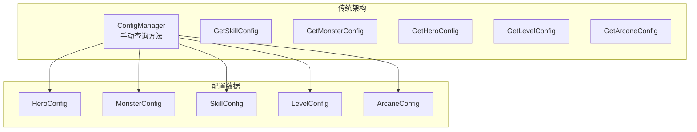
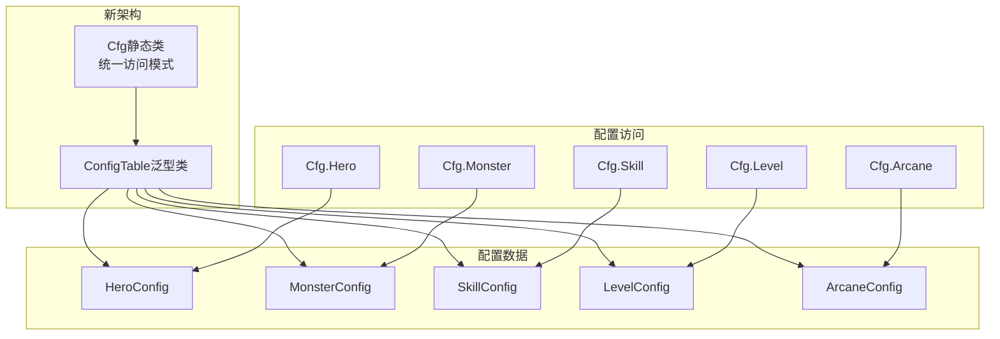

# 配置查询接口

<cite>
**本文档引用的文件**
- [Cfg.cs](file://Assets/Scripts/Core/Cfg.cs)
- [ConfigManager.cs](file://Assets/Scripts/Core/ConfigManager.cs)
- [ConfigTable.cs](file://Assets/Scripts/Core/ConfigTable.cs)
- [HeroConfig.cs](file://Assets/Scripts/Data/Configs/HeroConfig.cs)
- [SkillConfig.cs](file://Assets/Scripts/Data/Configs/SkillConfig.cs)
- [MonsterConfig.cs](file://Assets/Scripts/Data/Configs/MonsterConfig.cs)
- [BattleManager.cs](file://Assets/Scripts/Battle/BattleManager.cs)
- [SkillSlotUI.cs](file://Assets/Scripts/UI/SkillSlotUI.cs)
- [ArcaneManager.cs](file://Assets/Scripts/Battle/ArcaneManager.cs)
</cite>

## 更新摘要
**变更内容**
- 配置查询接口已简化为统一的Cfg类访问模式
- 新增ConfigTable泛型类提供类型安全的配置访问
- 移除了手动查询方法，采用静态属性访问所有配置类型
- 保留了ConfigManager作为底层数据容器和缓存管理器

## 目录
1. [简介](#简介)
2. [架构演进](#架构演进)
3. [核心组件](#核心组件)
4. [统一访问模式](#统一访问模式)
5. [ConfigTable泛型架构](#configtable泛型架构)
6. [使用示例与最佳实践](#使用示例与最佳实践)
7. [性能优化与缓存机制](#性能优化与缓存机制)
8. [迁移指南](#迁移指南)
9. [故障排除](#故障排除)
10. [总结](#总结)

## 简介

GeometryTD项目的配置查询系统经历了从手动查询方法到统一访问模式的重大演进。新的Cfg类架构提供了更加简洁、类型安全且高效的配置访问方式，替代了原有的ConfigManager手动查询方法。

新架构的核心优势包括：
- **统一访问模式**：通过静态属性提供一致的访问体验
- **类型安全性**：编译时类型检查，减少运行时错误
- **性能优化**：基于字典索引的O(1)查询效率
- **易于扩展**：支持新的配置类型而无需修改现有代码

## 架构演进

### 传统架构（已废弃）



### 新架构（当前）



**图表来源**
- [Cfg.cs:7-33](file://Assets/Scripts/Core/Cfg.cs#L7-L33)
- [ConfigTable.cs:11-71](file://Assets/Scripts/Core/ConfigTable.cs#L11-L71)

## 核心组件

### Cfg静态类

Cfg类是新架构的核心，提供静态属性访问所有配置类型：

```csharp
public static class Cfg
{
    public static ConfigTable<ArcaneConfig, ArcaneMeta> Arcane { get; }
    public static ConfigTable<AttributeConfig> Attribute { get; }
    public static ConfigTable<BuffConfig> Buff { get; }
    public static ConfigTable<BulletEventConfig> BulletEvent { get; }
    public static ConfigTable<BulletStyleConfig> BulletStyle { get; }
    public static ConfigTable<ChoiceGroupConfig> ChoiceGroup { get; }
    public static ConfigTable<ConditionConfig> Condition { get; }
    public static ConfigTable<DialogueConfig> Dialogue { get; }
    public static ConfigTable<EventConfig> Event { get; }
    public static ConfigTable<EventEffectConfig> EventEffect { get; }
    public static ConfigTable<EventShopConfig> EventShop { get; }
    public static ConfigMeta<GlobalMeta> Global { get; }
    public static ConfigTable<HeroConfig, HeroMeta> Hero { get; }
    public static ConfigTable<LevelConfig> Level { get; }
    public static ConfigTable<MonsterConfig, MonsterMeta> Monster { get; }
    public static ConfigTable<PassiveConfig> Passive { get; }
    public static ConfigTable<PassiveEffectConfig> PassiveEffect { get; }
    public static ConfigTable<RoleConfig> Role { get; }
    public static ConfigTable<SkillConfig, SkillMeta> Skill { get; }
    public static ConfigTable<SkillPoolConfig> SkillPool { get; }
    public static ConfigTable<StoryCollectionConfig> StoryCollection { get; }
    public static ConfigTable<StoryNodeConfig> StoryNode { get; }
}
```

**章节来源**
- [Cfg.cs:7-33](file://Assets/Scripts/Core/Cfg.cs#L7-L33)

### ConfigManager重构

ConfigManager现在主要承担数据容器和缓存管理职责：

```csharp
public class ConfigManager : MonoBehaviour
{
    public static ConfigManager Instance { get; private set; }
    
    // 配置表字段（自动生成）
    public ConfigTable<ArcaneConfig, ArcaneMeta> arcaneTable;
    public ConfigTable<HeroConfig, HeroMeta> heroTable;
    public ConfigTable<MonsterConfig, MonsterMeta> monsterTable;
    public ConfigTable<SkillConfig, SkillMeta> skillTable;
    // ... 其他配置表
    
    // 仅保留必要的自定义方法
    public SkillConfig GetSkillConfigByPool(int poolId, int level);
    public MonsterConfig GetBossConfig();
    public List<MonsterConfig> GetNormalMonsterConfigs();
}
```

**章节来源**
- [ConfigManager.cs:11-37](file://Assets/Scripts/Core/ConfigManager.cs#L11-L37)
- [ConfigManager.cs:196-303](file://Assets/Scripts/Core/ConfigManager.cs#L196-L303)

## 统一访问模式

### 基本查询模式

新架构提供了统一的查询模式，所有配置类型都遵循相同的访问约定：

```csharp
// 获取单个配置项
HeroConfig hero = Cfg.Hero.Get(1);
SkillConfig skill = Cfg.Skill.Get(1001);
MonsterConfig monster = Cfg.Monster.Get(100);

// 获取所有配置项
List<HeroConfig> allHeroes = Cfg.Hero.All;
List<SkillConfig> allSkills = Cfg.Skill.All;
List<MonsterConfig> allMonsters = Cfg.Monster.All;

// 获取元数据配置
int defaultHeroId = Cfg.Hero.Meta.default_hero_id;
int[] skillSlotIds = Cfg.Skill.Meta.slot_ids;
```

### 类型安全的访问

ConfigTable泛型类确保了编译时的类型安全：

```csharp
// 正确：类型匹配
HeroConfig hero = Cfg.Hero.Get(1); // 返回HeroConfig

// 编译错误：类型不匹配
// HeroConfig hero = Cfg.Skill.Get(1001); // 编译器会报错
```

**章节来源**
- [ConfigTable.cs:26-31](file://Assets/Scripts/Core/ConfigTable.cs#L26-L31)
- [ConfigTable.cs:51-56](file://Assets/Scripts/Core/ConfigTable.cs#L51-L56)

## ConfigTable泛型架构

### 泛型配置表设计

ConfigTable类提供了两种主要变体：

#### 带元数据的配置表
```csharp
public class ConfigTable<TItem, TMeta>
{
    public List<TItem> All { get; private set; }
    public TMeta Meta { get; private set; }
    private Dictionary<int, TItem> lookup;
    
    public TItem Get(int id) { /* 实现 */ }
    public void Init(List<TItem> items, TMeta meta, Func<TItem, int> keySelector) { /* 实现 */ }
}
```

#### 纯配置表
```csharp
public class ConfigTable<TItem>
{
    public List<TItem> All { get; private set; }
    private Dictionary<int, TItem> lookup;
    
    public TItem Get(int id) { /* 实现 */ }
    public void Init(List<TItem> items, Func<TItem, int> keySelector) { /* 实现 */ }
}
```

### 元数据配置表

某些配置类型包含元数据信息：

```csharp
// Hero配置包含默认英雄ID
int defaultHero = Cfg.Hero.Meta.default_hero_id;

// Skill配置包含技能槽ID数组
int[] slotIds = Cfg.Skill.Meta.slot_ids;

// Monster配置包含BossID
int bossId = Cfg.Monster.Meta.boss_monster_id;
```

**章节来源**
- [ConfigTable.cs:11-32](file://Assets/Scripts/Core/ConfigTable.cs#L11-L32)
- [ConfigTable.cs:38-57](file://Assets/Scripts/Core/ConfigTable.cs#L38-L57)
- [HeroConfig.cs:26-29](file://Assets/Scripts/Data/Configs/HeroConfig.cs#L26-L29)
- [SkillConfig.cs:31-34](file://Assets/Scripts/Data/Configs/SkillConfig.cs#L31-L34)

## 使用示例与最佳实践

### 基本使用模式

#### 英雄系统
```csharp
// 获取英雄配置
HeroConfig hero = Cfg.Hero.Get(heroId);
if (hero != null)
{
    // 使用英雄属性
    float health = hero.attrs[0].value;
    int[] attackSkills = hero.attack_skill_ids;
}

// 获取默认英雄ID
int defaultHeroId = Cfg.Hero.Meta.default_hero_id;
```

#### 技能系统
```csharp
// 获取技能配置
SkillConfig skill = Cfg.Skill.Get(skillId);
if (skill != null)
{
    // 使用技能属性
    string skillName = skill.name;
    int damage = skill.dmg;
    float cooldown = skill.cd;
}

// 获取技能池配置
SkillPoolConfig pool = Cfg.SkillPool.Get(poolId);
```

#### 怪物系统
```csharp
// 获取怪物配置
MonsterConfig monster = Cfg.Monster.Get(monsterId);
if (monster != null)
{
    // 区分Boss和普通怪物
    if (monster.is_boss)
    {
        // Boss特殊处理
    }
    else
    {
        // 普通怪物处理
    }
}
```

### UI系统集成

#### 技能槽UI
```csharp
// 从技能池获取图标和名称
var poolConfig = Cfg.SkillPool.Get(state.skillPoolId);
if (poolConfig != null)
{
    nameText.text = poolConfig.name;
    if (!string.IsNullOrEmpty(poolConfig.icon) && iconImage != null)
    {
        var sprite = GameHelper.LoadSprite(poolConfig.icon);
        if (sprite != null)
            iconImage.sprite = sprite;
    }
}
```

#### 奥术系统
```csharp
// 获取奥术配置
var config = Cfg.Arcane.Get(arcaneSlotIds[i]);
if (config != null)
{
    // 更新UI显示
    arcaneSlotUI.UpdateIcon(config.icon);
}
```

**章节来源**
- [BattleManager.cs:155-167](file://Assets/Scripts/Battle/BattleManager.cs#L155-L167)
- [SkillSlotUI.cs:46-58](file://Assets/Scripts/UI/SkillSlotUI.cs#L46-L58)
- [ArcaneManager.cs:46-46](file://Assets/Scripts/Battle/ArcaneManager.cs#L46-L46)

## 性能优化与缓存机制

### 查询性能特点

新架构保持了优秀的查询性能：

| 查询类型 | 时间复杂度 | 空间复杂度 | 说明 |
|---------|-----------|-----------|------|
| 字典查询 | O(1) | O(n) | 基于ID的直接索引 |
| 列表遍历 | O(n) | O(n) | 获取所有配置项 |
| 预加载查询 | O(1) | O(m) | 预先构建的缓存索引 |

### 缓存机制

ConfigTable内部使用字典进行缓存：

```csharp
private Dictionary<int, TItem> lookup;

public void Init(List<TItem> items, Func<TItem, int> keySelector)
{
    All = items ?? new List<TItem>();
    lookup = new Dictionary<int, TItem>();
    foreach (var item in All)
        lookup[keySelector(item)] = item; // 预构建索引
}
```

### 性能优化建议

1. **批量查询优化**：对于批量操作，优先使用`Cfg.Table.All`获取完整列表
2. **缓存查询结果**：对于频繁使用的配置，考虑在业务逻辑层缓存
3. **避免重复加载**：利用ConfigManager的预加载机制，避免重复查询

**章节来源**
- [ConfigTable.cs:17-24](file://Assets/Scripts/Core/ConfigTable.cs#L17-L24)
- [ConfigTable.cs:43-49](file://Assets/Scripts/Core/ConfigTable.cs#L43-L49)

## 迁移指南

### 从旧API迁移到新API

#### 手动查询方法替换

**旧代码**：
```csharp
// 传统方式
HeroConfig hero = ConfigManager.Instance.GetHeroConfig(heroId);
SkillConfig skill = ConfigManager.Instance.GetSkillConfig(skillId);
MonsterConfig monster = ConfigManager.Instance.GetMonsterConfig(monsterId);
```

**新代码**：
```csharp
// 新方式
HeroConfig hero = Cfg.Hero.Get(heroId);
SkillConfig skill = Cfg.Skill.Get(skillId);
MonsterConfig monster = Cfg.Monster.Get(monsterId);
```

#### 元数据访问迁移

**旧代码**：
```csharp
// 传统方式
int defaultHeroId = ConfigManager.Instance.GetHeroDefaultId();
int[] skillSlotIds = ConfigManager.Instance.GetSkillSlotIds();
```

**新代码**：
```csharp
// 新方式
int defaultHeroId = Cfg.Hero.Meta.default_hero_id;
int[] skillSlotIds = Cfg.Skill.Meta.slot_ids;
```

#### 自定义查询方法

ConfigManager中的一些自定义查询方法仍然可用：

```csharp
// 仍可使用的方法
SkillConfig skill = ConfigManager.Instance.GetSkillConfigByPool(poolId, level);
MonsterConfig boss = ConfigManager.Instance.GetBossConfig();
List<MonsterConfig> normalMonsters = ConfigManager.Instance.GetNormalMonsterConfigs();
```

**章节来源**
- [ConfigManager.cs:197-200](file://Assets/Scripts/Core/ConfigManager.cs#L197-L200)
- [ConfigManager.cs:202-210](file://Assets/Scripts/Core/ConfigManager.cs#L202-L210)

## 故障排除

### 常见问题及解决方案

#### 配置未找到

**问题症状**：查询返回null

**解决方法**：
```csharp
HeroConfig hero = Cfg.Hero.Get(heroId);
if (hero == null)
{
    Debug.LogError($"未找到英雄配置: id={heroId}");
    // 处理默认情况
    return GetDefaultHeroConfig();
}
```

#### 配置初始化问题

**问题症状**：Cfg类属性为null

**解决方法**：
```csharp
// 确保ConfigManager已初始化
if (ConfigManager.Instance == null)
{
    Debug.LogError("ConfigManager未初始化");
    return;
}

// 等待配置加载完成
yield return new WaitUntil(() => Cfg.Hero != null && Cfg.Hero.All != null);
```

#### 类型转换错误

**问题症状**：编译错误或运行时类型不匹配

**解决方法**：
```csharp
// 确保使用正确的配置类型
HeroConfig hero = Cfg.Hero.Get(id); // 正确
// SkillConfig skill = Cfg.Hero.Get(id); // 错误！
```

### 性能监控

```csharp
// 监控查询性能
var startTime = Time.time;
HeroConfig hero = Cfg.Hero.Get(heroId);
var endTime = Time.time;
Debug.Log($"查询耗时: {(endTime - startTime) * 1000}ms");
```

## 总结

GeometryTD项目的配置查询系统通过引入Cfg类和ConfigTable泛型架构，实现了从手动查询到统一访问模式的重大升级。新架构的主要优势包括：

1. **统一访问模式**：所有配置类型使用相同的访问语法
2. **类型安全性**：编译时类型检查，减少运行时错误
3. **性能优化**：基于字典索引的O(1)查询效率
4. **易于维护**：清晰的架构分离，便于扩展和维护
5. **向后兼容**：保留必要的自定义查询方法

新架构为游戏开发提供了更加可靠和高效的配置管理基础，能够满足不同类型游戏配置数据的查询需求，同时保持了良好的性能表现和开发体验。