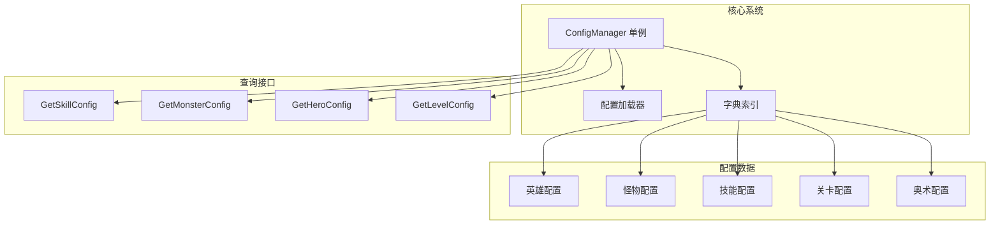
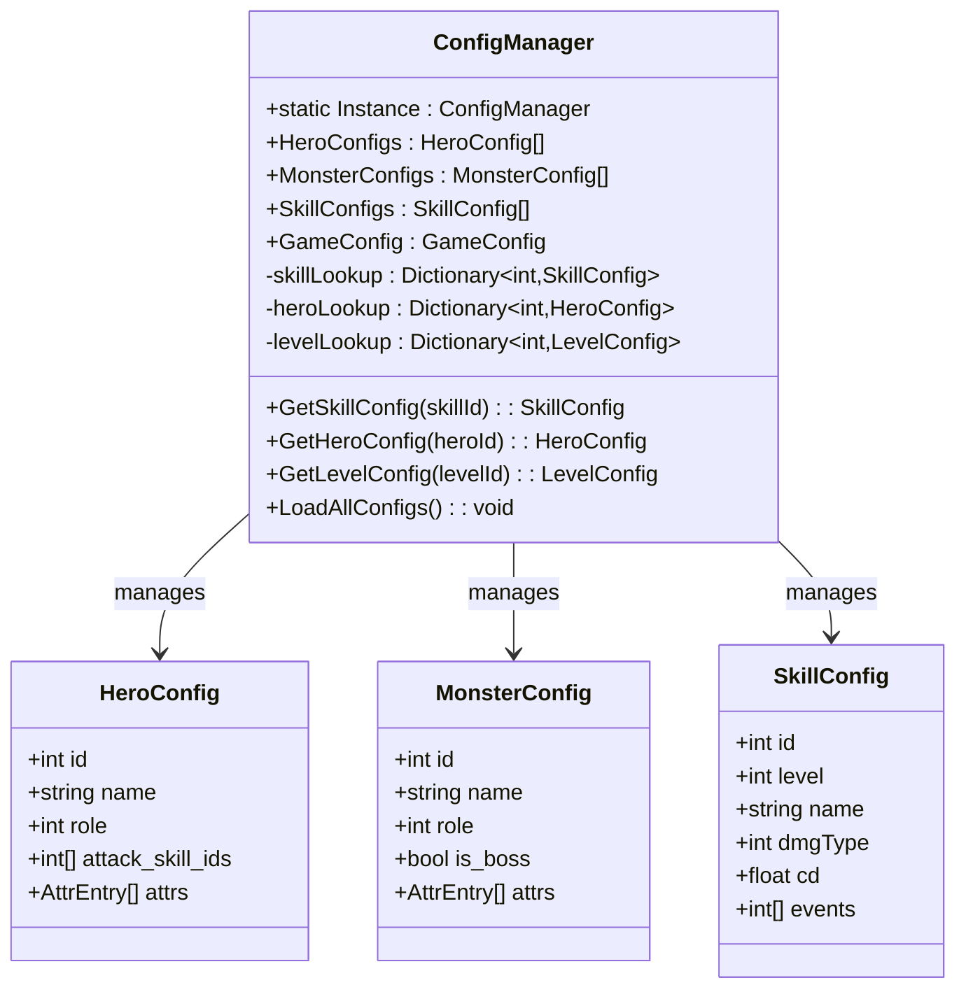
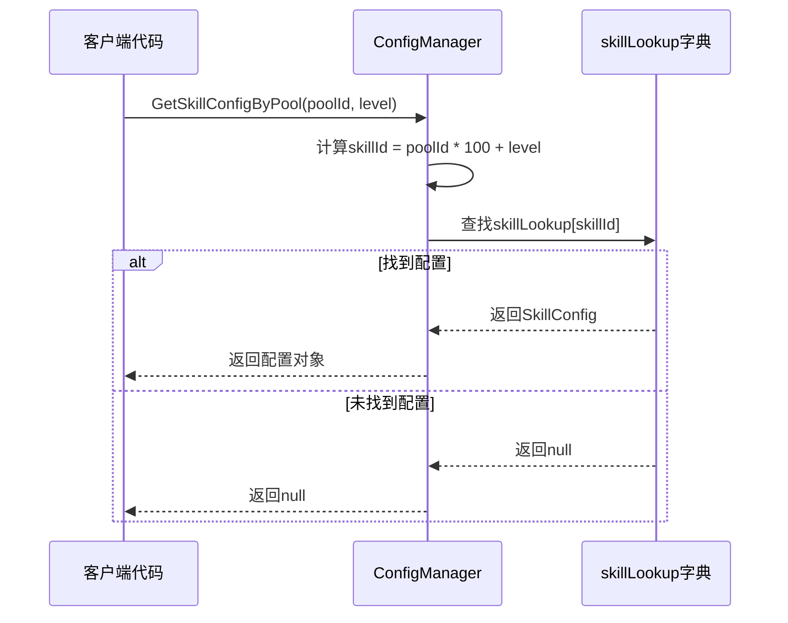
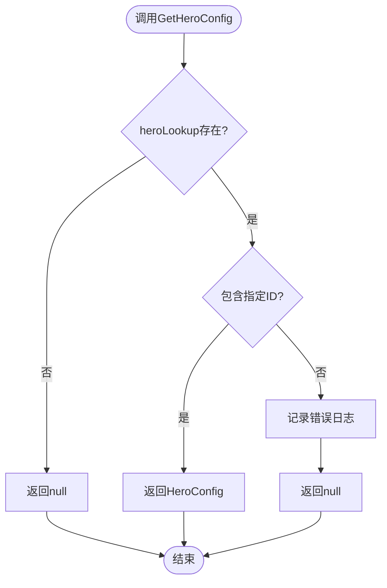
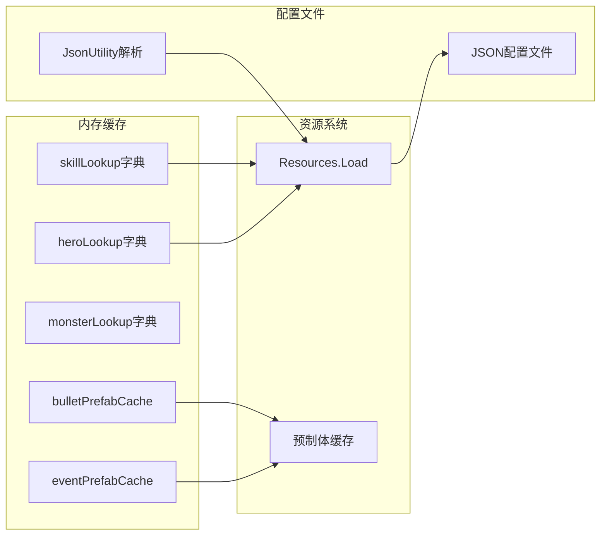
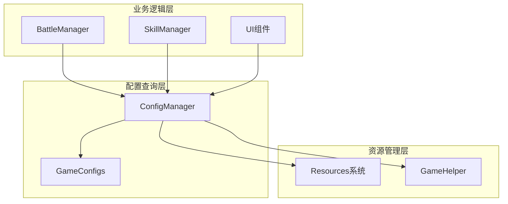

# 配置查询接口

<cite>
**本文档引用的文件**
- [ConfigManager.cs](file://Assets/Scripts/Core/ConfigManager.cs)
- [GameConfigs.cs](file://Assets/Scripts/Data/GameConfigs.cs)
- [hero_config.json](file://Assets/Resources/Configs/hero_config.json)
- [monster_config.json](file://Assets/Resources/Configs/monster_config.json)
- [skill_config.json](file://Assets/Resources/Configs/skill_config.json)
- [BattleManager.cs](file://Assets/Scripts/Battle/BattleManager.cs)
- [SkillSlotUI.cs](file://Assets/Scripts/UI/SkillSlotUI.cs)
- [GameHelper.cs](file://Assets/Scripts/Core/GameHelper.cs)
</cite>

## 目录
1. [简介](#简介)
2. [项目结构](#项目结构)
3. [核心组件](#核心组件)
4. [架构概览](#架构概览)
5. [详细组件分析](#详细组件分析)
6. [依赖关系分析](#依赖关系分析)
7. [性能考虑](#性能考虑)
8. [故障排除指南](#故障排除指南)
9. [结论](#结论)
10. [附录](#附录)

## 简介

GeometryTD项目中的ConfigManager是一个关键的配置管理系统，负责加载、管理和查询游戏中的各种配置数据。该系统提供了丰富的查询接口，支持英雄、怪物、技能、关卡等多种配置类型的快速检索。

ConfigManager采用单例模式设计，通过内部字典索引实现了接近O(1)的查询效率，同时提供了完善的错误处理机制和日志记录功能。系统支持JSON格式的配置文件，这些文件位于Assets/Resources/Configs目录下。

## 项目结构

ConfigManager系统主要由以下组件构成：



**图表来源**
- [ConfigManager.cs:6-120](file://Assets/Scripts/Core/ConfigManager.cs#L6-L120)

**章节来源**
- [ConfigManager.cs:1-619](file://Assets/Scripts/Core/ConfigManager.cs#L1-L619)

## 核心组件

### ConfigManager类结构

ConfigManager是整个配置系统的核心，采用了单例模式确保全局唯一性。该类包含以下主要特性：

- **单例模式**: 通过静态Instance属性提供全局访问点
- **配置列表**: 维护各类配置的完整列表
- **字典索引**: 为常用查询建立O(1)时间复杂度的索引
- **预加载机制**: 在初始化时构建所有必要的索引

### 主要配置类别

系统支持以下主要配置类别：

| 配置类别 | 数据类型 | 描述 |
|---------|----------|------|
| HeroConfigs | List<HeroConfig> | 英雄角色配置 |
| MonsterConfigs | List<MonsterConfig> | 怪物配置 |
| SkillConfigs | List<SkillConfig> | 技能配置 |
| LevelConfigs | List<LevelConfig> | 关卡配置 |
| ArcaneConfigs | List<ArcaneConfig> | 奥术配置 |
| RoleConfigs | List<RoleConfig> | 角色类型配置 |

**章节来源**
- [ConfigManager.cs:10-36](file://Assets/Scripts/Core/ConfigManager.cs#L10-L36)

## 架构概览

ConfigManager的架构设计体现了高性能查询和灵活扩展的特点：



**图表来源**
- [ConfigManager.cs:6-618](file://Assets/Scripts/Core/ConfigManager.cs#L6-L618)
- [GameConfigs.cs:318-401](file://Assets/Scripts/Data/GameConfigs.cs#L318-L401)

## 详细组件分析

### 查询接口设计

#### 技能查询接口

ConfigManager提供了多种技能查询接口，满足不同场景的需求：



**图表来源**
- [ConfigManager.cs:217-234](file://Assets/Scripts/Core/ConfigManager.cs#L217-L234)

**章节来源**
- [ConfigManager.cs:217-234](file://Assets/Scripts/Core/ConfigManager.cs#L217-L234)

#### 英雄查询接口

英雄查询接口提供了基于ID的快速检索：



**图表来源**
- [ConfigManager.cs:382-388](file://Assets/Scripts/Core/ConfigManager.cs#L382-L388)

**章节来源**
- [ConfigManager.cs:382-388](file://Assets/Scripts/Core/ConfigManager.cs#L382-L388)

#### 怪物查询接口

怪物查询接口支持按ID和Boss类型查询：

**章节来源**
- [ConfigManager.cs:236-256](file://Assets/Scripts/Core/ConfigManager.cs#L236-L256)

### 缓存系统集成

ConfigManager实现了多层次的缓存机制：



**图表来源**
- [ConfigManager.cs:61-122](file://Assets/Scripts/Core/ConfigManager.cs#L61-L122)

**章节来源**
- [ConfigManager.cs:61-198](file://Assets/Scripts/Core/ConfigManager.cs#L61-L198)

### 错误处理机制

系统实现了完善的错误处理和日志记录：

| 错误级别 | 处理方式 | 日志类型 |
|---------|---------|---------|
| 严重错误 | 记录错误日志并返回null | Debug.LogError |
| 警告信息 | 记录警告日志并返回null | Debug.LogWarning |
| 资源缺失 | 记录警告并跳过加载 | Debug.LogWarning |

**章节来源**
- [ConfigManager.cs:243-255](file://Assets/Scripts/Core/ConfigManager.cs#L243-L255)

## 依赖关系分析

ConfigManager与其他系统组件的依赖关系如下：



**图表来源**
- [BattleManager.cs:153-159](file://Assets/Scripts/Battle/BattleManager.cs#L153-L159)
- [SkillSlotUI.cs:144-149](file://Assets/Scripts/UI/SkillSlotUI.cs#L144-L149)

**章节来源**
- [BattleManager.cs:153-159](file://Assets/Scripts/Battle/BattleManager.cs#L153-L159)
- [SkillSlotUI.cs:144-149](file://Assets/Scripts/UI/SkillSlotUI.cs#L144-L149)

## 性能考虑

### 查询性能特点

ConfigManager的查询性能具有以下特点：

| 查询类型 | 时间复杂度 | 空间复杂度 | 说明 |
|---------|-----------|-----------|------|
| 字典查询 | O(1) | O(n) | 基于ID的直接索引 |
| 列表查询 | O(n) | O(n) | 线性搜索遍历 |
| 预加载查询 | O(1) | O(m) | 预先构建的缓存索引 |

### 优化策略

针对频繁查询场景，建议采用以下优化策略：

1. **优先使用字典查询**: 对于高频查询，优先使用基于字典的查询方法
2. **合理使用缓存**: 利用ConfigManager内置的缓存机制
3. **批量查询优化**: 对于批量操作，考虑一次性加载所有需要的数据

### 使用建议

- **查询频率**: 对于每帧多次查询的场景，建议缓存查询结果
- **错误处理**: 始终检查查询结果，避免空引用异常
- **资源管理**: 注意避免重复加载相同的资源文件

## 故障排除指南

### 常见问题及解决方案

#### 配置文件加载失败

**问题症状**: 控制台出现"无法加载配置文件"错误

**解决方法**:
1. 检查配置文件路径是否正确
2. 确认JSON格式是否符合要求
3. 验证配置文件是否存在于Resources目录

#### 查询结果为空

**问题症状**: GetHeroConfig等方法返回null

**解决方法**:
1. 确认传入的ID是否正确
2. 检查配置文件中是否存在对应ID的条目
3. 验证ConfigManager是否已完成初始化

#### 性能问题

**问题症状**: 游戏运行缓慢或卡顿

**解决方法**:
1. 检查是否有不必要的重复查询
2. 考虑使用缓存机制
3. 优化查询频率

**章节来源**
- [ConfigManager.cs:200-215](file://Assets/Scripts/Core/ConfigManager.cs#L200-L215)

## 结论

ConfigManager作为GeometryTD项目的核心配置管理系统，通过精心设计的架构实现了高性能的配置查询功能。其主要优势包括：

1. **高效查询**: 通过字典索引实现O(1)的查询效率
2. **完善缓存**: 内置多层缓存机制提升性能
3. **健壮错误处理**: 提供详细的日志记录和错误处理
4. **灵活扩展**: 支持新增配置类型和查询接口

该系统为游戏开发提供了可靠的配置管理基础，能够满足不同类型游戏配置数据的查询需求。

## 附录

### 配置文件示例

#### 英雄配置示例
```json
{
  "heroes": [
    {
      "id": 1,
      "name": "小小士兵",
      "role": 1,
      "attack_skill_ids": [1001],
      "attrs": [
        {"id": 1, "value": 5000},
        {"id": 2, "value": 10}
      ]
    }
  ]
}
```

#### 技能配置示例
```json
{
  "skills": [
    {
      "id": 1001,
      "level": 1,
      "name": "剑气",
      "category": "Projectile",
      "dmg": 10000,
      "bulletEvents": [20010]
    }
  ]
}
```

### 使用示例

#### 基本查询使用
```csharp
// 获取英雄配置
HeroConfig hero = ConfigManager.Instance.GetHeroConfig(1);

// 获取技能配置
SkillConfig skill = ConfigManager.Instance.GetSkillConfig(1001);

// 获取关卡配置
LevelConfig level = ConfigManager.Instance.GetLevelConfig(1);
```

#### 高级查询使用
```csharp
// 获取技能池配置
SkillPoolConfig pool = ConfigManager.Instance.GetSkillPoolConfig(1);

// 获取怪物配置
MonsterConfig monster = ConfigManager.Instance.GetMonsterConfig(100);

// 获取Boss配置
MonsterConfig boss = ConfigManager.Instance.GetBossConfig();
```