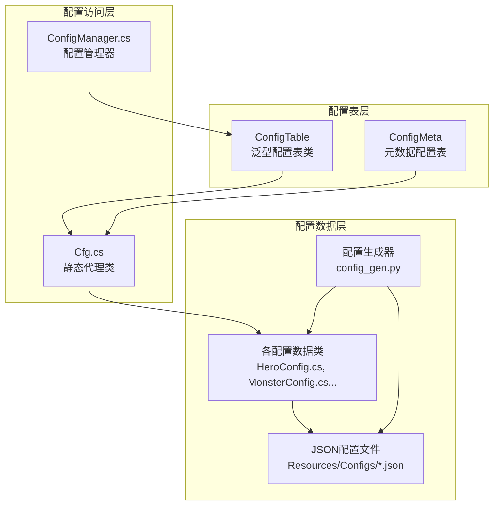
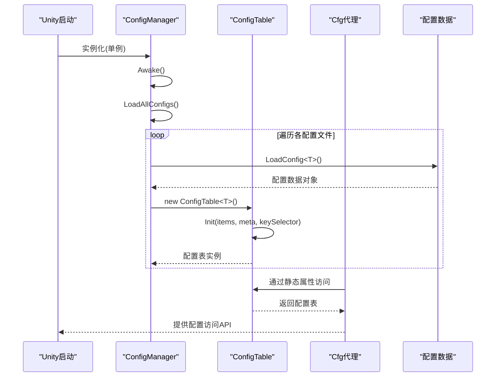
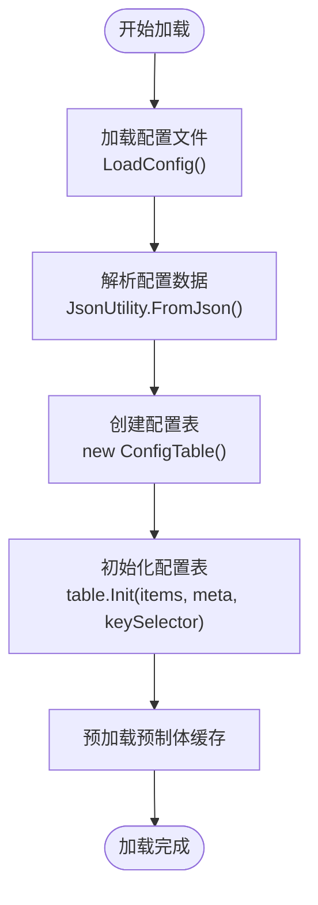
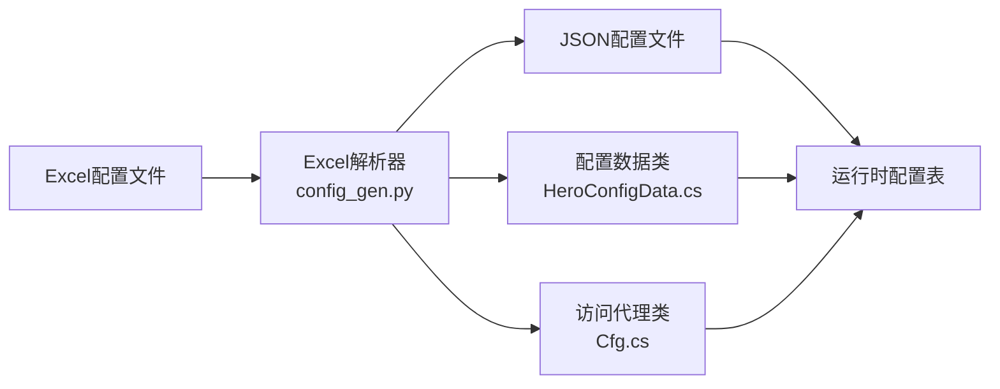
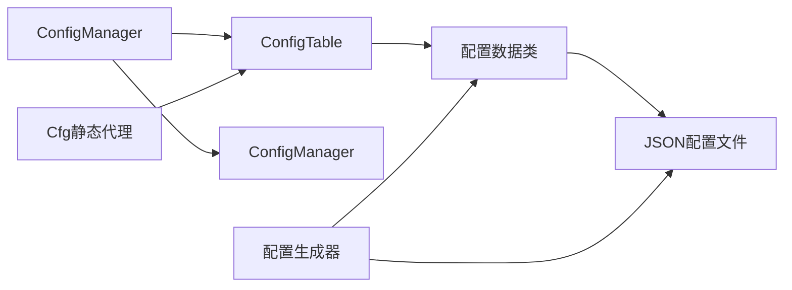

# 配置管理系统

<cite>
**本文档引用的文件**
- [ConfigManager.cs](file://Assets/Scripts/Core/ConfigManager.cs)
- [ConfigTable.cs](file://Assets/Scripts/Core/ConfigTable.cs)
- [Cfg.cs](file://Assets/Scripts/Core/Cfg.cs)
- [ArcaneConfig.cs](file://Assets/Scripts/Data/Configs/ArcaneConfig.cs)
- [GlobalConfig.cs](file://Assets/Scripts/Data/Configs/GlobalConfig.cs)
- [HeroConfig.cs](file://Assets/Scripts/Data/Configs/HeroConfig.cs)
- [MonsterConfig.cs](file://Assets/Scripts/Data/Configs/MonsterConfig.cs)
- [SkillConfig.cs](file://Assets/Scripts/Data/Configs/SkillConfig.cs)
- [arcane_config.json](file://Assets/Resources/Configs/arcane_config.json)
- [global_config.json](file://Assets/Resources/Configs/global_config.json)
- [hero_config.json](file://Assets/Resources/Configs/hero_config.json)
- [monster_config.json](file://Assets/Resources/Configs/monster_config.json)
- [skill_config.json](file://Assets/Resources/Configs/skill_config.json)
- [config_gen.py](file://Tools/config_gen.py)
</cite>

## 更新摘要
**所做更改**
- 完全重构配置管理系统架构，从手动配置管理转变为自动化配置表系统
- 引入ConfigTable泛型类提供统一的配置访问模式
- 新增Cfg静态代理类简化配置访问语法
- 移除手动索引构建代码，采用自动生成的配置表结构
- 更新配置文件组织结构，支持meta元数据和items列表分离
- 新增配置生成器工具，实现从Excel到JSON和C#代码的自动化转换

## 目录
1. [简介](#简介)
2. [项目结构](#项目结构)
3. [核心组件](#核心组件)
4. [架构总览](#架构总览)
5. [详细组件分析](#详细组件分析)
6. [配置表系统](#配置表系统)
7. [自动化配置生成](#自动化配置生成)
8. [依赖分析](#依赖分析)
9. [性能考虑](#性能考虑)
10. [故障排查指南](#故障排查指南)
11. [结论](#结论)
12. [附录：配置编写指南与最佳实践](#附录配置编写指南与最佳实践)

## 简介
本文档详细介绍GeometryTD全新重构的配置管理系统。系统已从传统的手动配置管理完全转变为自动化配置表系统，引入了ConfigManager.cs、ConfigTable.cs和Cfg.cs三大核心组件，大幅简化了配置访问模式并提升了系统的可维护性和扩展性。

新架构的核心优势包括：
- 自动化配置表生成，消除手写索引构建代码
- 统一的配置访问语法，通过Cfg静态代理类提供简洁API
- 泛型配置表支持，自动处理ID索引和查询逻辑
- 支持meta元数据和items列表分离的配置结构
- 类型安全的配置访问，编译时检查配置ID和字段类型
- 完整的配置生成工具链，支持从Excel到JSON再到C#代码的自动化转换

## 项目结构
新配置系统采用三层架构设计：

**图表来源**
- [ConfigTable.cs:11-73](file://Assets/Scripts/Core/ConfigTable.cs#L11-L73)
- [Cfg.cs:7-35](file://Assets/Scripts/Core/Cfg.cs#L7-L35)
- [ConfigManager.cs:15-38](file://Assets/Scripts/Core/ConfigManager.cs#L15-L38)
- [config_gen.py:587-688](file://Tools/config_gen.py#L587-L688)

**章节来源**
- [ConfigTable.cs:11-73](file://Assets/Scripts/Core/ConfigTable.cs#L11-L73)
- [Cfg.cs:7-35](file://Assets/Scripts/Core/Cfg.cs#L7-L35)
- [ConfigManager.cs:15-38](file://Assets/Scripts/Core/ConfigManager.cs#L15-L38)
- [config_gen.py:587-688](file://Tools/config_gen.py#L587-L688)

## 核心组件
新配置系统包含三个核心组件：

### ConfigTable泛型类
提供通用的配置表功能，支持三种模式：
- **双参数模式**：ConfigTable<TItem, TMeta> - 支持items列表和meta元数据
- **单参数模式**：ConfigTable<TItem> - 仅支持items列表
- **元数据模式**：ConfigMeta<TMeta> - 仅支持元数据
- **自动索引**：根据keySelector函数自动构建ID索引字典
- **统一查询**：提供Get(id)方法进行快速配置查询

### ConfigMeta元数据类
专门处理不需要ID索引的配置数据，如全局设置、配置参数等。

### Cfg静态代理类
提供简化的配置访问语法，通过静态属性访问各个配置表：
- `Cfg.Hero.Get(id)` - 获取英雄配置
- `Cfg.Monster.All` - 获取所有怪物配置
- `Cfg.Global.Meta.kill_count_for_boss` - 访问全局元数据

**章节来源**
- [ConfigTable.cs:11-73](file://Assets/Scripts/Core/ConfigTable.cs#L11-L73)
- [Cfg.cs:7-35](file://Assets/Scripts/Core/Cfg.cs#L7-L35)

## 架构总览
新架构采用"配置表 + 静态代理 + 自动化生成"的设计模式：

**图表来源**
- [ConfigManager.cs:56-177](file://Assets/Scripts/Core/ConfigManager.cs#L56-L177)
- [ConfigTable.cs:17-56](file://Assets/Scripts/Core/ConfigTable.cs#L17-L56)

**章节来源**
- [ConfigManager.cs:56-177](file://Assets/Scripts/Core/ConfigManager.cs#L56-L177)
- [ConfigTable.cs:17-56](file://Assets/Scripts/Core/ConfigTable.cs#L17-L56)

## 详细组件分析

### ConfigManager重构分析
ConfigManager已完全重构，移除了手动索引构建代码，采用自动化配置表系统：

#### 主要变化
- **移除手动索引**：不再需要BuildSkillLookup()、BuildHeroLookup()等手动索引构建方法
- **自动化初始化**：每个配置表通过Init()方法自动完成索引构建
- **统一加载模式**：所有配置文件采用相同的加载和初始化模式
- **保留预加载功能**：继续支持子弹、特效和角色预制体的预加载缓存

#### 加载流程优化

**图表来源**
- [ConfigManager.cs:56-177](file://Assets/Scripts/Core/ConfigManager.cs#L56-L177)

**章节来源**
- [ConfigManager.cs:56-177](file://Assets/Scripts/Core/ConfigManager.cs#L56-L177)

### 配置文件组织与作用
新架构支持更清晰的配置文件组织：

#### 全局配置：global_config.json
- **结构**：仅包含meta元数据，无items列表
- **用途**：存储全局设置参数
- **访问**：通过`Cfg.Global.Meta.property`访问

#### 带元数据配置：hero_config.json, monster_config.json, skill_config.json
- **结构**：同时包含items列表和meta元数据
- **用途**：存储配置项和相关元数据
- **访问**：通过`Cfg.Hero.Get(id)`和`Cfg.Hero.Meta`访问

#### 纯列表配置：bullet_style_config.json, buff_config.json等
- **结构**：仅包含items列表
- **用途**：存储简单配置项
- **访问**：通过`Cfg.BulletStyle.Get(id)`访问

**章节来源**
- [global_config.json:1-6](file://Assets/Resources/Configs/global_config.json#L1-L6)
- [hero_config.json:1-97](file://Assets/Resources/Configs/hero_config.json#L1-L97)
- [monster_config.json:1-315](file://Assets/Resources/Configs/monster_config.json#L1-L315)
- [arcane_config.json:1-96](file://Assets/Resources/Configs/arcane_config.json#L1-L96)

## 配置表系统
ConfigTable泛型类是新架构的核心，提供统一的配置访问模式：

### 双参数配置表(ConfigTable<TItem, TMeta>)
适用于需要元数据的配置：
- **TItem**：配置项类型
- **TMeta**：元数据类型
- **示例**：HeroConfig、MonsterConfig、SkillConfig等

### 单参数配置表(ConfigTable<TItem>)
适用于纯列表配置：
- **TItem**：配置项类型
- **示例**：BuffConfig、BulletEventConfig、RoleConfig等

### 元数据配置表(ConfigMeta<TMeta>)
专门处理不需要ID索引的配置：
- **示例**：GlobalMeta、HeroMeta、MonsterMeta等

### 自动索引机制
ConfigTable内部自动维护ID到配置项的映射：
- **索引构建**：通过keySelector函数自动构建字典索引
- **查询优化**：提供O(1)时间复杂度的配置查询
- **类型安全**：编译时检查ID类型和配置项类型匹配

**章节来源**
- [ConfigTable.cs:11-73](file://Assets/Scripts/Core/ConfigTable.cs#L11-L73)

## 自动化配置生成
新系统采用自动化配置生成机制：

### 配置生成器工具
config_gen.py提供了完整的配置生成流水线：
- **Excel解析**：支持复杂的Excel结构，包括匿名结构体和共享类型
- **JSON生成**：自动生成标准的JSON配置格式
- **C#代码生成**：自动生成配置类、数据包装类和访问代理
- **类型系统**：支持基本类型、数组类型和结构体数组的自动推断

### 自动生成的配置类
每个配置文件对应自动生成的配置类：
- **HeroConfigData**：包含items和meta属性
- **MonsterConfigData**：包含items和meta属性  
- **GlobalConfigData**：仅包含meta属性
- **各配置类**：包含对应的配置项和元数据结构

### 自动生成的访问代码
Cfg.cs文件包含自动生成的静态代理属性：
- **Cfg.Hero**：访问英雄配置表
- **Cfg.Monster**：访问怪物配置表
- **Cfg.Global**：访问全局配置表
- **其他配置表**：类似的方式提供访问

### 配置生成流程

**图表来源**
- [config_gen.py:587-688](file://Tools/config_gen.py#L587-L688)

**章节来源**
- [config_gen.py:587-688](file://Tools/config_gen.py#L587-L688)

## 依赖分析
新架构的依赖关系更加清晰：

**图表来源**
- [ConfigManager.cs:15-38](file://Assets/Scripts/Core/ConfigManager.cs#L15-L38)
- [Cfg.cs:7-35](file://Assets/Scripts/Core/Cfg.cs#L7-L35)
- [config_gen.py:587-688](file://Tools/config_gen.py#L587-L688)

**章节来源**
- [ConfigManager.cs:15-38](file://Assets/Scripts/Core/ConfigManager.cs#L15-L38)
- [Cfg.cs:7-35](file://Assets/Scripts/Core/Cfg.cs#L7-L35)
- [config_gen.py:587-688](file://Tools/config_gen.py#L587-L688)

## 性能考虑
新架构在性能方面有显著改进：

### 内存优化
- **自动索引**：ConfigTable内部维护字典索引，内存开销最小化
- **延迟初始化**：配置表在首次访问时才进行索引构建
- **类型安全**：编译时检查减少运行时错误

### 查询性能
- **O(1)查询**：字典索引提供常数时间复杂度的配置查询
- **批量操作**：All属性提供完整的配置列表访问
- **元数据访问**：Meta属性提供快速的全局配置访问

### 加载优化
- **统一加载**：所有配置文件采用相同的高效加载模式
- **预加载缓存**：继续支持预制体的预加载缓存机制
- **错误处理**：完善的错误日志和异常处理机制

**章节来源**
- [ConfigTable.cs:26-56](file://Assets/Scripts/Core/ConfigTable.cs#L26-L56)
- [ConfigManager.cs:169-177](file://Assets/Scripts/Core/ConfigManager.cs#L169-L177)

## 故障排查指南
新架构的故障排查更加直观：

### 配置加载问题
- **检查JSON格式**：确认JSON文件语法正确
- **验证配置类**：确保配置类与JSON结构匹配
- **查看生成代码**：检查自动生成的配置代码是否正确

### 配置访问问题
- **验证ID存在性**：确认配置ID在JSON文件中存在
- **检查类型匹配**：确保访问的配置类型正确
- **查看索引构建**：确认ConfigTable的Init方法正确执行

### 预加载问题
- **检查资源路径**：确认prefabPath指向正确的资源
- **验证资源存在**：确保Resources中存在对应预制体
- **查看缓存状态**：确认预加载缓存正常工作

**章节来源**
- [ConfigManager.cs:179-194](file://Assets/Scripts/Core/ConfigManager.cs#L179-L194)
- [ConfigTable.cs:17-56](file://Assets/Scripts/Core/ConfigTable.cs#L17-L56)

## 结论
GeometryTD的配置管理系统已完成完全重构，新架构通过ConfigTable泛型类、Cfg静态代理和自动化配置生成机制，实现了更加高效、类型安全和易于维护的配置管理方案。

新系统的主要优势：
- **自动化程度高**：自动生成配置访问代码，减少手写样板代码
- **类型安全**：编译时检查配置ID和类型匹配
- **性能优异**：字典索引提供O(1)查询性能
- **扩展性强**：支持新的配置类型和结构变更
- **维护成本低**：统一的配置表模式简化了代码维护
- **开发效率高**：完整的工具链支持从Excel到运行时的自动化转换

未来可以在此基础上进一步优化配置热更新、增量加载等功能，为游戏的持续迭代提供更好的支持。

## 附录：配置编写指南与最佳实践

### 配置文件编写规范
- **文件命名**：使用snake_case命名，如`hero_config.xlsx`
- **结构统一**：遵循items + meta的结构模式
- **ID规范**：使用有意义的ID，避免冲突
- **字段命名**：使用驼峰命名法，如`attackSkillIds`

### 配置数据类定义
- **自动生成**：通过config_gen.py自动生成配置类
- **类型安全**：确保字段类型与JSON数据匹配
- **元数据分离**：将配置项和元数据分别定义

### 配置访问最佳实践
- **使用Cfg代理**：通过`Cfg.Hero.Get(id)`访问配置
- **检查空值**：访问配置后检查返回值是否为空
- **批量操作**：使用`Cfg.Hero.All`进行批量配置访问
- **元数据访问**：通过`Cfg.Global.Meta`访问全局设置

### 性能优化建议
- **合理使用索引**：ConfigTable自动维护索引，无需手动优化
- **避免频繁查询**：缓存常用的配置结果
- **批量加载**：利用ConfigManager的一次性加载机制
- **资源管理**：合理使用预制体预加载缓存

### 扩展新配置类型的步骤
1. **创建Excel文件**：定义新的配置数据结构
2. **运行生成器**：执行python Tools/config_gen.py生成配置
3. **更新ConfigManager**：在LoadAllConfigs中添加新配置
4. **使用配置**：通过Cfg代理类访问新配置

**章节来源**
- [ArcaneConfig.cs:1-42](file://Assets/Scripts/Data/Configs/ArcaneConfig.cs#L1-L42)
- [HeroConfig.cs:1-38](file://Assets/Scripts/Data/Configs/HeroConfig.cs#L1-L38)
- [MonsterConfig.cs:1-37](file://Assets/Scripts/Data/Configs/MonsterConfig.cs#L1-L37)
- [SkillConfig.cs:1-44](file://Assets/Scripts/Data/Configs/SkillConfig.cs#L1-L44)
- [config_gen.py:587-688](file://Tools/config_gen.py#L587-L688)