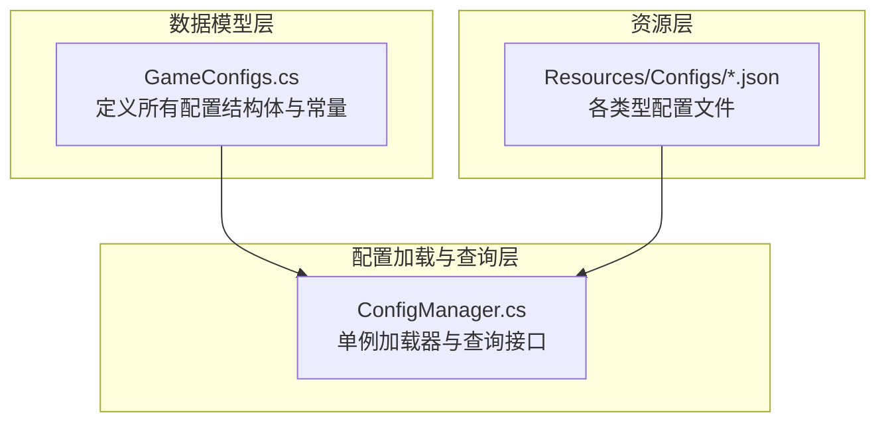
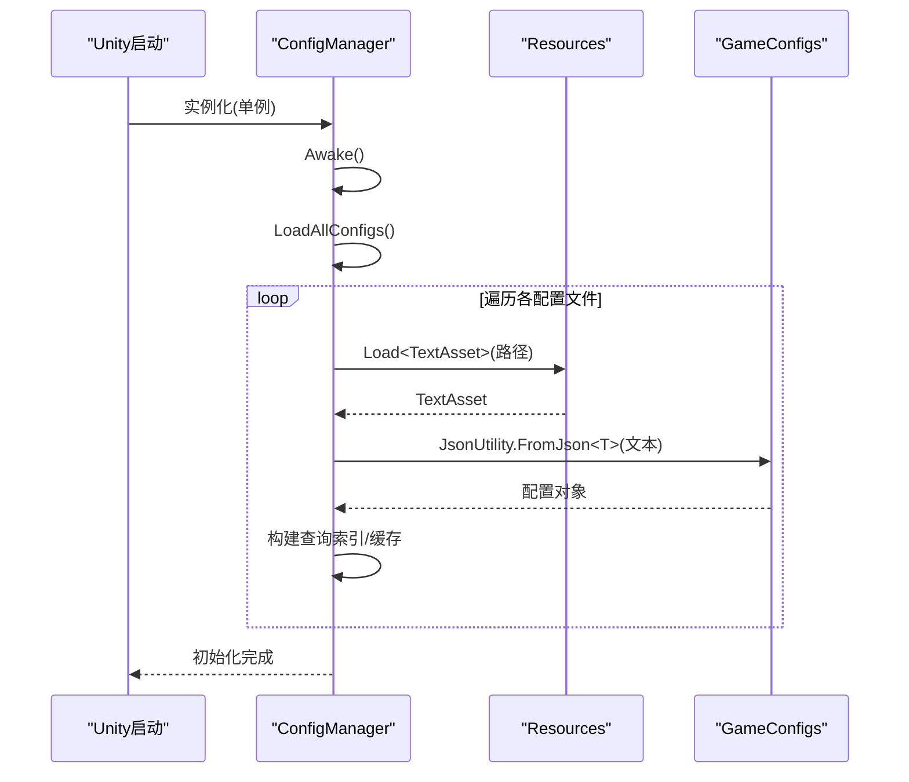
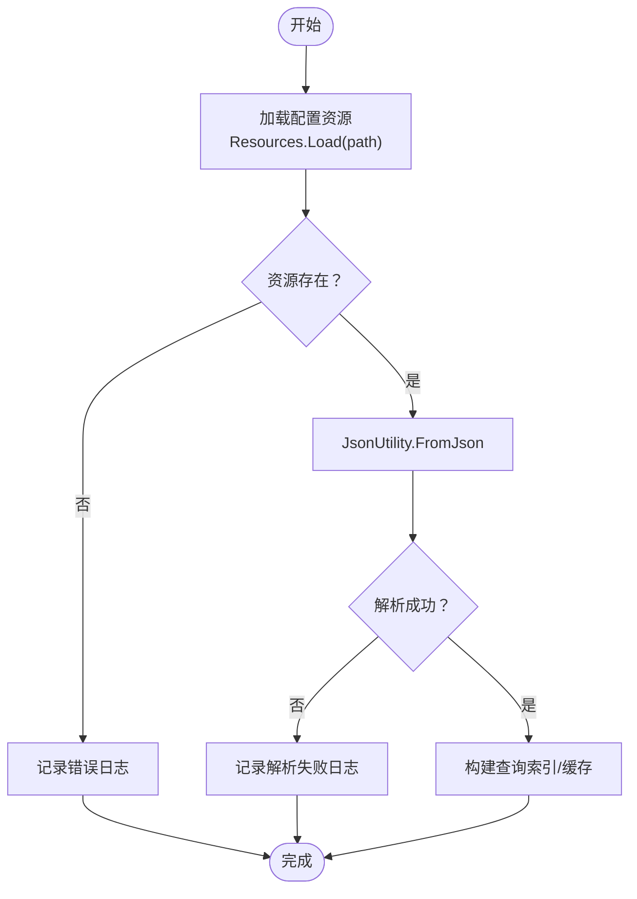
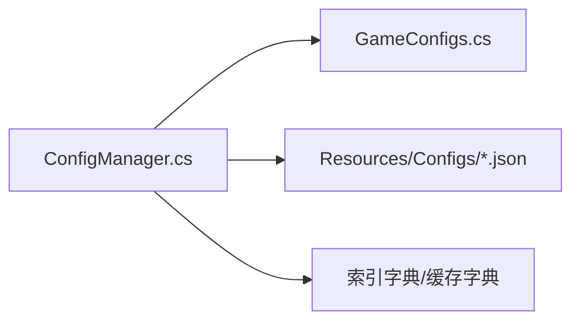

# 配置管理系统

<cite>
**本文档引用的文件**
- [ConfigManager.cs](file://Assets/Scripts/Core/ConfigManager.cs)
- [GameConfigs.cs](file://Assets/Scripts/Data/GameConfigs.cs)
- [game_config.json](file://Assets/Resources/Configs/game_config.json)
- [hero_config.json](file://Assets/Resources/Configs/hero_config.json)
- [monster_config.json](file://Assets/Resources/Configs/monster_config.json)
- [skill_config.json](file://Assets/Resources/Configs/skill_config.json)
- [skill_pool_config.json](file://Assets/Resources/Configs/skill_pool_config.json)
- [attribute_config.json](file://Assets/Resources/Configs/attribute_config.json)
- [bullet_config.json](file://Assets/Resources/Configs/bullet_config.json)
</cite>

## 目录
1. [简介](#简介)
2. [项目结构](#项目结构)
3. [核心组件](#核心组件)
4. [架构总览](#架构总览)
5. [详细组件分析](#详细组件分析)
6. [依赖分析](#依赖分析)
7. [性能考虑](#性能考虑)
8. [故障排查指南](#故障排查指南)
9. [结论](#结论)
10. [附录：配置编写指南与最佳实践](#附录配置编写指南与最佳实践)

## 简介
本文件面向GeometryTD的配置管理系统，围绕ConfigManager进行深入技术说明，涵盖以下主题：
- JSON配置文件的加载机制与资源路径约定
- 配置数据的缓存策略与查询接口设计
- 各类配置文件的作用与格式（如全局game_config.json、英雄hero_config.json、怪物monster_config.json等）
- 解析与验证机制（错误日志、空值保护、索引构建）
- 扩展性设计（新增配置类型、结构变更、热更新思路）
- 配置驱动开发的优势与实现方式
- 性能优化策略（延迟加载、内存管理、缓存机制）
- 配置文件编写指南（字段定义、数值范围、引用关系）

## 项目结构
配置系统主要由三部分组成：
- 数据模型层：在GameConfigs.cs中定义了所有配置的数据结构与枚举常量
- 配置加载与查询层：在ConfigManager.cs中实现统一加载、索引构建与查询接口
- 资源层：Assets/Resources/Configs下的JSON配置文件

图表来源
- [ConfigManager.cs:77-122](file://Assets/Scripts/Core/ConfigManager.cs#L77-L122)
- [GameConfigs.cs:104-120](file://Assets/Scripts/Data/GameConfigs.cs#L104-L120)

章节来源
- [ConfigManager.cs:77-122](file://Assets/Scripts/Core/ConfigManager.cs#L77-L122)
- [GameConfigs.cs:104-120](file://Assets/Scripts/Data/GameConfigs.cs#L104-L120)

## 核心组件
- 单例ConfigManager：负责加载所有配置、构建查询索引、预加载预制体缓存，并提供统一查询接口
- 数据模型GameConfigs：集中定义所有配置结构体、枚举常量、工具方法（如属性查询）
- 资源配置：以JSON形式存储，通过Resources.Load按路径加载

关键职责与特性：
- 统一加载：在Awake阶段一次性加载所有配置文件
- 索引构建：为常用查询建立字典索引，支持O(1)快速查找
- 预加载缓存：对子弹与特效预制体进行缓存，避免运行时重复加载
- 安全查询：对缺失或无效配置返回默认值或记录错误日志

章节来源
- [ConfigManager.cs:65-122](file://Assets/Scripts/Core/ConfigManager.cs#L65-L122)
- [ConfigManager.cs:200-215](file://Assets/Scripts/Core/ConfigManager.cs#L200-L215)
- [GameConfigs.cs:394-424](file://Assets/Scripts/Data/GameConfigs.cs#L394-L424)

## 架构总览
ConfigManager作为配置中心，承担“加载-索引-缓存-查询”的职责；GameConfigs提供类型安全的数据结构；Resources中的JSON文件提供可编辑的配置数据。

图表来源
- [ConfigManager.cs:65-122](file://Assets/Scripts/Core/ConfigManager.cs#L65-L122)
- [ConfigManager.cs:200-215](file://Assets/Scripts/Core/ConfigManager.cs#L200-L215)

## 详细组件分析

### ConfigManager类分析
- 单例模式：Instance静态属性保证全局唯一
- 成员变量：保存各配置列表与查询字典，以及预制体缓存
- 生命周期：Awake中初始化并加载配置
- 加载流程：LoadAllConfigs统一调用LoadConfig<T>()加载各配置文件
- 查询接口：按ID快速获取配置对象，或按业务规则组合查询（如技能池与等级组合）
- 预加载：子弹样式与特效预制体缓存在Resources中，避免运行时IO

```mermaid
classDiagram
class ConfigManager {
+Instance
+HeroConfigs
+MonsterConfigs
+SkillConfigs
+GameConfig
+BulletStyleConfigs
+SkillPoolConfigs
+ArcaneConfigs
+EventEffectConfigs
+LevelConfigs
+ConditionConfigs
+RoleConfigs
+AttributeConfigs
+StoryCollectionConfigs
+StoryNodeConfigs
+DialogueConfigs
+ChoiceGroupConfigs
+PassiveEffectConfigs
+EventShopConfigs
+EventConfigs
+BulletEventConfigs
+BuffConfigs
+PassiveConfigs
-skillLookup
-skillPoolLookup
-bulletStyleLookup
-arcaneLookup
-eventEffectLookup
-levelLookup
-conditionLookup
-roleLookup
-heroLookup
-storyCollectionLookup
-storyNodeLookup
-dialogueLookup
-choiceGroupLookup
-passiveEffectLookup
-eventShopLookup
-eventConfigLookup
-bulletEventConfigLookup
-buffConfigLookup
-passiveConfigLookup
-bulletPrefabCache
-effectPrefabCache
-rolePrefabCache
+GetSkillConfig(skillId)
+GetSkillConfigByPool(poolId, level)
+GetSkillPoolConfig(poolId)
+GetMonsterConfig(monsterId)
+GetBossConfig()
+GetArcaneConfig(arcaneId)
+GetBulletStyleConfig(styleId)
+GetBulletPrefab(styleId)
+GetEffectPrefab(eventType)
+GetRoleConfig(roleId)
+GetRolePrefab(roleId)
+GetLevelConfig(levelId)
+GetConditionConfig(conditionId)
+GetHeroConfig(heroId)
+GetAttrMeta(attrId)
+GetStoryCollectionConfig(id)
+GetStoryNodeConfig(id)
+GetDialogueConfig(id)
+GetChoiceGroupConfig(id)
+GetPassiveEffectConfig(id)
+GetEventShopConfig(id)
+GetEventConfig(id)
+GetBulletEventConfig(id)
+GetBuffConfig(id)
+GetPassiveConfig(id)
-LoadAllConfigs()
-LoadConfig<T>(path)
-PreloadPrefabs()
-PreloadRolePrefabs()
-BuildSkillLookup()
-BuildSkillPoolLookup()
-BuildBulletStyleLookup()
-BuildArcaneLookup()
-BuildEventEffectLookup()
-BuildLevelLookup()
-BuildConditionLookup()
-BuildRoleLookup()
-BuildHeroLookup()
-BuildStoryCollectionLookup()
-BuildStoryNodeLookup()
-BuildDialogueLookup()
-BuildChoiceGroupLookup()
-BuildPassiveEffectLookup()
-BuildEventShopLookup()
-BuildEventConfigLookup()
-BuildBulletEventConfigLookup()
-BuildBuffConfigLookup()
-BuildPassiveConfigLookup()
}
```

图表来源
- [ConfigManager.cs:6-619](file://Assets/Scripts/Core/ConfigManager.cs#L6-L619)

章节来源
- [ConfigManager.cs:6-619](file://Assets/Scripts/Core/ConfigManager.cs#L6-L619)

### 配置文件组织与作用
- 全局配置：game_config.json
  - 字段：击杀数阈值、怪物生成间隔、Boss怪物ID、默认英雄ID、技能槽位ID数组、奥术槽位ID数组
  - 用途：控制游戏全局节奏与初始状态
- 英雄配置：hero_config.json
  - 字段：英雄ID、名称、描述、角色ID、攻击技能ID数组、充能获得的经验区间、充能BuffID、基础与特殊属性
  - 用途：定义英雄的基础能力与成长参数
- 怪物配置：monster_config.json
  - 字段：怪物ID、名称、角色ID、等级、是否Boss、是否精英、攻击技能ID数组、属性等
  - 用途：定义怪物的属性、行为与难度
- 技能配置：skill_config.json
  - 字段：技能ID（含等级）、名称、图标、分类、伤害、伤害类型、子弹速度、冷却、子弹样式ID、攻击范围、事件ID数组、子弹事件ID数组等
  - 用途：定义技能的形态、伤害、范围与效果链
- 技能池配置：skill_pool_config.json
  - 字段：技能池ID、名称、描述列表、图标、拖拽提示
  - 用途：UI展示与说明文案
- 属性元数据：attribute_config.json
  - 字段：属性ID、名称、描述、类型、上下限、计算类型（直接值/万分比）
  - 用途：统一属性定义与校验
- 子弹样式：bullet_config.json
  - 字段：样式ID、Resources路径
  - 用途：将技能与特效与具体预制体关联

章节来源
- [game_config.json:1-9](file://Assets/Resources/Configs/game_config.json#L1-L9)
- [hero_config.json:1-44](file://Assets/Resources/Configs/hero_config.json#L1-L44)
- [monster_config.json:1-167](file://Assets/Resources/Configs/monster_config.json#L1-L167)
- [skill_config.json:1-800](file://Assets/Resources/Configs/skill_config.json#L1-L800)
- [skill_pool_config.json:1-59](file://Assets/Resources/Configs/skill_pool_config.json#L1-L59)
- [attribute_config.json:1-39](file://Assets/Resources/Configs/attribute_config.json#L1-L39)
- [bullet_config.json:1-9](file://Assets/Resources/Configs/bullet_config.json#L1-L9)

### 配置解析与验证机制
- 解析流程：通过Resources.Load加载TextAsset，再使用JsonUtility.FromJson<T>()反序列化
- 错误处理：当资源不存在或解析失败时输出错误日志；查询不到配置时输出警告/错误日志
- 索引构建：为常用ID建立Dictionary，支持O(1)查询
- 属性查询：提供GetAttrValue与GetAttrMeta工具方法，统一属性访问

图表来源
- [ConfigManager.cs:200-215](file://Assets/Scripts/Core/ConfigManager.cs#L200-L215)

章节来源
- [ConfigManager.cs:200-215](file://Assets/Scripts/Core/ConfigManager.cs#L200-L215)

### 查询接口设计
- 技能相关：GetSkillConfig、GetSkillConfigByPool、GetSkillPoolConfig
- 怪物相关：GetMonsterConfig、GetBossConfig、GetNormalMonsterConfigs
- 英雄相关：GetHeroConfig
- 属性相关：GetAttrMeta、GetAttrValue
- 关卡与条件：GetLevelConfig、GetConditionConfig
- 角色与预制体：GetRoleConfig、GetRolePrefab
- 子弹与特效：GetBulletStyleConfig、GetBulletPrefab、GetEffectPrefab
- 故事集与节点：GetStoryCollectionConfig、GetStoryNodeConfig、GetDialogueConfig、GetChoiceGroupConfig、GetPassiveEffectConfig、GetEventShopConfig
- 事件与效果：GetEventConfig、GetBulletEventConfig、GetBuffConfig、GetPassiveConfig

章节来源
- [ConfigManager.cs:148-167](file://Assets/Scripts/Core/ConfigManager.cs#L148-L167)
- [ConfigManager.cs:217-234](file://Assets/Scripts/Core/ConfigManager.cs#L217-L234)
- [ConfigManager.cs:236-256](file://Assets/Scripts/Core/ConfigManager.cs#L236-L256)
- [ConfigManager.cs:382-388](file://Assets/Scripts/Core/ConfigManager.cs#L382-L388)
- [ConfigManager.cs:394-424](file://Assets/Scripts/Core/ConfigManager.cs#L394-L424)
- [ConfigManager.cs:436-442](file://Assets/Scripts/Core/ConfigManager.cs#L436-L442)
- [ConfigManager.cs:454-460](file://Assets/Scripts/Core/ConfigManager.cs#L454-L460)
- [ConfigManager.cs:484-490](file://Assets/Scripts/Core/ConfigManager.cs#L484-L490)
- [ConfigManager.cs:502-508](file://Assets/Scripts/Core/ConfigManager.cs#L502-L508)
- [ConfigManager.cs:520-526](file://Assets/Scripts/Core/ConfigManager.cs#L520-L526)
- [ConfigManager.cs:538-544](file://Assets/Scripts/Core/ConfigManager.cs#L538-L544)
- [ConfigManager.cs:556-562](file://Assets/Scripts/Core/ConfigManager.cs#L556-L562)
- [ConfigManager.cs:574-580](file://Assets/Scripts/Core/ConfigManager.cs#L574-L580)
- [ConfigManager.cs:592-598](file://Assets/Scripts/Core/ConfigManager.cs#L592-L598)
- [ConfigManager.cs:610-616](file://Assets/Scripts/Core/ConfigManager.cs#L610-L616)

### 扩展性设计
- 新增配置类型步骤
  - 在GameConfigs.cs中定义新配置结构体与列表包装类
  - 在ConfigManager.cs中声明成员变量与查询接口
  - 在LoadAllConfigs中添加加载与索引构建
  - 在Resources/Configs下新增对应JSON文件
- 结构变更
  - 保持字段命名与类型一致，避免破坏反序列化
  - 若需兼容旧版本，可在解析前做版本判断或默认值填充
- 热更新思路
  - 当前实现为一次性加载，若需热更新，可引入“增量加载”与“失效替换”，并在查询接口中增加“刷新缓存”的入口
  - 注意：热更新需要谨慎处理运行时引用与生命周期，避免内存泄漏

章节来源
- [ConfigManager.cs:77-122](file://Assets/Scripts/Core/ConfigManager.cs#L77-L122)
- [GameConfigs.cs:318-425](file://Assets/Scripts/Data/GameConfigs.cs#L318-L425)

### 配置驱动开发
- 优势
  - 无需重新编译即可调整数值与行为
  - UI文案与描述可通过配置集中管理
  - 多平台/多渠道差异化可通过不同配置文件实现
- 实现方式
  - 将业务逻辑与配置分离，查询接口只暴露必要信息
  - 使用统一的工具方法（如属性查询）屏蔽底层差异

章节来源
- [GameConfigs.cs:394-424](file://Assets/Scripts/Data/GameConfigs.cs#L394-L424)

## 依赖分析
- ConfigManager依赖GameConfigs的数据结构定义
- ConfigManager依赖Resources中的JSON配置文件
- 查询接口依赖索引字典与缓存字典

图表来源
- [ConfigManager.cs:6-619](file://Assets/Scripts/Core/ConfigManager.cs#L6-L619)
- [GameConfigs.cs:104-120](file://Assets/Scripts/Data/GameConfigs.cs#L104-L120)

章节来源
- [ConfigManager.cs:6-619](file://Assets/Scripts/Core/ConfigManager.cs#L6-L619)
- [GameConfigs.cs:104-120](file://Assets/Scripts/Data/GameConfigs.cs#L104-L120)

## 性能考虑
- 延迟加载
  - 已采用一次性加载策略，避免运行时频繁IO
  - 可选：对体积较大的配置文件拆分，按场景懒加载
- 内存管理
  - 字典索引占用额外内存，但换取查询效率
  - 预加载的预制体缓存仅在需要时保留，注意销毁时机
- 缓存机制
  - 子弹与特效预制体缓存减少Resources.Load调用
  - 属性元数据缓存首次构建后复用

章节来源
- [ConfigManager.cs:169-198](file://Assets/Scripts/Core/ConfigManager.cs#L169-L198)
- [ConfigManager.cs:357-370](file://Assets/Scripts/Core/ConfigManager.cs#L357-L370)
- [ConfigManager.cs:407-419](file://Assets/Scripts/Core/ConfigManager.cs#L407-L419)

## 故障排查指南
- 配置文件未加载
  - 检查Resources路径是否正确（例如"Configs/xxx"）
  - 确认JSON文件格式有效，字段拼写正确
- 查询返回空
  - 检查ID是否存在且与配置文件一致
  - 查看控制台错误/警告日志定位问题
- 预制体加载失败
  - 检查prefabPath是否正确
  - 确认Resources中存在对应资源

章节来源
- [ConfigManager.cs:200-215](file://Assets/Scripts/Core/ConfigManager.cs#L200-L215)
- [ConfigManager.cs:169-198](file://Assets/Scripts/Core/ConfigManager.cs#L169-L198)

## 结论
ConfigManager通过“类型安全的数据模型 + 统一加载与索引 + 预加载缓存”的设计，实现了高性能、易维护的配置系统。配合配置驱动开发，能够灵活调整游戏数值与行为，满足快速迭代需求。未来可在此基础上引入热更新与增量加载，进一步提升可运维性与用户体验。

## 附录：配置编写指南与最佳实践
- 字段定义规范
  - 使用明确的语义化命名，避免缩写
  - 数值字段建议提供默认值与合理范围
- 数值范围限制
  - 使用attribute_config.json中的上下限字段约束数值范围
  - 对百分比类字段使用万分比表示，便于统一计算
- 引用关系处理
  - ID必须唯一且与引用处一致
  - 对于事件链（如技能事件、子弹事件），确保事件ID存在
- JSON文件组织
  - 每个配置文件尽量单一职责，避免过度耦合
  - 文案与描述建议集中管理，便于本地化
- 最佳实践
  - 新增配置先在GameConfigs.cs定义结构，再在ConfigManager.cs接入
  - 严格区分“全局配置”“角色配置”“技能配置”等模块边界
  - 对关键配置（如Boss、英雄）建立回归测试用例

章节来源
- [attribute_config.json:1-39](file://Assets/Resources/Configs/attribute_config.json#L1-L39)
- [GameConfigs.cs:17-83](file://Assets/Scripts/Data/GameConfigs.cs#L17-L83)
- [ConfigManager.cs:77-122](file://Assets/Scripts/Core/ConfigManager.cs#L77-L122)