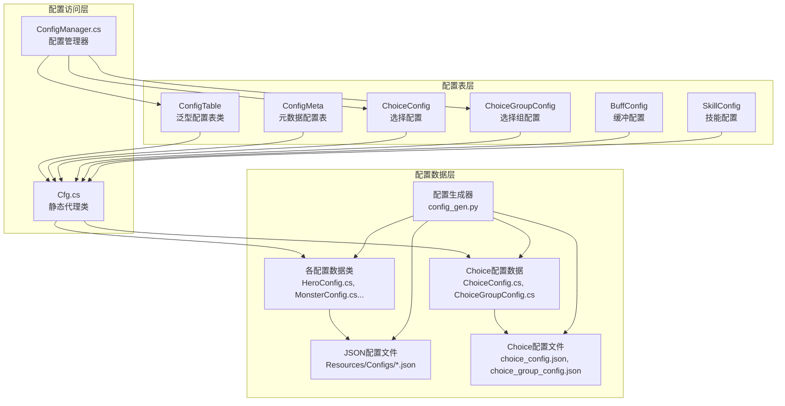
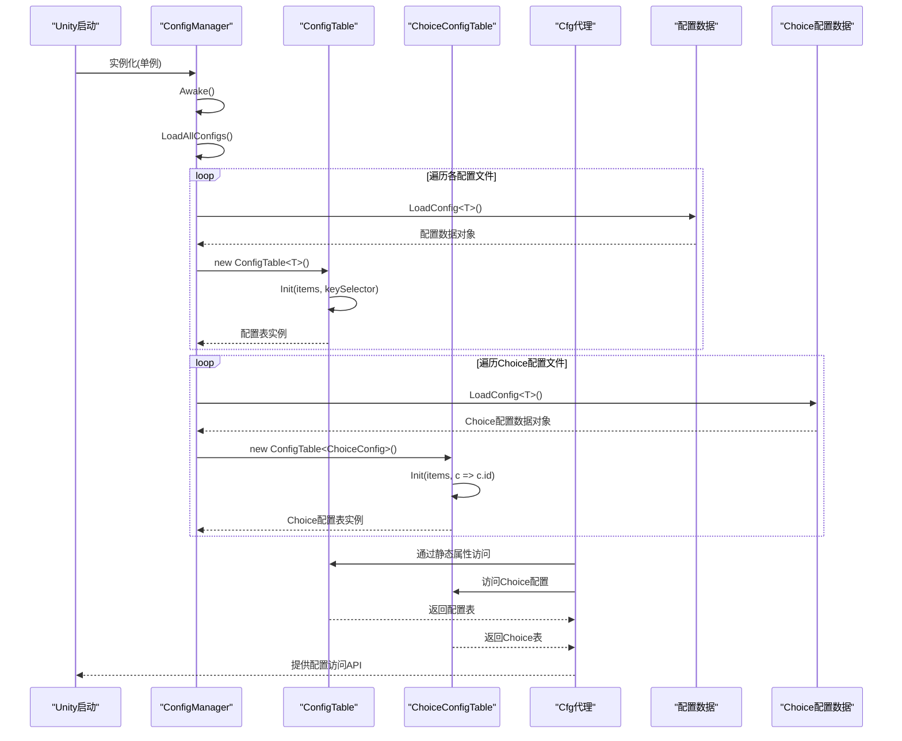
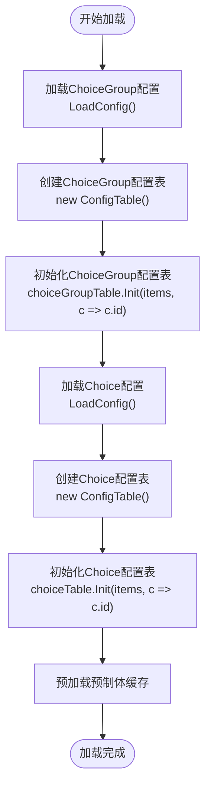
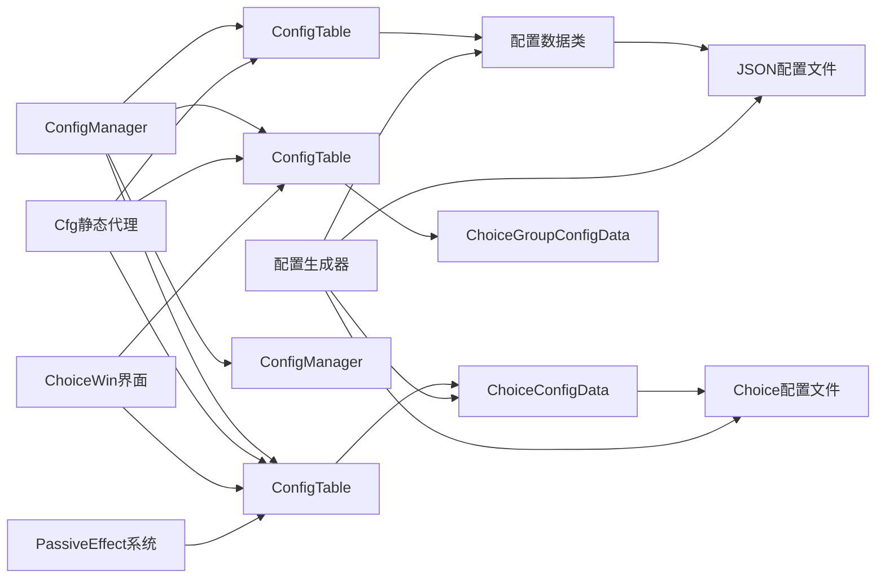

# 配置管理系统

<cite>
**本文档引用的文件**
- [ConfigManager.cs](file://Assets/Scripts/Core/ConfigManager.cs)
- [ConfigTable.cs](file://Assets/Scripts/Core/ConfigTable.cs)
- [Cfg.cs](file://Assets/Scripts/Core/Cfg.cs)
- [ChoiceConfig.cs](file://Assets/Scripts/Data/Configs/ChoiceConfig.cs)
- [ChoiceGroupConfig.cs](file://Assets/Scripts/Data/Configs/ChoiceGroupConfig.cs)
- [ChoiceWin.cs](file://Assets/Scripts/UI/ChoiceWin.cs)
- [choice_config.json](file://Assets/Resources/Configs/choice_config.json)
- [choice_group_config.json](file://Assets/Resources/Configs/choice_group_config.json)
- [config_gen.py](file://Tools/config_gen.py)
</cite>

## 更新摘要
**所做更改**
- 更新Choice配置系统文档以反映从复杂嵌套结构简化为直接引用choice ID的简化的choices数组结构
- 更新ConfigManager.cs字段重新排序和表初始化重组的相关内容
- 更新ChoiceConfig和ChoiceGroupConfig数据结构的字段名称变化（description→des）
- 更新Choice配置访问模式以反映新的choices数组结构
- 更新Choice系统在游戏中的应用以反映新的配置结构

## 目录
1. [简介](#简介)
2. [项目结构](#项目结构)
3. [核心组件](#核心组件)
4. [架构总览](#架构总览)
5. [详细组件分析](#详细组件分析)
6. [配置表系统](#配置表系统)
7. [Choice配置系统集成](#choice配置系统集成)
8. [Choice配置数据结构](#choice配置数据结构)
9. [Choice配置文件组织](#choice配置文件组织)
10. [Choice配置访问模式](#choice配置访问模式)
11. [Choice系统在游戏中的应用](#choice系统在游戏中的应用)
12. [配置生成器对Choice的支持](#配置生成器对choice的支持)
13. [依赖分析](#依赖分析)
14. [性能考虑](#性能考虑)
15. [故障排查指南](#故障排查指南)
16. [结论](#结论)
17. [附录：配置编写指南与最佳实践](#附录配置编写指南与最佳实践)

## 简介
本文档详细介绍GeometryTD全新重构的配置管理系统。系统已从传统的手动配置管理完全转变为自动化配置表系统，引入了ConfigManager.cs、ConfigTable.cs和Cfg.cs三大核心组件，大幅简化了配置访问模式并提升了系统的可维护性和扩展性。

**重大更新**：系统现已集成了Choice配置系统，为游戏中的选择分支、对话选项和剧情分支提供完整的配置支持。Choice系统采用简化的配置结构，通过choices数组直接引用独立的choice ID，使配置系统更加直观易用。

新架构的核心优势包括：
- 自动化配置表生成，消除手写索引构建代码
- 统一的配置访问语法，通过Cfg静态代理类提供简洁API
- 泛型配置表支持，自动处理ID索引和查询逻辑
- 支持meta元数据和items列表分离的配置结构
- 类型安全的配置访问，编译时检查配置ID和字段类型
- 完整的配置生成工具链，支持从Excel到JSON再到C#代码的自动化转换
- 增强的数组值解析功能，支持更灵活的结构化数据处理
- **新增Choice配置系统**，采用简化的choices数组结构，通过直接引用choice ID实现更直观的配置管理
- **Choice配置与游戏UI深度集成**，提供完整的交互体验

## 项目结构
新配置系统采用三层架构设计，现已扩展支持Choice配置系统：



**图表来源**
- [ConfigTable.cs:11-73](file://Assets/Scripts/Core/ConfigTable.cs#L11-L73)
- [Cfg.cs:7-35](file://Assets/Scripts/Core/Cfg.cs#L7-L35)
- [ConfigManager.cs:15-38](file://Assets/Scripts/Core/ConfigManager.cs#L15-L38)
- [ChoiceConfig.cs:10-26](file://Assets/Scripts/Data/Configs/ChoiceConfig.cs#L10-L26)
- [ChoiceGroupConfig.cs:10-34](file://Assets/Scripts/Data/Configs/ChoiceGroupConfig.cs#L10-L34)
- [config_gen.py:587-688](file://Tools/config_gen.py#L587-L688)

## 核心组件
新配置系统包含五个核心组件，其中Choice系统为新增功能：

### ConfigTable泛型类
提供通用的配置表功能，支持三种模式：
- **双参数模式**：ConfigTable<TItem, TMeta> - 支持items列表和meta元数据
- **单参数模式**：ConfigTable<TItem> - 仅支持items列表
- **元数据模式**：ConfigMeta<TMeta> - 仅支持元数据
- **自动索引**：根据keySelector函数自动构建ID索引字典
- **统一查询**：提供Get(id)方法进行快速配置查询

### ChoiceConfig新增组件
专门处理独立的选择配置项，采用简化的字段结构：
- **id**：选择项唯一标识符
- **text**：显示文本
- **des**：描述信息（字段名称从description简化为des）
- **goldReward**：金币奖励
- **effectId**：关联的效果ID
- **triggerBattle**：是否触发战斗

### ChoiceGroupConfig新增组件
处理选择组配置，采用简化的choices数组结构：
- **id**：选择组唯一标识符
- **title**：选择组标题
- **choices**：整数数组，直接引用ChoiceConfig的ID

### ChoiceConfig.OptionsItem嵌套类
**已移除**：Choice配置系统已简化为直接引用choice ID的结构，不再需要嵌套的OptionsItem类

### 传统配置组件
- **BuffConfig**：缓冲配置，简化了evtDmgRate结构
- **SkillConfig**：技能配置，大幅扩展了技能池支持
- **EventEffectConfig**：事件特效配置，支持独立的特效管理

**章节来源**
- [ConfigTable.cs:11-73](file://Assets/Scripts/Core/ConfigTable.cs#L11-L73)
- [ChoiceConfig.cs:10-26](file://Assets/Scripts/Data/Configs/ChoiceConfig.cs#L10-L26)
- [ChoiceGroupConfig.cs:10-34](file://Assets/Scripts/Data/Configs/ChoiceGroupConfig.cs#L10-L34)

## 架构总览
新架构采用"配置表 + 静态代理 + 自动化生成 + 独立特效管理 + Choice系统"的设计模式：



**图表来源**
- [ConfigManager.cs:56-177](file://Assets/Scripts/Core/ConfigManager.cs#L56-L177)
- [ConfigTable.cs:17-56](file://Assets/Scripts/Core/ConfigTable.cs#L17-L56)

## 详细组件分析

### ConfigManager重构分析
ConfigManager已完全重构，移除了手动索引构建代码，采用自动化配置表系统，并新增了Choice配置支持：

#### 主要变化
- **新增Choice配置支持**：添加了choiceTable和choiceGroupTable配置表
- **Choice配置初始化**：在LoadAllConfigs中添加了Choice配置的加载逻辑
- **移除手动索引**：不再需要BuildSkillLookup()、BuildHeroLookup()等手动索引构建方法
- **自动化初始化**：每个配置表通过Init()方法自动完成索引构建
- **统一加载模式**：所有配置文件采用相同的加载和初始化模式
- **保留预加载功能**：继续支持子弹、特效和角色预制体的预加载缓存
- **增强代码可读性**：用户代码区域添加大量空白行改善代码结构
- **字段重新排序**：Choice配置表字段在ConfigManager中进行了重新排序

#### Choice配置加载流程


**章节来源**
- [ConfigManager.cs:125-134](file://Assets/Scripts/Core/ConfigManager.cs#L125-L134)

### 配置文件组织与作用
新架构支持更清晰的配置文件组织，现已包含Choice配置文件：

#### Choice配置文件
**choice_config.json**：独立的选择项配置
- **结构**：包含独立的选择项列表
- **用途**：存储可复用的选择项，支持在不同场景中重复使用
- **访问**：通过`Cfg.Choice.Get(id)`访问

**choice_group_config.json**：选择组配置
- **结构**：包含选择组列表，每个组通过choices数组引用独立的选择项
- **用途**：存储完整的对话或选择场景
- **访问**：通过`Cfg.ChoiceGroup.Get(id)`访问

#### 传统配置文件
- **带元数据配置**：hero_config.json, monster_config.json, skill_config.json
- **纯列表配置**：bullet_style_config.json, buff_config.json等
- **特效配置**：event_effect_config.json

**章节来源**
- [choice_config.json:1-220](file://Assets/Resources/Configs/choice_config.json#L1-L220)
- [choice_group_config.json:1-109](file://Assets/Resources/Configs/choice_group_config.json#L1-L109)

## 配置表系统
ConfigTable泛型类是新架构的核心，提供统一的配置访问模式：

### 双参数配置表(ConfigTable<TItem, TMeta>)
适用于需要元数据的配置：
- **TItem**：配置项类型
- **TMeta**：元数据类型
- **示例**：HeroConfig、MonsterConfig、SkillConfig等

### 单参数配置表(ConfigTable<TItem>)
适用于纯列表配置：
- **TItem**：配置项类型
- **示例**：BuffConfig、BulletEventConfig、RoleConfig、**ChoiceConfig**、**ChoiceGroupConfig**等

### 元数据配置表(ConfigMeta<TMeta>)
专门处理不需要ID索引的配置：
- **示例**：GlobalMeta、HeroMeta、MonsterMeta等

### 自动索引机制
ConfigTable内部自动维护ID到配置项的映射：
- **索引构建**：通过keySelector函数自动构建字典索引
- **查询优化**：提供O(1)时间复杂度的配置查询
- **类型安全**：编译时检查ID类型和配置项类型匹配

**章节来源**
- [ConfigTable.cs:11-73](file://Assets/Scripts/Core/ConfigTable.cs#L11-L73)

## Choice配置系统集成

### ChoiceConfig数据结构
ChoiceConfig类专门处理独立的选择项配置，采用简化的字段结构：

```csharp
public class ChoiceConfig
{
    public int id;              // 选择项唯一标识符
    public string text;         // 显示文本
    public string des;          // 描述信息（字段名称从description简化为des）
    public int goldReward;      // 金币奖励
    public int effectId;        // 关联的效果ID
    public bool triggerBattle;  // 是否触发战斗
}
```

### ChoiceGroupConfig数据结构
ChoiceGroupConfig类处理选择组配置，采用简化的choices数组结构：

```csharp
public class ChoiceGroupConfig
{
    public int id;              // 选择组唯一标识符
    public string title;        // 选择组标题
    public int[] choices;       // 整数数组，直接引用ChoiceConfig的ID
}
```

### 配置表初始化
Choice配置表使用标准的初始化模式：

```csharp
// Choice配置表初始化
var choiceData = LoadConfig<ChoiceConfigData>("Configs/choice_config");
choiceTable = new ConfigTable<ChoiceConfig>();
choiceTable.Init(data.items, c => c.id);

// ChoiceGroup配置表初始化
var choiceGroupData = LoadConfig<ChoiceGroupConfigData>("Configs/choice_group_config");
choiceGroupTable = new ConfigTable<ChoiceGroupConfig>();
choiceGroupTable.Init(data.items, c => c.id);
```

### Choice配置访问模式
通过Cfg静态代理类提供统一的访问接口：

```csharp
// 获取特定的选择项
ChoiceConfig choice = Cfg.Choice.Get(101);

// 获取特定的选择组
ChoiceGroupConfig choiceGroup = Cfg.ChoiceGroup.Get(1);

// 获取所有选择项
var allChoices = Cfg.Choice.All;

// 获取所有选择组
var allChoiceGroups = Cfg.ChoiceGroup.All;
```

**章节来源**
- [ChoiceConfig.cs:10-26](file://Assets/Scripts/Data/Configs/ChoiceConfig.cs#L10-L26)
- [ChoiceGroupConfig.cs:10-34](file://Assets/Scripts/Data/Configs/ChoiceGroupConfig.cs#L10-L34)
- [ConfigManager.cs:125-134](file://Assets/Scripts/Core/ConfigManager.cs#L125-L134)

## Choice配置数据结构

### ChoiceConfig详细字段说明

#### 基本字段
- **id**：整数类型，选择项的唯一标识符
- **text**：字符串类型，界面显示的文本内容
- **des**：字符串类型，详细描述信息（字段名称从description简化为des）

#### 奖励相关字段
- **goldReward**：整数类型，选择后的金币奖励数量
- **effectId**：整数类型，关联的被动效果ID
- **triggerBattle**：布尔类型，选择后是否触发战斗

### ChoiceGroupConfig详细字段说明

#### 基本字段
- **id**：整数类型，选择组的唯一标识符
- **title**：字符串类型，场景标题，用于界面展示

#### 选项引用
- **choices**：整数数组类型，直接引用ChoiceConfig的ID
- **长度**：可变长度，支持二选一到多选一的场景

### Choice配置示例分析
基于提供的配置文件，可以看到Choice系统支持多种场景：

#### 场景1：二选一选择
```json
{
  "id": 1,
  "title": "虚空领主留下了两条道路",
  "choices": [101, 102, 103]
}
```

#### 场景2：三选一选择
```json
{
  "id": 3,
  "title": "虚空暴君留下了力量的残渣",
  "choices": [301, 302]
}
```

#### 场景3：带奖励的选择
```json
{
  "id": 2,
  "title": "深渊守卫倒下了",
  "choices": [201, 202]
}
```

### Choice配置访问流程
```csharp
// 1. 获取选择组配置
ChoiceGroupConfig group = Cfg.ChoiceGroup.Get(1);

// 2. 遍历choices数组获取具体的选择项
for (int i = 0; i < group.choices.Length; i++)
{
    int choiceId = group.choices[i];
    ChoiceConfig choice = Cfg.Choice.Get(choiceId);
    
    // 3. 使用选择项信息构建UI
    Debug.Log($"选项 {i+1}: {choice.text}");
}
```

**章节来源**
- [choice_config.json:1-220](file://Assets/Resources/Configs/choice_config.json#L1-L220)
- [choice_group_config.json:1-109](file://Assets/Resources/Configs/choice_group_config.json#L1-L109)

## Choice配置文件组织

### choice_config.json文件结构
独立的选择项配置文件，包含可复用的选择项：

#### 文件特点
- **纯列表结构**：只包含items数组，无meta元数据
- **独立性**：每个选择项都是独立的实体
- **复用性**：可以在不同的选择组中重复使用
- **标准化**：统一的字段结构便于管理和维护

#### 字段定义
- **id**：选择项唯一标识符，用于在选择组中引用
- **text**：显示文本，用于界面展示
- **des**：描述信息，提供详细说明（字段名称从description简化为des）
- **goldReward**：奖励数值，提供金币奖励
- **effectId**：效果ID，关联到被动效果系统
- **triggerBattle**：布尔值，决定是否触发战斗

### choice_group_config.json文件结构
选择组配置文件，包含完整的对话或选择场景：

#### 文件特点
- **结构化组织**：按场景或对话分组
- **简化设计**：通过choices数组直接引用选择项
- **完整性**：包含场景的所有相关信息
- **可扩展性**：支持动态添加新的场景

#### 字段定义
- **id**：选择组唯一标识符
- **title**：场景标题，用于界面展示
- **choices**：整数数组，直接引用ChoiceConfig的ID

#### 选项引用
- **choices**：整数数组，包含多个ChoiceConfig的ID
- **长度**：可变长度，支持不同数量的选项

**章节来源**
- [choice_config.json:1-220](file://Assets/Resources/Configs/choice_config.json#L1-L220)
- [choice_group_config.json:1-109](file://Assets/Resources/Configs/choice_group_config.json#L1-L109)

## Choice配置访问模式

### 标准配置访问接口
通过Cfg静态代理类提供统一的访问接口：

```csharp
// 获取Choice配置表
public static ConfigTable<ChoiceConfig> Choice { get { return M.choiceTable; } }

// 获取ChoiceGroup配置表  
public static ConfigTable<ChoiceGroupConfig> ChoiceGroup { get { return M.choiceGroupTable; } }
```

### 配置查询示例
```csharp
// 获取特定的选择项
ChoiceConfig choice = Cfg.Choice.Get(101);

// 检查配置是否存在
if (choice != null)
{
    Debug.Log($"选择项: {choice.text}");
    Debug.Log($"效果ID: {choice.effectId}");
}

// 获取特定的选择组
ChoiceGroupConfig group = Cfg.ChoiceGroup.Get(1);

// 遍历所有选择组
foreach (var group in Cfg.ChoiceGroup.All)
{
    Debug.Log($"场景: {group.title}");
    foreach (int choiceId in group.choices)
    {
        ChoiceConfig choice = Cfg.Choice.Get(choiceId);
        Debug.Log($"  选项: {choice.text}");
    }
}
```

### 配置验证和错误处理
```csharp
// 安全的配置访问
public ChoiceConfig SafeGetChoice(int id)
{
    var choice = Cfg.Choice.Get(id);
    if (choice == null)
    {
        Debug.LogWarning($"未找到ID为{id}的选择项");
        return null;
    }
    return choice;
}

// 配置完整性检查
public bool ValidateChoiceConfig()
{
    foreach (var group in Cfg.ChoiceGroup.All)
    {
        foreach (int choiceId in group.choices)
        {
            if (Cfg.Choice.Get(choiceId) == null)
            {
                Debug.LogError($"选择组{group.id}中的选项{choiceId}不存在");
                return false;
            }
        }
    }
    return true;
}
```

**章节来源**
- [Cfg.cs:25-26](file://Assets/Scripts/Core/Cfg.cs#L25-L26)
- [ConfigManager.cs:125-134](file://Assets/Scripts/Core/ConfigManager.cs#L125-L134)

## Choice系统在游戏中的应用

### ChoiceWin界面系统
ChoiceWin类负责显示和处理玩家的选择：

#### 界面显示逻辑
```csharp
public void ShowChoices(ChoiceGroupConfig config, Action<int, ChoiceConfig> onSelected)
{
    if (config == null || config.choices == null || config.choices.Length == 0)
    {
        onSelected?.Invoke(0, null);
        return;
    }

    currentConfig = config;
    this.onSelected = onSelected;

    // 暂停游戏时间
    savedTimeScale = Time.timeScale;
    Time.timeScale = 0f;
    hasPausedTime = true;

    RefreshOptions();
}
```

#### 动态UI构建
```csharp
private void RefreshOptions()
{
    ClearOptionItems();

    if (titleText != null)
        titleText.text = currentConfig.title ?? "";

    Font font = GameHelper.LoadFont();

    for (int i = 0; i < currentConfig.choices.Length; i++)
    {
        int choiceId = currentConfig.choices[i];
        ChoiceConfig choice = Cfg.Choice.Get(choiceId);
        if (choice == null)
        {
            Debug.LogWarning($"[ChoiceWin] Choice config not found: id={choiceId}");
            continue;
        }
        
        int optionIndex = i + 1; // 1-based
        GameObject item = CreateOptionItem(choice, optionIndex, font);
        optionItems.Add(item);
    }
}
```

#### 奖励提示构建
```csharp
private string BuildRewardHint(ChoiceConfig choice)
{
    List<string> hints = new List<string>();

    if (choice.effectId > 0)
    {
        PassiveEffectConfig effect = Cfg.PassiveEffect.Get(choice.effectId);
        if (effect != null)
            hints.Add(effect.name);
    }
    if (choice.goldReward > 0)
        hints.Add($"+{choice.goldReward} 金币");

    if (choice.triggerBattle)
        hints.Add("触发战斗");

    return hints.Count > 0 ? string.Join("  ", hints) : null;
}
```

### 游戏流程集成
Choice系统与游戏主流程的集成点：

#### 对话系统集成
- **NPC对话**：通过ChoiceGroupConfig定义NPC的对话选项
- **剧情分支**：根据玩家选择影响后续剧情发展
- **道德系统**：不同的选择影响角色的属性和故事走向

#### 战斗前选择
- **装备选择**：战斗前的装备或技能选择
- **战术决策**：影响战斗策略和难度
- **资源分配**：影响战斗后的奖励和资源

#### 商店和事件
- **商店购买**：通过选择决定购买的物品
- **随机事件**：根据选择影响事件的结果
- **探索发现**：影响探索过程中的发现和奖励

**章节来源**
- [ChoiceWin.cs:48-222](file://Assets/Scripts/UI/ChoiceWin.cs#L48-L222)

## 配置生成器对Choice的支持

### 自动化生成流程
配置生成器已完全支持Choice配置的自动生成：

#### Choice配置文件检测
配置生成器会自动识别Choice相关的Excel文件：
- **choice_config.xlsx**：独立选择项配置
- **choice_group_config.xlsx**：选择组配置

#### 数据结构生成
配置生成器自动生成对应的C#数据结构：

```python
# 自动生成ChoiceConfig类
lines.append("    [Serializable]")
lines.append("    public class ChoiceConfig")
lines.append("    {")
lines.append("        public int id;")
lines.append("        public string text;")
lines.append("        public string des;")
lines.append("        public int goldReward;")
lines.append("        public int effectId;")
lines.append("        public bool triggerBattle;")
lines.append("    }")

# 自动生成ChoiceGroupConfig类
lines.append("    [Serializable]")
lines.append("    public class ChoiceGroupConfig")
lines.append("    {")
lines.append("        public int id;")
lines.append("        public string title;")
lines.append("        public int[] choices;")
lines.append("    }")
```

#### 配置表初始化代码生成
配置生成器自动生成ConfigManager中的配置加载代码：

```python
# 自动生成Choice配置加载代码
lines.append("            {")
lines.append('                var data = LoadConfig<ChoiceConfigData>("Configs/choice_config");')
lines.append("                choiceTable = new ConfigTable<ChoiceConfig>();")
lines.append("                choiceTable.Init(data.items, c => c.id);")
lines.append("            }")
lines.append("            {")
lines.append('                var data = LoadConfig<ChoiceGroupConfigData>("Configs/choice_group_config");')
lines.append("                choiceGroupTable = new ConfigTable<ChoiceGroupConfig>();")
lines.append("                choiceGroupTable.Init(data.items, c => c.id);")
lines.append("            }")
```

#### Cfg.cs静态代理生成
配置生成器自动生成Cfg.cs中的静态代理属性：

```python
# 自动生成Choice配置访问属性
lines.append("        public static ConfigTable<ChoiceConfig> Choice { get { return M.choiceTable; } }")
lines.append("        public static ConfigTable<ChoiceGroupConfig> ChoiceGroup { get { return M.choiceGroupTable; } }")
```

### 数据类型支持
配置生成器支持Choice配置中的各种数据类型：
- **基本类型**：int、string、bool
- **数组类型**：支持整数数组字段（choices数组）
- **简化结构**：支持简化的配置结构，不再需要嵌套类

### 错误处理和验证
配置生成器包含完善的错误处理机制：
- **字段验证**：检查必填字段的完整性
- **类型匹配**：确保Excel数据类型与C#类型匹配
- **默认值处理**：为缺失的字段提供合理的默认值
- **ID引用验证**：验证choices数组中的ID引用有效性

**章节来源**
- [config_gen.py:424-450](file://Tools/config_gen.py#L424-L450)
- [config_gen.py:470-570](file://Tools/config_gen.py#L470-L570)
- [config_gen.py:600-675](file://Tools/config_gen.py#L600-L675)

## 依赖分析
新架构的依赖关系更加清晰，现已包含Choice系统的依赖：



**图表来源**
- [ConfigManager.cs:15-38](file://Assets/Scripts/Core/ConfigManager.cs#L15-L38)
- [Cfg.cs:7-35](file://Assets/Scripts/Core/Cfg.cs#L7-L35)
- [ChoiceWin.cs:48-222](file://Assets/Scripts/UI/ChoiceWin.cs#L48-L222)
- [config_gen.py:587-688](file://Tools/config_gen.py#L587-L688)

## 性能考虑
新架构在性能方面有显著改进，Choice系统也包含相应的优化：

### Choice配置性能优化
- **自动索引**：ConfigTable内部维护字典索引，内存开销最小化
- **延迟初始化**：配置表在首次访问时才进行索引构建
- **类型安全**：编译时检查减少运行时错误
- **缓存机制**：Choice配置在内存中缓存，避免重复加载
- **数组访问优化**：choices数组提供O(1)的选项访问性能

### 查询性能
- **O(1)查询**：字典索引提供常数时间复杂度的配置查询
- **批量操作**：All属性提供完整的配置列表访问
- **选择组优化**：ChoiceGroupConfig.choices数组支持快速遍历
- **简化访问**：直接通过ID访问选择项，避免嵌套查找

### 加载优化
- **统一加载**：所有配置文件采用相同的高效加载模式
- **预加载缓存**：继续支持预制体的预加载缓存机制
- **错误处理**：完善的错误日志和异常处理机制

### Choice系统特定优化
- **UI缓存**：ChoiceWin界面中的选项按钮和文本缓存
- **时间暂停**：选择界面显示时暂停游戏时间，避免性能浪费
- **资源管理**：选择项相关的资源按需加载和释放
- **简化结构**：choices数组结构减少了内存占用和访问开销

**章节来源**
- [ConfigTable.cs:26-56](file://Assets/Scripts/Core/ConfigTable.cs#L26-L56)
- [ConfigManager.cs:169-177](file://Assets/Scripts/Core/ConfigManager.cs#L169-L177)
- [ChoiceWin.cs:63-67](file://Assets/Scripts/UI/ChoiceWin.cs#L63-L67)

## 故障排查指南
新架构的故障排查更加直观，现已包含Choice系统的故障排查：

### Choice配置加载问题
- **检查JSON格式**：确认choice_config.json和choice_group_config.json语法正确
- **验证配置类**：确保ChoiceConfig和ChoiceGroupConfig与JSON结构匹配
- **查看生成代码**：检查自动生成的配置代码是否正确
- **验证ID唯一性**：确保ChoiceConfig和ChoiceGroupConfig中的ID不重复
- **检查choices数组**：确认ChoiceGroupConfig中的choices数组引用有效

### Choice配置访问问题
- **验证ID存在性**：确认配置ID在JSON文件中存在
- **检查类型匹配**：确保访问的配置类型正确
- **查看索引构建**：确认ConfigTable的Init方法正确执行
- **检查effectId关联**：验证effectId是否正确关联到PassiveEffect配置
- **验证choices引用**：确认ChoiceGroupConfig中的ID在ChoiceConfig中存在

### Choice界面显示问题
- **检查UI组件**：确认ChoiceWin中的UI组件正确设置
- **验证字体加载**：确保字体资源正确加载
- **检查事件绑定**：确认按钮点击事件正确绑定
- **验证奖励提示**：检查BuildRewardHint方法的逻辑
- **调试choices数组**：确认choices数组的长度和内容正确

### Choice系统集成问题
- **检查PassiveEffect关联**：确认effectId正确关联到被动效果系统
- **验证战斗触发**：检查triggerBattle标志的处理逻辑
- **检查金币奖励**：验证goldReward的处理和应用
- **测试场景切换**：确保选择后能正确切换到目标场景
- **验证配置完整性**：确保所有ChoiceGroupConfig都有对应的ChoiceConfig

### 配置生成器问题
- **检查Excel文件**：确认Choice相关的Excel文件格式正确
- **验证字段定义**：确保Excel中的字段定义与生成器期望匹配
- **查看生成日志**：检查配置生成器的输出日志
- **验证文件路径**：确认生成的C#文件保存到正确的位置
- **检查choices数组生成**：确认choices数组的生成逻辑正确

**章节来源**
- [ConfigManager.cs:179-194](file://Assets/Scripts/Core/ConfigManager.cs#L179-L194)
- [ConfigTable.cs:17-56](file://Assets/Scripts/Core/ConfigTable.cs#L17-L56)
- [ChoiceWin.cs:169-187](file://Assets/Scripts/UI/ChoiceWin.cs#L169-L187)

## 结论
GeometryTD的配置管理系统已完成完全重构，新架构通过ConfigTable泛型类、Cfg静态代理、自动化配置生成机制和新增的Choice配置系统，实现了更加高效、类型安全和易于维护的配置管理方案。

**重大更新**：Choice配置系统的成功集成为游戏增加了强大的选择分支和对话系统支持。Choice系统采用简化的配置结构，通过choices数组直接引用独立的choice ID，使配置系统更加直观易用。

Choice系统的重大优势：
- **简化结构**：从复杂的嵌套结构简化为直接引用choice ID的简化的choices数组结构
- **直观易用**：通过直接ID引用实现更清晰的配置关系
- **类型安全**：完整的C#类型系统保证配置访问的安全性
- **性能优化**：自动索引和缓存机制提供高效的配置查询
- **扩展性强**：支持新的Choice配置类型和结构变更
- **维护成本低**：统一的配置表模式简化了代码维护
- **开发效率高**：完整的工具链支持从Excel到运行时的自动化转换

新系统的主要优势：
- **自动化程度高**：自动生成配置访问代码，减少手写样板代码
- **类型安全**：编译时检查配置ID和类型匹配
- **性能优异**：字典索引提供O(1)查询性能
- **扩展性强**：支持新的配置类型和结构变更
- **维护成本低**：统一的配置表模式简化了代码维护
- **开发效率高**：完整的工具链支持从Excel到运行时的自动化转换
- **解析能力增强**：支持更灵活的结构化数组数据处理
- **特效管理独立**：新增的EventEffect系统提供专业的事件特效管理
- **Choice系统简化**：全新的简化的Choice配置系统提供更直观的交互体验

**重大变更影响**：
- **向后兼容性**：Choice配置文件的新增不影响现有配置的使用
- **字段名称变更**：description字段简化为des，需要更新相关代码
- **结构简化**：移除了嵌套的OptionsItem类，简化了配置结构
- **访问模式优化**：通过直接ID引用提高了配置访问效率
- **配置生成器升级**：配置生成器已完全支持简化的Choice配置结构

未来可以在此基础上进一步优化Choice配置的热更新、增量加载等功能，为游戏的持续迭代提供更好的支持。

## 附录：配置编写指南与最佳实践

### Choice配置文件编写规范
- **文件命名**：使用choice_config.xlsx和choice_group_config.xlsx
- **结构统一**：遵循items + meta的结构模式
- **ID规范**：使用有意义的ID，避免冲突，建议使用分组编号
- **字段命名**：使用驼峰命名法，如`triggerBattle`，注意des字段替代description
- **choices数组**：在ChoiceGroupConfig中使用整数数组直接引用ChoiceConfig的ID

### Choice配置数据类定义
- **自动生成**：通过config_gen.py自动生成ChoiceConfig和ChoiceGroupConfig类
- **类型安全**：确保字段类型与JSON数据匹配
- **简化结构**：不再需要嵌套的OptionsItem类
- **字段名称**：注意des字段替代description

### Choice配置访问最佳实践
- **使用Cfg代理**：通过`Cfg.Choice.Get(id)`和`Cfg.ChoiceGroup.Get(id)`访问配置
- **检查空值**：访问配置后检查返回值是否为空
- **批量操作**：使用`Cfg.Choice.All`和`Cfg.ChoiceGroup.All`进行批量配置访问
- **effectId关联**：通过effectId关联到PassiveEffect系统
- **choices数组遍历**：使用for循环遍历ChoiceGroupConfig.choices数组

### Choice系统最佳实践
- **场景设计**：合理设计选择场景，避免过多的选择导致混乱
- **奖励平衡**：平衡不同选择的奖励，避免出现明显的优势选择
- **描述清晰**：提供清晰的选择描述，帮助玩家做出明智的决定
- **触发条件**：合理使用triggerBattle标志，避免过度触发战斗
- **ID管理**：使用有意义的ID编号，便于维护和调试

### Choice配置迁移指南
**从旧系统迁移到Choice系统**：
- **分析现有选择逻辑**：识别现有的对话和选择系统
- **设计ChoiceConfig**：将独立的选择项提取为ChoiceConfig
- **创建ChoiceGroupConfig**：将相关的选项组合为ChoiceGroupConfig，使用choices数组引用
- **更新UI系统**：将ChoiceWin集成到现有的UI系统中
- **测试配置效果**：验证迁移后的配置在游戏中正常工作
- **字段更新**：注意将description字段更新为des

### Choice配置文件组织最佳实践
**choice_config.json组织**：
- **按功能分组**：将相似的功能选择归类到一起
- **ID编号规范**：使用有意义的ID编号，如101、102等
- **复用设计**：设计可复用的选择项，避免重复配置

**choice_group_config.json组织**：
- **场景划分**：按游戏场景或剧情节点划分
- **标题设计**：设计吸引人的场景标题
- **选项平衡**：确保每个场景的选项数量适中
- **choices数组**：使用整数数组直接引用ChoiceConfig的ID

### Choice系统性能优化建议
- **合理使用索引**：ConfigTable自动维护索引，无需手动优化
- **避免频繁查询**：缓存常用的Choice配置结果
- **批量加载**：利用ConfigManager的一次性加载机制
- **UI缓存**：合理使用ChoiceWin界面的缓存机制
- **资源管理**：合理管理Choice相关的UI资源
- **简化访问**：利用直接ID引用提高访问性能

### 扩展新配置类型的步骤
1. **创建Excel文件**：定义新的配置数据结构
2. **运行生成器**：执行python Tools/config_gen.py生成配置
3. **更新ConfigManager**：在LoadAllConfigs中添加新配置
4. **使用配置**：通过Cfg代理类访问新配置
5. **集成到游戏**：将新配置集成到游戏逻辑中

### Choice配置调试技巧
- **启用日志**：在ConfigManager中添加详细的配置加载日志
- **验证ID**：使用Debug.Log验证配置ID的正确性
- **检查关联**：验证effectId等关联字段的正确性
- **测试UI**：单独测试ChoiceWin界面的显示和交互
- **性能监控**：监控Choice配置的加载和查询性能
- **choices数组调试**：验证ChoiceGroupConfig.choices数组的有效性

**章节来源**
- [ChoiceConfig.cs:1-27](file://Assets/Scripts/Data/Configs/ChoiceConfig.cs#L1-L27)
- [ChoiceGroupConfig.cs:1-24](file://Assets/Scripts/Data/Configs/ChoiceGroupConfig.cs#L1-L24)
- [ChoiceWin.cs:1-306](file://Assets/Scripts/UI/ChoiceWin.cs#L1-L306)
- [config_gen.py:587-688](file://Tools/config_gen.py#L587-L688)