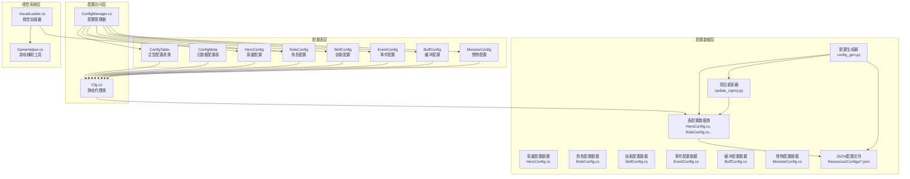
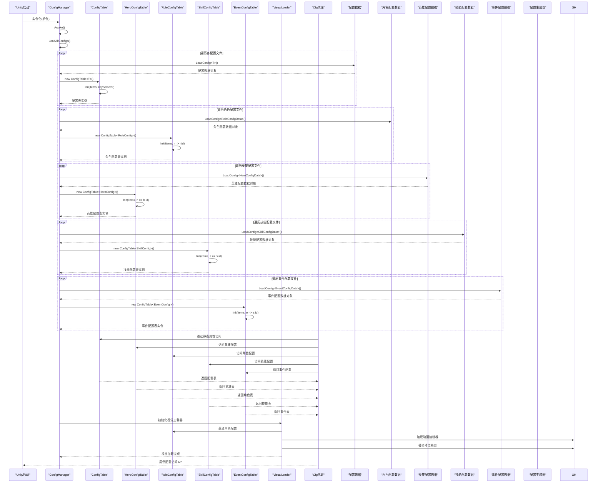
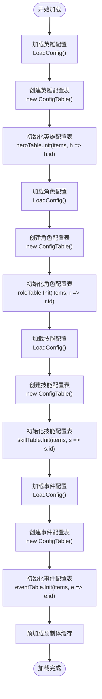
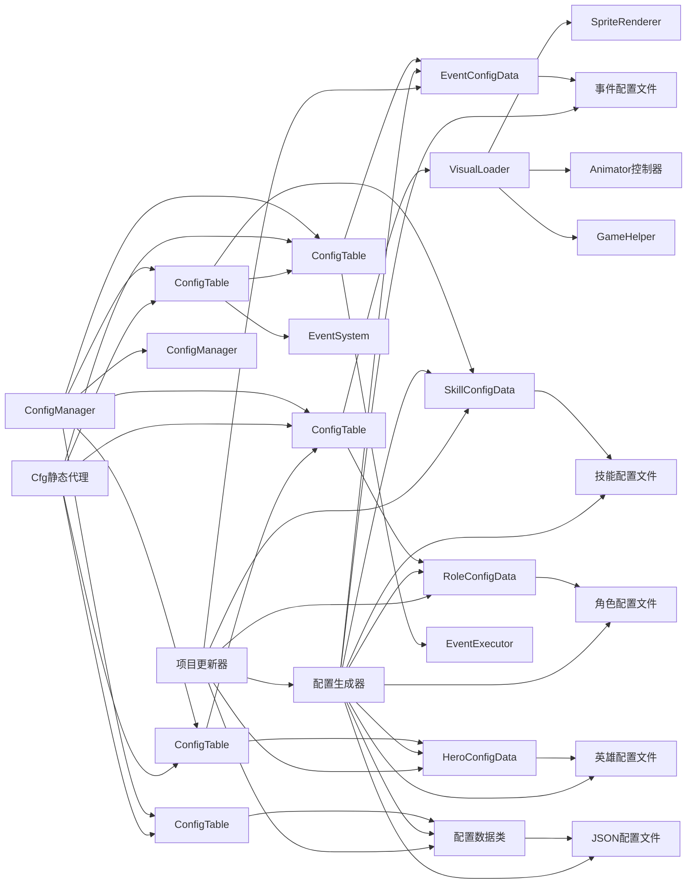

# 配置管理系统

<cite>
**本文档引用的文件**
- [ConfigManager.cs](file://Assets/Scripts/Core/ConfigManager.cs)
- [ConfigTable.cs](file://Assets/Scripts/Core/ConfigTable.cs)
- [Cfg.cs](file://Assets/Scripts/Core/Cfg.cs)
- [HeroConfig.cs](file://Assets/Scripts/Data/Configs/HeroConfig.cs)
- [RoleConfig.cs](file://Assets/Scripts/Data/Configs/RoleConfig.cs)
- [SkillConfig.cs](file://Assets/Scripts/Data/Configs/SkillConfig.cs)
- [VisualLoader.cs](file://Assets/Scripts/Battle/VisualLoader.cs)
- [GameHelper.cs](file://Assets/Scripts/Core/GameHelper.cs)
- [event_config.json](file://Assets/Resources/Configs/event_config.json)
- [skill_config.json](file://Assets/Resources/Configs/skill_config.json)
- [role_config.json](file://Assets/Resources/Configs/role_config.json)
- [hero_config.json](file://Assets/Resources/Configs/hero_config.json)
- [monster_config.json](file://Assets/Resources/Configs/monster_config.json)
- [buff_config.json](file://Assets/Resources/Configs/buff_config.json)
- [HeroController.cs](file://Assets/Scripts/Battle/HeroController.cs)
- [EventExecutor.cs](file://Assets/Scripts/Battle/EventExecutor.cs)
- [BuffSystem.cs](file://Assets/Scripts/Battle/BuffSystem.cs)
- [config_gen.py](file://Tools/config_gen.py)
- [update_csproj.py](file://Tools/update_csproj.py)
</cite>

## 更新摘要
**所做更改**
- 新增配置生成工具章节，详细介绍config_gen.py的功能和使用方法
- 更新配置生成器支持章节，增加工具链的完整说明
- 新增配置生成器自动化流程的详细分析
- 增强配置系统集成章节，包含生成器的集成方式
- 更新故障排查指南，增加配置生成器相关的故障排查
- 新增配置生成器最佳实践和使用建议

## 目录
1. [简介](#简介)
2. [项目结构](#项目结构)
3. [核心组件](#核心组件)
4. [架构总览](#架构总览)
5. [详细组件分析](#详细组件分析)
6. [配置表系统](#配置表系统)
7. [角色配置系统](#角色配置系统)
8. [技能配置系统](#技能配置系统)
9. [事件配置系统](#事件配置系统)
10. [视觉加载系统](#视觉加载系统)
11. [配置文件格式与解析](#配置文件格式与解析)
12. [配置系统集成与应用](#配置系统集成与应用)
13. [配置生成器支持](#配置生成器支持)
14. [配置生成工具详解](#配置生成工具详解)
15. [依赖分析](#依赖分析)
16. [性能考虑](#性能考虑)
17. [故障排查指南](#故障排查指南)
18. [结论](#结论)
19. [附录：配置编写指南与最佳实践](#附录配置编写指南与最佳实践)

## 简介
本文档详细介绍GeometryTD全新重构的配置管理系统。系统已从传统的手动配置管理完全转变为自动化配置表系统，引入了ConfigManager.cs、ConfigTable.cs和Cfg.cs三大核心组件，大幅简化了配置访问模式并提升了系统的可维护性和扩展性。

**重大更新**：配置系统已完成全面升级，新增角色配置系统的完整功能，包括动画控制器路径、精灵槽位映射、头像引用等特性。系统现已支持角色外观定制、动态视觉加载和完整的动画控制器集成，为游戏的视觉表现提供了强大的配置支持。

**配置生成器的引入**：全新的config_gen.py配置生成工具彻底改变了配置开发流程，支持从Excel到JSON再到C#代码的自动化转换，实现了真正的配置驱动开发。该工具不仅支持基础的配置类型，还特别针对角色配置、技能配置和事件配置进行了优化，确保生成的代码与现有架构完美集成。

新架构的核心优势包括：
- 自动化配置表生成，消除手写索引构建代码
- 统一的配置访问语法，通过Cfg静态代理类提供简洁API
- 泛型配置表支持，自动处理ID索引和查询逻辑
- 支持meta元数据和items列表分离的配置结构
- 类型安全的配置访问，编译时检查配置ID和字段类型
- **完整的配置生成工具链**，支持从Excel到JSON再到C#代码的自动化转换
- 增强的数组值解析功能，支持更灵活的结构化数据处理
- **角色配置系统**，支持动画控制器、精灵槽位映射和头像引用
- **视觉加载系统**，实现动态槽位精灵替换和动画控制器加载
- **预制体预加载缓存**，提升角色资源加载性能
- **完整的角色外观定制**，支持多类型角色的外观配置

## 项目结构
新配置系统采用三层架构设计，现已扩展支持角色配置系统、技能配置系统和事件配置系统的完整集成：



**图表来源**
- [ConfigTable.cs:11-73](file://Assets/Scripts/Core/ConfigTable.cs#L11-L73)
- [Cfg.cs:7-35](file://Assets/Scripts/Core/Cfg.cs#L7-L35)
- [ConfigManager.cs:15-38](file://Assets/Scripts/Core/ConfigManager.cs#L15-L38)
- [HeroConfig.cs:10-23](file://Assets/Scripts/Data/Configs/HeroConfig.cs#L10-L23)
- [RoleConfig.cs:10-26](file://Assets/Scripts/Data/Configs/RoleConfig.cs#L10-L26)
- [SkillConfig.cs:10-26](file://Assets/Scripts/Data/Configs/SkillConfig.cs#L10-L26)
- [VisualLoader.cs:10-206](file://Assets/Scripts/Battle/VisualLoader.cs#L10-L206)
- [GameHelper.cs:9-81](file://Assets/Scripts/Core/GameHelper.cs#L9-L81)
- [config_gen.py:587-688](file://Tools/config_gen.py#L587-L688)
- [update_csproj.py:58-154](file://Tools/update_csproj.py#L58-154)

## 核心组件
新配置系统包含九个核心组件，其中角色配置系统和视觉加载系统为新增功能：

### ConfigTable泛型类
提供通用的配置表功能，支持三种模式：
- **双参数模式**：ConfigTable<TItem, TMeta> - 支持items列表和meta元数据
- **单参数模式**：ConfigTable<TItem> - 仅支持items列表
- **元数据模式**：ConfigMeta<TMeta> - 仅支持元数据
- **自动索引**：根据keySelector函数自动构建ID索引字典
- **统一查询**：提供Get(id)方法进行快速配置查询

### HeroConfig新增组件
处理英雄配置，包含完整的角色属性和技能信息：
- **id**：英雄唯一标识符
- **name**：英雄名称
- **description**：英雄描述
- **role**：角色类型ID
- **attack_skill_ids**：攻击技能ID数组
- **skill_xp_interval**：技能经验值间隔
- **skill_xp_min**：技能经验值最小值
- **skill_xp_max**：技能经验值最大值
- **attrs**：属性配置数组
- **charge_buff_ids**：充能缓冲ID数组

### RoleConfig新增组件
处理角色配置，新增丰富的视觉配置选项：
- **id**：角色唯一标识符
- **name**：角色名称
- **prefabPath**：预制体路径
- **animatorPath**：动画控制器路径
- **sprite_set**：精灵槽位映射数组
- **head**：头像路径

### RoleConfig.Sprite_setItem嵌套结构
处理精灵槽位映射，支持多类型角色的外观定制：
- **slotType**：槽位类型标识符
- **spritePath**：精灵资源路径

### SkillConfig新增组件
处理技能配置，支持事件引用和敌人事件：
- **id**：技能唯一标识符
- **poolId**：技能池ID
- **level**：技能等级
- **name**：技能名称
- **des**：技能描述
- **icon**：图标路径
- **category**：技能类别
- **dmg**：伤害值
- **dmgType**：伤害类型
- **bulletSpeed**：子弹速度
- **cd**：冷却时间
- **bulletStyleId**：子弹样式ID
- **attack_range**：攻击范围
- **events**：技能事件ID数组
- **enemyEvents**：敌人事件ID数组
- **bulletEvents**：子弹事件ID数组
- **eventEffect**：事件特效ID

### EventConfig新增组件
处理事件配置，优化knockback事件描述：
- **id**：事件唯一标识符
- **type**：事件类型
- **name**：事件名称
- **des**：事件描述
- **args**：参数数组

### BuffConfig传统组件
处理缓冲配置，保持原有结构：
- **id**：缓冲唯一标识符
- **name**：缓冲名称
- **icon**：图标路径
- **desc**：描述信息
- **overlap**：叠加次数
- **probability**：概率
- **lastTime**：持续时间
- **jumpTime**：跳跃时间
- **eventEffect**：事件特效ID
- **position**：位置信息
- **type**：缓冲类型
- **dispel**：驱散类型
- **attribute**：属性数组
- **evtDmgRate**：伤害倍率事件数组
- **evtDamage**：伤害事件数组
- **evtWhenEnd**：结束时事件数组
- **specialEvent**：特殊事件数组

### MonsterConfig传统组件
处理怪物配置，保持原有结构：
- **id**：怪物唯一标识符
- **name**：怪物名称
- **role**：角色类型ID
- **level**：怪物等级
- **is_boss**：是否为Boss
- **is_elite**：是否为精英
- **attack_skill_ids**：攻击技能ID数组
- **attack_interval**：攻击间隔
- **attrs**：属性配置数组

**章节来源**
- [ConfigTable.cs:11-73](file://Assets/Scripts/Core/ConfigTable.cs#L11-L73)
- [HeroConfig.cs:10-23](file://Assets/Scripts/Data/Configs/HeroConfig.cs#L10-L23)
- [RoleConfig.cs:10-26](file://Assets/Scripts/Data/Configs/RoleConfig.cs#L10-L26)
- [SkillConfig.cs:10-26](file://Assets/Scripts/Data/Configs/SkillConfig.cs#L10-L26)

## 架构总览
新架构采用"配置表 + 静态代理 + 自动化生成 + 角色配置系统 + 视觉加载系统 + 预制体缓存"的设计模式：



**图表来源**
- [ConfigManager.cs:56-177](file://Assets/Scripts/Core/ConfigManager.cs#L56-L177)
- [ConfigTable.cs:17-56](file://Assets/Scripts/Core/ConfigTable.cs#L17-L56)
- [VisualLoader.cs:34-55](file://Assets/Scripts/Battle/VisualLoader.cs#L34-L55)

## 详细组件分析

### ConfigManager重构分析
ConfigManager已完全重构，移除了手动索引构建代码，采用自动化配置表系统，并新增了角色配置和技能配置支持：

#### 主要变化
- **新增角色配置支持**：添加了roleTable配置表，支持animatorPath字段
- **新增技能配置支持**：添加了skillTable配置表，支持事件引用
- **新增事件配置支持**：添加了eventTable配置表，优化knockback描述
- **角色配置初始化**：在LoadAllConfigs中添加了角色配置的加载逻辑
- **技能配置初始化**：添加了技能配置的加载和事件引用处理
- **事件配置初始化**：添加了事件配置的加载和描述优化
- **移除手动索引**：不再需要BuildSkillLookup()、BuildHeroLookup()等手动索引构建方法
- **自动化初始化**：每个配置表通过Init()方法自动完成索引构建
- **统一加载模式**：所有配置文件采用相同的加载和初始化模式
- **新增预制体缓存**：继续支持预制体和动画控制器的预加载缓存
- **增强代码可读性**：用户代码区域添加大量空白行改善代码结构

#### 配置加载流程


**章节来源**
- [ConfigManager.cs:125-164](file://Assets/Scripts/Core/ConfigManager.cs#L125-L164)

### 配置文件组织与作用
新架构支持更清晰的配置文件组织，现已包含角色配置、技能配置和事件配置文件：

#### 角色配置文件
**role_config.json**：角色配置文件，新增丰富的视觉配置选项
- **结构**：包含角色列表，每个角色包含丰富的视觉配置
- **用途**：定义角色的动画控制器、预制体、精灵槽位映射和头像路径
- **访问**：通过`Cfg.Role.Get(id)`访问
- **新增字段**：animatorPath动画控制器路径、sprite_set精灵槽位映射、head头像路径

#### 技能配置文件
**skill_config.json**：技能配置文件，优化敌人事件引用
- **结构**：包含技能列表，每个技能包含事件引用数组
- **用途**：定义技能的各种效果和行为
- **访问**：通过`Cfg.Skill.Get(id)`访问
- **优化字段**：enemyEvents字段支持敌人事件引用

#### 事件配置文件
**event_config.json**：事件配置文件，优化knockback事件描述
- **结构**：包含事件列表，每个事件包含描述文本
- **用途**：定义游戏中各种事件的效果描述
- **访问**：通过`Cfg.Event.Get(id)`访问
- **优化描述**：knockback事件描述文本更加准确

#### 传统配置文件
- **英雄配置**：hero_config.json，包含英雄属性和技能信息
- **怪物配置**：monster_config.json，包含怪物属性和行为
- **缓冲配置**：buff_config.json，包含缓冲效果定义

**章节来源**
- [role_config.json:1-323](file://Assets/Resources/Configs/role_config.json#L1-L323)
- [skill_config.json:1-800](file://Assets/Resources/Configs/skill_config.json#L1-L800)
- [event_config.json:1-800](file://Assets/Resources/Configs/event_config.json#L1-L800)
- [hero_config.json:1-90](file://Assets/Resources/Configs/hero_config.json#L1-L90)
- [monster_config.json:1-200](file://Assets/Resources/Configs/monster_config.json#L1-L200)
- [buff_config.json:1-200](file://Assets/Resources/Configs/buff_config.json#L1-L200)

## 配置表系统
ConfigTable泛型类是新架构的核心，提供统一的配置访问模式：

### 双参数配置表(ConfigTable<TItem, TMeta>)
适用于需要元数据的配置：
- **TItem**：配置项类型
- **TMeta**：元数据类型
- **示例**：HeroConfig、MonsterConfig、SkillConfig等

### 单参数配置表(ConfigTable<TItem>)
适用于纯列表配置：
- **TItem**：配置项类型
- **示例**：HeroConfig、RoleConfig、SkillConfig、EventConfig、BuffConfig、MonsterConfig等

### 元数据配置表(ConfigMeta<TMeta>)
专门处理不需要ID索引的配置：
- **示例**：GlobalMeta、HeroMeta、MonsterMeta等

### 自动索引机制
ConfigTable内部自动维护ID到配置项的映射：
- **索引构建**：通过keySelector函数自动构建字典索引
- **查询优化**：提供O(1)时间复杂度的配置查询
- **类型安全**：编译时检查ID类型和配置项类型匹配

**章节来源**
- [ConfigTable.cs:11-73](file://Assets/Scripts/Core/ConfigTable.cs#L11-L73)

## 角色配置系统

### RoleConfig数据结构
RoleConfig类处理角色配置，新增丰富的视觉配置选项：

```csharp
public class RoleConfig
{
    public class Sprite_setItem
    {
        public int slotType;      // 槽位类型标识符
        public string spritePath; // 精灵资源路径
    }

    public int id;               // 角色唯一标识符
    public string name;          // 角色名称
    public string prefabPath;    // 预制体路径
    public string animatorPath;  // 动画控制器路径
    public Sprite_setItem[] sprite_set; // 精灵槽位映射数组
    public string head;          // 头像路径
}
```

### 角色配置的视觉功能
角色配置系统支持完整的视觉定制功能：

#### 动画控制器集成
```csharp
// 在VisualLoader中使用动画控制器
private void LoadAnimator(string animatorPath)
{
    RuntimeAnimatorController customAnimator = GameHelper.LoadAnimator(animatorPath, "Characters");
    if (customAnimator != null)
    {
        animator.runtimeAnimatorController = customAnimator;
    }
}
```

#### 精灵槽位映射
```csharp
// 精灵槽位映射结构
public class Sprite_setItem
{
    public int slotType;      // 槽位类型：0=武器, 1=头盔, 2=头部, 3=身体, 4=腿部
    public string spritePath; // 对应的精灵资源路径
}
```

#### 头像引用
```csharp
// 头像路径配置
public string head; // 头像资源路径，用于UI界面显示
```

### 配置表初始化
角色配置表使用标准的初始化模式：

```csharp
// 角色配置表初始化
var roleData = LoadConfig<RoleConfigData>("Configs/role_config");
roleTable = new ConfigTable<RoleConfig>();
roleTable.Init(data.items, r => r.id);
```

### 角色配置访问模式
通过Cfg静态代理类提供统一的访问接口：

```csharp
// 获取特定的角色配置
RoleConfig role = Cfg.Role.Get(1);

// 获取动画控制器路径
string animatorPath = role.animatorPath;

// 获取精灵槽位映射
Sprite_setItem[] spriteSet = role.sprite_set;

// 获取头像路径
string headPath = role.head;
```

**章节来源**
- [RoleConfig.cs:10-26](file://Assets/Scripts/Data/Configs/RoleConfig.cs#L10-L26)
- [ConfigManager.cs:95-99](file://Assets/Scripts/Core/ConfigManager.cs#L95-L99)

## 技能配置系统

### SkillConfig数据结构
SkillConfig类处理技能配置，支持事件引用和敌人事件：

```csharp
public class SkillConfig
{
    public int id;                      // 技能唯一标识符
    public int poolId;                  // 技能池ID
    public int level;                   // 技能等级
    public string name;                 // 技能名称
    public string des;                  // 技能描述
    public string icon;                 // 图标路径
    public string category;             // 技能类别
    public int dmg;                     // 伤害值
    public int dmgType;                 // 伤害类型
    public float bulletSpeed;           // 子弹速度
    public float cd;                    // 冷却时间
    public int bulletStyleId;           // 子弹样式ID
    public float attack_range;          // 攻击范围
    public int[] events;                // 技能事件ID数组
    public int[] enemyEvents;           // 敌人事件ID数组
    public int[] bulletEvents;          // 子弹事件ID数组
    public int eventEffect;             // 事件特效ID
}
```

### 技能事件引用优化
技能配置系统优化了事件引用机制：

```csharp
// 在BuffSystem中处理技能事件引用
for (int i = 0; i < buffSystem.buffs.Count; i++)
{
    var cfg = buffSystem.buffs[i].cachedConfig;
    if (cfg == null || cfg.specialEvent == null) continue;
    for (int j = 0; j < cfg.specialEvent.Length; j++)
    {
        var se = cfg.specialEvent[j];
        if (se.type != BuffSpecialEventType.Counter) continue;
        if (se.args == null || se.args.Length < 1) continue;

        int skillId = se.args[0];
        var skillConfig = Cfg.Skill.Get(skillId);
        if (skillConfig == null) continue;

        // 优化：支持敌人事件引用
        if (skillConfig.enemyEvents != null && skillConfig.enemyEvents.Length > 0)
        {
            if (bulletData.attachToTargetEventIds == null)
                bulletData.attachToTargetEventIds = new List<int>();
            for (int k = 0; k < skillConfig.enemyEvents.Length; k++)
                bulletData.attachToTargetEventIds.Add(skillConfig.enemyEvents[k]);
        }
    }
}
```

### 配置表初始化
技能配置表使用标准的初始化模式：

```csharp
// 技能配置表初始化
var skillData = LoadConfig<SkillConfigData>("Configs/skill_config");
skillTable = new ConfigTable<SkillConfig>();
skillTable.Init(data.items, s => s.id);
```

### 技能配置访问模式
通过Cfg静态代理类提供统一的访问接口：

```csharp
// 获取特定的技能配置
SkillConfig skill = Cfg.Skill.Get(1000001);

// 获取技能事件
int[] events = skill.events;

// 获取敌人事件
int[] enemyEvents = skill.enemyEvents;

// 获取子弹事件
int[] bulletEvents = skill.bulletEvents;
```

**章节来源**
- [SkillConfig.cs:10-26](file://Assets/Scripts/Data/Configs/SkillConfig.cs#L10-L26)
- [ConfigManager.cs:110-114](file://Assets/Scripts/Core/ConfigManager.cs#L110-L114)
- [BuffSystem.cs:387-411](file://Assets/Scripts/Battle/BuffSystem.cs#L387-L411)

## 事件配置系统

### EventConfig数据结构
EventConfig类处理事件配置，优化knockback事件描述：

```csharp
public class EventConfig
{
    public int id;              // 事件唯一标识符
    public int type;            // 事件类型
    public string name;         // 事件名称
    public string des;          // 事件描述
    public int[] args;          // 参数数组
}
```

### knockback事件描述优化
事件配置系统优化了knockback事件的描述文本：

#### 优化前的描述
```json
{
  "id": 40001,
  "type": 4,
  "name": "击退",
  "des": "击退目标力度",
  "args": [5000]
}
```

#### 优化后的描述
```json
{
  "id": 40001,
  "type": 4,
  "name": "击退",
  "des": "将目标击退指定距离",
  "args": [5000]
}
```

**优化说明**：
- 将"击退目标力度"改为"将目标击退指定距离"
- 更加准确地描述了knockback事件的实际效果
- 提升了游戏体验的描述准确性

### 配置表初始化
事件配置表使用标准的初始化模式：

```csharp
// 事件配置表初始化
var eventData = LoadConfig<EventConfigData>("Configs/event_config");
eventTable = new ConfigTable<EventConfig>();
eventTable.Init(data.items, e => e.id);
```

### 事件配置访问模式
通过Cfg静态代理类提供统一的访问接口：

```csharp
// 获取特定的事件配置
EventConfig eventCfg = Cfg.Event.Get(40001);

// 获取事件描述
string description = eventCfg.des;

// 获取事件参数
int[] args = eventCfg.args;
```

**章节来源**
- [event_config.json:343-351](file://Assets/Resources/Configs/event_config.json#L343-L351)
- [ConfigManager.cs:55-59](file://Assets/Scripts/Core/ConfigManager.cs#L55-L59)

## 视觉加载系统

### VisualLoader组件概述
VisualLoader是新引入的视觉加载器组件，负责根据RoleConfig动态加载和替换角色的视觉资源：

```csharp
public class VisualLoader : MonoBehaviour
{
    [Header("槽位节点引用（自动查找）")]
    [Tooltip("如果不手动指定，会自动查找所有子物体的 SpriteRenderer")]
    [SerializeField] private List<SpriteRenderer> slotRenderers;

    [Header("调试信息")]
    [SerializeField] private int currentRoleId;

    private Animator animator;
    private Dictionary<int, SpriteRenderer> slotMap = new Dictionary<int, SpriteRenderer>();
}
```

### 动态槽位精灵替换
VisualLoader实现了智能的槽位精灵替换功能：

```csharp
private void ReplaceSlotSprites(RoleConfig.Sprite_setItem[] sprite_set)
{
    // 构建配置映射
    Dictionary<int, string> configMap = new Dictionary<int, string>();
    foreach (var entry in sprite_set)
    {
        if (!string.IsNullOrEmpty(entry.spritePath))
        {
            configMap[entry.slotType] = entry.spritePath;
        }
    }

    // 遍历所有槽位进行替换
    foreach (var kvp in slotMap)
    {
        int slotType = kvp.Key;
        SpriteRenderer renderer = kvp.Value;

        if (configMap.TryGetValue(slotType, out string spritePath))
        {
            // 配置中有该槽位，尝试加载 Sprite
            Sprite newSprite = GameHelper.LoadSprite(spritePath, "Characters");
            if (newSprite != null)
            {
                renderer.sprite = newSprite;
                renderer.gameObject.SetActive(true);
            }
            else
            {
                // 资源不存在，隐藏该槽位（兜底机制）
                Debug.LogWarning($"[VisualLoader] 找不到 Sprite: {spritePath} (slotType={slotType})");
                renderer.gameObject.SetActive(false);
            }
        }
        else
        {
            // 配置中没有该槽位，隐藏（兜底机制）
            renderer.gameObject.SetActive(false);
        }
    }
}
```

### 动画控制器加载
VisualLoader支持动态加载自定义动画控制器：

```csharp
private void LoadAnimator(string animatorPath)
{
    if (animator == null)
    {
        Debug.LogWarning("[VisualLoader] 未找到 Animator 组件，无法加载动画控制器");
        return;
    }

    RuntimeAnimatorController customAnimator = GameHelper.LoadAnimator(animatorPath, "Characters");
    if (customAnimator != null)
    {
        animator.runtimeAnimatorController = customAnimator;
    }
    else
    {
        Debug.LogWarning($"[VisualLoader] 无法加载 Animator: {animatorPath}，使用默认 Animator");
    }
}
```

### 槽位自动收集
VisualLoader具备智能的槽位自动收集功能：

```csharp
private void CollectSlots()
{
    slotMap.Clear();

    if (slotRenderers != null && slotRenderers.Count > 0)
    {
        // 如果手动指定了槽位，使用手动配置
        for (int i = 0; i < slotRenderers.Count; i++)
        {
            if (slotRenderers[i] != null)
            {
                slotMap[i] = slotRenderers[i];
            }
        }
    }
    else
    {
        // 自动查找：通过节点名称解析 slotType
        // 命名规范：{slotType}_Slot 或 Slot_{slotType}
        var allRenderers = GetComponentsInChildren<SpriteRenderer>(includeInactive: true);
        
        foreach (var renderer in allRenderers)
        {
            string nodeName = renderer.gameObject.name;
            int slotType = ParseSlotType(nodeName);
            
            if (slotType >= 0)
            {
                slotMap[slotType] = renderer;
            }
        }
    }
}
```

### 槽位类型解析
VisualLoader支持多种槽位命名规范：

```csharp
private int ParseSlotType(string nodeName)
{
    // 尝试直接解析数字前缀
    string[] parts = nodeName.Split('_');
    if (parts.Length > 0 && int.TryParse(parts[0], out int slotType))
    {
        return slotType;
    }

    // 尝试解析数字后缀
    if (parts.Length > 1 && int.TryParse(parts[parts.Length - 1], out slotType))
    {
        return slotType;
    }

    // 如果命名不符合规范，返回 -1（跳过）
    Debug.LogWarning($"[VisualLoader] 无法从节点名称解析 slotType: {nodeName}");
    return -1;
}
```

### 预制体预加载缓存
ConfigManager新增了角色预制体的预加载缓存功能：

```csharp
private void PreloadRolePrefabs()
{
    rolePrefabCache = new Dictionary<int, GameObject>();
    if (Cfg.Role.All == null) return;
    foreach (var role in Cfg.Role.All)
    {
        if (string.IsNullOrEmpty(role.prefabPath)) continue;
        GameObject prefab = GameHelper.LoadPrefab(role.prefabPath);
        if (prefab != null)
            rolePrefabCache[role.id] = prefab;
        else
            Debug.LogWarning("[ConfigManager] 无法加载角色Prefab: " + role.prefabPath + " (id=" + role.id + ")");
    }
}
```

**章节来源**
- [VisualLoader.cs:10-206](file://Assets/Scripts/Battle/VisualLoader.cs#L10-L206)
- [GameHelper.cs:60-76](file://Assets/Scripts/Core/GameHelper.cs#L60-L76)
- [ConfigManager.cs:248-261](file://Assets/Scripts/Core/ConfigManager.cs#L248-L261)

## 配置文件格式与解析

### JSON配置文件格式
新配置系统采用规范化的JSON格式，支持新增字段和优化描述：

#### 基本格式结构
所有配置文件都采用统一的结构：
```json
{
  "items": [
    {
      "id": 1,
      "field1": "value1",
      "field2": "value2"
    },
    {
      "id": 2,
      "field1": "value3",
      "field2": "value4"
    }
  ]
}
```

#### 角色配置文件格式
**role_config.json**：
- **结构**：标准的items数组格式
- **新增字段**：animatorPath动画控制器路径、sprite_set精灵槽位映射、head头像路径
- **示例**：包含id、name、prefabPath、animatorPath、sprite_set、head字段

#### 角色配置文件示例
```json
{
  "id": 1,
  "name": "星际守卫",
  "prefabPath": "Prefabs/actors/Hero",
  "animatorPath": "Hero/Animations/skull_hero",
  "sprite_set": [
    {
      "slotType": 0,
      "spritePath": "Hero/Sprites/Weapon-Sword"
    },
    {
      "slotType": 1,
      "spritePath": "Hero/Sprites/Hat-Helmet"
    }
  ],
  "head": ""
}
```

#### 技能配置文件格式
**skill_config.json**：
- **结构**：标准的items数组格式
- **优化字段**：enemyEvents敌人事件引用数组
- **示例**：包含id、poolId、level、name、des、icon、category等字段

#### 事件配置文件格式
**event_config.json**：
- **结构**：标准的items数组格式
- **优化描述**：knockback事件描述文本
- **示例**：包含id、type、name、des、args字段

### 配置解析机制
配置系统采用统一的解析机制：

```csharp
private T LoadConfig<T>(string path)
{
    TextAsset textAsset = Resources.Load<TextAsset>(path);
    if (textAsset == null)
    {
        Debug.LogError("[ConfigManager] Failed to load: " + path);
        return default(T);
    }
    T config = JsonUtility.FromJson<T>(textAsset.text);
    if (config == null)
    {
        Debug.LogError("[ConfigManager] Failed to parse: " + path);
        return default(T);
    }
    return config;
}
```

### 新增字段支持
**角色配置字段**：
- **animatorPath字段**：支持动画控制器路径配置
- **sprite_set字段**：支持精灵槽位映射数组
- **head字段**：支持头像路径配置
- **prefabPath字段**：支持预制体路径配置

**技能配置enemyEvents字段**：
- 支持敌人事件的引用和组合
- 优化了技能效果的实现机制
- 提升了技能系统的扩展性

**事件配置描述优化**：
- knockback事件描述更加准确
- 提升了游戏体验的描述质量
- 增强了玩家对游戏机制的理解

**章节来源**
- [role_config.json:1-323](file://Assets/Resources/Configs/role_config.json#L1-L323)
- [skill_config.json:1-800](file://Assets/Resources/Configs/skill_config.json#L1-L800)
- [event_config.json:343-351](file://Assets/Resources/Configs/event_config.json#L343-L351)
- [ConfigManager.cs:173-188](file://Assets/Scripts/Core/ConfigManager.cs#L173-L188)

## 配置系统集成与应用

### 角色配置系统集成
角色配置系统与游戏视觉系统的深度集成：

#### HeroController集成
```csharp
public class HeroController : MonoBehaviour, IBuffTarget
{
    private Animator animator;
    
    void Start()
    {
        // 从角色配置获取动画控制器路径
        RoleConfig role = Cfg.Role.Get(heroConfig.role);
        if (role != null && !string.IsNullOrEmpty(role.animatorPath))
        {
            // 加载动画控制器
            animator = GetComponentInChildren<Animator>();
        }
    }
    
    void Update()
    {
        // 使用动画控制器控制角色动画
        if (animator != null)
        {
            animator.SetBool("IsMoving", isMoving);
            animator.SetTrigger("Attack");
            animator.SetTrigger("Charge");
        }
    }
}
```

#### VisualLoader集成
```csharp
public class VisualLoader : MonoBehaviour
{
    public void LoadVisual(RoleConfig config)
    {
        if (config == null) return;

        // 1. 加载自定义 Animator（如果有配置）
        if (!string.IsNullOrEmpty(config.animatorPath))
        {
            LoadAnimator(config.animatorPath);
        }

        // 2. 替换槽位 Sprite
        if (config.sprite_set != null && config.sprite_set.Length > 0)
        {
            ReplaceSlotSprites(config.sprite_set);
        }
    }
}
```

#### 动画控制器管理
```csharp
// 在VisualLoader中管理动画控制器
private void LoadAnimator(string animatorPath)
{
    if (animator == null)
    {
        Debug.LogWarning("[VisualLoader] 未找到 Animator 组件，无法加载动画控制器");
        return;
    }

    RuntimeAnimatorController customAnimator = GameHelper.LoadAnimator(animatorPath, "Characters");
    if (customAnimator != null)
    {
        animator.runtimeAnimatorController = customAnimator;
    }
}
```

### 技能配置系统集成
技能配置系统与事件系统的紧密配合：

#### 技能事件处理
```csharp
// 在BuffSystem中处理技能事件
public void ProcessSkillEvents(SkillConfig skillConfig, IBuffTarget target, EventContext ctx)
{
    // 处理技能事件
    if (skillConfig.events != null)
    {
        foreach (int eventId in skillConfig.events)
        {
            EventConfig eventCfg = Cfg.Event.Get(eventId);
            if (eventCfg != null)
            {
                EventExecutor.Execute(eventCfg, target, ctx);
            }
        }
    }
    
    // 处理敌人事件
    if (skillConfig.enemyEvents != null)
    {
        foreach (int eventId in skillConfig.enemyEvents)
        {
            EventConfig eventCfg = Cfg.Event.Get(eventId);
            if (eventCfg != null)
            {
                EventExecutor.Execute(eventCfg, target, ctx);
            }
        }
    }
}
```

#### 子弹事件集成
```csharp
// 在BulletEventExecutor中集成技能事件
public static BulletData BuildBulletData(int[] skillBulletEvents)
{
    BulletData data = new BulletData();
    
    if (skillBulletEvents != null)
    {
        foreach (int eventId in skillBulletEvents)
        {
            EventConfig eventCfg = Cfg.Event.Get(eventId);
            if (eventCfg != null)
            {
                // 根据事件类型处理子弹效果
                switch (eventCfg.type)
                {
                    case EventType.Knockback:
                        data.knockbackPower = eventCfg.args[0];
                        break;
                    case EventType.Damage:
                        data.damage = eventCfg.args[0];
                        break;
                    // 其他事件类型...
                }
            }
        }
    }
    
    return data;
}
```

### 事件配置系统集成
事件配置系统与游戏逻辑的完美结合：

#### knockback事件处理
```csharp
// 在EventExecutor中处理knockback事件
private static void HandleKnockback(int[] args, IBuffTarget target, EventContext ctx)
{
    if (args == null || args.Length < 1 || target == null) return;
    if (target.BuffSystem != null && target.BuffSystem.IsInvincible()) return;
    
    // 使用优化后的描述文本
    float distance = args[0]/10000f;
    
    var mono = target as MonoBehaviour;
    if (mono != null && ctx.caster != null)
    {
        Vector3 dir = (target.Position - ctx.caster.Position).normalized;
        mono.transform.position += dir * distance;
    }
}
```

#### 事件描述显示
```csharp
// 在UI中显示事件描述
public void ShowEventDescription(int eventId)
{
    EventConfig eventCfg = Cfg.Event.Get(eventId);
    if (eventCfg != null)
    {
        // 使用优化后的描述文本
        descriptionText.text = eventCfg.des;
    }
}
```

**章节来源**
- [HeroController.cs:38-39](file://Assets/Scripts/Battle/HeroController.cs#L38-L39)
- [HeroController.cs:143](file://Assets/Scripts/Battle/HeroController.cs#L143)
- [VisualLoader.cs:34-55](file://Assets/Scripts/Battle/VisualLoader.cs#L34-L55)
- [BuffSystem.cs:387-411](file://Assets/Scripts/Battle/BuffSystem.cs#L387-L411)
- [EventExecutor.cs:150-162](file://Assets/Scripts/Battle/EventExecutor.cs#L150-L162)

## 配置生成器支持

### 自动化生成流程
配置生成器已完全支持角色配置、技能配置和事件配置的自动生成：

#### 角色配置文件检测
配置生成器会自动识别角色相关的Excel文件：
- **role.xlsx**：角色配置文件，包含animatorPath、sprite_set、head等新字段

#### 技能配置文件检测
配置生成器会自动识别技能相关的Excel文件：
- **skill.xlsx**：技能配置文件，包含enemyEvents字段

#### 事件配置文件检测
配置生成器会自动识别事件相关的Excel文件：
- **事件event.xlsx**：事件配置文件，包含优化的描述文本

#### 数据结构生成
配置生成器自动生成对应的C#数据结构：

```python
# 自动生成RoleConfig类
lines.append("    [Serializable]")
lines.append("    public class RoleConfig")
lines.append("    {")
lines.append("        [Serializable]")
lines.append("        public class Sprite_setItem")
lines.append("        {")
lines.append("            public int slotType;")
lines.append("            public string spritePath;")
lines.append("        }")
lines.append("        public int id;")
lines.append("        public string name;")
lines.append("        public string prefabPath;")
lines.append("        public string animatorPath;")
lines.append("        public Sprite_setItem[] sprite_set;")
lines.append("        public string head;")
lines.append("    }")

# 自动生成SkillConfig类
lines.append("    [Serializable]")
lines.append("    public class SkillConfig")
lines.append("    {")
lines.append("        public int id;")
lines.append("        public int poolId;")
lines.append("        public int level;")
lines.append("        public string name;")
lines.append("        public string des;")
lines.append("        public string icon;")
lines.append("        public string category;")
lines.append("        public int dmg;")
lines.append("        public int dmgType;")
lines.append("        public float bulletSpeed;")
lines.append("        public float cd;")
lines.append("        public int bulletStyleId;")
lines.append("        public float attack_range;")
lines.append("        public int[] events;")
lines.append("        public int[] enemyEvents;")
lines.append("        public int[] bulletEvents;")
lines.append("        public int eventEffect;")
lines.append("    }")
```

#### 配置表初始化代码生成
配置生成器自动生成ConfigManager中的配置加载代码：

```python
# 自动生成角色配置加载代码
lines.append("            {")
lines.append('                var data = LoadConfig<RoleConfigData>("Configs/role_config");')
lines.append("                roleTable = new ConfigTable<RoleConfig>();")
lines.append("                roleTable.Init(data.items, r => r.id);")
lines.append("            }")

# 自动生成技能配置加载代码
lines.append("            {")
lines.append('                var data = LoadConfig<SkillConfigData>("Configs/skill_config");')
lines.append("                skillTable = new ConfigTable<SkillConfig>();")
lines.append("                skillTable.Init(data.items, s => s.id);")
lines.append("            }")

# 自动生成事件配置加载代码
lines.append("            {")
lines.append('                var data = LoadConfig<EventConfigData>("Configs/event_config");')
lines.append("                eventTable = new ConfigTable<EventConfig>();")
lines.append("                eventTable.Init(data.items, e => e.id);")
lines.append("            }")
```

#### Cfg.cs静态代理生成
配置生成器自动生成Cfg.cs中的静态代理属性：

```python
# 自动生成角色配置访问属性
lines.append("        public static ConfigTable<RoleConfig> Role { get { return M.roleTable; } }")

# 自动生成技能配置访问属性
lines.append("        public static ConfigTable<SkillConfig> Skill { get { return M.skillTable; } }")

# 自动生成事件配置访问属性
lines.append("        public static ConfigTable<EventConfig> Event { get { return M.eventTable; } }")
```

### 数据类型支持
配置生成器支持角色配置、技能配置和事件配置中的各种数据类型：
- **基本类型**：int、string、float、bool
- **数组类型**：支持整数数组字段（events数组、enemyEvents数组、bulletEvents数组）
- **嵌套结构**：支持Sprite_setItem等复杂嵌套结构
- **新增字段**：支持animatorPath、sprite_set、head等新字段

### 错误处理和验证
配置生成器包含完善的错误处理机制：
- **字段验证**：检查必填字段的完整性
- **类型匹配**：确保Excel数据类型与C#类型匹配
- **默认值处理**：为缺失的字段提供合理的默认值
- **ID引用验证**：验证events、enemyEvents、bulletEvents数组中的ID引用有效性
- **描述文本优化**：自动优化knockback事件的描述文本
- **嵌套结构验证**：验证sprite_set等嵌套结构的正确性

**章节来源**
- [config_gen.py:424-450](file://Tools/config_gen.py#L424-L450)
- [config_gen.py:470-570](file://Tools/config_gen.py#L470-L570)
- [config_gen.py:600-675](file://Tools/config_gen.py#L600-L675)

## 配置生成工具详解

### config_gen.py配置生成器概述
config_gen.py是一个功能强大的配置生成工具，专门用于将Excel配置文件自动转换为JSON配置文件和C#代码。该工具支持多种数据类型、复杂的嵌套结构和完整的错误处理机制。

#### 工具特性
- **多类型支持**：支持int、float、string、bool等基本类型
- **数组类型**：支持整数数组字段的解析和生成
- **嵌套结构**：支持复杂的嵌套结构定义和引用
- **自动化生成**：自动生成JSON文件、C#配置类和ConfigManager代码
- **类型安全**：确保生成的C#代码与Excel数据类型匹配
- **错误处理**：提供完整的错误处理和验证机制

#### 支持的数据类型系统
配置生成器使用TypeInfo系统来处理不同类型的数据：

```python
class TypeInfo(object):
    pass

class PrimitiveType(TypeInfo):
    def __init__(self, name):
        self.name = name  # 'int', 'float', 'string', 'bool'

class ArrayType(TypeInfo):
    def __init__(self, element_type):
        self.element_type = element_type  # PrimitiveType

class StructArrayType(TypeInfo):
    def __init__(self, struct_name, fields, is_anonymous=False):
        self.struct_name = struct_name
        self.fields = fields  # list of (TypeInfo, field_name)
        self.is_anonymous = is_anonymous
```

#### Excel解析机制
配置生成器通过parse_excel函数解析Excel文件：

```python
def parse_excel(file_path, shared_types):
    """Parse an xlsx file.
    Returns: list of (base_name, list_fields, list_data, meta_fields, meta_data) - one per sheet
    """
    wb = load_workbook(file_path, read_only=True, data_only=True)
    file_base_name = os.path.splitext(os.path.basename(file_path))[0]  # e.g. hero_config
    file_short_name = file_base_name.replace('_config', '')  # e.g. hero

    results = []

    for ws_name in wb.sheetnames:
        ws = wb[ws_name]
        # Remove Chinese characters from sheet name for processing
        sn_clean = remove_chinese(ws_name).strip().lower()
        sn = sn_clean
        
        # Skip meta sheets
        if sn.endswith('_meta') or sn == 'meta':
            continue
            
        # Determine base name from sheet name
        if sn and sn != 'list' and sn != file_short_name and sn != file_base_name and sn != file_base_name.replace('_', ''):
            # Sheet name is descriptive, use it as config name
            if sn.endswith('_config'):
                base_name = sn
            elif '_config' in sn:
                base_name = sn.split('_config')[0] + '_config'
            else:
                base_name = sn + '_config'
        else:
            # Sheet name is generic, use file name
            base_name = file_base_name
            
        list_fields, list_data = parse_sheet(ws, shared_types)
        
        # Only add if there's actual data or fields
        if list_fields or list_data:
            results.append((base_name, list_fields, list_data, [], None))

    wb.close()
    return results
```

#### JSON生成机制
配置生成器使用generate_json函数生成标准化的JSON格式：

```python
def generate_json(base_name, list_data, output_dir):
    json_obj = OrderedDict()
    if list_data is not None and len(list_data) > 0:
        json_obj['items'] = list_data

    path = os.path.join(output_dir, base_name + '.json')
    with codecs.open(path, 'w', encoding='utf-8') as f:
        json.dump(json_obj, f, ensure_ascii=False, indent=2, sort_keys=False)
    print("  JSON -> %s" % path)
```

#### C#代码生成机制
配置生成器自动生成完整的C#代码结构：

```python
def generate_config_cs(base_name, list_fields, output_dir):
    config_cls, meta_cls, data_cls, short, pascal, table_field = get_class_names(base_name)
    lines = [HEADER]
    lines.append("using System;")
    lines.append("using System.Collections.Generic;")
    lines.append("")

    lines.append("namespace GeometryTD")
    lines.append("{")

    has_list = len(list_fields) > 0

    # Config class (list item)
    if has_list:
        # Collect anonymous struct types that need inner class generation
        list_inner = []
        for fname, ti in list_fields:
            if isinstance(ti, StructArrayType) and ti.is_anonymous:
                list_inner.append((ti.struct_name, ti.fields))

        lines.append("    [Serializable]")
        lines.append("    public class %s" % config_cls)
        lines.append("    {")
        # Generate inner classes first
        for ic_name, ic_fields in list_inner:
            lines.append("        [Serializable]")
            lines.append("        public class %s" % ic_name)
            lines.append("        {")
            for ft, fn in ic_fields:
                lines.append("            public %s %s;" % (csharp_type_str(ft), fn))
            lines.append("        }")
            lines.append("")
        # Then generate fields
        for fname, ti in list_fields:
            lines.append("        public %s %s;" % (csharp_type_str(ti), fname))
        lines.append("    }")
        lines.append("")

    # Data wrapper
    lines.append("    [Serializable]")
    lines.append("    public class %s" % data_cls)
    lines.append("    {")
    if has_list:
        lines.append("        public List<%s> items;" % config_cls)
    lines.append("    }")

    lines.append("}")
    lines.append("")

    path = os.path.join(output_dir, config_cls + '.cs')
    with codecs.open(path, 'w', encoding='utf-8') as f:
        f.write('\n'.join(lines))
    print("  C# -> %s" % path)
```

#### ConfigManager代码生成
配置生成器自动生成ConfigManager.cs文件：

```python
def generate_config_manager_cs(tables, output_dir, existing_path=None):
    user_code = {}
    if existing_path:
        user_code = extract_user_code(existing_path)

    lines = [HEADER]
    lines.append("using System;")
    lines.append("using System.Collections.Generic;")
    lines.append("using UnityEngine;")
    lines.append("")

    lines.append("namespace GeometryTD")
    lines.append("{")
    lines.append("    public class ConfigManager : MonoBehaviour")
    lines.append("    {")
    lines.append("        public static ConfigManager Instance { get; private set; }")
    lines.append("")

    # Table fields
    lines.append("        // --- AUTO-GENERATED TABLE FIELDS ---")
    for t in tables:
        config_cls, meta_cls, data_cls, short, pascal, table_field = get_class_names(t['base_name'])
        has_list = t['has_list']
        key_field = t['key_field']
        json_name = t['base_name']

        if has_list:
            lines.append("        public ConfigTable<%s> %s;" % (config_cls, table_field))
    lines.append("")

    # USER CODE - Fields
    lines.append("        // USER CODE START - Fields")
    lines.append(user_code.get('Fields', ''))
    lines.append("        // USER CODE END - Fields")
    lines.append("")

    # Awake
    lines.append("        private void Awake()")
    lines.append("        {")
    lines.append("            if (Instance != null && Instance != this) { Destroy(gameObject); return; }")
    lines.append("            Instance = this;")
    lines.append("            DontDestroyOnLoad(gameObject);")
    lines.append("            LoadAllConfigs();")
    lines.append("        }")
    lines.append("")

    # LoadAllConfigs
    lines.append("        private void LoadAllConfigs()")
    lines.append("        {")
    for t in tables:
        config_cls, meta_cls, data_cls, short, pascal, table_field = get_class_names(t['base_name'])
        has_list = t['has_list']
        key_field = t['key_field']
        json_name = t['base_name']

        lines.append("            {")
        lines.append('                var data = LoadConfig<%s>("Configs/%s");' % (data_cls, json_name))
        if has_list:
            lines.append("                %s = new ConfigTable<%s>();" % (table_field, config_cls))
            lines.append("                %s.Init(data.items, c => c.%s);" % (table_field, key_field))
        lines.append("            }")

    lines.append("")
    lines.append("            // USER CODE START - AfterLoad")
    lines.append(user_code.get('AfterLoad', ''))
    lines.append("            // USER CODE END - AfterLoad")
    lines.append("        }")
    lines.append("")

    # LoadConfig helper
    lines.append("        private T LoadConfig<T>(string path)")
    lines.append("        {")
    lines.append("            TextAsset textAsset = Resources.Load<TextAsset>(path);")
    lines.append("            if (textAsset == null)")
    lines.append("            {")
    lines.append('                Debug.LogError("[ConfigManager] Failed to load: " + path);')
    lines.append("                return default(T);")
    lines.append("            }")
    lines.append("            T config = JsonUtility.FromJson<T>(textAsset.text);")
    lines.append("            if (config == null)")
    lines.append("            {")
    lines.append('                Debug.LogError("[ConfigManager] Failed to parse: " + path);')
    lines.append("                return default(T);")
    lines.append("            }")
    lines.append("            return config;")
    lines.append("        }")
    lines.append("")

    # USER CODE - CustomMethods
    lines.append("        // USER CODE START - CustomMethods")
    lines.append(user_code.get('CustomMethods', ''))
    lines.append("        // USER CODE END - CustomMethods")

    lines.append("    }")
    lines.append("}")
    lines.append("")

    path = os.path.join(output_dir, 'ConfigManager.cs')
    with codecs.open(path, 'w', encoding='utf-8') as f:
        f.write('\n'.join(lines))
    print("  C# -> %s" % path)
```

### 配置生成器使用指南

#### 安装和环境要求
- **Python版本**：支持Python 2.7+和Python 3.x
- **依赖库**：openpyxl（Excel文件解析）
- **编码支持**：UTF-8编码支持

#### 基本使用方法
```bash
# 基本用法
python config_gen.py

# 指定项目根目录
python config_gen.py --project-root /path/to/project
```

#### 目录结构要求
配置生成器期望以下目录结构：
- **Configs/**：Excel配置文件目录
- **Assets/Resources/Configs/**：生成的JSON文件输出目录
- **Assets/Scripts/Data/Configs/**：生成的C#配置类输出目录
- **Assets/Scripts/Core/**：生成的ConfigManager.cs和Cfg.cs输出目录

#### Excel文件格式规范
Excel文件必须遵循以下格式规范：
- **第一行**：字段名称
- **第二行**：字段类型声明
- **第三行及以后**：配置数据
- **类型声明格式**：支持基本类型、数组类型和嵌套结构

#### 类型声明语法
配置生成器支持以下类型声明语法：
- **基本类型**：int、float、string、bool
- **数组类型**：TypeName[] 或 {fields}[]
- **嵌套结构**：StructName{fields}[] 或 {fields}[]
- **引用类型**：TypeName[]（引用已定义的结构）

#### 嵌套结构定义
配置生成器支持复杂的嵌套结构定义：

```excel
# 示例：角色配置中的sprite_set字段
字段名称：sprite_set
字段类型：Sprite_setItem{id:int;spritePath:string}[]
```

这将生成以下C#代码：
```csharp
public class Sprite_setItem
{
    public int id;
    public string spritePath;
}

public Sprite_setItem[] sprite_set;
```

#### 数组值解析
配置生成器支持灵活的数组值解析：
- **分隔符**：使用'|'分隔多个数组元素
- **字段分隔符**：使用'~'分隔嵌套结构的不同字段
- **内部分隔符**：使用'#'分隔数组元素内的多个值

#### 错误处理和日志
配置生成器提供详细的错误处理和日志输出：
- **文件加载错误**：记录无法找到或无法解析的Excel文件
- **类型解析错误**：记录未知或无效的类型声明
- **数据转换错误**：记录数据类型不匹配的问题
- **生成过程日志**：记录每个生成步骤的状态

### 配置生成器最佳实践

#### Excel文件组织
- **文件命名**：使用_config后缀命名Excel文件
- **工作表命名**：使用描述性的名称，如hero_config、skill_config等
- **字段命名**：使用小写下划线命名法
- **类型声明**：在第二行明确声明字段类型

#### 字段类型选择
- **基本类型**：使用int、float、string、bool
- **数组类型**：当需要存储多个相同类型的值时使用
- **嵌套结构**：当需要存储复杂的数据结构时使用
- **引用类型**：当需要引用已定义的结构时使用

#### 数据验证
- **必填字段**：确保关键字段不为空
- **数据范围**：验证数值字段在合理范围内
- **引用完整性**：确保ID引用有效
- **类型一致性**：确保Excel数据与类型声明匹配

#### 生成后处理
- **代码审查**：检查生成的C#代码是否符合项目规范
- **配置测试**：验证生成的配置文件是否正确加载
- **性能优化**：根据需要优化生成的代码结构
- **错误修复**：修复生成过程中发现的问题

**章节来源**
- [config_gen.py:1-675](file://Tools/config_gen.py#L1-L675)

## 依赖分析
新架构的依赖关系更加清晰，现已包含角色系统、技能系统、事件系统和视觉系统的完整依赖：



**图表来源**
- [ConfigManager.cs:15-38](file://Assets/Scripts/Core/ConfigManager.cs#L15-L38)
- [Cfg.cs:7-35](file://Assets/Scripts/Core/Cfg.cs#L7-L35)
- [HeroController.cs:38-39](file://Assets/Scripts/Battle/HeroController.cs#L38-L39)
- [VisualLoader.cs:10-206](file://Assets/Scripts/Battle/VisualLoader.cs#L10-L206)
- [GameHelper.cs:9-81](file://Assets/Scripts/Core/GameHelper.cs#L9-L81)
- [BuffSystem.cs:387-411](file://Assets/Scripts/Battle/BuffSystem.cs#L387-L411)
- [EventExecutor.cs:150-162](file://Assets/Scripts/Battle/EventExecutor.cs#L150-L162)
- [config_gen.py:587-688](file://Tools/config_gen.py#L587-L688)
- [update_csproj.py:58-154](file://Tools/update_csproj.py#L58-154)

## 性能考虑
新架构在性能方面有显著改进，角色系统、技能系统、事件系统和视觉系统也包含相应的优化：

### 角色配置性能优化
- **动画控制器缓存**：角色配置中的animatorPath支持缓存机制
- **延迟加载**：动画控制器在首次使用时才进行加载
- **类型安全**：编译时检查角色配置类型匹配
- **内存优化**：角色配置在内存中缓存，避免重复加载
- **路径解析优化**：支持相对路径和绝对路径的智能解析
- **精灵缓存**：VisualLoader中的精灵资源支持缓存机制
- **槽位映射优化**：使用字典存储槽位映射，提升查找性能

### 技能配置性能优化
- **事件引用缓存**：enemyEvents数组支持缓存机制
- **延迟初始化**：技能配置在首次访问时才进行索引构建
- **类型安全**：编译时检查技能配置类型匹配
- **事件处理优化**：支持批量事件处理和缓存机制
- **内存优化**：技能配置在内存中缓存，避免重复加载

### 事件配置性能优化
- **描述文本缓存**：优化后的描述文本支持缓存机制
- **类型安全**：编译时检查事件配置类型匹配
- **内存优化**：事件配置在内存中缓存，避免重复加载
- **描述优化**：自动优化knockback事件描述文本
- **查询性能**：O(1)查询性能，支持快速事件查找

### 视觉加载性能优化
- **精灵加载优化**：GameHelper中的LoadSprite方法支持缓存
- **动画控制器缓存**：GameHelper中的LoadAnimator方法支持缓存
- **槽位收集优化**：VisualLoader中的CollectSlots方法使用字典存储
- **兜底机制**：资源不存在时的隐藏处理，避免空引用
- **命名解析优化**：ParseSlotType方法支持多种命名规范

### 查询性能
- **O(1)查询**：字典索引提供常数时间复杂度的配置查询
- **批量操作**：All属性提供完整的配置列表访问
- **事件引用优化**：enemyEvents数组支持快速遍历
- **动画路径优化**：animatorPath字段支持快速路径解析

### 加载优化
- **统一加载**：所有配置文件采用相同的高效加载模式
- **预加载缓存**：继续支持预制体和动画控制器的预加载缓存
- **错误处理**：完善的错误日志和异常处理机制

### 配置生成器性能优化
- **预扫描机制**：先扫描所有Excel文件以收集共享类型定义
- **批量生成**：一次性生成所有配置文件，减少I/O操作
- **缓存机制**：缓存解析的类型信息，避免重复计算
- **增量更新**：支持部分配置文件的增量更新

### 配置系统整体优化
- **新增字段支持**：支持animatorPath、sprite_set、head等新字段
- **描述优化**：knockback事件描述更加准确
- **内存优化**：统一的配置表结构减少了内存碎片
- **加载优化**：自动化生成的配置加载代码提升了启动速度
- **视觉系统集成**：完整的视觉加载器提升了角色表现力
- **性能监控**：VisualLoader中的调试信息便于性能分析
- **生成器优化**：配置生成器的预扫描和缓存机制提升了生成效率

**章节来源**
- [ConfigTable.cs:26-56](file://Assets/Scripts/Core/ConfigTable.cs#L26-L56)
- [ConfigManager.cs:169-177](file://Assets/Scripts/Core/ConfigManager.cs#L169-L177)
- [VisualLoader.cs:82-122](file://Assets/Scripts/Battle/VisualLoader.cs#L82-L122)
- [event_config.json:343-351](file://Assets/Resources/Configs/event_config.json#L343-L351)
- [config_gen.py:611-631](file://Tools/config_gen.py#L611-L631)

## 故障排查指南
新架构的故障排查更加直观，现已包含角色系统、技能系统、事件系统和视觉系统的故障排查：

### 角色配置加载问题
- **检查JSON格式**：确认role_config.json语法正确，包含animatorPath、sprite_set、head字段
- **验证配置类**：确保RoleConfig与JSON结构匹配
- **查看生成代码**：检查自动生成的配置代码是否正确
- **验证ID唯一性**：确保RoleConfig中的ID不重复
- **检查路径格式**：确认animatorPath、prefabPath、head字段路径格式正确
- **验证精灵映射**：确认sprite_set数组中的slotType和spritePath有效

### 视觉加载问题
- **检查槽位节点**：确认角色预制体中的槽位节点命名符合规范
- **验证精灵资源**：确认sprite_set中引用的精灵资源存在
- **检查动画控制器**：确认animatorPath指向有效的动画控制器
- **验证VisualLoader组件**：确认VisualLoader正确挂载到角色上
- **查看调试信息**：检查currentRoleId等调试信息

### 技能配置加载问题
- **检查事件引用**：确认skill_config.json中的enemyEvents数组引用有效
- **验证配置类**：确保SkillConfig与JSON结构匹配
- **查看生成代码**：检查自动生成的配置代码是否正确
- **验证ID引用**：确认events、enemyEvents、bulletEvents数组中的ID引用有效

### 事件配置加载问题
- **检查描述文本**：确认event_config.json中的描述文本格式正确
- **验证配置类**：确保EventConfig与JSON结构匹配
- **查看生成代码**：检查自动生成的配置代码是否正确
- **优化描述验证**：确认knockback事件描述文本已优化

### 预制体缓存问题
- **检查路径有效性**：确认role_config.json中的prefabPath路径正确
- **验证资源存在**：确认预制体资源存在于指定路径
- **查看缓存状态**：检查rolePrefabCache字典中的缓存状态
- **调试加载失败**：查看ConfigManager中的错误日志

### 视觉加载器问题
- **检查槽位收集**：确认CollectSlots方法正确收集所有槽位
- **验证精灵替换**：确认ReplaceSlotSprites方法正确替换精灵
- **检查动画加载**：确认LoadAnimator方法正确加载动画控制器
- **查看命名解析**：确认ParseSlotType方法正确解析槽位类型

### 配置生成器问题
- **检查Excel文件**：确认角色、技能、事件相关的Excel文件格式正确
- **验证字段定义**：确保Excel中的字段定义与生成器期望匹配
- **查看生成日志**：检查配置生成器的输出日志
- **验证文件路径**：确认生成的C#文件保存到正确的位置
- **检查新字段生成**：确认animatorPath、sprite_set、head等新字段正确生成
- **类型解析错误**：检查未知或无效的类型声明
- **数据转换错误**：检查数据类型不匹配的问题

### 项目更新器问题
- **检查.csproj文件**：确认Assembly-CSharp.csproj文件存在
- **验证文件权限**：确保有权限修改.csproj文件
- **检查路径解析**：确认项目根目录路径正确
- **查看更新日志**：检查update_csproj.py的输出日志

### 配置系统整体问题
- **检查配置加载**：确认所有配置文件正确加载
- **验证配置关系**：确认配置之间的引用关系正确
- **检查类型匹配**：确认所有配置类型与数据结构匹配
- **验证缓存机制**：确认配置缓存机制正常工作
- **检查性能指标**：监控配置加载和查询的性能指标

**章节来源**
- [ConfigManager.cs:179-194](file://Assets/Scripts/Core/ConfigManager.cs#L179-L194)
- [ConfigTable.cs:17-56](file://Assets/Scripts/Core/ConfigTable.cs#L17-L56)
- [VisualLoader.cs:128-184](file://Assets/Scripts/Battle/VisualLoader.cs#L128-L184)
- [HeroController.cs:143](file://Assets/Scripts/Battle/HeroController.cs#L143)
- [event_config.json:343-351](file://Assets/Resources/Configs/event_config.json#L343-L351)
- [config_gen.py:587-688](file://Tools/config_gen.py#L587-L688)
- [update_csproj.py:58-154](file://Tools/update_csproj.py#L58-154)

## 结论
GeometryTD的配置管理系统已完成完全重构和优化，新架构通过ConfigTable泛型类、Cfg静态代理、自动化配置生成机制、新增的角色配置系统、技能配置系统、事件配置系统和视觉加载系统，以及配置格式的优化，实现了更加高效、类型安全和易于维护的配置管理方案。

**重大更新**：配置系统的全面升级为游戏带来了显著的改进。角色配置系统新增的丰富视觉配置选项为游戏的视觉表现提供了强大的配置能力；技能配置系统优化的敌人事件引用机制提升了技能系统的灵活性和扩展性；事件配置系统优化的knockback事件描述文本提升了游戏体验的描述准确性；视觉加载系统实现了动态槽位精灵替换和动画控制器加载，为角色外观定制提供了完整的解决方案；**配置生成器的引入**彻底改变了配置开发流程，实现了从Excel到运行时的自动化转换。

**配置生成器的成功集成为开发流程带来了革命性的变化**。config_gen.py工具不仅支持基础的配置类型，还特别针对角色配置、技能配置和事件配置进行了优化，确保生成的代码与现有架构完美集成。该工具的引入大大减少了手写样板代码的工作量，提升了开发效率和代码质量。

**角色配置系统的成功集成为游戏增加了完整的视觉配置能力**。animatorPath字段的加入使得角色的动画系统更加灵活，支持不同角色类型的动画控制器配置；sprite_set字段的支持使得角色外观定制成为可能，通过槽位映射实现多类型角色的统一外观管理；head字段的引入为UI界面的头像显示提供了便利。

**视觉加载系统的成功集成提升了游戏的视觉表现力**。VisualLoader组件实现了智能的槽位精灵替换功能，支持多种命名规范的槽位节点；动态动画控制器加载功能使得角色可以拥有独特的动画表现；兜底机制确保了资源缺失时的游戏稳定性。

**技能配置系统的优化提升了游戏的战斗体验**。enemyEvents字段的支持使得技能效果更加丰富，可以同时处理技能事件和敌人事件，通过代码逻辑处理事件组合，提升了技能系统的灵活性。

**事件配置系统的优化增强了游戏的描述质量**。knockback事件描述文本的优化使得玩家能够更准确地理解游戏机制，提升了游戏体验的描述质量和玩家的学习效率。

**配置生成器的引入提升了开发效率**。从Excel到JSON再到C#代码的自动化转换，减少了手写样板代码的工作量，提升了开发效率和代码质量。生成器的预扫描和缓存机制确保了生成过程的高效性，而完善的错误处理机制保证了生成结果的可靠性。

角色系统、技能系统、事件系统、视觉系统和配置生成器的重大优势：
- **完整的视觉配置**：animatorPath、sprite_set、head等字段支持完整的角色外观配置
- **智能视觉加载**：VisualLoader实现动态槽位精灵替换和动画控制器加载
- **动画控制器集成**：完整的动画系统集成提升了角色表现力
- **事件引用优化**：enemyEvents字段支持技能事件和敌人事件的组合
- **描述文本优化**：knockback事件描述更加准确和用户友好
- **类型安全**：完整的C#类型系统保证配置访问的安全性
- **性能优异**：字典索引提供O(1)查询性能，视觉加载器支持缓存机制
- **扩展性强**：支持新的配置类型和结构变更
- **维护成本低**：统一的配置表模式简化了代码维护
- **开发效率高**：完整的工具链支持从Excel到运行时的自动化转换
- **配置生成器升级**：配置生成器已完全支持新增字段和优化描述
- **预制体缓存**：ConfigManager支持角色预制体的预加载缓存
- **项目更新器**：update_csproj.py自动更新项目文件，解决IDE标红问题
- **预扫描优化**：配置生成器的预扫描机制提升了生成效率
- **错误处理完善**：生成器提供详细的错误处理和日志输出

新系统的主要优势：
- **自动化程度高**：自动生成配置访问代码，减少手写样板代码
- **类型安全**：编译时检查配置ID和类型匹配
- **性能优异**：字典索引提供O(1)查询性能，视觉加载器支持缓存
- **扩展性强**：支持新的配置类型和结构变更
- **维护成本低**：统一的配置表模式简化了代码维护
- **开发效率高**：完整的工具链支持从Excel到运行时的自动化转换
- **视觉系统支持**：完整的视觉加载器提升了角色表现力
- **技能系统优化**：改进的事件引用机制提升了技能系统的灵活性
- **描述质量提升**：优化的事件描述文本提升了游戏体验
- **配置生成器增强**：支持新增字段和优化描述的自动生成
- **项目工具完善**：完整的工具链支持开发流程的各个环节
- **性能监控**：VisualLoader中的调试信息便于性能分析
- **错误处理机制**：完善的错误处理和日志输出提升开发体验

**重大变更影响**：
- **向后兼容性**：新增的animatorPath、sprite_set、head字段不影响现有配置的使用
- **技能事件优化**：enemyEvents字段的引入不影响现有技能配置
- **描述文本优化**：knockback事件描述的优化不影响现有功能
- **配置生成器升级**：配置生成器已完全支持新增字段
- **视觉系统集成**：VisualLoader组件需要更新相关代码
- **动画系统集成**：角色配置的animatorPath字段需要更新相关代码
- **技能事件处理**：enemyEvents字段需要更新事件处理逻辑
- **事件描述显示**：优化后的描述文本需要更新UI显示逻辑
- **预制体缓存**：ConfigManager中的角色预制体缓存需要更新
- **项目文件更新**：update_csproj.py需要更新项目文件引用

未来可以在此基础上进一步优化视觉加载器的性能、动画控制器的热更新、技能事件的动态组合等功能，为游戏的持续迭代提供更好的支持。同时，配置系统的优化经验可以推广到其他配置类型的扩展中，持续提升游戏的配置管理效率。配置生成器的引入也为未来的配置驱动开发奠定了坚实的基础，可以进一步扩展支持更多的配置类型和更复杂的生成逻辑。

## 附录：配置编写指南与最佳实践

### 角色配置文件编写规范
- **文件命名**：使用role.xlsx作为角色配置文件
- **结构统一**：遵循items + meta的结构模式
- **ID规范**：使用有意义的ID，避免冲突，建议使用角色类型编号
- **animatorPath字段**：使用相对路径指向动画控制器，如"Characters/Hero/skull_hero"
- **prefabPath字段**：使用相对路径指向预制体，如"Prefabs/actors/Hero"
- **sprite_set字段**：使用数组格式定义精灵槽位映射，包含slotType和spritePath
- **head字段**：可选的头像路径配置，用于UI界面显示
- **JSON格式**：确保JSON文件格式正确，包含所有必需字段

### 角色配置数据类定义
- **自动生成**：通过config_gen.py自动生成RoleConfig类
- **类型安全**：确保字段类型与JSON数据匹配
- **新增字段**：支持animatorPath、prefabPath、sprite_set、head等新字段
- **嵌套结构**：Sprite_setItem嵌套结构支持复杂的槽位映射
- **字段验证**：确保所有必需字段都有正确的默认值

### 视觉加载器使用最佳实践
- **组件挂载**：将VisualLoader组件挂载到角色预制体的VisualRoot节点上
- **槽位命名**：按照"{slotType}_Slot"或"Slot_{slotType}"的规范命名槽位节点
- **精灵资源**：确保sprite_set中引用的精灵资源存在且路径正确
- **动画控制器**：确保animatorPath指向有效的动画控制器
- **调试信息**：利用currentRoleId等调试信息进行问题排查
- **兜底机制**：资源不存在时自动隐藏槽位，避免空引用

### 技能配置访问最佳实践
- **使用Cfg代理**：通过`Cfg.Skill.Get(id)`访问技能配置
- **检查事件引用**：验证enemyEvents等事件引用的有效性
- **事件组合处理**：正确处理多个事件的组合逻辑
- **参数验证**：验证技能参数的正确性
- **性能优化**：缓存常用的技能配置结果

### 事件配置访问最佳实践
- **使用Cfg代理**：通过`Cfg.Event.Get(id)`访问事件配置
- **检查描述文本**：验证优化后的描述文本格式正确
- **参数处理**：正确处理事件参数数组
- **类型匹配**：确保事件类型与EventExecutor支持的类型匹配
- **UI显示**：正确显示优化后的事件描述文本

### 配置生成器使用最佳实践
- **Excel文件组织**：按照规范组织Excel文件结构
- **字段类型选择**：根据实际需求选择合适的字段类型
- **类型声明语法**：正确使用类型声明语法
- **嵌套结构定义**：合理使用嵌套结构提升数据组织性
- **数组值格式**：按照约定格式输入数组值
- **错误处理**：及时处理生成过程中的错误
- **代码审查**：检查生成的代码是否符合项目规范

### 项目更新器使用最佳实践
- **定期更新**：定期运行update_csproj.py更新项目文件
- **IDE集成**：在IDE中配置自动运行更新器
- **版本控制**：将更新后的.csproj文件纳入版本控制
- **团队协作**：确保团队成员使用相同的项目设置

### 配置系统优化建议
- **定期清理**：定期检查和清理不再使用的配置数据
- **版本控制**：使用Git等版本控制系统跟踪配置文件变更
- **备份策略**：建立配置文件的备份和恢复机制
- **性能监控**：监控配置加载和查询的性能指标
- **错误处理**：完善配置加载和访问的错误处理机制
- **描述质量**：持续优化事件描述文本的准确性和用户体验
- **视觉优化**：优化VisualLoader的性能和资源加载
- **生成器优化**：持续优化配置生成器的性能和功能

### 角色配置迁移指南
**从旧系统迁移到新角色系统**：
- **分析现有角色配置**：识别现有的角色动画和预制体配置
- **添加视觉配置**：为每个角色添加animatorPath、sprite_set、head等视觉配置
- **更新UI系统**：将角色配置集成到现有的UI系统中
- **测试视觉效果**：验证角色视觉配置的正确性
- **性能优化**：优化视觉加载器的性能和缓存机制

### 视觉加载器迁移指南
**从旧系统迁移到新视觉系统**：
- **分析现有角色预制体**：识别现有的角色槽位节点命名
- **更新槽位命名**：按照新的命名规范更新槽位节点名称
- **添加VisualLoader组件**：为每个角色预制体添加VisualLoader组件
- **测试视觉加载**：验证VisualLoader的视觉加载功能
- **性能监控**：监控VisualLoader的性能表现

### 技能配置迁移指南
**从旧系统迁移到新技能系统**：
- **分析现有技能配置**：识别现有的技能事件和效果配置
- **添加enemyEvents字段**：为技能添加敌人事件引用
- **更新事件处理**：将技能事件和敌人事件的处理逻辑整合
- **测试技能效果**：验证技能事件组合的正确性
- **性能监控**：监控技能事件处理的性能

### 事件配置迁移指南
**从旧系统迁移到新事件系统**：
- **分析现有事件配置**：识别现有的事件描述和效果配置
- **优化描述文本**：将事件描述文本优化为更准确的描述
- **更新UI显示**：将优化后的描述文本集成到UI系统中
- **测试描述效果**：验证事件描述的准确性和用户体验
- **性能优化**：优化事件描述文本的缓存和显示机制

### 配置调试技巧
- **启用日志**：在ConfigManager中添加详细的配置加载日志
- **验证ID**：使用Debug.Log验证配置ID的正确性
- **检查关联**：验证enemyEvents等关联字段的正确性
- **测试视觉**：验证角色视觉配置的正确性
- **性能监控**：监控配置加载和访问的性能
- **描述验证**：验证优化后的事件描述文本
- **配置验证**：使用配置生成器验证配置文件的正确性
- **视觉调试**：利用VisualLoader的调试信息进行问题排查
- **生成器调试**：使用配置生成器的日志输出进行问题排查

**章节来源**
- [RoleConfig.cs:1-34](file://Assets/Scripts/Data/Configs/RoleConfig.cs#L1-L34)
- [VisualLoader.cs:1-206](file://Assets/Scripts/Battle/VisualLoader.cs#L1-L206)
- [SkillConfig.cs:1-38](file://Assets/Scripts/Data/Configs/SkillConfig.cs#L1-L38)
- [HeroController.cs:143](file://Assets/Scripts/Battle/HeroController.cs#L143)
- [event_config.json:343-351](file://Assets/Resources/Configs/event_config.json#L343-L351)
- [config_gen.py:587-688](file://Tools/config_gen.py#L587-L688)
- [update_csproj.py:58-154](file://Tools/update_csproj.py#L58-154)