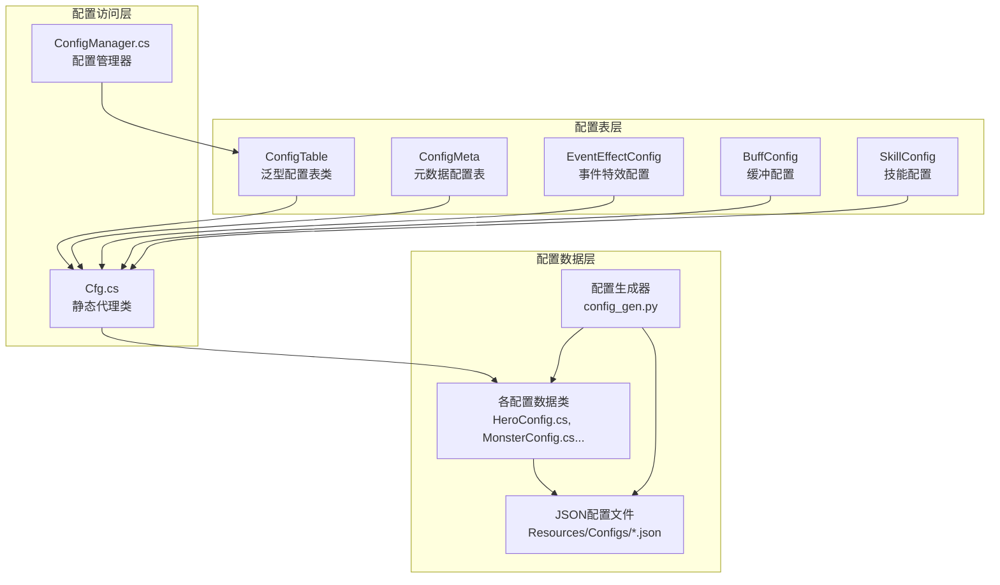
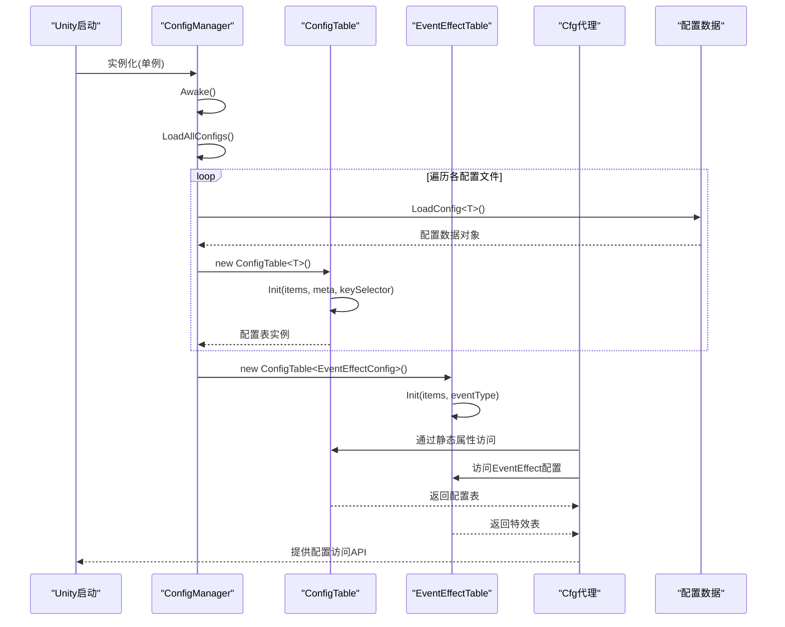
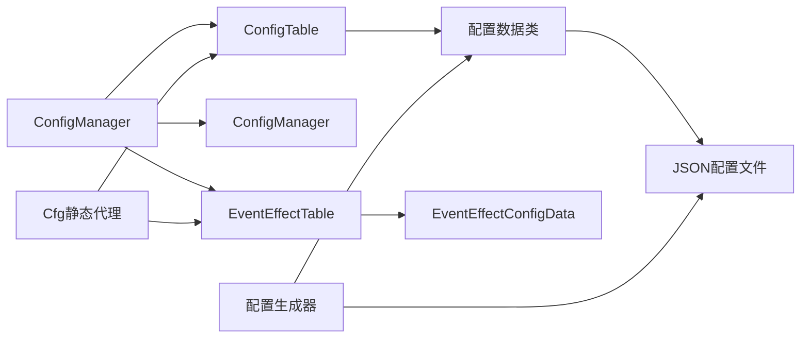

# 配置管理系统

<cite>
**本文档引用的文件**
- [ConfigManager.cs](file://Assets/Scripts/Core/ConfigManager.cs)
- [ConfigTable.cs](file://Assets/Scripts/Core/ConfigTable.cs)
- [Cfg.cs](file://Assets/Scripts/Core/Cfg.cs)
- [EventEffectConfig.cs](file://Assets/Scripts/Data/Configs/EventEffectConfig.cs)
- [BuffConfig.cs](file://Assets/Scripts/Data/Configs/BuffConfig.cs)
- [SkillConfig.cs](file://Assets/Scripts/Data/Configs/SkillConfig.cs)
- [buff_config.json](file://Assets/Resources/Configs/buff_config.json)
- [skill_config.json](file://Assets/Resources/Configs/skill_config.json)
- [event_effect_config.json](file://Assets/Resources/Configs/event_effect_config.json)
- [config_gen.py](file://Tools/config_gen.py)
</cite>

## 更新摘要
**所做更改**
- 移除了global_config.json的引用，因为该文件已被删除
- 更新了配置文件组织结构，反映了重构后的配置系统
- 修正了Buff配置结构的说明，移除了过时的evtDmgRate字段
- 更新了技能配置系统的说明，反映了大幅扩展的技能池配置
- 修正了配置生成器的分割符说明，使用'#'替代'|'
- 更新了配置访问模式的说明，反映了新的配置表系统

## 目录
1. [简介](#简介)
2. [项目结构](#项目结构)
3. [核心组件](#核心组件)
4. [架构总览](#架构总览)
5. [详细组件分析](#详细组件分析)
6. [配置表系统](#配置表系统)
7. [新增的EventEffect配置系统](#新增的Eventeffect配置系统)
8. [重构的Buff配置结构](#重构的Buff配置结构)
9. [大幅扩展的技能配置](#大幅扩展的技能配置)
10. [配置生成器增强功能](#配置生成器增强功能)
11. [依赖分析](#依赖分析)
12. [性能考虑](#性能考虑)
13. [故障排查指南](#故障排查指南)
14. [结论](#结论)
15. [附录：配置编写指南与最佳实践](#附录配置编写指南与最佳实践)

## 简介
本文档详细介绍GeometryTD全新重构的配置管理系统。系统已从传统的手动配置管理完全转变为自动化配置表系统，引入了ConfigManager.cs、ConfigTable.cs和Cfg.cs三大核心组件，大幅简化了配置访问模式并提升了系统的可维护性和扩展性。

新架构的核心优势包括：
- 自动化配置表生成，消除手写索引构建代码
- 统一的配置访问语法，通过Cfg静态代理类提供简洁API
- 泛型配置表支持，自动处理ID索引和查询逻辑
- 支持meta元数据和items列表分离的配置结构
- 类型安全的配置访问，编译时检查配置ID和字段类型
- 完整的配置生成工具链，支持从Excel到JSON再到C#代码的自动化转换
- 增强的数组值解析功能，支持更灵活的结构化数据处理
- 新增的EventEffect配置系统，支持独立的事件特效管理

## 项目结构
新配置系统采用三层架构设计：



**图表来源**
- [ConfigTable.cs:11-73](file://Assets/Scripts/Core/ConfigTable.cs#L11-L73)
- [Cfg.cs:7-35](file://Assets/Scripts/Core/Cfg.cs#L7-L35)
- [ConfigManager.cs:15-38](file://Assets/Scripts/Core/ConfigManager.cs#L15-L38)
- [config_gen.py:587-688](file://Tools/config_gen.py#L587-L688)

## 核心组件
新配置系统包含四个核心组件：

### ConfigTable泛型类
提供通用的配置表功能，支持三种模式：
- **双参数模式**：ConfigTable<TItem, TMeta> - 支持items列表和meta元数据
- **单参数模式**：ConfigTable<TItem> - 仅支持items列表
- **元数据模式**：ConfigMeta<TMeta> - 仅支持元数据
- **自动索引**：根据keySelector函数自动构建ID索引字典
- **统一查询**：提供Get(id)方法进行快速配置查询

### EventEffectConfig新增组件
专门处理事件特效配置，支持按eventType进行索引：
- **eventType**：事件类型标识符
- **offset**：特效偏移位置数组
- **prefabPath**：特效预制体路径

### BuffConfig重构组件
简化了缓冲配置结构，移除了复杂的evtDmgRate结构：
- **evtDamage**：直接伤害数值数组
- **evtWhenEnd**：结束时事件数组
- **specialEvent**：特殊事件数组

### SkillConfig扩展组件
大幅扩展了技能配置支持：
- **poolId**：技能池ID
- **level**：技能等级
- **eventEffect**：事件特效ID
- **bulletEvents**：子弹触发事件数组

**章节来源**
- [ConfigTable.cs:11-73](file://Assets/Scripts/Core/ConfigTable.cs#L11-L73)
- [EventEffectConfig.cs:10-31](file://Assets/Scripts/Data/Configs/EventEffectConfig.cs#L10-L31)
- [BuffConfig.cs:10-51](file://Assets/Scripts/Data/Configs/BuffConfig.cs#L10-L51)
- [SkillConfig.cs:10-44](file://Assets/Scripts/Data/Configs/SkillConfig.cs#L10-L44)

## 架构总览
新架构采用"配置表 + 静态代理 + 自动化生成 + 独立特效管理"的设计模式：



**图表来源**
- [ConfigManager.cs:56-177](file://Assets/Scripts/Core/ConfigManager.cs#L56-L177)
- [ConfigTable.cs:17-56](file://Assets/Scripts/Core/ConfigTable.cs#L17-L56)

## 详细组件分析

### ConfigManager重构分析
ConfigManager已完全重构，移除了手动索引构建代码，采用自动化配置表系统：

#### 主要变化
- **新增EventEffect配置**：添加了eventEffectTable配置表支持
- **移除手动索引**：不再需要BuildSkillLookup()、BuildHeroLookup()等手动索引构建方法
- **自动化初始化**：每个配置表通过Init()方法自动完成索引构建
- **统一加载模式**：所有配置文件采用相同的加载和初始化模式
- **保留预加载功能**：继续支持子弹、特效和角色预制体的预加载缓存
- **增强代码可读性**：用户代码区域添加大量空白行改善代码结构

#### 用户代码区域优化
ConfigManager.cs的用户代码区域经过重新整理，添加了大量空白行来改善代码可读性：

```csharp
// USER CODE START - Fields
private Dictionary<int, GameObject> bulletPrefabCache;
private Dictionary<int, GameObject> effectPrefabCache;
private Dictionary<int, GameObject> rolePrefabCache;


// USER CODE END - Fields

// USER CODE START - AfterLoad
PreloadBulletPrefabs();
PreloadEffectPrefabs();
PreloadRolePrefabs();


// USER CODE END - AfterLoad
```

#### 加载流程优化


**章节来源**
- [ConfigManager.cs:56-177](file://Assets/Scripts/Core/ConfigManager.cs#L56-L177)

### 配置文件组织与作用
新架构支持更清晰的配置文件组织：

#### 带元数据配置：hero_config.json, monster_config.json, skill_config.json
- **结构**：同时包含items列表和meta元数据
- **用途**：存储配置项和相关元数据
- **访问**：通过`Cfg.Hero.Get(id)`和`Cfg.Hero.Meta`访问

#### 纯列表配置：bullet_style_config.json, buff_config.json等
- **结构**：仅包含items列表
- **用途**：存储简单配置项
- **访问**：通过`Cfg.BulletStyle.Get(id)`访问

#### 新增特效配置：event_effect_config.json
- **结构**：包含事件特效配置列表
- **用途**：管理事件触发时的视觉特效
- **访问**：通过`Cfg.EventEffect.Get(eventType)`访问

**章节来源**
- [hero_config.json:1-97](file://Assets/Resources/Configs/hero_config.json#L1-L97)
- [monster_config.json:1-315](file://Assets/Resources/Configs/monster_config.json#L1-L315)
- [arcane_config.json:1-96](file://Assets/Resources/Configs/arcane_config.json#L1-L96)
- [event_effect_config.json:1-74](file://Assets/Resources/Configs/event_effect_config.json#L1-L74)

## 配置表系统
ConfigTable泛型类是新架构的核心，提供统一的配置访问模式：

### 双参数配置表(ConfigTable<TItem, TMeta>)
适用于需要元数据的配置：
- **TItem**：配置项类型
- **TMeta**：元数据类型
- **示例**：HeroConfig、MonsterConfig、SkillConfig等

### 单参数配置表(ConfigTable<TItem>)
适用于纯列表配置：
- **TItem**：配置项类型
- **示例**：BuffConfig、BulletEventConfig、RoleConfig等

### 元数据配置表(ConfigMeta<TMeta>)
专门处理不需要ID索引的配置：
- **示例**：GlobalMeta、HeroMeta、MonsterMeta等

### 自动索引机制
ConfigTable内部自动维护ID到配置项的映射：
- **索引构建**：通过keySelector函数自动构建字典索引
- **查询优化**：提供O(1)时间复杂度的配置查询
- **类型安全**：编译时检查ID类型和配置项类型匹配

**章节来源**
- [ConfigTable.cs:11-73](file://Assets/Scripts/Core/ConfigTable.cs#L11-L73)

## 新增的EventEffect配置系统

### EventEffectConfig数据结构
新增的EventEffectConfig专门处理事件特效配置：

```csharp
public class EventEffectConfig
{
    public class OffsetItem  // 嵌套类
    {
        public int x;
        public int y;
        public int z;
    }

    public int eventType;           // 事件类型标识符
    public OffsetItem[] offset;     // 特效偏移位置
    public string prefabPath;       // 特效预制体路径
}
```

### 配置表初始化
EventEffectTable使用eventType作为索引键：

```csharp
var data = LoadConfig<EventEffectConfigData>("Configs/event_effect_config");
eventEffectTable = new ConfigTable<EventEffectConfig>();
eventEffectTable.Init(data.items, c => c.eventType);
```

### 支持的事件类型
系统支持多种事件类型的特效映射：
- **eventType 1**：穿透效果
- **eventType 2**：爆炸效果  
- **eventType 3**：冰冻效果
- **eventType 4**：燃烧效果
- **eventType 7**：减速效果
- **eventType 8**：治疗效果
- **eventType 9**：持续治疗效果
- **eventType 10**：伤害减免效果
- **eventType 13**：护盾效果
- **eventType 14**：反击效果
- **eventType 15**：击退效果
- **eventType 16**：易伤效果
- **eventType 17**：召唤效果
- **eventType 19**：破甲效果

### 预加载机制
ConfigManager中的预加载功能会自动加载所有事件特效：

```csharp
private void PreloadEffectPrefabs()
{
    effectPrefabCache = new Dictionary<int, GameObject>();
    foreach (var effect in Cfg.EventEffect.All)
    {
        if (!string.IsNullOrEmpty(effect.prefabPath))
        {
            GameObject prefab = Resources.Load<GameObject>(effect.prefabPath);
            if (prefab != null)
                effectPrefabCache[effect.eventType] = prefab;
        }
    }
}
```

**章节来源**
- [EventEffectConfig.cs:10-31](file://Assets/Scripts/Data/Configs/EventEffectConfig.cs#L10-L31)
- [ConfigManager.cs:100-104](file://Assets/Scripts/Core/ConfigManager.cs#L100-L104)
- [event_effect_config.json:1-74](file://Assets/Resources/Configs/event_effect_config.json#L1-L74)

## 重构的Buff配置结构

### 简化后的BuffConfig结构
重构后的BuffConfig移除了复杂的evtDmgRate结构，采用更直接的配置方式：

```csharp
public class BuffConfig
{
    public int id;
    public string name;
    public string icon;
    public string desc;
    public int overlap;
    public int probability;
    public int lastTime;
    public int jumpTime;
    public int eventEffect;         // 新增：事件特效ID
    public string position;
    public int type;
    public int dispel;
    public AttrEntry[] attribute;
    public EvtDmgRateItem[] evtDmgRate;  // 保持兼容
    public int[] evtDamage;          // 简化：直接伤害数值数组
    public int[] evtWhenEnd;         // 结束时事件数组
    public SpecialEventItem[] specialEvent; // 特殊事件数组
}
```

### 配置字段对比

#### 重构前的复杂结构
```json
{
  "evtDmgRate": [
    {
      "type": 1,
      "rate": 3000
    }
  ]
}
```

#### 重构后的简化结构
```json
{
  "evtDamage": [10012],
  "evtWhenEnd": [],
  "specialEvent": []
}
```

### Buff类型支持
系统支持多种类型的Buff效果：
- **类型1**：增益效果（治疗、护盾、属性加成）
- **类型2**：减益效果（伤害、控制、负面状态）

### 属性加成系统
BuffConfig支持多种属性加成：
- **AttrEntry**：属性条目，包含属性ID和数值
- **支持的属性**：生命值、攻击力、属性伤害加成、减伤等

**章节来源**
- [BuffConfig.cs:10-51](file://Assets/Scripts/Data/Configs/BuffConfig.cs#L10-L51)
- [buff_config.json:17-25](file://Assets/Resources/Configs/buff_config.json#L17-L25)

## 大幅扩展的技能配置

### 扩展后的SkillConfig结构
技能配置大幅扩展，支持更多技能变体和等级提升：

```csharp
public class SkillConfig
{
    public int id;              // 完整技能ID (poolId * 100 + level)
    public int poolId;          // 技能池ID
    public int level;           // 技能等级
    public string name;
    public string des;
    public string icon;
    public string category;
    public int dmg;
    public int dmgType;
    public float bulletSpeed;
    public float cd;
    public int bulletStyleId;
    public float attack_range;
    public int[] events;        // 技能触发事件
    public int[] enemyEvents;   // 敌人触发事件
    public int[] bulletEvents;  // 子弹触发事件
    public int eventEffect;     // 关联的事件特效ID
}
```

### 技能池配置
新增的skill_pool_config.json管理技能池的基础信息：

```json
{
  "id": 1001,
  "name": "烈焰圣弹",
  "des": "发射炽热的火焰弹，造成100%火伤",
  "upDes": "提升10%火伤",
  "levelDes": [
    {
      "level": 3,
      "des": "子弹变为散射4次"
    },
    {
      "level": 5,
      "des": "子弹变为散射8次"
    }
  ],
  "icon": "Icon/commet-128",
  "dragHint": "松开发射弹幕"
}
```

### 技能等级系统
- **poolId**：技能池标识符（如1001代表烈焰圣弹）
- **level**：技能等级（1-10）
- **id计算**：poolId * 100 + level 形成唯一技能ID
- **等级描述**：levelDes数组提供每个等级的具体效果

### 技能分类
支持多种技能类型：
- **Projectile**：远程射击技能
- **Aoe**：范围攻击技能  
- **Self**：自我效果技能
- **Buff**：增益技能

### 技能事件系统
- **events**：技能释放时触发的事件
- **enemyEvents**：对敌人造成的事件
- **bulletEvents**：子弹飞行过程中的事件
- **eventEffect**：关联的视觉特效ID

**章节来源**
- [SkillConfig.cs:10-44](file://Assets/Scripts/Data/Configs/SkillConfig.cs#L10-L44)
- [skill_config.json:14](file://Assets/Resources/Configs/skill_config.json#L14)
- [skill_pool_config.json:1-200](file://Assets/Resources/Configs/skill_pool_config.json#L1-L200)

## 配置生成器增强功能

### 结构化数组字段值解析
配置生成器已从使用管道字符'|'改为使用哈希字符'#'作为结构化数组类型中字段值的分隔符，这一增强功能提供了更灵活的数据分割能力。

#### 分割符变更详情
- **原分割符**：管道字符'|' - 用于分隔不同的数组元素
- **新分割符**：哈希字符'#' - 用于分隔结构化数组中的字段值
- **应用场景**：主要用于处理包含多个字段的结构化数组类型

#### 解析逻辑改进
在`convert_value`函数中，数组值解析逻辑得到了重要改进：

```python
elif isinstance(ft, ArrayType):
    if fv:
        inner = [p.strip() for p in fv.split('#') if p.strip()]
        obj[fn] = [convert_primitive(p, ft.element_type.name) for p in inner]
    else:
        obj[fn] = []
```

#### 支持的配置类型
这种增强主要支持以下配置类型：
- **结构化数组类型**：如`{int id;int value}[]`
- **多字段结构体**：每个字段值之间使用'#'分隔
- **混合数据类型**：支持不同字段类型的组合

#### 实际应用示例
假设有一个结构化数组配置：
```json
{
  "skills": [
    {
      "id": 1001,
      "effects": [
        "1001#3000",  // 第一个字段值：1001，第二个字段值：3000
        "1002#4500"   // 第二个字段值：1002，第二个字段值：4500
      ]
    }
  ]
}
```

解析后会得到：
```csharp
new SkillConfig
{
  skills = new[]
  {
    new SkillItem
    {
      id = 1001,
      effects = new[] { "1001", "3000" },
      // 其他字段...
    }
  }
}
```

**章节来源**
- [config_gen.py:170-177](file://Tools/config_gen.py#L170-L177)

## 依赖分析
新架构的依赖关系更加清晰：



**图表来源**
- [ConfigManager.cs:15-38](file://Assets/Scripts/Core/ConfigManager.cs#L15-L38)
- [Cfg.cs:7-35](file://Assets/Scripts/Core/Cfg.cs#L7-L35)
- [config_gen.py:587-688](file://Tools/config_gen.py#L587-L688)

## 性能考虑
新架构在性能方面有显著改进：

### 内存优化
- **自动索引**：ConfigTable内部维护字典索引，内存开销最小化
- **延迟初始化**：配置表在首次访问时才进行索引构建
- **类型安全**：编译时检查减少运行时错误

### 查询性能
- **O(1)查询**：字典索引提供常数时间复杂度的配置查询
- **批量操作**：All属性提供完整的配置列表访问
- **特效预加载**：EventEffectTable支持按eventType的快速索引

### 加载优化
- **统一加载**：所有配置文件采用相同的高效加载模式
- **预加载缓存**：继续支持预制体的预加载缓存机制
- **错误处理**：完善的错误日志和异常处理机制

### 代码可读性优化
ConfigManager.cs经过重新整理，用户代码区域添加了大量空白行，显著改善了代码的可读性和维护性。

**章节来源**
- [ConfigTable.cs:26-56](file://Assets/Scripts/Core/ConfigTable.cs#L26-L56)
- [ConfigManager.cs:169-177](file://Assets/Scripts/Core/ConfigManager.cs#L169-L177)

## 故障排查指南
新架构的故障排查更加直观：

### 配置加载问题
- **检查JSON格式**：确认JSON文件语法正确
- **验证配置类**：确保配置类与JSON结构匹配
- **查看生成代码**：检查自动生成的配置代码是否正确

### 配置访问问题
- **验证ID存在性**：确认配置ID在JSON文件中存在
- **检查类型匹配**：确保访问的配置类型正确
- **查看索引构建**：确认ConfigTable的Init方法正确执行

### 预加载问题
- **检查资源路径**：确认prefabPath指向正确的资源
- **验证资源存在**：确保Resources中存在对应预制体
- **查看缓存状态**：确认预加载缓存正常工作

### 数组解析问题
- **检查分割符使用**：确认结构化数组字段值使用'#'分隔
- **验证数据格式**：确保数组元素格式符合预期
- **测试解析结果**：验证生成的C#代码能够正确解析配置

### 新增特效系统问题
- **检查eventType映射**：确认EventEffectConfig中的eventType与技能配置匹配
- **验证特效路径**：确保prefabPath指向正确的特效资源
- **测试预加载功能**：确认PreloadEffectPrefabs正常工作

### Buff配置迁移问题
- **检查evtDamage字段**：确认evtDmgRate已正确迁移到evtDamage
- **验证数值含义**：确认百分比数值已正确转换为直接伤害ID
- **测试配置效果**：验证迁移后的配置在游戏中正常工作

**章节来源**
- [ConfigManager.cs:179-194](file://Assets/Scripts/Core/ConfigManager.cs#L179-L194)
- [ConfigTable.cs:17-56](file://Assets/Scripts/Core/ConfigTable.cs#L17-L56)

## 结论
GeometryTD的配置管理系统已完成完全重构，新架构通过ConfigTable泛型类、Cfg静态代理、自动化配置生成机制和新增的EventEffect配置系统，实现了更加高效、类型安全和易于维护的配置管理方案。

新系统的主要优势：
- **自动化程度高**：自动生成配置访问代码，减少手写样板代码
- **类型安全**：编译时检查配置ID和类型匹配
- **性能优异**：字典索引提供O(1)查询性能
- **扩展性强**：支持新的配置类型和结构变更
- **维护成本低**：统一的配置表模式简化了代码维护
- **开发效率高**：完整的工具链支持从Excel到运行时的自动化转换
- **解析能力增强**：支持更灵活的结构化数组数据处理
- **特效管理独立**：新增的EventEffect系统提供专业的事件特效管理

**重大变更影响**：
- **向后兼容性**：配置文件的重大变更需要相应的代码适配
- **平衡性调整**：技能配置的大幅扩展需要重新平衡游戏性
- **配置迁移**：Buff配置的简化需要更新所有相关的配置文件
- **生成器升级**：配置生成器的增强功能需要相应更新

未来可以在此基础上进一步优化配置热更新、增量加载等功能，为游戏的持续迭代提供更好的支持。

## 附录：配置编写指南与最佳实践

### 配置文件编写规范
- **文件命名**：使用snake_case命名，如`hero_config.xlsx`
- **结构统一**：遵循items + meta的结构模式
- **ID规范**：使用有意义的ID，避免冲突
- **字段命名**：使用驼峰命名法，如`attackSkillIds`

### 配置数据类定义
- **自动生成**：通过config_gen.py自动生成配置类
- **类型安全**：确保字段类型与JSON数据匹配
- **元数据分离**：将配置项和元数据分别定义

### 配置访问最佳实践
- **使用Cfg代理**：通过`Cfg.Hero.Get(id)`访问配置
- **检查空值**：访问配置后检查返回值是否为空
- **批量操作**：使用`Cfg.Hero.All`进行批量配置访问
- **元数据访问**：通过`Cfg.Global.Meta`访问全局设置

### 性能优化建议
- **合理使用索引**：ConfigTable自动维护索引，无需手动优化
- **避免频繁查询**：缓存常用的配置结果
- **批量加载**：利用ConfigManager的一次性加载机制
- **资源管理**：合理使用预制体预加载缓存

### 扩展新配置类型的步骤
1. **创建Excel文件**：定义新的配置数据结构
2. **运行生成器**：执行python Tools/config_gen.py生成配置
3. **更新ConfigManager**：在LoadAllConfigs中添加新配置
4. **使用配置**：通过Cfg代理类访问新配置

### 配置迁移指南
**Buff配置迁移**：
- 将evtDmgRate字段替换为evtDamage
- 将百分比数值转换为直接伤害ID
- 更新相关的buff效果计算逻辑

**EventEffect系统迁移**：
- 在技能配置中添加eventEffect字段
- 创建对应的EventEffectConfig条目
- 确保特效预制体路径正确

**技能配置扩展**：
- 利用技能池系统支持更多变体
- 合理设计技能等级提升效果
- 平衡技能释放频率和伤害输出

### 数组值解析最佳实践
**结构化数组配置**：
- 使用哈希字符'#'分隔结构化数组中的字段值
- 确保字段值的顺序与定义的字段顺序一致
- 验证数组元素的数量与字段数量匹配

**混合类型数组**：
- 支持不同类型字段的组合
- 注意数值类型的转换和验证
- 确保字符串类型的正确处理

**章节来源**
- [EventEffectConfig.cs:1-32](file://Assets/Scripts/Data/Configs/EventEffectConfig.cs#L1-L32)
- [BuffConfig.cs:1-52](file://Assets/Scripts/Data/Configs/BuffConfig.cs#L1-L52)
- [SkillConfig.cs:1-45](file://Assets/Scripts/Data/Configs/SkillConfig.cs#L1-L45)
- [config_gen.py:587-688](file://Tools/config_gen.py#L587-L688)