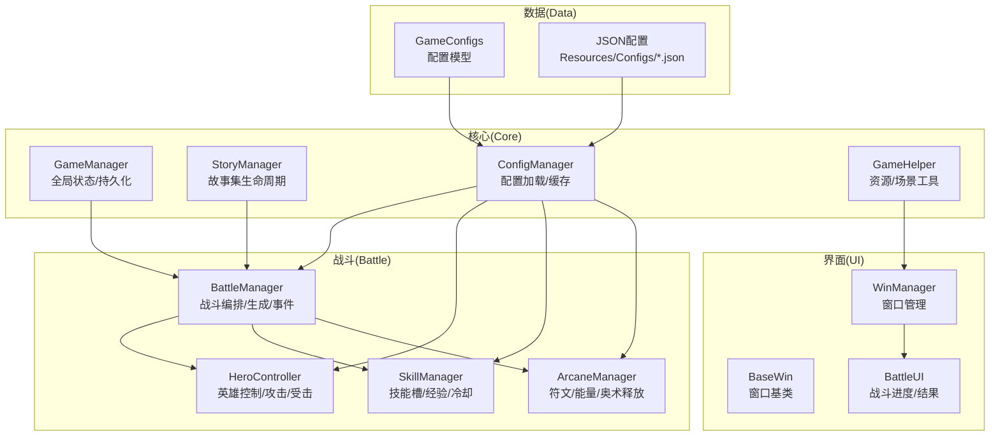
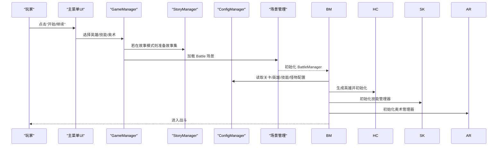
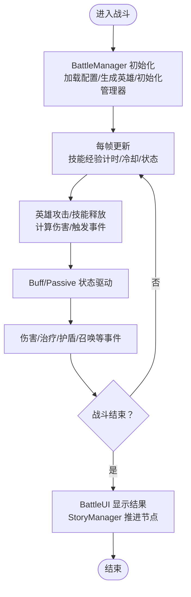
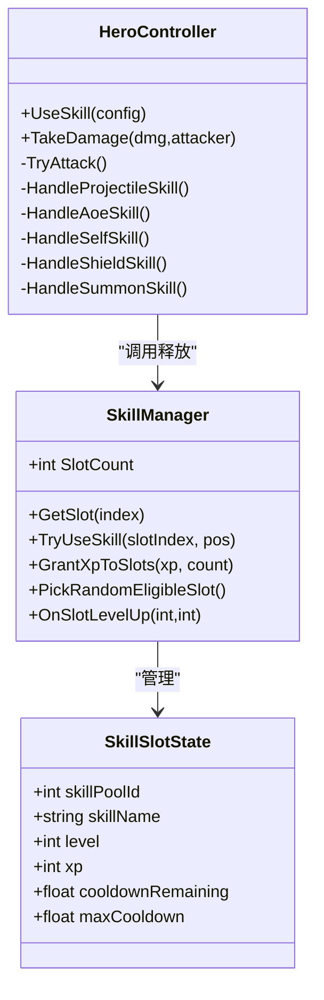
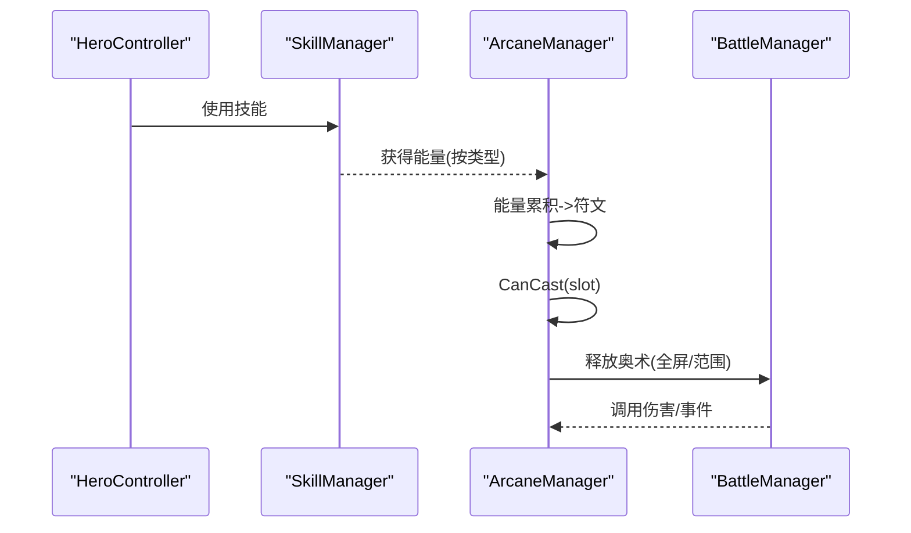
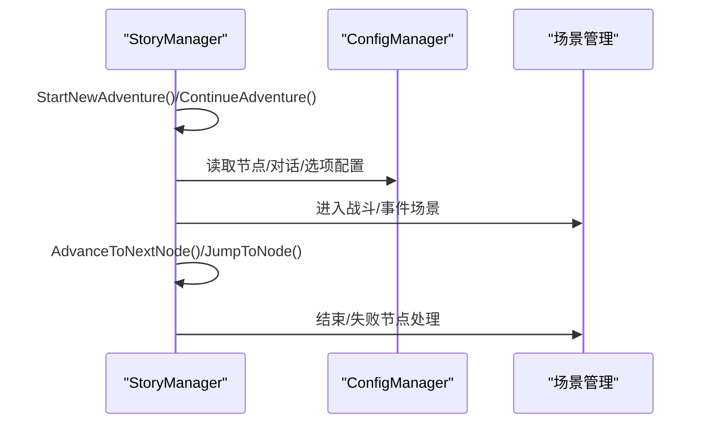
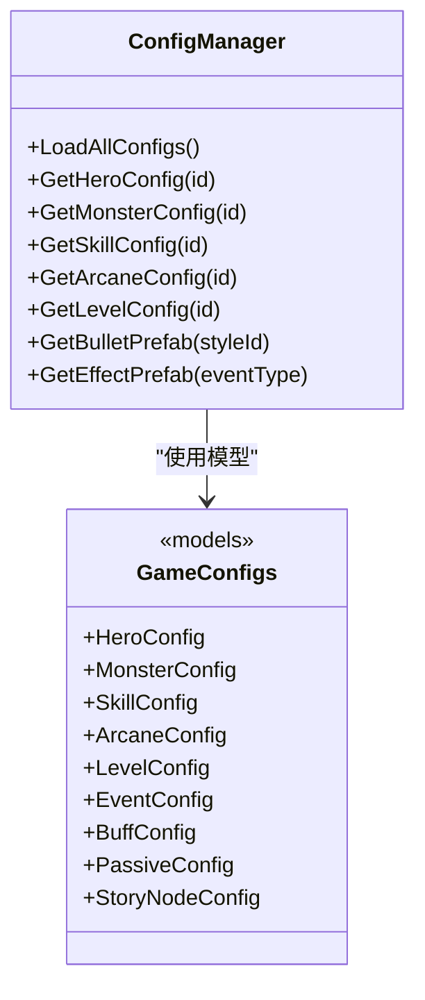
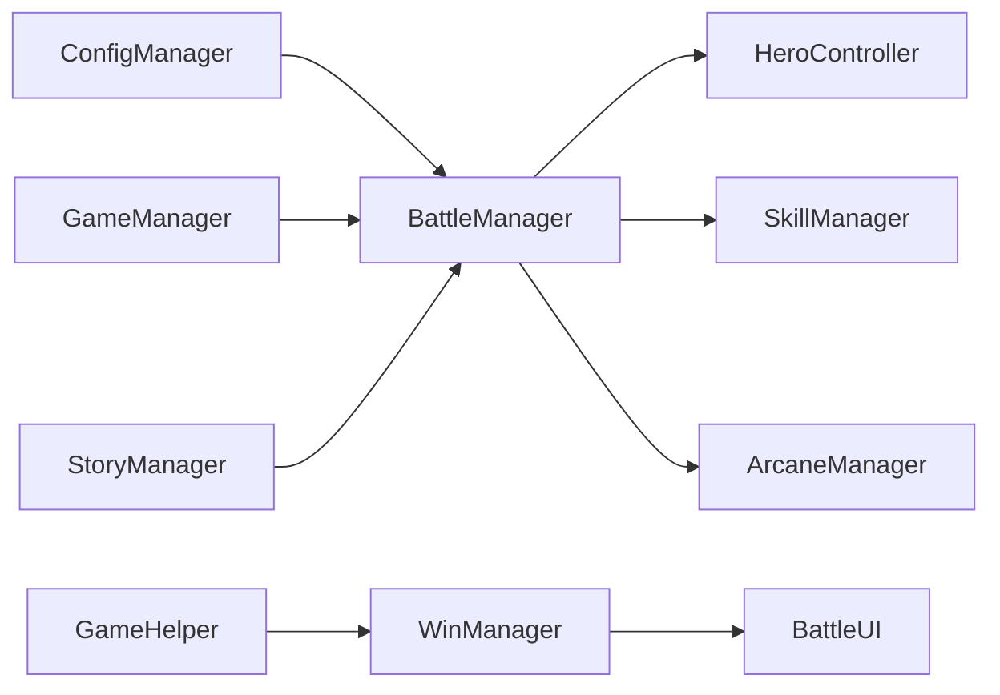

# 项目概述

<cite>
**本文档引用的文件**
- [GameManager.cs](file://Assets/Scripts/Core/GameManager.cs)
- [ConfigManager.cs](file://Assets/Scripts/Core/ConfigManager.cs)
- [GameConfigs.cs](file://Assets/Scripts/Data/GameConfigs.cs)
- [StoryManager.cs](file://Assets/Scripts/Core/StoryManager.cs)
- [BattleManager.cs](file://Assets/Scripts/Battle/BattleManager.cs)
- [SkillManager.cs](file://Assets/Scripts/Battle/SkillManager.cs)
- [ArcaneManager.cs](file://Assets/Scripts/Battle/ArcaneManager.cs)
- [HeroController.cs](file://Assets/Scripts/Battle/HeroController.cs)
- [BattleUI.cs](file://Assets/Scripts/UI/BattleUI.cs)
- [WinManager.cs](file://Assets/Scripts/UI/WinManager.cs)
- [BaseWin.cs](file://Assets/Scripts/UI/BaseWin.cs)
- [GameHelper.cs](file://Assets/Scripts/Core/GameHelper.cs)
- [game_config.json](file://Assets/Resources/Configs/game_config.json)
- [level_config.json](file://Assets/Resources/Configs/level_config.json)
</cite>

## 目录
1. [简介](#简介)
2. [项目结构](#项目结构)
3. [核心组件](#核心组件)
4. [架构总览](#架构总览)
5. [详细组件分析](#详细组件分析)
6. [依赖关系分析](#依赖关系分析)
7. [性能考量](#性能考量)
8. [故障排除指南](#故障排除指南)
9. [结论](#结论)
10. [附录](#附录)

## 简介
GeometryTD 是一个基于 Unity 2D 引擎的回合制塔防 RPG 游戏。项目以“配置驱动”为核心开发范式，通过 JSON 配置文件定义游戏数值、关卡、技能、奥术、角色与故事节点等，配合 C# 代码在运行时动态加载与装配，形成高度模块化的系统架构。

项目主要特色功能包括：
- 回合制战斗系统：以技能与奥术为核心的策略战斗，支持多目标、弹幕、全屏范围伤害与元素类型。
- 角色扮演元素：技能成长（经验升级）、奥术符能系统（符文/能量收集）、角色属性与被动/增益/减益系统。
- 丰富的剧情系统：故事集（Story Collection）驱动的章节式叙事，包含对话、选择分支、结局与永久进度。
- 配置驱动开发：所有玩法数据通过 JSON 配置集中管理，便于平衡性调整与快速迭代。

技术栈与工具链：
- 编程语言：C#
- 引擎：Unity 2D
- 数据格式：JSON（Resources 下集中存放）
- UI：Unity UI Canvas + Window 管理器

## 项目结构
项目采用按职责分层的模块化组织方式，核心分为以下层次：
- Core（核心）：全局状态管理（GameManager、StoryManager）、配置加载（ConfigManager）、通用工具（GameHelper）。
- Battle（战斗）：战斗流程编排（BattleManager）、英雄控制（HeroController）、技能系统（SkillManager）、奥术系统（ArcaneManager）、事件与效果（EventExecutor 等）。
- UI（界面）：窗口系统（WinManager、BaseWin）、战斗 UI（BattleUI）、各类选择与对话窗口。
- Data（数据）：配置模型（GameConfigs.cs）与 JSON 配置文件（Assets/Resources/Configs）。

图表来源
- [GameManager.cs:1-239](file://Assets/Scripts/Core/GameManager.cs#L1-L239)
- [StoryManager.cs:1-589](file://Assets/Scripts/Core/StoryManager.cs#L1-L589)
- [ConfigManager.cs:1-619](file://Assets/Scripts/Core/ConfigManager.cs#L1-L619)
- [BattleManager.cs:1-805](file://Assets/Scripts/Battle/BattleManager.cs#L1-L805)
- [HeroController.cs:1-514](file://Assets/Scripts/Battle/HeroController.cs#L1-L514)
- [SkillManager.cs:1-242](file://Assets/Scripts/Battle/SkillManager.cs#L1-L242)
- [ArcaneManager.cs:1-298](file://Assets/Scripts/Battle/ArcaneManager.cs#L1-L298)
- [WinManager.cs:1-195](file://Assets/Scripts/UI/WinManager.cs#L1-L195)
- [BaseWin.cs:1-32](file://Assets/Scripts/UI/BaseWin.cs#L1-L32)
- [BattleUI.cs:1-146](file://Assets/Scripts/UI/BattleUI.cs#L1-L146)
- [GameConfigs.cs:1-775](file://Assets/Scripts/Data/GameConfigs.cs#L1-L775)
- [game_config.json:1-9](file://Assets/Resources/Configs/game_config.json#L1-L9)
- [level_config.json:1-80](file://Assets/Resources/Configs/level_config.json#L1-L80)

章节来源
- [GameManager.cs:1-239](file://Assets/Scripts/Core/GameManager.cs#L1-L239)
- [ConfigManager.cs:1-619](file://Assets/Scripts/Core/ConfigManager.cs#L1-L619)
- [GameConfigs.cs:1-775](file://Assets/Scripts/Data/GameConfigs.cs#L1-L775)

## 核心组件
本节聚焦于项目的关键组件及其职责与交互。

- GameManager（全局状态与持久化）
  - 单例模式，负责关卡选择、英雄与技能/奥术装备、关卡完成状态的持久化（PlayerPrefs）。
  - 提供场景切换入口（主菜单、战斗场景）。
  - 与 ConfigManager 协作进行关卡解锁条件判断。

- StoryManager（故事集生命周期）
  - 单例（惰性创建），管理故事集的开始/继续/推进/结束。
  - 提供事件回调（节点变更、金币变化、藏品获得、冒险结束）。
  - 与 BattleManager/WinManager 协作，驱动场景切换与 UI 更新。

- ConfigManager（配置加载与缓存）
  - 单例，集中加载与缓存所有 JSON 配置（英雄、怪物、技能、奥术、关卡、事件、Buff、Passive 等）。
  - 提供查询接口与预制体缓存（子弹、特效、角色），支持运行时动态装配。

- BattleManager（战斗编排）
  - 负责战斗初始化、敌人生成、Boss 事件链、伤害计算与 UI 同步。
  - 管理技能经验定时发放、伤害浮字显示、Boss 血量 UI 切换。
  - 与 HeroController、SkillManager、ArcaneManager、EventEffectManager 等协作。

- HeroController（英雄控制）
  - 实现 IBuffTarget 接口，封装属性、受击、护盾、攻击与技能释放。
  - 支持蓄力（Charge）状态、攻击间隔、弹幕/齐射/连射等复杂子弹行为。
  - 与 BuffSystem/PassiveSystem 协同，处理伤害修正、反伤、冻结等状态。

- SkillManager（技能系统）
  - 管理技能槽位、经验获取、等级提升与冷却。
  - 提供随机经验分配与槽位升级事件通知。

- ArcaneManager（奥术系统）
  - 管理符文与能量收集、冷却、主动释放与周期性伤害。
  - 支持全屏与范围伤害，并对敌人施加事件效果。

- WinManager（窗口管理）
  - 管理 UI 窗口的创建、缓存、排序与遮罩，统一窗口生命周期。

- BattleUI（战斗 UI）
  - 管理击杀进度条、Boss 血量、战斗结算面板与返回逻辑。

章节来源
- [GameManager.cs:1-239](file://Assets/Scripts/Core/GameManager.cs#L1-L239)
- [StoryManager.cs:1-589](file://Assets/Scripts/Core/StoryManager.cs#L1-L589)
- [ConfigManager.cs:1-619](file://Assets/Scripts/Core/ConfigManager.cs#L1-L619)
- [BattleManager.cs:1-805](file://Assets/Scripts/Battle/BattleManager.cs#L1-L805)
- [HeroController.cs:1-514](file://Assets/Scripts/Battle/HeroController.cs#L1-L514)
- [SkillManager.cs:1-242](file://Assets/Scripts/Battle/SkillManager.cs#L1-L242)
- [ArcaneManager.cs:1-298](file://Assets/Scripts/Battle/ArcaneManager.cs#L1-L298)
- [WinManager.cs:1-195](file://Assets/Scripts/UI/WinManager.cs#L1-L195)
- [BattleUI.cs:1-146](file://Assets/Scripts/UI/BattleUI.cs#L1-L146)

## 架构总览
下图展示了从主菜单到战斗场景的整体流程，以及各核心组件之间的交互关系。

图表来源
- [GameManager.cs:52-63](file://Assets/Scripts/Core/GameManager.cs#L52-L63)
- [StoryManager.cs:499-522](file://Assets/Scripts/Core/StoryManager.cs#L499-L522)
- [ConfigManager.cs:77-122](file://Assets/Scripts/Core/ConfigManager.cs#L77-L122)
- [BattleManager.cs:145-275](file://Assets/Scripts/Battle/BattleManager.cs#L145-L275)

## 详细组件分析

### 回合制战斗机制与数据流
- 初始化阶段
  - BattleManager 从 ConfigManager 读取当前关卡与英雄配置，实例化英雄、怪物生成器、技能与奥术管理器。
  - 初始化 UI（进度条/结果面板）并与战斗状态同步。
- 战斗阶段
  - 英雄根据攻击间隔自动发起攻击，计算伤害并触发事件。
  - 技能经验通过定时器自动发放到随机可用槽位，支持全屏/范围伤害与子弹事件组合。
  - 奥术通过符能/能量收集释放，周期性对范围内敌人造成伤害并附加事件。
- 结算阶段
  - 击败 Boss 或英雄死亡后，BattleUI 显示结果，StoryManager 决定后续节点推进或返回主菜单。

图表来源
- [BattleManager.cs:65-110](file://Assets/Scripts/Battle/BattleManager.cs#L65-L110)
- [HeroController.cs:147-176](file://Assets/Scripts/Battle/HeroController.cs#L147-L176)
- [SkillManager.cs:72-85](file://Assets/Scripts/Battle/SkillManager.cs#L72-L85)
- [ArcaneManager.cs:167-196](file://Assets/Scripts/Battle/ArcaneManager.cs#L167-L196)
- [BattleUI.cs:107-143](file://Assets/Scripts/UI/BattleUI.cs#L107-L143)

章节来源
- [BattleManager.cs:145-275](file://Assets/Scripts/Battle/BattleManager.cs#L145-L275)
- [HeroController.cs:147-281](file://Assets/Scripts/Battle/HeroController.cs#L147-L281)
- [SkillManager.cs:139-183](file://Assets/Scripts/Battle/SkillManager.cs#L139-L183)
- [ArcaneManager.cs:198-256](file://Assets/Scripts/Battle/ArcaneManager.cs#L198-L256)
- [BattleUI.cs:33-105](file://Assets/Scripts/UI/BattleUI.cs#L33-L105)

### 技能系统与经验成长
- 技能槽位管理
  - SkillManager 维护多个技能槽位，每个槽位包含池 ID、等级、经验与冷却。
  - 通过定时器随机挑选槽位发放经验，达到上限后升级并触发 UI 事件。
- 技能释放
  - HeroController 根据技能类别（自体、投射、范围、护盾、召唤）路由到不同处理逻辑。
  - 支持弹幕（散射/齐射/连射）、追踪、爆炸、穿透等子弹事件组合。

图表来源
- [SkillManager.cs:15-242](file://Assets/Scripts/Battle/SkillManager.cs#L15-L242)
- [HeroController.cs:284-402](file://Assets/Scripts/Battle/HeroController.cs#L284-L402)

章节来源
- [SkillManager.cs:48-137](file://Assets/Scripts/Battle/SkillManager.cs#L48-L137)
- [HeroController.cs:284-402](file://Assets/Scripts/Battle/HeroController.cs#L284-L402)

### 奥术系统与符能机制
- 能量与符文
  - ArcaneManager 通过技能使用获得能量，累积到阈值转化为符文。
  - 释放时消耗符文与冷却，支持全屏或范围伤害，并对敌人施加事件。
- 主动释放与周期性触发
  - 每帧更新槽位冷却与活跃奥术的周期计时，触发伤害与事件。

图表来源
- [ArcaneManager.cs:80-165](file://Assets/Scripts/Battle/ArcaneManager.cs#L80-L165)
- [ArcaneManager.cs:198-256](file://Assets/Scripts/Battle/ArcaneManager.cs#L198-L256)
- [SkillManager.cs:87-137](file://Assets/Scripts/Battle/SkillManager.cs#L87-L137)

章节来源
- [ArcaneManager.cs:39-165](file://Assets/Scripts/Battle/ArcaneManager.cs#L39-L165)
- [ArcaneManager.cs:198-256](file://Assets/Scripts/Battle/ArcaneManager.cs#L198-L256)

### 故事集系统与节点推进
- 生命周期
  - StoryManager 管理故事集的开始/继续/推进/结束，提供事件回调与存档。
- 节点推进
  - 根据当前节点的选择记录与条件，解析下一节点并保存运行时状态。
- Boss 死亡事件链
  - 按顺序触发对话与选择，完成后继续怪物生成流程。

图表来源
- [StoryManager.cs:96-186](file://Assets/Scripts/Core/StoryManager.cs#L96-L186)
- [StoryManager.cs:300-326](file://Assets/Scripts/Core/StoryManager.cs#L300-L326)
- [StoryManager.cs:539-560](file://Assets/Scripts/Core/StoryManager.cs#L539-L560)

章节来源
- [StoryManager.cs:1-589](file://Assets/Scripts/Core/StoryManager.cs#L1-L589)

### 配置驱动开发与数据模型
- 配置加载
  - ConfigManager 在 Awake 中加载所有 JSON 配置，构建查询索引与预制体缓存。
  - 支持按 ID 快速查询英雄、怪物、技能、奥术、关卡、事件、Buff、Passive 等。
- 数据模型
  - GameConfigs 定义了属性、事件、子弹事件、Buff、Passive、关卡、故事节点等结构体与枚举。
  - JSON 文件（如 game_config.json、level_config.json）提供具体数值与生成规则。

图表来源
- [ConfigManager.cs:77-122](file://Assets/Scripts/Core/ConfigManager.cs#L77-L122)
- [GameConfigs.cs:317-533](file://Assets/Scripts/Data/GameConfigs.cs#L317-L533)

章节来源
- [ConfigManager.cs:1-619](file://Assets/Scripts/Core/ConfigManager.cs#L1-L619)
- [GameConfigs.cs:1-775](file://Assets/Scripts/Data/GameConfigs.cs#L1-L775)
- [game_config.json:1-9](file://Assets/Resources/Configs/game_config.json#L1-L9)
- [level_config.json:1-80](file://Assets/Resources/Configs/level_config.json#L1-L80)

## 依赖关系分析
- 组件耦合与内聚
  - BattleManager 作为战斗中枢，高内聚地协调 HeroController、SkillManager、ArcaneManager、EventEffectManager。
  - ConfigManager 作为唯一数据源，被 BattleManager、HeroController、SkillManager、ArcaneManager 广泛依赖。
  - UI 层通过 WinManager 统一管理，BattleUI 仅与 BattleManager 交互，保持低耦合。
- 外部依赖
  - Unity 引擎（场景管理、资源加载、UI、动画、物理）。
  - PlayerPrefs（持久化）。
- 设计模式应用
  - 单例：GameManager、ConfigManager、StoryManager、WinManager。
  - 工厂：WinManager 动态实例化窗口预制体。
  - 观察者：StoryManager 的事件回调（OnNodeChanged、OnGoldChanged 等）。

图表来源
- [GameManager.cs:1-239](file://Assets/Scripts/Core/GameManager.cs#L1-L239)
- [StoryManager.cs:1-589](file://Assets/Scripts/Core/StoryManager.cs#L1-L589)
- [ConfigManager.cs:1-619](file://Assets/Scripts/Core/ConfigManager.cs#L1-L619)
- [BattleManager.cs:1-805](file://Assets/Scripts/Battle/BattleManager.cs#L1-L805)
- [WinManager.cs:1-195](file://Assets/Scripts/UI/WinManager.cs#L1-L195)

章节来源
- [GameManager.cs:1-239](file://Assets/Scripts/Core/GameManager.cs#L1-L239)
- [StoryManager.cs:1-589](file://Assets/Scripts/Core/StoryManager.cs#L1-L589)
- [ConfigManager.cs:1-619](file://Assets/Scripts/Core/ConfigManager.cs#L1-L619)
- [BattleManager.cs:1-805](file://Assets/Scripts/Battle/BattleManager.cs#L1-L805)
- [WinManager.cs:1-195](file://Assets/Scripts/UI/WinManager.cs#L1-L195)

## 性能考量
- 配置缓存与懒加载
  - ConfigManager 预加载并缓存 JSON 与预制体，避免重复 IO 与查找开销。
- 对象池与复用
  - 建议对子弹、特效、UI 窗口进行对象池化，降低频繁 Instantiate/Destroy 的成本。
- 更新频率优化
  - BattleManager/Update 中的计时器与状态更新尽量批量处理，避免每帧大量循环。
- UI 事件回调
  - 使用事件订阅而非每帧轮询，减少不必要的 UI 更新。

## 故障排除指南
- 配置缺失或解析失败
  - 现象：日志报错“无法加载/解析配置文件”。
  - 处理：检查 JSON 文件路径与字段完整性，确认 Resources 下存在对应文件。
- 关卡解锁异常
  - 现象：关卡不可解锁或完成状态不正确。
  - 处理：核对 level_config.json 的 conditions 字段与 GameManager 的 IsLevelUnlocked 逻辑。
- 技能/奥术无法释放
  - 现象：冷却未归零或符文不足。
  - 处理：检查 SkillManager/ArcaneManager 的冷却与能量计算逻辑，确认 Buff 修改生效。
- 场景切换异常
  - 现象：无法进入战斗或 UI 不显示。
  - 处理：确认 GameHelper.LoadScene 与 Time.timeScale 设置，检查 WinManager 的 Canvas 与排序。

章节来源
- [ConfigManager.cs:200-215](file://Assets/Scripts/Core/ConfigManager.cs#L200-L215)
- [GameManager.cs:76-99](file://Assets/Scripts/Core/GameManager.cs#L76-L99)
- [SkillManager.cs:114-136](file://Assets/Scripts/Battle/SkillManager.cs#L114-L136)
- [ArcaneManager.cs:119-133](file://Assets/Scripts/Battle/ArcaneManager.cs#L119-L133)
- [GameHelper.cs:77-82](file://Assets/Scripts/Core/GameHelper.cs#L77-L82)

## 结论
GeometryTD 通过“配置驱动 + 模块化架构”的设计，在 Unity 2D 平台上实现了可扩展的回合制塔防 RPG。核心优势在于：
- 高度可配置的数据模型与 JSON 驱动，便于快速平衡与迭代。
- 清晰的战斗系统分层（战斗编排、英雄控制、技能/奥术、事件），易于维护与扩展。
- 故事集系统与 UI 窗口管理解耦，支持复杂的叙事与交互。

建议后续方向：
- 引入对象池与异步加载，进一步优化性能。
- 增强事件系统的可视化编辑器支持，降低配置门槛。
- 扩展多语言与本地化框架，完善国际化能力。

## 附录
- 关键配置文件示例
  - [game_config.json:1-9](file://Assets/Resources/Configs/game_config.json#L1-L9)
  - [level_config.json:1-80](file://Assets/Resources/Configs/level_config.json#L1-L80)
- 关键脚本路径
  - [GameManager.cs:1-239](file://Assets/Scripts/Core/GameManager.cs#L1-L239)
  - [StoryManager.cs:1-589](file://Assets/Scripts/Core/StoryManager.cs#L1-L589)
  - [ConfigManager.cs:1-619](file://Assets/Scripts/Core/ConfigManager.cs#L1-L619)
  - [BattleManager.cs:1-805](file://Assets/Scripts/Battle/BattleManager.cs#L1-L805)
  - [HeroController.cs:1-514](file://Assets/Scripts/Battle/HeroController.cs#L1-L514)
  - [SkillManager.cs:1-242](file://Assets/Scripts/Battle/SkillManager.cs#L1-L242)
  - [ArcaneManager.cs:1-298](file://Assets/Scripts/Battle/ArcaneManager.cs#L1-L298)
  - [WinManager.cs:1-195](file://Assets/Scripts/UI/WinManager.cs#L1-L195)
  - [BaseWin.cs:1-32](file://Assets/Scripts/UI/BaseWin.cs#L1-L32)
  - [BattleUI.cs:1-146](file://Assets/Scripts/UI/BattleUI.cs#L1-L146)
  - [GameConfigs.cs:1-775](file://Assets/Scripts/Data/GameConfigs.cs#L1-L775)