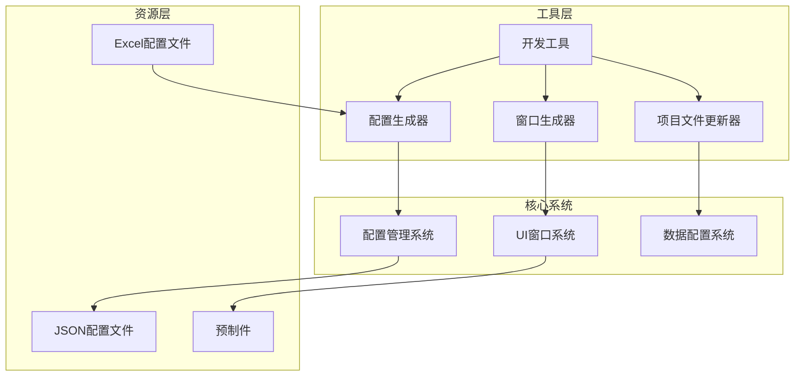
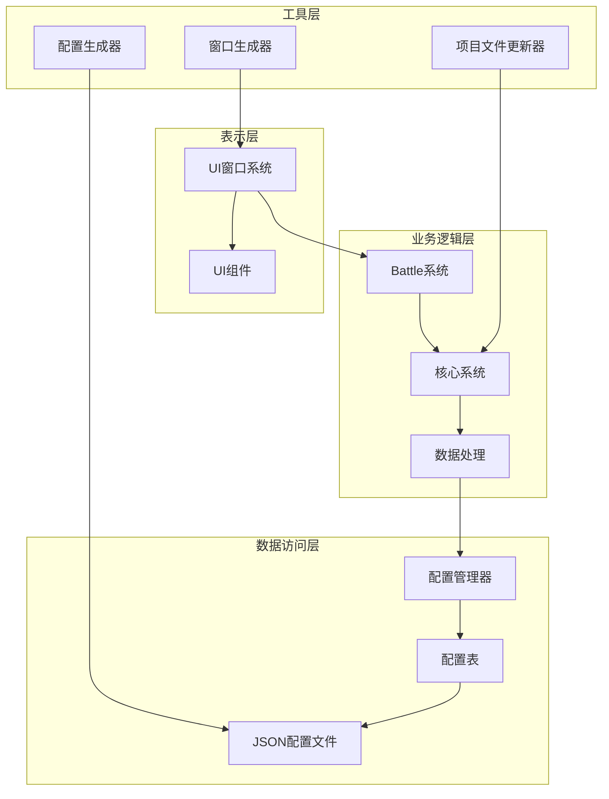
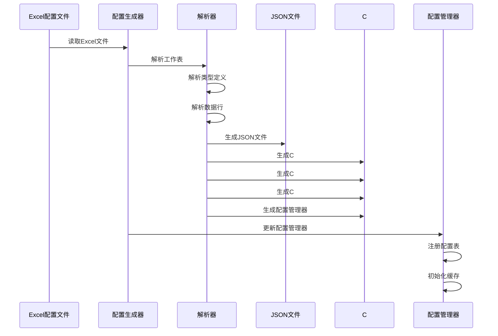
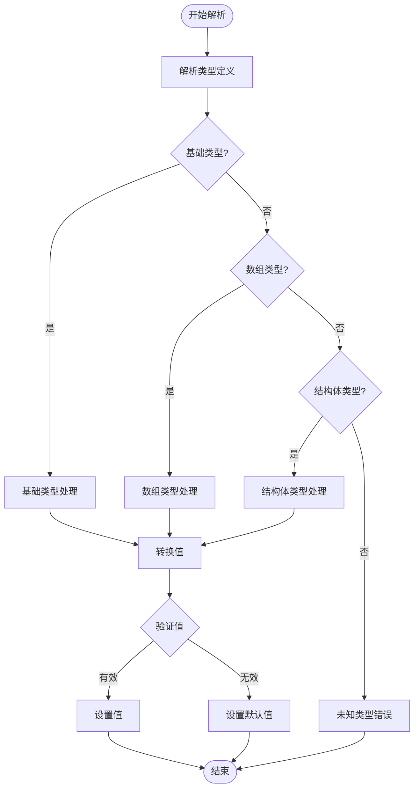
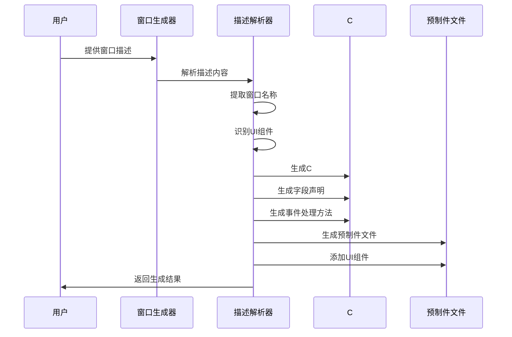
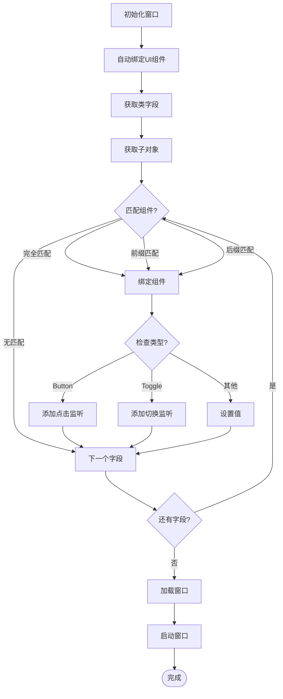
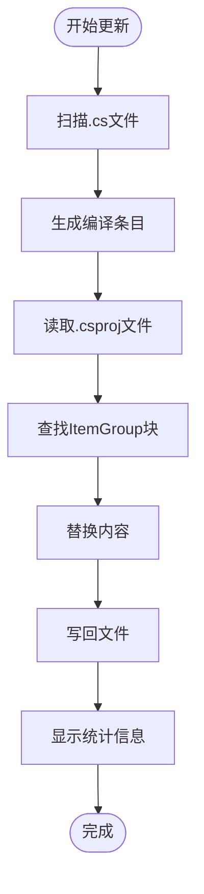
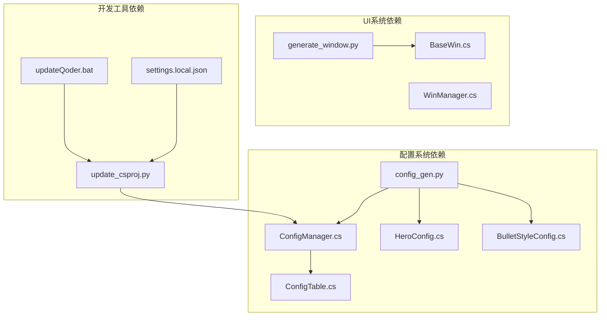

# 开发工具与自动化

<cite>
**本文档中引用的文件**
- [config_gen.py](file://Tools/config_gen.py)
- [update_csproj.py](file://Tools/update_csproj.py)
- [updateQoder.bat](file://Tools/updateQoder.bat)
- [generate_window.py](file://.trae/skills/window-generator/generate_window.py)
- [test_generator.bat](file://.trae/skills/window-generator/test_generator.bat)
- [ConfigManager.cs](file://Assets/Scripts/Core/ConfigManager.cs)
- [ConfigTable.cs](file://Assets/Scripts/Core/ConfigTable.cs)
- [BaseWin.cs](file://Assets/Scripts/UI/Windows/BaseWin.cs)
- [hero_config.json](file://Assets/Resources/Configs/hero_config.json)
- [HeroConfig.cs](file://Assets/Scripts/Data/Configs/HeroConfig.cs)
- [BulletStyleConfig.cs](file://Assets/Scripts/Data/Configs/BulletStyleConfig.cs)
- [Assembly-CSharp.csproj](file://Assembly-CSharp.csproj)
- [settings.local.json](file://.codebuddy/settings.local.json)
</cite>

## 目录
1. [简介](#简介)
2. [项目结构](#项目结构)
3. [核心组件](#核心组件)
4. [架构概览](#架构概览)
5. [详细组件分析](#详细组件分析)
6. [依赖关系分析](#依赖关系分析)
7. [性能考虑](#性能考虑)
8. [故障排除指南](#故障排除指南)
9. [结论](#结论)

## 简介

这是一个基于Unity引擎的游戏项目的开发工具与自动化系统文档。该项目实现了完整的配置管理系统、UI窗口自动生成工具以及开发环境优化工具，旨在提高游戏开发效率和代码质量。

项目的核心特点包括：
- 自动化的Excel配置转换系统
- 动态UI窗口生成工具
- 开发环境自动配置工具
- 类型安全的配置访问接口

## 项目结构

项目采用模块化组织方式，主要分为以下几个核心区域：

**图表来源**
- [config_gen.py:576-675](file://Tools/config_gen.py#L576-L675)
- [generate_window.py:1-311](file://.trae/skills/window-generator/generate_window.py#L1-L311)

**章节来源**
- [config_gen.py:1-675](file://Tools/config_gen.py#L1-L675)
- [generate_window.py:1-311](file://.trae/skills/window-generator/generate_window.py#L1-L311)

## 核心组件

### 配置管理系统

配置管理系统是项目的核心基础设施，负责将Excel配置文件自动转换为JSON格式，并生成对应的C#数据类和访问接口。

#### 主要功能特性：
- **类型安全的数据访问**：通过泛型配置表提供强类型访问
- **自动缓存机制**：预加载和缓存常用配置数据
- **灵活的键值映射**：支持多种键值组合策略
- **错误处理机制**：完善的加载和解析错误处理

#### 关键组件：
- ConfigManager：配置管理器主类
- ConfigTable：通用配置表实现
- Cfg：静态配置访问入口

**章节来源**
- [ConfigManager.cs:1-265](file://Assets/Scripts/Core/ConfigManager.cs#L1-L265)
- [ConfigTable.cs:1-58](file://Assets/Scripts/Core/ConfigTable.cs#L1-L58)

### UI窗口自动生成系统

该系统允许开发者通过自然语言描述快速生成UI窗口的完整代码结构。

#### 支持的UI组件类型：
- 文本组件（Text）
- 按钮组件（Button）
- 复选框组件（Toggle）
- 输入框组件（InputField）
- 图片组件（Image）
- 节点组件（Transform）

#### 自动生成内容：
- C#窗口类文件
- Unity预制件文件
- 自动绑定UI组件
- 事件处理方法

**章节来源**
- [generate_window.py:1-311](file://.trae/skills/window-generator/generate_window.py#L1-L311)

### 开发环境自动化工具

提供开发环境的自动化配置和优化功能。

#### 工具集：
- **配置生成器**：Excel到JSON和C#代码的转换
- **项目文件更新器**：自动维护Unity项目文件
- **窗口生成器**：UI窗口的快速生成
- **IDE集成工具**：VS Code插件配置

**章节来源**
- [update_csproj.py:1-154](file://Tools/update_csproj.py#L1-L154)
- [updateQoder.bat:1-12](file://Tools/updateQoder.bat#L1-L12)

## 架构概览

项目采用分层架构设计，各层职责明确，耦合度低：

**图表来源**
- [ConfigManager.cs:11-38](file://Assets/Scripts/Core/ConfigManager.cs#L11-L38)
- [BaseWin.cs:8-175](file://Assets/Scripts/UI/Windows/BaseWin.cs#L8-L175)

## 详细组件分析

### 配置生成器工作流程

配置生成器实现了从Excel到JSON再到C#代码的完整转换链路：

**图表来源**
- [config_gen.py:576-675](file://Tools/config_gen.py#L576-L675)
- [config_gen.py:633-667](file://Tools/config_gen.py#L633-L667)

#### 数据类型转换机制

配置生成器支持多种数据类型的自动转换：

**图表来源**
- [config_gen.py:73-98](file://Tools/config_gen.py#L73-L98)
- [config_gen.py:136-189](file://Tools/config_gen.py#L136-L189)

**章节来源**
- [config_gen.py:27-190](file://Tools/config_gen.py#L27-L190)

### UI窗口生成器

窗口生成器提供了从自然语言描述到完整代码实现的自动化流程：

**图表来源**
- [generate_window.py:282-311](file://.trae/skills/window-generator/generate_window.py#L282-L311)

#### UI组件自动绑定机制

BaseWin基类实现了智能的UI组件自动绑定功能：

**图表来源**
- [BaseWin.cs:25-96](file://Assets/Scripts/UI/Windows/BaseWin.cs#L25-L96)

**章节来源**
- [BaseWin.cs:1-175](file://Assets/Scripts/UI/Windows/BaseWin.cs#L1-L175)

### 开发环境自动化工具

#### 项目文件更新器

项目文件更新器解决了Unity开发中的常见问题：

**图表来源**
- [update_csproj.py:58-103](file://Tools/update_csproj.py#L58-L103)

**章节来源**
- [update_csproj.py:1-154](file://Tools/update_csproj.py#L1-L154)

## 依赖关系分析

项目各组件之间的依赖关系清晰明确：

**图表来源**
- [Assembly-CSharp.csproj:42-125](file://Assembly-CSharp.csproj#L42-L125)
- [ConfigManager.cs:15-38](file://Assets/Scripts/Core/ConfigManager.cs#L15-L38)

### 外部依赖

项目的主要外部依赖包括：

- **Unity引擎**：游戏开发框架
- **openpyxl**：Excel文件处理库
- **Python标准库**：文件操作和字符串处理
- **Unity编辑器**：开发环境支持

**章节来源**
- [Assembly-CSharp.csproj:127-200](file://Assembly-CSharp.csproj#L127-L200)

## 性能考虑

### 配置系统性能优化

配置管理系统采用了多层缓存策略来优化性能：

1. **内存缓存**：ConfigManager维护了多个字典缓存
2. **延迟加载**：按需加载配置数据
3. **类型安全**：编译时类型检查减少运行时错误
4. **批量操作**：一次性加载多个配置表

### UI系统性能优化

UI窗口系统通过以下方式优化性能：

1. **反射缓存**：自动绑定过程中的反射结果缓存
2. **事件委托**：高效的事件处理机制
3. **对象池**：窗口实例的重用
4. **懒加载**：UI组件的延迟初始化

## 故障排除指南

### 配置生成器常见问题

1. **Excel文件格式错误**
   - 确保第一行为字段名称，第二行为类型定义
   - 检查数据行是否为空或格式不正确

2. **类型解析失败**
   - 验证类型定义格式是否符合规范
   - 检查结构体字段定义是否完整

3. **文件路径问题**
   - 确保Configs目录存在且可访问
   - 检查输出目录权限

### UI生成器常见问题

1. **窗口描述解析错误**
   - 确保描述包含"创建一个"和"窗口"关键词
   - 检查组件描述格式是否正确

2. **文件生成失败**
   - 验证目标目录权限
   - 检查文件名是否包含非法字符

3. **Unity导入问题**
   - 确保生成的文件在Unity项目中可见
   - 重新导入Unity项目资源

### 开发环境问题

1. **项目文件更新失败**
   - 检查.csproj文件是否存在
   - 验证文件编码格式

2. **IDE插件问题**
   - 确认Python解释器路径正确
   - 检查网络连接状态

**章节来源**
- [config_gen.py:576-675](file://Tools/config_gen.py#L576-L675)
- [update_csproj.py:118-154](file://Tools/update_csproj.py#L118-L154)

## 结论

该项目的开发工具与自动化系统展现了现代游戏开发的最佳实践：

### 主要成就

1. **高度自动化**：从配置到代码的完整自动化流程
2. **类型安全**：编译时类型检查确保数据完整性
3. **开发效率**：显著提升UI开发和配置管理效率
4. **可维护性**：清晰的架构设计便于长期维护

### 技术亮点

- **配置管理系统**：实现了数据驱动的游戏开发模式
- **UI生成工具**：大幅减少重复性UI代码编写
- **开发环境优化**：解决Unity开发中的常见痛点
- **模块化设计**：各组件职责明确，易于扩展

### 未来改进方向

1. **增强错误处理**：提供更详细的错误诊断信息
2. **性能监控**：添加运行时性能指标收集
3. **测试覆盖**：增加单元测试和集成测试
4. **文档完善**：提供更详细的API文档和使用指南

这套工具系统为游戏开发提供了坚实的技术基础，能够有效提升开发团队的工作效率和代码质量。