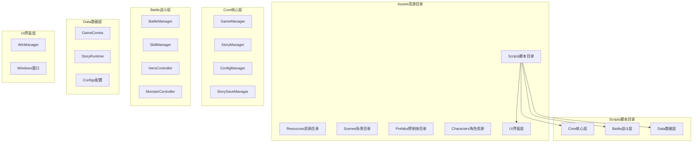
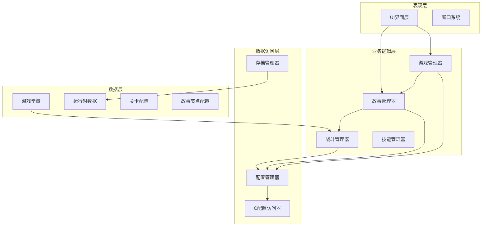
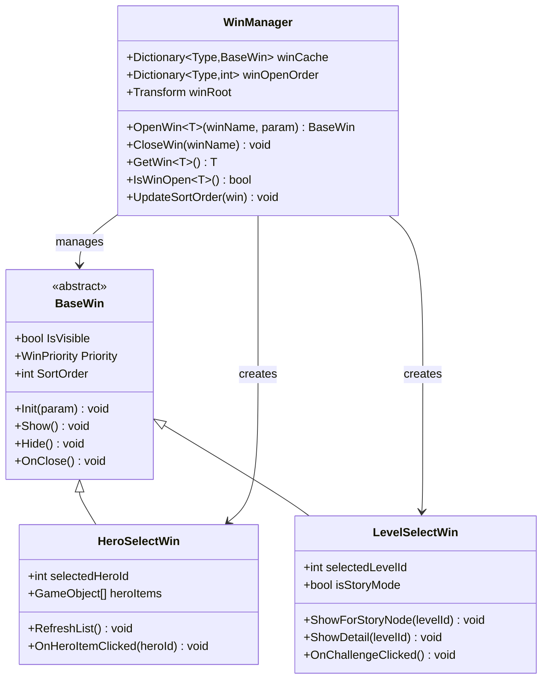
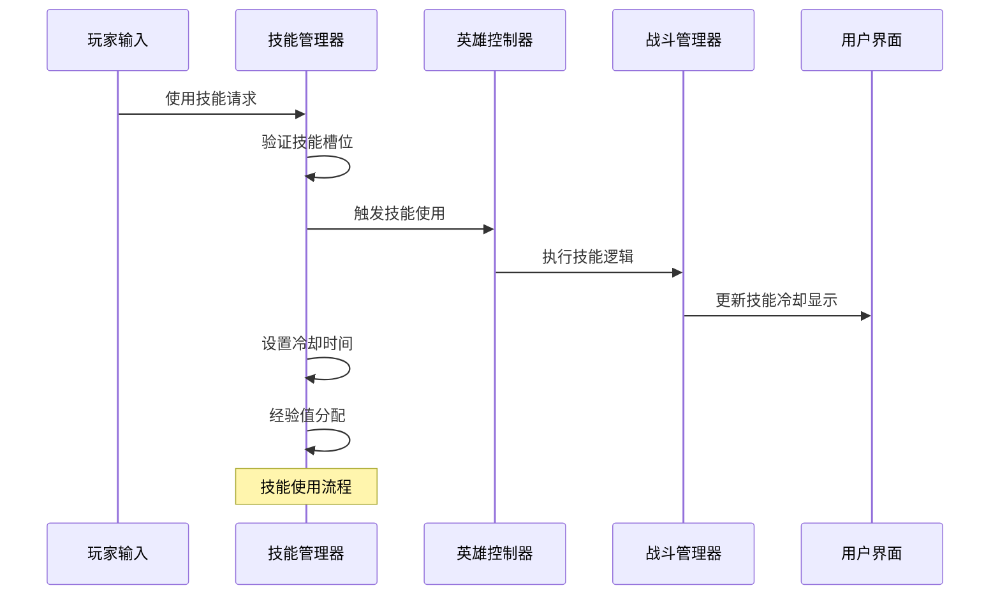
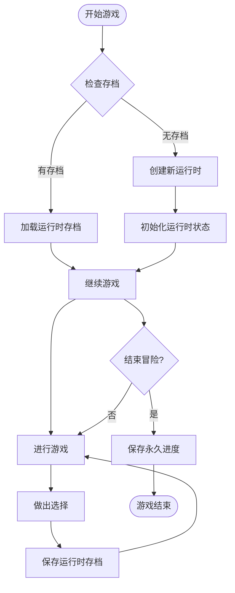
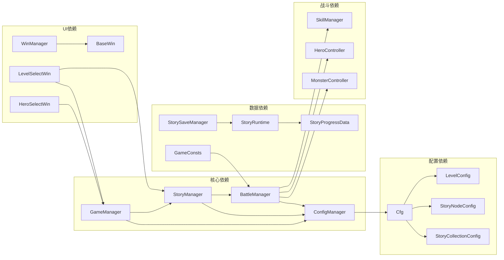

# 项目管理工具

<cite>
**本文档引用的文件**
- [Assets/Scripts/Core/GameManager.cs](file://Assets/Scripts/Core/GameManager.cs)
- [Assets/Scripts/Core/StoryManager.cs](file://Assets/Scripts/Core/StoryManager.cs)
- [Assets/Scripts/Core/ConfigManager.cs](file://Assets/Scripts/Core/ConfigManager.cs)
- [Assets/Scripts/Battle/BattleManager.cs](file://Assets/Scripts/Battle/BattleManager.cs)
- [Assets/Scripts/Data/GameConsts.cs](file://Assets/Scripts/Data/GameConsts.cs)
- [Assets/Scripts/Core/StorySaveManager.cs](file://Assets/Scripts/Core/StorySaveManager.cs)
- [Assets/Scripts/Data/StoryRuntime.cs](file://Assets/Scripts/Data/StoryRuntime.cs)
- [Assets/Scripts/Core/Cfg.cs](file://Assets/Scripts/Core/Cfg.cs)
- [Assets/Scripts/Battle/SkillManager.cs](file://Assets/Scripts/Battle/SkillManager.cs)
- [Assets/Scripts/UI/Managers/WinManager.cs](file://Assets/Scripts/UI/Managers/WinManager.cs)
- [Assets/Scripts/UI/Windows/HeroSelectWin.cs](file://Assets/Scripts/UI/Windows/HeroSelectWin.cs)
- [Assets/Scripts/UI/Windows/LevelSelectWin.cs](file://Assets/Scripts/UI/Windows/LevelSelectWin.cs)
- [Assets/Scripts/Data/Configs/LevelConfig.cs](file://Assets/Scripts/Data/Configs/LevelConfig.cs)
- [Assets/Scripts/Data/Configs/StoryNodeConfig.cs](file://Assets/Scripts/Data/Configs/StoryNodeConfig.cs)
- [Assets/Scripts/Data/Configs/StoryCollectionConfig.cs](file://Assets/Scripts/Data/Configs/StoryCollectionConfig.cs)
</cite>

## 目录
1. [项目概述](#项目概述)
2. [项目结构](#项目结构)
3. [核心组件](#核心组件)
4. [架构概览](#架构概览)
5. [详细组件分析](#详细组件分析)
6. [依赖关系分析](#依赖关系分析)
7. [性能考虑](#性能考虑)
8. [故障排除指南](#故障排除指南)
9. [结论](#结论)

## 项目概述

这是一个基于Unity引擎开发的塔防类游戏项目，采用模块化架构设计。项目实现了完整的项目管理功能，包括游戏状态管理、故事驱动的游戏流程、战斗系统、角色管理、技能系统等多个核心模块。

项目采用了单例模式和组件化设计，通过配置管理系统实现数据驱动的游戏开发。整个项目分为多个层次：核心管理层、业务逻辑层、数据层和UI层，各层之间职责清晰，耦合度低。

## 项目结构

项目采用典型的Unity项目结构，主要目录组织如下：

**图表来源**
- [Assets/Scripts/Core/GameManager.cs:1-325](file://Assets/Scripts/Core/GameManager.cs#L1-L325)
- [Assets/Scripts/Core/StoryManager.cs:1-574](file://Assets/Scripts/Core/StoryManager.cs#L1-L574)
- [Assets/Scripts/Core/ConfigManager.cs:1-265](file://Assets/Scripts/Core/ConfigManager.cs#L1-L265)

**章节来源**
- [Assets/Scripts/Core/GameManager.cs:1-325](file://Assets/Scripts/Core/GameManager.cs#L1-L325)
- [Assets/Scripts/Core/StoryManager.cs:1-574](file://Assets/Scripts/Core/StoryManager.cs#L1-L574)
- [Assets/Scripts/Core/ConfigManager.cs:1-265](file://Assets/Scripts/Core/ConfigManager.cs#L1-L265)

## 核心组件

### 游戏管理器 (GameManager)

GameManager是整个游戏的核心控制器，负责管理游戏状态、玩家选择、关卡进度等全局信息。

**主要功能：**
- 关卡选择和管理
- 玩家英雄选择
- 技能和奥术装备管理
- 游戏倍速控制
- 持久化存储

**关键特性：**
- 单例模式确保全局唯一性
- 使用PlayerPrefs进行本地存储
- 支持关卡解锁条件检查
- 实现了完整的倍速控制系统

### 故事管理器 (StoryManager)

StoryManager负责管理故事驱动的游戏流程，包括冒险的开始、继续、节点推进等功能。

**主要功能：**
- 冒险生命周期管理
- 节点推进和选择处理
- 金币系统和藏品管理
- Boss事件处理
- 场景切换管理

**关键特性：**
- 支持中途存档和继续
- 完整的故事集进度跟踪
- 事件驱动的节点转换
- 与战斗系统的深度集成

### 配置管理器 (ConfigManager)

ConfigManager是数据驱动架构的核心，负责加载和管理所有游戏配置数据。

**主要功能：**
- 自动化配置加载
- 预制体缓存管理
- 配置表的统一访问接口
- 运行时配置查询

**关键特性：**
- 自动生成的配置表字段
- 预制体资源的智能缓存
- 类型安全的配置访问
- 支持动态配置更新

**章节来源**
- [Assets/Scripts/Core/GameManager.cs:1-325](file://Assets/Scripts/Core/GameManager.cs#L1-L325)
- [Assets/Scripts/Core/StoryManager.cs:1-574](file://Assets/Scripts/Core/StoryManager.cs#L1-L574)
- [Assets/Scripts/Core/ConfigManager.cs:1-265](file://Assets/Scripts/Core/ConfigManager.cs#L1-L265)

## 架构概览

项目采用分层架构设计，各层职责明确，通过接口和事件机制实现松耦合。

**图表来源**
- [Assets/Scripts/Core/GameManager.cs:1-325](file://Assets/Scripts/Core/GameManager.cs#L1-L325)
- [Assets/Scripts/Core/StoryManager.cs:1-574](file://Assets/Scripts/Core/StoryManager.cs#L1-L574)
- [Assets/Scripts/Core/ConfigManager.cs:1-265](file://Assets/Scripts/Core/ConfigManager.cs#L1-L265)
- [Assets/Scripts/Battle/BattleManager.cs:1-916](file://Assets/Scripts/Battle/BattleManager.cs#L1-L916)

## 详细组件分析

### 窗口管理系统

窗口管理系统实现了统一的UI窗口管理，支持窗口的打开、关闭、层级管理和参数传递。

**图表来源**
- [Assets/Scripts/UI/Managers/WinManager.cs:1-221](file://Assets/Scripts/UI/Managers/WinManager.cs#L1-L221)
- [Assets/Scripts/UI/Windows/HeroSelectWin.cs:1-132](file://Assets/Scripts/UI/Windows/HeroSelectWin.cs#L1-L132)
- [Assets/Scripts/UI/Windows/LevelSelectWin.cs:1-166](file://Assets/Scripts/UI/Windows/LevelSelectWin.cs#L1-L166)

### 技能管理系统

技能管理系统实现了技能槽位管理、经验获取、冷却控制等核心功能。

**图表来源**
- [Assets/Scripts/Battle/SkillManager.cs:1-235](file://Assets/Scripts/Battle/SkillManager.cs#L1-L235)
- [Assets/Scripts/Battle/BattleManager.cs:1-916](file://Assets/Scripts/Battle/BattleManager.cs#L1-L916)

### 存档系统

存档系统实现了游戏进度的持久化存储，支持运行时存档和永久进度保存。

**图表来源**
- [Assets/Scripts/Core/StorySaveManager.cs:1-179](file://Assets/Scripts/Core/StorySaveManager.cs#L1-L179)
- [Assets/Scripts/Data/StoryRuntime.cs:1-380](file://Assets/Scripts/Data/StoryRuntime.cs#L1-L380)

**章节来源**
- [Assets/Scripts/UI/Managers/WinManager.cs:1-221](file://Assets/Scripts/UI/Managers/WinManager.cs#L1-L221)
- [Assets/Scripts/UI/Windows/HeroSelectWin.cs:1-132](file://Assets/Scripts/UI/Windows/HeroSelectWin.cs#L1-L132)
- [Assets/Scripts/UI/Windows/LevelSelectWin.cs:1-166](file://Assets/Scripts/UI/Windows/LevelSelectWin.cs#L1-L166)
- [Assets/Scripts/Battle/SkillManager.cs:1-235](file://Assets/Scripts/Battle/SkillManager.cs#L1-L235)
- [Assets/Scripts/Core/StorySaveManager.cs:1-179](file://Assets/Scripts/Core/StorySaveManager.cs#L1-L179)
- [Assets/Scripts/Data/StoryRuntime.cs:1-380](file://Assets/Scripts/Data/StoryRuntime.cs#L1-L380)

## 依赖关系分析

项目中的组件依赖关系体现了清晰的分层架构设计。

**图表来源**
- [Assets/Scripts/Core/GameManager.cs:1-325](file://Assets/Scripts/Core/GameManager.cs#L1-L325)
- [Assets/Scripts/Core/StoryManager.cs:1-574](file://Assets/Scripts/Core/StoryManager.cs#L1-L574)
- [Assets/Scripts/Core/ConfigManager.cs:1-265](file://Assets/Scripts/Core/ConfigManager.cs#L1-L265)
- [Assets/Scripts/Core/Cfg.cs:1-35](file://Assets/Scripts/Core/Cfg.cs#L1-L35)

**章节来源**
- [Assets/Scripts/Core/Cfg.cs:1-35](file://Assets/Scripts/Core/Cfg.cs#L1-L35)
- [Assets/Scripts/Data/Configs/LevelConfig.cs:1-57](file://Assets/Scripts/Data/Configs/LevelConfig.cs#L1-L57)
- [Assets/Scripts/Data/Configs/StoryNodeConfig.cs:1-51](file://Assets/Scripts/Data/Configs/StoryNodeConfig.cs#L1-L51)
- [Assets/Scripts/Data/Configs/StoryCollectionConfig.cs:1-27](file://Assets/Scripts/Data/Configs/StoryCollectionConfig.cs#L1-L27)

## 性能考虑

项目在设计时充分考虑了性能优化：

1. **内存管理**：使用单例模式避免重复实例化
2. **资源缓存**：ConfigManager缓存预制体资源减少加载开销
3. **延迟加载**：配置数据按需加载，减少启动时间
4. **对象池**：战斗系统中的子弹和特效使用对象池技术
5. **事件驱动**：通过事件机制减少组件间的直接调用开销

## 故障排除指南

### 常见问题及解决方案

**问题1：游戏无法加载配置文件**
- 检查Resources目录下是否存在配置文件
- 确认配置文件格式正确且未被修改
- 验证配置ID的唯一性和正确性

**问题2：窗口无法正常显示**
- 检查WinManager的Canvas设置
- 确认窗口预制体包含正确的UI组件
- 验证窗口的优先级和层级设置

**问题3：存档数据丢失**
- 检查PlayerPrefs的存储权限
- 验证JSON序列化的正确性
- 确认存档键名的一致性

**问题4：战斗系统异常**
- 检查ConfigManager的配置加载
- 验证技能配置的完整性
- 确认预制体资源的正确性

**章节来源**
- [Assets/Scripts/Core/GameManager.cs:1-325](file://Assets/Scripts/Core/GameManager.cs#L1-L325)
- [Assets/Scripts/Core/StoryManager.cs:1-574](file://Assets/Scripts/Core/StoryManager.cs#L1-L574)
- [Assets/Scripts/Core/ConfigManager.cs:1-265](file://Assets/Scripts/Core/ConfigManager.cs#L1-L265)

## 结论

该项目展现了优秀的软件工程实践，采用了模块化、分层架构设计，实现了高度解耦和可维护的代码结构。通过配置驱动的方式，项目具备了良好的扩展性和灵活性。

主要优势包括：
- 清晰的架构层次和职责分离
- 完善的存档和进度管理系统
- 灵活的配置驱动设计
- 友好的用户界面管理
- 高效的资源管理和性能优化

项目为后续的功能扩展和维护奠定了坚实的基础，是一个值得学习的优秀Unity项目案例。